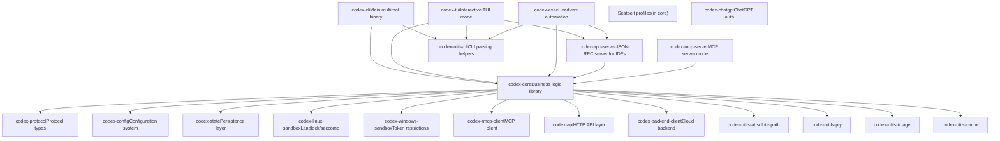
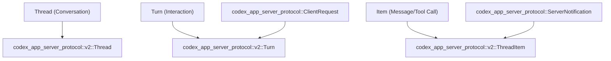
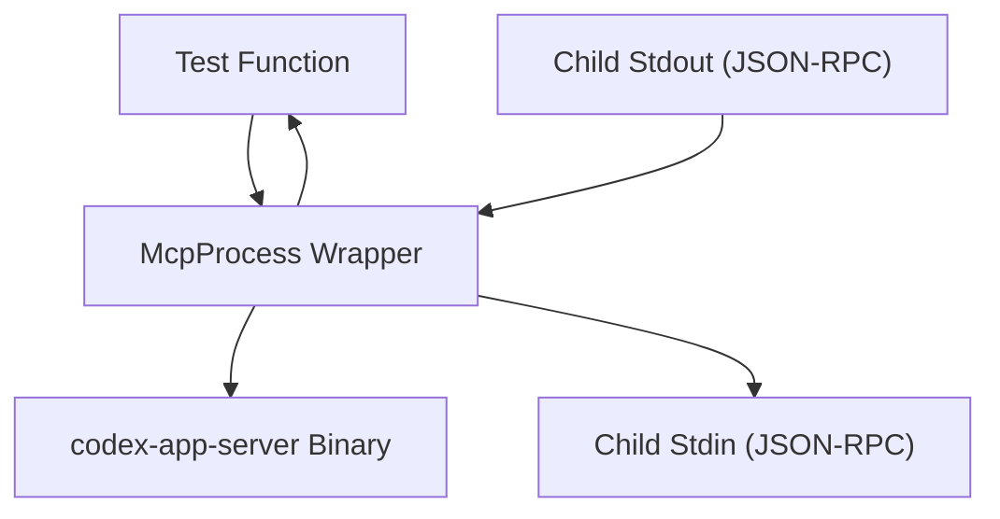

# 代码组织模式

相关源文件

-   [AGENTS.md](https://github.com/openai/codex/blob/d807d44a/AGENTS.md?plain=1)
-   [codex-rs/app-server-protocol/schema/json/ClientRequest.json](https://github.com/openai/codex/blob/d807d44a/codex-rs/app-server-protocol/schema/json/ClientRequest.json)
-   [codex-rs/app-server-protocol/schema/json/ServerNotification.json](https://github.com/openai/codex/blob/d807d44a/codex-rs/app-server-protocol/schema/json/ServerNotification.json)
-   [codex-rs/app-server-protocol/schema/json/codex\_app\_server\_protocol.schemas.json](https://github.com/openai/codex/blob/d807d44a/codex-rs/app-server-protocol/schema/json/codex_app_server_protocol.schemas.json)
-   [codex-rs/app-server-protocol/schema/json/codex\_app\_server\_protocol.v2.schemas.json](https://github.com/openai/codex/blob/d807d44a/codex-rs/app-server-protocol/schema/json/codex_app_server_protocol.v2.schemas.json)
-   [codex-rs/app-server-protocol/schema/typescript/ServerNotification.ts](https://github.com/openai/codex/blob/d807d44a/codex-rs/app-server-protocol/schema/typescript/ServerNotification.ts)
-   [codex-rs/app-server-protocol/schema/typescript/v2/index.ts](https://github.com/openai/codex/blob/d807d44a/codex-rs/app-server-protocol/schema/typescript/v2/index.ts)
-   [codex-rs/app-server-protocol/src/protocol/common.rs](https://github.com/openai/codex/blob/d807d44a/codex-rs/app-server-protocol/src/protocol/common.rs)
-   [codex-rs/app-server-protocol/src/protocol/v2.rs](https://github.com/openai/codex/blob/d807d44a/codex-rs/app-server-protocol/src/protocol/v2.rs)
-   [codex-rs/app-server/README.md](https://github.com/openai/codex/blob/d807d44a/codex-rs/app-server/README.md?plain=1)
-   [codex-rs/app-server/src/bespoke\_event\_handling.rs](https://github.com/openai/codex/blob/d807d44a/codex-rs/app-server/src/bespoke_event_handling.rs)
-   [codex-rs/app-server/src/codex\_message\_processor.rs](https://github.com/openai/codex/blob/d807d44a/codex-rs/app-server/src/codex_message_processor.rs)
-   [codex-rs/app-server/tests/common/mcp\_process.rs](https://github.com/openai/codex/blob/d807d44a/codex-rs/app-server/tests/common/mcp_process.rs)
-   [codex-rs/app-server/tests/suite/v2/mod.rs](https://github.com/openai/codex/blob/d807d44a/codex-rs/app-server/tests/suite/v2/mod.rs)
-   [docs/authentication.md](https://github.com/openai/codex/blob/d807d44a/docs/authentication.md?plain=1)
-   [docs/contributing.md](https://github.com/openai/codex/blob/d807d44a/docs/contributing.md?plain=1)
-   [docs/exec.md](https://github.com/openai/codex/blob/d807d44a/docs/exec.md?plain=1)
-   [docs/getting-started.md](https://github.com/openai/codex/blob/d807d44a/docs/getting-started.md?plain=1)
-   [docs/install.md](https://github.com/openai/codex/blob/d807d44a/docs/install.md?plain=1)
-   [docs/license.md](https://github.com/openai/codex/blob/d807d44a/docs/license.md?plain=1)
-   [docs/open-source-fund.md](https://github.com/openai/codex/blob/d807d44a/docs/open-source-fund.md?plain=1)
-   [docs/sandbox.md](https://github.com/openai/codex/blob/d807d44a/docs/sandbox.md?plain=1)
-   [justfile](https://github.com/openai/codex/blob/d807d44a/justfile)

## 目的与范围

本页记录在 Codex Rust 代码库中使用的代码组织模式、约定与架构指南。内容涵盖工作区结构、crate 分类、模块组织、平台特定代码处理，以及代码质量强制机制。

关键架构驱动因素包括用于 AI 辅助开发的 **AGENTS.md** 约定、用于 IDE 集成的 **app-server protocol v2**，以及工作区级别的严格 **Clippy** 约束。

---

## 工作区结构与 Crate 分类

Codex 代码库组织为一个 Cargo workspace，包含 71+ 个 crate，每个 crate 都具有聚焦职责。工作区根 [codex-rs/Cargo.toml1-395](https://github.com/openai/codex/blob/d807d44a/codex-rs/Cargo.toml#L1-L395) 定义了共享依赖、lint 与构建 profile。

### Crate 类别


**Sources:** [codex-rs/Cargo.toml1-71](https://github.com/openai/codex/blob/d807d44a/codex-rs/Cargo.toml#L1-L71) [codex-rs/app-server/README.md1-12](https://github.com/openai/codex/blob/d807d44a/codex-rs/app-server/README.md?plain=1#L1-L12)

### 工作区级配置

工作区通过根 `Cargo.toml` 中的集中式配置强制一致性。

| Configuration Type | Location | Purpose |
| --- | --- | --- |
| **Edition** | `workspace.edition = "2024"` | 所有 crate 使用 Rust 2024 edition |
| **Version** | `workspace.version = "0.0.0"` | 工作区统一版本 |
| **Dependencies** | `[workspace.dependencies]` | 版本单一事实来源 |
| **Lints** | `[workspace.lints.clippy]` | 强制严格 clippy 规则 |
| **Build Profiles** | `[profile.release]`, `[profile.ci-test]` | 优化发布构建，快速 CI 构建 |

**Sources:** [codex-rs/Cargo.toml74-81](https://github.com/openai/codex/blob/d807d44a/codex-rs/Cargo.toml#L74-L81) [codex-rs/Cargo.toml367-380](https://github.com/openai/codex/blob/d807d44a/codex-rs/Cargo.toml#L367-L380)

---

## AGENTS.md 约定

`AGENTS.md` 文件定义了关键开发模式与安全规则，人类与 AI 贡献者都必须遵守。

### 核心开发规则

-   **模块大小：** Rust 模块目标应小于 500 LoC。若文件超过 800 LoC，必须将功能迁移到新模块 [AGENTS.md32-37](https://github.com/openai/codex/blob/d807d44a/AGENTS.md?plain=1#L32-L37)
-   **安全限制：** 绝不修改与 `CODEX_SANDBOX_NETWORK_DISABLED_ENV_VAR` 或 `CODEX_SANDBOX_ENV_VAR` 相关代码，因为它们负责执行环境安全 [AGENTS.md8-10](https://github.com/openai/codex/blob/d807d44a/AGENTS.md?plain=1#L8-L10)
-   **显式参数：** 在不透明字面量参数（例如 `None`、`false`）前使用 `/*param_name*/` 注释，以保持可读性 [AGENTS.md15-18](https://github.com/openai/codex/blob/d807d44a/AGENTS.md?plain=1#L15-L18)
-   **依赖管理：** 对 `Cargo.toml` 的变更需要运行 `just bazel-lock-update`，以保持 Bazel 构建同步 [AGENTS.md23-26](https://github.com/openai/codex/blob/d807d44a/AGENTS.md?plain=1#L23-L26)

### TUI 样式指南

-   **Stylize Trait：** 相比手动构造 `Style`，优先使用 `ratatui` 的 `Stylize` trait 辅助方法（例如 `.red()`、`.dim()`）[AGENTS.md61-64](https://github.com/openai/codex/blob/d807d44a/AGENTS.md?plain=1#L61-L64)
-   **颜色使用：** 避免硬编码 `.white()`；改用默认前景色 [AGENTS.md73-74](https://github.com/openai/codex/blob/d807d44a/AGENTS.md?plain=1#L73-L74)

**Sources:** [AGENTS.md1-80](https://github.com/openai/codex/blob/d807d44a/AGENTS.md?plain=1#L1-L80)

---

## App Server Protocol v2 模式

`codex-app-server` 实现了 JSON-RPC 2.0 双向协议 [codex-rs/app-server/README.md20-25](https://github.com/openai/codex/blob/d807d44a/codex-rs/app-server/README.md?plain=1#L20-L25)。协议版本 2 聚焦 camelCase 序列化，并与 core 类型清晰分离。

### 协议分层

协议拆分为 `common`、`v1` 与 `v2` 模块。`v2` 类型通常映射 core 类型，但使用更友好的 API 命名 [codex-rs/app-server-protocol/src/protocol/v2.rs100-129](https://github.com/openai/codex/blob/d807d44a/codex-rs/app-server-protocol/src/protocol/v2.rs#L100-L129)


**Sources:** [codex-rs/app-server-protocol/src/protocol/v2.rs1-150](https://github.com/openai/codex/blob/d807d44a/codex-rs/app-server-protocol/src/protocol/v2.rs#L1-L150) [codex-rs/app-server/README.md57-66](https://github.com/openai/codex/blob/d807d44a/codex-rs/app-server/README.md?plain=1#L57-L66)

### 消息处理与转换

`CodexMessageProcessor` 将传入的 JSON-RPC 请求路由到 core 函数 [codex-rs/app-server/src/codex\_message\_processor.rs1-100](https://github.com/openai/codex/blob/d807d44a/codex-rs/app-server/src/codex_message_processor.rs#L1-L100)。专门事件处理会将 core `EventMsg` 项转换为协议兼容的通知 [codex-rs/app-server/src/bespoke\_event\_handling.rs1-106](https://github.com/openai/codex/blob/d807d44a/codex-rs/app-server/src/bespoke_event_handling.rs#L1-L106)

**Sources:** [codex-rs/app-server/src/codex\_message\_processor.rs1-40](https://github.com/openai/codex/blob/d807d44a/codex-rs/app-server/src/codex_message_processor.rs#L1-L40) [codex-rs/app-server/src/bespoke\_event\_handling.rs97-125](https://github.com/openai/codex/blob/d807d44a/codex-rs/app-server/src/bespoke_event_handling.rs#L97-L125)

---

## 代码质量与强制机制

### 工作区级 Lint

工作区强制严格的 Clippy 规则，以确保安全性与代码一致性。

```
[workspace.lints.clippy]expect_used = "deny"          # Force error handlingunwrap_used = "deny"          # Prevent panicsmanual_clamp = "deny"         # Use idiomatic Rustuninlined_format_args = "deny" # AGENTS.md requirement
```
**Sources:** [codex-rs/Cargo.toml319-356](https://github.com/openai/codex/blob/d807d44a/codex-rs/Cargo.toml#L319-L356) [AGENTS.md11-14](https://github.com/openai/codex/blob/d807d44a/AGENTS.md?plain=1#L11-L14)

### Library 与 Exec 模式约束

-   **Core/TUI:** 禁止直接写控制台，以确保所有日志都经过 tracing subscriber [codex-rs/core/src/lib.rs4-6](https://github.com/openai/codex/blob/d807d44a/codex-rs/core/src/lib.rs#L4-L6)
-   **Exec Mode:** 严格控制 stdout，确保机器可解析输出（JSONL）不被日志污染 [codex-rs/exec/src/lib.rs1-5](https://github.com/openai/codex/blob/d807d44a/codex-rs/exec/src/lib.rs#L1-L5)

---

## 测试基础设施模式

测试组织为集成测试套件，并且通常会启动 `codex-app-server` 二进制以验证端到端协议行为。

### McpProcess 模式

测试使用 `McpProcess` 结构体管理后台 app-server 实例的生命周期 [codex-rs/app-server/tests/common/mcp\_process.rs83-93](https://github.com/openai/codex/blob/d807d44a/codex-rs/app-server/tests/common/mcp_process.rs#L83-L93)


**Sources:** [codex-rs/app-server/tests/common/mcp\_process.rs123-150](https://github.com/openai/codex/blob/d807d44a/codex-rs/app-server/tests/common/mcp_process.rs#L123-L150) [codex-rs/app-server/tests/suite/v2/mod.rs1-20](https://github.com/openai/codex/blob/d807d44a/codex-rs/app-server/tests/suite/v2/mod.rs#L1-L20)

---

## 模式总结

1.  **Crate 前缀：** 所有内部 crate 使用 `codex-` 前缀（例如 `codex-core`、`codex-tui`）[AGENTS.md5](https://github.com/openai/codex/blob/d807d44a/AGENTS.md?plain=1#L5-L5)
2.  **扁平模块声明：** Core crate 在根级声明模块并重新导出类型，以提供整洁的公共 API [codex-rs/core/src/lib.rs1-178](https://github.com/openai/codex/blob/d807d44a/codex-rs/core/src/lib.rs#L1-L178)
3.  **Protocol v2 握手：** 客户端必须在其他 RPC 方法之前调用 `initialize` [codex-rs/app-server/README.md69-75](https://github.com/openai/codex/blob/d807d44a/codex-rs/app-server/README.md?plain=1#L69-L75)
4.  **条件编译：** 平台特定逻辑（Sandboxing、Keyring）通过 `Cargo.toml` 中的 `target_os` 属性门控 [codex-rs/core/Cargo.toml120-147](https://github.com/openai/codex/blob/d807d44a/codex-rs/core/Cargo.toml#L120-L147)

**Sources:** [AGENTS.md1-80](https://github.com/openai/codex/blob/d807d44a/AGENTS.md?plain=1#L1-L80) [codex-rs/Cargo.toml1-395](https://github.com/openai/codex/blob/d807d44a/codex-rs/Cargo.toml#L1-L395) [codex-rs/app-server/README.md1-150](https://github.com/openai/codex/blob/d807d44a/codex-rs/app-server/README.md?plain=1#L1-L150)
