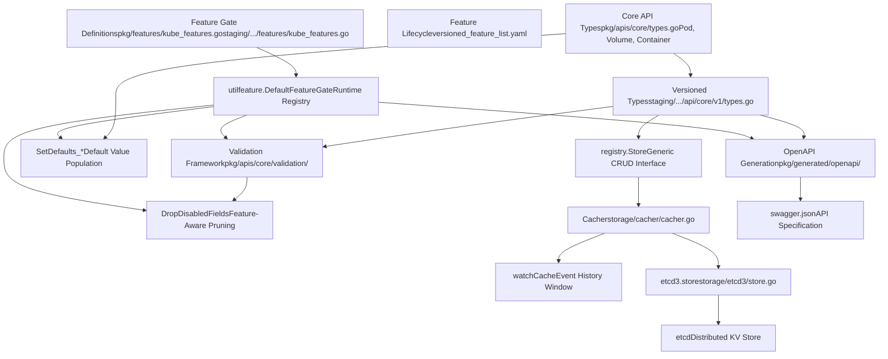
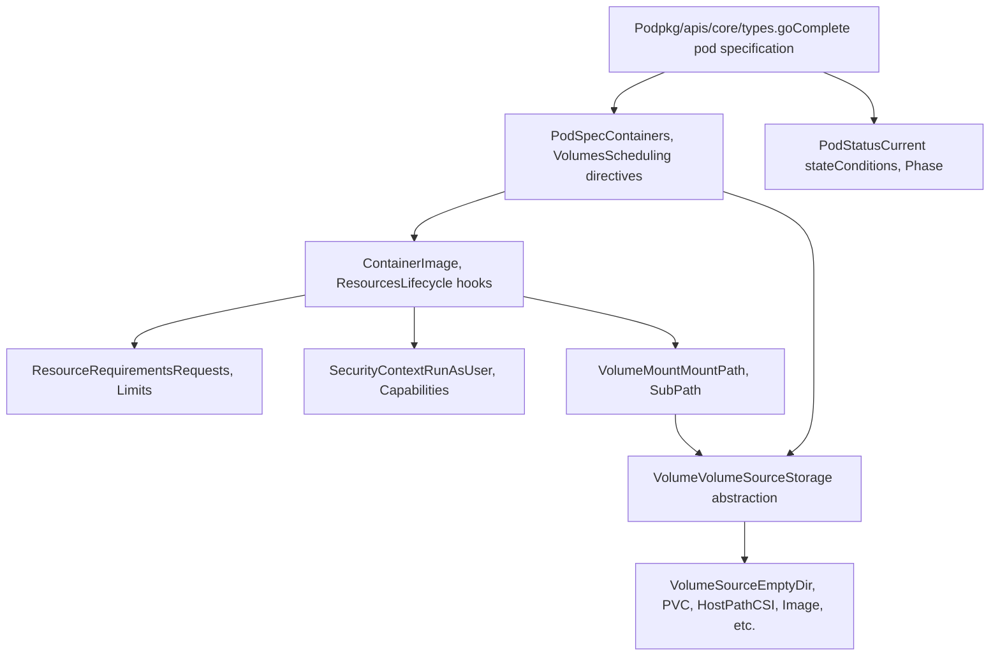
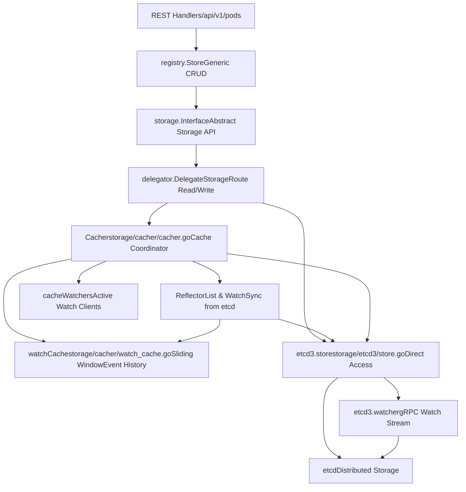

# 核心 API 系统与特性管理

相关源文件

-   [api/openapi-spec/swagger.json](https://github.com/kubernetes/kubernetes/blob/2757a872/api/openapi-spec/swagger.json)
-   [api/openapi-spec/v3/api\_\_v1\_openapi.json](https://github.com/kubernetes/kubernetes/blob/2757a872/api/openapi-spec/v3/api__v1_openapi.json)
-   [api/openapi-spec/v3/apis\_\_admissionregistration.k8s.io\_\_v1\_openapi.json](https://github.com/kubernetes/kubernetes/blob/2757a872/api/openapi-spec/v3/apis__admissionregistration.k8s.io__v1_openapi.json)
-   [api/openapi-spec/v3/apis\_\_apiextensions.k8s.io\_\_v1\_openapi.json](https://github.com/kubernetes/kubernetes/blob/2757a872/api/openapi-spec/v3/apis__apiextensions.k8s.io__v1_openapi.json)
-   [api/openapi-spec/v3/apis\_\_apps\_\_v1\_openapi.json](https://github.com/kubernetes/kubernetes/blob/2757a872/api/openapi-spec/v3/apis__apps__v1_openapi.json)
-   [api/openapi-spec/v3/apis\_\_autoscaling\_\_v1\_openapi.json](https://github.com/kubernetes/kubernetes/blob/2757a872/api/openapi-spec/v3/apis__autoscaling__v1_openapi.json)
-   [api/openapi-spec/v3/apis\_\_autoscaling\_\_v2\_openapi.json](https://github.com/kubernetes/kubernetes/blob/2757a872/api/openapi-spec/v3/apis__autoscaling__v2_openapi.json)
-   [api/openapi-spec/v3/apis\_\_batch\_\_v1\_openapi.json](https://github.com/kubernetes/kubernetes/blob/2757a872/api/openapi-spec/v3/apis__batch__v1_openapi.json)
-   [api/openapi-spec/v3/apis\_\_certificates.k8s.io\_\_v1\_openapi.json](https://github.com/kubernetes/kubernetes/blob/2757a872/api/openapi-spec/v3/apis__certificates.k8s.io__v1_openapi.json)
-   [api/openapi-spec/v3/apis\_\_coordination.k8s.io\_\_v1\_openapi.json](https://github.com/kubernetes/kubernetes/blob/2757a872/api/openapi-spec/v3/apis__coordination.k8s.io__v1_openapi.json)
-   [api/openapi-spec/v3/apis\_\_internal.apiserver.k8s.io\_\_v1alpha1\_openapi.json](https://github.com/kubernetes/kubernetes/blob/2757a872/api/openapi-spec/v3/apis__internal.apiserver.k8s.io__v1alpha1_openapi.json)
-   [api/openapi-spec/v3/apis\_\_networking.k8s.io\_\_v1\_openapi.json](https://github.com/kubernetes/kubernetes/blob/2757a872/api/openapi-spec/v3/apis__networking.k8s.io__v1_openapi.json)
-   [api/openapi-spec/v3/apis\_\_node.k8s.io\_\_v1\_openapi.json](https://github.com/kubernetes/kubernetes/blob/2757a872/api/openapi-spec/v3/apis__node.k8s.io__v1_openapi.json)
-   [api/openapi-spec/v3/apis\_\_policy\_\_v1\_openapi.json](https://github.com/kubernetes/kubernetes/blob/2757a872/api/openapi-spec/v3/apis__policy__v1_openapi.json)
-   [api/openapi-spec/v3/apis\_\_rbac.authorization.k8s.io\_\_v1\_openapi.json](https://github.com/kubernetes/kubernetes/blob/2757a872/api/openapi-spec/v3/apis__rbac.authorization.k8s.io__v1_openapi.json)
-   [api/openapi-spec/v3/apis\_\_storage.k8s.io\_\_v1\_openapi.json](https://github.com/kubernetes/kubernetes/blob/2757a872/api/openapi-spec/v3/apis__storage.k8s.io__v1_openapi.json)
-   [pkg/api/pod/util.go](https://github.com/kubernetes/kubernetes/blob/2757a872/pkg/api/pod/util.go)
-   [pkg/api/pod/util\_test.go](https://github.com/kubernetes/kubernetes/blob/2757a872/pkg/api/pod/util_test.go)
-   [pkg/api/v1/pod/util.go](https://github.com/kubernetes/kubernetes/blob/2757a872/pkg/api/v1/pod/util.go)
-   [pkg/api/v1/pod/util\_test.go](https://github.com/kubernetes/kubernetes/blob/2757a872/pkg/api/v1/pod/util_test.go)
-   [pkg/apis/core/fuzzer/fuzzer.go](https://github.com/kubernetes/kubernetes/blob/2757a872/pkg/apis/core/fuzzer/fuzzer.go)
-   [pkg/apis/core/types.go](https://github.com/kubernetes/kubernetes/blob/2757a872/pkg/apis/core/types.go)
-   [pkg/apis/core/v1/defaults.go](https://github.com/kubernetes/kubernetes/blob/2757a872/pkg/apis/core/v1/defaults.go)
-   [pkg/apis/core/v1/defaults\_test.go](https://github.com/kubernetes/kubernetes/blob/2757a872/pkg/apis/core/v1/defaults_test.go)
-   [pkg/apis/core/v1/zz\_generated.conversion.go](https://github.com/kubernetes/kubernetes/blob/2757a872/pkg/apis/core/v1/zz_generated.conversion.go)
-   [pkg/apis/core/validation/validation.go](https://github.com/kubernetes/kubernetes/blob/2757a872/pkg/apis/core/validation/validation.go)
-   [pkg/apis/core/validation/validation\_test.go](https://github.com/kubernetes/kubernetes/blob/2757a872/pkg/apis/core/validation/validation_test.go)
-   [pkg/apis/core/zz\_generated.deepcopy.go](https://github.com/kubernetes/kubernetes/blob/2757a872/pkg/apis/core/zz_generated.deepcopy.go)
-   [pkg/features/kube\_features.go](https://github.com/kubernetes/kubernetes/blob/2757a872/pkg/features/kube_features.go)
-   [pkg/generated/openapi/zz\_generated.openapi.go](https://github.com/kubernetes/kubernetes/blob/2757a872/pkg/generated/openapi/zz_generated.openapi.go)
-   [pkg/kubelet/status/generate.go](https://github.com/kubernetes/kubernetes/blob/2757a872/pkg/kubelet/status/generate.go)
-   [pkg/kubelet/status/generate\_test.go](https://github.com/kubernetes/kubernetes/blob/2757a872/pkg/kubelet/status/generate_test.go)
-   [pkg/kubelet/types/constants.go](https://github.com/kubernetes/kubernetes/blob/2757a872/pkg/kubelet/types/constants.go)
-   [pkg/kubelet/types/pod\_status.go](https://github.com/kubernetes/kubernetes/blob/2757a872/pkg/kubelet/types/pod_status.go)
-   [pkg/kubelet/types/pod\_status\_test.go](https://github.com/kubernetes/kubernetes/blob/2757a872/pkg/kubelet/types/pod_status_test.go)
-   [pkg/registry/core/pod/strategy.go](https://github.com/kubernetes/kubernetes/blob/2757a872/pkg/registry/core/pod/strategy.go)
-   [pkg/registry/core/pod/strategy\_test.go](https://github.com/kubernetes/kubernetes/blob/2757a872/pkg/registry/core/pod/strategy_test.go)
-   [staging/src/k8s.io/api/core/v1/generated.pb.go](https://github.com/kubernetes/kubernetes/blob/2757a872/staging/src/k8s.io/api/core/v1/generated.pb.go)
-   [staging/src/k8s.io/api/core/v1/generated.proto](https://github.com/kubernetes/kubernetes/blob/2757a872/staging/src/k8s.io/api/core/v1/generated.proto)
-   [staging/src/k8s.io/api/core/v1/types.go](https://github.com/kubernetes/kubernetes/blob/2757a872/staging/src/k8s.io/api/core/v1/types.go)
-   [staging/src/k8s.io/api/core/v1/types\_swagger\_doc\_generated.go](https://github.com/kubernetes/kubernetes/blob/2757a872/staging/src/k8s.io/api/core/v1/types_swagger_doc_generated.go)
-   [staging/src/k8s.io/api/core/v1/zz\_generated.deepcopy.go](https://github.com/kubernetes/kubernetes/blob/2757a872/staging/src/k8s.io/api/core/v1/zz_generated.deepcopy.go)
-   [staging/src/k8s.io/apiserver/pkg/features/kube\_features.go](https://github.com/kubernetes/kubernetes/blob/2757a872/staging/src/k8s.io/apiserver/pkg/features/kube_features.go)
-   [staging/src/k8s.io/apiserver/pkg/registry/generic/options.go](https://github.com/kubernetes/kubernetes/blob/2757a872/staging/src/k8s.io/apiserver/pkg/registry/generic/options.go)
-   [staging/src/k8s.io/apiserver/pkg/registry/generic/registry/dryrun.go](https://github.com/kubernetes/kubernetes/blob/2757a872/staging/src/k8s.io/apiserver/pkg/registry/generic/registry/dryrun.go)
-   [staging/src/k8s.io/apiserver/pkg/registry/generic/registry/storage\_factory.go](https://github.com/kubernetes/kubernetes/blob/2757a872/staging/src/k8s.io/apiserver/pkg/registry/generic/registry/storage_factory.go)
-   [staging/src/k8s.io/apiserver/pkg/registry/generic/registry/store.go](https://github.com/kubernetes/kubernetes/blob/2757a872/staging/src/k8s.io/apiserver/pkg/registry/generic/registry/store.go)
-   [staging/src/k8s.io/apiserver/pkg/registry/generic/registry/store\_test.go](https://github.com/kubernetes/kubernetes/blob/2757a872/staging/src/k8s.io/apiserver/pkg/registry/generic/registry/store_test.go)
-   [staging/src/k8s.io/apiserver/pkg/registry/generic/storage\_decorator.go](https://github.com/kubernetes/kubernetes/blob/2757a872/staging/src/k8s.io/apiserver/pkg/registry/generic/storage_decorator.go)
-   [staging/src/k8s.io/apiserver/pkg/storage/cacher/cache\_watcher.go](https://github.com/kubernetes/kubernetes/blob/2757a872/staging/src/k8s.io/apiserver/pkg/storage/cacher/cache_watcher.go)
-   [staging/src/k8s.io/apiserver/pkg/storage/cacher/cache\_watcher\_test.go](https://github.com/kubernetes/kubernetes/blob/2757a872/staging/src/k8s.io/apiserver/pkg/storage/cacher/cache_watcher_test.go)
-   [staging/src/k8s.io/apiserver/pkg/storage/cacher/cacher.go](https://github.com/kubernetes/kubernetes/blob/2757a872/staging/src/k8s.io/apiserver/pkg/storage/cacher/cacher.go)
-   [staging/src/k8s.io/apiserver/pkg/storage/cacher/cacher\_test.go](https://github.com/kubernetes/kubernetes/blob/2757a872/staging/src/k8s.io/apiserver/pkg/storage/cacher/cacher_test.go)
-   [staging/src/k8s.io/apiserver/pkg/storage/cacher/cacher\_testing\_utils\_test.go](https://github.com/kubernetes/kubernetes/blob/2757a872/staging/src/k8s.io/apiserver/pkg/storage/cacher/cacher_testing_utils_test.go)
-   [staging/src/k8s.io/apiserver/pkg/storage/cacher/cacher\_whitebox\_test.go](https://github.com/kubernetes/kubernetes/blob/2757a872/staging/src/k8s.io/apiserver/pkg/storage/cacher/cacher_whitebox_test.go)
-   [staging/src/k8s.io/apiserver/pkg/storage/cacher/delegator.go](https://github.com/kubernetes/kubernetes/blob/2757a872/staging/src/k8s.io/apiserver/pkg/storage/cacher/delegator.go)
-   [staging/src/k8s.io/apiserver/pkg/storage/cacher/delegator\_test.go](https://github.com/kubernetes/kubernetes/blob/2757a872/staging/src/k8s.io/apiserver/pkg/storage/cacher/delegator_test.go)
-   [staging/src/k8s.io/apiserver/pkg/storage/cacher/lister\_watcher.go](https://github.com/kubernetes/kubernetes/blob/2757a872/staging/src/k8s.io/apiserver/pkg/storage/cacher/lister_watcher.go)
-   [staging/src/k8s.io/apiserver/pkg/storage/cacher/lister\_watcher\_test.go](https://github.com/kubernetes/kubernetes/blob/2757a872/staging/src/k8s.io/apiserver/pkg/storage/cacher/lister_watcher_test.go)
-   [staging/src/k8s.io/apiserver/pkg/storage/cacher/metrics/metrics.go](https://github.com/kubernetes/kubernetes/blob/2757a872/staging/src/k8s.io/apiserver/pkg/storage/cacher/metrics/metrics.go)
-   [staging/src/k8s.io/apiserver/pkg/storage/cacher/store/store.go](https://github.com/kubernetes/kubernetes/blob/2757a872/staging/src/k8s.io/apiserver/pkg/storage/cacher/store/store.go)
-   [staging/src/k8s.io/apiserver/pkg/storage/cacher/store/store\_btree.go](https://github.com/kubernetes/kubernetes/blob/2757a872/staging/src/k8s.io/apiserver/pkg/storage/cacher/store/store_btree.go)
-   [staging/src/k8s.io/apiserver/pkg/storage/cacher/store/store\_btree\_test.go](https://github.com/kubernetes/kubernetes/blob/2757a872/staging/src/k8s.io/apiserver/pkg/storage/cacher/store/store_btree_test.go)
-   [staging/src/k8s.io/apiserver/pkg/storage/cacher/store/store\_test.go](https://github.com/kubernetes/kubernetes/blob/2757a872/staging/src/k8s.io/apiserver/pkg/storage/cacher/store/store_test.go)
-   [staging/src/k8s.io/apiserver/pkg/storage/cacher/watch\_cache.go](https://github.com/kubernetes/kubernetes/blob/2757a872/staging/src/k8s.io/apiserver/pkg/storage/cacher/watch_cache.go)
-   [staging/src/k8s.io/apiserver/pkg/storage/cacher/watch\_cache\_interval.go](https://github.com/kubernetes/kubernetes/blob/2757a872/staging/src/k8s.io/apiserver/pkg/storage/cacher/watch_cache_interval.go)
-   [staging/src/k8s.io/apiserver/pkg/storage/cacher/watch\_cache\_interval\_test.go](https://github.com/kubernetes/kubernetes/blob/2757a872/staging/src/k8s.io/apiserver/pkg/storage/cacher/watch_cache_interval_test.go)
-   [staging/src/k8s.io/apiserver/pkg/storage/cacher/watch\_cache\_test.go](https://github.com/kubernetes/kubernetes/blob/2757a872/staging/src/k8s.io/apiserver/pkg/storage/cacher/watch_cache_test.go)
-   [staging/src/k8s.io/apiserver/pkg/storage/etcd3/event.go](https://github.com/kubernetes/kubernetes/blob/2757a872/staging/src/k8s.io/apiserver/pkg/storage/etcd3/event.go)
-   [staging/src/k8s.io/apiserver/pkg/storage/etcd3/event\_test.go](https://github.com/kubernetes/kubernetes/blob/2757a872/staging/src/k8s.io/apiserver/pkg/storage/etcd3/event_test.go)
-   [staging/src/k8s.io/apiserver/pkg/storage/etcd3/store.go](https://github.com/kubernetes/kubernetes/blob/2757a872/staging/src/k8s.io/apiserver/pkg/storage/etcd3/store.go)
-   [staging/src/k8s.io/apiserver/pkg/storage/etcd3/store\_test.go](https://github.com/kubernetes/kubernetes/blob/2757a872/staging/src/k8s.io/apiserver/pkg/storage/etcd3/store_test.go)
-   [staging/src/k8s.io/apiserver/pkg/storage/etcd3/watcher.go](https://github.com/kubernetes/kubernetes/blob/2757a872/staging/src/k8s.io/apiserver/pkg/storage/etcd3/watcher.go)
-   [staging/src/k8s.io/apiserver/pkg/storage/etcd3/watcher\_test.go](https://github.com/kubernetes/kubernetes/blob/2757a872/staging/src/k8s.io/apiserver/pkg/storage/etcd3/watcher_test.go)
-   [staging/src/k8s.io/apiserver/pkg/storage/interfaces.go](https://github.com/kubernetes/kubernetes/blob/2757a872/staging/src/k8s.io/apiserver/pkg/storage/interfaces.go)
-   [staging/src/k8s.io/apiserver/pkg/storage/testing/store\_benchmarks.go](https://github.com/kubernetes/kubernetes/blob/2757a872/staging/src/k8s.io/apiserver/pkg/storage/testing/store_benchmarks.go)
-   [staging/src/k8s.io/apiserver/pkg/storage/testing/store\_tests.go](https://github.com/kubernetes/kubernetes/blob/2757a872/staging/src/k8s.io/apiserver/pkg/storage/testing/store_tests.go)
-   [staging/src/k8s.io/apiserver/pkg/storage/testing/utils.go](https://github.com/kubernetes/kubernetes/blob/2757a872/staging/src/k8s.io/apiserver/pkg/storage/testing/utils.go)
-   [staging/src/k8s.io/apiserver/pkg/storage/testing/watcher\_tests.go](https://github.com/kubernetes/kubernetes/blob/2757a872/staging/src/k8s.io/apiserver/pkg/storage/testing/watcher_tests.go)
-   [staging/src/k8s.io/apiserver/pkg/storage/util.go](https://github.com/kubernetes/kubernetes/blob/2757a872/staging/src/k8s.io/apiserver/pkg/storage/util.go)
-   [staging/src/k8s.io/apiserver/pkg/storage/util\_test.go](https://github.com/kubernetes/kubernetes/blob/2757a872/staging/src/k8s.io/apiserver/pkg/storage/util_test.go)
-   [staging/src/k8s.io/client-go/applyconfigurations/internal/internal.go](https://github.com/kubernetes/kubernetes/blob/2757a872/staging/src/k8s.io/client-go/applyconfigurations/internal/internal.go)
-   [staging/src/k8s.io/client-go/applyconfigurations/utils.go](https://github.com/kubernetes/kubernetes/blob/2757a872/staging/src/k8s.io/client-go/applyconfigurations/utils.go)
-   [test/compatibility\_lifecycle/reference/feature\_list.md](https://github.com/kubernetes/kubernetes/blob/2757a872/test/compatibility_lifecycle/reference/feature_list.md?plain=1)
-   [test/compatibility\_lifecycle/reference/versioned\_feature\_list.yaml](https://github.com/kubernetes/kubernetes/blob/2757a872/test/compatibility_lifecycle/reference/versioned_feature_list.yaml)
-   [test/integration/metrics/metrics\_test.go](https://github.com/kubernetes/kubernetes/blob/2757a872/test/integration/metrics/metrics_test.go)
-   [test/integration/scheduler\_perf/dra/dra\_test.go](https://github.com/kubernetes/kubernetes/blob/2757a872/test/integration/scheduler_perf/dra/dra_test.go)

## 目的与范围

本页记录 Kubernetes 的基础层：API 对象模型、特性门控系统、校验框架以及存储后端。这些系统协同工作，用于定义 Kubernetes 中存在哪些对象、这些对象如何随时间演进、如何被校验以及如何被持久化。

关于以下主题的详细信息：

-   特性门控生命周期与 Alpha→Beta→GA 的演进，请参见 [Feature Gates and Lifecycle](/kubernetes/kubernetes/2.1-feature-gates-and-lifecycle)
-   API 类型定义、校验规则与字段裁剪，请参见 [API Object Types and Validation](/kubernetes/kubernetes/2.2-api-object-types-and-validation)
-   存储后端实现与缓存机制，请参见 [Storage Backend and Caching](/kubernetes/kubernetes/2.3-storage-backend-and-caching)

## 系统概览

核心 API 系统由三个互联的子系统组成：

1.  **Feature Gate System**：通过明确的生命周期（Alpha → Beta → GA → Locked → Removed）控制功能在所有 Kubernetes 组件中的演进式发布

2.  **API Object Model and Validation**：定义 Kubernetes 对象（Pod、Volume、Container 等）的结构，并强制执行可受特性门控控制的校验规则

3.  **Storage Backend and Caching**：将 API 对象持久化到 etcd，并提供复杂的缓存层以降低 etcd 负载、提升读取性能


## 系统集成架构


**系统集成流程**：特性门控控制哪些 API 字段可用。校验逻辑使用特性门控来判定字段有效性。默认值根据已启用特性进行填充。存储层通过缓存层将已校验对象持久化到 etcd。OpenAPI 规范会反映当前特性门控配置。

来源：[pkg/features/kube\_features.go1-1000](https://github.com/kubernetes/kubernetes/blob/2757a872/pkg/features/kube_features.go#L1-L1000) [staging/src/k8s.io/apiserver/pkg/features/kube\_features.go1-300](https://github.com/kubernetes/kubernetes/blob/2757a872/staging/src/k8s.io/apiserver/pkg/features/kube_features.go#L1-L300) [pkg/apis/core/validation/validation.go1-100](https://github.com/kubernetes/kubernetes/blob/2757a872/pkg/apis/core/validation/validation.go#L1-L100) [staging/src/k8s.io/apiserver/pkg/storage/cacher/cacher.go1-200](https://github.com/kubernetes/kubernetes/blob/2757a872/staging/src/k8s.io/apiserver/pkg/storage/cacher/cacher.go#L1-L200) [staging/src/k8s.io/apiserver/pkg/storage/etcd3/store.go1-100](https://github.com/kubernetes/kubernetes/blob/2757a872/staging/src/k8s.io/apiserver/pkg/storage/etcd3/store.go#L1-L100)

## 特性门控系统

特性门控系统为 Kubernetes 提供了受控的功能发布能力。每个特性门控都会经历定义明确的生命周期，并在每个阶段具有特定的默认设置和稳定性保证。

### 特性门控定义

特性门控定义于 [pkg/features/kube\_features.go41-1000](https://github.com/kubernetes/kubernetes/blob/2757a872/pkg/features/kube_features.go#L41-L1000) 与 [staging/src/k8s.io/apiserver/pkg/features/kube\_features.go36-200](https://github.com/kubernetes/kubernetes/blob/2757a872/staging/src/k8s.io/apiserver/pkg/features/kube_features.go#L36-L200)，每个特性都以常量形式声明：

| Property | Description | Example |
| --- | --- | --- |
| Name | 唯一标识符 | `ImageVolume`, `DynamicResourceAllocation` |
| Owner | 责任维护者 | `@saschagrunert`, `@pohly` |
| KEP | 增强提案链接 | `https://kep.k8s.io/4639` |
| Stage | 当前生命周期阶段 | Alpha, Beta, GA, Locked, Deprecated |
| Default | 是否默认启用 | `true` 或 `false` |

来自 [pkg/features/kube\_features.go373-395](https://github.com/kubernetes/kubernetes/blob/2757a872/pkg/features/kube_features.go#L373-L395) 的特性门控定义示例：

```
// ImageVolume enables the image volume sourceImageVolume featuregate.Feature = "ImageVolume" // InPlacePodVerticalScaling enables In-Place Pod Vertical Scaling  InPlacePodVerticalScaling featuregate.Feature = "InPlacePodVerticalScaling" // DynamicResourceAllocation enables support for resources with custom parametersDynamicResourceAllocation featuregate.Feature = "DynamicResourceAllocation"
```
来源：[pkg/features/kube\_features.go31-1000](https://github.com/kubernetes/kubernetes/blob/2757a872/pkg/features/kube_features.go#L31-L1000) [staging/src/k8s.io/apiserver/pkg/features/kube\_features.go27-200](https://github.com/kubernetes/kubernetes/blob/2757a872/staging/src/k8s.io/apiserver/pkg/features/kube_features.go#L27-L200)

### 特性门控生命周期阶段

> **[Mermaid stateDiagram]**
> *(图表结构无法解析)*

**特性生命周期**：特性会按定义阶段推进，并伴随不断增强的稳定性保证。Alpha 特性是实验性的，默认关闭。Beta 特性测试较充分，通常默认开启。GA 特性是稳定的并且会锁定为开启。进入锁定后，该门控最终会从代码库中移除。

来源：[test/compatibility\_lifecycle/reference/versioned\_feature\_list.yaml1-500](https://github.com/kubernetes/kubernetes/blob/2757a872/test/compatibility_lifecycle/reference/versioned_feature_list.yaml#L1-L500) [test/compatibility\_lifecycle/reference/feature\_list.md1-100](https://github.com/kubernetes/kubernetes/blob/2757a872/test/compatibility_lifecycle/reference/feature_list.md?plain=1#L1-L100)

### 运行时特性门控注册表

特性门控运行时注册表通过 [staging/src/k8s.io/apiserver/pkg/util/feature/](https://github.com/kubernetes/kubernetes/blob/2757a872/staging/src/k8s.io/apiserver/pkg/util/feature/) 中的 `utilfeature.DefaultFeatureGate` 实现。组件通过查询该注册表来确定特性是否启用：

```
// Example usage from validation codeif utilfeature.DefaultFeatureGate.Enabled(features.ImageVolume) {    // Validate ImageVolume fields}
```
注册表在组件启动时初始化，特性状态可通过 `--feature-gates=ImageVolume=true` 之类的命令行标志覆盖。

来源：[pkg/apis/core/validation/validation.go54-70](https://github.com/kubernetes/kubernetes/blob/2757a872/pkg/apis/core/validation/validation.go#L54-L70) [staging/src/k8s.io/apiserver/pkg/util/feature/](https://github.com/kubernetes/kubernetes/blob/2757a872/staging/src/k8s.io/apiserver/pkg/util/feature/)

## API 对象模型

Kubernetes 同时定义了内部（非版本化）和外部（版本化）两种 API 对象表示。位于 [pkg/apis/core/types.go1-5000](https://github.com/kubernetes/kubernetes/blob/2757a872/pkg/apis/core/types.go#L1-L5000) 的内部类型定义了规范形态，而位于 [staging/src/k8s.io/api/core/v1/types.go1-5000](https://github.com/kubernetes/kubernetes/blob/2757a872/staging/src/k8s.io/api/core/v1/types.go#L1-L5000) 的版本化类型定义了传输格式。

### 核心 API 类型层次


**核心类型结构**：Pod 是基础执行单元，包含一个或多个 Container 和 Volume。Container 指定资源需求、安全上下文和卷挂载。Volume 通过 VolumeSource 抽象后端存储。

来源：[pkg/apis/core/types.go44-227](https://github.com/kubernetes/kubernetes/blob/2757a872/pkg/apis/core/types.go#L44-L227) [staging/src/k8s.io/api/core/v1/types.go36-222](https://github.com/kubernetes/kubernetes/blob/2757a872/staging/src/k8s.io/api/core/v1/types.go#L36-L222)

### 受特性门控控制的字段处理

特性门控通过多种机制控制 API 字段可用性：

1.  **DropDisabledFields**：在校验期间移除已禁用特性的字段
2.  **Validation Rules**：基于特性门控状态进行条件校验
3.  **Default Value Population**：仅在特性启用时设置默认值
4.  **OpenAPI Generation**：在特性禁用时从 schema 中排除字段

来自 [pkg/apis/core/validation/validation.go544-565](https://github.com/kubernetes/kubernetes/blob/2757a872/pkg/apis/core/validation/validation.go#L544-L565) 的示例展示了受特性门控控制的卷校验：

```
func validateVolumeSource(source *core.VolumeSource, fldPath *field.Path, ...) {    // Check ImageVolume feature gate    if source.Image != nil {        if !utilfeature.DefaultFeatureGate.Enabled(features.ImageVolume) {            allErrs = append(allErrs, field.Forbidden(                fldPath.Child("image"),                 "ImageVolume feature is disabled"))        }        // Additional validation when enabled    }}
```
来源：[pkg/apis/core/validation/validation.go544-1000](https://github.com/kubernetes/kubernetes/blob/2757a872/pkg/apis/core/validation/validation.go#L544-L1000) [pkg/api/pod/util.go1-200](https://github.com/kubernetes/kubernetes/blob/2757a872/pkg/api/pod/util.go#L1-L200)

## 校验框架

位于 [pkg/apis/core/validation/validation.go1-15000](https://github.com/kubernetes/kubernetes/blob/2757a872/pkg/apis/core/validation/validation.go#L1-L15000) 的校验框架会对 API 对象施加约束。校验过程感知特性门控状态，能够根据已启用特性接受或拒绝字段。

### 校验流水线

> **[Mermaid sequence]**
> *(图表结构无法解析)*

**校验流程**：当客户端创建 Pod 时，API 服务器通过 registry strategy 触发校验。校验会检查特性门控以确定字段合法性，应用相应规则，并在违反约束时返回错误。

来源：[pkg/apis/core/validation/validation.go1-500](https://github.com/kubernetes/kubernetes/blob/2757a872/pkg/apis/core/validation/validation.go#L1-L500) [pkg/registry/core/pod/strategy.go1-300](https://github.com/kubernetes/kubernetes/blob/2757a872/pkg/registry/core/pod/strategy.go#L1-L300) [staging/src/k8s.io/apiserver/pkg/registry/generic/registry/store.go1-200](https://github.com/kubernetes/kubernetes/blob/2757a872/staging/src/k8s.io/apiserver/pkg/registry/generic/registry/store.go#L1-L200)

### 关键校验函数

来自 [pkg/apis/core/validation/validation.go1-15000](https://github.com/kubernetes/kubernetes/blob/2757a872/pkg/apis/core/validation/validation.go#L1-L15000) 的主要校验函数：

| Function | Purpose | Feature Gate Integration |
| --- | --- | --- |
| `ValidatePod` | 校验完整 Pod 规范 | 使用门控检查调用子校验器 |
| `ValidateVolumes` | 校验卷定义 | 检查卷类型相关特性门控 |
| `ValidateContainers` | 校验容器规范 | 校验受特性门控控制的容器字段 |
| `ValidatePodUpdate` | 校验 Pod 更新 | 在门控条件下强制不可变性规则 |
| `DropDisabledFields` | 移除已禁用字段 | 基于特性门控状态裁剪 |

来源：[pkg/apis/core/validation/validation.go445-15000](https://github.com/kubernetes/kubernetes/blob/2757a872/pkg/apis/core/validation/validation.go#L445-L15000) [pkg/apis/core/validation/validation\_test.go1-1000](https://github.com/kubernetes/kubernetes/blob/2757a872/pkg/apis/core/validation/validation_test.go#L1-L1000)

## 存储后端架构

存储后端将 API 对象持久化到 etcd，并提供缓存层以优化读取操作。该架构使用 delegator 模式在缓存与直接存储之间路由请求。

### 存储栈图


**存储架构**：REST 处理器使用通用 registry，并委托给存储接口。delegator 将写请求直接路由到 `etcd3.store`，而将读请求通过 `Cacher` 路由。`Cacher` 维护由 `Reflector` 同步的 `watchCache`，并为活跃 watch 客户端提供服务。

来源：[staging/src/k8s.io/apiserver/pkg/storage/cacher/cacher.go1-200](https://github.com/kubernetes/kubernetes/blob/2757a872/staging/src/k8s.io/apiserver/pkg/storage/cacher/cacher.go#L1-L200) [staging/src/k8s.io/apiserver/pkg/storage/etcd3/store.go1-100](https://github.com/kubernetes/kubernetes/blob/2757a872/staging/src/k8s.io/apiserver/pkg/storage/etcd3/store.go#L1-L100) [staging/src/k8s.io/apiserver/pkg/registry/generic/registry/store.go1-150](https://github.com/kubernetes/kubernetes/blob/2757a872/staging/src/k8s.io/apiserver/pkg/registry/generic/registry/store.go#L1-L150) [staging/src/k8s.io/apiserver/pkg/storage/cacher/delegator/](https://github.com/kubernetes/kubernetes/blob/2757a872/staging/src/k8s.io/apiserver/pkg/storage/cacher/delegator/)

### Cacher 实现

位于 [staging/src/k8s.io/apiserver/pkg/storage/cacher/cacher.go79-600](https://github.com/kubernetes/kubernetes/blob/2757a872/staging/src/k8s.io/apiserver/pkg/storage/cacher/cacher.go#L79-L600) 的 `Cacher` 类型提供核心缓存功能：

**关键组件**：

-   **watchCache**：存储近期事件的环形缓冲区，带可配置保留窗口（默认值来自 [staging/src/k8s.io/apiserver/pkg/storage/cacher/cacher.go62-72](https://github.com/kubernetes/kubernetes/blob/2757a872/staging/src/k8s.io/apiserver/pkg/storage/cacher/cacher.go#L62-L72) 中的 `DefaultEventFreshDuration`）
-   **Reflector**：后台 goroutine，负责 list 和 watch etcd，并填充 `watchCache`
-   **cacheWatchers**：活跃 watch 客户端注册表，用于从缓存分发事件
-   **bookmarkFrequency**：发送给 watcher 的周期性书签事件（默认 1 分钟，见 [staging/src/k8s.io/apiserver/pkg/storage/cacher/cacher.go74-76](https://github.com/kubernetes/kubernetes/blob/2757a872/staging/src/k8s.io/apiserver/pkg/storage/cacher/cacher.go#L74-L76)）

**读取路径**：当请求的 ResourceVersion 在缓存可用时，Get/List 操作由 `watchCache` 提供服务。若 RV 过旧（超出保留窗口），请求会回退到 `etcd3.store` 的直接 etcd 访问。

**写入路径**：Create/Update/Delete 操作完全绕过缓存，直接写入 `etcd3.store`。Reflector 异步观察这些变更并更新 `watchCache`。

来源：[staging/src/k8s.io/apiserver/pkg/storage/cacher/cacher.go56-600](https://github.com/kubernetes/kubernetes/blob/2757a872/staging/src/k8s.io/apiserver/pkg/storage/cacher/cacher.go#L56-L600) [staging/src/k8s.io/apiserver/pkg/storage/cacher/watch\_cache.go1-200](https://github.com/kubernetes/kubernetes/blob/2757a872/staging/src/k8s.io/apiserver/pkg/storage/cacher/watch_cache.go#L1-L200)

### 控制存储行为的特性门控

| Feature Gate | Purpose | Storage Impact |
| --- | --- | --- |
| `ConsistentListFromCache` | 从缓存执行线性一致读 | 确保缓存提供一致数据 |
| `ResilientWatchCacheInitialization` | 弹性缓存启动 | 提升缓存初始化可靠性 |
| `WatchList` | 高效的初始 watch 状态 | 降低初始 watch 延迟 |
| `BtreeWatchCache` | 基于 Btree 的缓存索引 | 提升缓存性能 |

来源：[staging/src/k8s.io/apiserver/pkg/features/kube\_features.go94-170](https://github.com/kubernetes/kubernetes/blob/2757a872/staging/src/k8s.io/apiserver/pkg/features/kube_features.go#L94-L170) [staging/src/k8s.io/apiserver/pkg/storage/cacher/cacher.go1-200](https://github.com/kubernetes/kubernetes/blob/2757a872/staging/src/k8s.io/apiserver/pkg/storage/cacher/cacher.go#L1-L200)

## OpenAPI 规范生成

OpenAPI 规范由 API 类型生成，并反映当前特性门控配置。位于 [pkg/generated/openapi/zz\_generated.openapi.go125-5000](https://github.com/kubernetes/kubernetes/blob/2757a872/pkg/generated/openapi/zz_generated.openapi.go#L125-L5000) 与 [api/openapi-spec/swagger.json1-5000](https://github.com/kubernetes/kubernetes/blob/2757a872/api/openapi-spec/swagger.json#L1-L5000) 的生成规范提供了：

-   **字段定义**：描述、类型与约束
-   **Schema 校验**：必填字段、格式与模式
-   **特性门控注解**：哪些特性控制字段可用性
-   **资源发现**：可用资源及其操作

来自 [api/openapi-spec/swagger.json1-100](https://github.com/kubernetes/kubernetes/blob/2757a872/api/openapi-spec/swagger.json#L1-L100) 的 OpenAPI 结构示例：

```
{  "definitions": {    "io.k8s.api.core.v1.Pod": {      "description": "Pod is a collection of containers that can run on a host",      "properties": {        "spec": {          "$ref": "#/definitions/io.k8s.api.core.v1.PodSpec"        },        "status": {          "$ref": "#/definitions/io.k8s.api.core.v1.PodStatus"        }      }    }  }}
```
位于 [pkg/generated/openapi/zz\_generated.openapi.go125-500](https://github.com/kubernetes/kubernetes/blob/2757a872/pkg/generated/openapi/zz_generated.openapi.go#L125-L500) 的 OpenAPI 生成代码会创建 schema 定义映射，为所有 API 对象提供类型信息。

来源：[api/openapi-spec/swagger.json1-1000](https://github.com/kubernetes/kubernetes/blob/2757a872/api/openapi-spec/swagger.json#L1-L1000) [pkg/generated/openapi/zz\_generated.openapi.go125-500](https://github.com/kubernetes/kubernetes/blob/2757a872/pkg/generated/openapi/zz_generated.openapi.go#L125-L500) [api/openapi-spec/v3/api\_\_v1\_openapi.json1-100](https://github.com/kubernetes/kubernetes/blob/2757a872/api/openapi-spec/v3/api__v1_openapi.json#L1-L100)

## 含特性门控的请求生命周期

下图展示了典型 API 请求期间特性门控、校验与存储之间的交互方式：

> **[Mermaid sequence]**
> *(图表结构无法解析)*

**完整请求流程**：对于写请求，API 服务器会检查特性门控、校验对象（可能丢弃已禁用字段），然后写入 etcd。`Cacher` 会异步观察该写入。对于读请求，`Cacher` 会尽可能从 `watchCache` 提供服务，否则回退到 etcd。

来源：[pkg/apis/core/validation/validation.go1-500](https://github.com/kubernetes/kubernetes/blob/2757a872/pkg/apis/core/validation/validation.go#L1-L500) [staging/src/k8s.io/apiserver/pkg/storage/cacher/cacher.go1-500](https://github.com/kubernetes/kubernetes/blob/2757a872/staging/src/k8s.io/apiserver/pkg/storage/cacher/cacher.go#L1-L500) [staging/src/k8s.io/apiserver/pkg/storage/etcd3/store.go1-300](https://github.com/kubernetes/kubernetes/blob/2757a872/staging/src/k8s.io/apiserver/pkg/storage/etcd3/store.go#L1-L300) [staging/src/k8s.io/apiserver/pkg/registry/generic/registry/store.go1-300](https://github.com/kubernetes/kubernetes/blob/2757a872/staging/src/k8s.io/apiserver/pkg/registry/generic/registry/store.go#L1-L300)

## 版本兼容性与特性门控

[test/compatibility\_lifecycle/reference/versioned\_feature\_list.yaml1-5000](https://github.com/kubernetes/kubernetes/blob/2757a872/test/compatibility_lifecycle/reference/versioned_feature_list.yaml#L1-L5000) 中的兼容性跟踪记录了特性门控在 Kubernetes 各版本中的受控发布过程，内容包括：

-   特性引入版本
-   各版本中的默认状态
-   lock-to-default 状态
-   弃用与移除时间线

来自 [test/compatibility\_lifecycle/reference/versioned\_feature\_list.yaml287-295](https://github.com/kubernetes/kubernetes/blob/2757a872/test/compatibility_lifecycle/reference/versioned_feature_list.yaml#L287-L295) 的示例：

```
- name: ContainerRestartRules  versionedSpecs:  - default: false    lockToDefault: false    preRelease: Alpha    version: "1.34"  - default: true    lockToDefault: false    preRelease: Beta    version: "1.35"
```
这确保了可预期的特性演进，并为集群管理员提供清晰的迁移路径。

来源：[test/compatibility\_lifecycle/reference/versioned\_feature\_list.yaml1-5000](https://github.com/kubernetes/kubernetes/blob/2757a872/test/compatibility_lifecycle/reference/versioned_feature_list.yaml#L1-L5000) [test/compatibility\_lifecycle/reference/feature\_list.md1-1000](https://github.com/kubernetes/kubernetes/blob/2757a872/test/compatibility_lifecycle/reference/feature_list.md?plain=1#L1-L1000)

## 总结

核心 API 系统与特性管理涵盖：

1.  **Feature Gates**：在 [pkg/features/kube\_features.go41-1000](https://github.com/kubernetes/kubernetes/blob/2757a872/pkg/features/kube_features.go#L41-L1000) 与 [staging/src/k8s.io/apiserver/pkg/features/kube\_features.go36-200](https://github.com/kubernetes/kubernetes/blob/2757a872/staging/src/k8s.io/apiserver/pkg/features/kube_features.go#L36-L200) 中定义的 Alpha→Beta→GA→Locked 受控演进

2.  **API Types**：在 [pkg/apis/core/types.go44-5000](https://github.com/kubernetes/kubernetes/blob/2757a872/pkg/apis/core/types.go#L44-L5000) 与 [staging/src/k8s.io/api/core/v1/types.go36-5000](https://github.com/kubernetes/kubernetes/blob/2757a872/staging/src/k8s.io/api/core/v1/types.go#L36-L5000) 中的结构化对象定义

3.  **Validation**：在 [pkg/apis/core/validation/validation.go1-15000](https://github.com/kubernetes/kubernetes/blob/2757a872/pkg/apis/core/validation/validation.go#L1-L15000) 中进行特性感知的约束校验

4.  **Storage**：在 [staging/src/k8s.io/apiserver/pkg/storage/cacher/cacher.go1-2000](https://github.com/kubernetes/kubernetes/blob/2757a872/staging/src/k8s.io/apiserver/pkg/storage/cacher/cacher.go#L1-L2000) 与 [staging/src/k8s.io/apiserver/pkg/storage/etcd3/store.go1-2000](https://github.com/kubernetes/kubernetes/blob/2757a872/staging/src/k8s.io/apiserver/pkg/storage/etcd3/store.go#L1-L2000) 中实现的 etcd3 后端与高级缓存机制

5.  **OpenAPI**：在 [api/openapi-spec/swagger.json1-5000](https://github.com/kubernetes/kubernetes/blob/2757a872/api/openapi-spec/swagger.json#L1-L5000) 与 [pkg/generated/openapi/zz\_generated.openapi.go125-10000](https://github.com/kubernetes/kubernetes/blob/2757a872/pkg/generated/openapi/zz_generated.openapi.go#L125-L10000) 中自动生成的规范


关于每个子系统的详细信息，请参见子页面 [Feature Gates and Lifecycle](/kubernetes/kubernetes/2.1-feature-gates-and-lifecycle)、[API Object Types and Validation](/kubernetes/kubernetes/2.2-api-object-types-and-validation) 与 [Storage Backend and Caching](/kubernetes/kubernetes/2.3-storage-backend-and-caching)。
