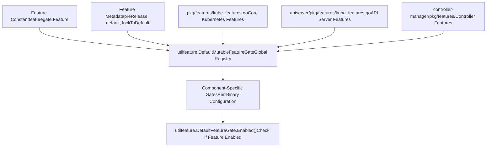
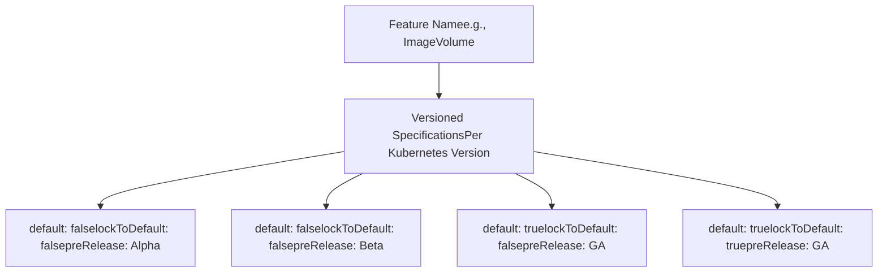
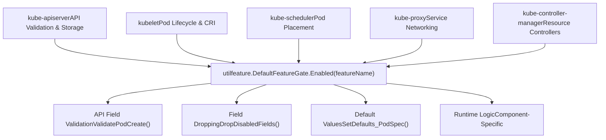
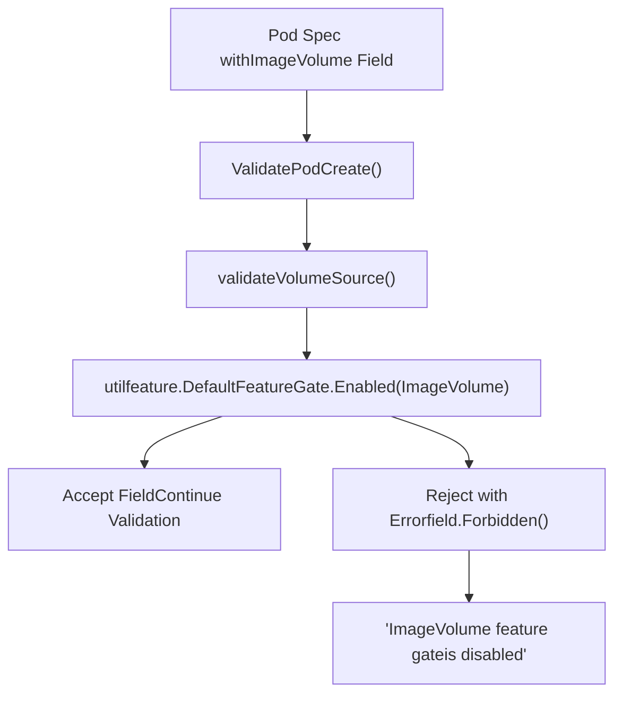
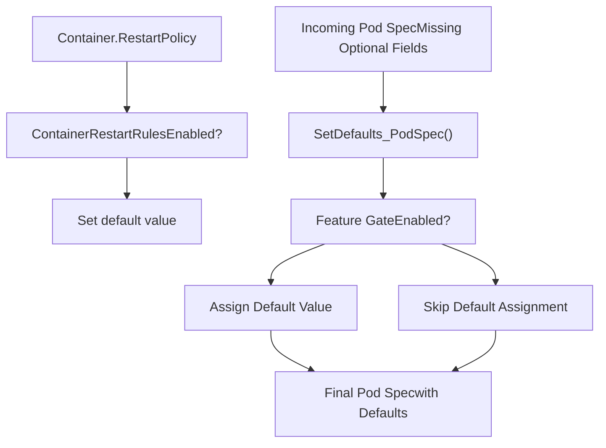
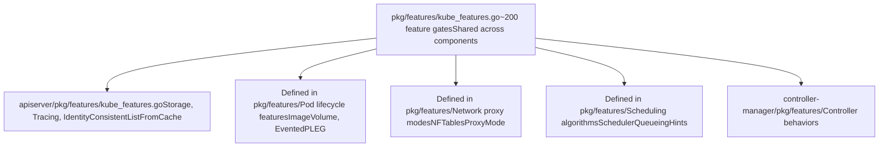
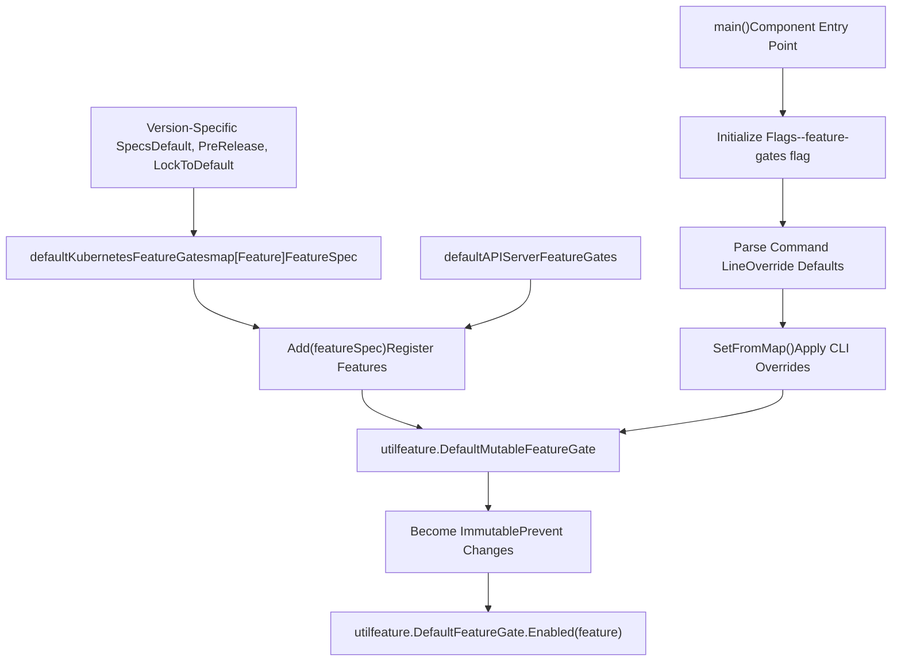
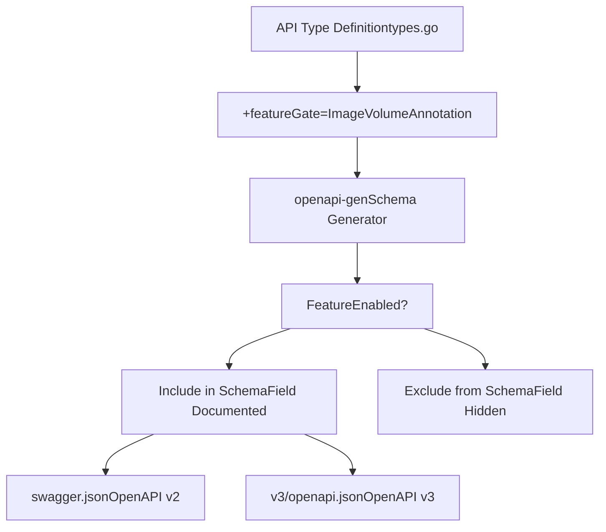

# 特性门控与生命周期

相关源文件

-   [api/openapi-spec/swagger.json](https://github.com/kubernetes/kubernetes/blob/2757a872/api/openapi-spec/swagger.json)
-   [api/openapi-spec/v3/api\_\_v1\_openapi.json](https://github.com/kubernetes/kubernetes/blob/2757a872/api/openapi-spec/v3/api__v1_openapi.json)
-   [api/openapi-spec/v3/apis\_\_admissionregistration.k8s.io\_\_v1\_openapi.json](https://github.com/kubernetes/kubernetes/blob/2757a872/api/openapi-spec/v3/apis__admissionregistration.k8s.io__v1_openapi.json)
-   [api/openapi-spec/v3/apis\_\_apiextensions.k8s.io\_\_v1\_openapi.json](https://github.com/kubernetes/kubernetes/blob/2757a872/api/openapi-spec/v3/apis__apiextensions.k8s.io__v1_openapi.json)
-   [api/openapi-spec/v3/apis\_\_apps\_\_v1\_openapi.json](https://github.com/kubernetes/kubernetes/blob/2757a872/api/openapi-spec/v3/apis__apps__v1_openapi.json)
-   [api/openapi-spec/v3/apis\_\_autoscaling\_\_v1\_openapi.json](https://github.com/kubernetes/kubernetes/blob/2757a872/api/openapi-spec/v3/apis__autoscaling__v1_openapi.json)
-   [api/openapi-spec/v3/apis\_\_autoscaling\_\_v2\_openapi.json](https://github.com/kubernetes/kubernetes/blob/2757a872/api/openapi-spec/v3/apis__autoscaling__v2_openapi.json)
-   [api/openapi-spec/v3/apis\_\_batch\_\_v1\_openapi.json](https://github.com/kubernetes/kubernetes/blob/2757a872/api/openapi-spec/v3/apis__batch__v1_openapi.json)
-   [api/openapi-spec/v3/apis\_\_certificates.k8s.io\_\_v1\_openapi.json](https://github.com/kubernetes/kubernetes/blob/2757a872/api/openapi-spec/v3/apis__certificates.k8s.io__v1_openapi.json)
-   [api/openapi-spec/v3/apis\_\_coordination.k8s.io\_\_v1\_openapi.json](https://github.com/kubernetes/kubernetes/blob/2757a872/api/openapi-spec/v3/apis__coordination.k8s.io__v1_openapi.json)
-   [api/openapi-spec/v3/apis\_\_internal.apiserver.k8s.io\_\_v1alpha1\_openapi.json](https://github.com/kubernetes/kubernetes/blob/2757a872/api/openapi-spec/v3/apis__internal.apiserver.k8s.io__v1alpha1_openapi.json)
-   [api/openapi-spec/v3/apis\_\_networking.k8s.io\_\_v1\_openapi.json](https://github.com/kubernetes/kubernetes/blob/2757a872/api/openapi-spec/v3/apis__networking.k8s.io__v1_openapi.json)
-   [api/openapi-spec/v3/apis\_\_node.k8s.io\_\_v1\_openapi.json](https://github.com/kubernetes/kubernetes/blob/2757a872/api/openapi-spec/v3/apis__node.k8s.io__v1_openapi.json)
-   [api/openapi-spec/v3/apis\_\_policy\_\_v1\_openapi.json](https://github.com/kubernetes/kubernetes/blob/2757a872/api/openapi-spec/v3/apis__policy__v1_openapi.json)
-   [api/openapi-spec/v3/apis\_\_rbac.authorization.k8s.io\_\_v1\_openapi.json](https://github.com/kubernetes/kubernetes/blob/2757a872/api/openapi-spec/v3/apis__rbac.authorization.k8s.io__v1_openapi.json)
-   [api/openapi-spec/v3/apis\_\_storage.k8s.io\_\_v1\_openapi.json](https://github.com/kubernetes/kubernetes/blob/2757a872/api/openapi-spec/v3/apis__storage.k8s.io__v1_openapi.json)
-   [pkg/api/pod/util.go](https://github.com/kubernetes/kubernetes/blob/2757a872/pkg/api/pod/util.go)
-   [pkg/api/pod/util\_test.go](https://github.com/kubernetes/kubernetes/blob/2757a872/pkg/api/pod/util_test.go)
-   [pkg/api/v1/pod/util.go](https://github.com/kubernetes/kubernetes/blob/2757a872/pkg/api/v1/pod/util.go)
-   [pkg/api/v1/pod/util\_test.go](https://github.com/kubernetes/kubernetes/blob/2757a872/pkg/api/v1/pod/util_test.go)
-   [pkg/apis/core/fuzzer/fuzzer.go](https://github.com/kubernetes/kubernetes/blob/2757a872/pkg/apis/core/fuzzer/fuzzer.go)
-   [pkg/apis/core/types.go](https://github.com/kubernetes/kubernetes/blob/2757a872/pkg/apis/core/types.go)
-   [pkg/apis/core/v1/defaults.go](https://github.com/kubernetes/kubernetes/blob/2757a872/pkg/apis/core/v1/defaults.go)
-   [pkg/apis/core/v1/defaults\_test.go](https://github.com/kubernetes/kubernetes/blob/2757a872/pkg/apis/core/v1/defaults_test.go)
-   [pkg/apis/core/v1/zz\_generated.conversion.go](https://github.com/kubernetes/kubernetes/blob/2757a872/pkg/apis/core/v1/zz_generated.conversion.go)
-   [pkg/apis/core/validation/validation.go](https://github.com/kubernetes/kubernetes/blob/2757a872/pkg/apis/core/validation/validation.go)
-   [pkg/apis/core/validation/validation\_test.go](https://github.com/kubernetes/kubernetes/blob/2757a872/pkg/apis/core/validation/validation_test.go)
-   [pkg/apis/core/zz\_generated.deepcopy.go](https://github.com/kubernetes/kubernetes/blob/2757a872/pkg/apis/core/zz_generated.deepcopy.go)
-   [pkg/features/kube\_features.go](https://github.com/kubernetes/kubernetes/blob/2757a872/pkg/features/kube_features.go)
-   [pkg/generated/openapi/zz\_generated.openapi.go](https://github.com/kubernetes/kubernetes/blob/2757a872/pkg/generated/openapi/zz_generated.openapi.go)
-   [pkg/kubelet/status/generate.go](https://github.com/kubernetes/kubernetes/blob/2757a872/pkg/kubelet/status/generate.go)
-   [pkg/kubelet/status/generate\_test.go](https://github.com/kubernetes/kubernetes/blob/2757a872/pkg/kubelet/status/generate_test.go)
-   [pkg/kubelet/types/constants.go](https://github.com/kubernetes/kubernetes/blob/2757a872/pkg/kubelet/types/constants.go)
-   [pkg/kubelet/types/pod\_status.go](https://github.com/kubernetes/kubernetes/blob/2757a872/pkg/kubelet/types/pod_status.go)
-   [pkg/kubelet/types/pod\_status\_test.go](https://github.com/kubernetes/kubernetes/blob/2757a872/pkg/kubelet/types/pod_status_test.go)
-   [pkg/registry/core/pod/strategy.go](https://github.com/kubernetes/kubernetes/blob/2757a872/pkg/registry/core/pod/strategy.go)
-   [pkg/registry/core/pod/strategy\_test.go](https://github.com/kubernetes/kubernetes/blob/2757a872/pkg/registry/core/pod/strategy_test.go)
-   [staging/src/k8s.io/api/core/v1/generated.pb.go](https://github.com/kubernetes/kubernetes/blob/2757a872/staging/src/k8s.io/api/core/v1/generated.pb.go)
-   [staging/src/k8s.io/api/core/v1/generated.proto](https://github.com/kubernetes/kubernetes/blob/2757a872/staging/src/k8s.io/api/core/v1/generated.proto)
-   [staging/src/k8s.io/api/core/v1/types.go](https://github.com/kubernetes/kubernetes/blob/2757a872/staging/src/k8s.io/api/core/v1/types.go)
-   [staging/src/k8s.io/api/core/v1/types\_swagger\_doc\_generated.go](https://github.com/kubernetes/kubernetes/blob/2757a872/staging/src/k8s.io/api/core/v1/types_swagger_doc_generated.go)
-   [staging/src/k8s.io/api/core/v1/zz\_generated.deepcopy.go](https://github.com/kubernetes/kubernetes/blob/2757a872/staging/src/k8s.io/api/core/v1/zz_generated.deepcopy.go)
-   [staging/src/k8s.io/apiserver/pkg/features/kube\_features.go](https://github.com/kubernetes/kubernetes/blob/2757a872/staging/src/k8s.io/apiserver/pkg/features/kube_features.go)
-   [staging/src/k8s.io/client-go/applyconfigurations/internal/internal.go](https://github.com/kubernetes/kubernetes/blob/2757a872/staging/src/k8s.io/client-go/applyconfigurations/internal/internal.go)
-   [staging/src/k8s.io/client-go/applyconfigurations/utils.go](https://github.com/kubernetes/kubernetes/blob/2757a872/staging/src/k8s.io/client-go/applyconfigurations/utils.go)
-   [test/compatibility\_lifecycle/reference/feature\_list.md](https://github.com/kubernetes/kubernetes/blob/2757a872/test/compatibility_lifecycle/reference/feature_list.md?plain=1)
-   [test/compatibility\_lifecycle/reference/versioned\_feature\_list.yaml](https://github.com/kubernetes/kubernetes/blob/2757a872/test/compatibility_lifecycle/reference/versioned_feature_list.yaml)
-   [test/integration/scheduler\_perf/dra/dra\_test.go](https://github.com/kubernetes/kubernetes/blob/2757a872/test/integration/scheduler_perf/dra/dra_test.go)

## 目的与范围

本文档描述 Kubernetes 中的特性门控系统。该系统为在所有集群组件中逐步引入、测试并稳定新功能提供机制。特性门控使 Alpha、Beta 和 GA 特性可以被独立控制，从而在不破坏兼容性的前提下安全演进 Kubernetes API 与实现。

关于 API 对象类型和校验规则的信息，请参见 [API Object Types and Validation](/kubernetes/kubernetes/2.2-api-object-types-and-validation)。关于存储后端细节，请参见 [Storage Backend and Caching](/kubernetes/kubernetes/2.3-storage-backend-and-caching)。

---

## 特性门控基础

### 概述

特性门控是具名布尔标志，用于控制 Kubernetes 组件中是否启用特定功能。每个特性门控都会沿着从 Alpha 到 GA（General Availability）的定义生命周期推进，并在每个阶段具有特定默认值和能力边界。

特性门控系统跨多个包实现：

-   核心 Kubernetes 特性：[pkg/features/kube\_features.go](https://github.com/kubernetes/kubernetes/blob/2757a872/pkg/features/kube_features.go)
-   API 服务器特性：[staging/src/k8s.io/apiserver/pkg/features/kube\_features.go](https://github.com/kubernetes/kubernetes/blob/2757a872/staging/src/k8s.io/apiserver/pkg/features/kube_features.go)
-   component-base 特性：各组件特定包

### 生命周期阶段

> **[Mermaid stateDiagram]**
> *(图表结构无法解析)*

**来源：** [pkg/features/kube\_features.go](https://github.com/kubernetes/kubernetes/blob/2757a872/pkg/features/kube_features.go) [test/compatibility\_lifecycle/reference/versioned\_feature\_list.yaml](https://github.com/kubernetes/kubernetes/blob/2757a872/test/compatibility_lifecycle/reference/versioned_feature_list.yaml)

---

## 特性门控定义与注册

### 特性门控结构

特性门控被定义为 `featuregate.Feature` 类型常量，并配有描述其生命周期的元数据：


**特性定义示例：**

[pkg/features/kube\_features.go374-378](https://github.com/kubernetes/kubernetes/blob/2757a872/pkg/features/kube_features.go#L374-L378) 定义了 `ImageVolume` 特性：

```
// owner: @saschagrunert
// kep: https://kep.k8s.io/4639
//
// Enables the image volume source.
ImageVolume featuregate.Feature = "ImageVolume"
```
该特性在 [pkg/features/kube\_features.go1130-1140](https://github.com/kubernetes/kubernetes/blob/2757a872/pkg/features/kube_features.go#L1130-L1140) 中注册：

```
ImageVolume: {
    Default: false,
    PreRelease: featuregate.Alpha,
}
```
**来源：** [pkg/features/kube\_features.go1-996](https://github.com/kubernetes/kubernetes/blob/2757a872/pkg/features/kube_features.go#L1-L996) [staging/src/k8s.io/apiserver/pkg/features/kube\_features.go1-560](https://github.com/kubernetes/kubernetes/blob/2757a872/staging/src/k8s.io/apiserver/pkg/features/kube_features.go#L1-L560)

---

## 生命周期推进与版本化

### 阶段特征

| Stage | Default | Locked | Compatibility | Use Case |
| --- | --- | --- | --- | --- |
| **Alpha** | OFF | No | 无保证——可能变化/破坏 | 早期开发、测试 |
| **Beta** | ON | No | 在版本内向后兼容 | 生产测试 |
| **GA** | ON | No | 完整兼容性 | 稳定生产 |
| **Locked** | ON | Yes | 完整兼容性 | 等待移除 |
| **Deprecated** | Varies | No | 尽力兼容 | 迁移阶段 |

### 版本化特性跟踪


所有特性的完整生命周期历史记录在 [test/compatibility\_lifecycle/reference/versioned\_feature\_list.yaml](https://github.com/kubernetes/kubernetes/blob/2757a872/test/compatibility_lifecycle/reference/versioned_feature_list.yaml) 中。该文件是机器生成的，用于跨 Kubernetes 版本的兼容性测试。

**versioned\_feature\_list.yaml 示例：**

[test/compatibility\_lifecycle/reference/versioned\_feature\_list.yaml374-378](https://github.com/kubernetes/kubernetes/blob/2757a872/test/compatibility_lifecycle/reference/versioned_feature_list.yaml#L374-L378) 展示了 `ImageVolume` 特性：

```
- name: ImageVolume  versionedSpecs:  - default: false    lockToDefault: false    preRelease: Alpha    version: "1.32"
```
**来源：** [test/compatibility\_lifecycle/reference/versioned\_feature\_list.yaml1-3500](https://github.com/kubernetes/kubernetes/blob/2757a872/test/compatibility_lifecycle/reference/versioned_feature_list.yaml#L1-L3500) [pkg/features/kube\_features.go](https://github.com/kubernetes/kubernetes/blob/2757a872/pkg/features/kube_features.go)

---

## 跨组件的特性门控集成

### 组件查询模式


**来源：** [pkg/apis/core/validation/validation.go](https://github.com/kubernetes/kubernetes/blob/2757a872/pkg/apis/core/validation/validation.go) [pkg/features/kube\_features.go](https://github.com/kubernetes/kubernetes/blob/2757a872/pkg/features/kube_features.go)

---

## API 校验与特性门控

### 基于特性门控的字段校验

校验框架利用特性门控对 API 字段执行条件校验。当特性被禁用时，尝试使用该特性字段会触发校验错误。


**实现示例：**

[pkg/apis/core/validation/validation.go544-700](https://github.com/kubernetes/kubernetes/blob/2757a872/pkg/apis/core/validation/validation.go#L544-L700) 实现了 `validateVolumeSource()`，它会针对不同卷类型检查特性门控。对于 `ImageVolume` 特性，校验逻辑会执行：

```
if source.Image != nil {    if !utilfeature.DefaultFeatureGate.Enabled(features.ImageVolume) {        allErrs = append(allErrs, field.Forbidden(fldPath.Child("image"),             "ImageVolume feature gate is disabled"))    }}
```
**来源：** [pkg/apis/core/validation/validation.go1-8000](https://github.com/kubernetes/kubernetes/blob/2757a872/pkg/apis/core/validation/validation.go#L1-L8000) [pkg/features/kube\_features.go](https://github.com/kubernetes/kubernetes/blob/2757a872/pkg/features/kube_features.go)

---

## 已禁用特性的字段丢弃

### DropDisabledFields 机制

当某个特性被禁用时，API 服务器会在创建或更新期间自动移除（丢弃）与该特性关联的 API 对象字段。这可以防止已禁用特性被配置。

> **[Mermaid sequence]**
> *(图表结构无法解析)*

`DropDisabledFields()` 模式在校验代码中被广泛使用，以确保即使客户端传入这些字段，已禁用特性也不会被持久化到存储层。

**使用模式示例：**

[pkg/apis/core/validation/validation.go](https://github.com/kubernetes/kubernetes/blob/2757a872/pkg/apis/core/validation/validation.go) 在整个校验过程中使用了字段丢弃函数：

```
// Drop fields that are disabled by feature gatesif !utilfeature.DefaultFeatureGate.Enabled(features.ImageVolume) {    // Clear the image volume field if present    for i := range spec.Volumes {        spec.Volumes[i].Image = nil    }}
```
**来源：** [pkg/apis/core/validation/validation.go](https://github.com/kubernetes/kubernetes/blob/2757a872/pkg/apis/core/validation/validation.go) [pkg/apis/core/v1/defaults.go](https://github.com/kubernetes/kubernetes/blob/2757a872/pkg/apis/core/v1/defaults.go)

---

## 默认值赋值

### 受特性门控控制的默认值

默认值赋值逻辑使用特性门控进行条件填充。这确保了已禁用特性对应字段不会被赋予默认值。


**实现：**

[pkg/apis/core/v1/defaults.go1-500](https://github.com/kubernetes/kubernetes/blob/2757a872/pkg/apis/core/v1/defaults.go#L1-L500) 实现了带特性门控检查的默认值赋值：

```
func SetDefaults_PodSpec(obj *v1.PodSpec) {    // Only set defaults for enabled features    if utilfeature.DefaultFeatureGate.Enabled(features.ContainerRestartRules) {        // Set container restart policy defaults    }}
```
**来源：** [pkg/apis/core/v1/defaults.go1-500](https://github.com/kubernetes/kubernetes/blob/2757a872/pkg/apis/core/v1/defaults.go#L1-L500) [pkg/apis/core/v1/defaults\_test.go](https://github.com/kubernetes/kubernetes/blob/2757a872/pkg/apis/core/v1/defaults_test.go)

---

## 组件特定特性门控

### 在各组件中的分布

除核心特性门控之外，不同 Kubernetes 组件还定义并使用了各自的特性门控：


**关键组件特定特性：**

| Component | Example Features | Purpose |
| --- | --- | --- |
| **API Server** | `APIServerTracing`, `ConsistentListFromCache` | 存储与服务优化 |
| **Kubelet** | `ImageVolume`, `EventedPLEG`, `UserNamespacesSupport` | Pod 与容器生命周期 |
| **kube-proxy** | `NFTablesProxyMode`, `PreferSameTrafficDistribution` | Service 网络模式 |
| **Scheduler** | `SchedulerQueueingHints`, `SchedulerAsyncPreemption` | 调度性能 |

**来源：** [pkg/features/kube\_features.go1-2000](https://github.com/kubernetes/kubernetes/blob/2757a872/pkg/features/kube_features.go#L1-L2000) [staging/src/k8s.io/apiserver/pkg/features/kube\_features.go](https://github.com/kubernetes/kubernetes/blob/2757a872/staging/src/k8s.io/apiserver/pkg/features/kube_features.go)

---

## 特性门控注册与初始化

### 注册流程


**注册示例：**

[pkg/features/kube\_features.go1000-1200](https://github.com/kubernetes/kubernetes/blob/2757a872/pkg/features/kube_features.go#L1000-L1200) 定义了特性规范：

```
var defaultKubernetesFeatureGates = map[featuregate.Feature]featuregate.FeatureSpec{    ImageVolume: {        Default: false,        PreRelease: featuregate.Alpha,    },    DynamicResourceAllocation: {        Default: true,        PreRelease: featuregate.Beta,    },}
```
`init()` 函数会注册这些特性：

[pkg/features/kube\_features.go2000-2020](https://github.com/kubernetes/kubernetes/blob/2757a872/pkg/features/kube_features.go#L2000-L2020)：

```
func init() {    runtime.Must(utilfeature.DefaultMutableFeatureGate.Add(defaultKubernetesFeatureGates))}
```
**来源：** [pkg/features/kube\_features.go2000-2020](https://github.com/kubernetes/kubernetes/blob/2757a872/pkg/features/kube_features.go#L2000-L2020) [staging/src/k8s.io/apiserver/pkg/util/feature/feature\_gate.go](https://github.com/kubernetes/kubernetes/blob/2757a872/staging/src/k8s.io/apiserver/pkg/util/feature/feature_gate.go)

---

## 生命周期管理与兼容性测试

### 版本化特性列表

[test/compatibility\_lifecycle/reference/versioned\_feature\_list.yaml](https://github.com/kubernetes/kubernetes/blob/2757a872/test/compatibility_lifecycle/reference/versioned_feature_list.yaml) 文件维护了每个特性门控在所有 Kubernetes 版本中的完整历史。它支持：

1.  **兼容性测试**：确保旧客户端可与新服务器协同工作
2.  **升级验证**：验证版本迁移的安全性
3.  **文档生成**：自动生成特性门控文档

**结构：**

```
- name: FeatureName  versionedSpecs:  - default: false    lockToDefault: false    preRelease: Alpha    version: "1.30"  - default: true    lockToDefault: false    preRelease: Beta    version: "1.32"  - default: true    lockToDefault: true    preRelease: GA    version: "1.34"
```
### 特性门控生命周期时间线

> **[Mermaid gantt]**
> *(图表结构无法解析)*

**来源：** [test/compatibility\_lifecycle/reference/versioned\_feature\_list.yaml1-3500](https://github.com/kubernetes/kubernetes/blob/2757a872/test/compatibility_lifecycle/reference/versioned_feature_list.yaml#L1-L3500) [test/compatibility\_lifecycle/reference/feature\_list.md](https://github.com/kubernetes/kubernetes/blob/2757a872/test/compatibility_lifecycle/reference/feature_list.md?plain=1)

---

## 特性门控最佳实践与模式

### 常见使用模式

**模式 1：简单特性检查**

```
if utilfeature.DefaultFeatureGate.Enabled(features.ImageVolume) {    // Feature-specific logic}
```
**模式 2：结合特性门控的校验**

[pkg/apis/core/validation/validation.go544-700](https://github.com/kubernetes/kubernetes/blob/2757a872/pkg/apis/core/validation/validation.go#L544-L700)：

```
if source.Image != nil {    if !utilfeature.DefaultFeatureGate.Enabled(features.ImageVolume) {        allErrs = append(allErrs, field.Forbidden(fldPath.Child("image"),             "ImageVolume feature gate is disabled"))        return allErrs    }    // Validate image volume configuration    allErrs = append(allErrs, validateImageVolumeSource(source.Image, fldPath.Child("image"), opts)...)}
```
**模式 3：字段丢弃**

```
// Drop disabled fields to prevent persistencefunc DropDisabledImageVolumeFields(podSpec *core.PodSpec) {    if !utilfeature.DefaultFeatureGate.Enabled(features.ImageVolume) {        for i := range podSpec.Volumes {            podSpec.Volumes[i].Image = nil        }    }}
```
### 生命周期迁移指南

| From Stage | To Stage | Requirements |
| --- | --- | --- |
| Alpha → Beta | 默认开启、稳定 API、全面测试 |  |
| Beta → GA | 经过生产验证、完整测试覆盖、文档完善 |  |
| GA → Locked | 集群运行必需、不可禁用 |  |
| Locked → Removed | 移除门控代码，特性成为标准行为 |  |
| Any → Deprecated | 文档化迁移路径并公布时间线 |  |

**来源：** [pkg/apis/core/validation/validation.go](https://github.com/kubernetes/kubernetes/blob/2757a872/pkg/apis/core/validation/validation.go) [pkg/features/kube\_features.go](https://github.com/kubernetes/kubernetes/blob/2757a872/pkg/features/kube_features.go)

---

## OpenAPI Schema 生成

### 受特性门控控制的 Schema 字段

OpenAPI schema 会自动反映特性门控状态。由已禁用特性门控控制的字段会从生成 schema 中排除，从而避免客户端发现或使用已禁用功能。


**来自 API 类型的示例：**

[staging/src/k8s.io/api/core/v1/types.go205-221](https://github.com/kubernetes/kubernetes/blob/2757a872/staging/src/k8s.io/api/core/v1/types.go#L205-L221) 展示了带特性门控注解的 `Image` 字段：

```
// image represents an OCI object (a container image or artifact) pulled and mounted on the kubelet's host machine.// ...// +featureGate=ImageVolume// +optionalImage *ImageVolumeSource `json:"image,omitempty" protobuf:"bytes,30,opt,name=image"`
```
位于 [api/openapi-spec/swagger.json](https://github.com/kubernetes/kubernetes/blob/2757a872/api/openapi-spec/swagger.json) 的生成 OpenAPI 规范会根据 `ImageVolume` 特性门控状态有条件地包含该字段。

**来源：** [staging/src/k8s.io/api/core/v1/types.go36-227](https://github.com/kubernetes/kubernetes/blob/2757a872/staging/src/k8s.io/api/core/v1/types.go#L36-L227) [api/openapi-spec/swagger.json](https://github.com/kubernetes/kubernetes/blob/2757a872/api/openapi-spec/swagger.json) [pkg/generated/openapi/zz\_generated.openapi.go](https://github.com/kubernetes/kubernetes/blob/2757a872/pkg/generated/openapi/zz_generated.openapi.go)

---

## 总结

特性门控系统为 Kubernetes 的演进式开发提供了稳健机制：

1.  **受控引入**：新特性从 Alpha（默认关闭）开始，并逐步进入 Beta 和 GA
2.  **安全晋级**：特性在每个阶段都必须满足稳定性和测试要求
3.  **组件集成**：所有主要组件（API server、kubelet、scheduler、proxy）都会查询特性门控
4.  **API 保护**：校验和字段丢弃可防止已禁用特性被配置
5.  **生命周期跟踪**：机器可读历史支持兼容性测试与文档生成
6.  **最终清理**：Locked 和 Removed 阶段确保旧代码最终被移除

特性门控生命周期确保 Kubernetes 能在保持向后兼容和生产稳定性保证的同时快速演进。

**来源：** [pkg/features/kube\_features.go](https://github.com/kubernetes/kubernetes/blob/2757a872/pkg/features/kube_features.go) [staging/src/k8s.io/apiserver/pkg/features/kube\_features.go](https://github.com/kubernetes/kubernetes/blob/2757a872/staging/src/k8s.io/apiserver/pkg/features/kube_features.go) [test/compatibility\_lifecycle/reference/versioned\_feature\_list.yaml](https://github.com/kubernetes/kubernetes/blob/2757a872/test/compatibility_lifecycle/reference/versioned_feature_list.yaml) [pkg/apis/core/validation/validation.go](https://github.com/kubernetes/kubernetes/blob/2757a872/pkg/apis/core/validation/validation.go)
