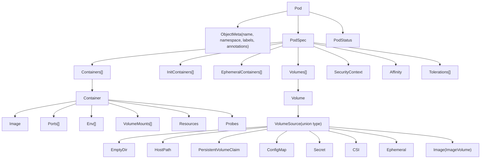
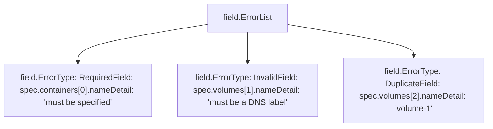
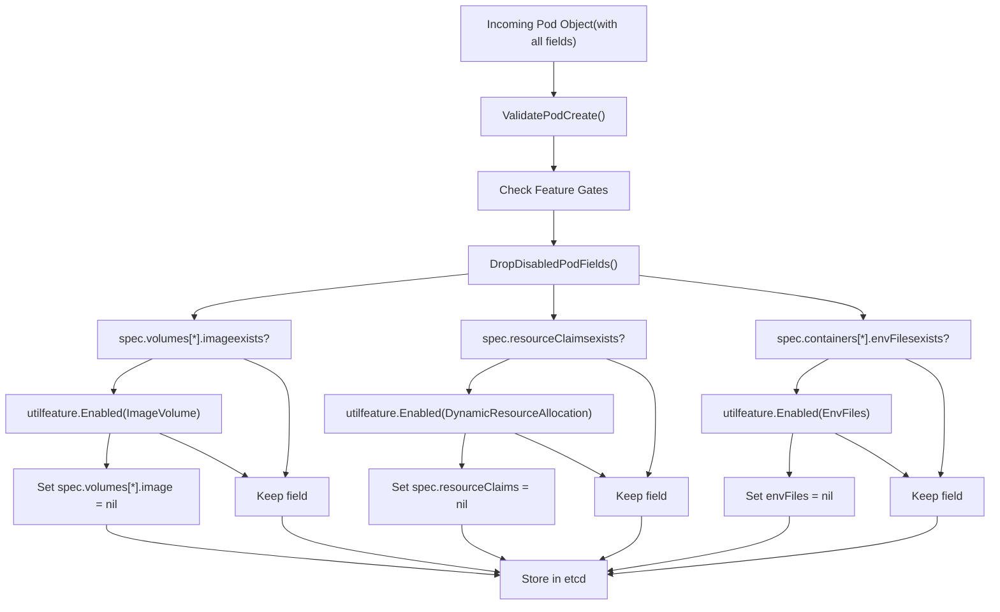
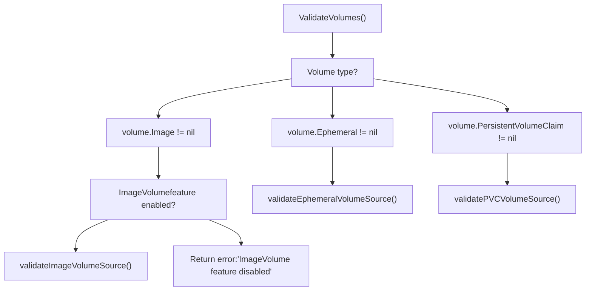

# API 对象类型与校验

相关源文件

-   [api/openapi-spec/swagger.json](https://github.com/kubernetes/kubernetes/blob/2757a872/api/openapi-spec/swagger.json)
-   [api/openapi-spec/v3/api\_\_v1\_openapi.json](https://github.com/kubernetes/kubernetes/blob/2757a872/api/openapi-spec/v3/api__v1_openapi.json)
-   [api/openapi-spec/v3/apis\_\_admissionregistration.k8s.io\_\_v1\_openapi.json](https://github.com/kubernetes/kubernetes/blob/2757a872/api/openapi-spec/v3/apis__admissionregistration.k8s.io__v1_openapi.json)
-   [api/openapi-spec/v3/apis\_\_apiextensions.k8s.io\_\_v1\_openapi.json](https://github.com/kubernetes/kubernetes/blob/2757a872/api/openapi-spec/v3/apis__apiextensions.k8s.io__v1_openapi.json)
-   [api/openapi-spec/v3/apis\_\_apps\_\_v1\_openapi.json](https://github.com/kubernetes/kubernetes/blob/2757a872/api/openapi-spec/v3/apis__apps__v1_openapi.json)
-   [api/openapi-spec/v3/apis\_\_autoscaling\_\_v1\_openapi.json](https://github.com/kubernetes/kubernetes/blob/2757a872/api/openapi-spec/v3/apis__autoscaling__v1_openapi.json)
-   [api/openapi-spec/v3/apis\_\_autoscaling\_\_v2\_openapi.json](https://github.com/kubernetes/kubernetes/blob/2757a872/api/openapi-spec/v3/apis__autoscaling__v2_openapi.json)
-   [api/openapi-spec/v3/apis\_\_batch\_\_v1\_openapi.json](https://github.com/kubernetes/kubernetes/blob/2757a872/api/openapi-spec/v3/apis__batch__v1_openapi.json)
-   [api/openapi-spec/v3/apis\_\_certificates.k8s.io\_\_v1\_openapi.json](https://github.com/kubernetes/kubernetes/blob/2757a872/api/openapi-spec/v3/apis__certificates.k8s.io__v1_openapi.json)
-   [api/openapi-spec/v3/apis\_\_coordination.k8s.io\_\_v1\_openapi.json](https://github.com/kubernetes/kubernetes/blob/2757a872/api/openapi-spec/v3/apis__coordination.k8s.io__v1_openapi.json)
-   [api/openapi-spec/v3/apis\_\_internal.apiserver.k8s.io\_\_v1alpha1\_openapi.json](https://github.com/kubernetes/kubernetes/blob/2757a872/api/openapi-spec/v3/apis__internal.apiserver.k8s.io__v1alpha1_openapi.json)
-   [api/openapi-spec/v3/apis\_\_networking.k8s.io\_\_v1\_openapi.json](https://github.com/kubernetes/kubernetes/blob/2757a872/api/openapi-spec/v3/apis__networking.k8s.io__v1_openapi.json)
-   [api/openapi-spec/v3/apis\_\_node.k8s.io\_\_v1\_openapi.json](https://github.com/kubernetes/kubernetes/blob/2757a872/api/openapi-spec/v3/apis__node.k8s.io__v1_openapi.json)
-   [api/openapi-spec/v3/apis\_\_policy\_\_v1\_openapi.json](https://github.com/kubernetes/kubernetes/blob/2757a872/api/openapi-spec/v3/apis__policy__v1_openapi.json)
-   [api/openapi-spec/v3/apis\_\_rbac.authorization.k8s.io\_\_v1\_openapi.json](https://github.com/kubernetes/kubernetes/blob/2757a872/api/openapi-spec/v3/apis__rbac.authorization.k8s.io__v1_openapi.json)
-   [api/openapi-spec/v3/apis\_\_storage.k8s.io\_\_v1\_openapi.json](https://github.com/kubernetes/kubernetes/blob/2757a872/api/openapi-spec/v3/apis__storage.k8s.io__v1_openapi.json)
-   [pkg/api/pod/util.go](https://github.com/kubernetes/kubernetes/blob/2757a872/pkg/api/pod/util.go)
-   [pkg/api/pod/util\_test.go](https://github.com/kubernetes/kubernetes/blob/2757a872/pkg/api/pod/util_test.go)
-   [pkg/api/v1/pod/util.go](https://github.com/kubernetes/kubernetes/blob/2757a872/pkg/api/v1/pod/util.go)
-   [pkg/api/v1/pod/util\_test.go](https://github.com/kubernetes/kubernetes/blob/2757a872/pkg/api/v1/pod/util_test.go)
-   [pkg/apis/core/fuzzer/fuzzer.go](https://github.com/kubernetes/kubernetes/blob/2757a872/pkg/apis/core/fuzzer/fuzzer.go)
-   [pkg/apis/core/types.go](https://github.com/kubernetes/kubernetes/blob/2757a872/pkg/apis/core/types.go)
-   [pkg/apis/core/v1/defaults.go](https://github.com/kubernetes/kubernetes/blob/2757a872/pkg/apis/core/v1/defaults.go)
-   [pkg/apis/core/v1/defaults\_test.go](https://github.com/kubernetes/kubernetes/blob/2757a872/pkg/apis/core/v1/defaults_test.go)
-   [pkg/apis/core/v1/zz\_generated.conversion.go](https://github.com/kubernetes/kubernetes/blob/2757a872/pkg/apis/core/v1/zz_generated.conversion.go)
-   [pkg/apis/core/validation/validation.go](https://github.com/kubernetes/kubernetes/blob/2757a872/pkg/apis/core/validation/validation.go)
-   [pkg/apis/core/validation/validation\_test.go](https://github.com/kubernetes/kubernetes/blob/2757a872/pkg/apis/core/validation/validation_test.go)
-   [pkg/apis/core/zz\_generated.deepcopy.go](https://github.com/kubernetes/kubernetes/blob/2757a872/pkg/apis/core/zz_generated.deepcopy.go)
-   [pkg/features/kube\_features.go](https://github.com/kubernetes/kubernetes/blob/2757a872/pkg/features/kube_features.go)
-   [pkg/generated/openapi/zz\_generated.openapi.go](https://github.com/kubernetes/kubernetes/blob/2757a872/pkg/generated/openapi/zz_generated.openapi.go)
-   [pkg/kubelet/status/generate.go](https://github.com/kubernetes/kubernetes/blob/2757a872/pkg/kubelet/status/generate.go)
-   [pkg/kubelet/status/generate\_test.go](https://github.com/kubernetes/kubernetes/blob/2757a872/pkg/kubelet/status/generate_test.go)
-   [pkg/kubelet/types/constants.go](https://github.com/kubernetes/kubernetes/blob/2757a872/pkg/kubelet/types/constants.go)
-   [pkg/kubelet/types/pod\_status.go](https://github.com/kubernetes/kubernetes/blob/2757a872/pkg/kubelet/types/pod_status.go)
-   [pkg/kubelet/types/pod\_status\_test.go](https://github.com/kubernetes/kubernetes/blob/2757a872/pkg/kubelet/types/pod_status_test.go)
-   [pkg/registry/core/pod/strategy.go](https://github.com/kubernetes/kubernetes/blob/2757a872/pkg/registry/core/pod/strategy.go)
-   [pkg/registry/core/pod/strategy\_test.go](https://github.com/kubernetes/kubernetes/blob/2757a872/pkg/registry/core/pod/strategy_test.go)
-   [staging/src/k8s.io/api/core/v1/generated.pb.go](https://github.com/kubernetes/kubernetes/blob/2757a872/staging/src/k8s.io/api/core/v1/generated.pb.go)
-   [staging/src/k8s.io/api/core/v1/generated.proto](https://github.com/kubernetes/kubernetes/blob/2757a872/staging/src/k8s.io/api/core/v1/generated.proto)
-   [staging/src/k8s.io/api/core/v1/types.go](https://github.com/kubernetes/kubernetes/blob/2757a872/staging/src/k8s.io/api/core/v1/types.go)
-   [staging/src/k8s.io/api/core/v1/types\_swagger\_doc\_generated.go](https://github.com/kubernetes/kubernetes/blob/2757a872/staging/src/k8s.io/api/core/v1/types_swagger_doc_generated.go)
-   [staging/src/k8s.io/api/core/v1/zz\_generated.deepcopy.go](https://github.com/kubernetes/kubernetes/blob/2757a872/staging/src/k8s.io/api/core/v1/zz_generated.deepcopy.go)
-   [staging/src/k8s.io/apiserver/pkg/features/kube\_features.go](https://github.com/kubernetes/kubernetes/blob/2757a872/staging/src/k8s.io/apiserver/pkg/features/kube_features.go)
-   [staging/src/k8s.io/client-go/applyconfigurations/internal/internal.go](https://github.com/kubernetes/kubernetes/blob/2757a872/staging/src/k8s.io/client-go/applyconfigurations/internal/internal.go)
-   [staging/src/k8s.io/client-go/applyconfigurations/utils.go](https://github.com/kubernetes/kubernetes/blob/2757a872/staging/src/k8s.io/client-go/applyconfigurations/utils.go)
-   [test/compatibility\_lifecycle/reference/feature\_list.md](https://github.com/kubernetes/kubernetes/blob/2757a872/test/compatibility_lifecycle/reference/feature_list.md?plain=1)
-   [test/compatibility\_lifecycle/reference/versioned\_feature\_list.yaml](https://github.com/kubernetes/kubernetes/blob/2757a872/test/compatibility_lifecycle/reference/versioned_feature_list.yaml)
-   [test/integration/scheduler\_perf/dra/dra\_test.go](https://github.com/kubernetes/kubernetes/blob/2757a872/test/integration/scheduler_perf/dra/dra_test.go)

## 目的与范围

本页详细说明构成 Kubernetes 基础的核心 API 对象类型（Pod、Volume、Container）、确保 API 对象满足结构与语义要求的校验框架，以及 `DropDisabledFields` 机制如何与特性门控集成，以便根据特性生命周期阶段控制字段可用性。

有关特性门控生命周期管理（Alpha→Beta→GA→Locked→Removed），请参阅 [特性门控与生命周期](/kubernetes/kubernetes/2.1-feature-gates-and-lifecycle)。关于已校验对象如何存储在 etcd 中的细节，请参阅 [存储后端与缓存](/kubernetes/kubernetes/2.3-storage-backend-and-caching)。

## 核心 API 对象类型

### Pod 对象层级结构

Pod 是 Kubernetes 中最基础的工作负载单元。它由一组嵌套类型组成，用于定义容器、卷、安全策略和调度约束。


**来源：** [staging/src/k8s.io/api/core/v1/types.go1-6000](https://github.com/kubernetes/kubernetes/blob/2757a872/staging/src/k8s.io/api/core/v1/types.go#L1-L6000) [pkg/apis/core/types.go1-6000](https://github.com/kubernetes/kubernetes/blob/2757a872/pkg/apis/core/types.go#L1-L6000)

### 关键类型定义

下表汇总了主要类型及其在代码库中的位置：

| 类型 | 外部 (v1) | 内部 | 用途 |
| --- | --- | --- | --- |
| `Pod` | [staging/src/k8s.io/api/core/v1/types.go36-239](https://github.com/kubernetes/kubernetes/blob/2757a872/staging/src/k8s.io/api/core/v1/types.go#L36-L239) | [pkg/apis/core/types.go4000-4200](https://github.com/kubernetes/kubernetes/blob/2757a872/pkg/apis/core/types.go#L4000-L4200) | 顶层工作负载对象 |
| `PodSpec` | [staging/src/k8s.io/api/core/v1/types.go2895-3900](https://github.com/kubernetes/kubernetes/blob/2757a872/staging/src/k8s.io/api/core/v1/types.go#L2895-L3900) | [pkg/apis/core/types.go3000-4000](https://github.com/kubernetes/kubernetes/blob/2757a872/pkg/apis/core/types.go#L3000-L4000) | 期望状态规范 |
| `Container` | [staging/src/k8s.io/api/core/v1/types.go2265-2590](https://github.com/kubernetes/kubernetes/blob/2757a872/staging/src/k8s.io/api/core/v1/types.go#L2265-L2590) | [pkg/apis/core/types.go2300-2600](https://github.com/kubernetes/kubernetes/blob/2757a872/pkg/apis/core/types.go#L2300-L2600) | 容器定义 |
| `Volume` | [staging/src/k8s.io/api/core/v1/types.go35-45](https://github.com/kubernetes/kubernetes/blob/2757a872/staging/src/k8s.io/api/core/v1/types.go#L35-L45) | [pkg/apis/core/types.go44-54](https://github.com/kubernetes/kubernetes/blob/2757a872/pkg/apis/core/types.go#L44-L54) | Pod 中的具名卷 |
| `VolumeSource` | [staging/src/k8s.io/api/core/v1/types.go48-222](https://github.com/kubernetes/kubernetes/blob/2757a872/staging/src/k8s.io/api/core/v1/types.go#L48-L222) | [pkg/apis/core/types.go56-227](https://github.com/kubernetes/kubernetes/blob/2757a872/pkg/apis/core/types.go#L56-L227) | 卷后端的联合类型 |
| `PodStatus` | [staging/src/k8s.io/api/core/v1/types.go3902-4080](https://github.com/kubernetes/kubernetes/blob/2757a872/staging/src/k8s.io/api/core/v1/types.go#L3902-L4080) | [pkg/apis/core/types.go4200-4400](https://github.com/kubernetes/kubernetes/blob/2757a872/pkg/apis/core/types.go#L4200-L4400) | 观测状态 |

### `VolumeSource` 联合类型

`VolumeSource` 是一种联合类型，必须且只能设置一个字段。可用的卷类型包括：

| 卷类型 | 字段 | 特性门控 | 用途 |
| --- | --- | --- | --- |
| EmptyDir | `EmptyDir *EmptyDirVolumeSource` | None | 与 Pod 生命周期绑定的临时目录 |
| HostPath | `HostPath *HostPathVolumeSource` | None | 从主机文件系统挂载 |
| PersistentVolumeClaim | `PersistentVolumeClaim *PersistentVolumeClaimVolumeSource` | None | 引用 PVC |
| ConfigMap | `ConfigMap *ConfigMapVolumeSource` | None | 从 ConfigMap 填充 |
| Secret | `Secret *SecretVolumeSource` | None | 从 Secret 填充 |
| CSI | `CSI *CSIVolumeSource` | None | 临时 CSI 卷 |
| Ephemeral | `Ephemeral *EphemeralVolumeSource` | None | 通过 PVC 提供的通用临时卷 |
| Image | `Image *ImageVolumeSource` | `ImageVolume` | 作为卷的 OCI 镜像/工件 |

**来源：** [staging/src/k8s.io/api/core/v1/types.go48-222](https://github.com/kubernetes/kubernetes/blob/2757a872/staging/src/k8s.io/api/core/v1/types.go#L48-L222) [pkg/apis/core/types.go56-227](https://github.com/kubernetes/kubernetes/blob/2757a872/pkg/apis/core/types.go#L56-L227)

## 校验框架

### 校验流水线

当 API 请求到达 API 服务器时，对象会在持久化到 etcd 之前经过校验。校验流水线会与特性门控集成，以按条件校验字段。

> **[Mermaid 时序图]**
> *(图表结构无法解析)*

**来源：** [pkg/apis/core/validation/validation.go1-100](https://github.com/kubernetes/kubernetes/blob/2757a872/pkg/apis/core/validation/validation.go#L1-L100) [pkg/registry/core/pod/strategy.go1-300](https://github.com/kubernetes/kubernetes/blob/2757a872/pkg/registry/core/pod/strategy.go#L1-L300)

### 核心校验函数

校验框架位于 `pkg/apis/core/validation/validation.go`，并提供分层校验：

| 函数 | 位置 | 用途 |
| --- | --- | --- |
| `ValidatePodCreate` | [pkg/apis/core/validation/validation.go3500-3600](https://github.com/kubernetes/kubernetes/blob/2757a872/pkg/apis/core/validation/validation.go#L3500-L3600) | Pod 创建的顶层校验 |
| `ValidatePodUpdate` | [pkg/apis/core/validation/validation.go3700-3900](https://github.com/kubernetes/kubernetes/blob/2757a872/pkg/apis/core/validation/validation.go#L3700-L3900) | Pod 更新校验（检查不可变字段） |
| `ValidatePodSpec` | [pkg/apis/core/validation/validation.go3100-3400](https://github.com/kubernetes/kubernetes/blob/2757a872/pkg/apis/core/validation/validation.go#L3100-L3400) | 校验 PodSpec 结构 |
| `ValidateVolumes` | [pkg/apis/core/validation/validation.go445-488](https://github.com/kubernetes/kubernetes/blob/2757a872/pkg/apis/core/validation/validation.go#L445-L488) | 校验卷定义及唯一性 |
| `validateVolumeSource` | [pkg/apis/core/validation/validation.go544-800](https://github.com/kubernetes/kubernetes/blob/2757a872/pkg/apis/core/validation/validation.go#L544-L800) | 校验单个卷源（联合类型） |
| `ValidateContainers` | [pkg/apis/core/validation/validation.go2200-2400](https://github.com/kubernetes/kubernetes/blob/2757a872/pkg/apis/core/validation/validation.go#L2200-L2400) | 校验容器规范 |
| `ValidateResourceRequirements` | [pkg/apis/core/validation/validation.go1800-1950](https://github.com/kubernetes/kubernetes/blob/2757a872/pkg/apis/core/validation/validation.go#L1800-L1950) | 校验资源 requests/limits |
| `ValidateEnvVar` | [pkg/apis/core/validation/validation.go2000-2100](https://github.com/kubernetes/kubernetes/blob/2757a872/pkg/apis/core/validation/validation.go#L2000-2100) | 校验环境变量定义 |

**来源：** [pkg/apis/core/validation/validation.go1-10000](https://github.com/kubernetes/kubernetes/blob/2757a872/pkg/apis/core/validation/validation.go#L1-L10000)

### 校验错误报告
校验错误通过 `field.ErrorList` 报告，它使用字段路径提供结构化错误信息：


字段路径示例：

-   `spec.containers[0].image` - 第一个容器的镜像字段
-   `spec.volumes[1].persistentVolumeClaim.claimName` - 第二个卷的 PVC 名称
-   `metadata.labels` - Pod 标签

**来源：** [pkg/apis/core/validation/validation.go1-100](https://github.com/kubernetes/kubernetes/blob/2757a872/pkg/apis/core/validation/validation.go#L1-L100)

### 校验选项

校验行为由在校验调用栈中传递的 `PodValidationOptions` 控制：

```
// From pkg/apis/core/validation/validation.gotype PodValidationOptions struct {    AllowInvalidPodDeletionCost bool    AllowIndivisibleHugePagesValues bool    AllowHostPIDSharingWithoutHostNetwork bool    AllowWindowsHostProcessField bool    AllowExpandedDNSConfig bool    // ... additional options}
```
**来源：** [pkg/apis/core/validation/validation.go100-200](https://github.com/kubernetes/kubernetes/blob/2757a872/pkg/apis/core/validation/validation.go#L100-L200)

## 特性门控集成

### `DropDisabledFields` 机制

`DropDisabledFields` 函数确保由已禁用特性门控控制的字段会在对象存储之前从对象中移除。这可防止在特性未启用时持久化无效状态。


**来源：** [pkg/apis/core/validation/validation.go445-488](https://github.com/kubernetes/kubernetes/blob/2757a872/pkg/apis/core/validation/validation.go#L445-L488) [pkg/registry/core/pod/strategy.go1-300](https://github.com/kubernetes/kubernetes/blob/2757a872/pkg/registry/core/pod/strategy.go#L1-L300)

### 字段剔除实现

字段剔除逻辑在 pod strategy 与 validation 包中实现：

| 函数 | 位置 | 用途 |
| --- | --- | --- |
| `DropDisabledPodFields` | [pkg/apis/core/validation/validation.go3000-3100](https://github.com/kubernetes/kubernetes/blob/2757a872/pkg/apis/core/validation/validation.go#L3000-L3100) | Pod 的顶层字段剔除器 |
| `dropDisabledFields` | [pkg/apis/core/validation/validation.go3000-3050](https://github.com/kubernetes/kubernetes/blob/2757a872/pkg/apis/core/validation/validation.go#L3000-L3050) | 检查门控并按条件剔除字段的辅助函数 |
| `DropDisabledTemplateFields` | [pkg/apis/core/validation/validation.go3100-3200](https://github.com/kubernetes/kubernetes/blob/2757a872/pkg/apis/core/validation/validation.go#L3100-L3200) | 从 Pod 模板（Deployment 等）中剔除字段 |

字段剔除逻辑遵循以下模式：

```
// Pseudocode from pkg/apis/core/validation/validation.gofunc DropDisabledPodFields(pod *core.Pod, oldPod *core.Pod) {    // Drop ImageVolume if feature is disabled    if !utilfeature.DefaultFeatureGate.Enabled(features.ImageVolume) {        // Unless the field existed in oldPod (grandfathering)        if oldPod == nil || !hasImageVolume(oldPod) {            for i := range pod.Spec.Volumes {                pod.Spec.Volumes[i].Image = nil            }        }    }        // Drop DRA fields if feature is disabled    if !utilfeature.DefaultFeatureGate.Enabled(features.DynamicResourceAllocation) {        if oldPod == nil || len(oldPod.Spec.ResourceClaims) == 0 {            pod.Spec.ResourceClaims = nil        }    }        // Similar logic for other gated fields...}
```
**祖父保留机制：** 如果某字段在 `oldPod`（更新期间）中已存在，即使该特性门控现在被禁用，该字段仍会被保留。这可防止现有 Pod 在更新期间被拒绝。

**来源：** [pkg/apis/core/validation/validation.go3000-3100](https://github.com/kubernetes/kubernetes/blob/2757a872/pkg/apis/core/validation/validation.go#L3000-L3100) [pkg/registry/core/pod/strategy.go100-200](https://github.com/kubernetes/kubernetes/blob/2757a872/pkg/registry/core/pod/strategy.go#L100-L200)

### 结合特性门控的校验

校验函数会检查特性门控，以确定是校验受门控字段还是拒绝这些字段：


**来源：** [pkg/apis/core/validation/validation.go544-800](https://github.com/kubernetes/kubernetes/blob/2757a872/pkg/apis/core/validation/validation.go#L544-L800)

## 字段级校验规则

### 卷校验

卷校验确保：

1.  每个卷都具有唯一名称（DNS 标签格式）
2.  必须且只能设置一个 `VolumeSource` 字段（联合类型约束）
3.  满足各卷类型特定约束

卷校验规则示例：

| 卷类型 | 关键校验规则 | 实现 |
| --- | --- | --- |
| `EmptyDir` | 可选的 sizeLimit 必须为正数 | [pkg/apis/core/validation/validation.go700-750](https://github.com/kubernetes/kubernetes/blob/2757a872/pkg/apis/core/validation/validation.go#L700-L750) |
| `HostPath` | 路径不能为空，类型必须有效 | [pkg/apis/core/validation/validation.go750-850](https://github.com/kubernetes/kubernetes/blob/2757a872/pkg/apis/core/validation/validation.go#L750-L850) |
| `PersistentVolumeClaim` | ClaimName 必须是有效 DNS 子域名 | [pkg/apis/core/validation/validation.go850-900](https://github.com/kubernetes/kubernetes/blob/2757a872/pkg/apis/core/validation/validation.go#L850-L900) |
| `Secret` | SecretName 必须存在，items 必须有有效键 | [pkg/apis/core/validation/validation.go1000-1100](https://github.com/kubernetes/kubernetes/blob/2757a872/pkg/apis/core/validation/validation.go#L1000-L1100) |
| `ConfigMap` | ConfigMapName 必须存在，items 必须有有效键 | [pkg/apis/core/validation/validation.go1100-1200](https://github.com/kubernetes/kubernetes/blob/2757a872/pkg/apis/core/validation/validation.go#L1100-L1200) |
| `Image` | 需要启用 ImageVolume 特性门控，且必须指定引用 | [pkg/apis/core/validation/validation.go900-950](https://github.com/kubernetes/kubernetes/blob/2757a872/pkg/apis/core/validation/validation.go#L900-L950) |

**来源：** [pkg/apis/core/validation/validation.go544-1500](https://github.com/kubernetes/kubernetes/blob/2757a872/pkg/apis/core/validation/validation.go#L544-L1500)

### 容器校验

容器校验规则包括：

| 字段 | 校验规则 | 实现 |
| --- | --- | --- |
| `Name` | 必填，且必须是 DNS 标签 | [pkg/apis/core/validation/validation.go2200-2250](https://github.com/kubernetes/kubernetes/blob/2757a872/pkg/apis/core/validation/validation.go#L2200-L2250) |
| `Image` | 必填（某些场景下 init containers 例外） | [pkg/apis/core/validation/validation.go2250-2300](https://github.com/kubernetes/kubernetes/blob/2757a872/pkg/apis/core/validation/validation.go#L2250-2300) |
| `Ports` | 容器端口号必须唯一，且端口范围有效（1-65535） | [pkg/apis/core/validation/validation.go2400-2500](https://github.com/kubernetes/kubernetes/blob/2757a872/pkg/apis/core/validation/validation.go#L2400-L2500) |
| `Env` | 环境变量名必须唯一，且名称合法（C 标识符或宽松规则） | [pkg/apis/core/validation/validation.go2000-2100](https://github.com/kubernetes/kubernetes/blob/2757a872/pkg/apis/core/validation/validation.go#L2000-2100) |
| `Resources` | Requests ≤ Limits，值为正，资源名有效 | [pkg/apis/core/validation/validation.go1800-1950](https://github.com/kubernetes/kubernetes/blob/2757a872/pkg/apis/core/validation/validation.go#L1800-L1950) |
| `VolumeMounts` | 引用的卷必须存在，挂载路径必须唯一 | [pkg/apis/core/validation/validation.go2600-2700](https://github.com/kubernetes/kubernetes/blob/2757a872/pkg/apis/core/validation/validation.go#L2600-L2700) |

**来源：** [pkg/apis/core/validation/validation.go1800-2700](https://github.com/kubernetes/kubernetes/blob/2757a872/pkg/apis/core/validation/validation.go#L1800-L2700)

### Pod 级别校验

Pod 级别校验包括：

```
// Key validation checks from ValidatePodSpec// - At least one container must be specified// - Container names must be unique across all container types// - RestartPolicy must be valid (Always, OnFailure, Never)// - DNSPolicy must be valid// - NodeSelector must have valid label selectors// - ServiceAccountName must be valid DNS subdomain// - HostNetwork/HostIPC/HostPID constraints// - SecurityContext constraints (runAsUser, fsGroup, etc.)// - Affinity rules must be valid// - Tolerations must be valid
```
**来源：** [pkg/apis/core/validation/validation.go3100-3400](https://github.com/kubernetes/kubernetes/blob/2757a872/pkg/apis/core/validation/validation.go#L3100-L3400)

## OpenAPI Schema 生成

API 类型会被转换为 OpenAPI schema，用于 API 发现和客户端生成。schema 由 Go 结构体标签和注释生成。

### Schema 文件

| 文件 | 用途 |
| --- | --- |
| `api/openapi-spec/swagger.json` | 所有 API 组的 OpenAPI v2 schema |
| `api/openapi-spec/v3/api__v1_openapi.json` | core/v1 的 OpenAPI v3 schema |
| `pkg/generated/openapi/zz_generated.openapi.go` | 生成的 OpenAPI 定义 |

**OpenAPI schema 示例：**

```
{  "io.k8s.api.core.v1.Pod": {    "description": "Pod is a collection of containers that can run on a host...",    "properties": {      "apiVersion": { "type": "string" },      "kind": { "type": "string" },      "metadata": { "$ref": "#/definitions/io.k8s.apimachinery.pkg.apis.meta.v1.ObjectMeta" },      "spec": { "$ref": "#/definitions/io.k8s.api.core.v1.PodSpec" },      "status": { "$ref": "#/definitions/io.k8s.api.core.v1.PodStatus" }    },    "required": ["spec"],    "x-kubernetes-group-version-kind": [      { "group": "", "kind": "Pod", "version": "v1" }    ]  }}
```
受特性门控控制的字段会根据 schema 生成时的特性门控状态被有条件地包含在 schema 中。

**来源：** [api/openapi-spec/swagger.json1-100](https://github.com/kubernetes/kubernetes/blob/2757a872/api/openapi-spec/swagger.json#L1-L100) [pkg/generated/openapi/zz\_generated.openapi.go1-200](https://github.com/kubernetes/kubernetes/blob/2757a872/pkg/generated/openapi/zz_generated.openapi.go#L1-L200)

## 校验测试

校验框架通过单元测试和表驱动测试进行了广泛测试：

| 测试文件 | 覆盖范围 |
| --- | --- |
| `pkg/apis/core/validation/validation_test.go` | 全面的 Pod、卷、容器校验测试 |
| `pkg/registry/core/pod/strategy_test.go` | 包含校验逻辑的 Pod strategy 集成测试 |
| `pkg/api/pod/util_test.go` | 辅助函数测试 |

测试结构通常使用表驱动测试，场景覆盖：

-   应当通过的有效配置
-   带有预期错误消息的无效配置
-   特性门控组合（启用/禁用）
-   更新场景（不可变性检查）
-   边界场景（空值、边界条件）

**来源：** [pkg/apis/core/validation/validation\_test.go1-500](https://github.com/kubernetes/kubernetes/blob/2757a872/pkg/apis/core/validation/validation_test.go#L1-L500) [pkg/registry/core/pod/strategy\_test.go1-200](https://github.com/kubernetes/kubernetes/blob/2757a872/pkg/registry/core/pod/strategy_test.go#L1-L200)

## 总结

API 对象类型与校验系统提供：

1.  **结构化类型：** 在版本化（v1）和内部表示中，使用层级化 Go 结构体定义 Pod、Container、Volume 及相关对象
2.  **全面校验：** 通过 `field.ErrorList` 提供字段级和对象级校验及详细错误报告
3.  **特性门控集成：** 通过 `DropDisabledFields` 以及校验器中的特性门控检查，按特性门控状态有条件地控制字段可用性与校验
4.  **Schema 生成：** 自动生成 OpenAPI schema，用于 API 发现和客户端工具链
5.  **祖父保留支持：** 即使特性被禁用，带有受门控字段的现有对象在更新时仍会被保留

该校验框架确保只有合法、格式良好的对象才能进入存储层，同时通过特性门控系统为特性演进提供灵活性。

**来源：** [staging/src/k8s.io/api/core/v1/types.go1-6000](https://github.com/kubernetes/kubernetes/blob/2757a872/staging/src/k8s.io/api/core/v1/types.go#L1-L6000) [pkg/apis/core/types.go1-6000](https://github.com/kubernetes/kubernetes/blob/2757a872/pkg/apis/core/types.go#L1-L6000) [pkg/apis/core/validation/validation.go1-10000](https://github.com/kubernetes/kubernetes/blob/2757a872/pkg/apis/core/validation/validation.go#L1-L10000) [pkg/registry/core/pod/strategy.go1-300](https://github.com/kubernetes/kubernetes/blob/2757a872/pkg/registry/core/pod/strategy.go#L1-L300) [pkg/features/kube\_features.go1-1000](https://github.com/kubernetes/kubernetes/blob/2757a872/pkg/features/kube_features.go#L1-L1000)
