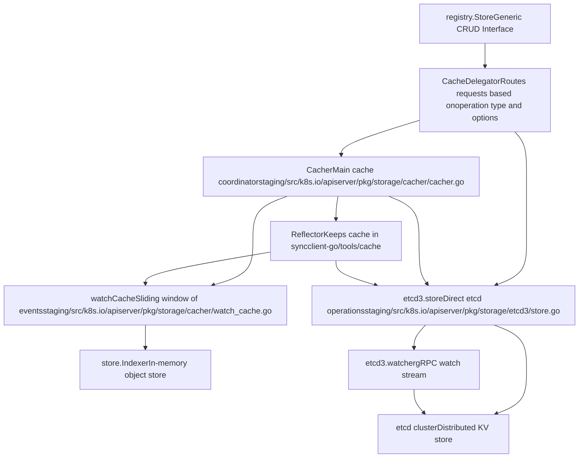
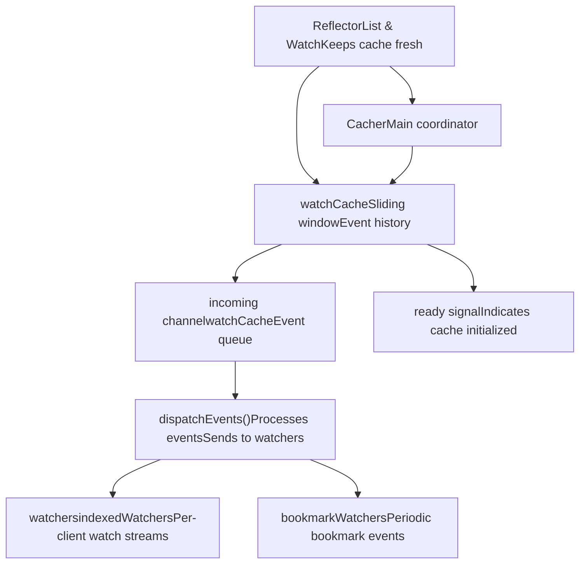
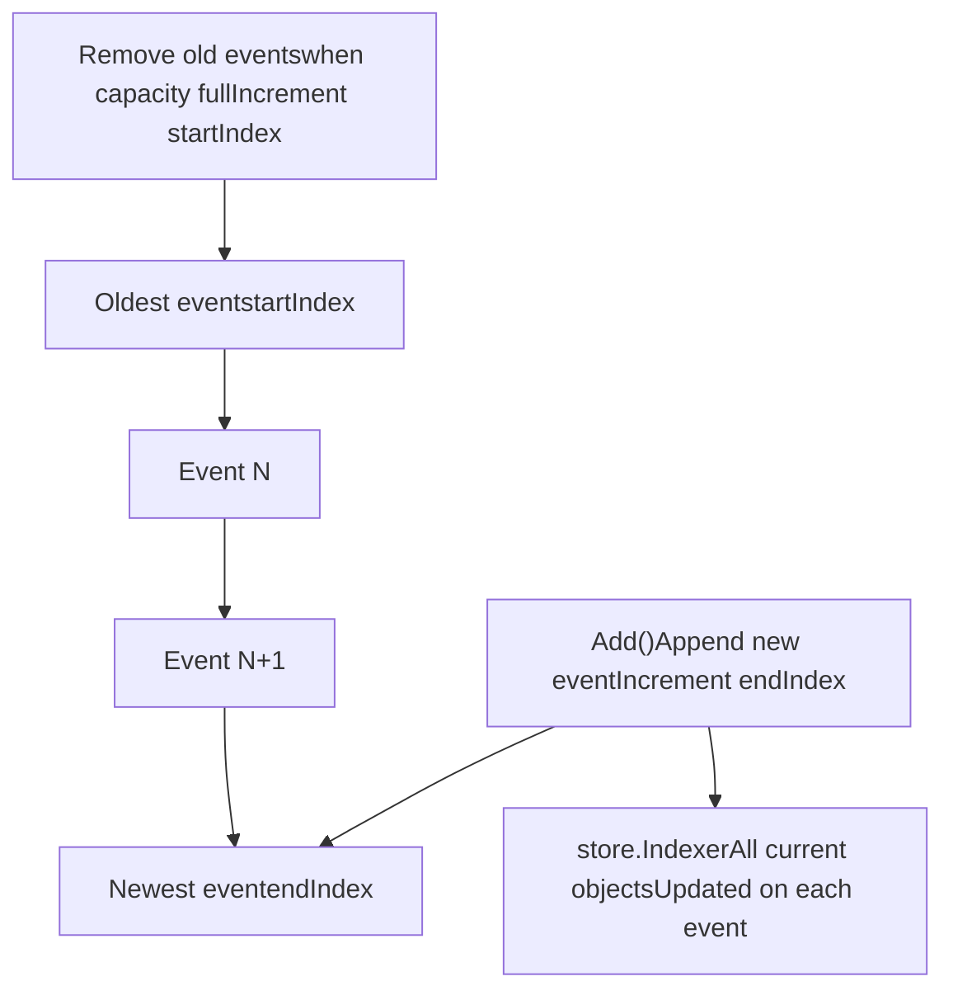
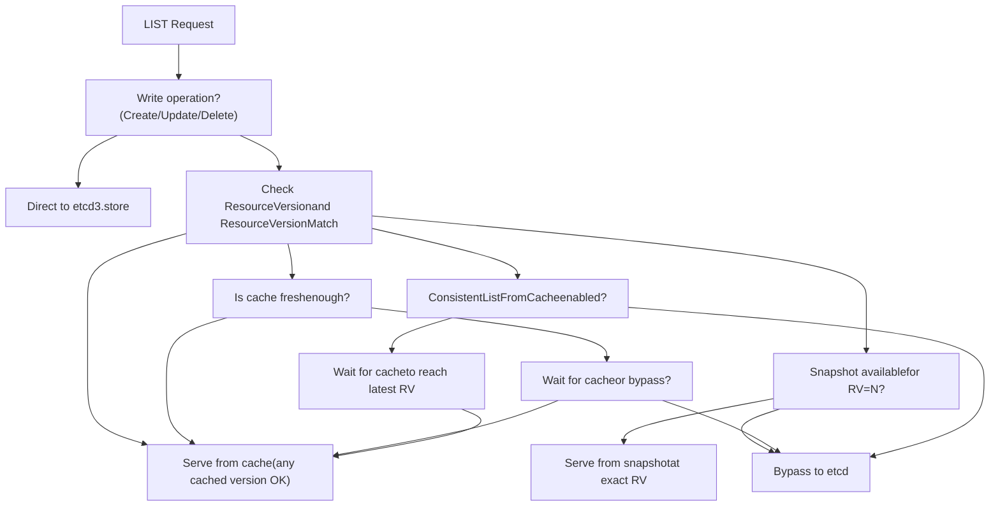

# 存储后端与缓存

相关源文件

-   [cmd/kube-apiserver/app/options/options.go](https://github.com/kubernetes/kubernetes/blob/2757a872/cmd/kube-apiserver/app/options/options.go)
-   [cmd/kube-apiserver/app/options/options\_test.go](https://github.com/kubernetes/kubernetes/blob/2757a872/cmd/kube-apiserver/app/options/options_test.go)
-   [cmd/kube-apiserver/app/options/validation.go](https://github.com/kubernetes/kubernetes/blob/2757a872/cmd/kube-apiserver/app/options/validation.go)
-   [cmd/kube-apiserver/app/options/validation\_test.go](https://github.com/kubernetes/kubernetes/blob/2757a872/cmd/kube-apiserver/app/options/validation_test.go)
-   [cmd/kube-apiserver/app/server.go](https://github.com/kubernetes/kubernetes/blob/2757a872/cmd/kube-apiserver/app/server.go)
-   [pkg/controlplane/controller/defaultservicecidr/OWNERS](https://github.com/kubernetes/kubernetes/blob/2757a872/pkg/controlplane/controller/defaultservicecidr/OWNERS)
-   [pkg/controlplane/controller/defaultservicecidr/default\_servicecidr\_controller.go](https://github.com/kubernetes/kubernetes/blob/2757a872/pkg/controlplane/controller/defaultservicecidr/default_servicecidr_controller.go)
-   [pkg/controlplane/controller/defaultservicecidr/default\_servicecidr\_controller\_test.go](https://github.com/kubernetes/kubernetes/blob/2757a872/pkg/controlplane/controller/defaultservicecidr/default_servicecidr_controller_test.go)
-   [pkg/kubeapiserver/options/serving.go](https://github.com/kubernetes/kubernetes/blob/2757a872/pkg/kubeapiserver/options/serving.go)
-   [pkg/registry/networking/servicecidr/doc.go](https://github.com/kubernetes/kubernetes/blob/2757a872/pkg/registry/networking/servicecidr/doc.go)
-   [pkg/registry/networking/servicecidr/storage/storage.go](https://github.com/kubernetes/kubernetes/blob/2757a872/pkg/registry/networking/servicecidr/storage/storage.go)
-   [pkg/registry/networking/servicecidr/strategy.go](https://github.com/kubernetes/kubernetes/blob/2757a872/pkg/registry/networking/servicecidr/strategy.go)
-   [pkg/registry/networking/servicecidr/strategy\_test.go](https://github.com/kubernetes/kubernetes/blob/2757a872/pkg/registry/networking/servicecidr/strategy_test.go)
-   [staging/src/k8s.io/apiserver/pkg/apis/example/install/install.go](https://github.com/kubernetes/kubernetes/blob/2757a872/staging/src/k8s.io/apiserver/pkg/apis/example/install/install.go)
-   [staging/src/k8s.io/apiserver/pkg/apis/example2/install/install.go](https://github.com/kubernetes/kubernetes/blob/2757a872/staging/src/k8s.io/apiserver/pkg/apis/example2/install/install.go)
-   [staging/src/k8s.io/apiserver/pkg/endpoints/filters/mux\_discovery\_complete.go](https://github.com/kubernetes/kubernetes/blob/2757a872/staging/src/k8s.io/apiserver/pkg/endpoints/filters/mux_discovery_complete.go)
-   [staging/src/k8s.io/apiserver/pkg/endpoints/filters/mux\_discovery\_complete\_test.go](https://github.com/kubernetes/kubernetes/blob/2757a872/staging/src/k8s.io/apiserver/pkg/endpoints/filters/mux_discovery_complete_test.go)
-   [staging/src/k8s.io/apiserver/pkg/endpoints/request/server\_shutdown\_signal.go](https://github.com/kubernetes/kubernetes/blob/2757a872/staging/src/k8s.io/apiserver/pkg/endpoints/request/server_shutdown_signal.go)
-   [staging/src/k8s.io/apiserver/pkg/registry/generic/options.go](https://github.com/kubernetes/kubernetes/blob/2757a872/staging/src/k8s.io/apiserver/pkg/registry/generic/options.go)
-   [staging/src/k8s.io/apiserver/pkg/registry/generic/registry/dryrun.go](https://github.com/kubernetes/kubernetes/blob/2757a872/staging/src/k8s.io/apiserver/pkg/registry/generic/registry/dryrun.go)
-   [staging/src/k8s.io/apiserver/pkg/registry/generic/registry/storage\_factory.go](https://github.com/kubernetes/kubernetes/blob/2757a872/staging/src/k8s.io/apiserver/pkg/registry/generic/registry/storage_factory.go)
-   [staging/src/k8s.io/apiserver/pkg/registry/generic/registry/store.go](https://github.com/kubernetes/kubernetes/blob/2757a872/staging/src/k8s.io/apiserver/pkg/registry/generic/registry/store.go)
-   [staging/src/k8s.io/apiserver/pkg/registry/generic/registry/store\_test.go](https://github.com/kubernetes/kubernetes/blob/2757a872/staging/src/k8s.io/apiserver/pkg/registry/generic/registry/store_test.go)
-   [staging/src/k8s.io/apiserver/pkg/registry/generic/storage\_decorator.go](https://github.com/kubernetes/kubernetes/blob/2757a872/staging/src/k8s.io/apiserver/pkg/registry/generic/storage_decorator.go)
-   [staging/src/k8s.io/apiserver/pkg/server/config.go](https://github.com/kubernetes/kubernetes/blob/2757a872/staging/src/k8s.io/apiserver/pkg/server/config.go)
-   [staging/src/k8s.io/apiserver/pkg/server/config\_selfclient.go](https://github.com/kubernetes/kubernetes/blob/2757a872/staging/src/k8s.io/apiserver/pkg/server/config_selfclient.go)
-   [staging/src/k8s.io/apiserver/pkg/server/config\_selfclient\_test.go](https://github.com/kubernetes/kubernetes/blob/2757a872/staging/src/k8s.io/apiserver/pkg/server/config_selfclient_test.go)
-   [staging/src/k8s.io/apiserver/pkg/server/config\_test.go](https://github.com/kubernetes/kubernetes/blob/2757a872/staging/src/k8s.io/apiserver/pkg/server/config_test.go)
-   [staging/src/k8s.io/apiserver/pkg/server/filters/with\_retry\_after.go](https://github.com/kubernetes/kubernetes/blob/2757a872/staging/src/k8s.io/apiserver/pkg/server/filters/with_retry_after.go)
-   [staging/src/k8s.io/apiserver/pkg/server/filters/with\_retry\_after\_test.go](https://github.com/kubernetes/kubernetes/blob/2757a872/staging/src/k8s.io/apiserver/pkg/server/filters/with_retry_after_test.go)
-   [staging/src/k8s.io/apiserver/pkg/server/genericapiserver.go](https://github.com/kubernetes/kubernetes/blob/2757a872/staging/src/k8s.io/apiserver/pkg/server/genericapiserver.go)
-   [staging/src/k8s.io/apiserver/pkg/server/genericapiserver\_graceful\_termination\_test.go](https://github.com/kubernetes/kubernetes/blob/2757a872/staging/src/k8s.io/apiserver/pkg/server/genericapiserver_graceful_termination_test.go)
-   [staging/src/k8s.io/apiserver/pkg/server/genericapiserver\_test.go](https://github.com/kubernetes/kubernetes/blob/2757a872/staging/src/k8s.io/apiserver/pkg/server/genericapiserver_test.go)
-   [staging/src/k8s.io/apiserver/pkg/server/lifecycle\_signals.go](https://github.com/kubernetes/kubernetes/blob/2757a872/staging/src/k8s.io/apiserver/pkg/server/lifecycle_signals.go)
-   [staging/src/k8s.io/apiserver/pkg/server/options/etcd.go](https://github.com/kubernetes/kubernetes/blob/2757a872/staging/src/k8s.io/apiserver/pkg/server/options/etcd.go)
-   [staging/src/k8s.io/apiserver/pkg/server/options/etcd\_test.go](https://github.com/kubernetes/kubernetes/blob/2757a872/staging/src/k8s.io/apiserver/pkg/server/options/etcd_test.go)
-   [staging/src/k8s.io/apiserver/pkg/server/options/server\_run\_options.go](https://github.com/kubernetes/kubernetes/blob/2757a872/staging/src/k8s.io/apiserver/pkg/server/options/server_run_options.go)
-   [staging/src/k8s.io/apiserver/pkg/server/options/server\_run\_options\_test.go](https://github.com/kubernetes/kubernetes/blob/2757a872/staging/src/k8s.io/apiserver/pkg/server/options/server_run_options_test.go)
-   [staging/src/k8s.io/apiserver/pkg/server/options/serving.go](https://github.com/kubernetes/kubernetes/blob/2757a872/staging/src/k8s.io/apiserver/pkg/server/options/serving.go)
-   [staging/src/k8s.io/apiserver/pkg/server/options/serving\_test.go](https://github.com/kubernetes/kubernetes/blob/2757a872/staging/src/k8s.io/apiserver/pkg/server/options/serving_test.go)
-   [staging/src/k8s.io/apiserver/pkg/server/storage/resource\_encoding\_config.go](https://github.com/kubernetes/kubernetes/blob/2757a872/staging/src/k8s.io/apiserver/pkg/server/storage/resource_encoding_config.go)
-   [staging/src/k8s.io/apiserver/pkg/server/storage/storage\_factory.go](https://github.com/kubernetes/kubernetes/blob/2757a872/staging/src/k8s.io/apiserver/pkg/server/storage/storage_factory.go)
-   [staging/src/k8s.io/apiserver/pkg/server/storage/storage\_factory\_test.go](https://github.com/kubernetes/kubernetes/blob/2757a872/staging/src/k8s.io/apiserver/pkg/server/storage/storage_factory_test.go)
-   [staging/src/k8s.io/apiserver/pkg/storage/cacher/cache\_watcher.go](https://github.com/kubernetes/kubernetes/blob/2757a872/staging/src/k8s.io/apiserver/pkg/storage/cacher/cache_watcher.go)
-   [staging/src/k8s.io/apiserver/pkg/storage/cacher/cache\_watcher\_test.go](https://github.com/kubernetes/kubernetes/blob/2757a872/staging/src/k8s.io/apiserver/pkg/storage/cacher/cache_watcher_test.go)
-   [staging/src/k8s.io/apiserver/pkg/storage/cacher/cacher.go](https://github.com/kubernetes/kubernetes/blob/2757a872/staging/src/k8s.io/apiserver/pkg/storage/cacher/cacher.go)
-   [staging/src/k8s.io/apiserver/pkg/storage/cacher/cacher\_test.go](https://github.com/kubernetes/kubernetes/blob/2757a872/staging/src/k8s.io/apiserver/pkg/storage/cacher/cacher_test.go)
-   [staging/src/k8s.io/apiserver/pkg/storage/cacher/cacher\_testing\_utils\_test.go](https://github.com/kubernetes/kubernetes/blob/2757a872/staging/src/k8s.io/apiserver/pkg/storage/cacher/cacher_testing_utils_test.go)
-   [staging/src/k8s.io/apiserver/pkg/storage/cacher/cacher\_whitebox\_test.go](https://github.com/kubernetes/kubernetes/blob/2757a872/staging/src/k8s.io/apiserver/pkg/storage/cacher/cacher_whitebox_test.go)
-   [staging/src/k8s.io/apiserver/pkg/storage/cacher/delegator.go](https://github.com/kubernetes/kubernetes/blob/2757a872/staging/src/k8s.io/apiserver/pkg/storage/cacher/delegator.go)
-   [staging/src/k8s.io/apiserver/pkg/storage/cacher/delegator\_test.go](https://github.com/kubernetes/kubernetes/blob/2757a872/staging/src/k8s.io/apiserver/pkg/storage/cacher/delegator_test.go)
-   [staging/src/k8s.io/apiserver/pkg/storage/cacher/lister\_watcher.go](https://github.com/kubernetes/kubernetes/blob/2757a872/staging/src/k8s.io/apiserver/pkg/storage/cacher/lister_watcher.go)
-   [staging/src/k8s.io/apiserver/pkg/storage/cacher/lister\_watcher\_test.go](https://github.com/kubernetes/kubernetes/blob/2757a872/staging/src/k8s.io/apiserver/pkg/storage/cacher/lister_watcher_test.go)
-   [staging/src/k8s.io/apiserver/pkg/storage/cacher/metrics/metrics.go](https://github.com/kubernetes/kubernetes/blob/2757a872/staging/src/k8s.io/apiserver/pkg/storage/cacher/metrics/metrics.go)
-   [staging/src/k8s.io/apiserver/pkg/storage/cacher/store/store.go](https://github.com/kubernetes/kubernetes/blob/2757a872/staging/src/k8s.io/apiserver/pkg/storage/cacher/store/store.go)
-   [staging/src/k8s.io/apiserver/pkg/storage/cacher/store/store\_btree.go](https://github.com/kubernetes/kubernetes/blob/2757a872/staging/src/k8s.io/apiserver/pkg/storage/cacher/store/store_btree.go)
-   [staging/src/k8s.io/apiserver/pkg/storage/cacher/store/store\_btree\_test.go](https://github.com/kubernetes/kubernetes/blob/2757a872/staging/src/k8s.io/apiserver/pkg/storage/cacher/store/store_btree_test.go)
-   [staging/src/k8s.io/apiserver/pkg/storage/cacher/store/store\_test.go](https://github.com/kubernetes/kubernetes/blob/2757a872/staging/src/k8s.io/apiserver/pkg/storage/cacher/store/store_test.go)
-   [staging/src/k8s.io/apiserver/pkg/storage/cacher/watch\_cache.go](https://github.com/kubernetes/kubernetes/blob/2757a872/staging/src/k8s.io/apiserver/pkg/storage/cacher/watch_cache.go)
-   [staging/src/k8s.io/apiserver/pkg/storage/cacher/watch\_cache\_interval.go](https://github.com/kubernetes/kubernetes/blob/2757a872/staging/src/k8s.io/apiserver/pkg/storage/cacher/watch_cache_interval.go)
-   [staging/src/k8s.io/apiserver/pkg/storage/cacher/watch\_cache\_interval\_test.go](https://github.com/kubernetes/kubernetes/blob/2757a872/staging/src/k8s.io/apiserver/pkg/storage/cacher/watch_cache_interval_test.go)
-   [staging/src/k8s.io/apiserver/pkg/storage/cacher/watch\_cache\_test.go](https://github.com/kubernetes/kubernetes/blob/2757a872/staging/src/k8s.io/apiserver/pkg/storage/cacher/watch_cache_test.go)
-   [staging/src/k8s.io/apiserver/pkg/storage/etcd3/event.go](https://github.com/kubernetes/kubernetes/blob/2757a872/staging/src/k8s.io/apiserver/pkg/storage/etcd3/event.go)
-   [staging/src/k8s.io/apiserver/pkg/storage/etcd3/event\_test.go](https://github.com/kubernetes/kubernetes/blob/2757a872/staging/src/k8s.io/apiserver/pkg/storage/etcd3/event_test.go)
-   [staging/src/k8s.io/apiserver/pkg/storage/etcd3/store.go](https://github.com/kubernetes/kubernetes/blob/2757a872/staging/src/k8s.io/apiserver/pkg/storage/etcd3/store.go)
-   [staging/src/k8s.io/apiserver/pkg/storage/etcd3/store\_test.go](https://github.com/kubernetes/kubernetes/blob/2757a872/staging/src/k8s.io/apiserver/pkg/storage/etcd3/store_test.go)
-   [staging/src/k8s.io/apiserver/pkg/storage/etcd3/watcher.go](https://github.com/kubernetes/kubernetes/blob/2757a872/staging/src/k8s.io/apiserver/pkg/storage/etcd3/watcher.go)
-   [staging/src/k8s.io/apiserver/pkg/storage/etcd3/watcher\_test.go](https://github.com/kubernetes/kubernetes/blob/2757a872/staging/src/k8s.io/apiserver/pkg/storage/etcd3/watcher_test.go)
-   [staging/src/k8s.io/apiserver/pkg/storage/interfaces.go](https://github.com/kubernetes/kubernetes/blob/2757a872/staging/src/k8s.io/apiserver/pkg/storage/interfaces.go)
-   [staging/src/k8s.io/apiserver/pkg/storage/storagebackend/config.go](https://github.com/kubernetes/kubernetes/blob/2757a872/staging/src/k8s.io/apiserver/pkg/storage/storagebackend/config.go)
-   [staging/src/k8s.io/apiserver/pkg/storage/storagebackend/factory/etcd3.go](https://github.com/kubernetes/kubernetes/blob/2757a872/staging/src/k8s.io/apiserver/pkg/storage/storagebackend/factory/etcd3.go)
-   [staging/src/k8s.io/apiserver/pkg/storage/storagebackend/factory/factory.go](https://github.com/kubernetes/kubernetes/blob/2757a872/staging/src/k8s.io/apiserver/pkg/storage/storagebackend/factory/factory.go)
-   [staging/src/k8s.io/apiserver/pkg/storage/testing/store\_benchmarks.go](https://github.com/kubernetes/kubernetes/blob/2757a872/staging/src/k8s.io/apiserver/pkg/storage/testing/store_benchmarks.go)
-   [staging/src/k8s.io/apiserver/pkg/storage/testing/store\_tests.go](https://github.com/kubernetes/kubernetes/blob/2757a872/staging/src/k8s.io/apiserver/pkg/storage/testing/store_tests.go)
-   [staging/src/k8s.io/apiserver/pkg/storage/testing/utils.go](https://github.com/kubernetes/kubernetes/blob/2757a872/staging/src/k8s.io/apiserver/pkg/storage/testing/utils.go)
-   [staging/src/k8s.io/apiserver/pkg/storage/testing/watcher\_tests.go](https://github.com/kubernetes/kubernetes/blob/2757a872/staging/src/k8s.io/apiserver/pkg/storage/testing/watcher_tests.go)
-   [staging/src/k8s.io/apiserver/pkg/storage/util.go](https://github.com/kubernetes/kubernetes/blob/2757a872/staging/src/k8s.io/apiserver/pkg/storage/util.go)
-   [staging/src/k8s.io/apiserver/pkg/storage/util\_test.go](https://github.com/kubernetes/kubernetes/blob/2757a872/staging/src/k8s.io/apiserver/pkg/storage/util_test.go)
-   [staging/src/k8s.io/apiserver/pkg/util/notfoundhandler/not\_found\_handler.go](https://github.com/kubernetes/kubernetes/blob/2757a872/staging/src/k8s.io/apiserver/pkg/util/notfoundhandler/not_found_handler.go)
-   [staging/src/k8s.io/apiserver/pkg/util/notfoundhandler/not\_found\_handler\_test.go](https://github.com/kubernetes/kubernetes/blob/2757a872/staging/src/k8s.io/apiserver/pkg/util/notfoundhandler/not_found_handler_test.go)
-   [staging/src/k8s.io/component-base/version/version.go](https://github.com/kubernetes/kubernetes/blob/2757a872/staging/src/k8s.io/component-base/version/version.go)
-   [test/integration/metrics/metrics\_test.go](https://github.com/kubernetes/kubernetes/blob/2757a872/test/integration/metrics/metrics_test.go)
-   [test/integration/openshift/openshift\_test.go](https://github.com/kubernetes/kubernetes/blob/2757a872/test/integration/openshift/openshift_test.go)

## 目的与范围

本页面记录了 Kubernetes API 服务器的存储后端与缓存架构。它解释了 API 服务器如何与 etcd（分布式键值存储）交互，以及缓存层如何通过减少 etcd 负载来优化读取操作。这包括 etcd3 存储实现、监视缓存（watch cache）机制，以及在缓存和存储之间路由请求的委派逻辑。

有关 API 校验和特性门控的信息，请参阅 [API 对象类型与校验](/kubernetes/kubernetes/2.2-api-object-types-and-validation)。有关该存储层如何集成到 API 服务器请求处理流水线中的详细信息，请参阅 [API 服务器架构](/kubernetes/kubernetes/3.1-api-server-architecture)。

---

## 存储架构概览

存储层提供两层架构：直接针对 etcd3 的存储后端，用于写入和一致性要求高的读取；以及一个缓存层（Cacher），它通过内存缓存服务于大多数读取操作。


**来源：** [staging/src/k8s.io/apiserver/pkg/storage/cacher/cacher.go262-343](https://github.com/kubernetes/kubernetes/blob/2757a872/staging/src/k8s.io/apiserver/pkg/storage/cacher/cacher.go#L262-L343) [staging/src/k8s.io/apiserver/pkg/storage/etcd3/store.go80-98](https://github.com/kubernetes/kubernetes/blob/2757a872/staging/src/k8s.io/apiserver/pkg/storage/etcd3/store.go#L80-L98) [staging/src/k8s.io/apiserver/pkg/storage/cacher/delegator.go1-20](https://github.com/kubernetes/kubernetes/blob/2757a872/staging/src/k8s.io/apiserver/pkg/storage/cacher/delegator.go#L1-L20)

---

## etcd3 存储后端

`etcd3.store` 通过 etcd v3 gRPC API 提供对 etcd 的直接访问。它实现了 `storage.Interface` 并处理所有持久化操作。

### 核心结构

Store 定义在 [staging/src/k8s.io/apiserver/pkg/storage/etcd3/store.go80-98](https://github.com/kubernetes/kubernetes/blob/2757a872/staging/src/k8s.io/apiserver/pkg/storage/etcd3/store.go#L80-L98) 中：

```
type store struct {
    client             *kubernetes.Client    // etcd 客户端包装器
    codec              runtime.Codec         // 序列化
    versioner          storage.Versioner     // 资源版本处理
    transformer        value.Transformer     // 加密/解密
    pathPrefix         string                // 例如 "/registry/"
    groupResource      schema.GroupResource  // 用于指标/日志
    watcher            *watcher              // watch 实现
    leaseManager       *leaseManager         // TTL 管理
}
```
### 关键操作

| 操作 | 方法 | 说明 | 绕过缓存 |
| --- | --- | --- | --- |
| **Create** | `Create()` | 创建新对象，若已存在则失败 | 始终 |
| **Update** | `GuaranteedUpdate()` | 带重试的比较并交换（Compare-and-swap）更新 | 始终 |
| **Delete** | `Delete()` | 按前置条件删除对象 | 始终 |
| **Get** | `Get()` | 检索单个对象 | 否（通过缓存） |
| **List** | `GetList()` | 带过滤检索对象列表 | 否（通过缓存） |
| **Watch** | `Watch()` | 流式传输对象变更 | 否（通过缓存） |

**写入路径：** 所有写入操作（Create、Update、Delete）均通过乐观并发控制直接进入 etcd。Store 使用资源版本执行 Compare-And-Swap 操作以确保一致性 [staging/src/k8s.io/apiserver/pkg/storage/etcd3/store.go273-339](https://github.com/kubernetes/kubernetes/blob/2757a872/staging/src/k8s.io/apiserver/pkg/storage/etcd3/store.go#L273-L339)

**读取路径：** 读操作（Get、List）在被 Cacher 包装时可由缓存服务。对于缓存未命中或需要特定一致性保证时，会直接从 etcd 读取 [staging/src/k8s.io/apiserver/pkg/storage/etcd3/store.go238-271](https://github.com/kubernetes/kubernetes/blob/2757a872/staging/src/k8s.io/apiserver/pkg/storage/etcd3/store.go#L238-L271)

**来源：** [staging/src/k8s.io/apiserver/pkg/storage/etcd3/store.go80-271](https://github.com/kubernetes/kubernetes/blob/2757a872/staging/src/k8s.io/apiserver/pkg/storage/etcd3/store.go#L80-L271) [staging/src/k8s.io/apiserver/pkg/storage/etcd3/store.go273-339](https://github.com/kubernetes/kubernetes/blob/2757a872/staging/src/k8s.io/apiserver/pkg/storage/etcd3/store.go#L273-L339)

---

## 缓存层架构

Cacher 提供 etcd 内容的内存缓存，以减少读取操作对 etcd 的负载。它使用一个 Reflector 持续监视 etcd，从而保持对象的同步视图。

### Cacher 结构


Cacher 在 [staging/src/k8s.io/apiserver/pkg/storage/cacher/cacher.go348-483](https://github.com/kubernetes/kubernetes/blob/2757a872/staging/src/k8s.io/apiserver/pkg/storage/cacher/cacher.go#L348-L483) 中进行初始化。关键初始化步骤：

1.  **创建 watchCache：** 存储近期事件的滑动窗口 [staging/src/k8s.io/apiserver/pkg/storage/cacher/cacher.go437-439](https://github.com/kubernetes/kubernetes/blob/2757a872/staging/src/k8s.io/apiserver/pkg/storage/cacher/cacher.go#L437-L439)
2.  **创建 Reflector：** 使用 `ListAndWatch` 保持缓存同步 [staging/src/k8s.io/apiserver/pkg/storage/cacher/cacher.go443-453](https://github.com/kubernetes/kubernetes/blob/2757a872/staging/src/k8s.io/apiserver/pkg/storage/cacher/cacher.go#L443-L453)
3.  **启动后台 goroutine：**
    -   事件分发器：[staging/src/k8s.io/apiserver/pkg/storage/cacher/cacher.go467](https://github.com/kubernetes/kubernetes/blob/2757a872/staging/src/k8s.io/apiserver/pkg/storage/cacher/cacher.go#L467-L467)
    -   进度请求器：[staging/src/k8s.io/apiserver/pkg/storage/cacher/cacher.go468](https://github.com/kubernetes/kubernetes/blob/2757a872/staging/src/k8s.io/apiserver/pkg/storage/cacher/cacher.go#L468-L468)
    -   缓存同步：[staging/src/k8s.io/apiserver/pkg/storage/cacher/cacher.go470-481](https://github.com/kubernetes/kubernetes/blob/2757a872/staging/src/k8s.io/apiserver/pkg/storage/cacher/cacher.go#L470-L481)

**来源：** [staging/src/k8s.io/apiserver/pkg/storage/cacher/cacher.go262-343](https://github.com/kubernetes/kubernetes/blob/2757a872/staging/src/k8s.io/apiserver/pkg/storage/cacher/cacher.go#L262-L343) [staging/src/k8s.io/apiserver/pkg/storage/cacher/cacher.go348-483](https://github.com/kubernetes/kubernetes/blob/2757a872/staging/src/k8s.io/apiserver/pkg/storage/cacher/cacher.go#L348-L483)

---

## Watch Cache 实现

`watchCache` 是维护近期事件滑动窗口和所有对象当前状态的核心数据结构。

### Watch Cache 结构

watchCache 维护两个关键的数据结构 [staging/src/k8s.io/apiserver/pkg/storage/cacher/watch\_cache.go89-164](https://github.com/kubernetes/kubernetes/blob/2757a872/staging/src/k8s.io/apiserver/pkg/storage/cacher/watch_cache.go#L89-L164)：

| 组件 | 类型 | 用途 |
| --- | --- | --- |
| `cache` | `[]*watchCacheEvent` | 近期事件的循环缓冲区 |
| `store` | `store.Indexer` | 所有对象的当前状态（支持查询） |
| `resourceVersion` | `uint64` | 最新观测到的资源版本 |
| `startIndex`, `endIndex` | `int` | 循环缓冲区中的窗口 |
| `capacity` | `int` | 要保留的最大事件数 |

### 事件历史窗口

缓存维护一个由 `eventFreshDuration`（默认约 75 秒）定义的事件滑动窗口 [staging/src/k8s.io/apiserver/pkg/storage/cacher/cacher.go69-77](https://github.com/kubernetes/kubernetes/blob/2757a872/staging/src/k8s.io/apiserver/pkg/storage/cacher/cacher.go#L69-L77)：


### 事件如何流转

1.  **Reflector 监视 etcd：** Reflector 对底层存储调用 `ListAndWatch` [staging/src/k8s.io/apiserver/pkg/storage/cacher/cacher.go497](https://github.com/kubernetes/kubernetes/blob/2757a872/staging/src/k8s.io/apiserver/pkg/storage/cacher/cacher.go#L497-L497)

2.  **事件到达 watchCache：** 通过 `Add()`、`Update()`、`Delete()` 方法 [staging/src/k8s.io/apiserver/pkg/storage/cacher/watch\_cache.go234-275](https://github.com/kubernetes/kubernetes/blob/2757a872/staging/src/k8s.io/apiserver/pkg/storage/cacher/watch_cache.go#L234-L275)

3.  **watchCache 处理事件：**

    -   更新 `store`（当前状态） [staging/src/k8s.io/apiserver/pkg/storage/cacher/watch\_cache.go398-432](https://github.com/kubernetes/kubernetes/blob/2757a872/staging/src/k8s.io/apiserver/pkg/storage/cacher/watch_cache.go#L398-L432)
    -   追加到 `cache` 数组（历史记录） [staging/src/k8s.io/apiserver/pkg/storage/cacher/watch\_cache.go398-432](https://github.com/kubernetes/kubernetes/blob/2757a872/staging/src/k8s.io/apiserver/pkg/storage/cacher/watch_cache.go#L398-L432)
    -   调用 `eventHandler` 通知 Cacher [staging/src/k8s.io/apiserver/pkg/storage/cacher/watch\_cache.go427](https://github.com/kubernetes/kubernetes/blob/2757a872/staging/src/k8s.io/apiserver/pkg/storage/cacher/watch_cache.go#L427-L427)
4.  **Cacher 分发给观察者（watchers）：** 通过 `processEvent()` 和 `dispatchEvent()` [staging/src/k8s.io/apiserver/pkg/storage/cacher/cacher.go853-859](https://github.com/kubernetes/kubernetes/blob/2757a872/staging/src/k8s.io/apiserver/pkg/storage/cacher/cacher.go#L853-L859) [staging/src/k8s.io/apiserver/pkg/storage/cacher/cacher.go953-1013](https://github.com/kubernetes/kubernetes/blob/2757a872/staging/src/k8s.io/apiserver/pkg/storage/cacher/cacher.go#L953-L1013)

**来源：** [staging/src/k8s.io/apiserver/pkg/storage/cacher/watch\_cache.go89-207](https://github.com/kubernetes/kubernetes/blob/2757a872/staging/src/k8s.io/apiserver/pkg/storage/cacher/watch_cache.go#L89-L207) [staging/src/k8s.io/apiserver/pkg/storage/cacher/watch\_cache.go234-275](https://github.com/kubernetes/kubernetes/blob/2757a872/staging/src/k8s.io/apiserver/pkg/storage/cacher/watch_cache.go#L234-L275) [staging/src/k8s.io/apiserver/pkg/storage/cacher/watch\_cache.go398-432](https://github.com/kubernetes/kubernetes/blob/2757a872/staging/src/k8s.io/apiserver/pkg/storage/cacher/watch_cache.go#L398-L432)

---

## 缓存委派逻辑

`CacheDelegator` 根据操作类型、一致性要求和特性门控确定请求应由缓存服务还是绕过缓存直接发往 etcd。

### List 操作的决策流


### 关键决策点

委派逻辑实现在 [staging/src/k8s.io/apiserver/pkg/storage/cacher/delegator.go](https://github.com/kubernetes/kubernetes/blob/2757a872/staging/src/k8s.io/apiserver/pkg/storage/cacher/delegator.go) 中。关键决策函数：

| 函数 | 目的 | 位置 |
| --- | --- | --- |
| `ShouldDelegateList()` | 确定 LIST 是否应绕过缓存 | [delegator.go22-69](https://github.com/kubernetes/kubernetes/blob/2757a872/delegator.go#L22-L69) |
| `shouldDelegateWatch()` | 确定 WATCH 是否应绕过缓存 | [delegator.go71-80](https://github.com/kubernetes/kubernetes/blob/2757a872/delegator.go#L71-L80) |
| `shouldDelegateGet()` | 确定 GET 是否应绕过缓存 | [delegator.go82-91](https://github.com/kubernetes/kubernetes/blob/2757a872/delegator.go#L82-L91) |

**List 委派规则** [staging/src/k8s.io/apiserver/pkg/storage/cacher/delegator.go22-69](https://github.com/kubernetes/kubernetes/blob/2757a872/staging/src/k8s.io/apiserver/pkg/storage/cacher/delegator.go#L22-L69)：

1.  **始终走缓存：** `ResourceVersion="0"`（接受任何版本）
2.  **始终走缓存（若启用）：** 空 RV 且开启 `ConsistentListFromCache` 特性门控
3.  **可用则走缓存：** `ResourceVersionMatch=Exact` 且存在匹配快照（若开启 `ListFromCacheSnapshot`）
4.  **绕过缓存：** 非零 RV 的分页请求（缓存处理过于复杂）
5.  **绕过缓存：** 继续令牌（continue token）指向不在缓存中的 RV

### 控制行为的特性门控

| 特性门控 | 默认值 | 效果 |
| --- | --- | --- |
| `ConsistentListFromCache` | Beta (1.31+ 启用) | 通过等待缓存变新，支持从缓存提供一致的 LIST 服务 |
| `ListFromCacheSnapshot` | Alpha (默认禁用) | 支持从不可变快照提供精确 RV 的 LIST 服务 |
| `ResilientWatchCacheInitialization` | Alpha | 缓存未就绪时返回 429 而非 503 |
| `WatchList` | Alpha | 启用结合了 list + watch 的 watch-list 请求 |

**来源：** [staging/src/k8s.io/apiserver/pkg/storage/cacher/delegator.go22-91](https://github.com/kubernetes/kubernetes/blob/2757a872/staging/src/k8s.io/apiserver/pkg/storage/cacher/delegator.go#L22-L91) [staging/src/k8s.io/apiserver/pkg/storage/cacher/cacher.go520-532](https://github.com/kubernetes/kubernetes/blob/2757a872/staging/src/k8s.io/apiserver/pkg/storage/cacher/cacher.go#L520-L532) [staging/src/k8s.io/apiserver/pkg/storage/cacher/cacher.go749-759](https://github.com/kubernetes/kubernetes/blob/2757a872/staging/src/k8s.io/apiserver/pkg/storage/cacher/cacher.go#L749-L759)

---

## 读请求流程

### Get 操作流程

> **[Mermaid 序列图]**
> *(图表结构无法解析)*

`Get()` 流程实现在 [staging/src/k8s.io/apiserver/pkg/storage/cacher/cacher.go679-712](https://github.com/kubernetes/kubernetes/blob/2757a872/staging/src/k8s.io/apiserver/pkg/storage/cacher/cacher.go#L679-L712) 中。关键点：

1.  **等待缓存就绪：** [staging/src/k8s.io/apiserver/pkg/storage/cacher/cacher.go520-532](https://github.com/kubernetes/kubernetes/blob/2757a872/staging/src/k8s.io/apiserver/pkg/storage/cacher/cacher.go#L520-L532)
2.  **解析资源版本：** [staging/src/k8s.io/apiserver/pkg/storage/cacher/cacher.go684-687](https://github.com/kubernetes/kubernetes/blob/2757a872/staging/src/k8s.io/apiserver/pkg/storage/cacher/cacher.go#L684-L687)
3.  **等待直到缓存足够新：** [staging/src/k8s.io/apiserver/pkg/storage/cacher/watch\_cache.go699-767](https://github.com/kubernetes/kubernetes/blob/2757a872/staging/src/k8s.io/apiserver/pkg/storage/cacher/watch_cache.go#L699-L767)
4.  **从存储中检索：** [staging/src/k8s.io/apiserver/pkg/storage/cacher/cacher.go694-711](https://github.com/kubernetes/kubernetes/blob/2757a872/staging/src/k8s.io/apiserver/pkg/storage/cacher/cacher.go#L694-L711)

**来源：** [staging/src/k8s.io/apiserver/pkg/storage/cacher/cacher.go679-712](https://github.com/kubernetes/kubernetes/blob/2757a872/staging/src/k8s.io/apiserver/pkg/storage/cacher/cacher.go#L679-L712) [staging/src/k8s.io/apiserver/pkg/storage/cacher/watch\_cache.go699-767](https://github.com/kubernetes/kubernetes/blob/2757a872/staging/src/k8s.io/apiserver/pkg/storage/cacher/watch_cache.go#L699-L767)

### List 操作流程

> **[Mermaid 序列图]**
> *(图表结构无法解析)*

`GetList()` 流程实现在 [staging/src/k8s.io/apiserver/pkg/storage/cacher/cacher.go734-826](https://github.com/kubernetes/kubernetes/blob/2757a872/staging/src/k8s.io/apiserver/pkg/storage/cacher/cacher.go#L734-L826) 中。关键决策点：

1.  **委派检查：** [staging/src/k8s.io/apiserver/pkg/storage/cacher/delegator.go22-69](https://github.com/kubernetes/kubernetes/blob/2757a872/staging/src/k8s.io/apiserver/pkg/storage/cacher/delegator.go#L22-L69)
2.  **等待缓存就绪：** [staging/src/k8s.io/apiserver/pkg/storage/cacher/cacher.go749-759](https://github.com/kubernetes/kubernetes/blob/2757a872/staging/src/k8s.io/apiserver/pkg/storage/cacher/cacher.go#L749-L759)
3.  **快照或常规读取：** [staging/src/k8s.io/apiserver/pkg/storage/cacher/watch\_cache.go769-870](https://github.com/kubernetes/kubernetes/blob/2757a872/staging/src/k8s.io/apiserver/pkg/storage/cacher/watch_cache.go#L769-L870)
4.  **应用谓词（Predicates）：** [staging/src/k8s.io/apiserver/pkg/storage/cacher/cacher.go788-801](https://github.com/kubernetes/kubernetes/blob/2757a872/staging/src/k8s.io/apiserver/pkg/storage/cacher/cacher.go#L788-L801)

**来源：** [staging/src/k8s.io/apiserver/pkg/storage/cacher/cacher.go734-826](https://github.com/kubernetes/kubernetes/blob/2757a872/staging/src/k8s.io/apiserver/pkg/storage/cacher/cacher.go#L734-L826) [staging/src/k8s.io/apiserver/pkg/storage/cacher/delegator.go22-69](https://github.com/kubernetes/kubernetes/blob/2757a872/staging/src/k8s.io/apiserver/pkg/storage/cacher/delegator.go#L22-L69) [staging/src/k8s.io/apiserver/pkg/storage/cacher/watch\_cache.go769-870](https://github.com/kubernetes/kubernetes/blob/2757a872/staging/src/k8s.io/apiserver/pkg/storage/cacher/watch_cache.go#L769-L870)

---

## 写请求流程

所有写入操作都绕过缓存，直接进入 etcd。缓存通过 Reflector 的监视来观察这些变化。

> **[Mermaid 序列图]**
> *(图表结构无法解析)*

**写操作特点：**

1.  **原子性：** 使用乐观并发控制（比较并交换） [staging/src/k8s.io/apiserver/pkg/storage/etcd3/store.go462-619](https://github.com/kubernetes/kubernetes/blob/2757a872/staging/src/k8s.io/apiserver/pkg/storage/etcd3/store.go#L462-L619)
2.  **重试逻辑：** 冲突时自动重试 [staging/src/k8s.io/apiserver/pkg/storage/etcd3/store.go500-616](https://github.com/kubernetes/kubernetes/blob/2757a872/staging/src/k8s.io/apiserver/pkg/storage/etcd3/store.go#L500-L616)
3.  **缓存同步：** 缓存通过 Reflector 监视获取变更 [staging/src/k8s.io/apiserver/pkg/storage/cacher/cacher.go485-501](https://github.com/kubernetes/kubernetes/blob/2757a872/staging/src/k8s.io/apiserver/pkg/storage/cacher/cacher.go#L485-L501)
4.  **最终一致性：** 写入和缓存更新之间存在短暂延迟（约 100ms）

**来源：** [staging/src/k8s.io/apiserver/pkg/storage/etcd3/store.go462-619](https://github.com/kubernetes/kubernetes/blob/2757a872/staging/src/k8s.io/apiserver/pkg/storage/etcd3/store.go#L462-L619) [staging/src/k8s.io/apiserver/pkg/storage/cacher/cacher.go485-501](https://github.com/kubernetes/kubernetes/blob/2757a872/staging/src/k8s.io/apiserver/pkg/storage/cacher/cacher.go#L485-L501)

---

## Watch 请求流程

当请求的资源版本处于缓存的事件历史窗口内时，Watch 请求可以由缓存处理。

> **[Mermaid 序列图]**
> *(图表结构无法解析)*

**Watch 实现细节：**

1.  **初始事件：** 从缓存历史中发送 [staging/src/k8s.io/apiserver/pkg/storage/cacher/cacher.go630-637](https://github.com/kubernetes/kubernetes/blob/2757a872/staging/src/k8s.io/apiserver/pkg/storage/cacher/cacher.go#L630-L637)
2.  **观察者注册：** 添加到索引化的观察者映射中 [staging/src/k8s.io/apiserver/pkg/storage/cacher/cacher.go642-665](https://github.com/kubernetes/kubernetes/blob/2757a872/staging/src/k8s.io/apiserver/pkg/storage/cacher/cacher.go#L642-L665)
3.  **事件过滤：** 基于标签（label）/字段（field）选择器 [staging/src/k8s.io/apiserver/pkg/storage/cacher/cacher.go599-608](https://github.com/kubernetes/kubernetes/blob/2757a872/staging/src/k8s.io/apiserver/pkg/storage/cacher/cacher.go#L599-L608)
4.  **书签（Bookmarks）：** 定期发送心跳事件 [staging/src/k8s.io/apiserver/pkg/storage/cacher/cacher.go661-663](https://github.com/kubernetes/kubernetes/blob/2757a872/staging/src/k8s.io/apiserver/pkg/storage/cacher/cacher.go#L661-L663)
5.  **超时处理：** 观察者设有截止日期 [staging/src/k8s.io/apiserver/pkg/storage/cacher/cacher.go590-608](https://github.com/kubernetes/kubernetes/blob/2757a872/staging/src/k8s.io/apiserver/pkg/storage/cacher/cacher.go#L590-L608)

**来源：** [staging/src/k8s.io/apiserver/pkg/storage/cacher/cacher.go508-677](https://github.com/kubernetes/kubernetes/blob/2757a872/staging/src/k8s.io/apiserver/pkg/storage/cacher/cacher.go#L508-L677) [staging/src/k8s.io/apiserver/pkg/storage/cacher/cacher.go642-665](https://github.com/kubernetes/kubernetes/blob/2757a872/staging/src/k8s.io/apiserver/pkg/storage/cacher/cacher.go#L642-L665) [staging/src/k8s.io/apiserver/pkg/storage/cacher/watch\_cache.go630-637](https://github.com/kubernetes/kubernetes/blob/2757a872/staging/src/k8s.io/apiserver/pkg/storage/cacher/watch_cache.go#L630-L637)

---

## 缓存一致性与新鲜度

缓存通过持续同步和资源版本跟踪来维护与 etcd 的一致性。

### 资源版本语义

| RV 值 | 语义 | 缓存行为 |
| --- | --- | --- |
| Empty `""` | 任何版本（最新） | ConsistentListFromCache：等待最新版本。
否则：绕过缓存发往 etcd。 |
| `"0"` | 任何缓存版本 | 始终从缓存提供服务。 |
| `"N"` (特定值) | 至少是版本 N | 等待直到 `cache.resourceVersion >= N`。 |
| RVM=`Exact` | 恰好是版本 N | 若有快照则使用快照，否则绕过缓存。 |
| RVM=`NotOlderThan` | 至少是版本 N | 等待缓存达到版本 N。 |

**新鲜度保证：**

缓存实现了多种机制来确保新鲜度 [staging/src/k8s.io/apiserver/pkg/storage/cacher/watch\_cache.go699-767](https://github.com/kubernetes/kubernetes/blob/2757a872/staging/src/k8s.io/apiserver/pkg/storage/cacher/watch_cache.go#L699-L767)：

1.  **进度请求：** `ConditionalProgressRequester` 定期向 etcd 请求进度，以确保监视不会停滞 [staging/src/k8s.io/apiserver/pkg/storage/cacher/progress/progress\_requester.go](https://github.com/kubernetes/kubernetes/blob/2757a872/staging/src/k8s.io/apiserver/pkg/storage/cacher/progress/progress_requester.go)

2.  **带超时阻塞：** 当缓存陈旧时，请求将阻塞最多 `blockTimeout`（3 秒）以等待缓存追赶 [staging/src/k8s.io/apiserver/pkg/storage/cacher/watch\_cache.go48-53](https://github.com/kubernetes/kubernetes/blob/2757a872/staging/src/k8s.io/apiserver/pkg/storage/cacher/watch_cache.go#L48-L53)

3.  **回退到 etcd：** 如果缓存无法在限定时间内变新，请求将回退到直接针对 etcd 的读取 [staging/src/k8s.io/apiserver/pkg/storage/cacher/delegator.go93-156](https://github.com/kubernetes/kubernetes/blob/2757a872/staging/src/k8s.io/apiserver/pkg/storage/cacher/delegator.go#L93-L156)

**来源：** [staging/src/k8s.io/apiserver/pkg/storage/cacher/watch\_cache.go699-767](https://github.com/kubernetes/kubernetes/blob/2757a872/staging/src/k8s.io/apiserver/pkg/storage/cacher/watch_cache.go#L699-L767) [staging/src/k8s.io/apiserver/pkg/storage/cacher/watch\_cache.go48-53](https://github.com/kubernetes/kubernetes/blob/2757a872/staging/src/k8s.io/apiserver/pkg/storage/cacher/watch_cache.go#L48-L53)

---

## 基于快照的读取

当开启 `ListFromCacheSnapshot` 特性门控时，缓存可以使用不可变快照在精确的资源版本上提供 LIST 请求服务。

### 快照架构

**快照创建：** 在处理完每个事件后，如果 `snapshottingEnabled` 为 true，watchCache 会创建一个不可变快照 [staging/src/k8s.io/apiserver/pkg/storage/cacher/watch\_cache.go408-410](https://github.com/kubernetes/kubernetes/blob/2757a872/staging/src/k8s.io/apiserver/pkg/storage/cacher/watch_cache.go#L408-L410)：

```
if w.snapshottingEnabled.Load() {
    w.snapshots.Add(w.resourceVersion, w.store.NewOrderedLister())
}
```
**快照检索：** 在处理精确 RV 匹配的 LIST 请求时 [staging/src/k8s.io/apiserver/pkg/storage/cacher/watch\_cache.go849-860](https://github.com/kubernetes/kubernetes/blob/2757a872/staging/src/k8s.io/apiserver/pkg/storage/cacher/watch_cache.go#L849-L860)：

1.  向 snapshotter 查询该 RV。
2.  如果快照存在，则使用它（不可变且一致的视图）。
3.  如果快照不存在，回退到常规列表或绕过缓存直接发往 etcd。

**快照清理：** compactor 监控 etcd 的压缩状态，并移除早于 etcd 压缩修订版本（compact revision）的快照 [staging/src/k8s.io/apiserver/pkg/storage/cacher/compactor.go](https://github.com/kubernetes/kubernetes/blob/2757a872/staging/src/k8s.io/apiserver/pkg/storage/cacher/compactor.go)

**来源：** [staging/src/k8s.io/apiserver/pkg/storage/cacher/watch\_cache.go408-410](https://github.com/kubernetes/kubernetes/blob/2757a872/staging/src/k8s.io/apiserver/pkg/storage/cacher/watch_cache.go#L408-L410) [staging/src/k8s.io/apiserver/pkg/storage/cacher/watch\_cache.go849-860](https://github.com/kubernetes/kubernetes/blob/2757a872/staging/src/k8s.io/apiserver/pkg/storage/cacher/watch_cache.go#L849-L860) [staging/src/k8s.io/apiserver/pkg/storage/cacher/compactor.go1-100](https://github.com/kubernetes/kubernetes/blob/2757a872/staging/src/k8s.io/apiserver/pkg/storage/cacher/compactor.go#L1-L100)

---

## 性能考量

### 缓存大小调整

缓存大小是动态的，并受 [staging/src/k8s.io/apiserver/pkg/storage/cacher/watch\_cache.go99-103](https://github.com/kubernetes/kubernetes/blob/2757a872/staging/src/k8s.io/apiserver/pkg/storage/cacher/watch_cache.go#L99-L103) 约束：

-   **下限：** `defaultLowerBoundCapacity = 100` 个事件
-   **上限：** `defaultUpperBoundCapacity = 100 * 1024` 个事件 (100K)
-   **动态调整：** 缓存大小可以根据事件发生率增长/收缩。

缓存可以通过 kube-apiserver 上的 `--watch-cache-sizes` 标志进行各资源的配置 [staging/src/k8s.io/apiserver/pkg/server/options/etcd.go66-67](https://github.com/kubernetes/kubernetes/blob/2757a872/staging/src/k8s.io/apiserver/pkg/server/options/etcd.go#L66-L67)

### 内存使用

| 组件 | 典型内存使用 |
| --- | --- |
| watchCache 事件缓冲区 | ~100 字节/事件 × 容量 |
| store.Indexer | 资源的全部对象的大小 |
| 快照（如果开启） | store 在不同 RV 时的多个副本 |
| 活跃监视者（watchers） | 约 1KB/观察者 × 观察者数量 |

**权衡取舍：**

-   **更大的缓存容量：** 为监视（watch）提供更多历史记录，但内存使用更高。
-   **更多快照：** 更快的精确 RV 读取，但内存使用明显更高。
-   **更大的 eventFreshDuration：** 支持更长的监视历史，但需要更大的缓存容量。

**来源：** [staging/src/k8s.io/apiserver/pkg/storage/cacher/watch\_cache.go99-103](https://github.com/kubernetes/kubernetes/blob/2757a872/staging/src/k8s.io/apiserver/pkg/storage/cacher/watch_cache.go#L99-L103) [staging/src/k8s.io/apiserver/pkg/storage/cacher/watch\_cache.go209-231](https://github.com/kubernetes/kubernetes/blob/2757a872/staging/src/k8s.io/apiserver/pkg/storage/cacher/watch_cache.go#L209-L231)

### 指标（Metrics）

监控缓存性能的关键指标 [staging/src/k8s.io/apiserver/pkg/storage/cacher/metrics/metrics.go](https://github.com/kubernetes/kubernetes/blob/2757a872/staging/src/k8s.io/apiserver/pkg/storage/cacher/metrics/metrics.go)：

| 指标 | 说明 |
| --- | --- |
| `apiserver_watch_cache_capacity_increase_total` | 缓存容量增加总次数 |
| `apiserver_watch_cache_capacity_decrease_total` | 缓存容量减少总次数 |
| `apiserver_watch_cache_events_dispatched_total` | 发送给观察者的事件数 |
| `apiserver_watch_cache_initializations_total` | 缓存初始化计数 |
| `apiserver_watch_cache_consistent_read_total` | 从缓存进行的一致性读取总数 |
| `apiserver_storage_list_returned_objects` | LIST 返回的对象数 |
| `apiserver_storage_list_total` | LIST 请求总数 |

**来源：** [staging/src/k8s.io/apiserver/pkg/storage/cacher/metrics/metrics.go1-200](https://github.com/kubernetes/kubernetes/blob/2757a872/staging/src/k8s.io/apiserver/pkg/storage/cacher/metrics/metrics.go#L1-L200)

---

## 总结

存储后端与缓存架构提供了：

1.  **直接 etcd3 存储：** 处理所有写入和一致性要求高的读取。
2.  **监视缓存（watch cache）：** 近期事件的内存滑动窗口。
3.  **智能委派：** 根据需求在缓存和 etcd 之间路由请求。
4.  **快照支持：** 在精确资源版本上的不可变视图（可选）。
5.  **持续同步：** Reflector 保持缓存新鲜。
6.  **特性门控控制：** 缓存改进能力的渐进式发布。

该架构在降低读取操作对 etcd 负载的同时，仍能在需要时为写入和线性读取提供强一致性保证。
