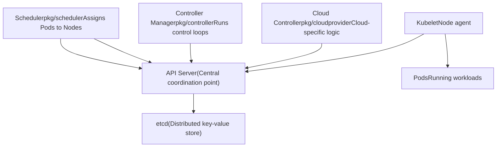
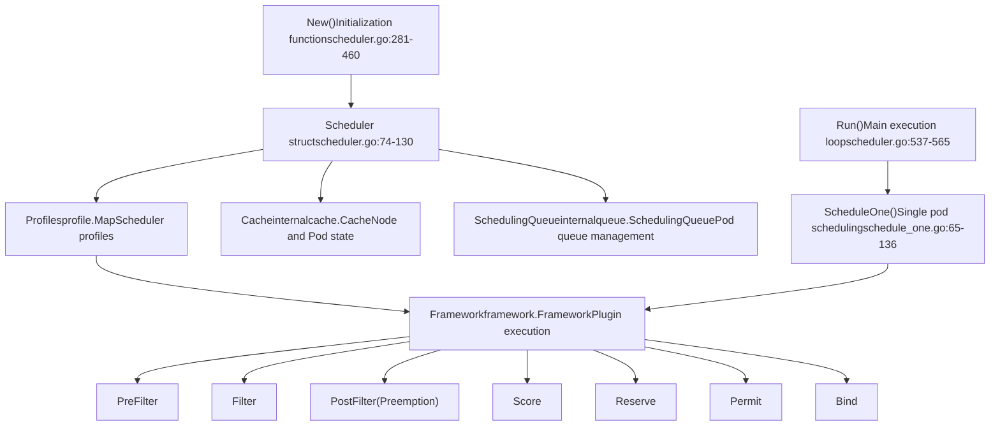
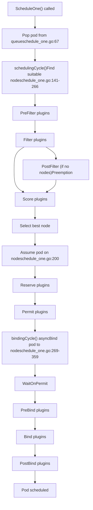
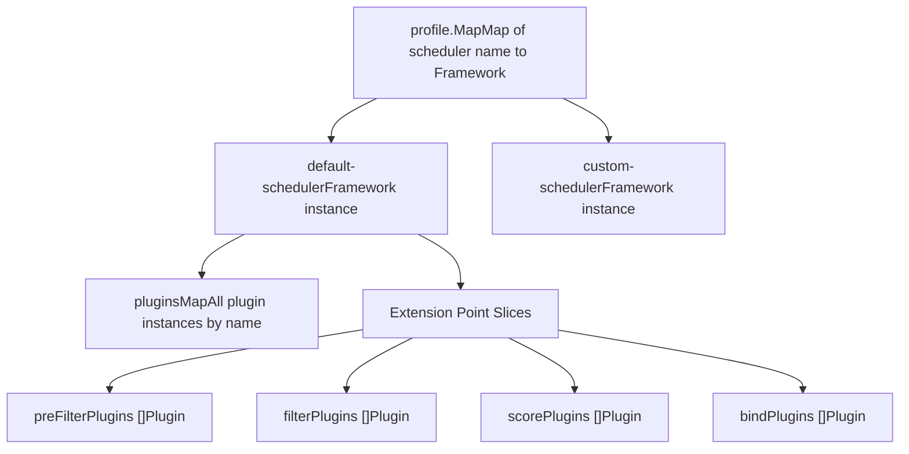
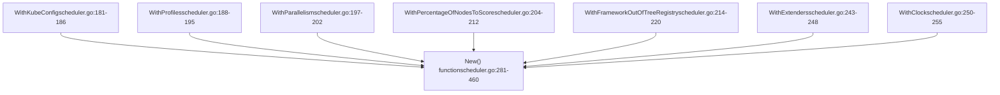
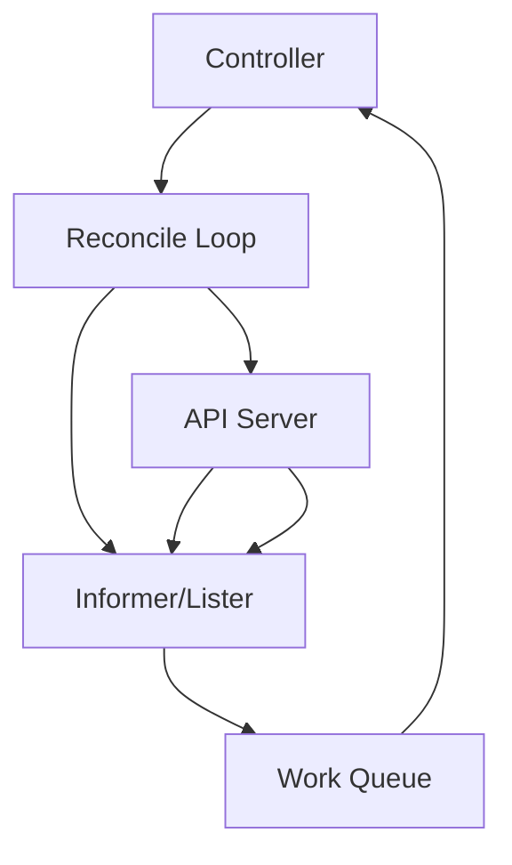
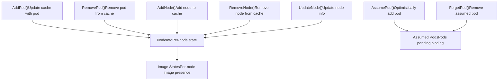
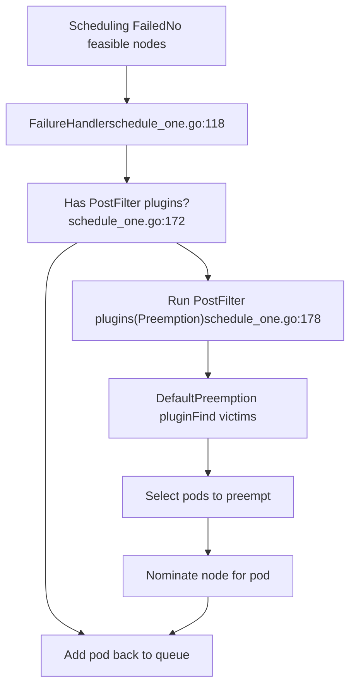
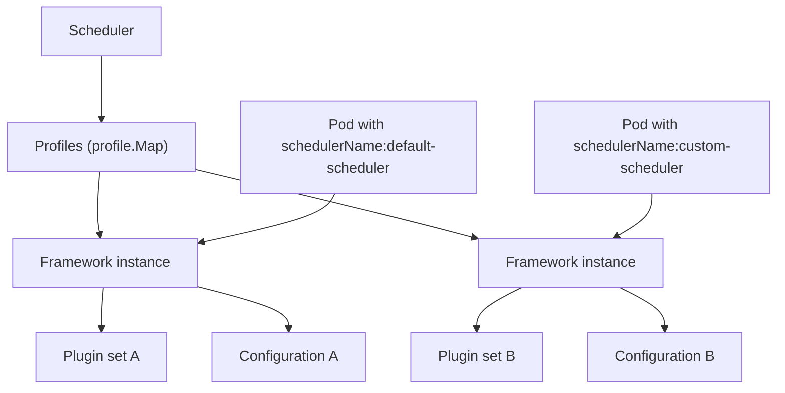

# 控制平面组件

相关源码文件

-   [cmd/kube-apiserver/app/options/options.go](https://github.com/kubernetes/kubernetes/blob/2757a872/cmd/kube-apiserver/app/options/options.go)
-   [cmd/kube-apiserver/app/options/options\_test.go](https://github.com/kubernetes/kubernetes/blob/2757a872/cmd/kube-apiserver/app/options/options_test.go)
-   [cmd/kube-apiserver/app/options/validation.go](https://github.com/kubernetes/kubernetes/blob/2757a872/cmd/kube-apiserver/app/options/validation.go)
-   [cmd/kube-apiserver/app/options/validation\_test.go](https://github.com/kubernetes/kubernetes/blob/2757a872/cmd/kube-apiserver/app/options/validation_test.go)
-   [cmd/kube-apiserver/app/server.go](https://github.com/kubernetes/kubernetes/blob/2757a872/cmd/kube-apiserver/app/server.go)
-   [cmd/kube-scheduler/app/server\_test.go](https://github.com/kubernetes/kubernetes/blob/2757a872/cmd/kube-scheduler/app/server_test.go)
-   [pkg/controlplane/controller/defaultservicecidr/OWNERS](https://github.com/kubernetes/kubernetes/blob/2757a872/pkg/controlplane/controller/defaultservicecidr/OWNERS)
-   [pkg/controlplane/controller/defaultservicecidr/default\_servicecidr\_controller.go](https://github.com/kubernetes/kubernetes/blob/2757a872/pkg/controlplane/controller/defaultservicecidr/default_servicecidr_controller.go)
-   [pkg/controlplane/controller/defaultservicecidr/default\_servicecidr\_controller\_test.go](https://github.com/kubernetes/kubernetes/blob/2757a872/pkg/controlplane/controller/defaultservicecidr/default_servicecidr_controller_test.go)
-   [pkg/kubeapiserver/options/serving.go](https://github.com/kubernetes/kubernetes/blob/2757a872/pkg/kubeapiserver/options/serving.go)
-   [pkg/registry/networking/servicecidr/doc.go](https://github.com/kubernetes/kubernetes/blob/2757a872/pkg/registry/networking/servicecidr/doc.go)
-   [pkg/registry/networking/servicecidr/storage/storage.go](https://github.com/kubernetes/kubernetes/blob/2757a872/pkg/registry/networking/servicecidr/storage/storage.go)
-   [pkg/registry/networking/servicecidr/strategy.go](https://github.com/kubernetes/kubernetes/blob/2757a872/pkg/registry/networking/servicecidr/strategy.go)
-   [pkg/registry/networking/servicecidr/strategy\_test.go](https://github.com/kubernetes/kubernetes/blob/2757a872/pkg/registry/networking/servicecidr/strategy_test.go)
-   [pkg/scheduler/apis/config/types\_test.go](https://github.com/kubernetes/kubernetes/blob/2757a872/pkg/scheduler/apis/config/types_test.go)
-   [pkg/scheduler/extender.go](https://github.com/kubernetes/kubernetes/blob/2757a872/pkg/scheduler/extender.go)
-   [pkg/scheduler/extender\_test.go](https://github.com/kubernetes/kubernetes/blob/2757a872/pkg/scheduler/extender_test.go)
-   [pkg/scheduler/framework/events.go](https://github.com/kubernetes/kubernetes/blob/2757a872/pkg/scheduler/framework/events.go)
-   [pkg/scheduler/framework/events\_test.go](https://github.com/kubernetes/kubernetes/blob/2757a872/pkg/scheduler/framework/events_test.go)
-   [pkg/scheduler/framework/interface.go](https://github.com/kubernetes/kubernetes/blob/2757a872/pkg/scheduler/framework/interface.go)
-   [pkg/scheduler/framework/interface\_test.go](https://github.com/kubernetes/kubernetes/blob/2757a872/pkg/scheduler/framework/interface_test.go)
-   [pkg/scheduler/framework/plugins/defaultpreemption/default\_preemption.go](https://github.com/kubernetes/kubernetes/blob/2757a872/pkg/scheduler/framework/plugins/defaultpreemption/default_preemption.go)
-   [pkg/scheduler/framework/plugins/defaultpreemption/default\_preemption\_test.go](https://github.com/kubernetes/kubernetes/blob/2757a872/pkg/scheduler/framework/plugins/defaultpreemption/default_preemption_test.go)
-   [pkg/scheduler/framework/preemption/preemption.go](https://github.com/kubernetes/kubernetes/blob/2757a872/pkg/scheduler/framework/preemption/preemption.go)
-   [pkg/scheduler/framework/preemption/preemption\_test.go](https://github.com/kubernetes/kubernetes/blob/2757a872/pkg/scheduler/framework/preemption/preemption_test.go)
-   [pkg/scheduler/framework/runtime/framework.go](https://github.com/kubernetes/kubernetes/blob/2757a872/pkg/scheduler/framework/runtime/framework.go)
-   [pkg/scheduler/framework/runtime/framework\_test.go](https://github.com/kubernetes/kubernetes/blob/2757a872/pkg/scheduler/framework/runtime/framework_test.go)
-   [pkg/scheduler/framework/types.go](https://github.com/kubernetes/kubernetes/blob/2757a872/pkg/scheduler/framework/types.go)
-   [pkg/scheduler/framework/types\_test.go](https://github.com/kubernetes/kubernetes/blob/2757a872/pkg/scheduler/framework/types_test.go)
-   [pkg/scheduler/schedule\_one.go](https://github.com/kubernetes/kubernetes/blob/2757a872/pkg/scheduler/schedule_one.go)
-   [pkg/scheduler/schedule\_one\_test.go](https://github.com/kubernetes/kubernetes/blob/2757a872/pkg/scheduler/schedule_one_test.go)
-   [pkg/scheduler/scheduler.go](https://github.com/kubernetes/kubernetes/blob/2757a872/pkg/scheduler/scheduler.go)
-   [pkg/scheduler/scheduler\_test.go](https://github.com/kubernetes/kubernetes/blob/2757a872/pkg/scheduler/scheduler_test.go)
-   [pkg/scheduler/testing/framework/fake\_extender.go](https://github.com/kubernetes/kubernetes/blob/2757a872/pkg/scheduler/testing/framework/fake_extender.go)
-   [pkg/scheduler/testing/framework/fake\_plugins.go](https://github.com/kubernetes/kubernetes/blob/2757a872/pkg/scheduler/testing/framework/fake_plugins.go)
-   [pkg/scheduler/util/utils.go](https://github.com/kubernetes/kubernetes/blob/2757a872/pkg/scheduler/util/utils.go)
-   [pkg/scheduler/util/utils\_test.go](https://github.com/kubernetes/kubernetes/blob/2757a872/pkg/scheduler/util/utils_test.go)
-   [staging/src/k8s.io/apiserver/pkg/apis/example/install/install.go](https://github.com/kubernetes/kubernetes/blob/2757a872/staging/src/k8s.io/apiserver/pkg/apis/example/install/install.go)
-   [staging/src/k8s.io/apiserver/pkg/apis/example2/install/install.go](https://github.com/kubernetes/kubernetes/blob/2757a872/staging/src/k8s.io/apiserver/pkg/apis/example2/install/install.go)
-   [staging/src/k8s.io/apiserver/pkg/endpoints/filters/mux\_discovery\_complete.go](https://github.com/kubernetes/kubernetes/blob/2757a872/staging/src/k8s.io/apiserver/pkg/endpoints/filters/mux_discovery_complete.go)
-   [staging/src/k8s.io/apiserver/pkg/endpoints/filters/mux\_discovery\_complete\_test.go](https://github.com/kubernetes/kubernetes/blob/2757a872/staging/src/k8s.io/apiserver/pkg/endpoints/filters/mux_discovery_complete_test.go)
-   [staging/src/k8s.io/apiserver/pkg/endpoints/request/server\_shutdown\_signal.go](https://github.com/kubernetes/kubernetes/blob/2757a872/staging/src/k8s.io/apiserver/pkg/endpoints/request/server_shutdown_signal.go)
-   [staging/src/k8s.io/apiserver/pkg/server/config.go](https://github.com/kubernetes/kubernetes/blob/2757a872/staging/src/k8s.io/apiserver/pkg/server/config.go)
-   [staging/src/k8s.io/apiserver/pkg/server/config\_selfclient.go](https://github.com/kubernetes/kubernetes/blob/2757a872/staging/src/k8s.io/apiserver/pkg/server/config_selfclient.go)
-   [staging/src/k8s.io/apiserver/pkg/server/config\_selfclient\_test.go](https://github.com/kubernetes/kubernetes/blob/2757a872/staging/src/k8s.io/apiserver/pkg/server/config_selfclient_test.go)
-   [staging/src/k8s.io/apiserver/pkg/server/config\_test.go](https://github.com/kubernetes/kubernetes/blob/2757a872/staging/src/k8s.io/apiserver/pkg/server/config_test.go)
-   [staging/src/k8s.io/apiserver/pkg/server/filters/with\_retry\_after.go](https://github.com/kubernetes/kubernetes/blob/2757a872/staging/src/k8s.io/apiserver/pkg/server/filters/with_retry_after.go)
-   [staging/src/k8s.io/apiserver/pkg/server/filters/with\_retry\_after\_test.go](https://github.com/kubernetes/kubernetes/blob/2757a872/staging/src/k8s.io/apiserver/pkg/server/filters/with_retry_after_test.go)
-   [staging/src/k8s.io/apiserver/pkg/server/genericapiserver.go](https://github.com/kubernetes/kubernetes/blob/2757a872/staging/src/k8s.io/apiserver/pkg/server/genericapiserver.go)
-   [staging/src/k8s.io/apiserver/pkg/server/genericapiserver\_graceful\_termination\_test.go](https://github.com/kubernetes/kubernetes/blob/2757a872/staging/src/k8s.io/apiserver/pkg/server/genericapiserver_graceful_termination_test.go)
-   [staging/src/k8s.io/apiserver/pkg/server/genericapiserver\_test.go](https://github.com/kubernetes/kubernetes/blob/2757a872/staging/src/k8s.io/apiserver/pkg/server/genericapiserver_test.go)
-   [staging/src/k8s.io/apiserver/pkg/server/lifecycle\_signals.go](https://github.com/kubernetes/kubernetes/blob/2757a872/staging/src/k8s.io/apiserver/pkg/server/lifecycle_signals.go)
-   [staging/src/k8s.io/apiserver/pkg/server/options/etcd.go](https://github.com/kubernetes/kubernetes/blob/2757a872/staging/src/k8s.io/apiserver/pkg/server/options/etcd.go)
-   [staging/src/k8s.io/apiserver/pkg/server/options/etcd\_test.go](https://github.com/kubernetes/kubernetes/blob/2757a872/staging/src/k8s.io/apiserver/pkg/server/options/etcd_test.go)
-   [staging/src/k8s.io/apiserver/pkg/server/options/server\_run\_options.go](https://github.com/kubernetes/kubernetes/blob/2757a872/staging/src/k8s.io/apiserver/pkg/server/options/server_run_options.go)
-   [staging/src/k8s.io/apiserver/pkg/server/options/server\_run\_options\_test.go](https://github.com/kubernetes/kubernetes/blob/2757a872/staging/src/k8s.io/apiserver/pkg/server/options/server_run_options_test.go)
-   [staging/src/k8s.io/apiserver/pkg/server/options/serving.go](https://github.com/kubernetes/kubernetes/blob/2757a872/staging/src/k8s.io/apiserver/pkg/server/options/serving.go)
-   [staging/src/k8s.io/apiserver/pkg/server/options/serving\_test.go](https://github.com/kubernetes/kubernetes/blob/2757a872/staging/src/k8s.io/apiserver/pkg/server/options/serving_test.go)
-   [staging/src/k8s.io/apiserver/pkg/server/storage/resource\_encoding\_config.go](https://github.com/kubernetes/kubernetes/blob/2757a872/staging/src/k8s.io/apiserver/pkg/server/storage/resource_encoding_config.go)
-   [staging/src/k8s.io/apiserver/pkg/server/storage/storage\_factory.go](https://github.com/kubernetes/kubernetes/blob/2757a872/staging/src/k8s.io/apiserver/pkg/server/storage/storage_factory.go)
-   [staging/src/k8s.io/apiserver/pkg/server/storage/storage\_factory\_test.go](https://github.com/kubernetes/kubernetes/blob/2757a872/staging/src/k8s.io/apiserver/pkg/server/storage/storage_factory_test.go)
-   [staging/src/k8s.io/apiserver/pkg/storage/storagebackend/config.go](https://github.com/kubernetes/kubernetes/blob/2757a872/staging/src/k8s.io/apiserver/pkg/storage/storagebackend/config.go)
-   [staging/src/k8s.io/apiserver/pkg/storage/storagebackend/factory/etcd3.go](https://github.com/kubernetes/kubernetes/blob/2757a872/staging/src/k8s.io/apiserver/pkg/storage/storagebackend/factory/etcd3.go)
-   [staging/src/k8s.io/apiserver/pkg/storage/storagebackend/factory/factory.go](https://github.com/kubernetes/kubernetes/blob/2757a872/staging/src/k8s.io/apiserver/pkg/storage/storagebackend/factory/factory.go)
-   [staging/src/k8s.io/apiserver/pkg/util/notfoundhandler/not\_found\_handler.go](https://github.com/kubernetes/kubernetes/blob/2757a872/staging/src/k8s.io/apiserver/pkg/util/notfoundhandler/not_found_handler.go)
-   [staging/src/k8s.io/apiserver/pkg/util/notfoundhandler/not\_found\_handler\_test.go](https://github.com/kubernetes/kubernetes/blob/2757a872/staging/src/k8s.io/apiserver/pkg/util/notfoundhandler/not_found_handler_test.go)
-   [staging/src/k8s.io/component-base/version/version.go](https://github.com/kubernetes/kubernetes/blob/2757a872/staging/src/k8s.io/component-base/version/version.go)
-   [test/integration/openshift/openshift\_test.go](https://github.com/kubernetes/kubernetes/blob/2757a872/test/integration/openshift/openshift_test.go)
-   [test/integration/scheduler/eventhandler/eventhandler\_test.go](https://github.com/kubernetes/kubernetes/blob/2757a872/test/integration/scheduler/eventhandler/eventhandler_test.go)
-   [test/integration/scheduler/filters/filters\_test.go](https://github.com/kubernetes/kubernetes/blob/2757a872/test/integration/scheduler/filters/filters_test.go)
-   [test/integration/scheduler/plugins/plugins\_test.go](https://github.com/kubernetes/kubernetes/blob/2757a872/test/integration/scheduler/plugins/plugins_test.go)
-   [test/integration/scheduler/preemption/preemption\_test.go](https://github.com/kubernetes/kubernetes/blob/2757a872/test/integration/scheduler/preemption/preemption_test.go)
-   [test/integration/scheduler/rescheduling\_test.go](https://github.com/kubernetes/kubernetes/blob/2757a872/test/integration/scheduler/rescheduling_test.go)
-   [test/integration/scheduler/scheduler\_test.go](https://github.com/kubernetes/kubernetes/blob/2757a872/test/integration/scheduler/scheduler_test.go)
-   [test/integration/scheduler/scoring/priorities\_test.go](https://github.com/kubernetes/kubernetes/blob/2757a872/test/integration/scheduler/scoring/priorities_test.go)
-   [test/integration/scheduler/util.go](https://github.com/kubernetes/kubernetes/blob/2757a872/test/integration/scheduler/util.go)
-   [test/integration/util/util.go](https://github.com/kubernetes/kubernetes/blob/2757a872/test/integration/util/util.go)

## 目的与范围

本页概述了 Kubernetes 控制平面组件，这些组件在仓库代码库中有显著体现。控制平面负责维护集群的期望状态、就调度作出全局决策，并检测和响应集群事件。

本文档涵盖：

-   控制平面组件的高层架构
-   调度器组件结构与初始化
-   控制平面组件如何通过 API Server 交互
-   配置与 Profile 管理

有关调度器内部架构、插件框架和调度算法的详细信息，请参见[调度器](/kubernetes/kubernetes/3.1-api-server-architecture)。

## 控制平面架构

Kubernetes 控制平面由多个组件构成，这些组件协同工作以管理集群状态。该代码库中体现的主要组件有：

**来源：** [pkg/scheduler/scheduler.go1-678](https://github.com/kubernetes/kubernetes/blob/2757a872/pkg/scheduler/scheduler.go#L1-L678) 高层系统图

## 调度器组件

调度器是在该代码库中体现最为广泛的控制平面组件。它负责根据资源需求、约束和策略，将新创建的 Pod 分配到 Node。

### 调度器结构

**来源：** [pkg/scheduler/scheduler.go74-130](https://github.com/kubernetes/kubernetes/blob/2757a872/pkg/scheduler/scheduler.go#L74-L130) [pkg/scheduler/scheduler.go281-460](https://github.com/kubernetes/kubernetes/blob/2757a872/pkg/scheduler/scheduler.go#L281-L460) [pkg/scheduler/schedule\_one.go65-136](https://github.com/kubernetes/kubernetes/blob/2757a872/pkg/scheduler/schedule_one.go#L65-L136)

### 关键数据结构

`Scheduler` 结构体包含执行调度操作所需的核心组件：

| 字段 | 类型 | 用途 |
| --- | --- | --- |
| `Cache` | `internalcache.Cache` | 存储节点和 Pod 信息，包括 assumed pods |
| `SchedulingQueue` | `internalqueue.SchedulingQueue` | 管理等待调度的 Pod |
| `Profiles` | `profile.Map` | 包含带有插件配置的调度 profile |
| `Extenders` | `[]fwk.Extender` | 通过 HTTP 提供的外部调度扩展 |
| `NextPod` | `func() (*QueuedPodInfo, error)` | 从队列中获取下一个 Pod 的函数 |
| `SchedulePod` | Scheduling algorithm function | 尝试为 Pod 找到一个 Node |
| `FailureHandler` | `FailureHandlerFn` | 处理调度失败 |

**来源：** [pkg/scheduler/scheduler.go74-130](https://github.com/kubernetes/kubernetes/blob/2757a872/pkg/scheduler/scheduler.go#L74-L130)

### 调度器初始化

调度器初始化过程包含若干步骤：

> **[Mermaid 时序图]**
> *(图表结构无法解析)*

**来源：** [pkg/scheduler/scheduler.go281-460](https://github.com/kubernetes/kubernetes/blob/2757a872/pkg/scheduler/scheduler.go#L281-L460) [pkg/scheduler/framework/runtime/framework.go305-456](https://github.com/kubernetes/kubernetes/blob/2757a872/pkg/scheduler/framework/runtime/framework.go#L305-L456)

### 调度周期

核心调度操作发生在 `ScheduleOne` 方法中：

**来源：** [pkg/scheduler/schedule\_one.go65-136](https://github.com/kubernetes/kubernetes/blob/2757a872/pkg/scheduler/schedule_one.go#L65-L136) [pkg/scheduler/schedule\_one.go141-266](https://github.com/kubernetes/kubernetes/blob/2757a872/pkg/scheduler/schedule_one.go#L141-L266) [pkg/scheduler/schedule\_one.go269-359](https://github.com/kubernetes/kubernetes/blob/2757a872/pkg/scheduler/schedule_one.go#L269-L359)

## 调度器 Profile 与插件框架

调度器支持多个调度 profile，每个 profile 都有自己的一组插件和配置。这使得不同工作负载能够采用不同的调度行为。

### Profile 结构

**来源：** [pkg/scheduler/scheduler.go362-404](https://github.com/kubernetes/kubernetes/blob/2757a872/pkg/scheduler/scheduler.go#L362-L404) [pkg/scheduler/framework/runtime/framework.go55-105](https://github.com/kubernetes/kubernetes/blob/2757a872/pkg/scheduler/framework/runtime/framework.go#L55-L105)

### 插件注册表与配置

插件系统通过注册表模式进行初始化：

| 组件 | 位置 | 用途 |
| --- | --- | --- |
| `Registry` | `frameworkruntime.Registry` | 将插件名称映射到工厂函数 |
| `NewInTreeRegistry()` | `frameworkplugins.NewInTreeRegistry()` | 创建包含内置插件的注册表 |
| `Merge()` | Registry method | 将 out-of-tree 插件添加到注册表 |
| `NewFramework()` | `frameworkruntime.NewFramework()` | 创建包含插件的框架实例 |

**来源：** [pkg/scheduler/scheduler.go307-310](https://github.com/kubernetes/kubernetes/blob/2757a872/pkg/scheduler/scheduler.go#L307-L310) [pkg/scheduler/framework/runtime/framework.go305-456](https://github.com/kubernetes/kubernetes/blob/2757a872/pkg/scheduler/framework/runtime/framework.go#L305-L456)

## 调度器配置选项

调度器在初始化期间可接受多种配置选项：

**来源：** [pkg/scheduler/scheduler.go156-265](https://github.com/kubernetes/kubernetes/blob/2757a872/pkg/scheduler/scheduler.go#L156-L265) [pkg/scheduler/scheduler.go281-460](https://github.com/kubernetes/kubernetes/blob/2757a872/pkg/scheduler/scheduler.go#L281-L460)

### 默认配置值

调度器为多个配置参数提供默认值：

| 参数 | 默认值 | 来源 |
| --- | --- | --- |
| `percentageOfNodesToScore` | `schedulerapi.DefaultPercentageOfNodesToScore` | [scheduler.go269](https://github.com/kubernetes/kubernetes/blob/2757a872/scheduler.go#L269-L269) |
| `podInitialBackoffSeconds` | `internalqueue.DefaultPodInitialBackoffDuration` | [scheduler.go270](https://github.com/kubernetes/kubernetes/blob/2757a872/scheduler.go#L270-L270) |
| `podMaxBackoffSeconds` | `internalqueue.DefaultPodMaxBackoffDuration` | [scheduler.go271](https://github.com/kubernetes/kubernetes/blob/2757a872/scheduler.go#L271-L271) |
| `podMaxInUnschedulablePodsDuration` | `internalqueue.DefaultPodMaxInUnschedulablePodsDuration` | [scheduler.go272](https://github.com/kubernetes/kubernetes/blob/2757a872/scheduler.go#L272-L272) |
| `parallelism` | `parallelize.DefaultParallelism` | [scheduler.go273](https://github.com/kubernetes/kubernetes/blob/2757a872/scheduler.go#L273-L273) |

**来源：** [pkg/scheduler/scheduler.go267-279](https://github.com/kubernetes/kubernetes/blob/2757a872/pkg/scheduler/scheduler.go#L267-L279)

## 与 API Server 的交互

所有控制平面组件都通过 API Server 使用 watch 机制和 CRUD 操作进行交互：

> **[Mermaid 时序图]**
> *(图表结构无法解析)*

**来源：** [pkg/scheduler/scheduler.go455-459](https://github.com/kubernetes/kubernetes/blob/2757a872/pkg/scheduler/scheduler.go#L455-L459) [pkg/scheduler/scheduler.go567-573](https://github.com/kubernetes/kubernetes/blob/2757a872/pkg/scheduler/scheduler.go#L567-L573)

## 事件处理器与资源监听

调度器会为多种 Kubernetes 资源注册事件处理器，以便对集群变更作出响应：

### 已监听的资源

| 资源 | 操作类型 | 用途 |
| --- | --- | --- |
| Pod | Add, Update, Delete | 跟踪 Pod 生命周期以支持调度决策 |
| Node | Add, Update, Delete | 维护节点可用性与容量 |
| PersistentVolume | Add, Update, Delete | 卷绑定决策 |
| PersistentVolumeClaim | Add, Update, Delete | 卷绑定决策 |
| Service | Add, Update, Delete | Service 亲和性调度 |
| StorageClass | Add, Update, Delete | 动态卷供给 |
| CSINode | Add, Update, Delete | CSI 驱动可用性 |

**来源：** [pkg/scheduler/scheduler.go455-459](https://github.com/kubernetes/kubernetes/blob/2757a872/pkg/scheduler/scheduler.go#L455-L459) [pkg/scheduler/framework/types.go64-81](https://github.com/kubernetes/kubernetes/blob/2757a872/pkg/scheduler/framework/types.go#L64-L81)

## Controller Manager 组件

Controller Manager 运行多个控制器，用于维护集群期望状态。虽然控制器实现位于 `pkg/controller`，但它们与 API Server 的交互方式与调度器类似。

### 通用控制器模式

**来源：** 高层系统图

## Cloud Controller Manager

Cloud Controller Manager 包含特定于云提供商的控制循环。它运行的控制器会与底层云基础设施交互。

**关键组件：**

-   Node controller：与云提供商协同管理节点生命周期
-   Route controller：在云网络中设置路由
-   Service controller：创建/更新/删除云负载均衡器

**来源：** 高层系统图，参考 [pkg/cloudprovider](https://github.com/kubernetes/kubernetes/blob/2757a872/pkg/cloudprovider)

## 调度器缓存与状态管理

调度器维护集群状态的内部缓存，以支持高效调度决策：

**来源：** [pkg/scheduler/scheduler.go421](https://github.com/kubernetes/kubernetes/blob/2757a872/pkg/scheduler/scheduler.go#L421-L421) [pkg/scheduler/schedule\_one.go200](https://github.com/kubernetes/kubernetes/blob/2757a872/pkg/scheduler/schedule_one.go#L200-L200)

### 已假定 Pod

调度器使用 “assume” 机制来优化调度吞吐量：

1.  在选择节点后，调度器“假定”该 Pod 已被调度
2.  在实际绑定前，缓存会被乐观更新
3.  后续调度决策会看到该 assumed Pod 的资源消耗
4.  若绑定失败，该 Pod 会从缓存中被“忘记”

**来源：** [pkg/scheduler/schedule\_one.go196-208](https://github.com/kubernetes/kubernetes/blob/2757a872/pkg/scheduler/schedule_one.go#L196-L208) [pkg/scheduler/schedule\_one.go214-216](https://github.com/kubernetes/kubernetes/blob/2757a872/pkg/scheduler/schedule_one.go#L214-L216)

## 失败处理与抢占

当 Pod 无法被调度时，调度器会调用失败处理器：

**来源：** [pkg/scheduler/schedule\_one.go117-120](https://github.com/kubernetes/kubernetes/blob/2757a872/pkg/scheduler/schedule_one.go#L117-L120) [pkg/scheduler/schedule\_one.go172-191](https://github.com/kubernetes/kubernetes/blob/2757a872/pkg/scheduler/schedule_one.go#L172-L191) [pkg/scheduler/framework/plugins/defaultpreemption/default\_preemption.go120-132](https://github.com/kubernetes/kubernetes/blob/2757a872/pkg/scheduler/framework/plugins/defaultpreemption/default_preemption.go#L120-L132)

## 多调度器 Profile

Kubernetes 支持同时运行多个调度 profile，每个 profile 可使用不同配置：

**来源：** [pkg/scheduler/schedule\_one.go85-92](https://github.com/kubernetes/kubernetes/blob/2757a872/pkg/scheduler/schedule_one.go#L85-L92) [pkg/scheduler/schedule\_one.go395-401](https://github.com/kubernetes/kubernetes/blob/2757a872/pkg/scheduler/schedule_one.go#L395-L401) [test/integration/scheduler/scheduler\_test.go181-279](https://github.com/kubernetes/kubernetes/blob/2757a872/test/integration/scheduler/scheduler_test.go#L181-L279)

## 配置文件与 API 版本

调度器配置使用带版本的 API 类型：

| 组件 | 类型 | 位置 |
| --- | --- | --- |
| External Config | `configv1.KubeSchedulerConfiguration` | kubescheduler.config.k8s.io/v1 |
| Internal Config | `schedulerapi.KubeSchedulerConfiguration` | pkg/scheduler/apis/config |
| Profile | `schedulerapi.KubeSchedulerProfile` | 包含调度器名称、插件、插件配置 |
| Plugin Config | `schedulerapi.PluginConfig` | 插件特定参数 |

**来源：** [pkg/scheduler/scheduler.go297-305](https://github.com/kubernetes/kubernetes/blob/2757a872/pkg/scheduler/scheduler.go#L297-L305) [cmd/kube-scheduler/app/server\_test.go1-1000](https://github.com/kubernetes/kubernetes/blob/2757a872/cmd/kube-scheduler/app/server_test.go#L1-L1000)

## 总结

Kubernetes 控制平面组件协同工作，以维护集群状态并作出调度决策：

-   **API Server** 作为所有组件的中心协调点
-   **调度器** 使用复杂的插件框架将 Pod 分配到 Node（详见[调度器](/kubernetes/kubernetes/3.1-api-server-architecture)）
-   **Controller Manager** 运行控制循环以维持期望状态
-   **Cloud Controller Manager** 处理特定于云提供商的操作

在这个代码库中，调度器组件的体现最为广泛，并具备灵活的插件架构，可通过 profile、扩展点和 out-of-tree 插件支持自定义调度行为。

**来源：** [pkg/scheduler/scheduler.go1-678](https://github.com/kubernetes/kubernetes/blob/2757a872/pkg/scheduler/scheduler.go#L1-L678) [pkg/scheduler/schedule\_one.go1-1000](https://github.com/kubernetes/kubernetes/blob/2757a872/pkg/scheduler/schedule_one.go#L1-L1000) [pkg/scheduler/framework/runtime/framework.go1-1000](https://github.com/kubernetes/kubernetes/blob/2757a872/pkg/scheduler/framework/runtime/framework.go#L1-L1000) 高层系统图
