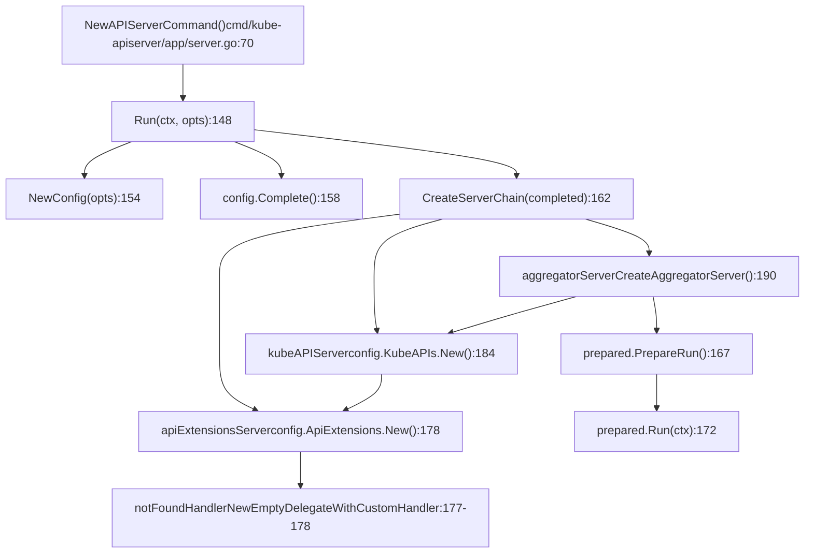
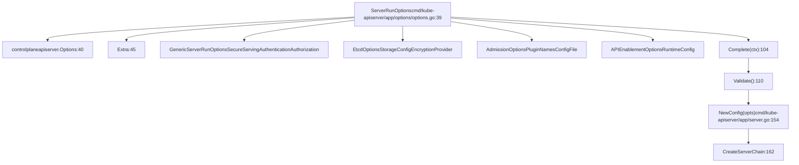
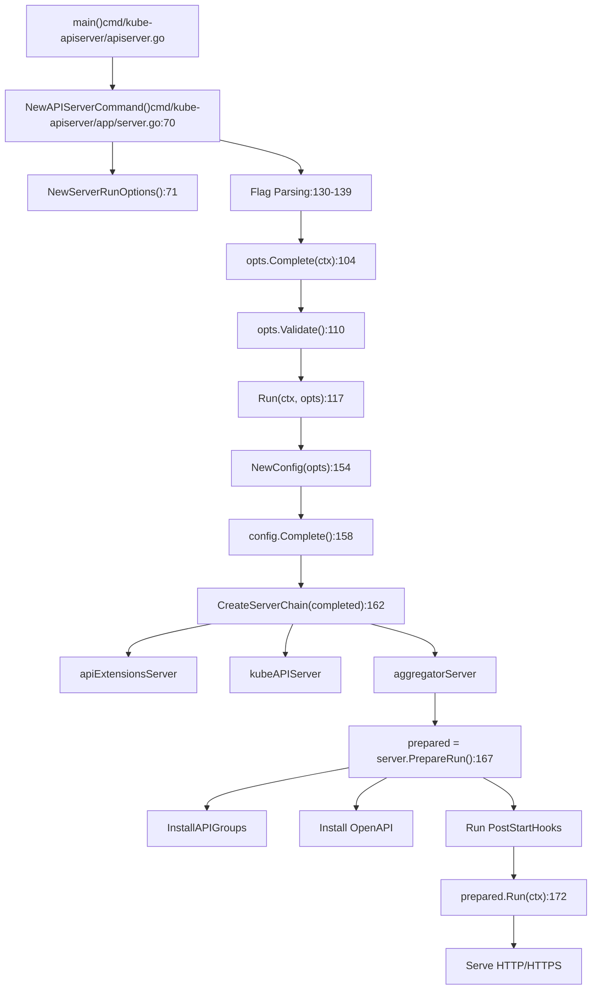
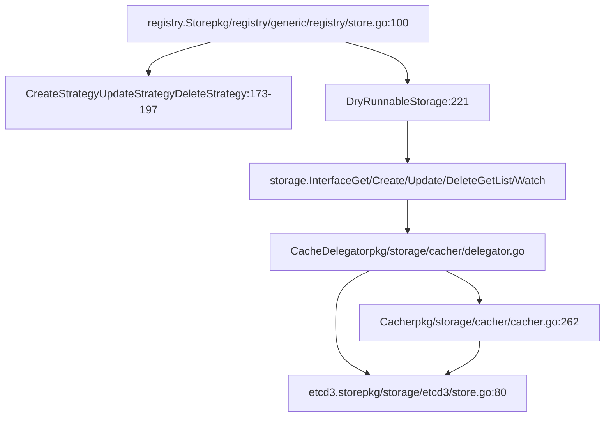
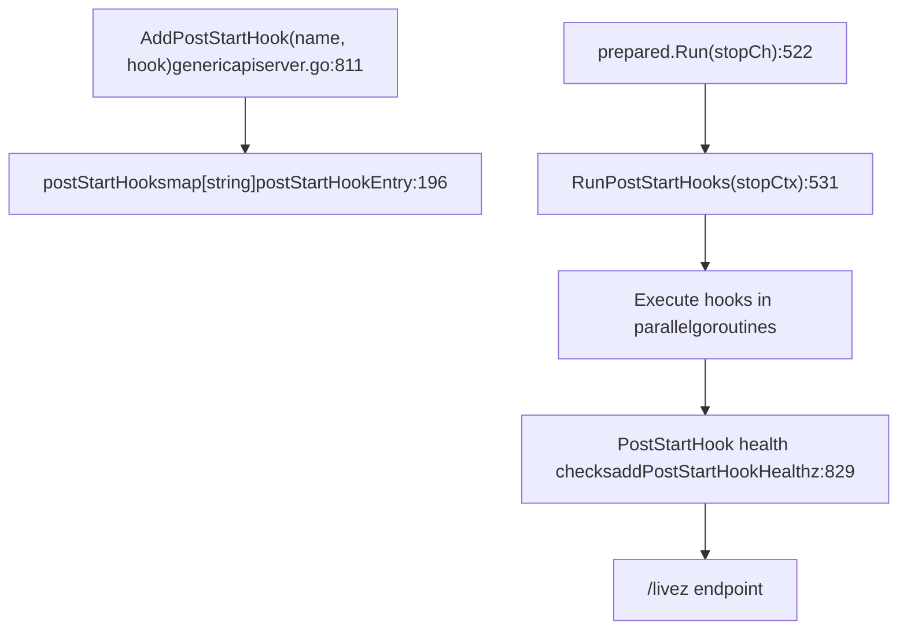

# API Server 架构

相关源码文件

-   [cmd/kube-apiserver/app/options/options.go](https://github.com/kubernetes/kubernetes/blob/2757a872/cmd/kube-apiserver/app/options/options.go)
-   [cmd/kube-apiserver/app/options/options\_test.go](https://github.com/kubernetes/kubernetes/blob/2757a872/cmd/kube-apiserver/app/options/options_test.go)
-   [cmd/kube-apiserver/app/options/validation.go](https://github.com/kubernetes/kubernetes/blob/2757a872/cmd/kube-apiserver/app/options/validation.go)
-   [cmd/kube-apiserver/app/options/validation\_test.go](https://github.com/kubernetes/kubernetes/blob/2757a872/cmd/kube-apiserver/app/options/validation_test.go)
-   [cmd/kube-apiserver/app/server.go](https://github.com/kubernetes/kubernetes/blob/2757a872/cmd/kube-apiserver/app/server.go)
-   [pkg/controlplane/controller/defaultservicecidr/OWNERS](https://github.com/kubernetes/kubernetes/blob/2757a872/pkg/controlplane/controller/defaultservicecidr/OWNERS)
-   [pkg/controlplane/controller/defaultservicecidr/default\_servicecidr\_controller.go](https://github.com/kubernetes/kubernetes/blob/2757a872/pkg/controlplane/controller/defaultservicecidr/default_servicecidr_controller.go)
-   [pkg/controlplane/controller/defaultservicecidr/default\_servicecidr\_controller\_test.go](https://github.com/kubernetes/kubernetes/blob/2757a872/pkg/controlplane/controller/defaultservicecidr/default_servicecidr_controller_test.go)
-   [pkg/kubeapiserver/options/serving.go](https://github.com/kubernetes/kubernetes/blob/2757a872/pkg/kubeapiserver/options/serving.go)
-   [pkg/registry/networking/servicecidr/doc.go](https://github.com/kubernetes/kubernetes/blob/2757a872/pkg/registry/networking/servicecidr/doc.go)
-   [pkg/registry/networking/servicecidr/storage/storage.go](https://github.com/kubernetes/kubernetes/blob/2757a872/pkg/registry/networking/servicecidr/storage/storage.go)
-   [pkg/registry/networking/servicecidr/strategy.go](https://github.com/kubernetes/kubernetes/blob/2757a872/pkg/registry/networking/servicecidr/strategy.go)
-   [pkg/registry/networking/servicecidr/strategy\_test.go](https://github.com/kubernetes/kubernetes/blob/2757a872/pkg/registry/networking/servicecidr/strategy_test.go)
-   [staging/src/k8s.io/apiserver/pkg/apis/example/install/install.go](https://github.com/kubernetes/kubernetes/blob/2757a872/staging/src/k8s.io/apiserver/pkg/apis/example/install/install.go)
-   [staging/src/k8s.io/apiserver/pkg/apis/example2/install/install.go](https://github.com/kubernetes/kubernetes/blob/2757a872/staging/src/k8s.io/apiserver/pkg/apis/example2/install/install.go)
-   [staging/src/k8s.io/apiserver/pkg/endpoints/filters/mux\_discovery\_complete.go](https://github.com/kubernetes/kubernetes/blob/2757a872/staging/src/k8s.io/apiserver/pkg/endpoints/filters/mux_discovery_complete.go)
-   [staging/src/k8s.io/apiserver/pkg/endpoints/filters/mux\_discovery\_complete\_test.go](https://github.com/kubernetes/kubernetes/blob/2757a872/staging/src/k8s.io/apiserver/pkg/endpoints/filters/mux_discovery_complete_test.go)
-   [staging/src/k8s.io/apiserver/pkg/endpoints/request/server\_shutdown\_signal.go](https://github.com/kubernetes/kubernetes/blob/2757a872/staging/src/k8s.io/apiserver/pkg/endpoints/request/server_shutdown_signal.go)
-   [staging/src/k8s.io/apiserver/pkg/registry/generic/options.go](https://github.com/kubernetes/kubernetes/blob/2757a872/staging/src/k8s.io/apiserver/pkg/registry/generic/options.go)
-   [staging/src/k8s.io/apiserver/pkg/registry/generic/registry/dryrun.go](https://github.com/kubernetes/kubernetes/blob/2757a872/staging/src/k8s.io/apiserver/pkg/registry/generic/registry/dryrun.go)
-   [staging/src/k8s.io/apiserver/pkg/registry/generic/registry/storage\_factory.go](https://github.com/kubernetes/kubernetes/blob/2757a872/staging/src/k8s.io/apiserver/pkg/registry/generic/registry/storage_factory.go)
-   [staging/src/k8s.io/apiserver/pkg/registry/generic/registry/store.go](https://github.com/kubernetes/kubernetes/blob/2757a872/staging/src/k8s.io/apiserver/pkg/registry/generic/registry/store.go)
-   [staging/src/k8s.io/apiserver/pkg/registry/generic/registry/store\_test.go](https://github.com/kubernetes/kubernetes/blob/2757a872/staging/src/k8s.io/apiserver/pkg/registry/generic/registry/store_test.go)
-   [staging/src/k8s.io/apiserver/pkg/registry/generic/storage\_decorator.go](https://github.com/kubernetes/kubernetes/blob/2757a872/staging/src/k8s.io/apiserver/pkg/registry/generic/storage_decorator.go)
-   [staging/src/k8s.io/apiserver/pkg/server/config.go](https://github.com/kubernetes/kubernetes/blob/2757a872/staging/src/k8s.io/apiserver/pkg/server/config.go)
-   [staging/src/k8s.io/apiserver/pkg/server/config\_selfclient.go](https://github.com/kubernetes/kubernetes/blob/2757a872/staging/src/k8s.io/apiserver/pkg/server/config_selfclient.go)
-   [staging/src/k8s.io/apiserver/pkg/server/config\_selfclient\_test.go](https://github.com/kubernetes/kubernetes/blob/2757a872/staging/src/k8s.io/apiserver/pkg/server/config_selfclient_test.go)
-   [staging/src/k8s.io/apiserver/pkg/server/config\_test.go](https://github.com/kubernetes/kubernetes/blob/2757a872/staging/src/k8s.io/apiserver/pkg/server/config_test.go)
-   [staging/src/k8s.io/apiserver/pkg/server/filters/with\_retry\_after.go](https://github.com/kubernetes/kubernetes/blob/2757a872/staging/src/k8s.io/apiserver/pkg/server/filters/with_retry_after.go)
-   [staging/src/k8s.io/apiserver/pkg/server/filters/with\_retry\_after\_test.go](https://github.com/kubernetes/kubernetes/blob/2757a872/staging/src/k8s.io/apiserver/pkg/server/filters/with_retry_after_test.go)
-   [staging/src/k8s.io/apiserver/pkg/server/genericapiserver.go](https://github.com/kubernetes/kubernetes/blob/2757a872/staging/src/k8s.io/apiserver/pkg/server/genericapiserver.go)
-   [staging/src/k8s.io/apiserver/pkg/server/genericapiserver\_graceful\_termination\_test.go](https://github.com/kubernetes/kubernetes/blob/2757a872/staging/src/k8s.io/apiserver/pkg/server/genericapiserver_graceful_termination_test.go)
-   [staging/src/k8s.io/apiserver/pkg/server/genericapiserver\_test.go](https://github.com/kubernetes/kubernetes/blob/2757a872/staging/src/k8s.io/apiserver/pkg/server/genericapiserver_test.go)
-   [staging/src/k8s.io/apiserver/pkg/server/lifecycle\_signals.go](https://github.com/kubernetes/kubernetes/blob/2757a872/staging/src/k8s.io/apiserver/pkg/server/lifecycle_signals.go)
-   [staging/src/k8s.io/apiserver/pkg/server/options/etcd.go](https://github.com/kubernetes/kubernetes/blob/2757a872/staging/src/k8s.io/apiserver/pkg/server/options/etcd.go)
-   [staging/src/k8s.io/apiserver/pkg/server/options/etcd\_test.go](https://github.com/kubernetes/kubernetes/blob/2757a872/staging/src/k8s.io/apiserver/pkg/server/options/etcd_test.go)
-   [staging/src/k8s.io/apiserver/pkg/server/options/server\_run\_options.go](https://github.com/kubernetes/kubernetes/blob/2757a872/staging/src/k8s.io/apiserver/pkg/server/options/server_run_options.go)
-   [staging/src/k8s.io/apiserver/pkg/server/options/server\_run\_options\_test.go](https://github.com/kubernetes/kubernetes/blob/2757a872/staging/src/k8s.io/apiserver/pkg/server/options/server_run_options_test.go)
-   [staging/src/k8s.io/apiserver/pkg/server/options/serving.go](https://github.com/kubernetes/kubernetes/blob/2757a872/staging/src/k8s.io/apiserver/pkg/server/options/serving.go)
-   [staging/src/k8s.io/apiserver/pkg/server/options/serving\_test.go](https://github.com/kubernetes/kubernetes/blob/2757a872/staging/src/k8s.io/apiserver/pkg/server/options/serving_test.go)
-   [staging/src/k8s.io/apiserver/pkg/server/storage/resource\_encoding\_config.go](https://github.com/kubernetes/kubernetes/blob/2757a872/staging/src/k8s.io/apiserver/pkg/server/storage/resource_encoding_config.go)
-   [staging/src/k8s.io/apiserver/pkg/server/storage/storage\_factory.go](https://github.com/kubernetes/kubernetes/blob/2757a872/staging/src/k8s.io/apiserver/pkg/server/storage/storage_factory.go)
-   [staging/src/k8s.io/apiserver/pkg/server/storage/storage\_factory\_test.go](https://github.com/kubernetes/kubernetes/blob/2757a872/staging/src/k8s.io/apiserver/pkg/server/storage/storage_factory_test.go)
-   [staging/src/k8s.io/apiserver/pkg/storage/cacher/cache\_watcher.go](https://github.com/kubernetes/kubernetes/blob/2757a872/staging/src/k8s.io/apiserver/pkg/storage/cacher/cache_watcher.go)
-   [staging/src/k8s.io/apiserver/pkg/storage/cacher/cache\_watcher\_test.go](https://github.com/kubernetes/kubernetes/blob/2757a872/staging/src/k8s.io/apiserver/pkg/storage/cacher/cache_watcher_test.go)
-   [staging/src/k8s.io/apiserver/pkg/storage/cacher/cacher.go](https://github.com/kubernetes/kubernetes/blob/2757a872/staging/src/k8s.io/apiserver/pkg/storage/cacher/cacher.go)
-   [staging/src/k8s.io/apiserver/pkg/storage/cacher/cacher\_test.go](https://github.com/kubernetes/kubernetes/blob/2757a872/staging/src/k8s.io/apiserver/pkg/storage/cacher/cacher_test.go)
-   [staging/src/k8s.io/apiserver/pkg/storage/cacher/cacher\_testing\_utils\_test.go](https://github.com/kubernetes/kubernetes/blob/2757a872/staging/src/k8s.io/apiserver/pkg/storage/cacher/cacher_testing_utils_test.go)
-   [staging/src/k8s.io/apiserver/pkg/storage/cacher/cacher\_whitebox\_test.go](https://github.com/kubernetes/kubernetes/blob/2757a872/staging/src/k8s.io/apiserver/pkg/storage/cacher/cacher_whitebox_test.go)
-   [staging/src/k8s.io/apiserver/pkg/storage/cacher/delegator.go](https://github.com/kubernetes/kubernetes/blob/2757a872/staging/src/k8s.io/apiserver/pkg/storage/cacher/delegator.go)
-   [staging/src/k8s.io/apiserver/pkg/storage/cacher/delegator\_test.go](https://github.com/kubernetes/kubernetes/blob/2757a872/staging/src/k8s.io/apiserver/pkg/storage/cacher/delegator_test.go)
-   [staging/src/k8s.io/apiserver/pkg/storage/cacher/lister\_watcher.go](https://github.com/kubernetes/kubernetes/blob/2757a872/staging/src/k8s.io/apiserver/pkg/storage/cacher/lister_watcher.go)
-   [staging/src/k8s.io/apiserver/pkg/storage/cacher/lister\_watcher\_test.go](https://github.com/kubernetes/kubernetes/blob/2757a872/staging/src/k8s.io/apiserver/pkg/storage/cacher/lister_watcher_test.go)
-   [staging/src/k8s.io/apiserver/pkg/storage/cacher/metrics/metrics.go](https://github.com/kubernetes/kubernetes/blob/2757a872/staging/src/k8s.io/apiserver/pkg/storage/cacher/metrics/metrics.go)
-   [staging/src/k8s.io/apiserver/pkg/storage/cacher/store/store.go](https://github.com/kubernetes/kubernetes/blob/2757a872/staging/src/k8s.io/apiserver/pkg/storage/cacher/store/store.go)
-   [staging/src/k8s.io/apiserver/pkg/storage/cacher/store/store\_btree.go](https://github.com/kubernetes/kubernetes/blob/2757a872/staging/src/k8s.io/apiserver/pkg/storage/cacher/store/store_btree.go)
-   [staging/src/k8s.io/apiserver/pkg/storage/cacher/store/store\_btree\_test.go](https://github.com/kubernetes/kubernetes/blob/2757a872/staging/src/k8s.io/apiserver/pkg/storage/cacher/store/store_btree_test.go)
-   [staging/src/k8s.io/apiserver/pkg/storage/cacher/store/store\_test.go](https://github.com/kubernetes/kubernetes/blob/2757a872/staging/src/k8s.io/apiserver/pkg/storage/cacher/store/store_test.go)
-   [staging/src/k8s.io/apiserver/pkg/storage/cacher/watch\_cache.go](https://github.com/kubernetes/kubernetes/blob/2757a872/staging/src/k8s.io/apiserver/pkg/storage/cacher/watch_cache.go)
-   [staging/src/k8s.io/apiserver/pkg/storage/cacher/watch\_cache\_interval.go](https://github.com/kubernetes/kubernetes/blob/2757a872/staging/src/k8s.io/apiserver/pkg/storage/cacher/watch_cache_interval.go)
-   [staging/src/k8s.io/apiserver/pkg/storage/cacher/watch\_cache\_interval\_test.go](https://github.com/kubernetes/kubernetes/blob/2757a872/staging/src/k8s.io/apiserver/pkg/storage/cacher/watch_cache_interval_test.go)
-   [staging/src/k8s.io/apiserver/pkg/storage/cacher/watch\_cache\_test.go](https://github.com/kubernetes/kubernetes/blob/2757a872/staging/src/k8s.io/apiserver/pkg/storage/cacher/watch_cache_test.go)
-   [staging/src/k8s.io/apiserver/pkg/storage/etcd3/event.go](https://github.com/kubernetes/kubernetes/blob/2757a872/staging/src/k8s.io/apiserver/pkg/storage/etcd3/event.go)
-   [staging/src/k8s.io/apiserver/pkg/storage/etcd3/event\_test.go](https://github.com/kubernetes/kubernetes/blob/2757a872/staging/src/k8s.io/apiserver/pkg/storage/etcd3/event_test.go)
-   [staging/src/k8s.io/apiserver/pkg/storage/etcd3/store.go](https://github.com/kubernetes/kubernetes/blob/2757a872/staging/src/k8s.io/apiserver/pkg/storage/etcd3/store.go)
-   [staging/src/k8s.io/apiserver/pkg/storage/etcd3/store\_test.go](https://github.com/kubernetes/kubernetes/blob/2757a872/staging/src/k8s.io/apiserver/pkg/storage/etcd3/store_test.go)
-   [staging/src/k8s.io/apiserver/pkg/storage/etcd3/watcher.go](https://github.com/kubernetes/kubernetes/blob/2757a872/staging/src/k8s.io/apiserver/pkg/storage/etcd3/watcher.go)
-   [staging/src/k8s.io/apiserver/pkg/storage/etcd3/watcher\_test.go](https://github.com/kubernetes/kubernetes/blob/2757a872/staging/src/k8s.io/apiserver/pkg/storage/etcd3/watcher_test.go)
-   [staging/src/k8s.io/apiserver/pkg/storage/interfaces.go](https://github.com/kubernetes/kubernetes/blob/2757a872/staging/src/k8s.io/apiserver/pkg/storage/interfaces.go)
-   [staging/src/k8s.io/apiserver/pkg/storage/storagebackend/config.go](https://github.com/kubernetes/kubernetes/blob/2757a872/staging/src/k8s.io/apiserver/pkg/storage/storagebackend/config.go)
-   [staging/src/k8s.io/apiserver/pkg/storage/storagebackend/factory/etcd3.go](https://github.com/kubernetes/kubernetes/blob/2757a872/staging/src/k8s.io/apiserver/pkg/storage/storagebackend/factory/etcd3.go)
-   [staging/src/k8s.io/apiserver/pkg/storage/storagebackend/factory/factory.go](https://github.com/kubernetes/kubernetes/blob/2757a872/staging/src/k8s.io/apiserver/pkg/storage/storagebackend/factory/factory.go)
-   [staging/src/k8s.io/apiserver/pkg/storage/testing/store\_benchmarks.go](https://github.com/kubernetes/kubernetes/blob/2757a872/staging/src/k8s.io/apiserver/pkg/storage/testing/store_benchmarks.go)
-   [staging/src/k8s.io/apiserver/pkg/storage/testing/store\_tests.go](https://github.com/kubernetes/kubernetes/blob/2757a872/staging/src/k8s.io/apiserver/pkg/storage/testing/store_tests.go)
-   [staging/src/k8s.io/apiserver/pkg/storage/testing/utils.go](https://github.com/kubernetes/kubernetes/blob/2757a872/staging/src/k8s.io/apiserver/pkg/storage/testing/utils.go)
-   [staging/src/k8s.io/apiserver/pkg/storage/testing/watcher\_tests.go](https://github.com/kubernetes/kubernetes/blob/2757a872/staging/src/k8s.io/apiserver/pkg/storage/testing/watcher_tests.go)
-   [staging/src/k8s.io/apiserver/pkg/storage/util.go](https://github.com/kubernetes/kubernetes/blob/2757a872/staging/src/k8s.io/apiserver/pkg/storage/util.go)
-   [staging/src/k8s.io/apiserver/pkg/storage/util\_test.go](https://github.com/kubernetes/kubernetes/blob/2757a872/staging/src/k8s.io/apiserver/pkg/storage/util_test.go)
-   [staging/src/k8s.io/apiserver/pkg/util/notfoundhandler/not\_found\_handler.go](https://github.com/kubernetes/kubernetes/blob/2757a872/staging/src/k8s.io/apiserver/pkg/util/notfoundhandler/not_found_handler.go)
-   [staging/src/k8s.io/apiserver/pkg/util/notfoundhandler/not\_found\_handler\_test.go](https://github.com/kubernetes/kubernetes/blob/2757a872/staging/src/k8s.io/apiserver/pkg/util/notfoundhandler/not_found_handler_test.go)
-   [staging/src/k8s.io/component-base/version/version.go](https://github.com/kubernetes/kubernetes/blob/2757a872/staging/src/k8s.io/component-base/version/version.go)
-   [test/integration/metrics/metrics\_test.go](https://github.com/kubernetes/kubernetes/blob/2757a872/test/integration/metrics/metrics_test.go)
-   [test/integration/openshift/openshift\_test.go](https://github.com/kubernetes/kubernetes/blob/2757a872/test/integration/openshift/openshift_test.go)

## 目的与范围

本文档描述 kube-apiserver 架构，重点关注初始化、服务器委托链、配置管理、请求处理以及与存储层的集成。有关包括 etcd3 与缓存机制在内的存储后端细节，请参见[存储后端与缓存](/kubernetes/kubernetes/2.3-storage-backend-and-caching)。有关 API 对象类型与校验的细节，请参见[API 对象类型与校验](/kubernetes/kubernetes/2.2-api-object-types-and-validation)。

## 概览

kube-apiserver 实现为一条委托服务器链，构建于 `GenericAPIServer` 基础之上。主入口位于 `cmd/kube-apiserver/app/server.go`，它负责编排多个 API 服务器的创建，以处理不同类型的 API 资源：

1.  **Aggregator Server** - 将请求路由到聚合 API 服务器
2.  **KubeAPIServer** - 处理核心 Kubernetes API（pods、services 等）
3.  **APIExtensions Server** - 处理 CustomResourceDefinitions（CRD）

链中的每个服务器都可以直接处理请求，或将请求委托给链中的下一个服务器。

**来源：** [cmd/kube-apiserver/app/server.go1-311](https://github.com/kubernetes/kubernetes/blob/2757a872/cmd/kube-apiserver/app/server.go#L1-L311)

## 服务器委托链


委托链在服务器创建期间建立。当请求到达聚合器时，它会先尝试自行处理。如果聚合器无法处理该请求（例如该请求不属于聚合 API），它会委托给 KubeAPIServer。类似地，KubeAPIServer 会再委托给 APIExtensions 服务器，而后者最终会委托给 not-found 处理器。

**来源：** [cmd/kube-apiserver/app/server.go148-197](https://github.com/kubernetes/kubernetes/blob/2757a872/cmd/kube-apiserver/app/server.go#L148-L197)

## GenericAPIServer 架构

```mermaid
flowchart TD
    Config["Configpkg/server/config.go:112"]
    GenericAPI["GenericAPIServerpkg/server/genericapiserver.go:110"]
    Handler["APIServerHandlerHandler field :147"]
    Storage["Storage LayerRESTOptionsGetter :224"]
    Admission["AdmissionControladmission.Interface :136"]
    Auth["Authentication/Authorization:117-120"]
    Discovery["DiscoveryGroupManager:157"]
    OpenAPI["OpenAPIVersionedService:182"]
    PostStartHooks["postStartHooksmap[string]postStartHookEntry:196"]
    HealthChecks["healthzRegistrylivezRegistryreadyzRegistry:205-207"]
    SecureServing["SecureServingInfo:135"]
    LoopbackClient["LoopbackClientConfig:115"]
    FlowControl["FlowControlutilflowcontrol.Interface:140"]

    Config --> GenericAPI
    GenericAPI --> Handler
    GenericAPI --> Storage
    GenericAPI --> Admission
    GenericAPI --> Auth
    GenericAPI --> Discovery
    GenericAPI --> OpenAPI
    GenericAPI --> PostStartHooks
    GenericAPI --> HealthChecks
    GenericAPI --> SecureServing
    GenericAPI --> LoopbackClient
    GenericAPI --> FlowControl
```


`GenericAPIServer` 结构体包含运行 API 服务器所需的全部核心组件。关键字段包括：

-   **Handler** - `APIServerHandler`，用于路由传入的 HTTP 请求
-   **Serializer** - `NegotiatedSerializer`，用于对象编码/解码
-   **Authorizer** - 决定用户是否可以执行某个操作
-   **AdmissionControl** - 对请求进行深度检查与校验
-   **PostStartHooks** - 服务器开始监听后执行的函数
-   **HealthChecks** - 就绪性、存活性与健康检查端点

**来源：** [staging/src/k8s.io/apiserver/pkg/server/genericapiserver.go110-276](https://github.com/kubernetes/kubernetes/blob/2757a872/staging/src/k8s.io/apiserver/pkg/server/genericapiserver.go#L110-L276) [staging/src/k8s.io/apiserver/pkg/server/config.go112-330](https://github.com/kubernetes/kubernetes/blob/2757a872/staging/src/k8s.io/apiserver/pkg/server/config.go#L112-L330)

## 配置系统


配置会经过多个阶段：

1.  **Flag Parsing** - 命令行 flag 填充 `ServerRunOptions`
2.  **Completion** - 填充默认值并推导依赖配置
3.  **Validation** - 确保配置有效且一致
4.  **Config Creation** - 将选项转换为服务器配置对象

**关键配置结构：**

| 结构 | 用途 | 位置 |
| --- | --- | --- |
| `ServerRunOptions` | 来自 CLI flag 的顶层选项 | [cmd/kube-apiserver/app/options/options.go39-43](https://github.com/kubernetes/kubernetes/blob/2757a872/cmd/kube-apiserver/app/options/options.go#L39-L43) |
| `Config` | 通用 API 服务器配置 | [staging/src/k8s.io/apiserver/pkg/server/config.go112-330](https://github.com/kubernetes/kubernetes/blob/2757a872/staging/src/k8s.io/apiserver/pkg/server/config.go#L112-L330) |
| `SecureServingInfo` | TLS 配置 | [staging/src/k8s.io/apiserver/pkg/server/config.go346-374](https://github.com/kubernetes/kubernetes/blob/2757a872/staging/src/k8s.io/apiserver/pkg/server/config.go#L346-L374) |
| `AuthenticationInfo` | 认证配置 | [staging/src/k8s.io/apiserver/pkg/server/config.go376-384](https://github.com/kubernetes/kubernetes/blob/2757a872/staging/src/k8s.io/apiserver/pkg/server/config.go#L376-L384) |
| `EtcdOptions` | 存储后端配置 | [staging/src/k8s.io/apiserver/pkg/server/options/etcd.go49-72](https://github.com/kubernetes/kubernetes/blob/2757a872/staging/src/k8s.io/apiserver/pkg/server/options/etcd.go#L49-L72) |

**来源：** [cmd/kube-apiserver/app/options/options.go39-97](https://github.com/kubernetes/kubernetes/blob/2757a872/cmd/kube-apiserver/app/options/options.go#L39-L97) [staging/src/k8s.io/apiserver/pkg/server/config.go112-330](https://github.com/kubernetes/kubernetes/blob/2757a872/staging/src/k8s.io/apiserver/pkg/server/config.go#L112-L330) [staging/src/k8s.io/apiserver/pkg/server/options/etcd.go49-72](https://github.com/kubernetes/kubernetes/blob/2757a872/staging/src/k8s.io/apiserver/pkg/server/options/etcd.go#L49-L72)

## 请求处理流水线

> **[Mermaid 时序图]**
> *(图表结构无法解析)*

请求处理流水线由 `BuildHandlerChain` 函数构建，该函数使用多层中间件封装核心处理器：

1.  **Authentication** - 识别发起请求的用户
2.  **Authorization** - 检查用户是否有权限
3.  **Admission Control** - 校验请求并可能对其进行变更
4.  **Registry/Storage** - 执行实际的 CRUD 操作

**来源：** [staging/src/k8s.io/apiserver/pkg/server/config.go186-187](https://github.com/kubernetes/kubernetes/blob/2757a872/staging/src/k8s.io/apiserver/pkg/server/config.go#L186-L187) [staging/src/k8s.io/apiserver/pkg/server/config.go428-479](https://github.com/kubernetes/kubernetes/blob/2757a872/staging/src/k8s.io/apiserver/pkg/server/config.go#L428-L479)

## 服务器初始化流程


初始化序列包括：

1.  **Command Setup** - 创建带 flag 的 cobra 命令
2.  **Options Processing** - 解析 flag、补全并校验
3.  **Config Creation** - 将选项转换为配置对象
4.  **Server Chain Creation** - 构建委托链
5.  **PrepareRun** - 安装 API、OpenAPI，并运行 hooks
6.  **Run** - 启动 HTTP 服务器并开始处理请求

**来源：** [cmd/kube-apiserver/app/server.go69-173](https://github.com/kubernetes/kubernetes/blob/2757a872/cmd/kube-apiserver/app/server.go#L69-L173)

## 存储层集成


存储层组织如下：

**Registry Layer** - `registry.Store` 为 Kubernetes 资源实现 REST 存储接口。它使用策略对象按资源类型定制创建、更新和删除行为。

**Storage Interface** - 定义 `Get`、`Create`、`Update`、`Delete`、`GetList` 和 `Watch` 等操作。该接口屏蔽了底层存储实现。

**Cacher** - 实现 watch cache，拦截读操作（Get、GetList、Watch）并从与 etcd 同步的内存缓存中返回结果。写操作绕过缓存，直接写入 etcd。

**Etcd3 Store** - 实际的后端实现，使用 etcd v3 API 从 etcd 集群读取和写入数据。

**关键存储操作：**

| 操作 | 路径 | 缓存行为 |
| --- | --- | --- |
| `Get` | 按键直接查找 | 初始同步后可由缓存提供 |
| `GetList` | 前缀扫描 | 依据选项可由缓存或 etcd 提供 |
| `Create` | 写入 etcd | 绕过缓存，通过 watch 传播更新 |
| `Update` | 条件写入（GuaranteedUpdate） | 绕过缓存，通过 watch 传播更新 |
| `Delete` | 条件删除 | 绕过缓存，通过 watch 传播删除 |
| `Watch` | 事件流 | 由缓存的 watch cache 提供 |

**来源：** [staging/src/k8s.io/apiserver/pkg/registry/generic/registry/store.go100-247](https://github.com/kubernetes/kubernetes/blob/2757a872/staging/src/k8s.io/apiserver/pkg/registry/generic/registry/store.go#L100-L247) [staging/src/k8s.io/apiserver/pkg/storage/cacher/delegator.go1-300](https://github.com/kubernetes/kubernetes/blob/2757a872/staging/src/k8s.io/apiserver/pkg/storage/cacher/delegator.go#L1-L300) [staging/src/k8s.io/apiserver/pkg/storage/etcd3/store.go80-230](https://github.com/kubernetes/kubernetes/blob/2757a872/staging/src/k8s.io/apiserver/pkg/storage/etcd3/store.go#L80-L230)

## GenericAPIServer 生命周期

> **[Mermaid 状态图]**
> *(图表结构无法解析)*

**PrepareRun 阶段** ([staging/src/k8s.io/apiserver/pkg/server/genericapiserver.go470-520](https://github.com/kubernetes/kubernetes/blob/2757a872/staging/src/k8s.io/apiserver/pkg/server/genericapiserver.go#L470-L520))：

-   安装 API 组和资源
-   设置 OpenAPI v2 与 v3 端点
-   注册健康检查端点（`/healthz`、`/livez`、`/readyz`）
-   安装 discovery 端点

**Run 阶段** ([staging/src/k8s.io/apiserver/pkg/server/genericapiserver.go522-650](https://github.com/kubernetes/kubernetes/blob/2757a872/staging/src/k8s.io/apiserver/pkg/server/genericapiserver.go#L522-L650))：

-   执行 post-start hooks（初始化 informer 等系统）
-   启动 HTTP/HTTPS 服务器
-   开始处理请求
-   监听关闭信号

**关闭序列** ([staging/src/k8s.io/apiserver/pkg/server/genericapiserver.go668-760](https://github.com/kubernetes/kubernetes/blob/2757a872/staging/src/k8s.io/apiserver/pkg/server/genericapiserver.go#L668-L760))：

1.  `ShutdownDelayDuration` - 为负载均衡器更新预留时间
2.  **Pre-shutdown hooks** - 自定义清理逻辑
3.  **Drain watch requests** - 等待活动 watch 完成（最长到 `ShutdownWatchTerminationGracePeriod`）
4.  **Drain non-long-running requests** - 等待正在处理中的请求
5.  **HTTP server shutdown** - 停止接受新连接
6.  **Audit backend flush** - 确保所有审计事件都已写入

**来源：** [staging/src/k8s.io/apiserver/pkg/server/genericapiserver.go470-760](https://github.com/kubernetes/kubernetes/blob/2757a872/staging/src/k8s.io/apiserver/pkg/server/genericapiserver.go#L470-L760)

## Post-Start Hook 系统


Post-start hooks 允许组件执行那些要求 API server 已运行的初始化任务。常见用途包括：

-   **Starting informers** - 开始监听资源以供控制器使用
-   **Initializing storage** - 等待存储就绪
-   **Setting up webhooks** - 注册 admission webhooks

Hooks 会在 HTTP 服务器开始监听后并行执行。每个 hook 都有一个健康检查，并会汇总到 `/livez` 端点。

**示例 Hooks：**

-   `start-kube-apiserver-admission-initializer` - 初始化 admission 插件
-   `storage-ready` - 等待存储就绪（[staging/src/k8s.io/apiserver/pkg/server/genericapiserver.go248-250](https://github.com/kubernetes/kubernetes/blob/2757a872/staging/src/k8s.io/apiserver/pkg/server/genericapiserver.go#L248-L250)）
-   `start-informers` - 启动共享 informer 工厂

**来源：** [staging/src/k8s.io/apiserver/pkg/server/genericapiserver.go196-198](https://github.com/kubernetes/kubernetes/blob/2757a872/staging/src/k8s.io/apiserver/pkg/server/genericapiserver.go#L196-L198) [staging/src/k8s.io/apiserver/pkg/server/genericapiserver.go522-570](https://github.com/kubernetes/kubernetes/blob/2757a872/staging/src/k8s.io/apiserver/pkg/server/genericapiserver.go#L522-L570) [staging/src/k8s.io/apiserver/pkg/server/genericapiserver.go811-856](https://github.com/kubernetes/kubernetes/blob/2757a872/staging/src/k8s.io/apiserver/pkg/server/genericapiserver.go#L811-L856)

## 配置选项汇总

**核心配置：**

| Option | Field | Purpose |
| --- | --- | --- |
| `--advertise-address` | `ExternalAddress` | API 服务器的公网 IP 地址 |
| `--bind-address` | `SecureServing.BindAddress` | HTTPS 绑定 IP 地址 |
| `--secure-port` | `SecureServing.BindPort` | HTTPS 流量端口 |
| `--cert-dir` | `SecureServing.ServerCert` | TLS 证书目录 |
| `--etcd-servers` | `EtcdOptions.StorageConfig.Transport.ServerList` | etcd 服务器列表 |
| `--etcd-prefix` | `EtcdOptions.StorageConfig.Prefix` | 所有 etcd 键的前缀 |

**存储配置：**

| Option | Field | Purpose |
| --- | --- | --- |
| `--watch-cache` | `EtcdOptions.EnableWatchCache` | 启用/禁用 watch cache |
| `--watch-cache-sizes` | `EtcdOptions.WatchCacheSizes` | 按资源设置缓存大小 |
| `--default-watch-cache-size` | `EtcdOptions.DefaultWatchCacheSize` | 默认缓存大小 |
| `--encryption-provider-config` | `EtcdOptions.EncryptionProviderConfigFilepath` | 加密配置路径 |

**请求处理：**

| Option | Field | Purpose |
| --- | --- | --- |
| `--max-requests-inflight` | `MaxRequestsInFlight` | 最大并行非变更请求数 |
| `--max-mutating-requests-inflight` | `MaxMutatingRequestsInFlight` | 最大并行变更请求数 |
| `--min-request-timeout` | `MinRequestTimeout` | 请求最小超时时间 |
| `--request-timeout` | `RequestTimeout` | 默认请求超时时间 |

**来源：** [staging/src/k8s.io/apiserver/pkg/server/config.go396-479](https://github.com/kubernetes/kubernetes/blob/2757a872/staging/src/k8s.io/apiserver/pkg/server/config.go#L396-L479) [staging/src/k8s.io/apiserver/pkg/server/options/etcd.go78-89](https://github.com/kubernetes/kubernetes/blob/2757a872/staging/src/k8s.io/apiserver/pkg/server/options/etcd.go#L78-L89) [cmd/kube-apiserver/app/options/options.go100-151](https://github.com/kubernetes/kubernetes/blob/2757a872/cmd/kube-apiserver/app/options/options.go#L100-L151)

## 健康检查端点

API server 暴露三个健康检查端点：

**`/healthz`** - 基础存活检查

-   如果服务器进程正在运行则返回 200
-   始终包含 `ping` 与 `log` 检查
-   可通过 `AddHealthChecks()` 添加额外检查

**`/livez`** - Kubernetes 存活探针

-   与 `/healthz` 类似，但不包含仅就绪性检查
-   在启动后 `LivezGracePeriod` 期间，假定 post-start hooks 将成功完成
-   由 kubelet 用于判断是否应重启容器

**`/readyz`** - Kubernetes 就绪探针

-   包含所有健康检查以及就绪性专用检查
-   在 `ShutdownDelayDuration` 期间返回失败以排空连接
-   由负载均衡器用于判断服务器是否应接收流量

**检查注册：**

```
// Adding a health checks.AddHealthChecks(healthz.NamedCheck("storage", storageCheck)) // Adding a readyz-only check  s.AddReadyzChecks(healthz.NamedCheck("shutdown", shutdownCheck))
```
**来源：** [staging/src/k8s.io/apiserver/pkg/server/genericapiserver.go205-207](https://github.com/kubernetes/kubernetes/blob/2757a872/staging/src/k8s.io/apiserver/pkg/server/genericapiserver.go#L205-L207) [staging/src/k8s.io/apiserver/pkg/server/healthz/healthz.go1-200](https://github.com/kubernetes/kubernetes/blob/2757a872/staging/src/k8s.io/apiserver/pkg/server/healthz/healthz.go#L1-L200) [staging/src/k8s.io/apiserver/pkg/server/config.go398-436](https://github.com/kubernetes/kubernetes/blob/2757a872/staging/src/k8s.io/apiserver/pkg/server/config.go#L398-L436)
