# 调度器

相关源码文件

-   [cmd/kube-scheduler/app/server\_test.go](https://github.com/kubernetes/kubernetes/blob/2757a872/cmd/kube-scheduler/app/server_test.go)
-   [pkg/scheduler/apis/config/types\_test.go](https://github.com/kubernetes/kubernetes/blob/2757a872/pkg/scheduler/apis/config/types_test.go)
-   [pkg/scheduler/extender.go](https://github.com/kubernetes/kubernetes/blob/2757a872/pkg/scheduler/extender.go)
-   [pkg/scheduler/extender\_test.go](https://github.com/kubernetes/kubernetes/blob/2757a872/pkg/scheduler/extender_test.go)
-   [pkg/scheduler/framework/events.go](https://github.com/kubernetes/kubernetes/blob/2757a872/pkg/scheduler/framework/events.go)
-   [pkg/scheduler/framework/events\_test.go](https://github.com/kubernetes/kubernetes/blob/2757a872/pkg/scheduler/framework/events_test.go)
-   [pkg/scheduler/framework/interface.go](https://github.com/kubernetes/kubernetes/blob/2757a872/pkg/scheduler/framework/interface.go)
-   [pkg/scheduler/framework/interface\_test.go](https://github.com/kubernetes/kubernetes/blob/2757a872/pkg/scheduler/framework/interface_test.go)
-   [pkg/scheduler/framework/plugins/defaultpreemption/default\_preemption.go](https://github.com/kubernetes/kubernetes/blob/2757a872/pkg/scheduler/framework/plugins/defaultpreemption/default_preemption.go)
-   [pkg/scheduler/framework/plugins/defaultpreemption/default\_preemption\_test.go](https://github.com/kubernetes/kubernetes/blob/2757a872/pkg/scheduler/framework/plugins/defaultpreemption/default_preemption_test.go)
-   [pkg/scheduler/framework/preemption/preemption.go](https://github.com/kubernetes/kubernetes/blob/2757a872/pkg/scheduler/framework/preemption/preemption.go)
-   [pkg/scheduler/framework/preemption/preemption\_test.go](https://github.com/kubernetes/kubernetes/blob/2757a872/pkg/scheduler/framework/preemption/preemption_test.go)
-   [pkg/scheduler/framework/runtime/framework.go](https://github.com/kubernetes/kubernetes/blob/2757a872/pkg/scheduler/framework/runtime/framework.go)
-   [pkg/scheduler/framework/runtime/framework\_test.go](https://github.com/kubernetes/kubernetes/blob/2757a872/pkg/scheduler/framework/runtime/framework_test.go)
-   [pkg/scheduler/framework/types.go](https://github.com/kubernetes/kubernetes/blob/2757a872/pkg/scheduler/framework/types.go)
-   [pkg/scheduler/framework/types\_test.go](https://github.com/kubernetes/kubernetes/blob/2757a872/pkg/scheduler/framework/types_test.go)
-   [pkg/scheduler/schedule\_one.go](https://github.com/kubernetes/kubernetes/blob/2757a872/pkg/scheduler/schedule_one.go)
-   [pkg/scheduler/schedule\_one\_test.go](https://github.com/kubernetes/kubernetes/blob/2757a872/pkg/scheduler/schedule_one_test.go)
-   [pkg/scheduler/scheduler.go](https://github.com/kubernetes/kubernetes/blob/2757a872/pkg/scheduler/scheduler.go)
-   [pkg/scheduler/scheduler\_test.go](https://github.com/kubernetes/kubernetes/blob/2757a872/pkg/scheduler/scheduler_test.go)
-   [pkg/scheduler/testing/framework/fake\_extender.go](https://github.com/kubernetes/kubernetes/blob/2757a872/pkg/scheduler/testing/framework/fake_extender.go)
-   [pkg/scheduler/testing/framework/fake\_plugins.go](https://github.com/kubernetes/kubernetes/blob/2757a872/pkg/scheduler/testing/framework/fake_plugins.go)
-   [pkg/scheduler/util/utils.go](https://github.com/kubernetes/kubernetes/blob/2757a872/pkg/scheduler/util/utils.go)
-   [pkg/scheduler/util/utils\_test.go](https://github.com/kubernetes/kubernetes/blob/2757a872/pkg/scheduler/util/utils_test.go)
-   [test/integration/scheduler/eventhandler/eventhandler\_test.go](https://github.com/kubernetes/kubernetes/blob/2757a872/test/integration/scheduler/eventhandler/eventhandler_test.go)
-   [test/integration/scheduler/filters/filters\_test.go](https://github.com/kubernetes/kubernetes/blob/2757a872/test/integration/scheduler/filters/filters_test.go)
-   [test/integration/scheduler/plugins/plugins\_test.go](https://github.com/kubernetes/kubernetes/blob/2757a872/test/integration/scheduler/plugins/plugins_test.go)
-   [test/integration/scheduler/preemption/preemption\_test.go](https://github.com/kubernetes/kubernetes/blob/2757a872/test/integration/scheduler/preemption/preemption_test.go)
-   [test/integration/scheduler/rescheduling\_test.go](https://github.com/kubernetes/kubernetes/blob/2757a872/test/integration/scheduler/rescheduling_test.go)
-   [test/integration/scheduler/scheduler\_test.go](https://github.com/kubernetes/kubernetes/blob/2757a872/test/integration/scheduler/scheduler_test.go)
-   [test/integration/scheduler/scoring/priorities\_test.go](https://github.com/kubernetes/kubernetes/blob/2757a872/test/integration/scheduler/scoring/priorities_test.go)
-   [test/integration/scheduler/util.go](https://github.com/kubernetes/kubernetes/blob/2757a872/test/integration/scheduler/util.go)
-   [test/integration/util/util.go](https://github.com/kubernetes/kubernetes/blob/2757a872/test/integration/util/util.go)

调度器是负责将 Pod 分配到 Node 的控制平面组件。它会监听未调度的 Pod，根据一组约束（以插件实现）评估可用 Node，并将 Pod 绑定到最匹配的 Node。本文档涵盖调度器的插件框架、调度周期阶段、抢占逻辑以及多 Profile 支持。

有关调度器交互的 API server 信息，请参见[API Server 架构](/kubernetes/kubernetes/3.1-api-server-architecture)。有关运行已调度 Pod 的 kubelet 信息，请参见[Kubelet 架构](/kubernetes/kubernetes/4.1-kubelet-architecture)。

---

## 架构概览

调度器作为控制循环运行，持续从调度队列中处理 Pod。它由多个主要子系统组成，这些子系统协同将 Pod 放置到 Node 上。

**调度器核心组件**

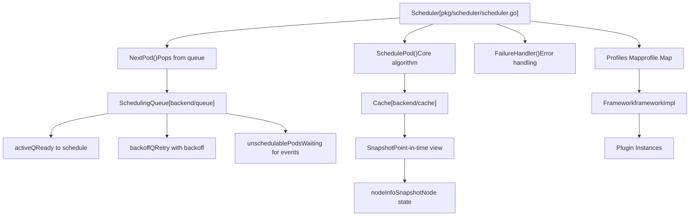
**来源：** [pkg/scheduler/scheduler.go66-124](https://github.com/kubernetes/kubernetes/blob/2757a872/pkg/scheduler/scheduler.go#L66-L124) [pkg/scheduler/schedule\_one.go64-95](https://github.com/kubernetes/kubernetes/blob/2757a872/pkg/scheduler/schedule_one.go#L64-L95)

---

## 调度器初始化

调度器通过 `New()` 函数完成初始化，该函数会设置所有必要组件，包括插件框架、队列、缓存和事件处理器。

**初始化流程**

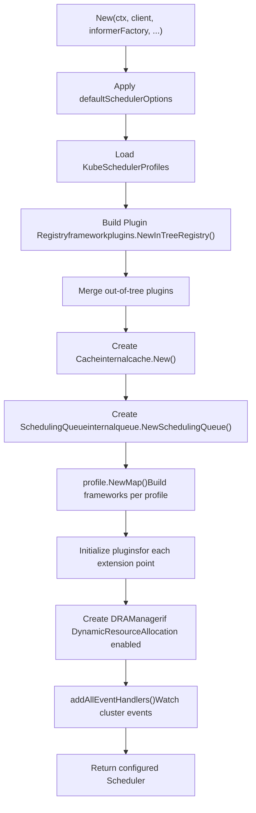
**来源：** [pkg/scheduler/scheduler.go275-458](https://github.com/kubernetes/kubernetes/blob/2757a872/pkg/scheduler/scheduler.go#L275-L458)

初始化过程会创建几个关键组件：

| 组件 | 类型 | 用途 |
| --- | --- | --- |
| `Cache` | `internalcache.Cache` | 维护 assumed 与 bound 的 Pod，以及节点信息 |
| `SchedulingQueue` | `internalqueue.SchedulingQueue` | 以优先级与退避机制管理待调度 Pod |
| `Profiles` | `profile.Map` | 将调度器名称映射到框架实例 |
| `APIDispatcher` | `apidispatcher.APIDispatcher` | 在启用时处理异步 API 调用 |
| `PodGroupManager` | `internalpodgroupmanager.PodGroupManager` | 在启用 GenericWorkload 时管理 Pod 组 |

**来源：** [pkg/scheduler/scheduler.go316-449](https://github.com/kubernetes/kubernetes/blob/2757a872/pkg/scheduler/scheduler.go#L316-L449)

---

## 插件框架

调度器使用可扩展插件框架，所有调度逻辑都作为插件实现于特定扩展点。每个调度 Profile 都会以配置好的插件集合实例化自己的框架。

**插件扩展点**

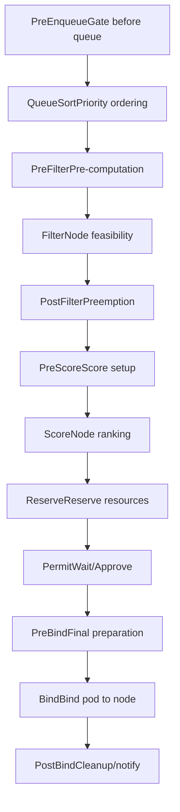
**来源：** [pkg/scheduler/framework/runtime/framework.go119-134](https://github.com/kubernetes/kubernetes/blob/2757a872/pkg/scheduler/framework/runtime/framework.go#L119-L134)

### 框架实现

`frameworkImpl` 结构体维护所有已注册插件，并提供在各扩展点调用它们的方法：

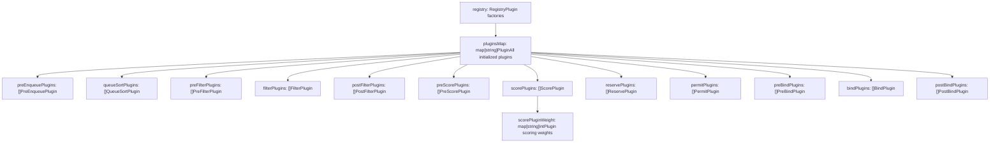
**来源：** [pkg/scheduler/framework/runtime/framework.go55-106](https://github.com/kubernetes/kubernetes/blob/2757a872/pkg/scheduler/framework/runtime/framework.go#L55-L106)

### 插件初始化

插件会在 `NewFramework()` 创建框架时完成初始化：

1.  **加载配置**：从 `KubeSchedulerProfile` 解析 Profile 插件与配置
2.  **初始化插件**：调用每个插件工厂并传入参数，以创建插件实例
3.  **填充扩展点**：将插件实例加入各自扩展点的切片
4.  **展开 MultiPoint**：将配置在 `MultiPoint` 扩展上的插件展开到多个扩展点
5.  **校验**：确保恰好存在一个 `QueueSort` 插件，且至少存在一个 `Bind` 插件

**来源：** [pkg/scheduler/framework/runtime/framework.go314-466](https://github.com/kubernetes/kubernetes/blob/2757a872/pkg/scheduler/framework/runtime/framework.go#L314-L466)

---

## 调度周期阶段

调度周期是为 Pod 选择 Node 的同步阶段。它由过滤与打分两个阶段组成。

### 主调度循环

**ScheduleOne 执行流程**

> **[Mermaid 时序图]**
> *(图表结构无法解析)*

**来源：** [pkg/scheduler/schedule\_one.go64-147](https://github.com/kubernetes/kubernetes/blob/2757a872/pkg/scheduler/schedule_one.go#L64-L147) [pkg/scheduler/schedule\_one.go173-309](https://github.com/kubernetes/kubernetes/blob/2757a872/pkg/scheduler/schedule_one.go#L173-L309)

### 过滤阶段

过滤阶段会剔除无法运行该 Pod 的 Node。Node 会以可配置的并行度并发评估。

**过滤阶段实现**

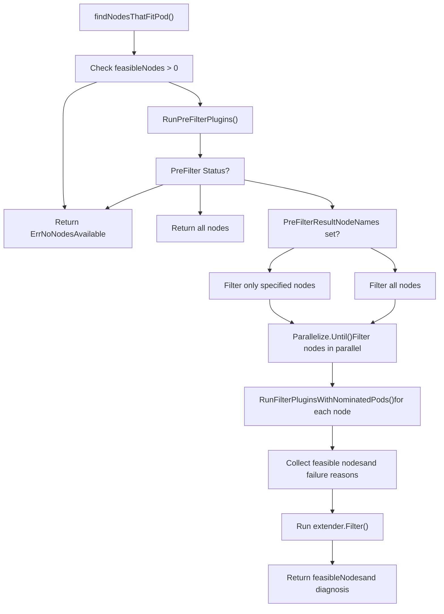
**来源：** [pkg/scheduler/generic\_scheduler.go176-307](https://github.com/kubernetes/kubernetes/blob/2757a872/pkg/scheduler/generic_scheduler.go#L176-L307)

每个过滤插件都会返回一个 `Status`，表示该 Node 是否适合：

-   `Success`：该 Node 通过此过滤
-   `Unschedulable`：该 Node 未通过此过滤
-   `UnschedulableAndUnresolvable`：该 Node 未通过，且通过变更也无法变为可行
-   `Error`：发生内部错误

**来源：** [pkg/scheduler/framework/interface.go](https://github.com/kubernetes/kubernetes/blob/2757a872/pkg/scheduler/framework/interface.go)

### 打分阶段

打分阶段对可行 Node 进行排序以选出最佳节点。每个打分插件都会对每个 Node 打分，随后对分数加权并求和。

**打分过程**

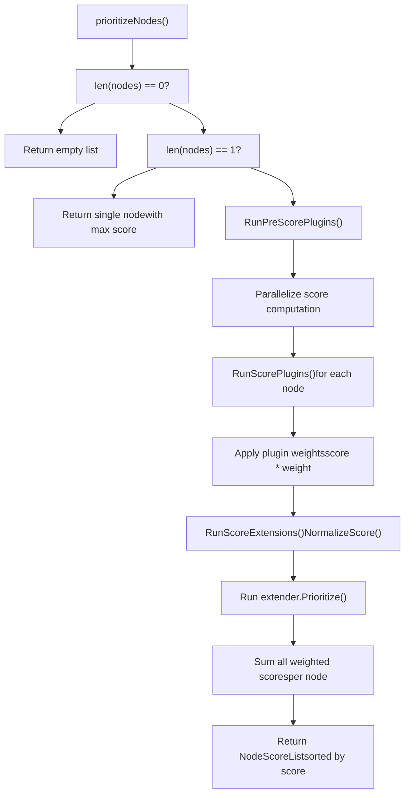
**来源：** [pkg/scheduler/generic\_scheduler.go309-452](https://github.com/kubernetes/kubernetes/blob/2757a872/pkg/scheduler/generic_scheduler.go#L309-L452)

分数归一化可确保所有插件输出都在 `[0, MaxNodeScore]` 范围内，其中 `MaxNodeScore = 100`。加权总和不得超过 `MaxTotalScore`：

```
totalScore = Σ (pluginScore[i] * pluginWeight[i])
```
**来源：** [pkg/scheduler/framework/runtime/framework.go536-566](https://github.com/kubernetes/kubernetes/blob/2757a872/pkg/scheduler/framework/runtime/framework.go#L536-L566)

### 主机选择

打分后，`selectHost()` 会选择最佳节点。若多个节点具有相同最高分，会随机选取一个，以确保分布均衡。

**来源：** [pkg/scheduler/generic\_scheduler.go488-519](https://github.com/kubernetes/kubernetes/blob/2757a872/pkg/scheduler/generic_scheduler.go#L488-L519)

---

## 绑定周期

绑定周期在节点选定后异步运行。它会为绑定准备 Pod 并更新 API server。

**绑定周期流程**

> **[Mermaid 时序图]**
> *(图表结构无法解析)*

**来源：** [pkg/scheduler/schedule\_one.go149-169](https://github.com/kubernetes/kubernetes/blob/2757a872/pkg/scheduler/schedule_one.go#L149-L169) [pkg/scheduler/schedule\_one.go395-502](https://github.com/kubernetes/kubernetes/blob/2757a872/pkg/scheduler/schedule_one.go#L395-L502)

### Assume 操作

在绑定前，调度器会通过将 Pod 加入缓存来“假定”其已完成绑定。这使后续调度决策即便在绑定尚未完成时，也能计入该 Pod 的资源占用：

```
Cache.AssumePod(pod, nodeName)
```
如果绑定失败，则通过 `Cache.ForgetPod()` 将该 Pod 从缓存移除。

**来源：** [pkg/scheduler/schedule\_one.go311-358](https://github.com/kubernetes/kubernetes/blob/2757a872/pkg/scheduler/schedule_one.go#L311-L358)

### Reserve 插件

Reserve 插件会为 Pod 预留资源。如果任一 Reserve 插件失败，所有此前成功的 Reserve 插件都会调用其 `Unreserve()` 方法进行清理：

**来源：** [pkg/scheduler/schedule\_one.go336-356](https://github.com/kubernetes/kubernetes/blob/2757a872/pkg/scheduler/schedule_one.go#L336-L356)

### Permit 插件

Permit 插件可以：

-   **Approve**：允许绑定立即继续
-   **Wait**：在指定时长内阻塞（最长 15 分钟）
-   **Reject**：拒绝该绑定

处于等待状态的 Pod 会存储在 `waitingPodsMap` 中，并可通过调用 `Allow()` 在之后获批。

**来源：** [pkg/scheduler/schedule\_one.go216-240](https://github.com/kubernetes/kubernetes/blob/2757a872/pkg/scheduler/schedule_one.go#L216-L240) [pkg/scheduler/schedule\_one.go429-444](https://github.com/kubernetes/kubernetes/blob/2757a872/pkg/scheduler/schedule_one.go#L429-L444)

---

## 抢占

当没有 Node 能容纳某个 Pod 时，调度器会尝试抢占：驱逐低优先级 Pod 以腾出空间。

**抢占架构**

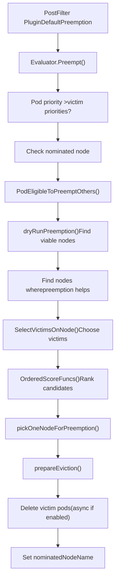
**来源：** [pkg/scheduler/framework/preemption/preemption.go87-185](https://github.com/kubernetes/kubernetes/blob/2757a872/pkg/scheduler/framework/preemption/preemption.go#L87-L185) [pkg/scheduler/framework/plugins/defaultpreemption/default\_preemption.go120-132](https://github.com/kubernetes/kubernetes/blob/2757a872/pkg/scheduler/framework/plugins/defaultpreemption/default_preemption.go#L120-L132)

### 抢占算法

抢占算法遵循以下步骤：

1.  **资格检查**：根据优先级验证该 Pod 是否可以抢占其他 Pod
2.  **Dry Run**：对每个 Node 评估抢占部分 Pod 后是否可调度
3.  **受害者选择**：在每个候选 Node 上选择最小受害者集合
4.  **节点排序**：使用有序打分函数对候选 Node 排序
5.  **执行**：删除受害者 Pod 并提名该 Node

**来源：** [pkg/scheduler/framework/preemption/preemption.go187-295](https://github.com/kubernetes/kubernetes/blob/2757a872/pkg/scheduler/framework/preemption/preemption.go#L187-L295)

### 受害者选择

在每个 Node 上，`SelectVictimsOnNode()` 会找出需要抢占的最小 Pod 集合：

**受害者选择过程**

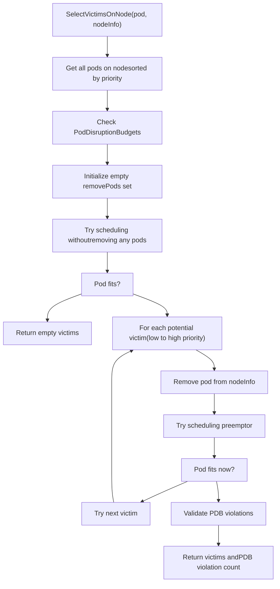
**来源：** [pkg/scheduler/framework/plugins/defaultpreemption/default\_preemption.go194-344](https://github.com/kubernetes/kubernetes/blob/2757a872/pkg/scheduler/framework/plugins/defaultpreemption/default_preemption.go#L194-L344)

该算法会逐个移除 Pod（优先移除最低优先级），直到抢占者 Pod 可适配，从而将扰动最小化。

### 异步抢占

当启用 `EnableAsyncPreemption` 特性门控时，受害者 Pod 的删除会异步进行。抢占者 Pod 会在 `PreEnqueue` 阶段被门控，直至抢占完成：

**来源：** [pkg/scheduler/framework/plugins/defaultpreemption/default\_preemption.go134-142](https://github.com/kubernetes/kubernetes/blob/2757a872/pkg/scheduler/framework/plugins/defaultpreemption/default_preemption.go#L134-L142) [pkg/scheduler/framework/preemption/preemption.go297-391](https://github.com/kubernetes/kubernetes/blob/2757a872/pkg/scheduler/framework/preemption/preemption.go#L297-L391)

---

## 多 Profile 支持

调度器支持多个调度 Profile，可基于 `schedulerName` 为不同 Pod 提供不同调度行为。

**Profile 架构**

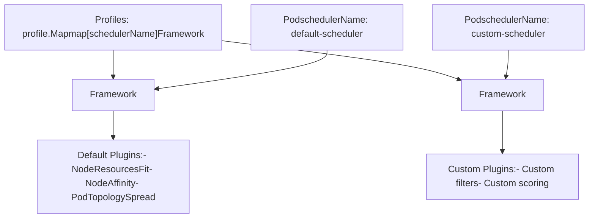
**来源：** [pkg/scheduler/scheduler.go359-378](https://github.com/kubernetes/kubernetes/blob/2757a872/pkg/scheduler/scheduler.go#L359-L378)

### Profile 配置

Profile 定义在 `KubeSchedulerConfiguration` 中：

```
Profiles:
  - schedulerName: "default-scheduler"
    plugins:
      filter:
        enabled:
          - name: "NodeResourcesFit"
      score:
        enabled:
          - name: "NodeResourcesFit"
            weight: 1
  - schedulerName: "custom-scheduler"
    plugins:
      filter:
        enabled:
          - name: "CustomFilter"
```
每个 Profile 都会创建各自的框架实例，并使用彼此独立的插件配置。

**来源：** [pkg/scheduler/scheduler.go291-299](https://github.com/kubernetes/kubernetes/blob/2757a872/pkg/scheduler/scheduler.go#L291-L299) [pkg/scheduler/profile/profile.go](https://github.com/kubernetes/kubernetes/blob/2757a872/pkg/scheduler/profile/profile.go)

### Framework 选择

在调度 Pod 时，`frameworkForPod()` 会根据 `pod.Spec.SchedulerName` 选择对应框架：

**来源：** [pkg/scheduler/scheduler.go108-115](https://github.com/kubernetes/kubernetes/blob/2757a872/pkg/scheduler/scheduler.go#L108-L115)

---

## 调度队列

调度队列管理待调度 Pod。它维护三个具有不同语义的内部队列。

**队列架构**

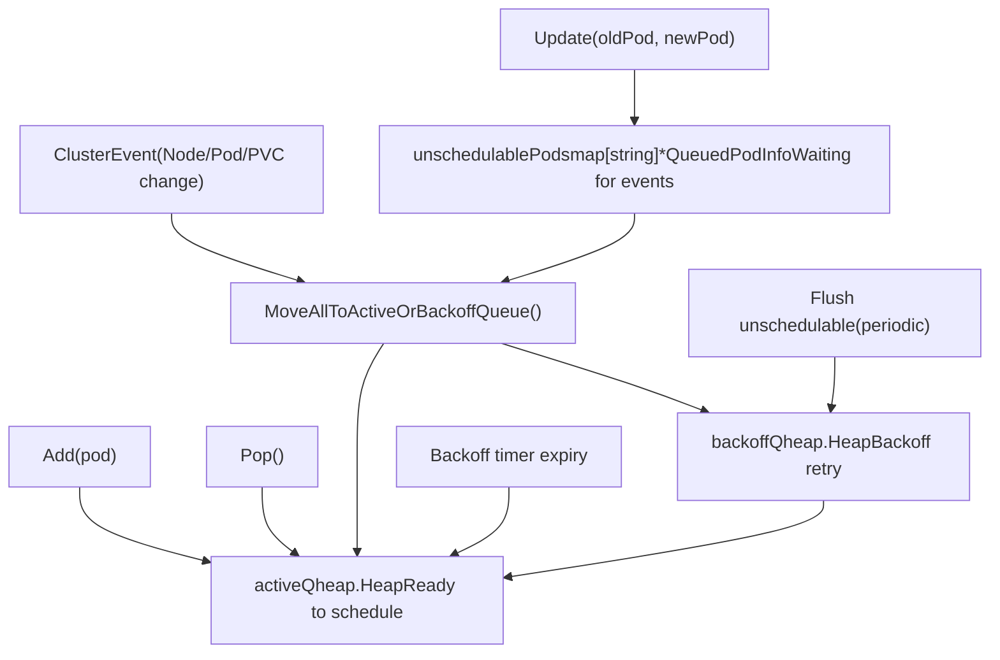
**来源：** [pkg/scheduler/backend/queue/priority\_queue.go](https://github.com/kubernetes/kubernetes/blob/2757a872/pkg/scheduler/backend/queue/priority_queue.go)

### 队列迁移逻辑

Pod 会基于多种事件在队列间移动：

| 事件 | 源队列 | 目标 | 条件 |
| --- | --- | --- | --- |
| 新增 Pod | \- | activeQ | 始终 |
| 弹出进行调度 | activeQ | \- | 最高优先级 |
| 调度失败 | \- | backoffQ | 不可调度 |
| 退避到期 | backoffQ | activeQ | 时间已到 |
| 集群事件 | unschedulablePods | activeQ 或 backoffQ | 事件匹配插件提示 |
| 周期性刷新 | unschedulablePods | backoffQ | 超时 |

**来源：** [pkg/scheduler/backend/queue/priority\_queue.go](https://github.com/kubernetes/kubernetes/blob/2757a872/pkg/scheduler/backend/queue/priority_queue.go)

### 入队提示

插件可以注册入队提示，以指定哪些集群事件会使此前不可调度的 Pod 值得重试：

**来源：** [pkg/scheduler/scheduler.go466-533](https://github.com/kubernetes/kubernetes/blob/2757a872/pkg/scheduler/scheduler.go#L466-L533) [pkg/scheduler/framework/plugins/defaultpreemption/default\_preemption.go144-168](https://github.com/kubernetes/kubernetes/blob/2757a872/pkg/scheduler/framework/plugins/defaultpreemption/default_preemption.go#L144-L168)

每个提示都是一个函数：`QueueingHintFn(pod, oldObj, newObj) -> (Queue | QueueSkip, error)`

---

## 事件处理

调度器会监听集群资源，并通过移动队列中的 Pod 或更新缓存来响应变更。

**事件处理器注册**

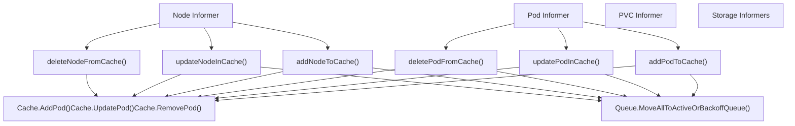
**来源：** [pkg/scheduler/eventhandlers.go](https://github.com/kubernetes/kubernetes/blob/2757a872/pkg/scheduler/eventhandlers.go)

调度器会为以下对象注册处理器：

-   Pods（已分配/未分配）
-   Nodes
-   PersistentVolumes 与 PersistentVolumeClaims
-   StorageClasses、CSINodes、CSIDrivers、CSIStorageCapacity
-   ResourceClaims、ResourceSlices（启用 DynamicResourceAllocation 时）
-   PodGroups（启用 GenericWorkload 时）

**来源：** [pkg/scheduler/eventhandlers.go29-400](https://github.com/kubernetes/kubernetes/blob/2757a872/pkg/scheduler/eventhandlers.go#L29-L400)

---

## 关键数据结构

### Scheduler

`Scheduler` 结构体是顶层编排器：

**来源：** [pkg/scheduler/scheduler.go66-124](https://github.com/kubernetes/kubernetes/blob/2757a872/pkg/scheduler/scheduler.go#L66-L124)

| 字段 | 类型 | 用途 |
| --- | --- | --- |
| `Cache` | `internalcache.Cache` | 存储 assumed Pod 与节点信息 |
| `SchedulingQueue` | `internalqueue.SchedulingQueue` | 待调度 Pod 的优先级队列 |
| `Profiles` | `profile.Map` | 将调度器名称映射到框架 |
| `NextPod` | `func() (*QueuedPodInfo, error)` | 从队列弹出下一个 Pod 的函数 |
| `SchedulePod` | `func(...) (ScheduleResult, error)` | 核心调度算法 |
| `FailureHandler` | `FailureHandlerFn` | 处理调度失败 |
| `APIDispatcher` | `*apidispatcher.APIDispatcher` | 异步 API 调度器（可选） |

### QueuedPodInfo

将 Pod 与调度元数据封装在一起：

**来源：** [pkg/scheduler/framework/types.go500-570](https://github.com/kubernetes/kubernetes/blob/2757a872/pkg/scheduler/framework/types.go#L500-L570)

| 字段 | 类型 | 用途 |
| --- | --- | --- |
| `PodInfo` | `fwk.PodInfo` | Pod 信息与资源计算 |
| `Timestamp` | `time.Time` | 加入队列的时间 |
| `Attempts` | `int` | 调度尝试次数 |
| `InitialAttemptTimestamp` | `*time.Time` | 首次尝试时间（用于指标） |
| `UnschedulablePlugins` | `sets.Set[string]` | 拒绝该 Pod 的插件集合 |
| `Gated` | `bool` | Pod 是否被门控 |

### ScheduleResult

Pod 调度结果：

**来源：** [pkg/scheduler/scheduler.go152-163](https://github.com/kubernetes/kubernetes/blob/2757a872/pkg/scheduler/scheduler.go#L152-L163)

| 字段 | 类型 | 用途 |
| --- | --- | --- |
| `SuggestedHost` | `string` | 选中的节点名称 |
| `EvaluatedNodes` | `int` | 过滤阶段评估的节点数 |
| `FeasibleNodes` | `int` | 通过过滤的节点数 |
| `nominatingInfo` | `*fwk.NominatingInfo` | 用于抢占的提名信息 |

---

## 总结

Kubernetes 调度器是一个基于可扩展插件框架构建的复杂系统。它持续从优先级队列处理 Pod，通过过滤与打分阶段评估 Node，并将 Pod 绑定到最优 Node。当不存在合适 Node 时，它可以抢占低优先级 Pod。多 Profile 支持使不同工作负载可采用不同调度行为。

关键子系统包括：

-   **插件框架**：具备 12+ 扩展点的可扩展架构（[pkg/scheduler/framework/runtime/framework.go55-106](https://github.com/kubernetes/kubernetes/blob/2757a872/pkg/scheduler/framework/runtime/framework.go#L55-L106)）
-   **调度队列**：三层队列系统，具备智能事件驱动重入队能力（[pkg/scheduler/backend/queue/](https://github.com/kubernetes/kubernetes/blob/2757a872/pkg/scheduler/backend/queue/)）
-   **缓存**：维护 assumed Pod 状态与节点快照（[pkg/scheduler/backend/cache/](https://github.com/kubernetes/kubernetes/blob/2757a872/pkg/scheduler/backend/cache/)）
-   **抢占**：具备 PDB 感知的复杂受害者选择（[pkg/scheduler/framework/preemption/preemption.go](https://github.com/kubernetes/kubernetes/blob/2757a872/pkg/scheduler/framework/preemption/preemption.go)）

**来源：** [pkg/scheduler/scheduler.go](https://github.com/kubernetes/kubernetes/blob/2757a872/pkg/scheduler/scheduler.go) [pkg/scheduler/schedule\_one.go](https://github.com/kubernetes/kubernetes/blob/2757a872/pkg/scheduler/schedule_one.go) [pkg/scheduler/framework/runtime/framework.go](https://github.com/kubernetes/kubernetes/blob/2757a872/pkg/scheduler/framework/runtime/framework.go) [pkg/scheduler/framework/preemption/preemption.go](https://github.com/kubernetes/kubernetes/blob/2757a872/pkg/scheduler/framework/preemption/preemption.go)
