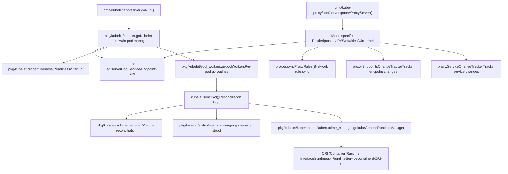
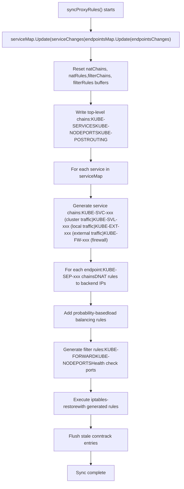
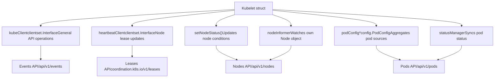
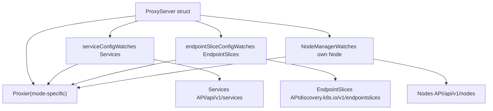

# 节点组件

相关源码文件

-   [cmd/kube-proxy/app/options.go](https://github.com/kubernetes/kubernetes/blob/2757a872/cmd/kube-proxy/app/options.go)
-   [cmd/kube-proxy/app/options\_test.go](https://github.com/kubernetes/kubernetes/blob/2757a872/cmd/kube-proxy/app/options_test.go)
-   [cmd/kube-proxy/app/server.go](https://github.com/kubernetes/kubernetes/blob/2757a872/cmd/kube-proxy/app/server.go)
-   [cmd/kube-proxy/app/server\_linux.go](https://github.com/kubernetes/kubernetes/blob/2757a872/cmd/kube-proxy/app/server_linux.go)
-   [cmd/kube-proxy/app/server\_linux\_test.go](https://github.com/kubernetes/kubernetes/blob/2757a872/cmd/kube-proxy/app/server_linux_test.go)
-   [cmd/kube-proxy/app/server\_test.go](https://github.com/kubernetes/kubernetes/blob/2757a872/cmd/kube-proxy/app/server_test.go)
-   [cmd/kube-proxy/app/server\_windows.go](https://github.com/kubernetes/kubernetes/blob/2757a872/cmd/kube-proxy/app/server_windows.go)
-   [cmd/kubelet/app/server.go](https://github.com/kubernetes/kubernetes/blob/2757a872/cmd/kubelet/app/server.go)
-   [cmd/kubemark/hollow-node.go](https://github.com/kubernetes/kubernetes/blob/2757a872/cmd/kubemark/hollow-node.go)
-   [pkg/kubelet/allocation/allocation\_manager.go](https://github.com/kubernetes/kubernetes/blob/2757a872/pkg/kubelet/allocation/allocation_manager.go)
-   [pkg/kubelet/allocation/allocation\_manager\_test.go](https://github.com/kubernetes/kubernetes/blob/2757a872/pkg/kubelet/allocation/allocation_manager_test.go)
-   [pkg/kubelet/allocation/features\_linux.go](https://github.com/kubernetes/kubernetes/blob/2757a872/pkg/kubelet/allocation/features_linux.go)
-   [pkg/kubelet/allocation/features\_unsupported.go](https://github.com/kubernetes/kubernetes/blob/2757a872/pkg/kubelet/allocation/features_unsupported.go)
-   [pkg/kubelet/allocation/features\_windows.go](https://github.com/kubernetes/kubernetes/blob/2757a872/pkg/kubelet/allocation/features_windows.go)
-   [pkg/kubelet/allocation/state/checkpoint.go](https://github.com/kubernetes/kubernetes/blob/2757a872/pkg/kubelet/allocation/state/checkpoint.go)
-   [pkg/kubelet/allocation/state/state.go](https://github.com/kubernetes/kubernetes/blob/2757a872/pkg/kubelet/allocation/state/state.go)
-   [pkg/kubelet/allocation/state/state\_checkpoint.go](https://github.com/kubernetes/kubernetes/blob/2757a872/pkg/kubelet/allocation/state/state_checkpoint.go)
-   [pkg/kubelet/allocation/state/state\_checkpoint\_test.go](https://github.com/kubernetes/kubernetes/blob/2757a872/pkg/kubelet/allocation/state/state_checkpoint_test.go)
-   [pkg/kubelet/allocation/state/state\_mem.go](https://github.com/kubernetes/kubernetes/blob/2757a872/pkg/kubelet/allocation/state/state_mem.go)
-   [pkg/kubelet/container/helpers.go](https://github.com/kubernetes/kubernetes/blob/2757a872/pkg/kubelet/container/helpers.go)
-   [pkg/kubelet/container/helpers\_test.go](https://github.com/kubernetes/kubernetes/blob/2757a872/pkg/kubelet/container/helpers_test.go)
-   [pkg/kubelet/container/runtime.go](https://github.com/kubernetes/kubernetes/blob/2757a872/pkg/kubelet/container/runtime.go)
-   [pkg/kubelet/container/testing/fake\_cache.go](https://github.com/kubernetes/kubernetes/blob/2757a872/pkg/kubelet/container/testing/fake_cache.go)
-   [pkg/kubelet/container/testing/fake\_runtime.go](https://github.com/kubernetes/kubernetes/blob/2757a872/pkg/kubelet/container/testing/fake_runtime.go)
-   [pkg/kubelet/container/testing/fake\_runtime\_helper.go](https://github.com/kubernetes/kubernetes/blob/2757a872/pkg/kubelet/container/testing/fake_runtime_helper.go)
-   [pkg/kubelet/container/testing/mocks.go](https://github.com/kubernetes/kubernetes/blob/2757a872/pkg/kubelet/container/testing/mocks.go)
-   [pkg/kubelet/images/helpers.go](https://github.com/kubernetes/kubernetes/blob/2757a872/pkg/kubelet/images/helpers.go)
-   [pkg/kubelet/images/image\_manager.go](https://github.com/kubernetes/kubernetes/blob/2757a872/pkg/kubelet/images/image_manager.go)
-   [pkg/kubelet/images/image\_manager\_test.go](https://github.com/kubernetes/kubernetes/blob/2757a872/pkg/kubelet/images/image_manager_test.go)
-   [pkg/kubelet/images/puller.go](https://github.com/kubernetes/kubernetes/blob/2757a872/pkg/kubelet/images/puller.go)
-   [pkg/kubelet/images/types.go](https://github.com/kubernetes/kubernetes/blob/2757a872/pkg/kubelet/images/types.go)
-   [pkg/kubelet/kubelet.go](https://github.com/kubernetes/kubernetes/blob/2757a872/pkg/kubelet/kubelet.go)
-   [pkg/kubelet/kubelet\_node\_status.go](https://github.com/kubernetes/kubernetes/blob/2757a872/pkg/kubelet/kubelet_node_status.go)
-   [pkg/kubelet/kubelet\_node\_status\_test.go](https://github.com/kubernetes/kubernetes/blob/2757a872/pkg/kubelet/kubelet_node_status_test.go)
-   [pkg/kubelet/kubelet\_pods.go](https://github.com/kubernetes/kubernetes/blob/2757a872/pkg/kubelet/kubelet_pods.go)
-   [pkg/kubelet/kubelet\_pods\_test.go](https://github.com/kubernetes/kubernetes/blob/2757a872/pkg/kubelet/kubelet_pods_test.go)
-   [pkg/kubelet/kubelet\_test.go](https://github.com/kubernetes/kubernetes/blob/2757a872/pkg/kubelet/kubelet_test.go)
-   [pkg/kubelet/kubelet\_volumes.go](https://github.com/kubernetes/kubernetes/blob/2757a872/pkg/kubelet/kubelet_volumes.go)
-   [pkg/kubelet/kubelet\_volumes\_linux\_test.go](https://github.com/kubernetes/kubernetes/blob/2757a872/pkg/kubelet/kubelet_volumes_linux_test.go)
-   [pkg/kubelet/kubelet\_volumes\_test.go](https://github.com/kubernetes/kubernetes/blob/2757a872/pkg/kubelet/kubelet_volumes_test.go)
-   [pkg/kubelet/kuberuntime/convert.go](https://github.com/kubernetes/kubernetes/blob/2757a872/pkg/kubelet/kuberuntime/convert.go)
-   [pkg/kubelet/kuberuntime/convert\_test.go](https://github.com/kubernetes/kubernetes/blob/2757a872/pkg/kubelet/kuberuntime/convert_test.go)
-   [pkg/kubelet/kuberuntime/helpers.go](https://github.com/kubernetes/kubernetes/blob/2757a872/pkg/kubelet/kuberuntime/helpers.go)
-   [pkg/kubelet/kuberuntime/helpers\_test.go](https://github.com/kubernetes/kubernetes/blob/2757a872/pkg/kubelet/kuberuntime/helpers_test.go)
-   [pkg/kubelet/kuberuntime/kuberuntime\_container.go](https://github.com/kubernetes/kubernetes/blob/2757a872/pkg/kubelet/kuberuntime/kuberuntime_container.go)
-   [pkg/kubelet/kuberuntime/kuberuntime\_container\_test.go](https://github.com/kubernetes/kubernetes/blob/2757a872/pkg/kubelet/kuberuntime/kuberuntime_container_test.go)
-   [pkg/kubelet/kuberuntime/kuberuntime\_gc.go](https://github.com/kubernetes/kubernetes/blob/2757a872/pkg/kubelet/kuberuntime/kuberuntime_gc.go)
-   [pkg/kubelet/kuberuntime/kuberuntime\_gc\_test.go](https://github.com/kubernetes/kubernetes/blob/2757a872/pkg/kubelet/kuberuntime/kuberuntime_gc_test.go)
-   [pkg/kubelet/kuberuntime/kuberuntime\_image.go](https://github.com/kubernetes/kubernetes/blob/2757a872/pkg/kubelet/kuberuntime/kuberuntime_image.go)
-   [pkg/kubelet/kuberuntime/kuberuntime\_image\_test.go](https://github.com/kubernetes/kubernetes/blob/2757a872/pkg/kubelet/kuberuntime/kuberuntime_image_test.go)
-   [pkg/kubelet/kuberuntime/kuberuntime\_manager.go](https://github.com/kubernetes/kubernetes/blob/2757a872/pkg/kubelet/kuberuntime/kuberuntime_manager.go)
-   [pkg/kubelet/kuberuntime/kuberuntime\_manager\_test.go](https://github.com/kubernetes/kubernetes/blob/2757a872/pkg/kubelet/kuberuntime/kuberuntime_manager_test.go)
-   [pkg/kubelet/kuberuntime/kuberuntime\_sandbox.go](https://github.com/kubernetes/kubernetes/blob/2757a872/pkg/kubelet/kuberuntime/kuberuntime_sandbox.go)
-   [pkg/kubelet/kuberuntime/kuberuntime\_sandbox\_test.go](https://github.com/kubernetes/kubernetes/blob/2757a872/pkg/kubelet/kuberuntime/kuberuntime_sandbox_test.go)
-   [pkg/kubelet/kuberuntime/labels.go](https://github.com/kubernetes/kubernetes/blob/2757a872/pkg/kubelet/kuberuntime/labels.go)
-   [pkg/kubelet/kuberuntime/labels\_test.go](https://github.com/kubernetes/kubernetes/blob/2757a872/pkg/kubelet/kuberuntime/labels_test.go)
-   [pkg/kubelet/kuberuntime/security\_context.go](https://github.com/kubernetes/kubernetes/blob/2757a872/pkg/kubelet/kuberuntime/security_context.go)
-   [pkg/kubelet/kuberuntime/util/util.go](https://github.com/kubernetes/kubernetes/blob/2757a872/pkg/kubelet/kuberuntime/util/util.go)
-   [pkg/kubelet/kuberuntime/util/util\_test.go](https://github.com/kubernetes/kubernetes/blob/2757a872/pkg/kubelet/kuberuntime/util/util_test.go)
-   [pkg/kubelet/nodestatus/setters.go](https://github.com/kubernetes/kubernetes/blob/2757a872/pkg/kubelet/nodestatus/setters.go)
-   [pkg/kubelet/nodestatus/setters\_test.go](https://github.com/kubernetes/kubernetes/blob/2757a872/pkg/kubelet/nodestatus/setters_test.go)
-   [pkg/kubelet/pod\_workers.go](https://github.com/kubernetes/kubernetes/blob/2757a872/pkg/kubelet/pod_workers.go)
-   [pkg/kubelet/pod\_workers\_test.go](https://github.com/kubernetes/kubernetes/blob/2757a872/pkg/kubelet/pod_workers_test.go)
-   [pkg/kubelet/prober/common\_test.go](https://github.com/kubernetes/kubernetes/blob/2757a872/pkg/kubelet/prober/common_test.go)
-   [pkg/kubelet/prober/prober.go](https://github.com/kubernetes/kubernetes/blob/2757a872/pkg/kubelet/prober/prober.go)
-   [pkg/kubelet/prober/prober\_manager.go](https://github.com/kubernetes/kubernetes/blob/2757a872/pkg/kubelet/prober/prober_manager.go)
-   [pkg/kubelet/prober/prober\_manager\_test.go](https://github.com/kubernetes/kubernetes/blob/2757a872/pkg/kubelet/prober/prober_manager_test.go)
-   [pkg/kubelet/prober/prober\_test.go](https://github.com/kubernetes/kubernetes/blob/2757a872/pkg/kubelet/prober/prober_test.go)
-   [pkg/kubelet/prober/worker.go](https://github.com/kubernetes/kubernetes/blob/2757a872/pkg/kubelet/prober/worker.go)
-   [pkg/kubelet/prober/worker\_test.go](https://github.com/kubernetes/kubernetes/blob/2757a872/pkg/kubelet/prober/worker_test.go)
-   [pkg/kubelet/status/status\_manager.go](https://github.com/kubernetes/kubernetes/blob/2757a872/pkg/kubelet/status/status_manager.go)
-   [pkg/kubelet/status/status\_manager\_test.go](https://github.com/kubernetes/kubernetes/blob/2757a872/pkg/kubelet/status/status_manager_test.go)
-   [pkg/kubelet/types/doc.go](https://github.com/kubernetes/kubernetes/blob/2757a872/pkg/kubelet/types/doc.go)
-   [pkg/kubemark/hollow\_kubelet.go](https://github.com/kubernetes/kubernetes/blob/2757a872/pkg/kubemark/hollow_kubelet.go)
-   [pkg/proxy/apis/config/fuzzer/fuzzer.go](https://github.com/kubernetes/kubernetes/blob/2757a872/pkg/proxy/apis/config/fuzzer/fuzzer.go)
-   [pkg/proxy/apis/config/scheme/testdata/KubeProxyConfiguration/after/v1alpha1.yaml](https://github.com/kubernetes/kubernetes/blob/2757a872/pkg/proxy/apis/config/scheme/testdata/KubeProxyConfiguration/after/v1alpha1.yaml)
-   [pkg/proxy/apis/config/scheme/testdata/KubeProxyConfiguration/roundtrip/default/v1alpha1.yaml](https://github.com/kubernetes/kubernetes/blob/2757a872/pkg/proxy/apis/config/scheme/testdata/KubeProxyConfiguration/roundtrip/default/v1alpha1.yaml)
-   [pkg/proxy/apis/config/types.go](https://github.com/kubernetes/kubernetes/blob/2757a872/pkg/proxy/apis/config/types.go)
-   [pkg/proxy/apis/config/v1alpha1/conversion.go](https://github.com/kubernetes/kubernetes/blob/2757a872/pkg/proxy/apis/config/v1alpha1/conversion.go)
-   [pkg/proxy/apis/config/v1alpha1/defaults.go](https://github.com/kubernetes/kubernetes/blob/2757a872/pkg/proxy/apis/config/v1alpha1/defaults.go)
-   [pkg/proxy/apis/config/v1alpha1/defaults\_test.go](https://github.com/kubernetes/kubernetes/blob/2757a872/pkg/proxy/apis/config/v1alpha1/defaults_test.go)
-   [pkg/proxy/apis/config/v1alpha1/zz\_generated.conversion.go](https://github.com/kubernetes/kubernetes/blob/2757a872/pkg/proxy/apis/config/v1alpha1/zz_generated.conversion.go)
-   [pkg/proxy/apis/config/validation/validation.go](https://github.com/kubernetes/kubernetes/blob/2757a872/pkg/proxy/apis/config/validation/validation.go)
-   [pkg/proxy/apis/config/validation/validation\_test.go](https://github.com/kubernetes/kubernetes/blob/2757a872/pkg/proxy/apis/config/validation/validation_test.go)
-   [pkg/proxy/apis/config/zz\_generated.deepcopy.go](https://github.com/kubernetes/kubernetes/blob/2757a872/pkg/proxy/apis/config/zz_generated.deepcopy.go)
-   [pkg/proxy/apis/well\_known\_labels.go](https://github.com/kubernetes/kubernetes/blob/2757a872/pkg/proxy/apis/well_known_labels.go)
-   [pkg/proxy/config/api\_test.go](https://github.com/kubernetes/kubernetes/blob/2757a872/pkg/proxy/config/api_test.go)
-   [pkg/proxy/config/config.go](https://github.com/kubernetes/kubernetes/blob/2757a872/pkg/proxy/config/config.go)
-   [pkg/proxy/config/config\_test.go](https://github.com/kubernetes/kubernetes/blob/2757a872/pkg/proxy/config/config_test.go)
-   [pkg/proxy/endpointschangetracker.go](https://github.com/kubernetes/kubernetes/blob/2757a872/pkg/proxy/endpointschangetracker.go)
-   [pkg/proxy/endpointschangetracker\_test.go](https://github.com/kubernetes/kubernetes/blob/2757a872/pkg/proxy/endpointschangetracker_test.go)
-   [pkg/proxy/endpointslicecache.go](https://github.com/kubernetes/kubernetes/blob/2757a872/pkg/proxy/endpointslicecache.go)
-   [pkg/proxy/endpointslicecache\_test.go](https://github.com/kubernetes/kubernetes/blob/2757a872/pkg/proxy/endpointslicecache_test.go)
-   [pkg/proxy/healthcheck/common.go](https://github.com/kubernetes/kubernetes/blob/2757a872/pkg/proxy/healthcheck/common.go)
-   [pkg/proxy/healthcheck/healthcheck\_test.go](https://github.com/kubernetes/kubernetes/blob/2757a872/pkg/proxy/healthcheck/healthcheck_test.go)
-   [pkg/proxy/healthcheck/proxy\_health.go](https://github.com/kubernetes/kubernetes/blob/2757a872/pkg/proxy/healthcheck/proxy_health.go)
-   [pkg/proxy/healthcheck/service\_health.go](https://github.com/kubernetes/kubernetes/blob/2757a872/pkg/proxy/healthcheck/service_health.go)
-   [pkg/proxy/iptables/proxier.go](https://github.com/kubernetes/kubernetes/blob/2757a872/pkg/proxy/iptables/proxier.go)
-   [pkg/proxy/iptables/proxier\_test.go](https://github.com/kubernetes/kubernetes/blob/2757a872/pkg/proxy/iptables/proxier_test.go)
-   [pkg/proxy/ipvs/proxier.go](https://github.com/kubernetes/kubernetes/blob/2757a872/pkg/proxy/ipvs/proxier.go)
-   [pkg/proxy/ipvs/proxier\_test.go](https://github.com/kubernetes/kubernetes/blob/2757a872/pkg/proxy/ipvs/proxier_test.go)
-   [pkg/proxy/kubemark/hollow\_proxy.go](https://github.com/kubernetes/kubernetes/blob/2757a872/pkg/proxy/kubemark/hollow_proxy.go)
-   [pkg/proxy/metaproxier/meta\_proxier.go](https://github.com/kubernetes/kubernetes/blob/2757a872/pkg/proxy/metaproxier/meta_proxier.go)
-   [pkg/proxy/metrics/metrics.go](https://github.com/kubernetes/kubernetes/blob/2757a872/pkg/proxy/metrics/metrics.go)
-   [pkg/proxy/nftables/README.md](https://github.com/kubernetes/kubernetes/blob/2757a872/pkg/proxy/nftables/README.md?plain=1)
-   [pkg/proxy/nftables/helpers\_test.go](https://github.com/kubernetes/kubernetes/blob/2757a872/pkg/proxy/nftables/helpers_test.go)
-   [pkg/proxy/nftables/proxier.go](https://github.com/kubernetes/kubernetes/blob/2757a872/pkg/proxy/nftables/proxier.go)
-   [pkg/proxy/nftables/proxier\_test.go](https://github.com/kubernetes/kubernetes/blob/2757a872/pkg/proxy/nftables/proxier_test.go)
-   [pkg/proxy/node.go](https://github.com/kubernetes/kubernetes/blob/2757a872/pkg/proxy/node.go)
-   [pkg/proxy/node\_test.go](https://github.com/kubernetes/kubernetes/blob/2757a872/pkg/proxy/node_test.go)
-   [pkg/proxy/servicechangetracker.go](https://github.com/kubernetes/kubernetes/blob/2757a872/pkg/proxy/servicechangetracker.go)
-   [pkg/proxy/servicechangetracker\_test.go](https://github.com/kubernetes/kubernetes/blob/2757a872/pkg/proxy/servicechangetracker_test.go)
-   [pkg/proxy/serviceport.go](https://github.com/kubernetes/kubernetes/blob/2757a872/pkg/proxy/serviceport.go)
-   [pkg/proxy/topology.go](https://github.com/kubernetes/kubernetes/blob/2757a872/pkg/proxy/topology.go)
-   [pkg/proxy/topology\_test.go](https://github.com/kubernetes/kubernetes/blob/2757a872/pkg/proxy/topology_test.go)
-   [pkg/proxy/types.go](https://github.com/kubernetes/kubernetes/blob/2757a872/pkg/proxy/types.go)
-   [pkg/proxy/util/endpoints.go](https://github.com/kubernetes/kubernetes/blob/2757a872/pkg/proxy/util/endpoints.go)
-   [pkg/proxy/util/endpoints\_test.go](https://github.com/kubernetes/kubernetes/blob/2757a872/pkg/proxy/util/endpoints_test.go)
-   [pkg/proxy/util/nodeport\_addresses.go](https://github.com/kubernetes/kubernetes/blob/2757a872/pkg/proxy/util/nodeport_addresses.go)
-   [pkg/proxy/util/nodeport\_addresses\_test.go](https://github.com/kubernetes/kubernetes/blob/2757a872/pkg/proxy/util/nodeport_addresses_test.go)
-   [pkg/proxy/util/utils.go](https://github.com/kubernetes/kubernetes/blob/2757a872/pkg/proxy/util/utils.go)
-   [pkg/proxy/util/utils\_test.go](https://github.com/kubernetes/kubernetes/blob/2757a872/pkg/proxy/util/utils_test.go)
-   [pkg/proxy/winkernel/hcnutils.go](https://github.com/kubernetes/kubernetes/blob/2757a872/pkg/proxy/winkernel/hcnutils.go)
-   [pkg/proxy/winkernel/hns.go](https://github.com/kubernetes/kubernetes/blob/2757a872/pkg/proxy/winkernel/hns.go)
-   [pkg/proxy/winkernel/hns\_test.go](https://github.com/kubernetes/kubernetes/blob/2757a872/pkg/proxy/winkernel/hns_test.go)
-   [pkg/proxy/winkernel/proxier.go](https://github.com/kubernetes/kubernetes/blob/2757a872/pkg/proxy/winkernel/proxier.go)
-   [pkg/proxy/winkernel/proxier\_test.go](https://github.com/kubernetes/kubernetes/blob/2757a872/pkg/proxy/winkernel/proxier_test.go)
-   [pkg/proxy/winkernel/testing/hcnutils\_mock.go](https://github.com/kubernetes/kubernetes/blob/2757a872/pkg/proxy/winkernel/testing/hcnutils_mock.go)
-   [staging/src/k8s.io/cri-api/pkg/errors/doc.go](https://github.com/kubernetes/kubernetes/blob/2757a872/staging/src/k8s.io/cri-api/pkg/errors/doc.go)
-   [staging/src/k8s.io/cri-api/pkg/errors/errors.go](https://github.com/kubernetes/kubernetes/blob/2757a872/staging/src/k8s.io/cri-api/pkg/errors/errors.go)
-   [staging/src/k8s.io/cri-api/pkg/errors/errors\_test.go](https://github.com/kubernetes/kubernetes/blob/2757a872/staging/src/k8s.io/cri-api/pkg/errors/errors_test.go)
-   [staging/src/k8s.io/kube-proxy/config/v1alpha1/types.go](https://github.com/kubernetes/kubernetes/blob/2757a872/staging/src/k8s.io/kube-proxy/config/v1alpha1/types.go)
-   [staging/src/k8s.io/kube-proxy/config/v1alpha1/zz\_generated.deepcopy.go](https://github.com/kubernetes/kubernetes/blob/2757a872/staging/src/k8s.io/kube-proxy/config/v1alpha1/zz_generated.deepcopy.go)

## 目的与范围

本文档概述了运行在 Kubernetes 工作节点上的组件，这些组件负责管理容器与网络。节点组件包括 **kubelet**（Pod 生命周期管理器）和 **kube-proxy**（Service 网络实现）。这些组件在集群每个节点上协同工作，以执行 Pod 并提供 Service 网络能力。

有关控制平面组件（API server、scheduler、controller-manager）的详细信息，请参见[控制平面组件](/kubernetes/kubernetes/3-control-plane-components)。有关集群引导与管理工具，请参见[集群引导与管理](/kubernetes/kubernetes/5-cluster-bootstrap-and-management)。

---

## 节点架构概览

工作节点在容器运行时旁运行两个 Kubernetes 主组件：

| 组件 | 用途 | 配置入口 | 主要运行时接口 |
| --- | --- | --- | --- |
| **kubelet** | Pod 生命周期管理、容器编排、卷管理、状态上报 | [cmd/kubelet/app/server.go138-326](https://github.com/kubernetes/kubernetes/blob/2757a872/cmd/kubelet/app/server.go#L138-L326) `NewKubeletCommand` | [pkg/kubelet/kubelet.go284-306](https://github.com/kubernetes/kubernetes/blob/2757a872/pkg/kubelet/kubelet.go#L284-L306) `Bootstrap` interface |
| **kube-proxy** | Service 网络、负载均衡、网络规则同步 | [cmd/kube-proxy/app/server.go98-157](https://github.com/kubernetes/kubernetes/blob/2757a872/cmd/kube-proxy/app/server.go#L98-L157) `NewProxyCommand` | [pkg/proxy/iptables/proxier.go132-209](https://github.com/kubernetes/kubernetes/blob/2757a872/pkg/proxy/iptables/proxier.go#L132-L209) `Proxier`（按模式实现） |

**来源：** [pkg/kubelet/kubelet.go1-148](https://github.com/kubernetes/kubernetes/blob/2757a872/pkg/kubelet/kubelet.go#L1-L148) [cmd/kubelet/app/server.go1-130](https://github.com/kubernetes/kubernetes/blob/2757a872/cmd/kubelet/app/server.go#L1-L130) [cmd/kube-proxy/app/server.go1-86](https://github.com/kubernetes/kubernetes/blob/2757a872/cmd/kube-proxy/app/server.go#L1-L86) [pkg/proxy/iptables/proxier.go1-88](https://github.com/kubernetes/kubernetes/blob/2757a872/pkg/proxy/iptables/proxier.go#L1-L88)

---

## 组件初始化与启动

### Kubelet 初始化流程

kubelet 初始化过程会先创建大量管理器与子系统，然后才进入主同步循环。

> **[Mermaid 时序图]**
> *(图表结构无法解析)*

**关键初始化结构：**

| 管理器 | 文件位置 | 用途 |
| --- | --- | --- |
| `podManager` | [pkg/kubelet/pod/pod\_manager.go](https://github.com/kubernetes/kubernetes/blob/2757a872/pkg/kubelet/pod/pod_manager.go) | Pod 规格的内存缓存 |
| `statusManager` | [pkg/kubelet/status/status\_manager.go60-85](https://github.com/kubernetes/kubernetes/blob/2757a872/pkg/kubelet/status/status_manager.go#L60-L85) | 聚合并同步 Pod 状态到 API server |
| `podWorkers` | [pkg/kubelet/pod\_workers.go](https://github.com/kubernetes/kubernetes/blob/2757a872/pkg/kubelet/pod_workers.go) | 按 Pod 划分的生命周期 goroutine |
| `containerRuntime` | [pkg/kubelet/kuberuntime/kuberuntime\_manager.go109-194](https://github.com/kubernetes/kubernetes/blob/2757a872/pkg/kubelet/kuberuntime/kuberuntime_manager.go#L109-L194) | 基于 CRI 的容器操作 |
| `volumeManager` | [pkg/kubelet/volumemanager/](https://github.com/kubernetes/kubernetes/blob/2757a872/pkg/kubelet/volumemanager/) | 卷 attach/mount/unmount 操作 |
| `pleg` | [pkg/kubelet/pleg/](https://github.com/kubernetes/kubernetes/blob/2757a872/pkg/kubelet/pleg/) | 检测容器状态变化 |
| `probeManager` | [pkg/kubelet/prober/](https://github.com/kubernetes/kubernetes/blob/2757a872/pkg/kubelet/prober/) | 执行 liveness/readiness/startup 探针 |

**来源：** [cmd/kubelet/app/server.go138-326](https://github.com/kubernetes/kubernetes/blob/2757a872/cmd/kubelet/app/server.go#L138-L326) [pkg/kubelet/kubelet.go421-1151](https://github.com/kubernetes/kubernetes/blob/2757a872/pkg/kubelet/kubelet.go#L421-L1151)

### Kube-proxy 初始化流程

Kube-proxy 初始化会因模式（iptables、IPVS、nftables、winkernel）而异，但遵循共同模式。

> **[Mermaid 时序图]**
> *(图表结构无法解析)*

**按模式划分的 Proxier 实现：**

| 模式 | Proxier 实现 | 关键特性 |
| --- | --- | --- |
| **iptables** | [pkg/proxy/iptables/proxier.go132-209](https://github.com/kubernetes/kubernetes/blob/2757a872/pkg/proxy/iptables/proxier.go#L132-L209) `Proxier` struct | 基于 NAT、链管理、规则生成 |
| **IPVS** | [pkg/proxy/ipvs/proxier.go160-249](https://github.com/kubernetes/kubernetes/blob/2757a872/pkg/proxy/ipvs/proxier.go#L160-L249) `Proxier` struct | 虚拟服务器、ipset 集成、更高性能 |
| **nftables** | [pkg/proxy/nftables/proxier.go](https://github.com/kubernetes/kubernetes/blob/2757a872/pkg/proxy/nftables/proxier.go) `Proxier` struct | 现代 netfilter、原生表 |
| **winkernel** | [pkg/proxy/winkernel/proxier.go85-154](https://github.com/kubernetes/kubernetes/blob/2757a872/pkg/proxy/winkernel/proxier.go#L85-L154) `Proxier` struct | Windows HNS 集成、支持 DSR |

**来源：** [cmd/kube-proxy/app/server.go98-283](https://github.com/kubernetes/kubernetes/blob/2757a872/cmd/kube-proxy/app/server.go#L98-L283) [pkg/proxy/iptables/proxier.go92-324](https://github.com/kubernetes/kubernetes/blob/2757a872/pkg/proxy/iptables/proxier.go#L92-L324) [pkg/proxy/ipvs/proxier.go108-406](https://github.com/kubernetes/kubernetes/blob/2757a872/pkg/proxy/ipvs/proxier.go#L108-L406)

---

## Kubelet 核心子系统

kubelet 由多个专用管理器组成，这些管理器协同管理 Pod 生命周期。详见[Kubelet 架构](/kubernetes/kubernetes/4.1-kubelet-architecture)。

### 关键 Kubelet 结构体与接口

**主同步循环入口：**

-   [pkg/kubelet/kubelet.go1812-2040](https://github.com/kubernetes/kubernetes/blob/2757a872/pkg/kubelet/kubelet.go#L1812-L2040) `Kubelet.syncLoopIteration()` - 主事件处理循环
-   [pkg/kubelet/kubelet.go1697-1754](https://github.com/kubernetes/kubernetes/blob/2757a872/pkg/kubelet/kubelet.go#L1697-L1754) `Kubelet.syncPod()` - 核心 Pod 对账函数

**来源：** [pkg/kubelet/kubelet.go284-306](https://github.com/kubernetes/kubernetes/blob/2757a872/pkg/kubelet/kubelet.go#L284-L306) [pkg/kubelet/pod\_workers.go](https://github.com/kubernetes/kubernetes/blob/2757a872/pkg/kubelet/pod_workers.go) [pkg/kubelet/kuberuntime/kuberuntime\_manager.go109-194](https://github.com/kubernetes/kubernetes/blob/2757a872/pkg/kubelet/kuberuntime/kuberuntime_manager.go#L109-L194) [pkg/kubelet/status/status\_manager.go60-85](https://github.com/kubernetes/kubernetes/blob/2757a872/pkg/kubelet/status/status_manager.go#L60-L85)

---

## Kube-proxy Service 网络

Kube-proxy 将 Kubernetes Service 转换为网络规则。不同模式使用不同底层技术。详见[Kube-proxy 与 Service 网络](/kubernetes/kubernetes/4.2-kube-proxy-and-service-networking)。

### Service 到网络规则的转换

**核心数据结构：**

| 类型 | 定义 | 用途 |
| --- | --- | --- |
| `ServicePortMap` | [pkg/proxy/service.go](https://github.com/kubernetes/kubernetes/blob/2757a872/pkg/proxy/service.go) | 将 ServicePortName 映射到 ServicePort（IP、端口、协议） |
| `EndpointsMap` | [pkg/proxy/endpoints.go](https://github.com/kubernetes/kubernetes/blob/2757a872/pkg/proxy/endpoints.go) | 将 ServicePortName 映射到 \[\]Endpoint（后端 IP） |
| `ServiceChangeTracker` | [pkg/proxy/service.go](https://github.com/kubernetes/kubernetes/blob/2757a872/pkg/proxy/service.go) `ServiceChangeTracker` struct | 检测自上次同步以来的 Service 变更 |
| `EndpointsChangeTracker` | [pkg/proxy/endpoints.go](https://github.com/kubernetes/kubernetes/blob/2757a872/pkg/proxy/endpoints.go) `EndpointsChangeTracker` struct | 检测自上次同步以来的 endpoint 变更 |

**来源：** [pkg/proxy/iptables/proxier.go132-209](https://github.com/kubernetes/kubernetes/blob/2757a872/pkg/proxy/iptables/proxier.go#L132-L209) [pkg/proxy/ipvs/proxier.go160-249](https://github.com/kubernetes/kubernetes/blob/2757a872/pkg/proxy/ipvs/proxier.go#L160-L249) [pkg/proxy/service.go](https://github.com/kubernetes/kubernetes/blob/2757a872/pkg/proxy/service.go) [pkg/proxy/endpoints.go](https://github.com/kubernetes/kubernetes/blob/2757a872/pkg/proxy/endpoints.go)

### Iptables 模式规则生成

在 iptables 模式中，`syncProxyRules()` 会为每个 Service 生成链与规则：

**链命名函数：**

-   [pkg/proxy/iptables/proxier.go552-594](https://github.com/kubernetes/kubernetes/blob/2757a872/pkg/proxy/iptables/proxier.go#L552-L594) 链名称生成函数（`servicePortPolicyClusterChain`、`servicePortEndpointChainName` 等）
-   [pkg/proxy/iptables/proxier.go638-1783](https://github.com/kubernetes/kubernetes/blob/2757a872/pkg/proxy/iptables/proxier.go#L638-L1783) `syncProxyRules()` 主实现

**来源：** [pkg/proxy/iptables/proxier.go638-1783](https://github.com/kubernetes/kubernetes/blob/2757a872/pkg/proxy/iptables/proxier.go#L638-L1783) [pkg/proxy/iptables/proxier.go552-594](https://github.com/kubernetes/kubernetes/blob/2757a872/pkg/proxy/iptables/proxier.go#L552-L594)

---

## 组件通信模式

### Kubelet 到 API Server 的通信

kubelet 使用多个客户端与机制与 API server 通信：

**关键更新函数：**

-   [pkg/kubelet/kubelet.go154-242](https://github.com/kubernetes/kubernetes/blob/2757a872/pkg/kubelet/kubelet.go#L154-L242) 节点状态更新常量与重试逻辑
-   [pkg/kubelet/kubelet\_node\_status.go49-142](https://github.com/kubernetes/kubernetes/blob/2757a872/pkg/kubelet/kubelet_node_status.go#L49-L142) `registerWithAPIServer()` 与 `tryRegisterWithAPIServer()`
-   [pkg/kubelet/status/status\_manager.go287-354](https://github.com/kubernetes/kubernetes/blob/2757a872/pkg/kubelet/status/status_manager.go#L287-L354) `syncPod()` 状态同步实现

**来源：** [pkg/kubelet/kubelet.go1-148](https://github.com/kubernetes/kubernetes/blob/2757a872/pkg/kubelet/kubelet.go#L1-L148) [pkg/kubelet/kubelet\_node\_status.go1-48](https://github.com/kubernetes/kubernetes/blob/2757a872/pkg/kubelet/kubelet_node_status.go#L1-L48) [pkg/kubelet/status/status\_manager.go1-85](https://github.com/kubernetes/kubernetes/blob/2757a872/pkg/kubelet/status/status_manager.go#L1-L85)

### Kube-proxy 到 API Server 的通信

Kube-proxy 使用 informer 监听 Services 与 EndpointSlices：

**Informer 事件处理器：**

-   [pkg/proxy/iptables/proxier.go459-540](https://github.com/kubernetes/kubernetes/blob/2757a872/pkg/proxy/iptables/proxier.go#L459-L540) Service 与 EndpointSlice 事件处理器（`OnServiceAdd`、`OnServiceUpdate`、`OnServiceDelete` 等）
-   [pkg/proxy/config/config.go](https://github.com/kubernetes/kubernetes/blob/2757a872/pkg/proxy/config/config.go) Service 与 endpoint 配置抽象

**来源：** [pkg/proxy/iptables/proxier.go459-540](https://github.com/kubernetes/kubernetes/blob/2757a872/pkg/proxy/iptables/proxier.go#L459-L540) [cmd/kube-proxy/app/server.go181-283](https://github.com/kubernetes/kubernetes/blob/2757a872/cmd/kube-proxy/app/server.go#L181-L283)

---

## 运行时依赖

两个节点组件都与外部系统交互：

| 组件 | 外部系统 | 接口 | 用途 |
| --- | --- | --- | --- |
| **kubelet** | 容器运行时 | [pkg/kubelet/kuberuntime/kuberuntime\_manager.go146-147](https://github.com/kubernetes/kubernetes/blob/2757a872/pkg/kubelet/kuberuntime/kuberuntime_manager.go#L146-L147) `runtimeService`, `imageService`（CRI gRPC） | 容器/镜像操作 |
| **kubelet** | 容器运行时 | [pkg/kubelet/kuberuntime/kuberuntime\_manager.go113-117](https://github.com/kubernetes/kubernetes/blob/2757a872/pkg/kubelet/kuberuntime/kuberuntime_manager.go#L113-L117) `machineInfo`（cAdvisor） | 资源监控 |
| **kubelet** | 内核 | [pkg/kubelet/kubelet.go144-147](https://github.com/kubernetes/kubernetes/blob/2757a872/pkg/kubelet/kubelet.go#L144-L147) `mounter`, `subpather` | 卷挂载 |
| **kubelet** | 内核 | [pkg/kubelet/kubelet.go113-120](https://github.com/kubernetes/kubernetes/blob/2757a872/pkg/kubelet/kubelet.go#L113-L120) `oomWatcher` | OOM 监控 |
| **kube-proxy (iptables)** | 内核 | [pkg/proxy/iptables/proxier.go161](https://github.com/kubernetes/kubernetes/blob/2757a872/pkg/proxy/iptables/proxier.go#L161-L161) `iptables` (utiliptables.Interface) | iptables 规则管理 |
| **kube-proxy (ipvs)** | 内核 | [pkg/proxy/ipvs/proxier.go197-198](https://github.com/kubernetes/kubernetes/blob/2757a872/pkg/proxy/ipvs/proxier.go#L197-L198) `ipvs`, `ipset` | IPVS/ipset 管理 |
| **kube-proxy (nftables)** | 内核 | [pkg/proxy/nftables/proxier.go](https://github.com/kubernetes/kubernetes/blob/2757a872/pkg/proxy/nftables/proxier.go) `nft` interface | nftables 规则管理 |
| **kube-proxy (winkernel)** | Windows | [pkg/proxy/winkernel/proxier.go](https://github.com/kubernetes/kubernetes/blob/2757a872/pkg/proxy/winkernel/proxier.go) HNS client | Windows 主机网络服务 |

**CRI 接口定义：**

-   [pkg/kubelet/kuberuntime/kuberuntime\_manager.go146-147](https://github.com/kubernetes/kubernetes/blob/2757a872/pkg/kubelet/kuberuntime/kuberuntime_manager.go#L146-L147) 运行时与镜像服务接口
-   容器操作：`CreateContainer`、`StartContainer`、`StopContainer`、`RemoveContainer`
-   Pod sandbox 操作：`RunPodSandbox`、`StopPodSandbox`、`RemovePodSandbox`

**来源：** [pkg/kubelet/kuberuntime/kuberuntime\_manager.go109-194](https://github.com/kubernetes/kubernetes/blob/2757a872/pkg/kubelet/kuberuntime/kuberuntime_manager.go#L109-L194) [pkg/proxy/iptables/proxier.go132-209](https://github.com/kubernetes/kubernetes/blob/2757a872/pkg/proxy/iptables/proxier.go#L132-L209) [pkg/proxy/ipvs/proxier.go160-249](https://github.com/kubernetes/kubernetes/blob/2757a872/pkg/proxy/ipvs/proxier.go#L160-L249)

---

## 总结

节点组件构成了 Kubernetes 中 Pod 执行与 Service 网络的基础：

-   **Kubelet** 通过专用管理器（pod workers、status manager、volume manager、probe manager）编排 Pod 生命周期，并通过 CRI 与容器运行时通信。详细内容见[Kubelet 架构](/kubernetes/kubernetes/4.1-kubelet-architecture)。

-   **Kube-proxy** 通过监听 Service 与 EndpointSlice 对象来实现 Service 网络，并将其转换为特定平台网络规则（iptables、IPVS、nftables 或 Windows HNS）。模式实现细节见[Kube-proxy 与 Service 网络](/kubernetes/kubernetes/4.2-kube-proxy-and-service-networking)。

两个组件都会持续与 API server 同步，并在期望状态（API 对象）与实际状态（运行容器与网络规则）之间维持最终一致性。

**来源：** [pkg/kubelet/kubelet.go1-306](https://github.com/kubernetes/kubernetes/blob/2757a872/pkg/kubelet/kubelet.go#L1-L306) [pkg/proxy/iptables/proxier.go1-324](https://github.com/kubernetes/kubernetes/blob/2757a872/pkg/proxy/iptables/proxier.go#L1-L324) [pkg/proxy/ipvs/proxier.go1-406](https://github.com/kubernetes/kubernetes/blob/2757a872/pkg/proxy/ipvs/proxier.go#L1-L406) [cmd/kubelet/app/server.go1-326](https://github.com/kubernetes/kubernetes/blob/2757a872/cmd/kubelet/app/server.go#L1-L326) [cmd/kube-proxy/app/server.go1-283](https://github.com/kubernetes/kubernetes/blob/2757a872/cmd/kube-proxy/app/server.go#L1-L283)
