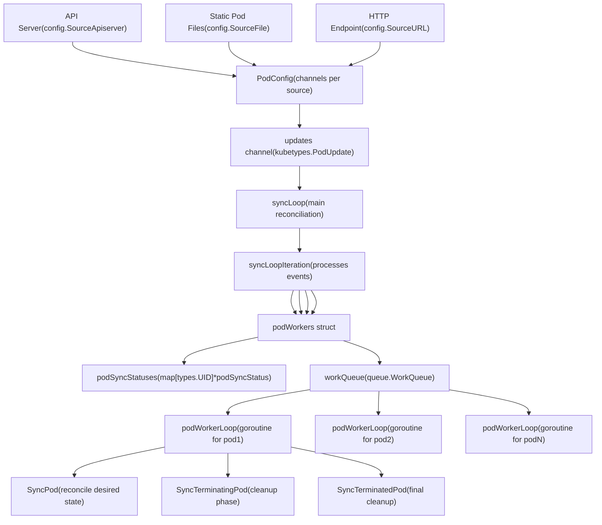
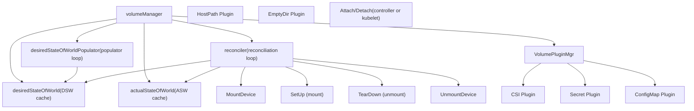
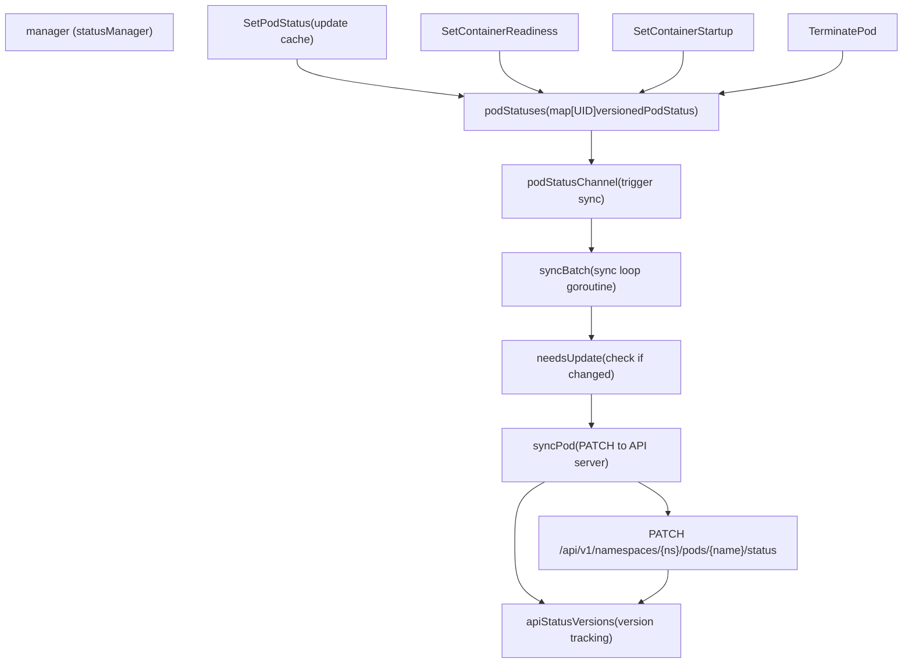
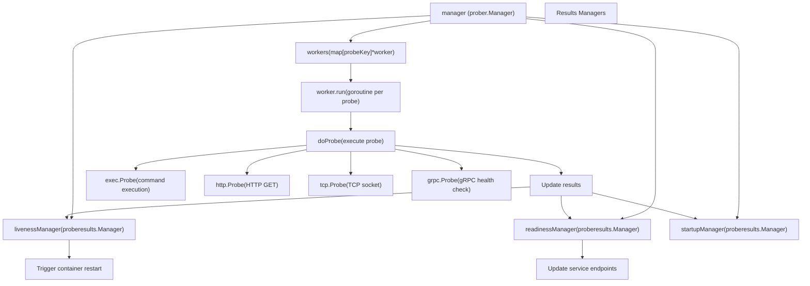
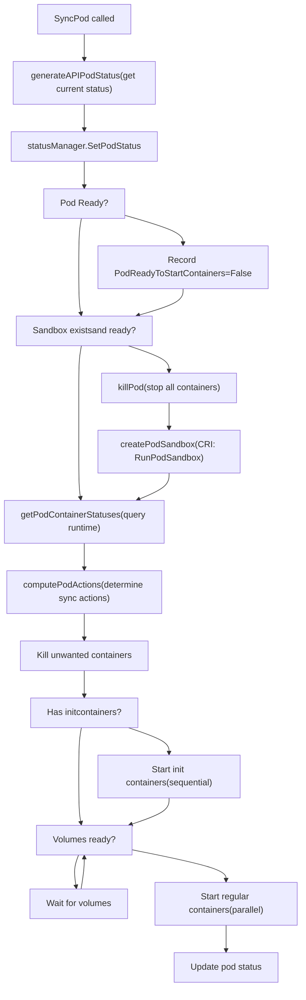
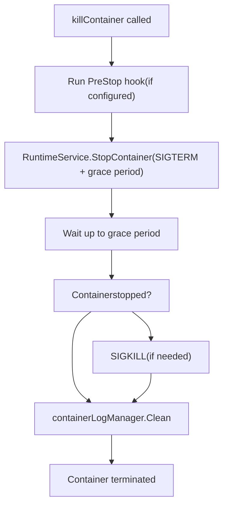
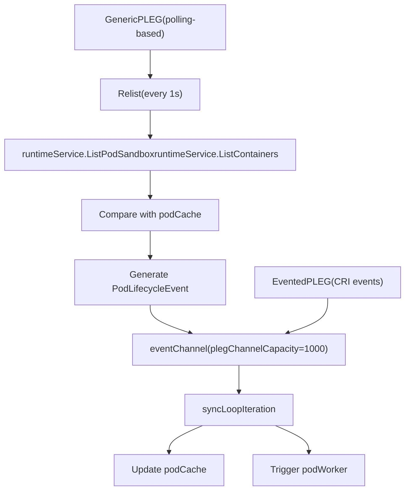

# Kubelet 架构

相关源码文件

-   [cmd/kubelet/app/server.go](https://github.com/kubernetes/kubernetes/blob/2757a872/cmd/kubelet/app/server.go)
-   [pkg/kubelet/allocation/allocation\_manager.go](https://github.com/kubernetes/kubernetes/blob/2757a872/pkg/kubelet/allocation/allocation_manager.go)
-   [pkg/kubelet/allocation/allocation\_manager\_test.go](https://github.com/kubernetes/kubernetes/blob/2757a872/pkg/kubelet/allocation/allocation_manager_test.go)
-   [pkg/kubelet/allocation/features\_linux.go](https://github.com/kubernetes/kubernetes/blob/2757a872/pkg/kubelet/allocation/features_linux.go)
-   [pkg/kubelet/allocation/features\_unsupported.go](https://github.com/kubernetes/kubernetes/blob/2757a872/pkg/kubelet/allocation/features_unsupported.go)
-   [pkg/kubelet/allocation/features\_windows.go](https://github.com/kubernetes/kubernetes/blob/2757a872/pkg/kubelet/allocation/features_windows.go)
-   [pkg/kubelet/allocation/state/checkpoint.go](https://github.com/kubernetes/kubernetes/blob/2757a872/pkg/kubelet/allocation/state/checkpoint.go)
-   [pkg/kubelet/allocation/state/state.go](https://github.com/kubernetes/kubernetes/blob/2757a872/pkg/kubelet/allocation/state/state.go)
-   [pkg/kubelet/allocation/state/state\_checkpoint.go](https://github.com/kubernetes/kubernetes/blob/2757a872/pkg/kubelet/allocation/state/state_checkpoint.go)
-   [pkg/kubelet/allocation/state/state\_checkpoint\_test.go](https://github.com/kubernetes/kubernetes/blob/2757a872/pkg/kubelet/allocation/state/state_checkpoint_test.go)
-   [pkg/kubelet/allocation/state/state\_mem.go](https://github.com/kubernetes/kubernetes/blob/2757a872/pkg/kubelet/allocation/state/state_mem.go)
-   [pkg/kubelet/container/helpers.go](https://github.com/kubernetes/kubernetes/blob/2757a872/pkg/kubelet/container/helpers.go)
-   [pkg/kubelet/container/helpers\_test.go](https://github.com/kubernetes/kubernetes/blob/2757a872/pkg/kubelet/container/helpers_test.go)
-   [pkg/kubelet/container/runtime.go](https://github.com/kubernetes/kubernetes/blob/2757a872/pkg/kubelet/container/runtime.go)
-   [pkg/kubelet/container/testing/fake\_cache.go](https://github.com/kubernetes/kubernetes/blob/2757a872/pkg/kubelet/container/testing/fake_cache.go)
-   [pkg/kubelet/container/testing/fake\_runtime.go](https://github.com/kubernetes/kubernetes/blob/2757a872/pkg/kubelet/container/testing/fake_runtime.go)
-   [pkg/kubelet/container/testing/fake\_runtime\_helper.go](https://github.com/kubernetes/kubernetes/blob/2757a872/pkg/kubelet/container/testing/fake_runtime_helper.go)
-   [pkg/kubelet/container/testing/mocks.go](https://github.com/kubernetes/kubernetes/blob/2757a872/pkg/kubelet/container/testing/mocks.go)
-   [pkg/kubelet/images/helpers.go](https://github.com/kubernetes/kubernetes/blob/2757a872/pkg/kubelet/images/helpers.go)
-   [pkg/kubelet/images/image\_manager.go](https://github.com/kubernetes/kubernetes/blob/2757a872/pkg/kubelet/images/image_manager.go)
-   [pkg/kubelet/images/image\_manager\_test.go](https://github.com/kubernetes/kubernetes/blob/2757a872/pkg/kubelet/images/image_manager_test.go)
-   [pkg/kubelet/images/puller.go](https://github.com/kubernetes/kubernetes/blob/2757a872/pkg/kubelet/images/puller.go)
-   [pkg/kubelet/images/types.go](https://github.com/kubernetes/kubernetes/blob/2757a872/pkg/kubelet/images/types.go)
-   [pkg/kubelet/kubelet.go](https://github.com/kubernetes/kubernetes/blob/2757a872/pkg/kubelet/kubelet.go)
-   [pkg/kubelet/kubelet\_node\_status.go](https://github.com/kubernetes/kubernetes/blob/2757a872/pkg/kubelet/kubelet_node_status.go)
-   [pkg/kubelet/kubelet\_node\_status\_test.go](https://github.com/kubernetes/kubernetes/blob/2757a872/pkg/kubelet/kubelet_node_status_test.go)
-   [pkg/kubelet/kubelet\_pods.go](https://github.com/kubernetes/kubernetes/blob/2757a872/pkg/kubelet/kubelet_pods.go)
-   [pkg/kubelet/kubelet\_pods\_test.go](https://github.com/kubernetes/kubernetes/blob/2757a872/pkg/kubelet/kubelet_pods_test.go)
-   [pkg/kubelet/kubelet\_test.go](https://github.com/kubernetes/kubernetes/blob/2757a872/pkg/kubelet/kubelet_test.go)
-   [pkg/kubelet/kubelet\_volumes.go](https://github.com/kubernetes/kubernetes/blob/2757a872/pkg/kubelet/kubelet_volumes.go)
-   [pkg/kubelet/kubelet\_volumes\_linux\_test.go](https://github.com/kubernetes/kubernetes/blob/2757a872/pkg/kubelet/kubelet_volumes_linux_test.go)
-   [pkg/kubelet/kubelet\_volumes\_test.go](https://github.com/kubernetes/kubernetes/blob/2757a872/pkg/kubelet/kubelet_volumes_test.go)
-   [pkg/kubelet/kuberuntime/convert.go](https://github.com/kubernetes/kubernetes/blob/2757a872/pkg/kubelet/kuberuntime/convert.go)
-   [pkg/kubelet/kuberuntime/convert\_test.go](https://github.com/kubernetes/kubernetes/blob/2757a872/pkg/kubelet/kuberuntime/convert_test.go)
-   [pkg/kubelet/kuberuntime/helpers.go](https://github.com/kubernetes/kubernetes/blob/2757a872/pkg/kubelet/kuberuntime/helpers.go)
-   [pkg/kubelet/kuberuntime/helpers\_test.go](https://github.com/kubernetes/kubernetes/blob/2757a872/pkg/kubelet/kuberuntime/helpers_test.go)
-   [pkg/kubelet/kuberuntime/kuberuntime\_container.go](https://github.com/kubernetes/kubernetes/blob/2757a872/pkg/kubelet/kuberuntime/kuberuntime_container.go)
-   [pkg/kubelet/kuberuntime/kuberuntime\_container\_test.go](https://github.com/kubernetes/kubernetes/blob/2757a872/pkg/kubelet/kuberuntime/kuberuntime_container_test.go)
-   [pkg/kubelet/kuberuntime/kuberuntime\_gc.go](https://github.com/kubernetes/kubernetes/blob/2757a872/pkg/kubelet/kuberuntime/kuberuntime_gc.go)
-   [pkg/kubelet/kuberuntime/kuberuntime\_gc\_test.go](https://github.com/kubernetes/kubernetes/blob/2757a872/pkg/kubelet/kuberuntime/kuberuntime_gc_test.go)
-   [pkg/kubelet/kuberuntime/kuberuntime\_image.go](https://github.com/kubernetes/kubernetes/blob/2757a872/pkg/kubelet/kuberuntime/kuberuntime_image.go)
-   [pkg/kubelet/kuberuntime/kuberuntime\_image\_test.go](https://github.com/kubernetes/kubernetes/blob/2757a872/pkg/kubelet/kuberuntime/kuberuntime_image_test.go)
-   [pkg/kubelet/kuberuntime/kuberuntime\_manager.go](https://github.com/kubernetes/kubernetes/blob/2757a872/pkg/kubelet/kuberuntime/kuberuntime_manager.go)
-   [pkg/kubelet/kuberuntime/kuberuntime\_manager\_test.go](https://github.com/kubernetes/kubernetes/blob/2757a872/pkg/kubelet/kuberuntime/kuberuntime_manager_test.go)
-   [pkg/kubelet/kuberuntime/kuberuntime\_sandbox.go](https://github.com/kubernetes/kubernetes/blob/2757a872/pkg/kubelet/kuberuntime/kuberuntime_sandbox.go)
-   [pkg/kubelet/kuberuntime/kuberuntime\_sandbox\_test.go](https://github.com/kubernetes/kubernetes/blob/2757a872/pkg/kubelet/kuberuntime/kuberuntime_sandbox_test.go)
-   [pkg/kubelet/kuberuntime/labels.go](https://github.com/kubernetes/kubernetes/blob/2757a872/pkg/kubelet/kuberuntime/labels.go)
-   [pkg/kubelet/kuberuntime/labels\_test.go](https://github.com/kubernetes/kubernetes/blob/2757a872/pkg/kubelet/kuberuntime/labels_test.go)
-   [pkg/kubelet/kuberuntime/security\_context.go](https://github.com/kubernetes/kubernetes/blob/2757a872/pkg/kubelet/kuberuntime/security_context.go)
-   [pkg/kubelet/kuberuntime/util/util.go](https://github.com/kubernetes/kubernetes/blob/2757a872/pkg/kubelet/kuberuntime/util/util.go)
-   [pkg/kubelet/kuberuntime/util/util\_test.go](https://github.com/kubernetes/kubernetes/blob/2757a872/pkg/kubelet/kuberuntime/util/util_test.go)
-   [pkg/kubelet/nodestatus/setters.go](https://github.com/kubernetes/kubernetes/blob/2757a872/pkg/kubelet/nodestatus/setters.go)
-   [pkg/kubelet/nodestatus/setters\_test.go](https://github.com/kubernetes/kubernetes/blob/2757a872/pkg/kubelet/nodestatus/setters_test.go)
-   [pkg/kubelet/pod\_workers.go](https://github.com/kubernetes/kubernetes/blob/2757a872/pkg/kubelet/pod_workers.go)
-   [pkg/kubelet/pod\_workers\_test.go](https://github.com/kubernetes/kubernetes/blob/2757a872/pkg/kubelet/pod_workers_test.go)
-   [pkg/kubelet/prober/common\_test.go](https://github.com/kubernetes/kubernetes/blob/2757a872/pkg/kubelet/prober/common_test.go)
-   [pkg/kubelet/prober/prober.go](https://github.com/kubernetes/kubernetes/blob/2757a872/pkg/kubelet/prober/prober.go)
-   [pkg/kubelet/prober/prober\_manager.go](https://github.com/kubernetes/kubernetes/blob/2757a872/pkg/kubelet/prober/prober_manager.go)
-   [pkg/kubelet/prober/prober\_manager\_test.go](https://github.com/kubernetes/kubernetes/blob/2757a872/pkg/kubelet/prober/prober_manager_test.go)
-   [pkg/kubelet/prober/prober\_test.go](https://github.com/kubernetes/kubernetes/blob/2757a872/pkg/kubelet/prober/prober_test.go)
-   [pkg/kubelet/prober/worker.go](https://github.com/kubernetes/kubernetes/blob/2757a872/pkg/kubelet/prober/worker.go)
-   [pkg/kubelet/prober/worker\_test.go](https://github.com/kubernetes/kubernetes/blob/2757a872/pkg/kubelet/prober/worker_test.go)
-   [pkg/kubelet/status/status\_manager.go](https://github.com/kubernetes/kubernetes/blob/2757a872/pkg/kubelet/status/status_manager.go)
-   [pkg/kubelet/status/status\_manager\_test.go](https://github.com/kubernetes/kubernetes/blob/2757a872/pkg/kubelet/status/status_manager_test.go)
-   [pkg/kubelet/types/doc.go](https://github.com/kubernetes/kubernetes/blob/2757a872/pkg/kubelet/types/doc.go)
-   [staging/src/k8s.io/cri-api/pkg/errors/doc.go](https://github.com/kubernetes/kubernetes/blob/2757a872/staging/src/k8s.io/cri-api/pkg/errors/doc.go)
-   [staging/src/k8s.io/cri-api/pkg/errors/errors.go](https://github.com/kubernetes/kubernetes/blob/2757a872/staging/src/k8s.io/cri-api/pkg/errors/errors.go)
-   [staging/src/k8s.io/cri-api/pkg/errors/errors\_test.go](https://github.com/kubernetes/kubernetes/blob/2757a872/staging/src/k8s.io/cri-api/pkg/errors/errors_test.go)

## 目的与范围

本文档描述 kubelet 的内部架构。kubelet 是主要的节点代理，负责在工作节点上管理 Pod 生命周期。本文涵盖 kubelet 初始化、核心子系统（pod workers、容器运行时集成、卷管理、状态上报与健康探测）以及 Pod 对账循环。有关容器运行时接口（CRI）规范本身，请参见外部 CRI 文档。有关集群级调度决策，请参见[调度器](/kubernetes/kubernetes/3.2-scheduler)。有关网络代理配置，请参见[Kube-proxy 与 Service 网络](/kubernetes/kubernetes/4.2-kube-proxy-and-service-networking)。

**来源：** [pkg/kubelet/kubelet.go1-650](https://github.com/kubernetes/kubernetes/blob/2757a872/pkg/kubelet/kubelet.go#L1-L650)

---

## Kubelet 初始化与主要组件

kubelet 通过 `NewMainKubelet` 初始化，并通过 `Run` 方法运行。主 `Kubelet` 结构体包含 Pod 生命周期管理所需的全部核心子系统。

### Kubelet 结构体概览

```mermaid
flowchart TD
    DNSConfigurer["dnsConfigurer(dns.Configurer)"]
    SecretManager["secretManager(secret.Manager)"]
    ConfigMapManager["configMapManager(configmap.Manager)"]
    Kubelet["Kubelet(main struct)"]
    PodWorkers["podWorkers(pod goroutine manager)"]
    ContainerRuntime["containerRuntime(KubeGenericRuntime)"]
    VolumeManager["volumeManager(VolumeManager)"]
    StatusManager["statusManager(Manager)"]
    ProbeManager["probeManager(Manager)"]
    ContainerManager["containerManager(ContainerManager)"]
    WorkQueue["workQueue(BasicWorkQueue)"]
    PodCache["podCache(container cache)"]
    RuntimeCache["runtimeCache(RuntimeCache)"]
    ImageManager["imageManager(ImageGCManager)"]
    LivenessManager["livenessManager(proberesults.Manager)"]
    ReadinessManager["readinessManager(proberesults.Manager)"]
    StartupManager["startupManager(proberesults.Manager)"]
    AllocationManager["allocationManager(Manager)"]
    EvictionManager["evictionManager(Manager)"]
    VolumePluginMgr["volumePluginMgr(VolumePluginMgr)"]
    ContainerGC["containerGC(ContainerGC)"]
    PodManager["podManager(BasicPodManager)"]

    Kubelet --> PodWorkers
    Kubelet --> ContainerRuntime
    Kubelet --> VolumeManager
    Kubelet --> StatusManager
    Kubelet --> ProbeManager
    Kubelet --> ContainerManager
    PodWorkers --> WorkQueue
    PodWorkers --> PodCache
    ContainerRuntime --> RuntimeCache
    ContainerRuntime --> ImageManager
    ProbeManager --> LivenessManager
    ProbeManager --> ReadinessManager
    ProbeManager --> StartupManager
```

**来源：** [pkg/kubelet/kubelet.go150-276](https://github.com/kubernetes/kubernetes/blob/2757a872/pkg/kubelet/kubelet.go#L150-L276) [pkg/kubelet/kubelet.go421-806](https://github.com/kubernetes/kubernetes/blob/2757a872/pkg/kubelet/kubelet.go#L421-L806)

### 初始化流程

kubelet 初始化按以下顺序进行：

| 阶段 | 函数 | 职责 |
| --- | --- | --- |
| **1\. 预初始化** | `PreInitRuntimeService` | 通过 CRI 初始化远程运行时与镜像服务 |
| **2\. 主体构建** | `NewMainKubelet` | 构建包含全部子系统的 Kubelet 结构体 |
| **3\. 依赖设置** | `UnsecuredDependencies` | 创建卷插件、mounter、OOM 调整器 |
| **4\. 运行执行** | `Run` | 启动全部后台 goroutine 与同步循环 |

> **[Mermaid 时序图]**
> *(图表结构无法解析)*

**来源：** [cmd/kubelet/app/server.go401-419](https://github.com/kubernetes/kubernetes/blob/2757a872/cmd/kubelet/app/server.go#L401-L419) [pkg/kubelet/kubelet.go421-806](https://github.com/kubernetes/kubernetes/blob/2757a872/pkg/kubelet/kubelet.go#L421-L806) [cmd/kubelet/app/server.go535-553](https://github.com/kubernetes/kubernetes/blob/2757a872/cmd/kubelet/app/server.go#L535-L553) [pkg/kubelet/kubelet.go1278-1418](https://github.com/kubernetes/kubernetes/blob/2757a872/pkg/kubelet/kubelet.go#L1278-L1418)

---

## 核心子系统

### Pod Workers 与同步循环

Pod workers 子系统管理按 Pod 划分的 goroutine，用于处理 Pod 生命周期操作。每个 Pod 都有一个专用 worker，按顺序处理更新。

#### PodWorkers 架构

**来源：** [pkg/kubelet/pod\_workers.go149-263](https://github.com/kubernetes/kubernetes/blob/2757a872/pkg/kubelet/pod_workers.go#L149-L263) [pkg/kubelet/kubelet.go1693-1832](https://github.com/kubernetes/kubernetes/blob/2757a872/pkg/kubelet/kubelet.go#L1693-L1832) [pkg/kubelet/pod\_workers.go726-1017](https://github.com/kubernetes/kubernetes/blob/2757a872/pkg/kubelet/pod_workers.go#L726-L1017)

#### Pod Worker 状态

Pod workers 会跟踪 Pod 经过以下状态：

| 状态 | 描述 | 下一个可能状态 |
| --- | --- | --- |
| `SyncPod` | Pod 正在主动对账 | `SyncTerminatingPod`, `SyncTerminatingRuntimePod` |
| `SyncTerminatingPod` | Pod 处于终止中，宽限期生效 | `SyncTerminatedPod` |
| `SyncTerminatingRuntimePod` | Pod 已删除，但容器仍在运行 | `SyncTerminatedPod` |
| `SyncTerminatedPod` | 最终清理，所有容器已停止 | 终态 |

**来源：** [pkg/kubelet/pod\_workers.go82-147](https://github.com/kubernetes/kubernetes/blob/2757a872/pkg/kubelet/pod_workers.go#L82-L147)

### 容器运行时集成

kubelet 通过容器运行时接口（CRI）与容器运行时交互。`kubeGenericRuntimeManager` 实现了这一集成。

#### KubeGenericRuntimeManager 组件

```mermaid
flowchart TD
    KGRM["kubeGenericRuntimeManager"]
    RuntimeService["runtimeService(internalapi.RuntimeService)"]
    ImageService["imageService(internalapi.ImageManagerService)"]
    ImagePuller["imagePuller(ImageManager)"]
    Runner["runner(lifecycle.HandlerRunner)"]
    ContainerGC["containerGC(containerGC)"]
    VersionCache["versionCache(ObjectCache)"]
    LogManager["logManager(ContainerLogManager)"]
    RuntimeClassManager["runtimeClassManager(runtimeclass.Manager)"]
    CreateContainer["CreateContainer"]
    StartContainer["StartContainer"]
    StopContainer["StopContainer"]
    RemoveContainer["RemoveContainer"]
    RunPodSandbox["RunPodSandbox"]
    StopPodSandbox["StopPodSandbox"]
    RemovePodSandbox["RemovePodSandbox"]
    PullImage["PullImage"]
    ListImages["ListImages"]
    StartContainerFunc["startContainer(pull, create, start)"]
    KillContainer["killContainer(stop with grace period)"]
    PruneInitContainers["pruneInitContainers"]
    ComputePodActions["computePodActions(determine what needs sync)"]

    KGRM --> RuntimeService
    KGRM --> ImageService
    KGRM --> ImagePuller
    KGRM --> Runner
    KGRM --> ContainerGC
    RuntimeService --> CreateContainer
    RuntimeService --> StartContainer
    RuntimeService --> StopContainer
    RuntimeService --> RunPodSandbox
    ImageService --> PullImage
    ImageService --> ListImages
    StartContainerFunc --> PullImage
    StartContainerFunc --> CreateContainer
    StartContainerFunc --> StartContainer
```

**来源：** [pkg/kubelet/kuberuntime/kuberuntime\_manager.go109-194](https://github.com/kubernetes/kubernetes/blob/2757a872/pkg/kubelet/kuberuntime/kuberuntime_manager.go#L109-L194) [pkg/kubelet/kuberuntime/kuberuntime\_manager.go203-367](https://github.com/kubernetes/kubernetes/blob/2757a872/pkg/kubelet/kuberuntime/kuberuntime_manager.go#L203-L367) [pkg/kubelet/kuberuntime/kuberuntime\_container.go193-352](https://github.com/kubernetes/kubernetes/blob/2757a872/pkg/kubelet/kuberuntime/kuberuntime_container.go#L193-L352)

### 卷管理

`volumeManager` 负责为 Pod 挂载与卸载卷。它运行两个对账循环：一个针对期望状态，一个针对实际状态。

**来源：** [pkg/kubelet/kubelet.go436-451](https://github.com/kubernetes/kubernetes/blob/2757a872/pkg/kubelet/kubelet.go#L436-L451) [pkg/kubelet/kubelet\_volumes.go1-286](https://github.com/kubernetes/kubernetes/blob/2757a872/pkg/kubelet/kubelet_volumes.go#L1-L286)

### 状态管理

`statusManager` 维护 Pod 状态缓存，并将状态更新同步到 API server。

#### 状态管理器架构

**来源：** [pkg/kubelet/status/status\_manager.go66-82](https://github.com/kubernetes/kubernetes/blob/2757a872/pkg/kubelet/status/status_manager.go#L66-L82) [pkg/kubelet/status/status\_manager.go289-402](https://github.com/kubernetes/kubernetes/blob/2757a872/pkg/kubelet/status/status_manager.go#L289-L402) [pkg/kubelet/status/status\_manager.go526-699](https://github.com/kubernetes/kubernetes/blob/2757a872/pkg/kubelet/status/status_manager.go#L526-L699)

### 探针管理

探针管理器为容器运行 liveness、readiness 和 startup 探针。

**来源：** [pkg/kubelet/prober/worker.go50-78](https://github.com/kubernetes/kubernetes/blob/2757a872/pkg/kubelet/prober/worker.go#L50-L78) [pkg/kubelet/prober/worker.go103-254](https://github.com/kubernetes/kubernetes/blob/2757a872/pkg/kubelet/prober/worker.go#L103-L254) [pkg/kubelet/prober/prober.go42-150](https://github.com/kubernetes/kubernetes/blob/2757a872/pkg/kubelet/prober/prober.go#L42-L150)

---

## Pod 生命周期管理

### SyncPod 对账

`SyncPod` 函数是核心对账循环，用于将 Pod 的实际状态与期望状态对齐。

#### SyncPod 流程

**来源：** [pkg/kubelet/kubelet.go1536-1691](https://github.com/kubernetes/kubernetes/blob/2757a872/pkg/kubelet/kubelet.go#L1536-L1691) [pkg/kubelet/kubelet\_pods.go1065-1328](https://github.com/kubernetes/kubernetes/blob/2757a872/pkg/kubelet/kubelet_pods.go#L1065-L1328)

#### ComputePodActions

`computePodActions` 函数通过比较期望状态与实际状态，确定需要同步的内容：

| 动作 | 条件 | 结果 |
| --- | --- | --- |
| `KillPod` | Sandbox 未就绪或配置已变更 | 停止全部容器 |
| `CreateSandbox` | 不存在 Sandbox | 创建新 Sandbox |
| `ContainersToKill` | 容器失败、规格变更或 liveness 失败 | 停止特定容器 |
| `ContainersToStart` | 容器未运行但应运行 | 启动容器 |
| `InitContainersToStart` | Init 容器待执行 | 启动 Init 容器 |

**来源：** [pkg/kubelet/kuberuntime/kuberuntime\_manager.go699-897](https://github.com/kubernetes/kubernetes/blob/2757a872/pkg/kubelet/kuberuntime/kuberuntime_manager.go#L699-L897)

### 容器生命周期操作

#### startContainer 序列

> **[Mermaid 时序图]**
> *(图表结构无法解析)*

**来源：** [pkg/kubelet/kuberuntime/kuberuntime\_container.go193-352](https://github.com/kubernetes/kubernetes/blob/2757a872/pkg/kubelet/kuberuntime/kuberuntime_container.go#L193-L352)

#### killContainer 流程

容器终止遵循以下步骤：

1.  **Graceful Shutdown Period**：发送 SIGTERM，并等待 `TerminationGracePeriodSeconds`
2.  **PreStop Hook**：执行 lifecycle.PreStop hook（若已定义）
3.  **Force Kill**：若宽限期到期则发送 SIGKILL
4.  **Container Removal**：从运行时移除容器

**来源：** [pkg/kubelet/kuberuntime/kuberuntime\_container.go573-731](https://github.com/kubernetes/kubernetes/blob/2757a872/pkg/kubelet/kuberuntime/kuberuntime_container.go#L573-L731)

---

## 配置与依赖

### Kubelet 配置

kubelet 可通过以下方式配置：

1.  **命令行 flags**（通过 `KubeletFlags`）
2.  **配置文件**（`KubeletConfiguration` YAML/JSON）
3.  **Drop-in 配置目录**（按字典序合并）

配置优先级：CLI flags > 配置文件 > 默认值。

**来源：** [cmd/kubelet/app/server.go138-326](https://github.com/kubernetes/kubernetes/blob/2757a872/cmd/kubelet/app/server.go#L138-L326) [cmd/kubelet/app/server.go421-448](https://github.com/kubernetes/kubernetes/blob/2757a872/cmd/kubelet/app/server.go#L421-L448)

### 依赖注入

`Dependencies` 结构体用于归拢注入依赖：

| 依赖 | 类型 | 用途 |
| --- | --- | --- |
| `RemoteRuntimeService` | `internalapi.RuntimeService` | CRI 运行时客户端 |
| `RemoteImageService` | `internalapi.ImageManagerService` | CRI 镜像客户端 |
| `CAdvisorInterface` | `cadvisor.Interface` | 容器指标 |
| `ContainerManager` | `cm.ContainerManager` | Cgroup 管理 |
| `VolumePlugins` | `[]volume.VolumePlugin` | 卷插件实现 |
| `Mounter` | `mount.Interface` | 文件系统挂载 |
| `ProbeManager` | `prober.Manager` | 容器健康探测 |
| `TracerProvider` | `trace.TracerProvider` | OpenTelemetry tracing |

**来源：** [pkg/kubelet/kubelet.go308-343](https://github.com/kubernetes/kubernetes/blob/2757a872/pkg/kubelet/kubelet.go#L308-L343) [cmd/kubelet/app/server.go495-533](https://github.com/kubernetes/kubernetes/blob/2757a872/cmd/kubelet/app/server.go#L495-L533)

### 主要同步循环

kubelet 会运行若干 goroutine 以执行后台操作：

| 循环 | 函数 | 周期 | 用途 |
| --- | --- | --- | --- |
| **主同步循环** | `syncLoop` | 持续（事件驱动） | 处理来自所有来源的 Pod 更新 |
| **Housekeeping** | `HandlePodCleanups` | `housekeepingPeriod` (2s) | 清理孤儿 Pod 与镜像 Pod |
| **PLEG** | `pleg.Relist` | `genericPlegRelistPeriod` (1s) | 检测容器状态变化 |
| **状态同步** | `statusManager.Start` | 持续（事件驱动） | 将 Pod 状态同步到 API server |
| **节点状态** | `syncNodeStatus` | `nodeStatusUpdateFrequency` (10s) | 更新节点状态与心跳 |
| **卷对账器** | `volumeManager.Run` | 持续 | 挂载/卸载卷 |
| **探针 workers** | `probeManager.Start` | 按探针周期 | 执行健康检查 |
| **容器 GC** | `containerGC.GarbageCollect` | `ContainerGCPeriod` (1m) | 删除死亡容器 |
| **镜像 GC** | `imageManager.GarbageCollect` | `ImageGCPeriod` (5m) | 删除未使用镜像 |

**来源：** [pkg/kubelet/kubelet.go1278-1418](https://github.com/kubernetes/kubernetes/blob/2757a872/pkg/kubelet/kubelet.go#L1278-L1418) [pkg/kubelet/kubelet.go2154-2188](https://github.com/kubernetes/kubernetes/blob/2757a872/pkg/kubelet/kubelet.go#L2154-L2188)

### PLEG（Pod 生命周期事件生成器）

PLEG 通过周期性重新列举容器并与缓存状态比较，来检测容器生命周期事件：

**来源：** [pkg/kubelet/kubelet.go847-874](https://github.com/kubernetes/kubernetes/blob/2757a872/pkg/kubelet/kubelet.go#L847-L874) [pkg/kubelet/kubelet.go1693-1832](https://github.com/kubernetes/kubernetes/blob/2757a872/pkg/kubelet/kubelet.go#L1693-L1832)

---

## 总结

kubelet 架构由多个协同子系统组成：

1.  **Pod Workers**：管理按 Pod 划分的 goroutine，并执行 `SyncPod` 对账
2.  **Container Runtime Manager**：实现容器生命周期操作的 CRI 集成
3.  **Volume Manager**：处理卷挂载/卸载，并对账期望状态与实际状态
4.  **Status Manager**：缓存并将 Pod 状态同步到 API server
5.  **Probe Manager**：执行健康检查（liveness、readiness、startup）
6.  **PLEG**：检测容器状态变化并生成生命周期事件

主要对账发生在 `SyncPod` 中，它会按期望规格创建 sandbox、启动容器、挂载卷并维护 Pod 状态。

**来源：** [pkg/kubelet/kubelet.go1-2500](https://github.com/kubernetes/kubernetes/blob/2757a872/pkg/kubelet/kubelet.go#L1-L2500) [pkg/kubelet/pod\_workers.go1-1200](https://github.com/kubernetes/kubernetes/blob/2757a872/pkg/kubelet/pod_workers.go#L1-L1200) [pkg/kubelet/kuberuntime/kuberuntime\_manager.go1-800](https://github.com/kubernetes/kubernetes/blob/2757a872/pkg/kubelet/kuberuntime/kuberuntime_manager.go#L1-L800)
