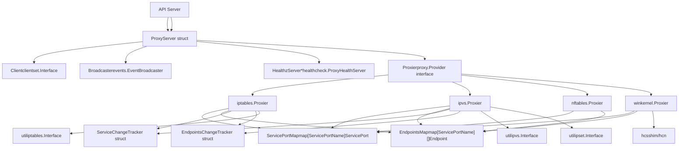
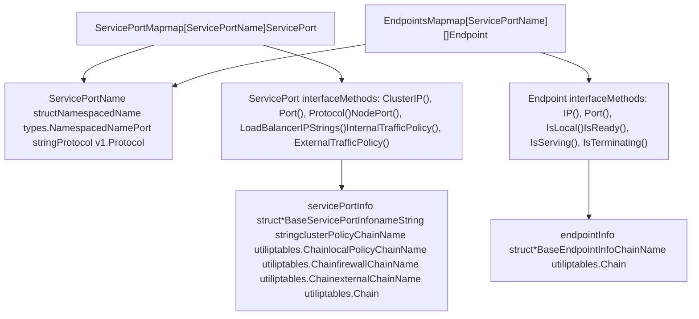
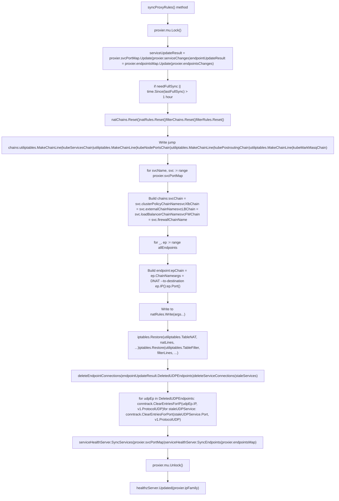

# Kube-proxy 与 Service 网络

相关源码文件

-   [cmd/kube-proxy/app/options.go](https://github.com/kubernetes/kubernetes/blob/2757a872/cmd/kube-proxy/app/options.go)
-   [cmd/kube-proxy/app/options\_test.go](https://github.com/kubernetes/kubernetes/blob/2757a872/cmd/kube-proxy/app/options_test.go)
-   [cmd/kube-proxy/app/server.go](https://github.com/kubernetes/kubernetes/blob/2757a872/cmd/kube-proxy/app/server.go)
-   [cmd/kube-proxy/app/server\_linux.go](https://github.com/kubernetes/kubernetes/blob/2757a872/cmd/kube-proxy/app/server_linux.go)
-   [cmd/kube-proxy/app/server\_linux\_test.go](https://github.com/kubernetes/kubernetes/blob/2757a872/cmd/kube-proxy/app/server_linux_test.go)
-   [cmd/kube-proxy/app/server\_test.go](https://github.com/kubernetes/kubernetes/blob/2757a872/cmd/kube-proxy/app/server_test.go)
-   [cmd/kube-proxy/app/server\_windows.go](https://github.com/kubernetes/kubernetes/blob/2757a872/cmd/kube-proxy/app/server_windows.go)
-   [cmd/kubemark/hollow-node.go](https://github.com/kubernetes/kubernetes/blob/2757a872/cmd/kubemark/hollow-node.go)
-   [pkg/kubemark/hollow\_kubelet.go](https://github.com/kubernetes/kubernetes/blob/2757a872/pkg/kubemark/hollow_kubelet.go)
-   [pkg/proxy/apis/config/fuzzer/fuzzer.go](https://github.com/kubernetes/kubernetes/blob/2757a872/pkg/proxy/apis/config/fuzzer/fuzzer.go)
-   [pkg/proxy/apis/config/scheme/testdata/KubeProxyConfiguration/after/v1alpha1.yaml](https://github.com/kubernetes/kubernetes/blob/2757a872/pkg/proxy/apis/config/scheme/testdata/KubeProxyConfiguration/after/v1alpha1.yaml)
-   [pkg/proxy/apis/config/scheme/testdata/KubeProxyConfiguration/roundtrip/default/v1alpha1.yaml](https://github.com/kubernetes/kubernetes/blob/2757a872/pkg/proxy/apis/config/scheme/testdata/KubeProxyConfiguration/roundtrip/default/v1alpha1.yaml)
-   [pkg/proxy/apis/config/types.go](https://github.com/kubernetes/kubernetes/blob/2757a872/pkg/proxy/apis/config/types.go)
-   [pkg/proxy/apis/config/v1alpha1/conversion.go](https://github.com/kubernetes/kubernetes/blob/2757a872/pkg/proxy/apis/config/v1alpha1/conversion.go)
-   [pkg/proxy/apis/config/v1alpha1/defaults.go](https://github.com/kubernetes/kubernetes/blob/2757a872/pkg/proxy/apis/config/v1alpha1/defaults.go)
-   [pkg/proxy/apis/config/v1alpha1/defaults\_test.go](https://github.com/kubernetes/kubernetes/blob/2757a872/pkg/proxy/apis/config/v1alpha1/defaults_test.go)
-   [pkg/proxy/apis/config/v1alpha1/zz\_generated.conversion.go](https://github.com/kubernetes/kubernetes/blob/2757a872/pkg/proxy/apis/config/v1alpha1/zz_generated.conversion.go)
-   [pkg/proxy/apis/config/validation/validation.go](https://github.com/kubernetes/kubernetes/blob/2757a872/pkg/proxy/apis/config/validation/validation.go)
-   [pkg/proxy/apis/config/validation/validation\_test.go](https://github.com/kubernetes/kubernetes/blob/2757a872/pkg/proxy/apis/config/validation/validation_test.go)
-   [pkg/proxy/apis/config/zz\_generated.deepcopy.go](https://github.com/kubernetes/kubernetes/blob/2757a872/pkg/proxy/apis/config/zz_generated.deepcopy.go)
-   [pkg/proxy/apis/well\_known\_labels.go](https://github.com/kubernetes/kubernetes/blob/2757a872/pkg/proxy/apis/well_known_labels.go)
-   [pkg/proxy/config/api\_test.go](https://github.com/kubernetes/kubernetes/blob/2757a872/pkg/proxy/config/api_test.go)
-   [pkg/proxy/config/config.go](https://github.com/kubernetes/kubernetes/blob/2757a872/pkg/proxy/config/config.go)
-   [pkg/proxy/config/config\_test.go](https://github.com/kubernetes/kubernetes/blob/2757a872/pkg/proxy/config/config_test.go)
-   [pkg/proxy/endpointschangetracker.go](https://github.com/kubernetes/kubernetes/blob/2757a872/pkg/proxy/endpointschangetracker.go)
-   [pkg/proxy/endpointschangetracker\_test.go](https://github.com/kubernetes/kubernetes/blob/2757a872/pkg/proxy/endpointschangetracker_test.go)
-   [pkg/proxy/endpointslicecache.go](https://github.com/kubernetes/kubernetes/blob/2757a872/pkg/proxy/endpointslicecache.go)
-   [pkg/proxy/endpointslicecache\_test.go](https://github.com/kubernetes/kubernetes/blob/2757a872/pkg/proxy/endpointslicecache_test.go)
-   [pkg/proxy/healthcheck/common.go](https://github.com/kubernetes/kubernetes/blob/2757a872/pkg/proxy/healthcheck/common.go)
-   [pkg/proxy/healthcheck/healthcheck\_test.go](https://github.com/kubernetes/kubernetes/blob/2757a872/pkg/proxy/healthcheck/healthcheck_test.go)
-   [pkg/proxy/healthcheck/proxy\_health.go](https://github.com/kubernetes/kubernetes/blob/2757a872/pkg/proxy/healthcheck/proxy_health.go)
-   [pkg/proxy/healthcheck/service\_health.go](https://github.com/kubernetes/kubernetes/blob/2757a872/pkg/proxy/healthcheck/service_health.go)
-   [pkg/proxy/iptables/proxier.go](https://github.com/kubernetes/kubernetes/blob/2757a872/pkg/proxy/iptables/proxier.go)
-   [pkg/proxy/iptables/proxier\_test.go](https://github.com/kubernetes/kubernetes/blob/2757a872/pkg/proxy/iptables/proxier_test.go)
-   [pkg/proxy/ipvs/proxier.go](https://github.com/kubernetes/kubernetes/blob/2757a872/pkg/proxy/ipvs/proxier.go)
-   [pkg/proxy/ipvs/proxier\_test.go](https://github.com/kubernetes/kubernetes/blob/2757a872/pkg/proxy/ipvs/proxier_test.go)
-   [pkg/proxy/kubemark/hollow\_proxy.go](https://github.com/kubernetes/kubernetes/blob/2757a872/pkg/proxy/kubemark/hollow_proxy.go)
-   [pkg/proxy/metaproxier/meta\_proxier.go](https://github.com/kubernetes/kubernetes/blob/2757a872/pkg/proxy/metaproxier/meta_proxier.go)
-   [pkg/proxy/metrics/metrics.go](https://github.com/kubernetes/kubernetes/blob/2757a872/pkg/proxy/metrics/metrics.go)
-   [pkg/proxy/nftables/README.md](https://github.com/kubernetes/kubernetes/blob/2757a872/pkg/proxy/nftables/README.md?plain=1)
-   [pkg/proxy/nftables/helpers\_test.go](https://github.com/kubernetes/kubernetes/blob/2757a872/pkg/proxy/nftables/helpers_test.go)
-   [pkg/proxy/nftables/proxier.go](https://github.com/kubernetes/kubernetes/blob/2757a872/pkg/proxy/nftables/proxier.go)
-   [pkg/proxy/nftables/proxier\_test.go](https://github.com/kubernetes/kubernetes/blob/2757a872/pkg/proxy/nftables/proxier_test.go)
-   [pkg/proxy/node.go](https://github.com/kubernetes/kubernetes/blob/2757a872/pkg/proxy/node.go)
-   [pkg/proxy/node\_test.go](https://github.com/kubernetes/kubernetes/blob/2757a872/pkg/proxy/node_test.go)
-   [pkg/proxy/servicechangetracker.go](https://github.com/kubernetes/kubernetes/blob/2757a872/pkg/proxy/servicechangetracker.go)
-   [pkg/proxy/servicechangetracker\_test.go](https://github.com/kubernetes/kubernetes/blob/2757a872/pkg/proxy/servicechangetracker_test.go)
-   [pkg/proxy/serviceport.go](https://github.com/kubernetes/kubernetes/blob/2757a872/pkg/proxy/serviceport.go)
-   [pkg/proxy/topology.go](https://github.com/kubernetes/kubernetes/blob/2757a872/pkg/proxy/topology.go)
-   [pkg/proxy/topology\_test.go](https://github.com/kubernetes/kubernetes/blob/2757a872/pkg/proxy/topology_test.go)
-   [pkg/proxy/types.go](https://github.com/kubernetes/kubernetes/blob/2757a872/pkg/proxy/types.go)
-   [pkg/proxy/util/endpoints.go](https://github.com/kubernetes/kubernetes/blob/2757a872/pkg/proxy/util/endpoints.go)
-   [pkg/proxy/util/endpoints\_test.go](https://github.com/kubernetes/kubernetes/blob/2757a872/pkg/proxy/util/endpoints_test.go)
-   [pkg/proxy/util/nodeport\_addresses.go](https://github.com/kubernetes/kubernetes/blob/2757a872/pkg/proxy/util/nodeport_addresses.go)
-   [pkg/proxy/util/nodeport\_addresses\_test.go](https://github.com/kubernetes/kubernetes/blob/2757a872/pkg/proxy/util/nodeport_addresses_test.go)
-   [pkg/proxy/util/utils.go](https://github.com/kubernetes/kubernetes/blob/2757a872/pkg/proxy/util/utils.go)
-   [pkg/proxy/util/utils\_test.go](https://github.com/kubernetes/kubernetes/blob/2757a872/pkg/proxy/util/utils_test.go)
-   [pkg/proxy/winkernel/hcnutils.go](https://github.com/kubernetes/kubernetes/blob/2757a872/pkg/proxy/winkernel/hcnutils.go)
-   [pkg/proxy/winkernel/hns.go](https://github.com/kubernetes/kubernetes/blob/2757a872/pkg/proxy/winkernel/hns.go)
-   [pkg/proxy/winkernel/hns\_test.go](https://github.com/kubernetes/kubernetes/blob/2757a872/pkg/proxy/winkernel/hns_test.go)
-   [pkg/proxy/winkernel/proxier.go](https://github.com/kubernetes/kubernetes/blob/2757a872/pkg/proxy/winkernel/proxier.go)
-   [pkg/proxy/winkernel/proxier\_test.go](https://github.com/kubernetes/kubernetes/blob/2757a872/pkg/proxy/winkernel/proxier_test.go)
-   [pkg/proxy/winkernel/testing/hcnutils\_mock.go](https://github.com/kubernetes/kubernetes/blob/2757a872/pkg/proxy/winkernel/testing/hcnutils_mock.go)
-   [staging/src/k8s.io/kube-proxy/config/v1alpha1/types.go](https://github.com/kubernetes/kubernetes/blob/2757a872/staging/src/k8s.io/kube-proxy/config/v1alpha1/types.go)
-   [staging/src/k8s.io/kube-proxy/config/v1alpha1/zz\_generated.deepcopy.go](https://github.com/kubernetes/kubernetes/blob/2757a872/staging/src/k8s.io/kube-proxy/config/v1alpha1/zz_generated.deepcopy.go)

**目的**：本文档描述 kube-proxy，即在每个节点上负责实现 Kubernetes Service 网络的组件。内容涵盖其架构、后端实现（iptables、ipvs、nftables、winkernel）、Service 路由机制，以及 kube-proxy 如何将 Services 与 Endpoints 转换为网络规则以实现 pod-to-service 通信。

**范围**：本页聚焦 kube-proxy 的内部架构与网络实现。有关 kubelet 在节点上的职责，请参见 [4.1](/kubernetes/kubernetes/4.1-kubelet-architecture)。有关集群搭建与引导，请参见 [5](/kubernetes/kubernetes/5-cluster-bootstrap-and-management)。

---

## 概览

Kube-proxy 运行在 Kubernetes 集群的每个节点上，维护网络规则以支持从集群内部或外部访问 Services。它会监听 API server 中的 Service 与 EndpointSlice 对象，并按需编程底层网络子系统（iptables、ipvs、nftables 或 Windows HNS）来路由流量。

**关键职责**：

-   监听 API server 中的 Services 与 EndpointSlices
-   将 Service 定义转换为网络规则
-   实现 ClusterIP、NodePort 与 LoadBalancer Service 类型
-   处理流量策略（internal/external traffic policy）
-   为具有本地 endpoints 的服务执行健康检查
-   实现连接跟踪与伪装

**来源**： [cmd/kube-proxy/app/server.go160-178](https://github.com/kubernetes/kubernetes/blob/2757a872/cmd/kube-proxy/app/server.go#L160-L178) [pkg/proxy/iptables/proxier.go133-209](https://github.com/kubernetes/kubernetes/blob/2757a872/pkg/proxy/iptables/proxier.go#L133-L209) [pkg/proxy/ipvs/proxier.go162-249](https://github.com/kubernetes/kubernetes/blob/2757a872/pkg/proxy/ipvs/proxier.go#L162-L249)

---

## 架构概览

**带代码实体的 Kube-proxy 高层架构**


**来源**： [cmd/kube-proxy/app/server.go160-178](https://github.com/kubernetes/kubernetes/blob/2757a872/cmd/kube-proxy/app/server.go#L160-L178) [pkg/proxy/iptables/proxier.go133-209](https://github.com/kubernetes/kubernetes/blob/2757a872/pkg/proxy/iptables/proxier.go#L133-L209) [pkg/proxy/ipvs/proxier.go161-249](https://github.com/kubernetes/kubernetes/blob/2757a872/pkg/proxy/ipvs/proxier.go#L161-L249) [pkg/proxy/nftables/proxier.go138-200](https://github.com/kubernetes/kubernetes/blob/2757a872/pkg/proxy/nftables/proxier.go#L138-L200) [pkg/proxy/winkernel/proxier.go](https://github.com/kubernetes/kubernetes/blob/2757a872/pkg/proxy/winkernel/proxier.go)

---

## 后端实现

Kube-proxy 支持四种后端实现，可通过 `--proxy-mode` flag 选择：

| 后端 | 平台 | 描述 | 主要使用场景 |
| --- | --- | --- | --- |
| **iptables** | Linux | 使用 netfilter/iptables 规则 | 大多数 Linux 发行版默认 |
| **ipvs** | Linux | 使用 IPVS（IP Virtual Server）内核模块 | 高性能、大规模集群 |
| **nftables** | Linux | 使用 nftables（iptables 的后继） | 现代 Linux 系统 |
| **winkernel** | Windows | 使用 Windows Host Networking Service（HNS） | Windows 节点 |

### iptables 模式

iptables proxier 通过 iptables 命令行工具编程 netfilter 规则。它会在 `nat` 与 `filter` 表中创建自定义链和规则。

**关键链**：

-   `KUBE-SERVICES`：Service 流量主入口
-   `KUBE-SVC-*`：按 Service 划分的负载均衡链
-   `KUBE-SEP-*`：按 endpoint 划分的目的 DNAT 链
-   `KUBE-NODEPORTS`：NodePort 流量入口
-   `KUBE-MARK-MASQ`：为伪装打标记
-   `KUBE-POSTROUTING`：对已标记数据包应用伪装

**来源**： [pkg/proxy/iptables/proxier.go54-87](https://github.com/kubernetes/kubernetes/blob/2757a872/pkg/proxy/iptables/proxier.go#L54-L87) [pkg/proxy/iptables/proxier.go377-401](https://github.com/kubernetes/kubernetes/blob/2757a872/pkg/proxy/iptables/proxier.go#L377-L401)

### iptables Proxier 结构

**iptables.Proxier 结构体字段与依赖**

```mermaid
flowchart TD
    PROXIER["iptables.Proxier struct"]
    IPFAMILY["ipFamily v1.IPFamily"]
    SVCMAP["svcPortMap proxy.ServicePortMap"]
    EPMAP["endpointsMap proxy.EndpointsMap"]
    SVCCHG["serviceChanges *proxy.ServiceChangeTracker"]
    EPCHG["endpointsChanges *proxy.EndpointsChangeTracker"]
    NEEDFULLSYNC["needFullSync bool"]
    INITIALIZED["initialized int32"]
    IPT["iptables utiliptables.Interface"]
    NATBUF["natChains, natRules proxyutil.LineBuffer"]
    FILTERBUF["filterChains, filterRules proxyutil.LineBuffer"]
    IPTDATA["iptablesData, existingFilterChainsData *bytes.Buffer"]
    CONNTRACK["conntrack conntrack.Interface"]
    HEALTH["serviceHealthServer healthcheck.ServiceHealthServer"]
    HEALTHZ["healthzServer *healthcheck.ProxyHealthServer"]
    LOCALDET["localDetector proxyutil.LocalTrafficDetector"]
    NFACCT["nfacct nfacct.Interface"]
    MASQALL["masqueradeAll bool"]
    MASQMARK["masqueradeMark string"]
    NODEIP["nodeIP net.IP"]
    NODENAME["nodeName string"]
    NODEPORTADDR["nodePortAddresses *proxyutil.NodePortAddresses"]
    LOCALHOST["localhostNodePorts bool"]
    SYNCRUNNER["syncRunner *runner.BoundedFrequencyRunner"]
    SYNCPERIOD["syncPeriod time.Duration"]
    SYNCPROXY["syncProxyRules() method"]

    PROXIER --> IPFAMILY
    PROXIER --> SVCMAP
    PROXIER --> EPMAP
    PROXIER --> SVCCHG
    PROXIER --> EPCHG
    PROXIER --> IPT
    PROXIER --> NATBUF
    PROXIER --> FILTERBUF
    PROXIER --> IPTDATA
    PROXIER --> CONNTRACK
    PROXIER --> HEALTH
    PROXIER --> HEALTHZ
    PROXIER --> LOCALDET
    PROXIER --> NFACCT
    PROXIER --> MASQALL
    PROXIER --> MASQMARK
    PROXIER --> NODEIP
    PROXIER --> NODENAME
    PROXIER --> NODEPORTADDR
    PROXIER --> LOCALHOST
    PROXIER --> SYNCRUNNER
    PROXIER --> SYNCPERIOD
    SVCCHG --> SVCMAP
    EPCHG --> EPMAP
    SYNCRUNNER --> SYNCPROXY
```


**来源**： [pkg/proxy/iptables/proxier.go133-209](https://github.com/kubernetes/kubernetes/blob/2757a872/pkg/proxy/iptables/proxier.go#L133-L209)

### IPVS 模式

IPVS proxier 使用 Linux 内核的 IPVS（IP Virtual Server）模块进行负载均衡。对于大量服务场景，IPVS 在传输层工作并通常比 iptables 提供更好的性能。

**关键组件**：

-   每个服务 IP 对应的虚拟服务器（VIP）
-   每个虚拟服务器后的真实服务器（endpoints）
-   调度算法（rr、lc、wrr 等）
-   用于高效 IP 匹配的 ipset
-   用于补充规则（伪装、防火墙）的 iptables

**IPVS 链与集合**：

-   `KUBE-SERVICES`：分发到 IPVS 或 iptables
-   `KUBE-NODE-PORT`：NodePort 处理
-   `KUBE-LOAD-BALANCER`：LoadBalancer 处理
-   `KUBE-MARK-MASQ`：为 SNAT 打标记
-   多种用于高效匹配的 ipsets（例如 `KUBE-CLUSTER-IP`、`KUBE-NODE-PORT-TCP`）

**来源**： [pkg/proxy/ipvs/proxier.go58-95](https://github.com/kubernetes/kubernetes/blob/2757a872/pkg/proxy/ipvs/proxier.go#L58-L95) [pkg/proxy/ipvs/proxier.go419-454](https://github.com/kubernetes/kubernetes/blob/2757a872/pkg/proxy/ipvs/proxier.go#L419-L454) [pkg/proxy/ipvs/proxier.go473-496](https://github.com/kubernetes/kubernetes/blob/2757a872/pkg/proxy/ipvs/proxier.go#L473-L496)

### nftables 模式

nftables proxier 是 iptables 的现代替代实现，使用 nftables 内核子系统。它提供更好的性能和更一致的规则结构。

**关键结构**：

-   单个 `kube-proxy` 表，包含所有链
-   用于高效查找的 maps（服务 IP、nodeports、防火墙规则）
-   用于 IP 列表的 sets（cluster IP、nodeport IP）
-   用于条件跳转的 verdict maps

**主要链**：

-   `services`：主服务分发
-   `service-ips`：服务 IP 到链的映射
-   `service-nodeports`：nodeports 到链的映射
-   `mark-for-masquerade`：为 SNAT 打标记
-   `masquerading`：对已标记数据包应用 SNAT

**来源**： [pkg/proxy/nftables/proxier.go55-98](https://github.com/kubernetes/kubernetes/blob/2757a872/pkg/proxy/nftables/proxier.go#L55-L98) [pkg/proxy/nftables/proxier.go138-200](https://github.com/kubernetes/kubernetes/blob/2757a872/pkg/proxy/nftables/proxier.go#L138-L200)

### Windows Kernel 模式

winkernel proxier 使用 Windows Host Networking Service（HNS）API 来编程 Windows 网络。它同时支持 HNS v1 与 v2（HCN）。

**关键概念**：

-   HNS endpoints 表示后端 Pod
-   HNS load balancers 表示 Services
-   Policies 定义负载均衡行为
-   支持用于 LoadBalancer 服务的 DSR（Direct Server Return）

**来源**： [pkg/proxy/winkernel/proxier.go54-109](https://github.com/kubernetes/kubernetes/blob/2757a872/pkg/proxy/winkernel/proxier.go#L54-L109) [pkg/proxy/winkernel/proxier.go](https://github.com/kubernetes/kubernetes/blob/2757a872/pkg/proxy/winkernel/proxier.go)

---

## 核心数据结构

### ServicePortMap 与 EndpointsMap

这是保存当前 services 与 endpoints 状态的主要数据结构。

**带类型定义的核心数据结构**


**ServicePortName struct** [pkg/proxy/types.go63-80](https://github.com/kubernetes/kubernetes/blob/2757a872/pkg/proxy/types.go#L63-L80)：唯一标识由以下部分组合：

-   `NamespacedName`：命名空间与服务名称
-   `Port`：端口名称（不是端口号）
-   `Protocol`：v1.Protocol（TCP/UDP/SCTP）

**ServicePort interface** [pkg/proxy/types.go86-135](https://github.com/kubernetes/kubernetes/blob/2757a872/pkg/proxy/types.go#L86-L135) 方法：

-   `String()`, `ClusterIP()`, `Port()`, `SessionAffinityType()`, `Protocol()`
-   `LoadBalancerIPStrings()`, `HealthCheckNodePort()`, `NodePort()`
-   `InternalTrafficPolicy()`, `ExternalTrafficPolicy()`
-   `LoadBalancerSourceRanges()`, `LoadBalancerClass()`, `TrafficDistribution()`

**Endpoint interface** [pkg/proxy/types.go138-157](https://github.com/kubernetes/kubernetes/blob/2757a872/pkg/proxy/types.go#L138-L157) 方法：

-   `String()`, `IP()`, `Port()`, `Equal(Endpoint) bool`
-   `IsLocal()`, `IsReady()`, `IsServing()`, `IsTerminating()`
-   `GetZoneHints()`, `GetTopology()`

**iptables 特定实现**：

-   `servicePortInfo` [pkg/proxy/iptables/proxier.go327-352](https://github.com/kubernetes/kubernetes/blob/2757a872/pkg/proxy/iptables/proxier.go#L327-L352)：在 `BaseServicePortInfo` 基础上扩展预计算链名以提升性能
-   `endpointInfo` [pkg/proxy/iptables/proxier.go355-359](https://github.com/kubernetes/kubernetes/blob/2757a872/pkg/proxy/iptables/proxier.go#L355-L359)：在 `BaseEndpointInfo` 基础上扩展 `ChainName` 字段，用于 `KUBE-SEP-*` 链

**来源**： [pkg/proxy/types.go](https://github.com/kubernetes/kubernetes/blob/2757a872/pkg/proxy/types.go) [pkg/proxy/iptables/proxier.go327-367](https://github.com/kubernetes/kubernetes/blob/2757a872/pkg/proxy/iptables/proxier.go#L327-L367)

### 变更跟踪器

变更跟踪器会在同步周期之间累计服务与 endpoints 的变更，从而提供高效的增量处理。

**ServiceChangeTracker**：跟踪 service 的新增、更新与删除。

-   `Update(previous, current *v1.Service)`：记录 service 变更
-   返回累计变更供后续处理

**EndpointsChangeTracker**：跟踪 endpoint slice 的新增、更新与删除。

-   `EndpointSliceUpdate(endpointSlice *discovery.EndpointSlice, removeSlice bool)`：记录 endpoint 变更
-   返回累计变更供后续处理

**来源**： [pkg/proxy/iptables/proxier.go141-142](https://github.com/kubernetes/kubernetes/blob/2757a872/pkg/proxy/iptables/proxier.go#L141-L142) [pkg/proxy/service.go](https://github.com/kubernetes/kubernetes/blob/2757a872/pkg/proxy/service.go) [pkg/proxy/endpoints.go](https://github.com/kubernetes/kubernetes/blob/2757a872/pkg/proxy/endpoints.go)

---

## Service 类型与网络

### ClusterIP Services

ClusterIP 是默认 Service 类型，提供仅可在集群内访问的内部 IP 地址。

**路由流程**：

1.  发往 ClusterIP 的数据包进入 `KUBE-SERVICES` 链
2.  按服务 IP 命中后跳转到服务专属链（`KUBE-SVC-*`）
3.  通过基于概率的规则（iptables）或 IPVS 调度执行负载均衡
4.  应用 DNAT，将目的地址重写为 endpoint IP
5.  数据包路由到 Pod

**iptables 规则示例**：

```
-A KUBE-SERVICES -d 10.96.0.10/32 -p tcp -m tcp --dport 80 -j KUBE-SVC-XPGD46QRK7WJZT7O
-A KUBE-SVC-XPGD46QRK7WJZT7O -m statistic --mode random --probability 0.5 -j KUBE-SEP-AAAA
-A KUBE-SVC-XPGD46QRK7WJZT7O -j KUBE-SEP-BBBB
-A KUBE-SEP-AAAA -p tcp -j DNAT --to-destination 10.244.0.5:80
```
**来源**： [pkg/proxy/iptables/proxier.go](https://github.com/kubernetes/kubernetes/blob/2757a872/pkg/proxy/iptables/proxier.go)（syncProxyRules 方法，服务处理）

### NodePort Services

NodePort 服务会在每个节点 IP 的静态端口上暴露服务，从而允许外部流量进入。

**路由流程**：

1.  发往 `<NodeIP>:<NodePort>` 的流量进入 `KUBE-NODEPORTS` 链
2.  按 NodePort 号匹配
3.  若 externalTrafficPolicy=Local，仅路由到本地 endpoints
4.  否则路由到任意 endpoint（返回路径可能需要 SNAT）
5.  对 endpoint 应用 DNAT

**关键注意事项**：

-   `nodePortAddresses`：限制哪些节点 IP 接受 NodePort 流量
-   `externalTrafficPolicy: Local`：保留源 IP，但在无本地 endpoints 时可能丢弃流量
-   `externalTrafficPolicy: Cluster`：在所有 endpoints 间分发，但会 SNAT 源 IP

**来源**： [pkg/proxy/iptables/proxier.go](https://github.com/kubernetes/kubernetes/blob/2757a872/pkg/proxy/iptables/proxier.go)（syncProxyRules 方法，NodePort 处理）

### LoadBalancer Services

LoadBalancer 服务会创建外部负载均衡器（依赖云提供商），并通过该负载均衡器转发流量。

**路由流程**：

1.  外部负载均衡器转发到 NodePort
2.  后续处理同上面的 NodePort 逻辑
3.  `LoadBalancerSourceRanges` 可通过 `KUBE-FW-*` 链过滤源 IP

**防火墙链**：

```
-A KUBE-FW-XXXX -s 203.0.113.0/25 -j KUBE-SVC-XXXX  # Allow source range
-A KUBE-FW-XXXX -j KUBE-MARK-DROP  # Drop others
```
**来源**： [pkg/proxy/iptables/proxier.go](https://github.com/kubernetes/kubernetes/blob/2757a872/pkg/proxy/iptables/proxier.go)（syncProxyRules 方法，LoadBalancer 处理）

---

## 流量策略

### 内部流量策略

控制来自集群内部的流量如何路由到服务 endpoints。

-   `Cluster`（默认）：流量可路由到任意 endpoint
-   `Local`：流量仅路由到同节点 endpoints

**实现**：当 `internalTrafficPolicy: Local` 时，单独链（`KUBE-SVL-*`）仅处理到本地 endpoints 的路由。

**来源**： [pkg/proxy/iptables/proxier.go](https://github.com/kubernetes/kubernetes/blob/2757a872/pkg/proxy/iptables/proxier.go)（syncProxyRules 方法，流量策略处理）

### 外部流量策略

控制来自集群外部的流量如何路由到服务 endpoints。

-   `Cluster`（默认）：流量可路由到任意 endpoint（源 IP 会被 SNAT）
-   `Local`：流量仅路由到本地 endpoints（保留源 IP）

**源 IP 保留**：当 `externalTrafficPolicy: Local` 时，kube-proxy 不会对数据包执行 SNAT，因此应用可以看到真实客户端 IP。但如果没有本地 endpoints，流量会被丢弃。

**Health Check NodePorts**：对于 `externalTrafficPolicy: Local` 的 LoadBalancer 服务，kube-proxy 会开放一个健康检查端口供外部负载均衡器探测。仅当存在本地就绪 endpoints 时，该端口才返回成功（200）。

**来源**： [pkg/proxy/iptables/proxier.go](https://github.com/kubernetes/kubernetes/blob/2757a872/pkg/proxy/iptables/proxier.go)（syncProxyRules 方法，外部流量策略），[pkg/proxy/healthcheck/service\_health.go](https://github.com/kubernetes/kubernetes/blob/2757a872/pkg/proxy/healthcheck/service_health.go)

---

## 同步过程

proxier 的主循环是 `syncProxyRules()` 方法，它会将期望状态（来自 `ServicePortMap` 与 `EndpointsMap`）与实际网络规则进行对账。

**含代码引用的 iptables.Proxier.syncProxyRules() 流程**


**关键代码段**：

1.  **检出变更**：调用 `svcPortMap.Update()` 和 `endpointsMap.Update()` 处理 change tracker 中累计的变更
2.  **构建规则**：将链定义写入 `LineBuffer` 实例，实现原子更新
3.  **Service 循环**：遍历 `svcPortMap`，通过 `servicePortPolicyClusterChain()`、`serviceExternalChainName()` 等创建服务级链
4.  **Endpoint 循环**：遍历 endpoints，创建 `KUBE-SEP-*` 链并为后端 Pod 写入 DNAT 规则
5.  **应用规则**：调用 `iptables.Restore()` 原子更新 nat 与 filter 表
6.  **Conntrack 清理**：对已删除 endpoint 调用 `conntrack.ClearEntriesForIP()`、`ClearEntriesForPort()` 清除陈旧连接
7.  **健康同步**：更新 `ServiceHealthServer` 状态用于健康检查端点

**全量与增量同步**：通过检查 `needFullSync` 标记，或 `lastFullSync` 之后是否超过 1 小时，决定执行全量重建还是增量更新。

**来源**： [pkg/proxy/iptables/proxier.go638-1780](https://github.com/kubernetes/kubernetes/blob/2757a872/pkg/proxy/iptables/proxier.go#L638-L1780)（syncProxyRules 方法覆盖上述全部部分）

---

## Masquerading 与 SNAT

当流量离开节点时，需要进行 Masquerading（SNAT）以确保返回包能够路由回来。

### 何时发生 Masquerading

1.  **Hairpin 流量**：Pod 向自身 Service 的 ClusterIP 发送流量
2.  **Cluster 策略下的外部流量**：来自外部的流量路由到其他节点上的 Pod
3.  **MasqueradeAll 模式**：所有服务流量都进行伪装（较少见，主要用于测试）

### Masquerade 标记

若数据包需要伪装，会被打上特定位（`masqueradeMark`，默认 0x4000）。`KUBE-POSTROUTING` 链会检查该标记并应用 MASQUERADE。

**iptables 实现**：

```
# Mark packets
-A KUBE-MARK-MASQ -j MARK --or-mark 0x4000

# Apply masquerade to marked packets
-A KUBE-POSTROUTING -m mark --mark 0x4000/0x4000 -j MASQUERADE --random-fully
```
**来源**： [pkg/proxy/iptables/proxier.go](https://github.com/kubernetes/kubernetes/blob/2757a872/pkg/proxy/iptables/proxier.go)（syncProxyRules 方法，伪装规则），[pkg/proxy/iptables/proxier.go262-264](https://github.com/kubernetes/kubernetes/blob/2757a872/pkg/proxy/iptables/proxier.go#L262-L264)（masqueradeMark 计算）

---

## 健康检查

Kube-proxy 提供两类健康检查：

### Service 健康检查

对于 `externalTrafficPolicy: Local` 的服务，kube-proxy 会打开一个用于健康检查的 NodePort。外部负载均衡器通过探测该端口来判断节点是否存在本地就绪 endpoints。

**关键类**：`ServiceHealthServer`

-   监听已分配的 NodePort
-   若存在本地且就绪 endpoints，则返回 HTTP 200
-   否则返回 HTTP 503

**来源**： [pkg/proxy/healthcheck/service\_health.go](https://github.com/kubernetes/kubernetes/blob/2757a872/pkg/proxy/healthcheck/service_health.go) [cmd/kube-proxy/app/server.go266](https://github.com/kubernetes/kubernetes/blob/2757a872/cmd/kube-proxy/app/server.go#L266-L266)

### Proxy 健康检查

Kube-proxy 暴露 `/healthz` 端点（默认端口 10256），用于指示其是否至少成功同步过一次规则。

**关键类**：`ProxyHealthServer`

-   跟踪最近一次成功同步的时间戳
-   如果近期未发生同步，则健康检查失败
-   供 liveness/readiness 探针使用

**来源**： [pkg/proxy/healthcheck/proxier\_health.go](https://github.com/kubernetes/kubernetes/blob/2757a872/pkg/proxy/healthcheck/proxier_health.go) [cmd/kube-proxy/app/server.go244-246](https://github.com/kubernetes/kubernetes/blob/2757a872/cmd/kube-proxy/app/server.go#L244-L246)

---

## Node IP 检测与本地流量

### 本地流量检测

Kube-proxy 需要判断 endpoint 是否“本地”（位于同一节点），以正确实现流量策略。共有三种检测模式：

1.  **ClusterCIDR 模式**：将 endpoint IP 与 `clusterCIDRs` 配置进行比较
2.  **NodeCIDR 模式**：使用 Node 对象中的 `node.spec.podCIDRs`
3.  **BridgeInterface 模式**：检查 endpoint IP 是否位于指定 bridge 接口（遗留模式）

**接口**：`LocalTrafficDetector`

-   `IfLocal(ip) bool`：如果该 IP 在本节点上则返回 true

**来源**： [pkg/proxy/util/utils.go](https://github.com/kubernetes/kubernetes/blob/2757a872/pkg/proxy/util/utils.go)（LocalTrafficDetector 实现）

### Node IP 检测

Kube-proxy 需要知道节点 IP 地址，用于：

-   确定主 IP 协议族（IPv4 或 IPv6）
-   配置 `nodePortAddresses`（哪些 IP 接受 NodePort 流量）
-   源 IP 处理

**检测优先级**：

1.  显式 `--bind-address` flag
2.  来自 `node.status.addresses` 的节点 IP（通过 informer 获取）
3.  回退到 loopback（127.0.0.1 或 ::1）

**来源**： [cmd/kube-proxy/app/server.go216-233](https://github.com/kubernetes/kubernetes/blob/2757a872/cmd/kube-proxy/app/server.go#L216-L233)

---

## 会话亲和性

Services 可以指定 `sessionAffinity: ClientIP`，将同一客户端 IP 的流量路由到同一个 endpoint。

### iptables 实现

使用 `recent` 匹配模块按服务跟踪客户端 IP。

```
-A KUBE-SVC-XXXX -m recent --name KUBE-SEP-AAAA --rcheck --seconds 10800 -j KUBE-SEP-AAAA
-A KUBE-SEP-AAAA -m recent --name KUBE-SEP-AAAA --set -j DNAT --to-destination 10.244.0.5:80
```
超时时间可通过 `service.spec.sessionAffinityConfig.clientIP.timeoutSeconds` 配置（默认 10800 秒 / 3 小时）。

### IPVS 实现

通过带超时参数的 `-p` flag 使用 IPVS 原生持久化机制。

**来源**： [pkg/proxy/iptables/proxier.go](https://github.com/kubernetes/kubernetes/blob/2757a872/pkg/proxy/iptables/proxier.go)（syncProxyRules 方法，会话亲和处理）

---

## 连接跟踪

连接跟踪（conntrack）用于维护已建立连接的状态。当 endpoints 发生变化时，必须清理陈旧 conntrack 条目，以防流量仍路由到已删除 endpoints。

**关键操作**：

-   `ClearEntriesForIP(ip, protocol)`：清理指定 IP 的条目
-   `ClearEntriesForPort(port, protocol)`：清理指定端口的条目
-   `ClearEntriesForNAT(dest, src)`：清理 NAT 条目

Kube-proxy 会在以下情况清理 conntrack 条目：

-   endpoint 被移除
-   service 被删除
-   UDP endpoints 变化（UDP 无连接但 conntrack 仍会跟踪）

**来源**： [pkg/proxy/iptables/proxier.go](https://github.com/kubernetes/kubernetes/blob/2757a872/pkg/proxy/iptables/proxier.go)（syncProxyRules 方法，conntrack 清理段）

---

## 配置

### KubeProxyConfiguration

kube-proxy 的主配置结构，可通过配置文件或命令行 flags 指定。

**关键字段**：

| 字段 | 类型 | 描述 |
| --- | --- | --- |
| `mode` | ProxyMode | 后端模式（iptables、ipvs、nftables、kernelspace） |
| `clusterCIDR` | string | 集群 CIDR（已弃用，改用 detectLocal.clusterCIDRs） |
| `detectLocal.clusterCIDRs` | \[\]string | 本地流量检测用 CIDRs |
| `detectLocalMode` | LocalMode | 本地流量检测方式 |
| `nodePortAddresses` | \[\]string | 限制 NodePort IP 的 CIDRs |
| `syncPeriod` | Duration | 规则同步频率（默认 30s） |
| `minSyncPeriod` | Duration | 同步间最小时间间隔 |
| `masqueradeAll` | bool | 通过节点 SNAT 所有流量 |
| `masqueradeBit` | int | 用于伪装的包标记位 |

**来源**： [pkg/proxy/apis/config/types.go](https://github.com/kubernetes/kubernetes/blob/2757a872/pkg/proxy/apis/config/types.go) [staging/src/k8s.io/kube-proxy/config/v1alpha1/types.go](https://github.com/kubernetes/kubernetes/blob/2757a872/staging/src/k8s.io/kube-proxy/config/v1alpha1/types.go) [cmd/kube-proxy/app/server.go162](https://github.com/kubernetes/kubernetes/blob/2757a872/cmd/kube-proxy/app/server.go#L162-L162)

---

## 初始化与启动

### 启动序列

**带函数调用的 Kube-proxy 启动流程**

> **[Mermaid 时序图]**
> *(图表结构无法解析)*

**关键函数调用**：

1.  **配置** [cmd/kube-proxy/app/server.go98-157](https://github.com/kubernetes/kubernetes/blob/2757a872/cmd/kube-proxy/app/server.go#L98-L157)：`NewOptions()`、`Complete()`、`Validate()`
2.  **客户端创建** [cmd/kube-proxy/app/server.go204-207](https://github.com/kubernetes/kubernetes/blob/2757a872/cmd/kube-proxy/app/server.go#L204-L207)：`createClient()` 返回用于 API 访问的 `clientset.Interface`
3.  **Node IP 检测** [cmd/kube-proxy/app/server.go216-221](https://github.com/kubernetes/kubernetes/blob/2757a872/cmd/kube-proxy/app/server.go#L216-L221)：从 NodeManager 获取节点 IP，并确定 `primaryIPFamily`
4.  **本地检测器**：依据 detect local mode 配置创建 `LocalTrafficDetector`
5.  **Proxier 创建** [cmd/kube-proxy/app/server.go277](https://github.com/kubernetes/kubernetes/blob/2757a872/cmd/kube-proxy/app/server.go#L277-L277)：按模式调用工厂函数：
    -   `iptables.NewProxier()` [pkg/proxy/iptables/proxier.go215-324](https://github.com/kubernetes/kubernetes/blob/2757a872/pkg/proxy/iptables/proxier.go#L215-L324)
    -   `ipvs.NewProxier()` [pkg/proxy/ipvs/proxier.go255-407](https://github.com/kubernetes/kubernetes/blob/2757a872/pkg/proxy/ipvs/proxier.go#L255-L407)
    -   `nftables.NewProxier()` [pkg/proxy/nftables/proxier.go206-276](https://github.com/kubernetes/kubernetes/blob/2757a872/pkg/proxy/nftables/proxier.go#L206-L276)
    -   `winkernel.NewProxier()` [pkg/proxy/winkernel/proxier.go](https://github.com/kubernetes/kubernetes/blob/2757a872/pkg/proxy/winkernel/proxier.go)
6.  **Informer 设置**：创建 `SharedInformerFactory`，为 Services 与 EndpointSlices 注册事件处理器
7.  **同步循环** [cmd/kube-proxy/app/server.go526](https://github.com/kubernetes/kubernetes/blob/2757a872/cmd/kube-proxy/app/server.go#L526-L526)：调用 `Proxier.SyncLoop()`，其内部运行 `syncRunner.Loop()`

**来源**： [cmd/kube-proxy/app/server.go98-283](https://github.com/kubernetes/kubernetes/blob/2757a872/cmd/kube-proxy/app/server.go#L98-L283) [cmd/kube-proxy/app/server.go524-555](https://github.com/kubernetes/kubernetes/blob/2757a872/cmd/kube-proxy/app/server.go#L524-L555) [pkg/proxy/iptables/proxier.go215-324](https://github.com/kubernetes/kubernetes/blob/2757a872/pkg/proxy/iptables/proxier.go#L215-L324) [pkg/proxy/runner/](https://github.com/kubernetes/kubernetes/blob/2757a872/pkg/proxy/runner/)

---

## 性能考量

### 大规模集群模式（iptables）

当 endpoint 数量超过阈值（默认 1000）时，iptables 模式会进入“大规模集群模式”。该模式会为性能而非可调试性优化，具体表现为省略规则注释。

**阈值**：`largeClusterEndpointsThreshold = 1000`

**来源**： [pkg/proxy/iptables/proxier.go83-87](https://github.com/kubernetes/kubernetes/blob/2757a872/pkg/proxy/iptables/proxier.go#L83-L87)（largeClusterEndpointsThreshold 常量），[pkg/proxy/iptables/proxier.go](https://github.com/kubernetes/kubernetes/blob/2757a872/pkg/proxy/iptables/proxier.go)（syncProxyRules 方法会检查该阈值）

### 同步频率

Proxier 使用 `BoundedFrequencyRunner` 控制同步频率：

-   `minSyncPeriod`：两次同步间最小时间（避免过度抖动）
-   `syncPeriod`：常规周期性同步间隔
-   `maxSyncPeriod`：触发强制同步前的最大时间

**默认值**：

-   minSyncPeriod：1 秒
-   syncPeriod：30 秒
-   maxSyncPeriod：1 小时（全量同步周期）

**来源**： [pkg/proxy/iptables/proxier.go308-312](https://github.com/kubernetes/kubernetes/blob/2757a872/pkg/proxy/iptables/proxier.go#L308-L312)

### IPVS 性能

在服务数量较大时，IPVS 模式通常比 iptables 具有更好性能：

-   O(1) 查找复杂度（iptables 为 O(n)）
-   更高效的内核数据结构
-   更好的连接跟踪能力

但它要求：

-   加载 IPVS 内核模块
-   加载 ipset 内核模块
-   同时维护 IPVS 与 iptables 规则，配置更复杂

**来源**： [pkg/proxy/ipvs/proxier.go564-583](https://github.com/kubernetes/kubernetes/blob/2757a872/pkg/proxy/ipvs/proxier.go#L564-L583)（Sync 与 SyncLoop 方法）

---

## 平台特定细节

### Linux 特定

**Sysctl 要求**：

-   `net.ipv4.conf.all.route_localnet=1`：localhost NodePorts 所需（iptables 模式）
-   `net.ipv4.vs.conntrack=1`：IPVS 模式所需
-   `net.ipv4.vs.conn_reuse_mode=0`：连接复用（IPVS 模式）
-   `net.ipv4.vs.expire_nodest_conn=1`：过期到已删除 endpoints 的连接
-   `net.ipv4.ip_forward=1`：启用 IP 转发

**来源**： [pkg/proxy/iptables/proxier.go89-90](https://github.com/kubernetes/kubernetes/blob/2757a872/pkg/proxy/iptables/proxier.go#L89-L90)（sysctl 常量），[pkg/proxy/ipvs/proxier.go98-106](https://github.com/kubernetes/kubernetes/blob/2757a872/pkg/proxy/ipvs/proxier.go#L98-L106)（sysctl 常量）

### Windows 特定

**HNS API 版本**：

-   V1：较旧 API，已弃用
-   V2（HCN）：kube-proxy 所需，性能更好

**网络类型**：

-   L2Bridge：二层桥接网络
-   Overlay：基于 VXLAN 的 overlay（不支持双栈）
-   Transparent：直接访问物理网络

**来源**： [pkg/proxy/winkernel/proxier.go163-175](https://github.com/kubernetes/kubernetes/blob/2757a872/pkg/proxy/winkernel/proxier.go#L163-L175)（newHostNetworkService 函数），[pkg/proxy/winkernel/proxier.go](https://github.com/kubernetes/kubernetes/blob/2757a872/pkg/proxy/winkernel/proxier.go)（网络类型处理）

---

## 清理与关闭

当 kube-proxy 停止或切换模式时，它会清理此前创建的规则。

**清理函数**：

-   `CleanupLeftovers(ctx)`：移除全部 kube-proxy 规则（iptables、IPVS、nftables）
-   针对链、集合与虚拟服务器的平台特定清理

**iptables 清理**：

1.  从内建链解除 jump 规则链接
2.  清空并删除 nat 与 filter 表中的所有 KUBE-\* 链
3.  移除服务专属链

**IPVS 清理**：

1.  清空全部 IPVS 虚拟服务器
2.  删除虚拟网卡（kube-ipvs0）
3.  销毁所有 ipsets
4.  清理 iptables 规则

**来源**： [pkg/proxy/iptables/proxier.go](https://github.com/kubernetes/kubernetes/blob/2757a872/pkg/proxy/iptables/proxier.go)（CleanupLeftovers 函数），[pkg/proxy/ipvs/proxier.go](https://github.com/kubernetes/kubernetes/blob/2757a872/pkg/proxy/ipvs/proxier.go)（清理函数）

---

## 指标与可观测性

Kube-proxy 在指标端点（默认 `:10249/metrics`）暴露 Prometheus 指标：

**关键指标**：

-   `kubeproxy_sync_proxy_rules_duration_seconds`：规则同步耗时
-   `kubeproxy_sync_proxy_rules_last_timestamp_seconds`：最近一次成功同步时间
-   `kubeproxy_network_programming_duration_seconds`：从 endpoint 变更到规则同步的耗时
-   `kubeproxy_sync_proxy_rules_iptables_restore_failures_total`：iptables-restore 失败次数
-   `rest_client_requests_total`：对 API server 的请求总数

**来源**： [pkg/proxy/metrics/metrics.go](https://github.com/kubernetes/kubernetes/blob/2757a872/pkg/proxy/metrics/metrics.go)（在 proxier 代码中被多处引用）
