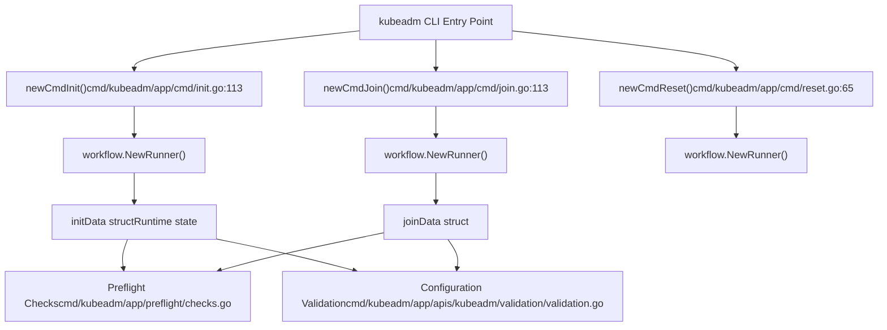
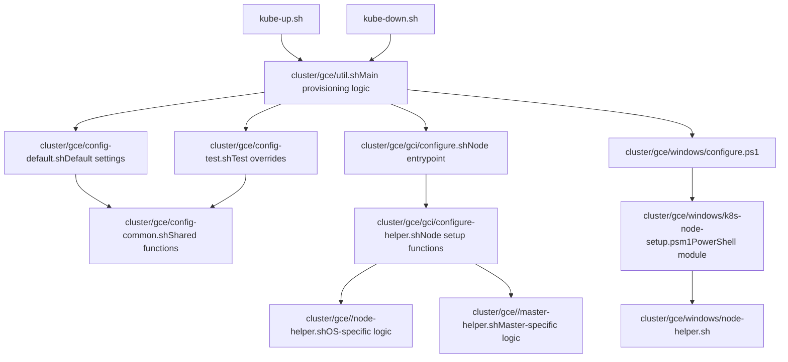
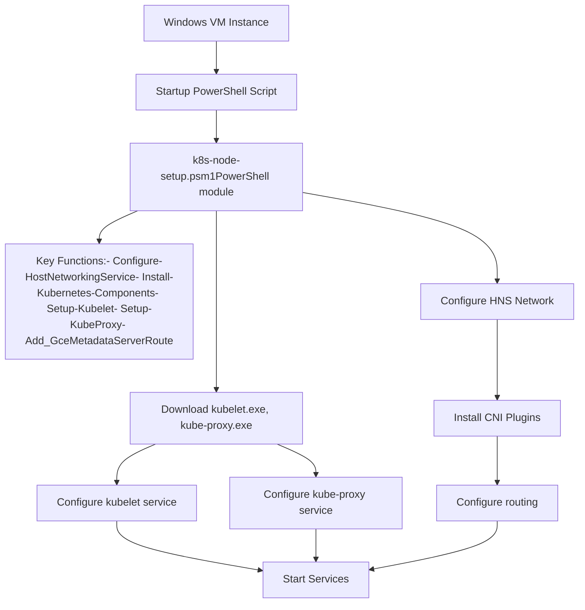

# 集群引导与管理

相关源文件

-   [build/root/Makefile](https://github.com/kubernetes/kubernetes/blob/2757a872/build/root/Makefile)
-   [cluster/common.sh](https://github.com/kubernetes/kubernetes/blob/2757a872/cluster/common.sh)
-   [cluster/gce/config-common.sh](https://github.com/kubernetes/kubernetes/blob/2757a872/cluster/gce/config-common.sh)
-   [cluster/gce/config-default.sh](https://github.com/kubernetes/kubernetes/blob/2757a872/cluster/gce/config-default.sh)
-   [cluster/gce/config-test.sh](https://github.com/kubernetes/kubernetes/blob/2757a872/cluster/gce/config-test.sh)
-   [cluster/gce/gci/configure-helper.sh](https://github.com/kubernetes/kubernetes/blob/2757a872/cluster/gce/gci/configure-helper.sh)
-   [cluster/gce/gci/configure.sh](https://github.com/kubernetes/kubernetes/blob/2757a872/cluster/gce/gci/configure.sh)
-   [cluster/gce/util.sh](https://github.com/kubernetes/kubernetes/blob/2757a872/cluster/gce/util.sh)
-   [cluster/gce/windows/README-GCE-Windows-kube-up.md](https://github.com/kubernetes/kubernetes/blob/2757a872/cluster/gce/windows/README-GCE-Windows-kube-up.md?plain=1)
-   [cluster/gce/windows/common.psm1](https://github.com/kubernetes/kubernetes/blob/2757a872/cluster/gce/windows/common.psm1)
-   [cluster/gce/windows/configure.ps1](https://github.com/kubernetes/kubernetes/blob/2757a872/cluster/gce/windows/configure.ps1)
-   [cluster/gce/windows/k8s-node-setup.psm1](https://github.com/kubernetes/kubernetes/blob/2757a872/cluster/gce/windows/k8s-node-setup.psm1)
-   [cluster/gce/windows/node-helper.sh](https://github.com/kubernetes/kubernetes/blob/2757a872/cluster/gce/windows/node-helper.sh)
-   [cluster/gce/windows/smoke-test.sh](https://github.com/kubernetes/kubernetes/blob/2757a872/cluster/gce/windows/smoke-test.sh)
-   [cluster/gce/windows/testonly/install-ssh.psm1](https://github.com/kubernetes/kubernetes/blob/2757a872/cluster/gce/windows/testonly/install-ssh.psm1)
-   [cluster/gce/windows/testonly/user-profile.psm1](https://github.com/kubernetes/kubernetes/blob/2757a872/cluster/gce/windows/testonly/user-profile.psm1)
-   [cmd/kubeadm/app/apis/kubeadm/fuzzer/fuzzer.go](https://github.com/kubernetes/kubernetes/blob/2757a872/cmd/kubeadm/app/apis/kubeadm/fuzzer/fuzzer.go)
-   [cmd/kubeadm/app/apis/kubeadm/timeoututils.go](https://github.com/kubernetes/kubernetes/blob/2757a872/cmd/kubeadm/app/apis/kubeadm/timeoututils.go)
-   [cmd/kubeadm/app/apis/kubeadm/types.go](https://github.com/kubernetes/kubernetes/blob/2757a872/cmd/kubeadm/app/apis/kubeadm/types.go)
-   [cmd/kubeadm/app/apis/kubeadm/v1beta3/conversion.go](https://github.com/kubernetes/kubernetes/blob/2757a872/cmd/kubeadm/app/apis/kubeadm/v1beta3/conversion.go)
-   [cmd/kubeadm/app/apis/kubeadm/v1beta3/zz\_generated.conversion.go](https://github.com/kubernetes/kubernetes/blob/2757a872/cmd/kubeadm/app/apis/kubeadm/v1beta3/zz_generated.conversion.go)
-   [cmd/kubeadm/app/apis/kubeadm/v1beta4/conversion.go](https://github.com/kubernetes/kubernetes/blob/2757a872/cmd/kubeadm/app/apis/kubeadm/v1beta4/conversion.go)
-   [cmd/kubeadm/app/apis/kubeadm/v1beta4/defaults.go](https://github.com/kubernetes/kubernetes/blob/2757a872/cmd/kubeadm/app/apis/kubeadm/v1beta4/defaults.go)
-   [cmd/kubeadm/app/apis/kubeadm/v1beta4/doc.go](https://github.com/kubernetes/kubernetes/blob/2757a872/cmd/kubeadm/app/apis/kubeadm/v1beta4/doc.go)
-   [cmd/kubeadm/app/apis/kubeadm/v1beta4/types.go](https://github.com/kubernetes/kubernetes/blob/2757a872/cmd/kubeadm/app/apis/kubeadm/v1beta4/types.go)
-   [cmd/kubeadm/app/apis/kubeadm/v1beta4/zz\_generated.conversion.go](https://github.com/kubernetes/kubernetes/blob/2757a872/cmd/kubeadm/app/apis/kubeadm/v1beta4/zz_generated.conversion.go)
-   [cmd/kubeadm/app/apis/kubeadm/v1beta4/zz\_generated.deepcopy.go](https://github.com/kubernetes/kubernetes/blob/2757a872/cmd/kubeadm/app/apis/kubeadm/v1beta4/zz_generated.deepcopy.go)
-   [cmd/kubeadm/app/apis/kubeadm/v1beta4/zz\_generated.defaults.go](https://github.com/kubernetes/kubernetes/blob/2757a872/cmd/kubeadm/app/apis/kubeadm/v1beta4/zz_generated.defaults.go)
-   [cmd/kubeadm/app/apis/kubeadm/validation/validation.go](https://github.com/kubernetes/kubernetes/blob/2757a872/cmd/kubeadm/app/apis/kubeadm/validation/validation.go)
-   [cmd/kubeadm/app/apis/kubeadm/validation/validation\_test.go](https://github.com/kubernetes/kubernetes/blob/2757a872/cmd/kubeadm/app/apis/kubeadm/validation/validation_test.go)
-   [cmd/kubeadm/app/apis/kubeadm/zz\_generated.deepcopy.go](https://github.com/kubernetes/kubernetes/blob/2757a872/cmd/kubeadm/app/apis/kubeadm/zz_generated.deepcopy.go)
-   [cmd/kubeadm/app/cmd/config.go](https://github.com/kubernetes/kubernetes/blob/2757a872/cmd/kubeadm/app/cmd/config.go)
-   [cmd/kubeadm/app/cmd/config\_test.go](https://github.com/kubernetes/kubernetes/blob/2757a872/cmd/kubeadm/app/cmd/config_test.go)
-   [cmd/kubeadm/app/cmd/init.go](https://github.com/kubernetes/kubernetes/blob/2757a872/cmd/kubeadm/app/cmd/init.go)
-   [cmd/kubeadm/app/cmd/init\_test.go](https://github.com/kubernetes/kubernetes/blob/2757a872/cmd/kubeadm/app/cmd/init_test.go)
-   [cmd/kubeadm/app/cmd/join.go](https://github.com/kubernetes/kubernetes/blob/2757a872/cmd/kubeadm/app/cmd/join.go)
-   [cmd/kubeadm/app/cmd/join\_test.go](https://github.com/kubernetes/kubernetes/blob/2757a872/cmd/kubeadm/app/cmd/join_test.go)
-   [cmd/kubeadm/app/cmd/reset.go](https://github.com/kubernetes/kubernetes/blob/2757a872/cmd/kubeadm/app/cmd/reset.go)
-   [cmd/kubeadm/app/cmd/reset\_test.go](https://github.com/kubernetes/kubernetes/blob/2757a872/cmd/kubeadm/app/cmd/reset_test.go)
-   [cmd/kubeadm/app/cmd/token.go](https://github.com/kubernetes/kubernetes/blob/2757a872/cmd/kubeadm/app/cmd/token.go)
-   [cmd/kubeadm/app/cmd/token\_test.go](https://github.com/kubernetes/kubernetes/blob/2757a872/cmd/kubeadm/app/cmd/token_test.go)
-   [cmd/kubeadm/app/cmd/util/cmdutil.go](https://github.com/kubernetes/kubernetes/blob/2757a872/cmd/kubeadm/app/cmd/util/cmdutil.go)
-   [cmd/kubeadm/app/preflight/checks.go](https://github.com/kubernetes/kubernetes/blob/2757a872/cmd/kubeadm/app/preflight/checks.go)
-   [cmd/kubeadm/app/preflight/checks\_test.go](https://github.com/kubernetes/kubernetes/blob/2757a872/cmd/kubeadm/app/preflight/checks_test.go)
-   [cmd/kubeadm/app/util/config/common.go](https://github.com/kubernetes/kubernetes/blob/2757a872/cmd/kubeadm/app/util/config/common.go)
-   [cmd/kubeadm/app/util/config/common\_test.go](https://github.com/kubernetes/kubernetes/blob/2757a872/cmd/kubeadm/app/util/config/common_test.go)
-   [cmd/kubeadm/app/util/config/initconfiguration.go](https://github.com/kubernetes/kubernetes/blob/2757a872/cmd/kubeadm/app/util/config/initconfiguration.go)
-   [cmd/kubeadm/app/util/config/initconfiguration\_test.go](https://github.com/kubernetes/kubernetes/blob/2757a872/cmd/kubeadm/app/util/config/initconfiguration_test.go)
-   [cmd/kubeadm/app/util/config/joinconfiguration.go](https://github.com/kubernetes/kubernetes/blob/2757a872/cmd/kubeadm/app/util/config/joinconfiguration.go)
-   [cmd/kubeadm/app/util/config/joinconfiguration\_test.go](https://github.com/kubernetes/kubernetes/blob/2757a872/cmd/kubeadm/app/util/config/joinconfiguration_test.go)
-   [cmd/kubeadm/app/util/config/resetconfiguration.go](https://github.com/kubernetes/kubernetes/blob/2757a872/cmd/kubeadm/app/util/config/resetconfiguration.go)
-   [cmd/kubeadm/app/util/config/resetconfiguration\_test.go](https://github.com/kubernetes/kubernetes/blob/2757a872/cmd/kubeadm/app/util/config/resetconfiguration_test.go)
-   [cmd/kubeadm/app/util/config/upgradeconfiguration.go](https://github.com/kubernetes/kubernetes/blob/2757a872/cmd/kubeadm/app/util/config/upgradeconfiguration.go)
-   [cmd/kubeadm/app/util/config/upgradeconfiguration\_test.go](https://github.com/kubernetes/kubernetes/blob/2757a872/cmd/kubeadm/app/util/config/upgradeconfiguration_test.go)
-   [hack/ginkgo-e2e.sh](https://github.com/kubernetes/kubernetes/blob/2757a872/hack/ginkgo-e2e.sh)
-   [hack/lib/init.sh](https://github.com/kubernetes/kubernetes/blob/2757a872/hack/lib/init.sh)
-   [hack/local-up-cluster.sh](https://github.com/kubernetes/kubernetes/blob/2757a872/hack/local-up-cluster.sh)
-   [hack/make-rules/test-e2e-node.sh](https://github.com/kubernetes/kubernetes/blob/2757a872/hack/make-rules/test-e2e-node.sh)
-   [test/e2e/chaosmonkey/chaosmonkey.go](https://github.com/kubernetes/kubernetes/blob/2757a872/test/e2e/chaosmonkey/chaosmonkey.go)
-   [test/e2e/e2e.go](https://github.com/kubernetes/kubernetes/blob/2757a872/test/e2e/e2e.go)
-   [test/e2e/e2e\_test.go](https://github.com/kubernetes/kubernetes/blob/2757a872/test/e2e/e2e_test.go)
-   [test/e2e/framework/framework.go](https://github.com/kubernetes/kubernetes/blob/2757a872/test/e2e/framework/framework.go)
-   [test/e2e/framework/kubelet/kubelet\_pods.go](https://github.com/kubernetes/kubernetes/blob/2757a872/test/e2e/framework/kubelet/kubelet_pods.go)
-   [test/e2e/framework/kubelet/stats.go](https://github.com/kubernetes/kubernetes/blob/2757a872/test/e2e/framework/kubelet/stats.go)
-   [test/e2e/framework/test\_context.go](https://github.com/kubernetes/kubernetes/blob/2757a872/test/e2e/framework/test_context.go)
-   [test/e2e/framework/util.go](https://github.com/kubernetes/kubernetes/blob/2757a872/test/e2e/framework/util.go)
-   [test/e2e/reporters/progress.go](https://github.com/kubernetes/kubernetes/blob/2757a872/test/e2e/reporters/progress.go)
-   [test/e2e/scheduling/framework.go](https://github.com/kubernetes/kubernetes/blob/2757a872/test/e2e/scheduling/framework.go)
-   [test/e2e/scheduling/limit\_range.go](https://github.com/kubernetes/kubernetes/blob/2757a872/test/e2e/scheduling/limit_range.go)
-   [test/e2e/scheduling/predicates.go](https://github.com/kubernetes/kubernetes/blob/2757a872/test/e2e/scheduling/predicates.go)
-   [test/e2e/scheduling/preemption.go](https://github.com/kubernetes/kubernetes/blob/2757a872/test/e2e/scheduling/preemption.go)
-   [test/e2e/scheduling/priorities.go](https://github.com/kubernetes/kubernetes/blob/2757a872/test/e2e/scheduling/priorities.go)
-   [test/e2e/scheduling/ubernetes\_lite.go](https://github.com/kubernetes/kubernetes/blob/2757a872/test/e2e/scheduling/ubernetes_lite.go)
-   [test/e2e/suites.go](https://github.com/kubernetes/kubernetes/blob/2757a872/test/e2e/suites.go)
-   [test/e2e\_kubeadm/e2e\_kubeadm\_suite\_test.go](https://github.com/kubernetes/kubernetes/blob/2757a872/test/e2e_kubeadm/e2e_kubeadm_suite_test.go)
-   [test/e2e\_node/builder/build.go](https://github.com/kubernetes/kubernetes/blob/2757a872/test/e2e_node/builder/build.go)
-   [test/e2e\_node/conformance/run\_test.sh](https://github.com/kubernetes/kubernetes/blob/2757a872/test/e2e_node/conformance/run_test.sh)
-   [test/e2e\_node/e2e\_node\_suite\_test.go](https://github.com/kubernetes/kubernetes/blob/2757a872/test/e2e_node/e2e_node_suite_test.go)
-   [test/e2e\_node/kubeletconfig/kubeletconfig.go](https://github.com/kubernetes/kubernetes/blob/2757a872/test/e2e_node/kubeletconfig/kubeletconfig.go)
-   [test/e2e\_node/remote/cadvisor\_e2e.go](https://github.com/kubernetes/kubernetes/blob/2757a872/test/e2e_node/remote/cadvisor_e2e.go)
-   [test/e2e\_node/remote/node\_conformance.go](https://github.com/kubernetes/kubernetes/blob/2757a872/test/e2e_node/remote/node_conformance.go)
-   [test/e2e\_node/remote/node\_e2e.go](https://github.com/kubernetes/kubernetes/blob/2757a872/test/e2e_node/remote/node_e2e.go)
-   [test/e2e\_node/remote/remote.go](https://github.com/kubernetes/kubernetes/blob/2757a872/test/e2e_node/remote/remote.go)
-   [test/e2e\_node/remote/types.go](https://github.com/kubernetes/kubernetes/blob/2757a872/test/e2e_node/remote/types.go)
-   [test/e2e\_node/remote/utils.go](https://github.com/kubernetes/kubernetes/blob/2757a872/test/e2e_node/remote/utils.go)
-   [test/e2e\_node/runner/local/run\_local.go](https://github.com/kubernetes/kubernetes/blob/2757a872/test/e2e_node/runner/local/run_local.go)
-   [test/e2e\_node/runner/remote/run\_remote.go](https://github.com/kubernetes/kubernetes/blob/2757a872/test/e2e_node/runner/remote/run_remote.go)
-   [test/e2e\_node/services/kubelet.go](https://github.com/kubernetes/kubernetes/blob/2757a872/test/e2e_node/services/kubelet.go)
-   [test/e2e\_node/services/server.go](https://github.com/kubernetes/kubernetes/blob/2757a872/test/e2e_node/services/server.go)
-   [test/e2e\_node/services/services.go](https://github.com/kubernetes/kubernetes/blob/2757a872/test/e2e_node/services/services.go)
-   [test/e2e\_node/services/util.go](https://github.com/kubernetes/kubernetes/blob/2757a872/test/e2e_node/services/util.go)
-   [test/utils/paths.go](https://github.com/kubernetes/kubernetes/blob/2757a872/test/utils/paths.go)

## 目的与范围

本文档涵盖 Kubernetes 集群引导及其初始设置管理所使用的工具和流程。内容包含三种主要方式：用于生产集群初始化的 **kubeadm**、用于 Google Cloud 部署的 **GCE 配置脚本**，以及用于测试和开发的**本地开发环境**。

关于引导完成后持续进行的集群运维，请参见控制平面组件文档 [3](https://github.com/kubernetes/kubernetes/blob/2757a872/3)。关于用于验证集群的测试基础设施，请参见 [6](https://github.com/kubernetes/kubernetes/blob/2757a872/6)。

**此处记录的关键子系统：**

-   `kubeadm` CLI 命令与工作流阶段
-   GCE/GKE 集群配置自动化
-   本地开发集群搭建脚本
-   PKI 证书生成与分发
-   节点配置与注册

---

## 引导方式概览

Kubernetes 集群可根据部署目标通过不同机制完成引导：

| 方式 | 主要使用场景 | 入口点 | 配置方式 |
| --- | --- | --- | --- |
| **kubeadm** | 生产集群、手动搭建 | `kubeadm init/join` CLI | YAML 配置文件 + flags |
| **GCE Scripts** | Google Cloud 部署 | `cluster/gce/util.sh` functions | Shell 环境变量 |
| **Local Cluster** | 开发/测试 | `hack/local-up-cluster.sh` | Shell 环境变量 |

所有方式都共享以下目标：

1.  生成并分发 PKI 证书
2.  启动控制平面组件（etcd、kube-apiserver、controller-manager、scheduler）
3.  在节点上配置并启动 kubelet
4.  配置网络（CNI、kube-proxy）
5.  应用初始集群配置

**来源：** [cluster/gce/util.sh1-600](https://github.com/kubernetes/kubernetes/blob/2757a872/cluster/gce/util.sh#L1-L600) [hack/local-up-cluster.sh1-200](https://github.com/kubernetes/kubernetes/blob/2757a872/hack/local-up-cluster.sh#L1-L200) [cmd/kubeadm/app/cmd/init.go1-100](https://github.com/kubernetes/kubernetes/blob/2757a872/cmd/kubeadm/app/cmd/init.go#L1-L100)

---

## kubeadm 架构

### 命令结构


**kubeadm Init 阶段执行顺序：**

> **[Mermaid sequence]**
> *(图表结构无法解析)*

**来源：** [cmd/kubeadm/app/cmd/init.go113-200](https://github.com/kubernetes/kubernetes/blob/2757a872/cmd/kubeadm/app/cmd/init.go#L113-L200) [cmd/kubeadm/app/cmd/phases/init](https://github.com/kubernetes/kubernetes/blob/2757a872/cmd/kubeadm/app/cmd/phases/init)

---

### initData 与配置

`initData` 结构体在整个 init 工作流中维护运行时状态：

**关键字段：**

-   `cfg *kubeadmapi.InitConfiguration` - 已解析并验证的集群配置
-   `client clientset.Interface` - Kubernetes API 客户端
-   `certificatesDir string` - PKI 材料存放位置（默认：`/etc/kubernetes/pki`）
-   `kubeconfigDir string` - kubeconfig 文件存放位置（默认：`/etc/kubernetes`）
-   `dryRun bool` - 为 true 时，仅打印操作而不执行
-   `ignorePreflightErrors sets.Set[string]` - 要跳过的预检项
-   `uploadCerts bool` - 是否将控制平面证书上传到集群

**配置来源：**

1.  使用 `--config` flag 指定的 YAML 文件
2.  命令行 flags（例如 `--apiserver-advertise-address`）
3.  自动检测值（节点 IP、CRI socket）
4.  来自 [cmd/kubeadm/app/apis/kubeadm/types.go](https://github.com/kubernetes/kubernetes/blob/2757a872/cmd/kubeadm/app/apis/kubeadm/types.go) 的默认值

**来源：** [cmd/kubeadm/app/cmd/init.go89-108](https://github.com/kubernetes/kubernetes/blob/2757a872/cmd/kubeadm/app/cmd/init.go#L89-L108) [cmd/kubeadm/app/apis/kubeadm/types.go1-200](https://github.com/kubernetes/kubernetes/blob/2757a872/cmd/kubeadm/app/apis/kubeadm/types.go#L1-L200)

---

### 预检检查

预检验证可确保系统在引导前满足要求：

```mermaid
flowchart TD
    SysCheck["System Checks"]
    NetCheck["Network Checks"]
    RTCheck["Container Runtime Checks"]
    PortCheck["Port Availability Checks"]
    FileCheck["File/Directory Checks"]
    IsPriv["IsPrivilegedUser"]
    NumCPU["NumCPU (min 2)"]
    Mem["Mem (min 1700MB)"]
    Kernel["KernelVersion"]
    Hostname["Hostname"]
    Swap["Swap (should be off)"]
    IPForward["IPv4/IPv6 Forwarding"]
    BridgeNF["Bridge Netfilter"]
    CRICheck["ContainerRuntimeCheckchecks.go:88"]
    CRIVersion["ContainerRuntimeVersionCheckchecks.go:119"]
    CRISocket["Socket connectivity"]
    Port6443["API Server :6443"]
    Port10259["Scheduler :10259"]
    Port10257["Controller Manager :10257"]
    Port2379["etcd :2379-2380"]
    Port10250["kubelet :10250"]
    KubeConfig["FileExisting /etc/kubernetes/manifests"]
    PKIDir["DirAvailable /etc/kubernetes/pki"]
    EtcdDir["DirAvailable /var/lib/etcd"]

    SysCheck --> IsPriv
    SysCheck --> NumCPU
    SysCheck --> Mem
    SysCheck --> Kernel
    SysCheck --> Hostname
    SysCheck --> Swap
    NetCheck --> IPForward
    NetCheck --> BridgeNF
    RTCheck --> CRICheck
    RTCheck --> CRIVersion
    RTCheck --> CRISocket
    PortCheck --> Port6443
    PortCheck --> Port10259
    PortCheck --> Port10257
    PortCheck --> Port2379
    PortCheck --> Port10250
    FileCheck --> KubeConfig
    FileCheck --> PKIDir
    FileCheck --> EtcdDir
```


**检查实现：**

每个检查都实现 `Checker` 接口：

```
type Checker interface {    Check() (warnings, errorList []error)    Name() string}
```
**错误处理：**

-   除非通过 `--ignore-preflight-errors` 忽略，否则错误会导致 init 失败
-   警告会显示，但不会阻止执行
-   特殊值 `--ignore-preflight-errors=all` 可绕过所有检查

**来源：** [cmd/kubeadm/app/preflight/checks.go69-220](https://github.com/kubernetes/kubernetes/blob/2757a872/cmd/kubeadm/app/preflight/checks.go#L69-L220) [cmd/kubeadm/app/preflight/checks.go88-103](https://github.com/kubernetes/kubernetes/blob/2757a872/cmd/kubeadm/app/preflight/checks.go#L88-L103)

---

### Join 工作流

节点加入过程涉及发现、TLS 引导和配置：

> **[Mermaid sequence]**
> *(图表结构无法解析)*

**发现方法：**

| 方法 | 安全性 | 使用场景 |
| --- | --- | --- |
| **Token + CA Hash** | Token 校验集群身份，hash 校验 CA 证书 | 默认，自动化加入 |
| **Token + --discovery-token-unsafe-skip-ca-verification** | 仅 Token（易受 MITM 攻击） | 仅测试 |
| **File** | 内嵌 CA 的 kubeconfig | 预配置节点 |
| **HTTPS URL** | 通过 TLS 下载 kubeconfig | 自动化配置 |

**来源：** [cmd/kubeadm/app/cmd/join.go1-400](https://github.com/kubernetes/kubernetes/blob/2757a872/cmd/kubeadm/app/cmd/join.go#L1-L400) [cmd/kubeadm/app/discovery/token](https://github.com/kubernetes/kubernetes/blob/2757a872/cmd/kubeadm/app/discovery/token)

---

## GCE 集群配置

### 配置架构

GCE 集群搭建使用 shell 脚本来编排虚拟机创建、配置和集群初始化：


**来源：** [cluster/gce/util.sh1-100](https://github.com/kubernetes/kubernetes/blob/2757a872/cluster/gce/util.sh#L1-L100) [cluster/gce/gci/configure.sh1-50](https://github.com/kubernetes/kubernetes/blob/2757a872/cluster/gce/gci/configure.sh#L1-L50) [cluster/gce/gci/configure-helper.sh1-50](https://github.com/kubernetes/kubernetes/blob/2757a872/cluster/gce/gci/configure-helper.sh#L1-L50)

---

### 配置变量

GCE 配置通过在配置文件中设置环境变量进行控制：

**核心变量：**

| 变量 | 默认值 | 用途 |
| --- | --- | --- |
| `PROJECT` | 从 gcloud 自动检测 | GCP 项目 ID |
| `ZONE` | `us-central1-b` | 资源所在 GCP 可用区 |
| `CLUSTER_NAME` | `${INSTANCE_PREFIX}` | 集群标识符 |
| `NUM_NODES` | 3 | 工作节点数量 |
| `MASTER_SIZE` | `e2-standard-$(get-master-size)` | 主节点虚拟机机型 |
| `NODE_SIZE` | `e2-standard-2` | 节点虚拟机机型 |
| `MASTER_DISK_SIZE` | 自动计算 | 主节点持久盘大小 |
| `NODE_DISK_SIZE` | `100GB` | 节点持久盘大小 |
| `NETWORK` | `default` | VPC 网络名称 |
| `KUBE_VERSION` | Latest | 要部署的 Kubernetes 版本 |
| `MASTER_OS_DISTRIBUTION` | `gci` | 主节点操作系统（gci/ubuntu） |
| `NODE_OS_DISTRIBUTION` | `gci` | 节点操作系统（gci/ubuntu） |
| `CONTAINER_RUNTIME_ENDPOINT` | `unix:///run/containerd/containerd.sock` | CRI socket 路径 |

**高级变量：**

| 变量 | 用途 |
| --- | --- |
| `ENABLE_CLUSTER_DNS` | 启用 CoreDNS（默认：true） |
| `ENABLE_NODE_LOGGING` | 启用节点日志采集（默认：true） |
| `ENABLE_CLUSTER_LOGGING` | 启用集中式日志（默认：true） |
| `ENABLE_METADATA_CONCEALMENT` | 对元数据服务器访问设置防火墙（默认：视配置而定） |
| `ENABLE_NETD` | 部署 netd DaemonSet 用于网络 |
| `NETWORK_POLICY_PROVIDER` | 网络策略实现（calico/none） |
| `NODE_ACCELERATORS` | GPU 配置字符串 |
| `NODE_LOCAL_SSDS` | 要挂载的本地 SSD 数量 |
| `PREEMPTIBLE_NODE` | 使用可抢占 VM 以节约成本 |

**来源：** [cluster/gce/config-default.sh1-300](https://github.com/kubernetes/kubernetes/blob/2757a872/cluster/gce/config-default.sh#L1-L300) [cluster/gce/config-test.sh1-300](https://github.com/kubernetes/kubernetes/blob/2757a872/cluster/gce/config-test.sh#L1-L300)

---

### 配置流程

**主节点创建与初始化：**

> **[Mermaid sequence]**
> *(图表结构无法解析)*

**工作节点创建：**

> **[Mermaid sequence]**
> *(图表结构无法解析)*

**来源：** [cluster/gce/util.sh500-800](https://github.com/kubernetes/kubernetes/blob/2757a872/cluster/gce/util.sh#L500-L800) [cluster/gce/gci/configure-helper.sh1-1000](https://github.com/kubernetes/kubernetes/blob/2757a872/cluster/gce/gci/configure-helper.sh#L1-L1000)

---

### 二进制与镜像分发

GCE 配置通过 Google Cloud Storage 分发 Kubernetes 二进制文件和容器镜像：

**二进制分发过程：**

1.  **本地构建或版本选择：**

    -   `tars_from_version()` 决定二进制来源 [cluster/gce/util.sh512-547](https://github.com/kubernetes/kubernetes/blob/2757a872/cluster/gce/util.sh#L512-L547)
    -   若未设置 `KUBE_VERSION`：通过 `find-release-tars()` 本地构建
    -   若版本匹配 release 正则：从 `dl.k8s.io` 下载
    -   若版本匹配 CI 正则：从 `k8s-release-dev` bucket 下载
2.  **上传到 GCS：**

    -   `upload-tars()` 将二进制发布到区域 GCS bucket [cluster/gce/util.sh296-375](https://github.com/kubernetes/kubernetes/blob/2757a872/cluster/gce/util.sh#L296-L375)
    -   为每个项目创建暂存 bucket：`gs://kubernetes-staging-${project_hash}-${region}`
    -   上传 server binary tar、manifests tar，并进行 SHA512 校验
    -   生成用于区域回退的 URL CSV 列表
3.  **节点下载：**

    -   节点侧 `download-or-bust()` 通过重试拉取二进制 [cluster/gce/gci/configure.sh177-226](https://github.com/kubernetes/kubernetes/blob/2757a872/cluster/gce/gci/configure.sh#L177-L226)
    -   按优先顺序尝试区域 URL（基于 zone）
    -   对私有 bucket 使用服务账号凭据
    -   解压前校验 SHA512 哈希

**镜像分发：**

容器镜像来源为：

-   预拉取到基础 VM 镜像（GCI/COS）
-   由 containerd 按需从公共镜像仓库拉取
-   通过 VM 服务账号从私有 GCR 拉取

**来源：** [cluster/gce/util.sh296-547](https://github.com/kubernetes/kubernetes/blob/2757a872/cluster/gce/util.sh#L296-L547) [cluster/gce/gci/configure.sh177-226](https://github.com/kubernetes/kubernetes/blob/2757a872/cluster/gce/gci/configure.sh#L177-L226)

---

### GCE 上的 PKI 设置

GCE 配置在生成与分发 PKI 材料时采用与 kubeadm 不同的方式：

**证书生成（主节点）：**

主节点在 `create-master-pki()` 中生成证书 [cluster/gce/gci/configure-helper.sh704-814](https://github.com/kubernetes/kubernetes/blob/2757a872/cluster/gce/gci/configure-helper.sh#L704-L814)：

```
/etc/srv/kubernetes/pki/
├── ca.crt                          # Cluster CA certificate
├── ca.key                          # Cluster CA private key
├── apiserver.crt                   # API server serving cert
├── apiserver.key                   # API server serving key
├── apiserver-client.crt            # API server client cert (for extensions)
├── apiserver-client.key
├── serviceaccount.crt              # Service account signing cert
├── serviceaccount.key              # Service account signing key
├── aggr_ca.crt                     # Aggregation layer CA (if enabled)
├── proxy_client.crt                # Aggregation layer proxy client
├── proxy_client.key
├── konnectivity-server/            # Konnectivity (if enabled)
│   ├── ca.crt
│   ├── server.crt
│   └── server.key
└── konnectivity-agent/
    ├── ca.crt
    ├── client.crt
    └── client.key
```
**证书分发（节点）：**

节点通过 GCE 元数据接收证书 [cluster/gce/gci/configure-helper.sh672-702](https://github.com/kubernetes/kubernetes/blob/2757a872/cluster/gce/gci/configure-helper.sh#L672-L702)：

```
/etc/srv/kubernetes/pki/
├── ca-certificates.crt              # CA bundle for validating API server
├── kubelet.crt                      # Kubelet client cert (if static certs used)
├── kubelet.key
└── konnectivity-agent/              # Konnectivity agent certs (if enabled)
    ├── ca.crt
    ├── client.crt
    └── client.key
```
**证书元数据编码：**

证书会进行 base64 编码，并通过 GCE 实例元数据属性传递：

-   主节点：`kube-master-certs` 元数据属性
-   节点：`kube-env` 元数据属性包含 `CA_CERT_BUNDLE`、`KUBELET_CERT`、`KUBELET_KEY`

**来源：** [cluster/gce/gci/configure-helper.sh658-814](https://github.com/kubernetes/kubernetes/blob/2757a872/cluster/gce/gci/configure-helper.sh#L658-L814) [cluster/gce/gci/configure-helper.sh704-814](https://github.com/kubernetes/kubernetes/blob/2757a872/cluster/gce/gci/configure-helper.sh#L704-L814)

---

### Windows 节点引导

由于平台差异，Windows 节点采用不同的配置路径：


**与 Linux 的关键差异：**

| 方面 | Linux | Windows |
| --- | --- | --- |
| **Container Runtime** | containerd via CRI | containerd via CRI (Windows mode) |
| **Networking** | CNI plugins + iptables/IPVS | HNS (Host Networking Service) + Windows CNI |
| **Service Management** | systemd | Windows Service Manager |
| **Configuration Script** | Bash (configure-helper.sh) | PowerShell (k8s-node-setup.psm1) |
| **Kubelet Process Isolation** | Host OS | Windows Server container |

**Windows 专用函数：**

-   `Configure-HostNetworkingService()` - 设置 HNS overlay 网络 [cluster/gce/windows/k8s-node-setup.psm1200-400](https://github.com/kubernetes/kubernetes/blob/2757a872/cluster/gce/windows/k8s-node-setup.psm1#L200-L400)
-   `Add_GceMetadataServerRoute()` - 确保所有接口都存在元数据服务器路由 [cluster/gce/windows/k8s-node-setup.psm1120-140](https://github.com/kubernetes/kubernetes/blob/2757a872/cluster/gce/windows/k8s-node-setup.psm1#L120-L140)
-   `Install-Kubernetes-Components()` - 下载并安装 Windows 二进制 [cluster/gce/windows/k8s-node-setup.psm1400-600](https://github.com/kubernetes/kubernetes/blob/2757a872/cluster/gce/windows/k8s-node-setup.psm1#L400-L600)
-   `Setup-Kubelet()` - 配置并启动 kubelet Windows 服务 [cluster/gce/windows/k8s-node-setup.psm1600-800](https://github.com/kubernetes/kubernetes/blob/2757a872/cluster/gce/windows/k8s-node-setup.psm1#L600-L800)

**来源：** [cluster/gce/windows/k8s-node-setup.psm11-200](https://github.com/kubernetes/kubernetes/blob/2757a872/cluster/gce/windows/k8s-node-setup.psm1#L1-L200) [cluster/gce/windows/node-helper.sh1-100](https://github.com/kubernetes/kubernetes/blob/2757a872/cluster/gce/windows/node-helper.sh#L1-L100)

---

## 本地开发集群

### local-up-cluster.sh 概览

`hack/local-up-cluster.sh` 脚本用于创建单节点 Kubernetes 集群，适用于开发与测试：

**特性：**

-   将控制平面组件作为宿主机进程运行（而非容器）
-   使用本地 etcd 实例
-   单节点同时充当主节点和工作节点
-   便于开发过程中的快速迭代
-   不依赖云厂商

**执行模式（START\_MODE）：**

| 模式 | 启动组件 |
| --- | --- |
| `all` | etcd、API server、controller-manager、scheduler、kubelet、kube-proxy |
| `kubeletonly` | 仅 kubelet（假设控制平面已运行） |
| `nokubelet` | 仅控制平面（无节点组件） |
| `nokubeproxy` | 除 kube-proxy 外全部 |
| `nokubelet,nokubeproxy` | 仅控制平面 |

**来源：** [hack/local-up-cluster.sh1-200](https://github.com/kubernetes/kubernetes/blob/2757a872/hack/local-up-cluster.sh#L1-L200)

---

### 本地集群启动顺序

> **[Mermaid sequence]**
> *(图表结构无法解析)*

**来源：** [hack/local-up-cluster.sh434-800](https://github.com/kubernetes/kubernetes/blob/2757a872/hack/local-up-cluster.sh#L434-L800)

---

### 组件配置

**API Server 配置：**

在 `start_apiserver()` 中设置的关键 flags [hack/local-up-cluster.sh594-700](https://github.com/kubernetes/kubernetes/blob/2757a872/hack/local-up-cluster.sh#L594-L700)：

```
--authorization-mode=${AUTHORIZATION_MODE:-Node,RBAC}--etcd-servers=http://127.0.0.1:2379--service-cluster-ip-range=${SERVICE_CLUSTER_IP_RANGE:-10.0.0.0/24}--client-ca-file=${CERT_DIR}/client-ca.crt--tls-cert-file=${CERT_DIR}/kube-apiserver.crt--tls-private-key-file=${CERT_DIR}/kube-apiserver.key--service-account-key-file=${SERVICE_ACCOUNT_KEY}--service-account-signing-key-file=${SERVICE_ACCOUNT_KEY}--service-account-issuer=https://kubernetes.default.svc--runtime-config=${RUNTIME_CONFIG}--feature-gates=${FEATURE_GATES}
```
**Kubelet 配置：**

在 `start_kubelet()` 中设置的关键 flags [hack/local-up-cluster.sh900-1100](https://github.com/kubernetes/kubernetes/blob/2757a872/hack/local-up-cluster.sh#L900-L1100)：

```
--container-runtime-endpoint=${CONTAINER_RUNTIME_ENDPOINT:-unix:///run/containerd/containerd.sock}--hostname-override=${HOSTNAME_OVERRIDE:-127.0.0.1}--kubeconfig=${CERT_DIR}/kubelet.kubeconfig--pod-manifest-path=${POD_MANIFEST_PATH:-/var/run/kubernetes/static-pods}--cgroup-driver=${CGROUP_DRIVER}--fail-swap-on=${FAIL_SWAP_ON:-false}--feature-gates=${FEATURE_GATES}--eviction-hard=${EVICTION_HARD}
```
**环境变量覆盖：**

| 变量 | 默认值 | 用途 |
| --- | --- | --- |
| `API_HOST_IP` | `127.0.0.1` | API server 绑定 IP |
| `API_SECURE_PORT` | `6443` | API server 安全端口 |
| `SERVICE_CLUSTER_IP_RANGE` | `10.0.0.0/24` | Service CIDR |
| `CLUSTER_CIDR` | `10.1.0.0/16` | Pod CIDR |
| `ENABLE_CLUSTER_DNS` | `true` | 部署 CoreDNS |
| `DNS_SERVER_IP` | `10.0.0.10` | DNS 服务 ClusterIP |
| `FEATURE_GATES` | `AllAlpha=false` | Feature gate 配置 |
| `LOG_LEVEL` | `3` | 全组件日志详细级别 |

**来源：** [hack/local-up-cluster.sh35-165](https://github.com/kubernetes/kubernetes/blob/2757a872/hack/local-up-cluster.sh#L35-L165) [hack/local-up-cluster.sh594-1100](https://github.com/kubernetes/kubernetes/blob/2757a872/hack/local-up-cluster.sh#L594-L1100)

---

### 清理与生命周期

**清理函数：**

`cleanup()` 函数 [hack/local-up-cluster.sh434-486](https://github.com/kubernetes/kubernetes/blob/2757a872/hack/local-up-cluster.sh#L434-L486) 负责优雅关闭：

1.  若启用集群 DNS，则采集 CoreDNS 日志
2.  终止组件进程：
    -   API server（APISERVER\_PID）
    -   Controller manager（CTLRMGR\_PID）
    -   Scheduler（SCHEDULER\_PID）
    -   kubelet（KUBELET\_PID）
    -   kube-proxy（PROXY\_PID）
    -   etcd（ETCD\_PID）
3.  清理 etcd 数据目录（除非 `PRESERVE_ETCD=true`）
4.  终止 dmesg 后台进程

**健康检查循环：**

`healthcheck()` 函数 [hack/local-up-cluster.sh490-520](https://github.com/kubernetes/kubernetes/blob/2757a872/hack/local-up-cluster.sh#L490-L520) 会周期性运行：

-   检查各组件进程是否仍存活
-   若组件异常退出则打印警告
-   日志路径指向 `${LOG_DIR}` 中的组件日志文件

**可复用启动：**

若要在多次运行之间保留集群状态：

```
PRESERVE_ETCD=true REUSE_CERTS=true ./hack/local-up-cluster.sh
```
这会避免重复生成证书并重复创建 service account secrets。

**来源：** [hack/local-up-cluster.sh434-520](https://github.com/kubernetes/kubernetes/blob/2757a872/hack/local-up-cluster.sh#L434-L520)

---

## 测试与验证

### E2E 框架集成

集群引导工具会与 E2E 测试框架集成以进行验证：

**TestContext 配置：**

[test/e2e/framework/test\_context.go99-170](https://github.com/kubernetes/kubernetes/blob/2757a872/test/e2e/framework/test_context.go#L99-L170) 定义了集群访问参数：

```
type TestContextType struct {    KubeConfig             string  // Path to kubeconfig    KubeContext            string  // Context name to use    Host                   string  // API server URL    Provider               string  // Infrastructure provider (gce, local, etc.)    KubectlPath            string  // Path to kubectl binary    ReportDir              string  // Directory for test reports    OutputDir              string  // Directory for test output        // Provider-specific config    CloudConfig            CloudConfig        // Node configuration    MasterOSDistro         string    NodeOSDistro           string    NodeOSArch             string        // Bootstrap validation    DeleteNamespace        bool    AllowedNotReadyNodes   int    MinStartupPods         int}
```
**框架初始化：**

[test/e2e/framework/framework.go140-250](https://github.com/kubernetes/kubernetes/blob/2757a872/test/e2e/framework/framework.go#L140-L250) 负责搭建测试环境：

1.  **LoadConfig()** - 从 `TestContext.KubeConfig` 加载 kubeconfig
2.  **LoadClientset()** - 创建 Kubernetes 客户端
3.  **CreateTestingNS()** - 创建隔离测试命名空间
4.  **WaitForDefaultServiceAccountInNamespace()** - 确保集群已就绪

**集群识别：**

测试会检测集群配置：

-   `ProviderIs("gce", "local")` - 检查 provider 类型
-   `NodeOSDistroIs("gci", "ubuntu")` - 检查节点操作系统
-   `GetControlPlaneNodes()` - 通过 label/taint 查找主节点

**来源：** [test/e2e/framework/test\_context.go99-170](https://github.com/kubernetes/kubernetes/blob/2757a872/test/e2e/framework/test_context.go#L99-L170) [test/e2e/framework/framework.go140-250](https://github.com/kubernetes/kubernetes/blob/2757a872/test/e2e/framework/framework.go#L140-L250) [test/e2e/framework/util.go148-176](https://github.com/kubernetes/kubernetes/blob/2757a872/test/e2e/framework/util.go#L148-L176)

---

### Node E2E 测试

远程节点测试会在真实 VM 上验证引导过程：

**远程测试执行：**

[test/e2e\_node/runner/remote/run\_remote.go](https://github.com/kubernetes/kubernetes/blob/2757a872/test/e2e_node/runner/remote/run_remote.go) 编排远程测试：

1.  **配置测试节点：**

    -   使用指定镜像创建 GCE VM
    -   配置 SSH 访问
    -   安装容器运行时
2.  **部署测试框架：**

    -   将测试二进制复制到节点
    -   搭建测试环境
    -   用测试 flags 配置 kubelet
3.  **执行测试：**

    -   运行 Node E2E 测试套件
    -   收集日志与结果
    -   验证节点行为
4.  **清理：**

    -   收集诊断数据
    -   删除测试 VM
    -   归档结果

**测试验证：**

节点测试会验证引导正确性：

-   容器运行时正常工作
-   kubelet 成功启动并注册节点
-   Pod 生命周期操作可用
-   卷挂载成功
-   网络连通性建立

**来源：** [test/e2e\_node/runner/remote/run\_remote.go1-100](https://github.com/kubernetes/kubernetes/blob/2757a872/test/e2e_node/runner/remote/run_remote.go#L1-L100)

---

## 跨领域关注点

### 证书管理

所有引导方式都必须处理 PKI 证书：

**证书类型：**

| 证书 | 用途 | 签发者 |
| --- | --- | --- |
| **ca.crt** | 集群 CA 根证书 | Self-signed |
| **apiserver.crt** | API server 服务证书 | ca.crt |
| **apiserver-kubelet-client.crt** | API server 访问 kubelet 的客户端证书 | ca.crt |
| **controller-manager.crt** | Controller manager 客户端证书 | ca.crt |
| **scheduler.crt** | Scheduler 客户端证书 | ca.crt |
| **admin.crt** | 管理员用户客户端证书 | ca.crt |
| **kubelet.crt** | kubelet 客户端证书（若为静态证书） | ca.crt |
| **front-proxy-ca.crt** | 聚合层 CA | Self-signed |
| **front-proxy-client.crt** | 聚合代理客户端证书 | front-proxy-ca.crt |
| **service-account.key** | Service account token 签名密钥 | N/A (symmetric key) |

**证书生命周期：**

-   kubeadm：默认 1 年（可通过 `kubeadm certs renew` 续期）
-   GCE：随证书类型而不同，由脚本管理
-   Local：不轮换，持久化在 `${CERT_DIR}`

**来源：** [cmd/kubeadm/app/phases/certs](https://github.com/kubernetes/kubernetes/blob/2757a872/cmd/kubeadm/app/phases/certs) [cluster/gce/gci/configure-helper.sh704-814](https://github.com/kubernetes/kubernetes/blob/2757a872/cluster/gce/gci/configure-helper.sh#L704-L814)

---

### 组件版本管理

引导系统必须协调各组件版本：

**版本兼容性：**

| 组件 | 版本偏移策略 |
| --- | --- |
| **kube-apiserver** | 参考版本（N） |
| **kube-controller-manager** | N 或 N-1 |
| **kube-scheduler** | N 或 N-1 |
| **kubelet** | N、N-1 或 N-2 |
| **kube-proxy** | N、N-1 或 N-2 |
| **kubectl** | N+1、N 或 N-1 |

**版本检测：**

-   kubeadm：在预检中验证版本兼容性
-   GCE：使用 `KUBE_VERSION` 环境变量
-   Local：使用本地构建二进制（版本来自 `git describe`）

**升级考虑：**

引导工具必须支持版本升级：

-   kubeadm：`kubeadm upgrade` 命令
-   GCE：托管实例组滚动升级
-   Local：重新构建二进制并重启组件

**来源：** [cmd/kubeadm/app/preflight/checks.go1-100](https://github.com/kubernetes/kubernetes/blob/2757a872/cmd/kubeadm/app/preflight/checks.go#L1-L100) [cluster/gce/util.sh512-547](https://github.com/kubernetes/kubernetes/blob/2757a872/cluster/gce/util.sh#L512-L547)

---

### 日志与调试

**kubeadm 日志：**

-   组件日志：控制平面容器位于 `/var/log/pods/`
-   kubelet 日志：`journalctl -u kubelet`
-   kubeadm 执行日志：init/join 期间的 stdout/stderr

**GCE 日志：**

-   启动脚本日志：串口控制台输出（`gcloud compute instances get-serial-port-output`）
-   组件日志：Stackdriver Logging（若启用）
-   节点配置日志：`/var/log/startupscript.log`、`/var/log/configure.log`

**本地集群日志：**

-   组件日志：`${LOG_DIR}`（默认 `/tmp`）下的文件
-   示例：`/tmp/kube-apiserver.log`、`/tmp/kubelet.log`
-   控制台输出：脚本会打印组件启动信息

**调试命令：**

```
# kubeadm troubleshootingkubeadm init phase --helpkubeadm init phase certs all --config=config.yaml --dry-run # GCE troubleshootinggcloud compute ssh ${MASTER_NAME} --command="sudo systemctl status kubelet"gcloud compute instances get-serial-port-output ${NODE_NAME} # Local cluster troubleshootingps aux | grep kubecurl -k https://localhost:6443/healthzkubectl --kubeconfig=/var/run/kubernetes/admin.kubeconfig get nodes
```
**来源：** [hack/local-up-cluster.sh490-520](https://github.com/kubernetes/kubernetes/blob/2757a872/hack/local-up-cluster.sh#L490-L520) [cluster/gce/gci/configure-helper.sh1-100](https://github.com/kubernetes/kubernetes/blob/2757a872/cluster/gce/gci/configure-helper.sh#L1-L100)
