# kubeadm CLI

相关源文件

-   [cmd/kubeadm/app/apis/kubeadm/fuzzer/fuzzer.go](https://github.com/kubernetes/kubernetes/blob/2757a872/cmd/kubeadm/app/apis/kubeadm/fuzzer/fuzzer.go)
-   [cmd/kubeadm/app/apis/kubeadm/timeoututils.go](https://github.com/kubernetes/kubernetes/blob/2757a872/cmd/kubeadm/app/apis/kubeadm/timeoututils.go)
-   [cmd/kubeadm/app/apis/kubeadm/types.go](https://github.com/kubernetes/kubernetes/blob/2757a872/cmd/kubeadm/app/apis/kubeadm/types.go)
-   [cmd/kubeadm/app/apis/kubeadm/v1beta3/conversion.go](https://github.com/kubernetes/kubernetes/blob/2757a872/cmd/kubeadm/app/apis/kubeadm/v1beta3/conversion.go)
-   [cmd/kubeadm/app/apis/kubeadm/v1beta3/zz\_generated.conversion.go](https://github.com/kubernetes/kubernetes/blob/2757a872/cmd/kubeadm/app/apis/kubeadm/v1beta3/zz_generated.conversion.go)
-   [cmd/kubeadm/app/apis/kubeadm/v1beta4/conversion.go](https://github.com/kubernetes/kubernetes/blob/2757a872/cmd/kubeadm/app/apis/kubeadm/v1beta4/conversion.go)
-   [cmd/kubeadm/app/apis/kubeadm/v1beta4/defaults.go](https://github.com/kubernetes/kubernetes/blob/2757a872/cmd/kubeadm/app/apis/kubeadm/v1beta4/defaults.go)
-   [cmd/kubeadm/app/apis/kubeadm/v1beta4/doc.go](https://github.com/kubernetes/kubernetes/blob/2757a872/cmd/kubeadm/app/apis/kubeadm/v1beta4/doc.go)
-   [cmd/kubeadm/app/apis/kubeadm/v1beta4/types.go](https://github.com/kubernetes/kubernetes/blob/2757a872/cmd/kubeadm/app/apis/kubeadm/v1beta4/types.go)
-   [cmd/kubeadm/app/apis/kubeadm/v1beta4/zz\_generated.conversion.go](https://github.com/kubernetes/kubernetes/blob/2757a872/cmd/kubeadm/app/apis/kubeadm/v1beta4/zz_generated.conversion.go)
-   [cmd/kubeadm/app/apis/kubeadm/v1beta4/zz\_generated.deepcopy.go](https://github.com/kubernetes/kubernetes/blob/2757a872/cmd/kubeadm/app/apis/kubeadm/v1beta4/zz_generated.deepcopy.go)
-   [cmd/kubeadm/app/apis/kubeadm/v1beta4/zz\_generated.defaults.go](https://github.com/kubernetes/kubernetes/blob/2757a872/cmd/kubeadm/app/apis/kubeadm/v1beta4/zz_generated.defaults.go)
-   [cmd/kubeadm/app/apis/kubeadm/validation/validation.go](https://github.com/kubernetes/kubernetes/blob/2757a872/cmd/kubeadm/app/apis/kubeadm/validation/validation.go)
-   [cmd/kubeadm/app/apis/kubeadm/validation/validation\_test.go](https://github.com/kubernetes/kubernetes/blob/2757a872/cmd/kubeadm/app/apis/kubeadm/validation/validation_test.go)
-   [cmd/kubeadm/app/apis/kubeadm/zz\_generated.deepcopy.go](https://github.com/kubernetes/kubernetes/blob/2757a872/cmd/kubeadm/app/apis/kubeadm/zz_generated.deepcopy.go)
-   [cmd/kubeadm/app/cmd/config.go](https://github.com/kubernetes/kubernetes/blob/2757a872/cmd/kubeadm/app/cmd/config.go)
-   [cmd/kubeadm/app/cmd/config\_test.go](https://github.com/kubernetes/kubernetes/blob/2757a872/cmd/kubeadm/app/cmd/config_test.go)
-   [cmd/kubeadm/app/cmd/init.go](https://github.com/kubernetes/kubernetes/blob/2757a872/cmd/kubeadm/app/cmd/init.go)
-   [cmd/kubeadm/app/cmd/init\_test.go](https://github.com/kubernetes/kubernetes/blob/2757a872/cmd/kubeadm/app/cmd/init_test.go)
-   [cmd/kubeadm/app/cmd/join.go](https://github.com/kubernetes/kubernetes/blob/2757a872/cmd/kubeadm/app/cmd/join.go)
-   [cmd/kubeadm/app/cmd/join\_test.go](https://github.com/kubernetes/kubernetes/blob/2757a872/cmd/kubeadm/app/cmd/join_test.go)
-   [cmd/kubeadm/app/cmd/reset.go](https://github.com/kubernetes/kubernetes/blob/2757a872/cmd/kubeadm/app/cmd/reset.go)
-   [cmd/kubeadm/app/cmd/reset\_test.go](https://github.com/kubernetes/kubernetes/blob/2757a872/cmd/kubeadm/app/cmd/reset_test.go)
-   [cmd/kubeadm/app/cmd/token.go](https://github.com/kubernetes/kubernetes/blob/2757a872/cmd/kubeadm/app/cmd/token.go)
-   [cmd/kubeadm/app/cmd/token\_test.go](https://github.com/kubernetes/kubernetes/blob/2757a872/cmd/kubeadm/app/cmd/token_test.go)
-   [cmd/kubeadm/app/cmd/util/cmdutil.go](https://github.com/kubernetes/kubernetes/blob/2757a872/cmd/kubeadm/app/cmd/util/cmdutil.go)
-   [cmd/kubeadm/app/preflight/checks.go](https://github.com/kubernetes/kubernetes/blob/2757a872/cmd/kubeadm/app/preflight/checks.go)
-   [cmd/kubeadm/app/preflight/checks\_test.go](https://github.com/kubernetes/kubernetes/blob/2757a872/cmd/kubeadm/app/preflight/checks_test.go)
-   [cmd/kubeadm/app/util/config/common.go](https://github.com/kubernetes/kubernetes/blob/2757a872/cmd/kubeadm/app/util/config/common.go)
-   [cmd/kubeadm/app/util/config/common\_test.go](https://github.com/kubernetes/kubernetes/blob/2757a872/cmd/kubeadm/app/util/config/common_test.go)
-   [cmd/kubeadm/app/util/config/initconfiguration.go](https://github.com/kubernetes/kubernetes/blob/2757a872/cmd/kubeadm/app/util/config/initconfiguration.go)
-   [cmd/kubeadm/app/util/config/initconfiguration\_test.go](https://github.com/kubernetes/kubernetes/blob/2757a872/cmd/kubeadm/app/util/config/initconfiguration_test.go)
-   [cmd/kubeadm/app/util/config/joinconfiguration.go](https://github.com/kubernetes/kubernetes/blob/2757a872/cmd/kubeadm/app/util/config/joinconfiguration.go)
-   [cmd/kubeadm/app/util/config/joinconfiguration\_test.go](https://github.com/kubernetes/kubernetes/blob/2757a872/cmd/kubeadm/app/util/config/joinconfiguration_test.go)
-   [cmd/kubeadm/app/util/config/resetconfiguration.go](https://github.com/kubernetes/kubernetes/blob/2757a872/cmd/kubeadm/app/util/config/resetconfiguration.go)
-   [cmd/kubeadm/app/util/config/resetconfiguration\_test.go](https://github.com/kubernetes/kubernetes/blob/2757a872/cmd/kubeadm/app/util/config/resetconfiguration_test.go)
-   [cmd/kubeadm/app/util/config/upgradeconfiguration.go](https://github.com/kubernetes/kubernetes/blob/2757a872/cmd/kubeadm/app/util/config/upgradeconfiguration.go)
-   [cmd/kubeadm/app/util/config/upgradeconfiguration\_test.go](https://github.com/kubernetes/kubernetes/blob/2757a872/cmd/kubeadm/app/util/config/upgradeconfiguration_test.go)

## 目的与范围

本文档描述 `kubeadm` 命令行接口。它提供一组用于引导和管理 Kubernetes 集群的命令。kubeadm 负责集群初始化（`init`）、节点加入（`join`）、集群清理（`reset`）、引导 token 管理（`token`）以及配置处理（`config`）。

关于使用 kubeadm 的实际集群配置脚本，请参见 [GCE Cluster Provisioning](/kubernetes/kubernetes/5.2-gce-cluster-provisioning)。关于本地开发集群搭建，请参见 [Local Development Environment](/kubernetes/kubernetes/5.3-local-development-environment)。

**来源：** [cmd/kubeadm/app/cmd/init.go1-199](https://github.com/kubernetes/kubernetes/blob/2757a872/cmd/kubeadm/app/cmd/init.go#L1-L199) [cmd/kubeadm/app/cmd/join.go1-255](https://github.com/kubernetes/kubernetes/blob/2757a872/cmd/kubeadm/app/cmd/join.go#L1-L255) [cmd/kubeadm/app/cmd/reset.go1-270](https://github.com/kubernetes/kubernetes/blob/2757a872/cmd/kubeadm/app/cmd/reset.go#L1-L270)

---

## 命令架构

kubeadm 采用基于工作流的执行系统，每个主要命令（`init`、`join`、`reset`）都由多个顺序阶段组成。所有命令共享一套通用模式：

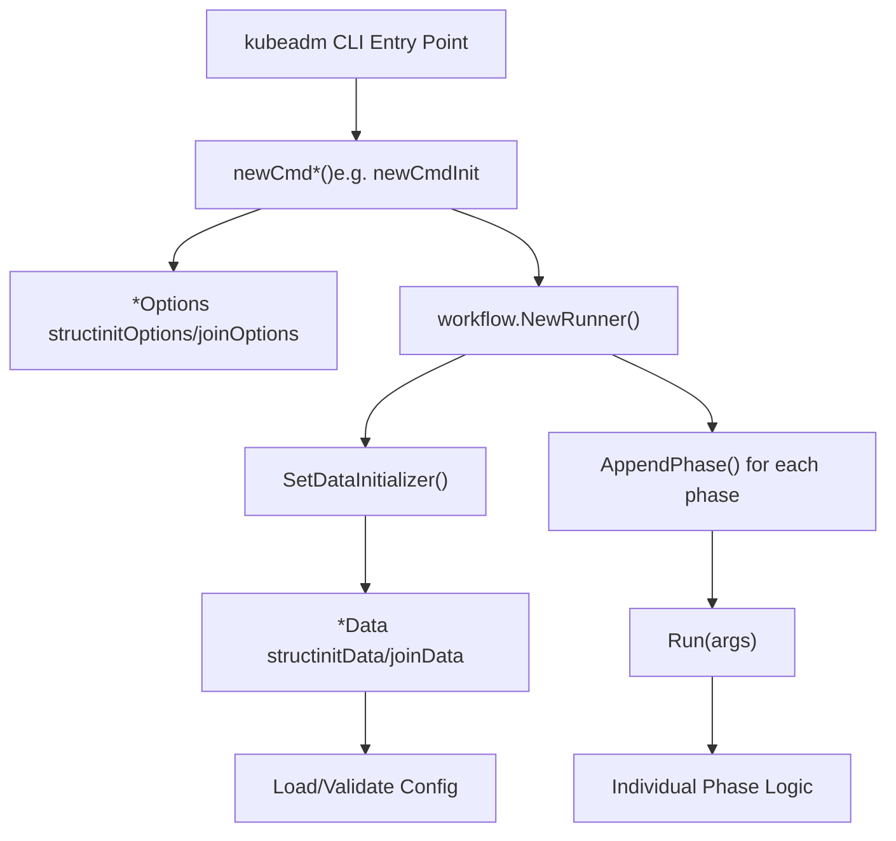
**图示：命令执行架构**

每个命令都遵循该模式：

1.  **解析选项**：将命令行 flags 解析到 `*Options` 结构体
2.  **创建工作流**：由 `workflow.Runner` 管理阶段执行
3.  **初始化数据**：将配置加载并校验到 `*Data` 结构体
4.  **执行阶段**：按顺序阶段执行实际工作

**来源：** [cmd/kubeadm/app/cmd/init.go110-199](https://github.com/kubernetes/kubernetes/blob/2757a872/cmd/kubeadm/app/cmd/init.go#L110-L199) [cmd/kubeadm/app/cmd/join.go162-255](https://github.com/kubernetes/kubernetes/blob/2757a872/cmd/kubeadm/app/cmd/join.go#L162-L255) [cmd/kubeadm/app/cmd/reset.go213-270](https://github.com/kubernetes/kubernetes/blob/2757a872/cmd/kubeadm/app/cmd/reset.go#L213-L270)

---

## 配置 API 对象

kubeadm 使用定义在 `kubeadm.k8s.io` API 组中的强类型配置对象。主要配置类型如下：

| API 对象 | 用途 | 使用命令 |
| --- | --- | --- |
| `InitConfiguration` | 控制平面初始化设置 | `kubeadm init` |
| `ClusterConfiguration` | 集群级配置 | `kubeadm init`（嵌入） |
| `JoinConfiguration` | 节点加入设置 | `kubeadm join` |
| `ResetConfiguration` | 集群清理设置 | `kubeadm reset` |
| `UpgradeConfiguration` | 集群升级设置 | `kubeadm upgrade` |

```mermaid
flowchart TD
    ResetCfg["ResetConfiguration"]
    CertDir["CertificatesDir"]
    Force["Force"]
    CleanupTmp["CleanupTmpDir"]
    JoinCfg["JoinConfiguration"]
    Discovery["DiscoveryBootstrapToken/File"]
    NodeReg2["NodeRegistration"]
    ControlPlane["ControlPlane(optional)"]
    InitCfg["InitConfiguration"]
    ClusterCfg["ClusterConfiguration(embedded)"]
    BootstrapTokens["BootstrapTokens[]"]
    NodeReg1["NodeRegistration"]
    LocalAPI["LocalAPIEndpoint"]
    KubeVer["KubernetesVersion"]
    Networking["NetworkingServiceSubnetPodSubnetDNSDomain"]
    Etcd["EtcdLocal/External"]
    APIServer["APIServer"]
    ControllerMgr["ControllerManager"]
    Scheduler["Scheduler"]
    DNS["DNS"]
    Proxy["Proxy"]

    InitCfg --> ClusterCfg
    InitCfg --> BootstrapTokens
    InitCfg --> NodeReg1
    InitCfg --> LocalAPI
    ClusterCfg --> KubeVer
    ClusterCfg --> Networking
    ClusterCfg --> Etcd
    ClusterCfg --> APIServer
    ClusterCfg --> ControllerMgr
    ClusterCfg --> Scheduler
    ClusterCfg --> DNS
    ClusterCfg --> Proxy
    ResetCfg --> CertDir
    ResetCfg --> Force
    ResetCfg --> CleanupTmp
    JoinCfg --> Discovery
    JoinCfg --> NodeReg2
    JoinCfg --> ControlPlane
```
**图示：配置 API 对象层级**

**来源：** [cmd/kubeadm/app/apis/kubeadm/types.go28-162](https://github.com/kubernetes/kubernetes/blob/2757a872/cmd/kubeadm/app/apis/kubeadm/types.go#L28-L162) [cmd/kubeadm/app/apis/kubeadm/v1beta4/types.go1-500](https://github.com/kubernetes/kubernetes/blob/2757a872/cmd/kubeadm/app/apis/kubeadm/v1beta4/types.go#L1-L500)

---

## kubeadm init 命令

`kubeadm init` 命令用于引导 Kubernetes 控制平面节点。它会执行一系列阶段来设置证书、静态 Pod 清单、etcd 和集群附加组件。

### Init 命令结构

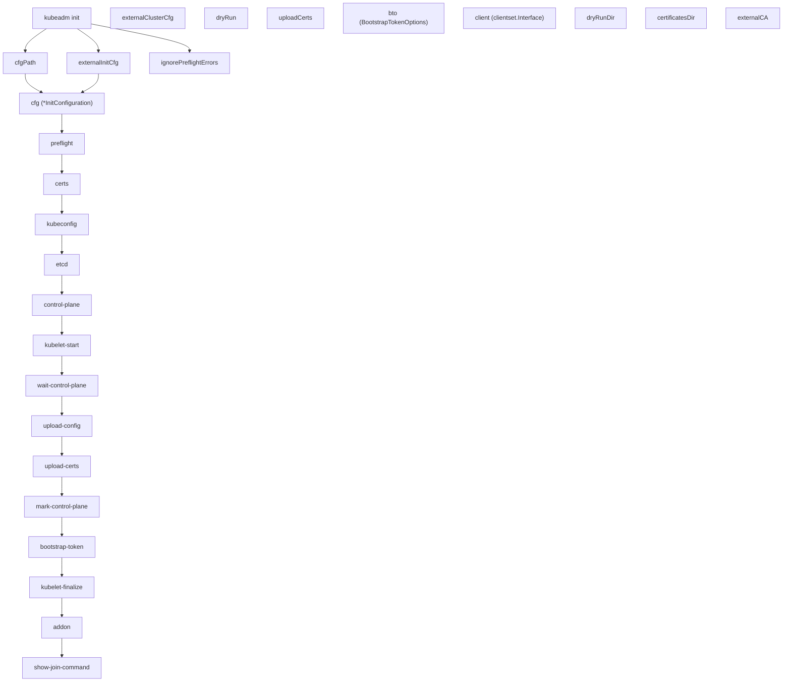
**图示：kubeadm init 命令流程**

### Init 阶段

init 工作流由以下阶段构成（按顺序）：

1.  **preflight**：在修改系统前执行验证检查
2.  **certs**：生成 Kubernetes 证书和密钥
3.  **kubeconfig**：为控制平面组件生成 kubeconfig 文件
4.  **etcd**：设置 etcd（本地）或验证外部 etcd
5.  **control-plane**：为 API server、controller-manager、scheduler 创建静态 Pod 清单
6.  **kubelet-start**：写入 kubelet 配置并启动 kubelet
7.  **wait-control-plane**：等待控制平面就绪
8.  **upload-config**：将 kubeadm 与 kubelet 配置上传到 ConfigMap
9.  **upload-certs**：（可选）将控制平面证书上传到 Secret
10.  **mark-control-plane**：为控制平面节点打标签并加污点
11.  **bootstrap-token**：创建用于节点加入的引导 token
12.  **kubelet-finalize**：在引导后更新 kubelet 设置
13.  **addon**：安装 DNS 与 kube-proxy 附加组件
14.  **show-join-command**：显示工作节点加入命令

**来源：** [cmd/kubeadm/app/cmd/init.go158-172](https://github.com/kubernetes/kubernetes/blob/2757a872/cmd/kubeadm/app/cmd/init.go#L158-L172) [cmd/kubeadm/app/cmd/init.go75-84](https://github.com/kubernetes/kubernetes/blob/2757a872/cmd/kubeadm/app/cmd/init.go#L75-L84)

### Init 配置加载

> **[Mermaid sequence]**
> *(图表结构无法解析)*

**图示：Init 配置加载与校验**

**来源：** [cmd/kubeadm/app/cmd/init.go305-410](https://github.com/kubernetes/kubernetes/blob/2757a872/cmd/kubeadm/app/cmd/init.go#L305-L410) [cmd/kubeadm/app/util/config/initconfiguration.go59-71](https://github.com/kubernetes/kubernetes/blob/2757a872/cmd/kubeadm/app/util/config/initconfiguration.go#L59-L71)

### Flags 与选项

`kubeadm init` 的关键 flags：

| Flag | 类型 | 说明 | 配置字段 |
| --- | --- | --- | --- |
| `--config` | string | kubeadm 配置文件路径 | \- |
| `--kubernetes-version` | string | 使用的 Kubernetes 版本 | `ClusterConfiguration.KubernetesVersion` |
| `--pod-network-cidr` | string | Pod 网络 CIDR | `ClusterConfiguration.Networking.PodSubnet` |
| `--service-cidr` | string | Service CIDR | `ClusterConfiguration.Networking.ServiceSubnet` |
| `--apiserver-advertise-address` | string | API server 对外通告地址 | `LocalAPIEndpoint.AdvertiseAddress` |
| `--apiserver-bind-port` | int32 | API server 绑定端口 | `LocalAPIEndpoint.BindPort` |
| `--cert-dir` | string | 证书目录 | `ClusterConfiguration.CertificatesDir` |
| `--cri-socket` | string | CRI socket 路径 | `NodeRegistration.CRISocket` |
| `--dry-run` | bool | 不应用变更 | `InitConfiguration.DryRun` |
| `--ignore-preflight-errors` | \[\]string | 要忽略的预检错误 | `NodeRegistration.IgnorePreflightErrors` |
| `--upload-certs` | bool | 上传控制平面证书 | \- |
| `--skip-phases` | \[\]string | 跳过指定阶段 | `InitConfiguration.SkipPhases` |

**来源：** [cmd/kubeadm/app/cmd/init.go201-253](https://github.com/kubernetes/kubernetes/blob/2757a872/cmd/kubeadm/app/cmd/init.go#L201-L253) [cmd/kubeadm/app/cmd/init.go255-280](https://github.com/kubernetes/kubernetes/blob/2757a872/cmd/kubeadm/app/cmd/init.go#L255-L280)

---

## kubeadm join 命令

`kubeadm join` 命令将节点（工作节点或控制平面节点）加入到现有集群。

### Join 命令结构

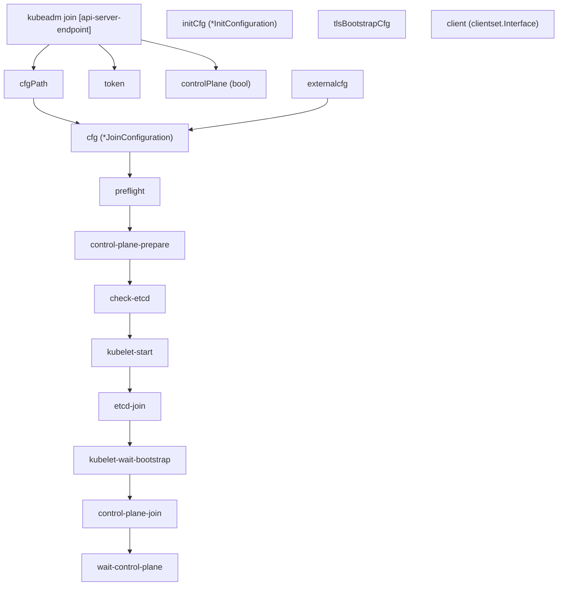
**图示：kubeadm join 命令流程**

### 发现机制

join 命令支持两种发现机制：

1.  **Bootstrap Token Discovery**：使用 token 和 CA 证书哈希
2.  **File Discovery**：使用 kubeconfig 文件

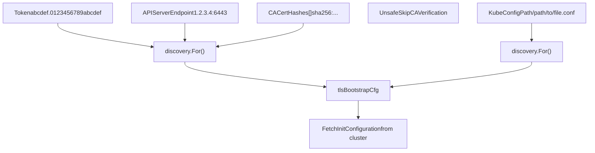
**图示：Join 发现机制**

**来源：** [cmd/kubeadm/app/cmd/join.go147-172](https://github.com/kubernetes/kubernetes/blob/2757a872/cmd/kubeadm/app/cmd/join.go#L147-L172) [cmd/kubeadm/app/apis/kubeadm/types.go403-437](https://github.com/kubernetes/kubernetes/blob/2757a872/cmd/kubeadm/app/apis/kubeadm/types.go#L403-L437)

### Join 配置示例

```
apiVersion: kubeadm.k8s.io/v1beta4kind: JoinConfigurationdiscovery:  bootstrapToken:    apiServerEndpoint: "192.168.1.100:6443"    token: "abcdef.0123456789abcdef"    caCertHashes:      - "sha256:1234567890abcdef..."nodeRegistration:  name: "worker-1"  criSocket: "unix:///var/run/containerd/containerd.sock"# For control plane nodes:controlPlane:  localAPIEndpoint:    advertiseAddress: "192.168.1.101"    bindPort: 6443  certificateKey: "1234567890abcdef..."
```
**来源：** [cmd/kubeadm/app/apis/kubeadm/v1beta4/types.go150-250](https://github.com/kubernetes/kubernetes/blob/2757a872/cmd/kubeadm/app/apis/kubeadm/v1beta4/types.go#L150-L250)

---

## kubeadm reset 命令

`kubeadm reset` 命令会尽力清理由 `kubeadm init` 或 `kubeadm join` 产生的变更。

### Reset 命令结构

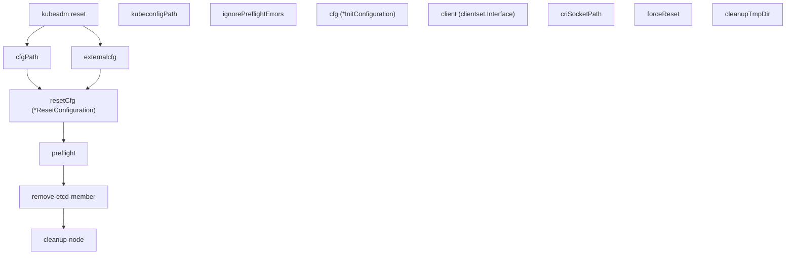
**图示：kubeadm reset 命令流程**

### Reset 会清理什么

reset 命令会移除：

-   容器运行时产物（某些场景下的容器与镜像）
-   Kubernetes 配置文件（`/etc/kubernetes/`）
-   静态 Pod 清单
-   etcd 数据（若为本地 etcd）
-   kubelet 配置
-   iptables/IPVS 规则（kube-proxy 产物）

**重要**：Reset 不会清理：

-   CNI 插件配置
-   网络过滤规则（非 kube-proxy）
-   用户目录中的 kubeconfig 文件

**来源：** [cmd/kubeadm/app/cmd/reset.go50-58](https://github.com/kubernetes/kubernetes/blob/2757a872/cmd/kubeadm/app/cmd/reset.go#L50-L58) [cmd/kubeadm/app/cmd/reset.go213-270](https://github.com/kubernetes/kubernetes/blob/2757a872/cmd/kubeadm/app/cmd/reset.go#L213-L270)

---

## kubeadm token 命令

`kubeadm token` 命令用于管理节点加入和 TLS 引导所使用的引导 token。

### Token 子命令

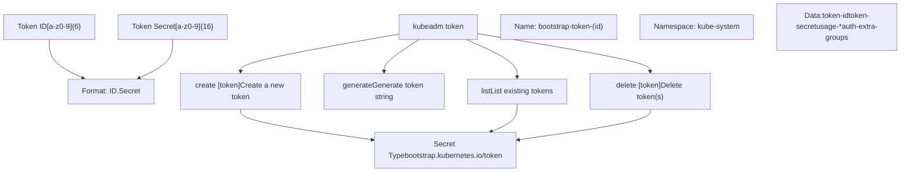
**图示：kubeadm token 命令结构**

### Token 用途

引导 token 支持以下用途：

-   `signing`：用于签名 cluster-info ConfigMap
-   `authentication`：用于向 API server 认证

**来源：** [cmd/kubeadm/app/cmd/token.go58-204](https://github.com/kubernetes/kubernetes/blob/2757a872/cmd/kubeadm/app/cmd/token.go#L58-L204) [cmd/kubeadm/app/apis/kubeadm/validation/validation.go234-292](https://github.com/kubernetes/kubernetes/blob/2757a872/cmd/kubeadm/app/apis/kubeadm/validation/validation.go#L234-L292)

---

## kubeadm config 命令

`kubeadm config` 命令用于管理 kubeadm 配置，提供打印默认值、迁移旧配置、验证配置文件等能力。

### Config 子命令

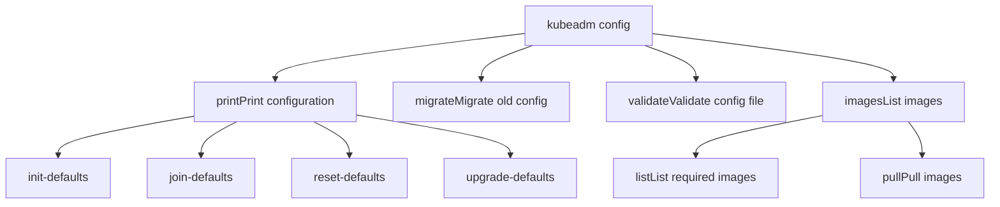
**图示：kubeadm config 命令结构**

**来源：** [cmd/kubeadm/app/cmd/config.go52-76](https://github.com/kubernetes/kubernetes/blob/2757a872/cmd/kubeadm/app/cmd/config.go#L52-L76) [cmd/kubeadm/app/cmd/config.go78-140](https://github.com/kubernetes/kubernetes/blob/2757a872/cmd/kubeadm/app/cmd/config.go#L78-L140)

---

## 工作流与阶段系统

所有主要 kubeadm 命令都使用工作流系统，将操作拆分为离散阶段，可单独执行或作为完整序列执行。

### Workflow Runner 架构

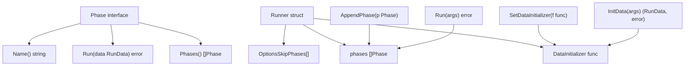
**图示：工作流阶段系统架构**

### 阶段执行流程

> **[Mermaid sequence]**
> *(图表结构无法解析)*

**图示：阶段执行序列**

### 跳过阶段

可通过两种方式跳过阶段：

1.  使用 `--skip-phases` 命令行 flag
2.  在配置文件中设置 `SkipPhases`

```
// Example: Skipping phasesskipPhases := []string{"addon/coredns", "addon/kube-proxy"}
```
**来源：** [cmd/kubeadm/app/cmd/init.go158-172](https://github.com/kubernetes/kubernetes/blob/2757a872/cmd/kubeadm/app/cmd/init.go#L158-L172) [cmd/kubeadm/app/cmd/init.go620-652](https://github.com/kubernetes/kubernetes/blob/2757a872/cmd/kubeadm/app/cmd/init.go#L620-L652)

---

## 预检检查系统

预检检查会在进行任何变更前验证系统要求。该系统通过 `Checker` 接口可扩展。

### Checker 接口

```mermaid
flowchart TD
    CheckerIface["Checker interface"]
    CheckMethod["Check() (warnings, errors []error)"]
    NameMethod["Name() string"]
    CRI["ContainerRuntimeCheck"]
    Service["ServiceCheck"]
    Port["PortOpenCheck"]
    Priv["IsPrivilegedUserCheck"]
    Dir["DirAvailableCheck"]
    File["FileAvailableCheck"]
    Hostname["HostnameCheck"]
    Swap["SwapCheck"]
    NumCPU["NumCPUCheck"]
    Mem["MemCheck"]
    Etcd["ExternalEtcdVersionCheck"]
    ImagePull["ImagePullCheck"]
    K8sVer["KubernetesVersionCheck"]
    KubeletVer["KubeletVersionCheck"]

    CheckerIface --> CheckMethod
    CheckerIface --> NameMethod
    CheckerIface --> CRI
    CheckerIface --> Service
    CheckerIface --> Port
    CheckerIface --> Priv
    CheckerIface --> Dir
    CheckerIface --> File
    CheckerIface --> Hostname
    CheckerIface --> Swap
    CheckerIface --> NumCPU
    CheckerIface --> Mem
    CheckerIface --> Etcd
    CheckerIface --> ImagePull
    CheckerIface --> K8sVer
    CheckerIface --> KubeletVer
```
**图示：预检 Checker 系统**

### Init 专用预检项

对于 `kubeadm init`，会执行以下检查：

| Checker | 校验内容 | 失败影响 |
| --- | --- | --- |
| `IsPrivilegedUserCheck` | 是否以 root 运行 | Error |
| `NumCPUCheck` | 控制平面至少 2 个 CPU | Error |
| `FileAvailableCheck` | 关键文件不存在（如 `/etc/kubernetes/manifests/*`） | Error |
| `PortOpenCheck` | 端口 6443、10259、10257、2379、2380 可用 | Error |
| `ContainerRuntimeCheck` | CRI socket 可访问且在运行 | Error |
| `KubeletVersionCheck` | kubelet 版本兼容 | Error |
| `KubernetesVersionCheck` | kubeadm/Kubernetes 版本兼容 | Warning |
| `SwapCheck` | Swap 配置合适 | Warning |
| `ExternalEtcdVersionCheck` | 外部 etcd 版本受支持 | Error |
| `ImagePullCheck` | 能拉取所需容器镜像 | Error |

**来源：** [cmd/kubeadm/app/preflight/checks.go967-1036](https://github.com/kubernetes/kubernetes/blob/2757a872/cmd/kubeadm/app/preflight/checks.go#L967-L1036)

### 忽略预检错误

可通过 `--ignore-preflight-errors` 忽略指定检查：

```
kubeadm init --ignore-preflight-errors=NumCPU,Swap# or ignore all checks (not recommended):kubeadm init --ignore-preflight-errors=all
```
**来源：** [cmd/kubeadm/app/apis/kubeadm/validation/validation.go1195-1240](https://github.com/kubernetes/kubernetes/blob/2757a872/cmd/kubeadm/app/apis/kubeadm/validation/validation.go#L1195-L1240)

---

## 验证系统

kubeadm 会在执行任何操作之前，对配置对象进行广泛验证。

### 验证架构

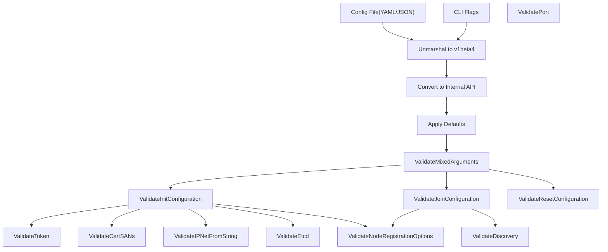
**图示：配置验证流水线**

### 关键验证函数

| 函数 | 用途 | 返回值 |
| --- | --- | --- |
| `ValidateInitConfiguration` | 验证 InitConfiguration | `field.ErrorList` |
| `ValidateJoinConfiguration` | 验证 JoinConfiguration | `field.ErrorList` |
| `ValidateClusterConfiguration` | 验证 ClusterConfiguration | `field.ErrorList` |
| `ValidateToken` | 验证引导 token 格式 | `field.ErrorList` |
| `ValidateDiscovery` | 验证发现配置 | `field.ErrorList` |
| `ValidateNodeRegistrationOptions` | 验证节点注册 | `field.ErrorList` |
| `ValidateIPNetFromString` | 验证 CIDR 表示法 | `field.ErrorList` |
| `ValidateCertSANs` | 验证证书 SAN | `field.ErrorList` |
| `ValidateEtcd` | 验证 etcd 配置 | `field.ErrorList` |
| `ValidateMixedArguments` | 验证 CLI flag 组合 | `error` |

**来源：** [cmd/kubeadm/app/apis/kubeadm/validation/validation.go51-117](https://github.com/kubernetes/kubernetes/blob/2757a872/cmd/kubeadm/app/apis/kubeadm/validation/validation.go#L51-L117)

### 混合参数验证

`ValidateMixedArguments` 函数可防止 `--config` 与其他 flags 的无效组合：

```
// Flags that cannot be used with --configincompatibleFlags := []string{    "kubernetes-version",    "pod-network-cidr",    "service-cidr",    "apiserver-advertise-address",    "apiserver-bind-port",    "cert-dir",    "cri-socket",    "node-name",    // ... etc}
```
**来源：** [cmd/kubeadm/app/apis/kubeadm/validation/validation.go1079-1140](https://github.com/kubernetes/kubernetes/blob/2757a872/cmd/kubeadm/app/apis/kubeadm/validation/validation.go#L1079-L1140)

---

## 配置加载与默认值

配置加载在所有命令中遵循一致模式，并支持多来源与动态默认值。

### 配置加载过程

> **[Mermaid sequence]**
> *(图表结构无法解析)*

**图示：配置加载序列**

### 动态默认值

若未显式设置，若干配置值会在运行时自动检测：

| 字段 | 检测方式 | 来源 |
| --- | --- | --- |
| `NodeRegistration.Name` | 主机名查询 | `os.Hostname()` |
| `NodeRegistration.CRISocket` | CRI socket 自动检测 | 检查 containerd、CRI-O、Docker sockets |
| `LocalAPIEndpoint.AdvertiseAddress` | 默认路由接口 IP | `netutil.ChooseHostInterface()` |
| `BootstrapTokens` | 随机生成 | `bootstraputil.GenerateBootstrapToken()` |
| `ClusterConfiguration.KubernetesVersion` | 最新稳定版 | 查询 dl.k8s.io 或使用编译版本 |

**来源：** [cmd/kubeadm/app/util/config/initconfiguration.go59-238](https://github.com/kubernetes/kubernetes/blob/2757a872/cmd/kubeadm/app/util/config/initconfiguration.go#L59-L238) [cmd/kubeadm/app/util/config/common.go163-248](https://github.com/kubernetes/kubernetes/blob/2757a872/cmd/kubeadm/app/util/config/common.go#L163-L248)

### 配置序列化

kubeadm 可将配置重新序列化为 YAML 以便查看或迁移：

```
// MarshalKubeadmConfigObject marshals to specific API versionbytes, err := configutil.MarshalKubeadmConfigObject(cfg, kubeadmapiv1.SchemeGroupVersion)
```
**来源：** [cmd/kubeadm/app/util/config/common.go54-62](https://github.com/kubernetes/kubernetes/blob/2757a872/cmd/kubeadm/app/util/config/common.go#L54-L62)

---

## Dry-Run 模式

所有主要命令都支持 `--dry-run` 模式，可在不做实际变更的前提下模拟操作。

### Dry-Run 客户端架构

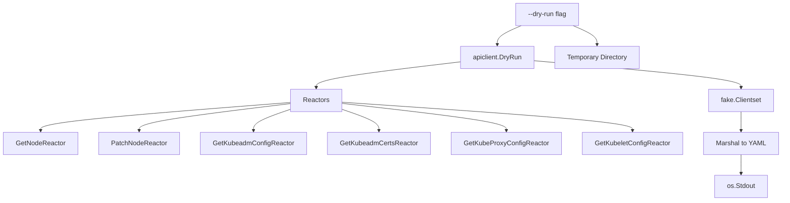
**图示：Dry-Run 客户端架构**

### Dry-Run 行为

在 dry-run 模式下：

-   配置会按正常流程验证
-   预检会被执行
-   不会进行任何实际系统变更
-   API server 交互使用 fake client
-   生成文件写入临时目录
-   动作以 YAML 格式输出到 stdout

**来源：** [cmd/kubeadm/app/cmd/init.go522-534](https://github.com/kubernetes/kubernetes/blob/2757a872/cmd/kubeadm/app/cmd/init.go#L522-L534) [cmd/kubeadm/app/cmd/join.go585-620](https://github.com/kubernetes/kubernetes/blob/2757a872/cmd/kubeadm/app/cmd/join.go#L585-L620) [cmd/kubeadm/app/cmd/reset.go119-133](https://github.com/kubernetes/kubernetes/blob/2757a872/cmd/kubeadm/app/cmd/reset.go#L119-L133)

---

## 命令数据结构

每个命令都使用特定数据结构在阶段之间传递信息。

### Init 数据结构

```
type initData struct {    cfg                         *kubeadmapi.InitConfiguration    skipTokenPrint              bool    dryRun                      bool    kubeconfig                  *clientcmdapi.Config    kubeconfigDir               string    kubeconfigPath              string    ignorePreflightErrors       sets.Set[string]    certificatesDir             string    dryRunDir                   string    externalCA                  bool    client                      clientset.Interface    outputWriter                io.Writer    uploadCerts                 bool    skipCertificateKeyPrint     bool    patchesDir                  string    adminKubeConfigBootstrapped bool}
```
`initData` 上的关键方法：

-   `Cfg()`：返回 InitConfiguration
-   `Client()`：返回 Kubernetes 客户端（真实或 dry-run）
-   `CertificateWriteDir()`：返回证书目录
-   `ManifestDir()`：返回静态 Pod 清单目录
-   `KubeConfigDir()`：返回 kubeconfig 目录

**来源：** [cmd/kubeadm/app/cmd/init.go89-108](https://github.com/kubernetes/kubernetes/blob/2757a872/cmd/kubeadm/app/cmd/init.go#L89-L108) [cmd/kubeadm/app/cmd/init.go432-617](https://github.com/kubernetes/kubernetes/blob/2757a872/cmd/kubeadm/app/cmd/init.go#L432-L617)

### Join 数据结构

```
type joinData struct {    cfg                   *kubeadmapi.JoinConfiguration    initCfg               *kubeadmapi.InitConfiguration    tlsBootstrapCfg       *clientcmdapi.Config    client                clientset.Interface    ignorePreflightErrors sets.Set[string]    outputWriter          io.Writer    patchesDir            string    dryRun                bool    dryRunDir             string}
```
`joinData` 上的关键方法：

-   `Cfg()`：返回 JoinConfiguration
-   `InitCfg()`：返回从集群获取的 InitConfiguration
-   `TLSBootstrapCfg()`：返回通过发现机制得到的引导 kubeconfig
-   `Client()`：返回 Kubernetes 客户端

**来源：** [cmd/kubeadm/app/cmd/join.go148-160](https://github.com/kubernetes/kubernetes/blob/2757a872/cmd/kubeadm/app/cmd/join.go#L148-L160) [cmd/kubeadm/app/cmd/join.go476-628](https://github.com/kubernetes/kubernetes/blob/2757a872/cmd/kubeadm/app/cmd/join.go#L476-L628)

### Reset 数据结构

```
type resetData struct {    certificatesDir       string    client                clientset.Interface    criSocketPath         string    forceReset            bool    ignorePreflightErrors sets.Set[string]    inputReader           io.Reader    outputWriter          io.Writer    cfg                   *kubeadmapi.InitConfiguration    resetCfg              *kubeadmapi.ResetConfiguration    dryRun                bool    cleanupTmpDir         bool}
```
**来源：** [cmd/kubeadm/app/cmd/reset.go70-84](https://github.com/kubernetes/kubernetes/blob/2757a872/cmd/kubeadm/app/cmd/reset.go#L70-L84)

---

## 总结

kubeadm CLI 为 Kubernetes 集群生命周期管理提供了完整工具集：

1.  **命令结构**：所有主要命令（`init`、`join`、`reset`）都采用基于工作流的阶段执行系统，支持细粒度控制与可扩展性。

2.  **配置 API**：提供强类型配置对象（`InitConfiguration`、`JoinConfiguration` 等），支持校验与版本管理。

3.  **预检检查**：可扩展的校验系统，在进行变更前检查系统要求。

4.  **验证机制**：对配置对象进行多层验证，并提供字段级错误报告。

5.  **发现机制**：支持使用引导 token 或基于文件的灵活节点加入方式。

6.  **Dry-Run 支持**：所有命令都支持模拟模式，使用 fake API 客户端和临时输出目录。

7.  **Token 管理**：内置用于管理集群加入引导 token 的工具。

8.  **配置管理**：支持打印默认值、迁移旧配置与验证配置文件。


该架构强调校验、可靠性（预检）与灵活性（阶段系统、多配置来源），从而提供稳健的集群引导体验。

**来源：** [cmd/kubeadm/app/cmd/init.go1-653](https://github.com/kubernetes/kubernetes/blob/2757a872/cmd/kubeadm/app/cmd/init.go#L1-L653) [cmd/kubeadm/app/cmd/join.go1-692](https://github.com/kubernetes/kubernetes/blob/2757a872/cmd/kubeadm/app/cmd/join.go#L1-L692) [cmd/kubeadm/app/cmd/reset.go1-333](https://github.com/kubernetes/kubernetes/blob/2757a872/cmd/kubeadm/app/cmd/reset.go#L1-L333) [cmd/kubeadm/app/cmd/token.go1-430](https://github.com/kubernetes/kubernetes/blob/2757a872/cmd/kubeadm/app/cmd/token.go#L1-L430) [cmd/kubeadm/app/cmd/config.go1-500](https://github.com/kubernetes/kubernetes/blob/2757a872/cmd/kubeadm/app/cmd/config.go#L1-L500)
