# GCE 集群配置

相关源文件

-   [cluster/common.sh](https://github.com/kubernetes/kubernetes/blob/2757a872/cluster/common.sh)
-   [cluster/gce/config-common.sh](https://github.com/kubernetes/kubernetes/blob/2757a872/cluster/gce/config-common.sh)
-   [cluster/gce/config-default.sh](https://github.com/kubernetes/kubernetes/blob/2757a872/cluster/gce/config-default.sh)
-   [cluster/gce/config-test.sh](https://github.com/kubernetes/kubernetes/blob/2757a872/cluster/gce/config-test.sh)
-   [cluster/gce/gci/configure-helper.sh](https://github.com/kubernetes/kubernetes/blob/2757a872/cluster/gce/gci/configure-helper.sh)
-   [cluster/gce/gci/configure.sh](https://github.com/kubernetes/kubernetes/blob/2757a872/cluster/gce/gci/configure.sh)
-   [cluster/gce/util.sh](https://github.com/kubernetes/kubernetes/blob/2757a872/cluster/gce/util.sh)
-   [cluster/gce/windows/README-GCE-Windows-kube-up.md](https://github.com/kubernetes/kubernetes/blob/2757a872/cluster/gce/windows/README-GCE-Windows-kube-up.md?plain=1)
-   [cluster/gce/windows/common.psm1](https://github.com/kubernetes/kubernetes/blob/2757a872/cluster/gce/windows/common.psm1)
-   [cluster/gce/windows/configure.ps1](https://github.com/kubernetes/kubernetes/blob/2757a872/cluster/gce/windows/configure.ps1)
-   [cluster/gce/windows/k8s-node-setup.psm1](https://github.com/kubernetes/kubernetes/blob/2757a872/cluster/gce/windows/k8s-node-setup.psm1)
-   [cluster/gce/windows/node-helper.sh](https://github.com/kubernetes/kubernetes/blob/2757a872/cluster/gce/windows/node-helper.sh)
-   [cluster/gce/windows/smoke-test.sh](https://github.com/kubernetes/kubernetes/blob/2757a872/cluster/gce/windows/smoke-test.sh)
-   [cluster/gce/windows/testonly/install-ssh.psm1](https://github.com/kubernetes/kubernetes/blob/2757a872/cluster/gce/windows/testonly/install-ssh.psm1)
-   [cluster/gce/windows/testonly/user-profile.psm1](https://github.com/kubernetes/kubernetes/blob/2757a872/cluster/gce/windows/testonly/user-profile.psm1)

## 目的与范围

本文档描述 Kubernetes 仓库中的 Google Compute Engine（GCE）集群配置系统。该系统负责在 GCE 基础设施上创建、配置并引导 Kubernetes 集群，包括主节点、Linux 工作节点和 Windows 工作节点。

该配置系统负责：

-   配置管理与环境变量处理
-   通过 Google Cloud Storage 分发二进制
-   主节点初始化（含 etcd 和控制平面组件）
-   Linux（GCI/Ubuntu）与 Windows 工作节点配置
-   PKI 证书生成与分发
-   网络设置（包括 IP 别名、防火墙规则和路由）

关于本地开发集群的信息，请参见 [Local Development Environment](/kubernetes/kubernetes/5.2-gce-cluster-provisioning)。

## 架构概览

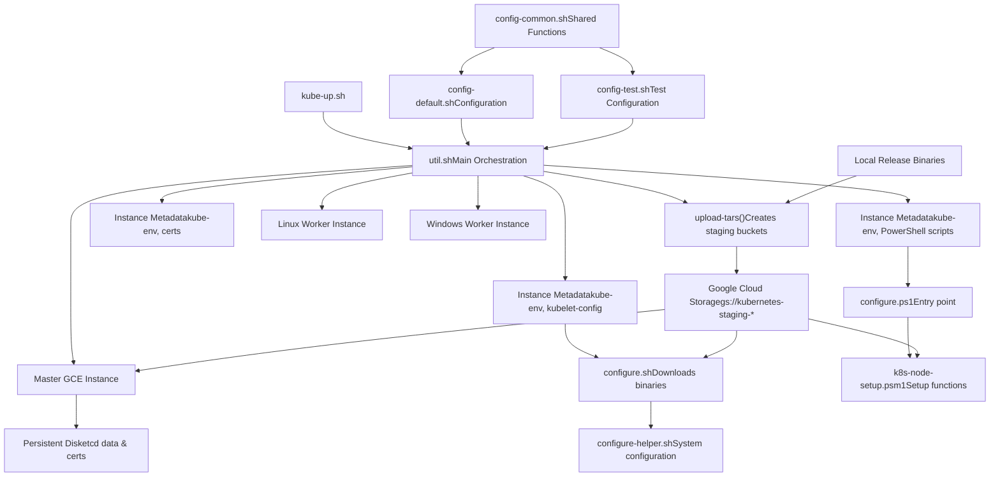
```mermaid
flowchart TD
    KubeUp["kube-up.sh"]
    UtilSh["util.shMain Orchestration"]
    ConfigDefault["config-default.shConfiguration"]
    ConfigTest["config-test.shTest Configuration"]
    ConfigCommon["config-common.shShared Functions"]
    LocalBinaries["Local Release Binaries"]
    GCS["Google Cloud Storagegs://kubernetes-staging-*"]
    TarUpload["upload-tars()Creates staging buckets"]
    MasterInstance["Master GCE Instance"]
    MasterPD["Persistent Disketcd data & certs"]
    MasterMetadata["Instance Metadatakube-env, certs"]
    LinuxInstance["Linux Worker Instance"]
    LinuxMetadata["Instance Metadatakube-env, kubelet-config"]
    ConfigureSh["configure.shDownloads binaries"]
    ConfigureHelper["configure-helper.shSystem configuration"]
    WindowsInstance["Windows Worker Instance"]
    WindowsMetadata["Instance Metadatakube-env, PowerShell scripts"]
    ConfigurePS["configure.ps1Entry point"]
    K8sNodeSetup["k8s-node-setup.psm1Setup functions"]

    KubeUp --> UtilSh
    ConfigDefault --> UtilSh
    ConfigTest --> UtilSh
    ConfigCommon --> ConfigDefault
    ConfigCommon --> ConfigTest
    UtilSh --> TarUpload
    LocalBinaries --> TarUpload
    TarUpload --> GCS
    UtilSh --> MasterInstance
    MasterInstance --> MasterPD
    UtilSh --> MasterMetadata
    GCS --> MasterInstance
    UtilSh --> LinuxInstance
    UtilSh --> LinuxMetadata
    LinuxMetadata --> ConfigureSh
    ConfigureSh --> ConfigureHelper
    GCS --> ConfigureSh
    UtilSh --> WindowsInstance
    UtilSh --> WindowsMetadata
    WindowsMetadata --> ConfigurePS
    ConfigurePS --> K8sNodeSetup
    GCS --> K8sNodeSetup
```
来源： [cluster/gce/util.sh](https://github.com/kubernetes/kubernetes/blob/2757a872/cluster/gce/util.sh) [cluster/gce/config-default.sh](https://github.com/kubernetes/kubernetes/blob/2757a872/cluster/gce/config-default.sh) [cluster/gce/config-test.sh](https://github.com/kubernetes/kubernetes/blob/2757a872/cluster/gce/config-test.sh) [cluster/gce/config-common.sh](https://github.com/kubernetes/kubernetes/blob/2757a872/cluster/gce/config-common.sh)

## 配置系统

GCE 配置系统采用分层配置方式，通过 shell 脚本设置环境变量，供后续配置逻辑消费。

### 配置文件

| 文件 | 用途 | 关键职责 |
| --- | --- | --- |
| `config-common.sh` | 共享工具 | 节点数量计算、磁盘尺寸计算、IP 范围计算 |
| `config-default.sh` | 生产默认值 | 标准集群配置、资源规格 |
| `config-test.sh` | 测试配置 | E2E 测试设置、调试特性、更高资源上限 |

### 关键配置变量

配置系统暴露了大量环境变量。关键分类包括：

**集群拓扑：**

-   `NUM_NODES`：Linux 工作节点数量
-   `NUM_WINDOWS_NODES`：Windows 工作节点数量
-   `MASTER_SIZE`、`NODE_SIZE`：GCE 机型
-   `MASTER_DISK_SIZE`、`NODE_DISK_SIZE`：磁盘大小

**网络：**

-   `ENABLE_IP_ALIASES`：是否启用 Pod IP 的 IP 别名
-   `NODE_IPAM_MODE`：IP 分配模式（`RangeAllocator` 或 `CloudAllocator`）
-   `CLUSTER_IP_RANGE`：Pod CIDR 范围
-   `SERVICE_CLUSTER_IP_RANGE`：Service IP 范围
-   `NETWORK`、`SUBNETWORK`：GCE 网络配置

**镜像：**

-   `MASTER_IMAGE_FAMILY`、`MASTER_IMAGE_PROJECT`：主节点操作系统镜像
-   `NODE_IMAGE_FAMILY`、`NODE_IMAGE_PROJECT`：Linux 工作节点操作系统镜像
-   `WINDOWS_NODE_OS_DISTRIBUTION`：Windows 版本（如 `win2019`）

**运行时：**

-   `CONTAINER_RUNTIME_ENDPOINT`：CRI endpoint 路径
-   `CONTAINER_RUNTIME_NAME`：运行时名称（如 `containerd`）

来源： [cluster/gce/config-default.sh1-178](https://github.com/kubernetes/kubernetes/blob/2757a872/cluster/gce/config-default.sh#L1-L178) [cluster/gce/config-test.sh1-320](https://github.com/kubernetes/kubernetes/blob/2757a872/cluster/gce/config-test.sh#L1-L320) [cluster/gce/config-common.sh17-118](https://github.com/kubernetes/kubernetes/blob/2757a872/cluster/gce/config-common.sh#L17-L118)

### 动态规格计算函数

配置系统内置函数，可根据集群规模计算资源需求：

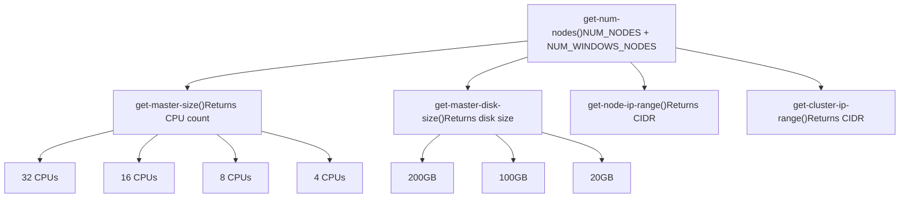
```mermaid
flowchart TD
    GetNumNodes["get-num-nodes()NUM_NODES + NUM_WINDOWS_NODES"]
    GetMasterSize["get-master-size()Returns CPU count"]
    GetMasterDiskSize["get-master-disk-size()Returns disk size"]
    GetNodeIpRange["get-node-ip-range()Returns CIDR"]
    GetClusterIpRange["get-cluster-ip-range()Returns CIDR"]
    Size32["32 CPUs"]
    Size16["16 CPUs"]
    Size8["8 CPUs"]
    Size4["4 CPUs"]
    Disk200["200GB"]
    Disk100["100GB"]
    Disk20["20GB"]

    GetNumNodes --> GetMasterSize
    GetNumNodes --> GetMasterDiskSize
    GetNumNodes --> GetNodeIpRange
    GetNumNodes --> GetClusterIpRange
    GetMasterSize --> Size32
    GetMasterSize --> Size16
    GetMasterSize --> Size8
    GetMasterSize --> Size4
    GetMasterDiskSize --> Disk200
    GetMasterDiskSize --> Disk100
    GetMasterDiskSize --> Disk20
```
来源： [cluster/gce/config-common.sh29-104](https://github.com/kubernetes/kubernetes/blob/2757a872/cluster/gce/config-common.sh#L29-L104)

## 集群创建流程

主编排逻辑位于 `util.sh`，并提供由 `kube-up.sh` 调用的函数：

### 高层配置时序

> **[Mermaid sequence]**
> *(图表结构无法解析)*

来源： [cluster/gce/util.sh296-375](https://github.com/kubernetes/kubernetes/blob/2757a872/cluster/gce/util.sh#L296-L375) [cluster/gce/util.sh512-547](https://github.com/kubernetes/kubernetes/blob/2757a872/cluster/gce/util.sh#L512-L547)

### 项目检测与初始化

`detect-project()` 函数用于建立 GCP 项目上下文：

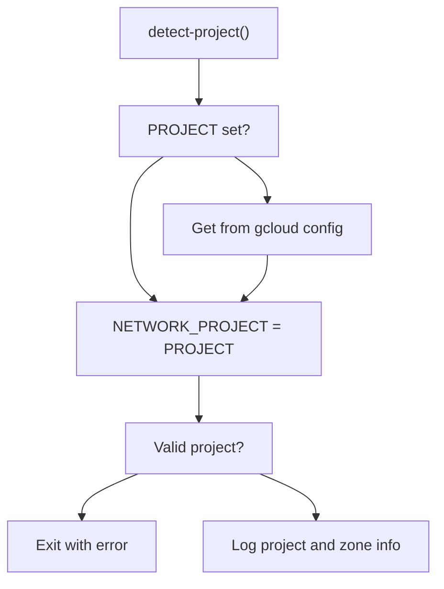
```mermaid
flowchart TD
    Start["detect-project()"]
    CheckProject["PROJECT set?"]
    GetFromGcloud["Get from gcloud config"]
    SetNetworkProject["NETWORK_PROJECT = PROJECT"]
    Validate["Valid project?"]
    Error["Exit with error"]
    Log["Log project and zone info"]

    Start --> CheckProject
    CheckProject --> GetFromGcloud
    CheckProject --> SetNetworkProject
    GetFromGcloud --> SetNetworkProject
    SetNetworkProject --> Validate
    Validate --> Error
    Validate --> Log
```
来源： [cluster/gce/util.sh189-207](https://github.com/kubernetes/kubernetes/blob/2757a872/cluster/gce/util.sh#L189-L207)

## 二进制分发系统

配置系统通过 Google Cloud Storage 分发 Kubernetes 二进制，并通过区域优化加速下载。

### 上传与暂存流程

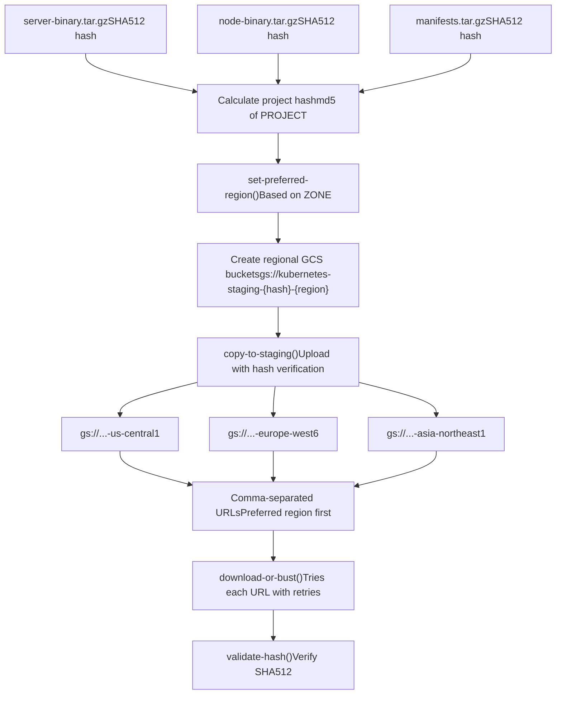
```mermaid
flowchart TD
    ServerBinary["server-binary.tar.gzSHA512 hash"]
    NodeBinary["node-binary.tar.gzSHA512 hash"]
    Manifests["manifests.tar.gzSHA512 hash"]
    ProjectHash["Calculate project hashmd5 of PROJECT"]
    DetermineRegions["set-preferred-region()Based on ZONE"]
    CreateBuckets["Create regional GCS bucketsgs://kubernetes-staging-{hash}-{region}"]
    CopyToStaging["copy-to-staging()Upload with hash verification"]
    USBucket["gs://...-us-central1"]
    EUBucket["gs://...-europe-west6"]
    ASIABucket["gs://...-asia-northeast1"]
    PreferredURLs["Comma-separated URLsPreferred region first"]
    DownloadOrBust["download-or-bust()Tries each URL with retries"]
    ValidateHash["validate-hash()Verify SHA512"]

    ServerBinary --> ProjectHash
    NodeBinary --> ProjectHash
    Manifests --> ProjectHash
    ProjectHash --> DetermineRegions
    DetermineRegions --> CreateBuckets
    CreateBuckets --> CopyToStaging
    CopyToStaging --> USBucket
    CopyToStaging --> EUBucket
    CopyToStaging --> ASIABucket
    USBucket --> PreferredURLs
    EUBucket --> PreferredURLs
    ASIABucket --> PreferredURLs
    PreferredURLs --> DownloadOrBust
    DownloadOrBust --> ValidateHash
```
该系统包含以下优化：

-   **基于 MD5 的去重**：上传前检查 GCS 中是否已有相同哈希的 tarball（[cluster/gce/util.sh229-244](https://github.com/kubernetes/kubernetes/blob/2757a872/cluster/gce/util.sh#L229-L244)）
-   **区域优先**：根据集群 zone 选择最近的 GCS bucket（[cluster/gce/util.sh263-279](https://github.com/kubernetes/kubernetes/blob/2757a872/cluster/gce/util.sh#L263-L279)）
-   **回退 URL**：按优先顺序提供多个区域 URL（[cluster/gce/util.sh334-366](https://github.com/kubernetes/kubernetes/blob/2757a872/cluster/gce/util.sh#L334-L366)）

来源： [cluster/gce/util.sh296-375](https://github.com/kubernetes/kubernetes/blob/2757a872/cluster/gce/util.sh#L296-L375) [cluster/gce/gci/configure.sh173-226](https://github.com/kubernetes/kubernetes/blob/2757a872/cluster/gce/gci/configure.sh#L173-L226)

## 主节点配置

主节点承载 Kubernetes 控制平面组件，因此需要特殊初始化。

### 主节点实例元数据结构

主节点通过 GCE 实例元数据接收配置：

| 元数据键 | 内容 | 用途 |
| --- | --- | --- |
| `kube-env` | YAML 键值对 | 集群配置变量 |
| `kube-master-certs` | 含 base64 证书的 YAML | 控制平面 PKI 材料 |
| `user-data` 或 startup script | Shell 脚本 | Cloud-init 或启动脚本 |

### 主节点持久盘布局

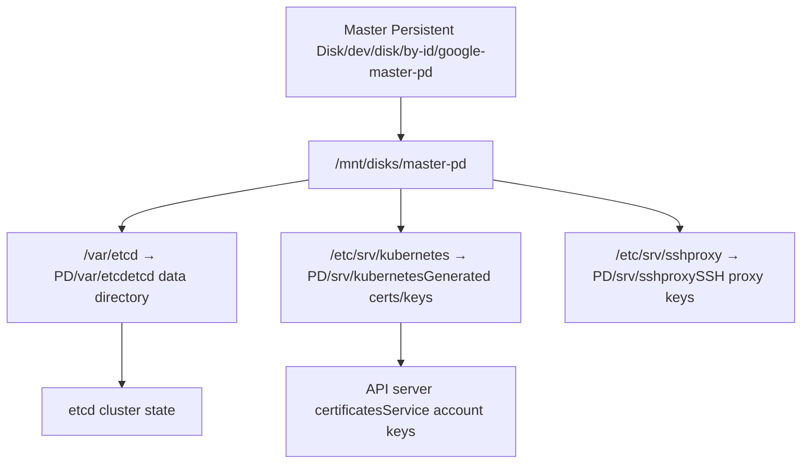
```mermaid
flowchart TD
    MasterPD["Master Persistent Disk/dev/disk/by-id/google-master-pd"]
    MountPoint["/mnt/disks/master-pd"]
    VarEtcd["/var/etcd → PD/var/etcdetcd data directory"]
    SrvK8s["/etc/srv/kubernetes → PD/srv/kubernetesGenerated certs/keys"]
    SrvSSH["/etc/srv/sshproxy → PD/srv/sshproxySSH proxy keys"]
    EtcdData["etcd cluster state"]
    Certs["API server certificatesService account keys"]

    MasterPD --> MountPoint
    MountPoint --> VarEtcd
    MountPoint --> SrvK8s
    MountPoint --> SrvSSH
    VarEtcd --> EtcdData
    SrvK8s --> Certs
```
`mount-master-pd()` 函数（[cluster/gce/gci/configure-helper.sh605-639](https://github.com/kubernetes/kubernetes/blob/2757a872/cluster/gce/gci/configure-helper.sh#L605-L639)）负责该流程：

1.  查找持久盘设备
2.  若未格式化则进行格式化（使用 `safe-format-and-mount`）
3.  创建目录结构
4.  从预期路径创建到 PD 路径的符号链接
5.  设置 etcd 目录的正确所有权

来源： [cluster/gce/gci/configure-helper.sh590-639](https://github.com/kubernetes/kubernetes/blob/2757a872/cluster/gce/gci/configure-helper.sh#L590-L639)

### 主节点 PKI 创建

`create-master-pki()` 函数（[cluster/gce/gci/configure-helper.sh704-814](https://github.com/kubernetes/kubernetes/blob/2757a872/cluster/gce/gci/configure-helper.sh#L704-L814)）将 PKI 材料写入 `/etc/srv/kubernetes/pki/`：

```mermaid
flowchart TD
    CA_CERT["CA_CERT"]
    CA_KEY["CA_KEY"]
    APISERVER_CERT["APISERVER_SERVER_CERT"]
    APISERVER_KEY["APISERVER_SERVER_KEY"]
    APISERVER_CLIENT_CERT["APISERVER_CLIENT_CERT"]
    APISERVER_CLIENT_KEY["APISERVER_CLIENT_KEY"]
    SA_CERT["SERVICEACCOUNT_CERT"]
    SA_KEY["SERVICEACCOUNT_KEY"]
    AGGREGATOR_CA["REQUESTHEADER_CA_CERT"]
    PROXY_CLIENT["PROXY_CLIENT_CERT/KEY"]
    KONNECTIVITY["KONNECTIVITY_* certs"]
    CaCrt["ca.crt"]
    CaKey["ca.key"]
    ApiserverCrt["apiserver.crt"]
    ApiserverKey["apiserver.key"]
    ApiserverClientCrt["apiserver-client.crt"]
    ApiserverClientKey["apiserver-client.key"]
    SaCrt["serviceaccount.crt"]
    SaKey["serviceaccount.key"]
    AggrCa["aggr_ca.crt"]
    ProxyClient["proxy_client.crt/key"]
    KonnectivityDir["konnectivity-server/"]

    CA --> CERT_CaCrt
    CA --> KEY_CaKey
    APISERVER --> CERT_ApiserverCrt
    APISERVER --> KEY_ApiserverKey
    APISERVER --> CLIENT_CERT_ApiserverClientCrt
    APISERVER --> CLIENT_KEY_ApiserverClientKey
    SA --> CERT_SaCrt
    SA --> KEY_SaKey
    AGGREGATOR --> CA_AggrCa
    PROXY --> CLIENT_ProxyClient
    KONNECTIVITY --> KonnectivityDir
```
`write-pki-data()` 辅助函数（[cluster/gce/gci/configure-helper.sh658-670](https://github.com/kubernetes/kubernetes/blob/2757a872/cluster/gce/gci/configure-helper.sh#L658-L670)）负责 base64 解码和文件权限设置，可通过 `KUBE_PKI_READERS_GROUP` 控制是否设置为组可读。

来源： [cluster/gce/gci/configure-helper.sh704-814](https://github.com/kubernetes/kubernetes/blob/2757a872/cluster/gce/gci/configure-helper.sh#L704-L814)

### 主节点认证 token

`create-master-auth()` 函数（[cluster/gce/gci/configure-helper.sh820-874](https://github.com/kubernetes/kubernetes/blob/2757a872/cluster/gce/gci/configure-helper.sh#L820-L874)）管理 `/etc/srv/kubernetes/known_tokens.csv` 中的静态 token：

| Token 变量 | 用户身份 | 用途 |
| --- | --- | --- |
| `KUBE_BEARER_TOKEN` | `admin` | 集群管理员访问 |
| `KUBE_BOOTSTRAP_TOKEN` | `gcp:kube-bootstrap` | 节点引导 |
| `CLOUD_CONTROLLER_MANAGER_TOKEN` | `system:cloud-controller-manager` | CCM 认证 |
| `KUBE_CONTROLLER_MANAGER_TOKEN` | `system:kube-controller-manager` | KCM 认证 |
| `KUBE_SCHEDULER_TOKEN` | `system:kube-scheduler` | Scheduler 认证 |
| `KUBE_PROXY_TOKEN` | `system:kube-proxy` | Kube-proxy 认证 |
| `KONNECTIVITY_SERVER_TOKEN` | `system:konnectivity-server` | Konnectivity 认证 |

该函数使用 `append_or_replace_prefixed_line()`（[cluster/gce/gci/configure-helper.sh645-656](https://github.com/kubernetes/kubernetes/blob/2757a872/cluster/gce/gci/configure-helper.sh#L645-L656)）来确保在 `METADATA_CLOBBERS_CONFIG` 开启时重启仍具幂等性。

来源： [cluster/gce/gci/configure-helper.sh820-874](https://github.com/kubernetes/kubernetes/blob/2757a872/cluster/gce/gci/configure-helper.sh#L820-L874)

## Linux 节点配置

Linux 节点（GCI/Ubuntu）使用上传到实例元数据中的双脚本初始化系统。

### 初始化脚本工作流

> **[Mermaid sequence]**
> *(图表结构无法解析)*

来源： [cluster/gce/gci/configure.sh84-103](https://github.com/kubernetes/kubernetes/blob/2757a872/cluster/gce/gci/configure.sh#L84-L103) [cluster/gce/gci/configure-helper.sh216-223](https://github.com/kubernetes/kubernetes/blob/2757a872/cluster/gce/gci/configure-helper.sh#L216-L223)

### 二进制安装流程

`install-kube-binary-config()` 函数用于下载 Kubernetes 二进制：

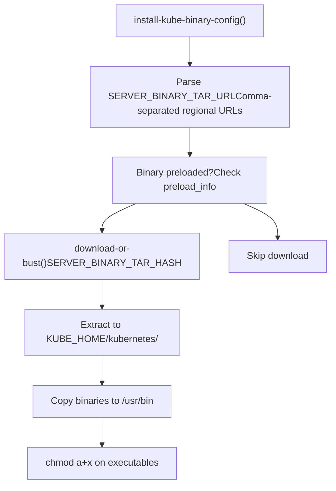
```mermaid
flowchart TD
    Start["install-kube-binary-config()"]
    ParseURLs["Parse SERVER_BINARY_TAR_URLComma-separated regional URLs"]
    CheckPreload["Binary preloaded?Check preload_info"]
    DownloadBinary["download-or-bust()SERVER_BINARY_TAR_HASH"]
    ExtractBinary["Extract to KUBE_HOME/kubernetes/"]
    CopyToBin["Copy binaries to /usr/bin"]
    SetPermissions["chmod a+x on executables"]
    End["Skip download"]

    Start --> ParseURLs
    ParseURLs --> CheckPreload
    CheckPreload --> End
    CheckPreload --> DownloadBinary
    DownloadBinary --> ExtractBinary
    ExtractBinary --> CopyToBin
    CopyToBin --> SetPermissions
```
下载过程包含校验：

-   SHA512 哈希校验（[cluster/gce/gci/configure.sh143-153](https://github.com/kubernetes/kubernetes/blob/2757a872/cluster/gce/gci/configure.sh#L143-L153)）
-   带指数退避的重试逻辑
-   多区域回退以提升可靠性

来源： [cluster/gce/gci/configure.sh485-545](https://github.com/kubernetes/kubernetes/blob/2757a872/cluster/gce/gci/configure.sh#L485-L545)

### 节点 PKI 设置

`create-node-pki()` 函数（[cluster/gce/gci/configure-helper.sh672-702](https://github.com/kubernetes/kubernetes/blob/2757a872/cluster/gce/gci/configure-helper.sh#L672-L702)）创建 `/etc/srv/kubernetes/pki/`：

| 文件 | 源变量 | 用途 |
| --- | --- | --- |
| `ca-certificates.crt` | `CA_CERT_BUNDLE` 或 `CA_CERT` | 用于验证 API server 的集群 CA |
| `kubelet.crt` | `KUBELET_CERT` | kubelet 服务证书（若使用静态证书） |
| `kubelet.key` | `KUBELET_KEY` | kubelet 服务私钥（若使用静态证书） |
| `konnectivity-agent/*` | `KONNECTIVITY_AGENT_*` | Konnectivity agent 证书（若启用） |

该函数会遵循 `KUBE_PKI_READERS_GROUP` 设置证书组可读权限。

来源： [cluster/gce/gci/configure-helper.sh672-702](https://github.com/kubernetes/kubernetes/blob/2757a872/cluster/gce/gci/configure-helper.sh#L672-L702)

### 容器运行时配置

容器运行时配置取决于 `CONTAINER_RUNTIME_NAME`（通常为 `containerd`）：

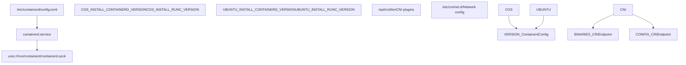
```mermaid
flowchart TD
    ContainerdConfig["/etc/containerd/config.toml"]
    SystemdUnit["containerd.service"]
    CRIEndpoint["unix:///run/containerd/containerd.sock"]
    COS_VERSION["COS_INSTALL_CONTAINERD_VERSIONCOS_INSTALL_RUNC_VERSION"]
    UBUNTU_VERSION["UBUNTU_INSTALL_CONTAINERD_VERSIONUBUNTU_INSTALL_RUNC_VERSION"]
    CNI_BINARIES["/opt/cni/bin/CNI plugins"]
    CNI_CONFIG["/etc/cni/net.d/Network config"]

    COS --> VERSION_ContainerdConfig
    UBUNTU --> VERSION_ContainerdConfig
    ContainerdConfig --> SystemdUnit
    SystemdUnit --> CRIEndpoint
    CNI --> BINARIES_CRIEndpoint
    CNI --> CONFIG_CRIEndpoint
```
该配置包括：

-   COS 自定义 containerd 版本（[cluster/gce/config-test.sh133-134](https://github.com/kubernetes/kubernetes/blob/2757a872/cluster/gce/config-test.sh#L133-L134)）
-   Ubuntu 自定义 containerd 版本（[cluster/gce/config-test.sh126-127](https://github.com/kubernetes/kubernetes/blob/2757a872/cluster/gce/config-test.sh#L126-L127)）
-   CNI 插件安装（[cluster/gce/gci/configure.sh346-370](https://github.com/kubernetes/kubernetes/blob/2757a872/cluster/gce/gci/configure.sh#L346-L370)）
-   crictl 配置（[cluster/gce/gci/configure.sh396-412](https://github.com/kubernetes/kubernetes/blob/2757a872/cluster/gce/gci/configure.sh#L396-L412)）

来源： [cluster/gce/config-test.sh104-135](https://github.com/kubernetes/kubernetes/blob/2757a872/cluster/gce/config-test.sh#L104-L135) [cluster/gce/gci/configure.sh346-412](https://github.com/kubernetes/kubernetes/blob/2757a872/cluster/gce/gci/configure.sh#L346-L412)

### Kubelet 配置

Kubelet 配置同时使用 flags 与配置文件。`construct-linux-kubelet-flags()` 函数（[cluster/gce/util.sh751-809](https://github.com/kubernetes/kubernetes/blob/2757a872/cluster/gce/util.sh#L751-L809)）负责构建命令行 flags：

**关键 Kubelet Flags：**

-   `--cloud-provider=external`：使用外部云控制器
-   `--experimental-mounter-path=/home/kubernetes/containerized_mounter/mounter`：自定义挂载辅助程序
-   `--cert-dir=/var/lib/kubelet/pki/`：证书目录
-   `--bootstrap-kubeconfig=/var/lib/kubelet/bootstrap-kubeconfig`：引导凭据
-   `--kubeconfig=/var/lib/kubelet/kubeconfig`：引导后最终 kubeconfig
-   `--register-with-taints=node-role.kubernetes.io/control-plane=:NoSchedule`：主节点污点（若 `REGISTER_MASTER_KUBELET=true`）

系统还会通过 `build-kubelet-config()`（[cluster/gce/util.sh1229-1429](https://github.com/kubernetes/kubernetes/blob/2757a872/cluster/gce/util.sh#L1229-L1429)）生成 kubelet 配置文件并上传为元数据。

来源： [cluster/gce/util.sh751-809](https://github.com/kubernetes/kubernetes/blob/2757a872/cluster/gce/util.sh#L751-L809) [cluster/gce/util.sh1229-1429](https://github.com/kubernetes/kubernetes/blob/2757a872/cluster/gce/util.sh#L1229-L1429)

### 本地 SSD 管理

`ensure-local-ssds()` 函数（[cluster/gce/gci/configure-helper.sh414-468](https://github.com/kubernetes/kubernetes/blob/2757a872/cluster/gce/gci/configure-helper.sh#L414-L468)）处理本地 SSD 配置：

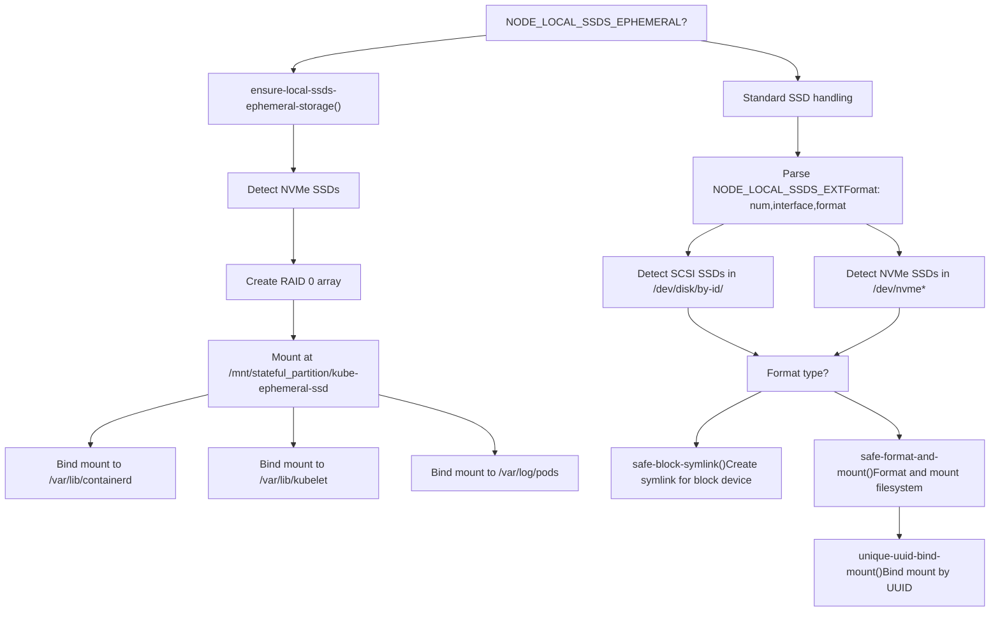
```mermaid
flowchart TD
    CheckMode["NODE_LOCAL_SSDS_EPHEMERAL?"]
    EphemeralMode["ensure-local-ssds-ephemeral-storage()"]
    StandardMode["Standard SSD handling"]
    DetectNVMe["Detect NVMe SSDs"]
    CreateRAID["Create RAID 0 array"]
    MountRAID["Mount at /mnt/stateful_partition/kube-ephemeral-ssd"]
    BindContainerd["Bind mount to /var/lib/containerd"]
    BindKubelet["Bind mount to /var/lib/kubelet"]
    BindLogs["Bind mount to /var/log/pods"]
    ParseConfig["Parse NODE_LOCAL_SSDS_EXTFormat: num,interface,format"]
    DetectSCSI["Detect SCSI SSDs in /dev/disk/by-id/"]
    DetectNVMeStd["Detect NVMe SSDs in /dev/nvme*"]
    FormatCheck["Format type?"]
    BlockDevice["safe-block-symlink()Create symlink for block device"]
    FSDevice["safe-format-and-mount()Format and mount filesystem"]
    UUIDMount["unique-uuid-bind-mount()Bind mount by UUID"]

    CheckMode --> EphemeralMode
    CheckMode --> StandardMode
    EphemeralMode --> DetectNVMe
    DetectNVMe --> CreateRAID
    CreateRAID --> MountRAID
    MountRAID --> BindContainerd
    MountRAID --> BindKubelet
    MountRAID --> BindLogs
    StandardMode --> ParseConfig
    ParseConfig --> DetectSCSI
    ParseConfig --> DetectNVMeStd
    DetectSCSI --> FormatCheck
    DetectNVMeStd --> FormatCheck
    FormatCheck --> BlockDevice
    FormatCheck --> FSDevice
    FSDevice --> UUIDMount
```
`NODE_LOCAL_SSDS_EXT` 格式可进行细粒度控制：`"2,scsi,fs;1,nvme,block"` 表示 2 块 SCSI SSD 使用文件系统，1 块 NVMe 作为块设备。

来源： [cluster/gce/gci/configure-helper.sh414-524](https://github.com/kubernetes/kubernetes/blob/2757a872/cluster/gce/gci/configure-helper.sh#L414-L524)

### 网络防火墙配置

`config-ip-firewall()` 函数（[cluster/gce/gci/configure-helper.sh150-214](https://github.com/kubernetes/kubernetes/blob/2757a872/cluster/gce/gci/configure-helper.sh#L150-L214)）用于设置 iptables 规则：

1.  **启用回环路由**：`sysctl -w net.ipv4.conf.all.route_localnet=1`
2.  **接受入站流量**：添加 TCP/UDP/ICMP/SCTP 的 ACCEPT 规则
3.  **IP 伪装**（若 `NON_MASQUERADE_CIDR=0.0.0.0/0`）：
    -   创建 `IP-MASQ` 链
    -   排除 RFC 1918 及其他保留网段
    -   对其余出站流量执行 MASQUERADE
4.  **元数据隐藏**（若 `ENABLE_METADATA_CONCEALMENT=true`）：
    -   添加本地 IP `169.254.169.252` 作为元数据代理
    -   将元数据服务器流量 DNAT 到 988/987 端口代理
5.  **元数据防火墙**（若 `METADATA_SERVER_FIREWALL_MODE=log`）：
    -   记录来自未授权 UID 的元数据访问

来源： [cluster/gce/gci/configure-helper.sh150-214](https://github.com/kubernetes/kubernetes/blob/2757a872/cluster/gce/gci/configure-helper.sh#L150-L214)

## Windows 节点配置

Windows 节点使用 PowerShell 模块进行配置，架构与 Linux 节点不同。

### PowerShell 模块架构

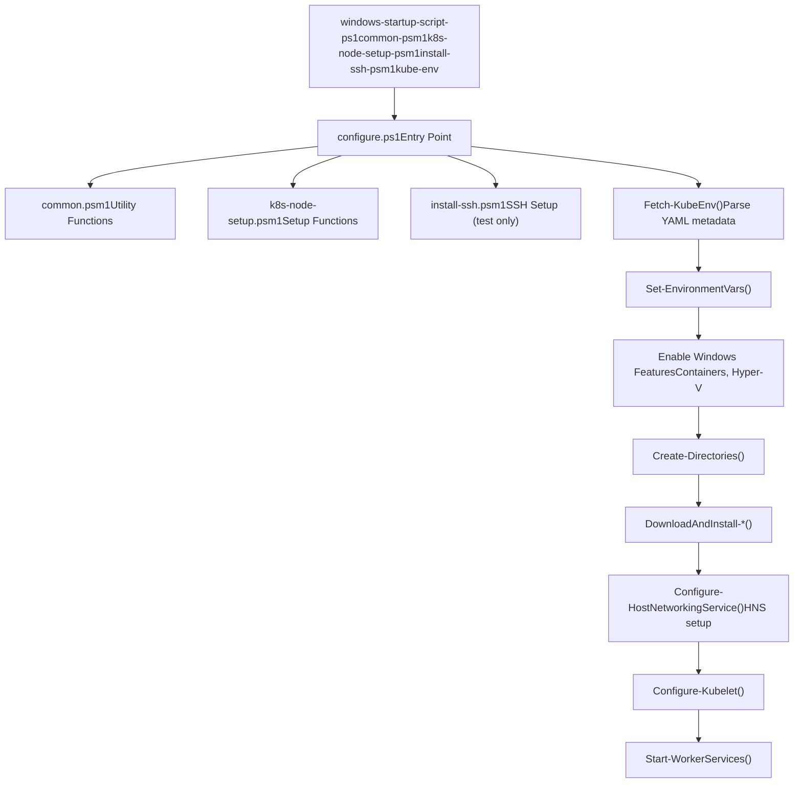
```mermaid
flowchart TD
    WinMetadata["windows-startup-script-ps1common-psm1k8s-node-setup-psm1install-ssh-psm1kube-env"]
    ConfigurePS1["configure.ps1Entry Point"]
    CommonPSM1["common.psm1Utility Functions"]
    K8sNodeSetupPSM1["k8s-node-setup.psm1Setup Functions"]
    InstallSSHPSM1["install-ssh.psm1SSH Setup (test only)"]
    FetchKubeEnv["Fetch-KubeEnv()Parse YAML metadata"]
    SetEnvVars["Set-EnvironmentVars()"]
    EnableFeatures["Enable Windows FeaturesContainers, Hyper-V"]
    CreateDirs["Create-Directories()"]
    DownloadBinaries["DownloadAndInstall-*()"]
    ConfigureNetworking["Configure-HostNetworkingService()HNS setup"]
    ConfigureKubelet["Configure-Kubelet()"]
    StartServices["Start-WorkerServices()"]

    WinMetadata --> ConfigurePS1
    ConfigurePS1 --> CommonPSM1
    ConfigurePS1 --> K8sNodeSetupPSM1
    ConfigurePS1 --> InstallSSHPSM1
    ConfigurePS1 --> FetchKubeEnv
    FetchKubeEnv --> SetEnvVars
    SetEnvVars --> EnableFeatures
    EnableFeatures --> CreateDirs
    CreateDirs --> DownloadBinaries
    DownloadBinaries --> ConfigureNetworking
    ConfigureNetworking --> ConfigureKubelet
    ConfigureKubelet --> StartServices
```
来源： [cluster/gce/windows/configure.ps1106-196](https://github.com/kubernetes/kubernetes/blob/2757a872/cluster/gce/windows/configure.ps1#L106-L196) [cluster/gce/windows/k8s-node-setup.psm11-317](https://github.com/kubernetes/kubernetes/blob/2757a872/cluster/gce/windows/k8s-node-setup.psm1#L1-L317)

### Windows 环境变量

`Set-EnvironmentVars()` 函数（[cluster/gce/windows/k8s-node-setup.psm1264-316](https://github.com/kubernetes/kubernetes/blob/2757a872/cluster/gce/windows/k8s-node-setup.psm1#L264-L316)）建立 Windows 专用路径：

| 环境变量 | 默认值 | 用途 |
| --- | --- | --- |
| `K8S_DIR` | `C:\etc\kubernetes` | Kubernetes 根目录 |
| `NODE_DIR` | `C:\etc\kubernetes\node\bin` | 二进制目录（加入 PATH） |
| `CNI_DIR` | `C:\etc\kubernetes\cni` | CNI 插件二进制 |
| `CNI_CONFIG_DIR` | `C:\etc\kubernetes\cni\config` | CNI 配置 |
| `PKI_DIR` | `C:\etc\kubernetes\pki` | 证书存储 |
| `LOGS_DIR` | `C:\etc\kubernetes\logs` | 日志文件 |
| `MANIFESTS_DIR` | `C:\etc\kubernetes\manifests` | 静态 Pod 清单 |
| `CONTAINER_RUNTIME_ENDPOINT` | 来自 `WINDOWS_CONTAINER_RUNTIME_ENDPOINT` 或 `CONTAINER_RUNTIME_ENDPOINT` | CRI endpoint |
| `KUBE_NETWORK` | `l2bridge` | Windows CNI 网络类型 |
| `INFRA_CONTAINER` | 来自 `WINDOWS_INFRA_CONTAINER` | Pause 容器镜像 |

来源： [cluster/gce/windows/k8s-node-setup.psm1264-316](https://github.com/kubernetes/kubernetes/blob/2757a872/cluster/gce/windows/k8s-node-setup.psm1#L264-L316) [cluster/gce/config-common.sh127-158](https://github.com/kubernetes/kubernetes/blob/2757a872/cluster/gce/config-common.sh#L127-L158)

### Windows 二进制下载

Windows 节点从同一 GCS bucket 下载二进制，但使用 PowerShell 函数：

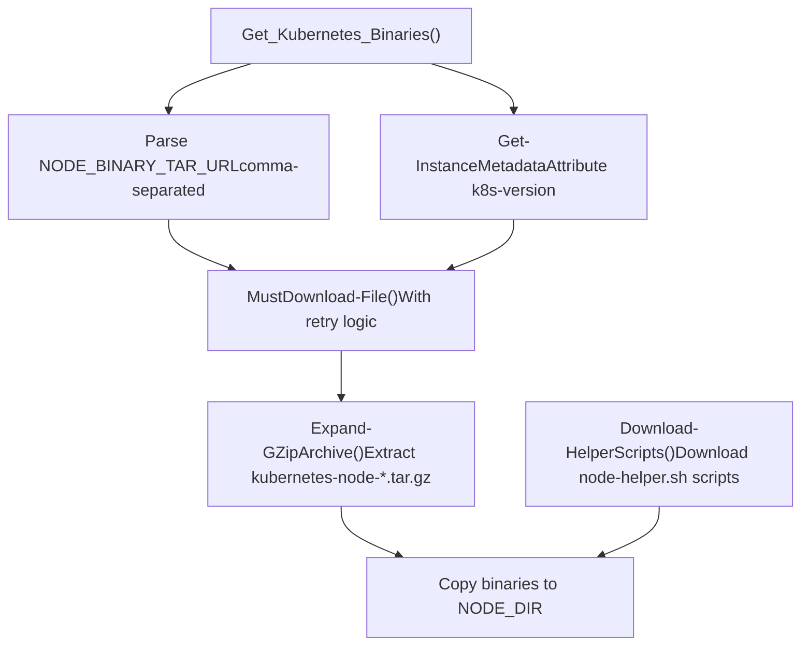
```mermaid
flowchart TD
    GetBinaries["Get_Kubernetes_Binaries()"]
    ParseURLs["Parse NODE_BINARY_TAR_URLcomma-separated"]
    FetchKubeVersion["Get-InstanceMetadataAttribute k8s-version"]
    DownloadNodeBinaries["Download-HelperScripts()Download node-helper.sh scripts"]
    DownloadKubeBinaries["MustDownload-File()With retry logic"]
    ExtractTar["Expand-GZipArchive()Extract kubernetes-node-*.tar.gz"]
    CopyBinaries["Copy binaries to NODE_DIR"]

    GetBinaries --> ParseURLs
    GetBinaries --> FetchKubeVersion
    ParseURLs --> DownloadKubeBinaries
    FetchKubeVersion --> DownloadKubeBinaries
    DownloadKubeBinaries --> ExtractTar
    ExtractTar --> CopyBinaries
    DownloadNodeBinaries --> CopyBinaries
```
`MustDownload-File()` 函数（[cluster/gce/windows/common.psm1130-195](https://github.com/kubernetes/kubernetes/blob/2757a872/cluster/gce/windows/common.psm1#L130-L195)）包含：

-   使用 `Validate-SHA` 进行 SHA 校验
-   自动重试与指数退避
-   支持 `.gz` 解压
-   进度报告

来源： [cluster/gce/windows/k8s-node-setup.psm1773-870](https://github.com/kubernetes/kubernetes/blob/2757a872/cluster/gce/windows/k8s-node-setup.psm1#L773-L870) [cluster/gce/windows/common.psm1130-195](https://github.com/kubernetes/kubernetes/blob/2757a872/cluster/gce/windows/common.psm1#L130-L195)

### Windows 特性安装

Windows 节点需要特定的 OS 功能：

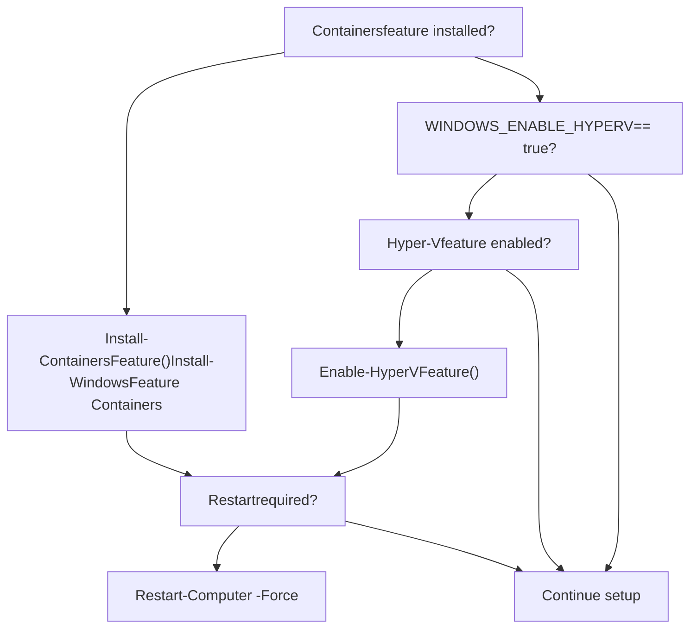
```mermaid
flowchart TD
    CheckContainers["Containersfeature installed?"]
    InstallContainers["Install-ContainersFeature()Install-WindowsFeature Containers"]
    CheckHyperV["WINDOWS_ENABLE_HYPERV== true?"]
    CheckHyperVInstalled["Hyper-Vfeature enabled?"]
    EnableHyperV["Enable-HyperVFeature()"]
    NeedReboot["Restartrequired?"]
    Reboot["Restart-Computer -Force"]
    Continue["Continue setup"]

    CheckContainers --> InstallContainers
    CheckContainers --> CheckHyperV
    InstallContainers --> NeedReboot
    CheckHyperV --> CheckHyperVInstalled
    CheckHyperV --> Continue
    CheckHyperVInstalled --> EnableHyperV
    CheckHyperVInstalled --> Continue
    EnableHyperV --> NeedReboot
    NeedReboot --> Reboot
    NeedReboot --> Continue
```
Containers 功能是 Windows 容器支持的必需项。Hyper-V 隔离为可选项，由 `WINDOWS_ENABLE_HYPERV` 控制（[cluster/gce/windows/k8s-node-setup.psm1344-383](https://github.com/kubernetes/kubernetes/blob/2757a872/cluster/gce/windows/k8s-node-setup.psm1#L344-L383)）。

来源： [cluster/gce/windows/configure.ps1125-145](https://github.com/kubernetes/kubernetes/blob/2757a872/cluster/gce/windows/configure.ps1#L125-L145) [cluster/gce/windows/k8s-node-setup.psm1344-394](https://github.com/kubernetes/kubernetes/blob/2757a872/cluster/gce/windows/k8s-node-setup.psm1#L344-L394)

### Windows 网络配置

Windows 网络使用 Host Network Service（HNS）：

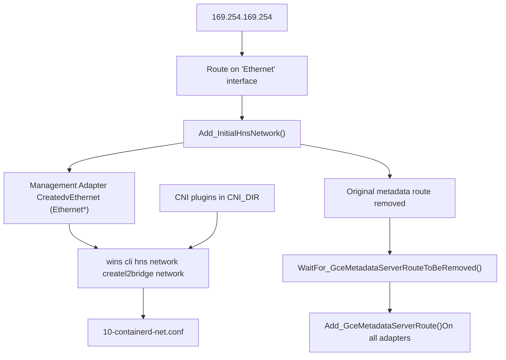
```mermaid
flowchart TD
    MetadataIP["169.254.169.254"]
    MetadataRoute["Route on 'Ethernet' interface"]
    CreateHNS["Add_InitialHnsNetwork()"]
    MgmtAdapter["Management Adapter CreatedvEthernet (Ethernet*)"]
    RouteRemoved["Original metadata route removed"]
    WaitForRemoval["WaitFor_GceMetadataServerRouteToBeRemoved()"]
    AddRouteBack["Add_GceMetadataServerRoute()On all adapters"]
    CNIConfig["wins cli hns network createl2bridge network"]
    CNIBinaries["CNI plugins in CNI_DIR"]
    ConfigFile["10-containerd-net.conf"]

    MetadataIP --> MetadataRoute
    MetadataRoute --> CreateHNS
    CreateHNS --> MgmtAdapter
    CreateHNS --> RouteRemoved
    RouteRemoved --> WaitForRemoval
    WaitForRemoval --> AddRouteBack
    MgmtAdapter --> CNIConfig
    CNIBinaries --> CNIConfig
    CNIConfig --> ConfigFile
```
`Add_InitialHnsNetwork()` 函数（[cluster/gce/windows/k8s-node-setup.psm1546-583](https://github.com/kubernetes/kubernetes/blob/2757a872/cluster/gce/windows/k8s-node-setup.psm1#L546-L583)）会创建初始 HNS 网络以启用 Pod 网络。由于 HNS 会修改网络配置，初始化后必须重新添加元数据服务器路由。

来源： [cluster/gce/windows/k8s-node-setup.psm184-136](https://github.com/kubernetes/kubernetes/blob/2757a872/cluster/gce/windows/k8s-node-setup.psm1#L84-L136) [cluster/gce/windows/k8s-node-setup.psm1546-683](https://github.com/kubernetes/kubernetes/blob/2757a872/cluster/gce/windows/k8s-node-setup.psm1#L546-L683)

### Windows Kubelet 配置

Windows kubelet 配置与 Linux 类似，但路径为 Windows 风格：

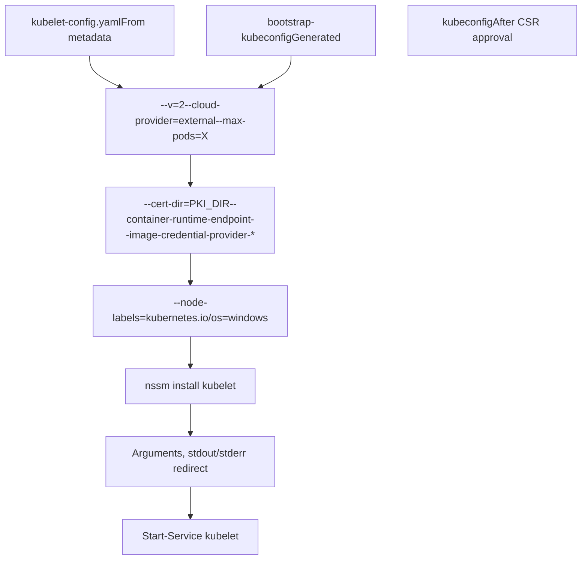
```mermaid
flowchart TD
    KubeletConfig["kubelet-config.yamlFrom metadata"]
    BootstrapKubeconfig["bootstrap-kubeconfigGenerated"]
    Kubeconfig["kubeconfigAfter CSR approval"]
    CommonFlags["--v=2--cloud-provider=external--max-pods=X"]
    WindowsFlags["--cert-dir=PKI_DIR--container-runtime-endpoint--image-credential-provider-*"]
    NodeLabels["--node-labels=kubernetes.io/os=windows"]
    ServiceDef["nssm install kubelet"]
    ServiceParams["Arguments, stdout/stderr redirect"]
    ServiceStart["Start-Service kubelet"]

    KubeletConfig --> CommonFlags
    BootstrapKubeconfig --> CommonFlags
    CommonFlags --> WindowsFlags
    WindowsFlags --> NodeLabels
    NodeLabels --> ServiceDef
    ServiceDef --> ServiceParams
    ServiceParams --> ServiceStart
```
`Configure-Kubelet()` 函数（[cluster/gce/windows/k8s-node-setup.psm11420-1492](https://github.com/kubernetes/kubernetes/blob/2757a872/cluster/gce/windows/k8s-node-setup.psm1#L1420-L1492)）使用 `nssm`（Non-Sucking Service Manager）将 kubelet 安装为 Windows 服务，并设置合适的环境变量及输出重定向。

来源： [cluster/gce/windows/k8s-node-setup.psm11420-1492](https://github.com/kubernetes/kubernetes/blob/2757a872/cluster/gce/windows/k8s-node-setup.psm1#L1420-L1492)

### Windows 特有组件

Windows 节点需要 Linux 上没有的额外组件：

**CSI Proxy：**

-   使 CSI 驱动能够执行特权操作
-   由 `DownloadAndInstall-CSIProxyBinaries()` 安装（[cluster/gce/windows/k8s-node-setup.psm1908-944](https://github.com/kubernetes/kubernetes/blob/2757a872/cluster/gce/windows/k8s-node-setup.psm1#L908-L944)）
-   通过 `nssm` 作为服务运行
-   通过 `CSI_PROXY_VERSION` 与 `CSI_PROXY_FLAGS` 配置

**Auth Provider GCP：**

-   用于从 GCR/Artifact Registry 拉取镜像的镜像凭据提供器
-   由 `ENABLE_AUTH_PROVIDER_GCP` 控制（默认：true）
-   二进制：`auth-provider-gcp.exe`
-   配置：`K8S_DIR` 下的 `cri-auth-config.yaml`
-   Kubelet flags：`--image-credential-provider-config` 与 `--image-credential-provider-bin-dir`

**Node Problem Detector：**

-   可选的 Windows 实现
-   通过 `ENABLE_NODE_PROBLEM_DETECTOR` 配置
-   使用独立 kubeconfig：`NODEPROBLEMDETECTOR_KUBECONFIG_FILE`

来源： [cluster/gce/windows/k8s-node-setup.psm1908-944](https://github.com/kubernetes/kubernetes/blob/2757a872/cluster/gce/windows/k8s-node-setup.psm1#L908-L944) [cluster/gce/windows/k8s-node-setup.psm11048-1097](https://github.com/kubernetes/kubernetes/blob/2757a872/cluster/gce/windows/k8s-node-setup.psm1#L1048-L1097) [cluster/gce/windows/k8s-node-setup.psm11524-1584](https://github.com/kubernetes/kubernetes/blob/2757a872/cluster/gce/windows/k8s-node-setup.psm1#L1524-L1584)

## 网络配置

GCE 集群网络涉及 IP 别名、防火墙规则与服务路由。

### IP 别名架构

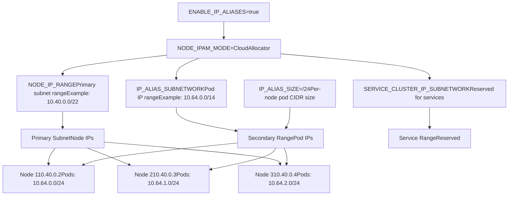
```mermaid
flowchart TD
    EnableIPAliases["ENABLE_IP_ALIASES=true"]
    NodeIPAMMode["NODE_IPAM_MODE=CloudAllocator"]
    PrimaryRange["NODE_IP_RANGEPrimary subnet rangeExample: 10.40.0.0/22"]
    SecondaryRange["IP_ALIAS_SUBNETWORKPod IP rangeExample: 10.64.0.0/14"]
    ServiceRange["SERVICE_CLUSTER_IP_SUBNETWORKReserved for services"]
    AliasSize["IP_ALIAS_SIZE=/24Per-node pod CIDR size"]
    PrimarySubnet["Primary SubnetNode IPs"]
    SecondarySubnet["Secondary RangePod IPs"]
    ServiceSubnet["Service RangeReserved"]
    Node1["Node 110.40.0.2Pods: 10.64.0.0/24"]
    Node2["Node 210.40.0.3Pods: 10.64.1.0/24"]
    Node3["Node 310.40.0.4Pods: 10.64.2.0/24"]

    EnableIPAliases --> NodeIPAMMode
    NodeIPAMMode --> PrimaryRange
    NodeIPAMMode --> SecondaryRange
    NodeIPAMMode --> ServiceRange
    PrimaryRange --> PrimarySubnet
    SecondaryRange --> SecondarySubnet
    ServiceRange --> ServiceSubnet
    AliasSize --> SecondarySubnet
    PrimarySubnet --> Node1
    PrimarySubnet --> Node2
    PrimarySubnet --> Node3
    SecondarySubnet --> Node1
    SecondarySubnet --> Node2
    SecondarySubnet --> Node3
```
当 `ENABLE_IP_ALIASES=true` 时：

-   `NODE_IPAM_MODE` 切换为 `CloudAllocator`（使用 GCE API 分配 Pod CIDR）
-   每个节点从次级地址段获取一个 `/24` Pod CIDR
-   不会在 GCE 路由表中创建路由（流量通过别名 IP 路由）
-   支持每集群超过 100 个节点

`get-alias-range-size()` 函数（[cluster/gce/config-common.sh111-118](https://github.com/kubernetes/kubernetes/blob/2757a872/cluster/gce/config-common.sh#L111-L118)）会基于 `MAX_PODS_PER_NODE` 计算别名范围大小（默认：110 Pod = /24 CIDR）。

来源： [cluster/gce/config-default.sh322-352](https://github.com/kubernetes/kubernetes/blob/2757a872/cluster/gce/config-default.sh#L322-L352) [cluster/gce/config-common.sh111-118](https://github.com/kubernetes/kubernetes/blob/2757a872/cluster/gce/config-common.sh#L111-L118)

### 防火墙规则

配置系统会创建用于集群通信的防火墙规则：

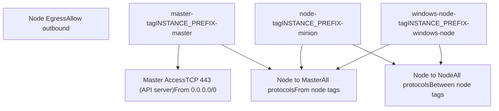
```mermaid
flowchart TD
    MasterAccess["Master AccessTCP 443 (API server)From 0.0.0.0/0"]
    NodeToMaster["Node to MasterAll protocolsFrom node tags"]
    NodeToNode["Node to NodeAll protocolsBetween node tags"]
    NodeEgress["Node EgressAllow outbound"]
    MasterTag["master-tagINSTANCE_PREFIX-master"]
    NodeTag["node-tagINSTANCE_PREFIX-minion"]
    WindowsNodeTag["windows-node-tagINSTANCE_PREFIX-windows-node"]

    MasterTag --> MasterAccess
    MasterTag --> NodeToMaster
    NodeTag --> NodeToMaster
    WindowsNodeTag --> NodeToMaster
    NodeTag --> NodeToNode
    WindowsNodeTag --> NodeToNode
```
防火墙规则使用网络标签进行选择：

-   主节点实例标签为 `${INSTANCE_PREFIX}-master`
-   Linux 节点标签为 `${INSTANCE_PREFIX}-minion`
-   Windows 节点标签为 `${INSTANCE_PREFIX}-windows-node`

来源： [cluster/gce/util.sh129-134](https://github.com/kubernetes/kubernetes/blob/2757a872/cluster/gce/util.sh#L129-L134) [cluster/gce/config-test.sh141-151](https://github.com/kubernetes/kubernetes/blob/2757a872/cluster/gce/config-test.sh#L141-L151)

### 自定义网络创建

当 `CREATE_CUSTOM_NETWORK=true` 时，系统会创建专用 VPC：

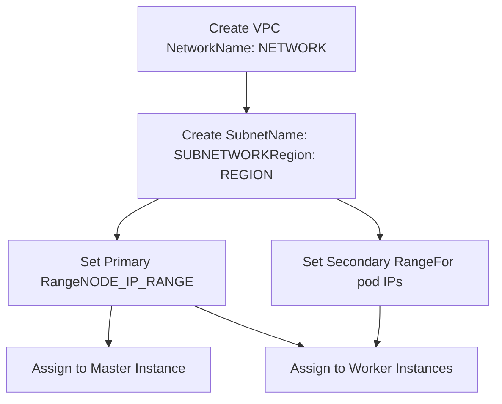
```mermaid
flowchart TD
    CreateNetwork["Create VPC NetworkName: NETWORK"]
    CreateSubnet["Create SubnetName: SUBNETWORKRegion: REGION"]
    SetPrimaryRange["Set Primary RangeNODE_IP_RANGE"]
    SetSecondaryRange["Set Secondary RangeFor pod IPs"]
    AssignToMaster["Assign to Master Instance"]
    AssignToNodes["Assign to Worker Instances"]

    CreateNetwork --> CreateSubnet
    CreateSubnet --> SetPrimaryRange
    CreateSubnet --> SetSecondaryRange
    SetPrimaryRange --> AssignToMaster
    SetPrimaryRange --> AssignToNodes
    SetSecondaryRange --> AssignToNodes
```
自定义网络可实现：

-   与其他集群隔离
-   自定义 IP 范围
-   可控子网配置
-   网络策略测试

来源： [cluster/gce/config-default.sh62](https://github.com/kubernetes/kubernetes/blob/2757a872/cluster/gce/config-default.sh#L62-L62) [cluster/gce/config-default.sh135-137](https://github.com/kubernetes/kubernetes/blob/2757a872/cluster/gce/config-default.sh#L135-L137)

## kube-env 元数据格式

`kube-env` 元数据键使用 YAML 格式进行配置分发。

### kube-env 结构

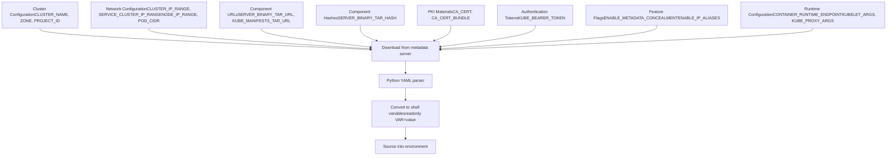
```mermaid
flowchart TD
    ClusterConfig["Cluster ConfigurationCLUSTER_NAME, ZONE, PROJECT_ID"]
    NetworkConfig["Network ConfigurationCLUSTER_IP_RANGE, SERVICE_CLUSTER_IP_RANGENODE_IP_RANGE, POD_CIDR"]
    ComponentURLs["Component URLsSERVER_BINARY_TAR_URL, KUBE_MANIFESTS_TAR_URL"]
    ComponentHashes["Component HashesSERVER_BINARY_TAR_HASH"]
    Certificates["PKI MaterialsCA_CERT, CA_CERT_BUNDLE"]
    Tokens["Authentication TokensKUBE_BEARER_TOKEN"]
    FeatureFlags["Feature FlagsENABLE_METADATA_CONCEALMENTENABLE_IP_ALIASES"]
    RuntimeConfig["Runtime ConfigurationCONTAINER_RUNTIME_ENDPOINTKUBELET_ARGS, KUBE_PROXY_ARGS"]
    DownloadYAML["Download from metadata server"]
    ParsePython["Python YAML parser"]
    ShellVars["Convert to shell variablesreadonly VAR=value"]
    LoadIntoEnv["Source into environment"]

    ClusterConfig --> DownloadYAML
    NetworkConfig --> DownloadYAML
    ComponentURLs --> DownloadYAML
    ComponentHashes --> DownloadYAML
    Certificates --> DownloadYAML
    Tokens --> DownloadYAML
    FeatureFlags --> DownloadYAML
    RuntimeConfig --> DownloadYAML
    DownloadYAML --> ParsePython
    ParsePython --> ShellVars
    ShellVars --> LoadIntoEnv
```
`download-kube-env()` 函数（[cluster/gce/gci/configure.sh84-103](https://github.com/kubernetes/kubernetes/blob/2757a872/cluster/gce/gci/configure.sh#L84-L103)）会抓取并解析该 YAML：

1.  从 `http://metadata.google.internal/computeMetadata/v1/instance/attributes/kube-env` 下载
2.  使用 Python 的 `yaml.load()` 与 `BaseLoader` 解析
3.  使用 `pipes.quote()` 生成带正确引号的 shell 变量赋值
4.  写入 `/home/kubernetes/kube-env` 并 `source`

在 Windows 上，`ConvertFrom_Yaml_KubeEnv()`（[cluster/gce/windows/k8s-node-setup.psm1182-213](https://github.com/kubernetes/kubernetes/blob/2757a872/cluster/gce/windows/k8s-node-setup.psm1#L182-L213)）会将 YAML 解析为 PowerShell HashTable。

来源： [cluster/gce/gci/configure.sh84-103](https://github.com/kubernetes/kubernetes/blob/2757a872/cluster/gce/gci/configure.sh#L84-L103) [cluster/gce/windows/k8s-node-setup.psm1182-213](https://github.com/kubernetes/kubernetes/blob/2757a872/cluster/gce/windows/k8s-node-setup.psm1#L182-L213)

### build-linux-kube-env 函数

`build-linux-kube-env()` 函数（[cluster/gce/util.sh1010-1228](https://github.com/kubernetes/kubernetes/blob/2757a872/cluster/gce/util.sh#L1010-L1228)）会根据环境变量生成 kube-env YAML。关键变量分类包括：

**集群标识：**

-   `CLUSTER_NAME`、`INSTANCE_PREFIX`
-   `PROJECT_ID`、`NETWORK_PROJECT_ID`
-   `ZONE`、`REGION`

**网络：**

-   `CLUSTER_IP_RANGE`、`SERVICE_CLUSTER_IP_RANGE`
-   `NODE_IP_RANGE`、`SECONDARY_RANGE_NAME`
-   `ENABLE_IP_ALIASES`、`NODE_IPAM_MODE`
-   `NETWORK_PROVIDER`、`NETWORK_POLICY_PROVIDER`

**组件配置：**

-   `SERVER_BINARY_TAR_URL`、`SERVER_BINARY_TAR_HASH`
-   `KUBE_MANIFESTS_TAR_URL`、`KUBE_MANIFESTS_TAR_HASH`
-   `KUBELET_ARGS`、`KUBE_PROXY_ARGS`
-   `CONTAINER_RUNTIME_ENDPOINT`、`CONTAINER_RUNTIME_NAME`

**特性开关：**

-   `ENABLE_METADATA_CONCEALMENT`
-   `ENABLE_NODE_PROBLEM_DETECTOR`
-   `ENABLE_CSI_PROXY`（Windows）

来源： [cluster/gce/util.sh1010-1228](https://github.com/kubernetes/kubernetes/blob/2757a872/cluster/gce/util.sh#L1010-L1228)

## 集群附加组件与清单

GCE 集群会在配置期间安装附加组件。

### 附加组件分发

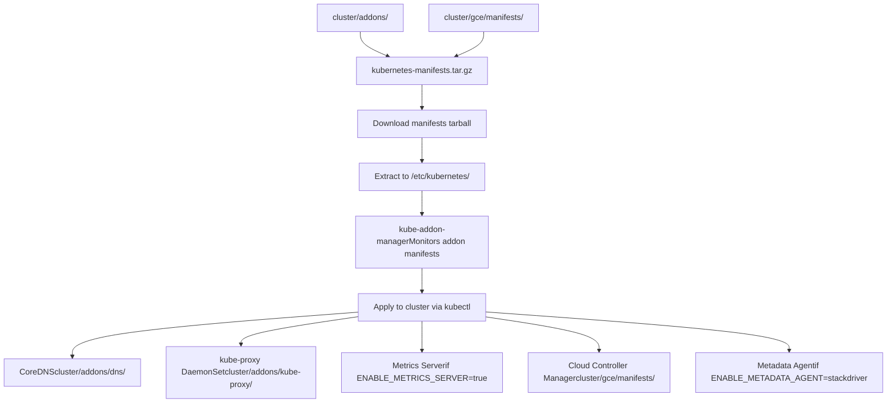
```mermaid
flowchart TD
    ManifestsTar["kubernetes-manifests.tar.gz"]
    AddonsDir["cluster/addons/"]
    GCEManifestsDir["cluster/gce/manifests/"]
    DownloadManifests["Download manifests tarball"]
    ExtractManifests["Extract to /etc/kubernetes/"]
    AddonManager["kube-addon-managerMonitors addon manifests"]
    ApplyAddons["Apply to cluster via kubectl"]
    CoreDNS["CoreDNScluster/addons/dns/"]
    KubeProxy["kube-proxy DaemonSetcluster/addons/kube-proxy/"]
    MetricsServer["Metrics Serverif ENABLE_METRICS_SERVER=true"]
    CCM["Cloud Controller Managercluster/gce/manifests/"]
    Metadata["Metadata Agentif ENABLE_METADATA_AGENT=stackdriver"]

    ManifestsTar --> DownloadManifests
    AddonsDir --> ManifestsTar
    GCEManifestsDir --> ManifestsTar
    DownloadManifests --> ExtractManifests
    ExtractManifests --> AddonManager
    AddonManager --> ApplyAddons
    ApplyAddons --> CoreDNS
    ApplyAddons --> KubeProxy
    ApplyAddons --> MetricsServer
    ApplyAddons --> CCM
    ApplyAddons --> Metadata
```
来源： [cluster/gce/gci/configure.sh414-439](https://github.com/kubernetes/kubernetes/blob/2757a872/cluster/gce/gci/configure.sh#L414-L439) [cluster/addons/kube-proxy/kube-proxy-ds.yaml](https://github.com/kubernetes/kubernetes/blob/2757a872/cluster/addons/kube-proxy/kube-proxy-ds.yaml)

### 云控制器管理器配置

云控制器管理器在主节点上以静态 Pod 运行：

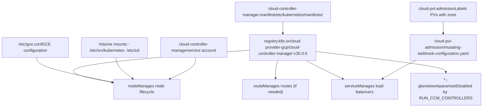
```mermaid
flowchart TD
    Manifest["cloud-controller-manager.manifest/etc/kubernetes/manifests/"]
    Image["registry.k8s.io/cloud-provider-gcp/cloud-controller-manager:v35.0.0"]
    NodeController["nodeManages node lifecycle"]
    RouteController["routeManages routes (if needed)"]
    ServiceController["serviceManages load balancers"]
    SkipGKE["*,-gkenetworkparamsetDisabled by RUN_CCM_CONTROLLERS"]
    CloudConfig["/etc/gce.confGCE configuration"]
    PKIMounts["Volume mounts:- /etc/srv/kubernetes- /etc/ssl"]
    ServiceAccount["cloud-controller-managerservice account"]
    CloudPVLAdmission["cloud-pvl-admissionLabels PVs with zone"]
    WebhookConfig["cloud-pvl-admission/mutating-webhook-configuration.yaml"]

    Manifest --> Image
    Image --> NodeController
    Image --> RouteController
    Image --> ServiceController
    Image --> SkipGKE
    CloudConfig --> NodeController
    PKIMounts --> NodeController
    ServiceAccount --> NodeController
    CloudPVLAdmission --> WebhookConfig
    WebhookConfig --> ServiceController
```
CCM 通过 `create-master-gce-conf` 函数配置，该函数会写入 `/etc/gce.conf`，包含：

-   `api-endpoint`：自定义 GCE API endpoint（若设置 `GCE_API_ENDPOINT`）
-   `project-id`：GCP 项目
-   `network-project-id`：网络宿主项目（用于共享 VPC）
-   `network-name`、`subnetwork-name`：VPC 配置
-   `node-instance-prefix`、`node-tags`：节点标识
-   `multizone`、`regional`：多可用区/区域集群开关

cloud-pvl-admission 边车容器会在创建 PV 时自动给 GCE Persistent Disk 标注可用区信息。

来源： [cluster/gce/gci/configure-helper.sh875-1028](https://github.com/kubernetes/kubernetes/blob/2757a872/cluster/gce/gci/configure-helper.sh#L875-L1028) [cluster/gce/manifests/cloud-controller-manager.manifest1-130](https://github.com/kubernetes/kubernetes/blob/2757a872/cluster/gce/manifests/cloud-controller-manager.manifest#L1-L130) [cluster/gce/addons/cloud-pvl-admission/mutating-webhook-configuration.yaml](https://github.com/kubernetes/kubernetes/blob/2757a872/cluster/gce/addons/cloud-pvl-admission/mutating-webhook-configuration.yaml)

### kube-proxy DaemonSet 配置

当 `KUBE_PROXY_DAEMONSET=true` 时，kube-proxy 以 DaemonSet 而非静态 Pod 方式运行：

**DaemonSet 配置：**

-   节点选择器：`node.kubernetes.io/kube-proxy-ds-ready=true`（节点配置期间设置）
-   节点选择器：`kubernetes.io/os=linux`（仅 Linux 节点）
-   容忍：可在所有节点（含 master）上运行
-   资源：通过 `cpurequest` 和 `memoryrequest` 配置
-   卷挂载：`/var/log`、`/run/xtables.lock`、`/lib/modules`

标签 `node.kubernetes.io/kube-proxy-ds-ready=true` 会由 `build-linux-node-labels()`（[cluster/gce/util.sh630-634](https://github.com/kubernetes/kubernetes/blob/2757a872/cluster/gce/util.sh#L630-L634)）添加到节点，防止集群升级期间出现两个 kube-proxy 实例。

来源： [cluster/addons/kube-proxy/kube-proxy-ds.yaml](https://github.com/kubernetes/kubernetes/blob/2757a872/cluster/addons/kube-proxy/kube-proxy-ds.yaml) [cluster/gce/util.sh627-645](https://github.com/kubernetes/kubernetes/blob/2757a872/cluster/gce/util.sh#L627-L645)
