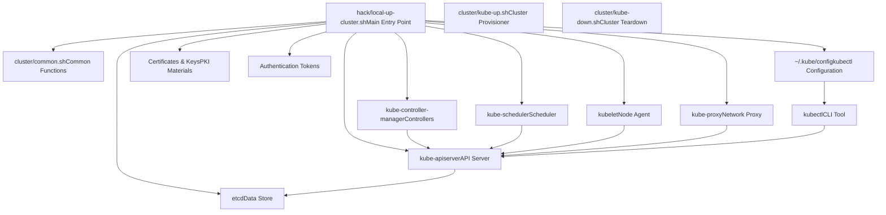
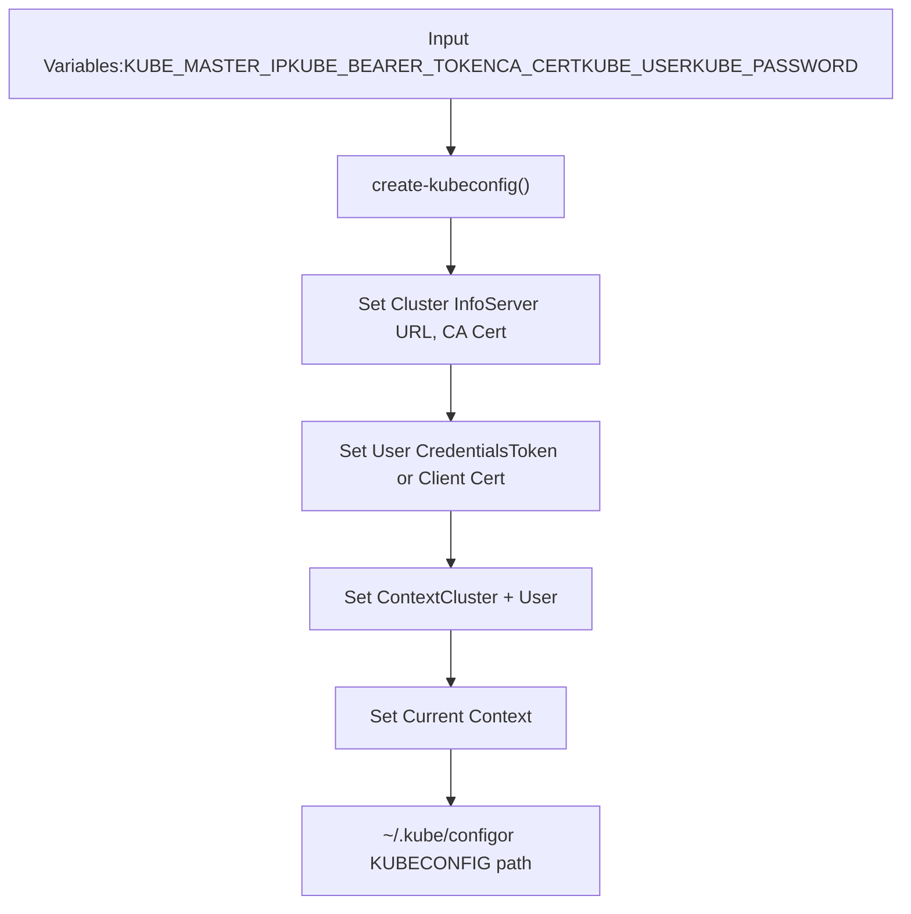
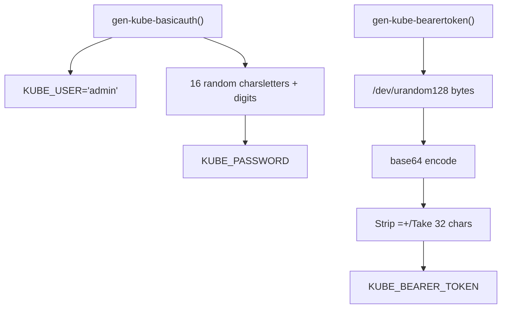
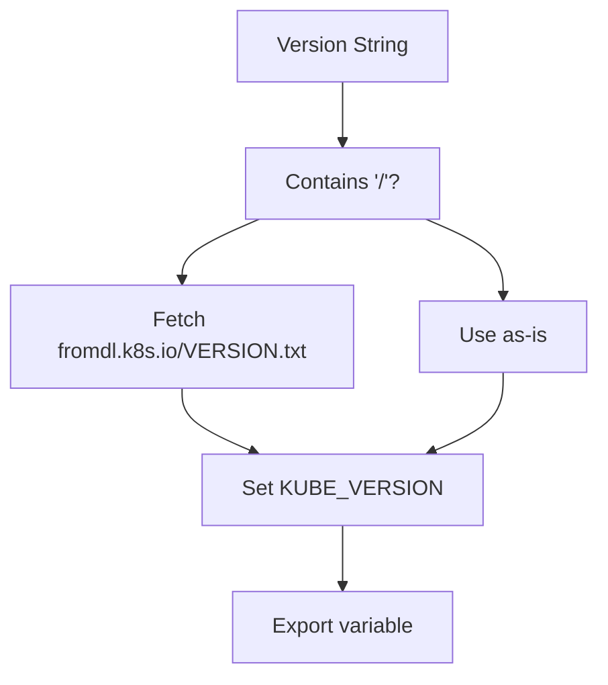
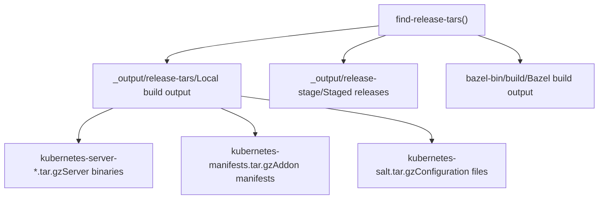
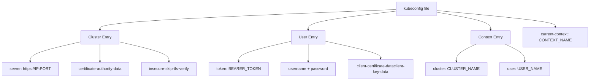
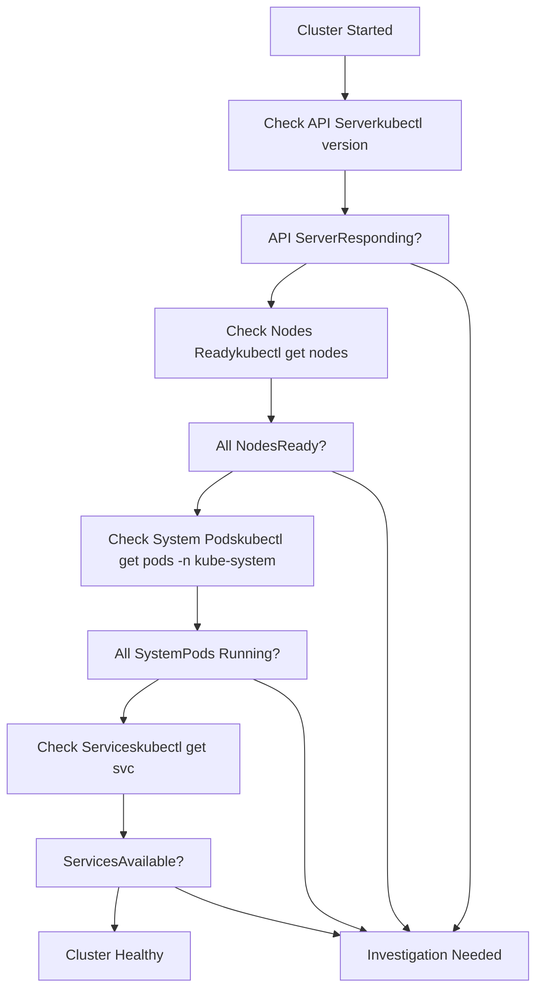

# 本地开发环境

相关源文件

-   [.go-version](https://github.com/kubernetes/kubernetes/blob/2757a872/.go-version)
-   [build/build-image/cross/VERSION](https://github.com/kubernetes/kubernetes/blob/2757a872/build/build-image/cross/VERSION)
-   [build/common.sh](https://github.com/kubernetes/kubernetes/blob/2757a872/build/common.sh)
-   [build/dependencies.yaml](https://github.com/kubernetes/kubernetes/blob/2757a872/build/dependencies.yaml)
-   [build/root/Makefile](https://github.com/kubernetes/kubernetes/blob/2757a872/build/root/Makefile)
-   [cluster/gce/manifests/etcd.manifest](https://github.com/kubernetes/kubernetes/blob/2757a872/cluster/gce/manifests/etcd.manifest)
-   [cluster/gce/upgrade-aliases.sh](https://github.com/kubernetes/kubernetes/blob/2757a872/cluster/gce/upgrade-aliases.sh)
-   [cmd/kubeadm/app/constants/constants.go](https://github.com/kubernetes/kubernetes/blob/2757a872/cmd/kubeadm/app/constants/constants.go)
-   [cmd/kubeadm/app/constants/constants\_test.go](https://github.com/kubernetes/kubernetes/blob/2757a872/cmd/kubeadm/app/constants/constants_test.go)
-   [cmd/kubeadm/app/constants/constants\_unix.go](https://github.com/kubernetes/kubernetes/blob/2757a872/cmd/kubeadm/app/constants/constants_unix.go)
-   [cmd/kubeadm/app/constants/constants\_windows.go](https://github.com/kubernetes/kubernetes/blob/2757a872/cmd/kubeadm/app/constants/constants_windows.go)
-   [cmd/kubeadm/app/images/images.go](https://github.com/kubernetes/kubernetes/blob/2757a872/cmd/kubeadm/app/images/images.go)
-   [cmd/kubeadm/app/images/images\_test.go](https://github.com/kubernetes/kubernetes/blob/2757a872/cmd/kubeadm/app/images/images_test.go)
-   [cmd/kubeadm/app/phases/patchnode/patchnode\_test.go](https://github.com/kubernetes/kubernetes/blob/2757a872/cmd/kubeadm/app/phases/patchnode/patchnode_test.go)
-   [go.work](https://github.com/kubernetes/kubernetes/blob/2757a872/go.work)
-   [hack/ginkgo-e2e.sh](https://github.com/kubernetes/kubernetes/blob/2757a872/hack/ginkgo-e2e.sh)
-   [hack/lib/etcd.sh](https://github.com/kubernetes/kubernetes/blob/2757a872/hack/lib/etcd.sh)
-   [hack/lib/golang.sh](https://github.com/kubernetes/kubernetes/blob/2757a872/hack/lib/golang.sh)
-   [hack/lib/init.sh](https://github.com/kubernetes/kubernetes/blob/2757a872/hack/lib/init.sh)
-   [hack/local-up-cluster.sh](https://github.com/kubernetes/kubernetes/blob/2757a872/hack/local-up-cluster.sh)
-   [hack/make-rules/test-e2e-node.sh](https://github.com/kubernetes/kubernetes/blob/2757a872/hack/make-rules/test-e2e-node.sh)
-   [staging/README.md](https://github.com/kubernetes/kubernetes/blob/2757a872/staging/README.md?plain=1)
-   [staging/publishing/import-restrictions.yaml](https://github.com/kubernetes/kubernetes/blob/2757a872/staging/publishing/import-restrictions.yaml)
-   [staging/publishing/rules.yaml](https://github.com/kubernetes/kubernetes/blob/2757a872/staging/publishing/rules.yaml)
-   [staging/src/k8s.io/sample-apiserver/artifacts/example/deployment.yaml](https://github.com/kubernetes/kubernetes/blob/2757a872/staging/src/k8s.io/sample-apiserver/artifacts/example/deployment.yaml)
-   [test/e2e/chaosmonkey/chaosmonkey.go](https://github.com/kubernetes/kubernetes/blob/2757a872/test/e2e/chaosmonkey/chaosmonkey.go)
-   [test/e2e/e2e.go](https://github.com/kubernetes/kubernetes/blob/2757a872/test/e2e/e2e.go)
-   [test/e2e/e2e\_test.go](https://github.com/kubernetes/kubernetes/blob/2757a872/test/e2e/e2e_test.go)
-   [test/e2e/framework/framework.go](https://github.com/kubernetes/kubernetes/blob/2757a872/test/e2e/framework/framework.go)
-   [test/e2e/framework/kubelet/kubelet\_pods.go](https://github.com/kubernetes/kubernetes/blob/2757a872/test/e2e/framework/kubelet/kubelet_pods.go)
-   [test/e2e/framework/kubelet/stats.go](https://github.com/kubernetes/kubernetes/blob/2757a872/test/e2e/framework/kubelet/stats.go)
-   [test/e2e/framework/nodes\_util.go](https://github.com/kubernetes/kubernetes/blob/2757a872/test/e2e/framework/nodes_util.go)
-   [test/e2e/framework/providers/gcp.go](https://github.com/kubernetes/kubernetes/blob/2757a872/test/e2e/framework/providers/gcp.go)
-   [test/e2e/framework/test\_context.go](https://github.com/kubernetes/kubernetes/blob/2757a872/test/e2e/framework/test_context.go)
-   [test/e2e/framework/util.go](https://github.com/kubernetes/kubernetes/blob/2757a872/test/e2e/framework/util.go)
-   [test/e2e/reporters/progress.go](https://github.com/kubernetes/kubernetes/blob/2757a872/test/e2e/reporters/progress.go)
-   [test/e2e/scheduling/framework.go](https://github.com/kubernetes/kubernetes/blob/2757a872/test/e2e/scheduling/framework.go)
-   [test/e2e/scheduling/limit\_range.go](https://github.com/kubernetes/kubernetes/blob/2757a872/test/e2e/scheduling/limit_range.go)
-   [test/e2e/scheduling/predicates.go](https://github.com/kubernetes/kubernetes/blob/2757a872/test/e2e/scheduling/predicates.go)
-   [test/e2e/scheduling/preemption.go](https://github.com/kubernetes/kubernetes/blob/2757a872/test/e2e/scheduling/preemption.go)
-   [test/e2e/scheduling/priorities.go](https://github.com/kubernetes/kubernetes/blob/2757a872/test/e2e/scheduling/priorities.go)
-   [test/e2e/scheduling/ubernetes\_lite.go](https://github.com/kubernetes/kubernetes/blob/2757a872/test/e2e/scheduling/ubernetes_lite.go)
-   [test/e2e/suites.go](https://github.com/kubernetes/kubernetes/blob/2757a872/test/e2e/suites.go)
-   [test/e2e/upgrades/network/kube\_proxy\_migration.go](https://github.com/kubernetes/kubernetes/blob/2757a872/test/e2e/upgrades/network/kube_proxy_migration.go)
-   [test/e2e/windows/device\_plugin.go](https://github.com/kubernetes/kubernetes/blob/2757a872/test/e2e/windows/device_plugin.go)
-   [test/e2e\_kubeadm/e2e\_kubeadm\_suite\_test.go](https://github.com/kubernetes/kubernetes/blob/2757a872/test/e2e_kubeadm/e2e_kubeadm_suite_test.go)
-   [test/e2e\_node/builder/build.go](https://github.com/kubernetes/kubernetes/blob/2757a872/test/e2e_node/builder/build.go)
-   [test/e2e\_node/conformance/run\_test.sh](https://github.com/kubernetes/kubernetes/blob/2757a872/test/e2e_node/conformance/run_test.sh)
-   [test/e2e\_node/e2e\_node\_suite\_test.go](https://github.com/kubernetes/kubernetes/blob/2757a872/test/e2e_node/e2e_node_suite_test.go)
-   [test/e2e\_node/kubeletconfig/kubeletconfig.go](https://github.com/kubernetes/kubernetes/blob/2757a872/test/e2e_node/kubeletconfig/kubeletconfig.go)
-   [test/e2e\_node/remote/cadvisor\_e2e.go](https://github.com/kubernetes/kubernetes/blob/2757a872/test/e2e_node/remote/cadvisor_e2e.go)
-   [test/e2e\_node/remote/node\_conformance.go](https://github.com/kubernetes/kubernetes/blob/2757a872/test/e2e_node/remote/node_conformance.go)
-   [test/e2e\_node/remote/node\_e2e.go](https://github.com/kubernetes/kubernetes/blob/2757a872/test/e2e_node/remote/node_e2e.go)
-   [test/e2e\_node/remote/remote.go](https://github.com/kubernetes/kubernetes/blob/2757a872/test/e2e_node/remote/remote.go)
-   [test/e2e\_node/remote/types.go](https://github.com/kubernetes/kubernetes/blob/2757a872/test/e2e_node/remote/types.go)
-   [test/e2e\_node/remote/utils.go](https://github.com/kubernetes/kubernetes/blob/2757a872/test/e2e_node/remote/utils.go)
-   [test/e2e\_node/runner/local/run\_local.go](https://github.com/kubernetes/kubernetes/blob/2757a872/test/e2e_node/runner/local/run_local.go)
-   [test/e2e\_node/runner/remote/run\_remote.go](https://github.com/kubernetes/kubernetes/blob/2757a872/test/e2e_node/runner/remote/run_remote.go)
-   [test/e2e\_node/services/kubelet.go](https://github.com/kubernetes/kubernetes/blob/2757a872/test/e2e_node/services/kubelet.go)
-   [test/e2e\_node/services/server.go](https://github.com/kubernetes/kubernetes/blob/2757a872/test/e2e_node/services/server.go)
-   [test/e2e\_node/services/services.go](https://github.com/kubernetes/kubernetes/blob/2757a872/test/e2e_node/services/services.go)
-   [test/e2e\_node/services/util.go](https://github.com/kubernetes/kubernetes/blob/2757a872/test/e2e_node/services/util.go)
-   [test/images/Makefile](https://github.com/kubernetes/kubernetes/blob/2757a872/test/images/Makefile)
-   [test/utils/image/manifest.go](https://github.com/kubernetes/kubernetes/blob/2757a872/test/utils/image/manifest.go)
-   [test/utils/image/manifest\_test.go](https://github.com/kubernetes/kubernetes/blob/2757a872/test/utils/image/manifest_test.go)
-   [test/utils/paths.go](https://github.com/kubernetes/kubernetes/blob/2757a872/test/utils/paths.go)

## 目的与范围

本页说明如何为开发和测试目的搭建本地 Kubernetes 集群。内容涵盖在本地机器上启动开发集群所使用的脚本、工具和配置模式。关于在 GCE 上配置可用于生产的集群，请参见 [GCE Cluster Provisioning](/kubernetes/kubernetes/5.1-kubeadm-cli)。

本地开发环境让开发者能够：

-   在不部署到云厂商的情况下测试代码变更
-   快速迭代 Kubernetes 组件
-   调试控制平面与节点组件
-   在本地运行端到端测试

## 本地集群架构

本地开发搭建会创建一个适合开发的最小 Kubernetes 集群：


来源： [cluster/common.sh1-550](https://github.com/kubernetes/kubernetes/blob/2757a872/cluster/common.sh#L1-L550) [cluster/gce/windows/README-GCE-Windows-kube-up.md1-60](https://github.com/kubernetes/kubernetes/blob/2757a872/cluster/gce/windows/README-GCE-Windows-kube-up.md?plain=1#L1-L60)

## 环境变量与配置

本地集群搭建依赖环境变量来控制集群行为。该通用配置模式在本地集群和云集群之间共享：

| 变量 | 用途 | 默认值 |
| --- | --- | --- |
| `KUBE_VERSION` | 要部署的 Kubernetes 版本 | 来自构建的最新版本 |
| `NUM_NODES` | 工作节点数量 | 3 |
| `CLUSTER_IP_RANGE` | Pod CIDR 范围 | 自动计算 |
| `SERVICE_CLUSTER_IP_RANGE` | Service CIDR 范围 | `10.0.0.0/16` |
| `KUBELET_TEST_ARGS` | 额外 kubelet 参数 | 空 |
| `APISERVER_TEST_ARGS` | 额外 API server 参数 | 空 |
| `ENABLE_CLUSTER_DNS` | 启用 DNS addon | true |
| `ENABLE_CLUSTER_LOGGING` | 启用日志 addon | true |

来源： [cluster/gce/config-default.sh1-160](https://github.com/kubernetes/kubernetes/blob/2757a872/cluster/gce/config-default.sh#L1-L160) [cluster/gce/config-test.sh1-260](https://github.com/kubernetes/kubernetes/blob/2757a872/cluster/gce/config-test.sh#L1-L260) [cluster/gce/config-common.sh1-120](https://github.com/kubernetes/kubernetes/blob/2757a872/cluster/gce/config-common.sh#L1-L120)

## 通用搭建工具

### Kubeconfig 生成

`create-kubeconfig` 函数会生成带有适当认证信息的 kubectl 配置文件：


该函数支持多种认证方式：

-   通过 `KUBE_BEARER_TOKEN` 的 Bearer token 认证
-   通过 `KUBE_USER` 与 `KUBE_PASSWORD` 的 Basic 认证
-   通过 `KUBE_CERT` 与 `KUBE_KEY` 的客户端证书认证

来源： [cluster/common.sh68-138](https://github.com/kubernetes/kubernetes/blob/2757a872/cluster/common.sh#L68-L138)

### 认证信息生成

认证凭据通过安全随机函数生成：


位于 [cluster/common.sh254-256](https://github.com/kubernetes/kubernetes/blob/2757a872/cluster/common.sh#L254-L256) 的 `gen-kube-bearertoken` 函数使用 `/dev/urandom` 生成密码学安全 token。位于 [cluster/common.sh222-225](https://github.com/kubernetes/kubernetes/blob/2757a872/cluster/common.sh#L222-L225) 的 `gen-kube-basicauth` 函数会创建默认 admin 用户并生成随机密码。

来源： [cluster/common.sh218-276](https://github.com/kubernetes/kubernetes/blob/2757a872/cluster/common.sh#L218-L276)

## 二进制版本管理

`set_binary_version` 函数用于决定使用哪个 Kubernetes 二进制版本：


版本字符串可以是：

-   完整版本：`v1.28.0`
-   版本发布通道：`release/stable`（获取最新稳定版）
-   CI 版本发布通道：`ci/latest-1`（获取 CI 最新版本）

来源： [cluster/common.sh289-296](https://github.com/kubernetes/kubernetes/blob/2757a872/cluster/common.sh#L289-L296)

## 发布 tarball 管理

`find-release-tars` 函数会为部署查找 Kubernetes 发布 tarball：


该函数会按优先顺序在多个位置查找，并设置环境变量指向找到的 tarball：

-   `SERVER_BINARY_TAR` - 服务端二进制
-   `KUBE_MANIFESTS_TAR` - addon 的 YAML 清单
-   `SALT_TAR` - Salt 配置（遗留）

来源： [cluster/common.sh306-387](https://github.com/kubernetes/kubernetes/blob/2757a872/cluster/common.sh#L306-L387)

## 本地开发工作流

### 启动本地集群

启动本地开发集群的典型流程：

> **[Mermaid sequence]**
> *(图表结构无法解析)*

来源： [cluster/common.sh1-550](https://github.com/kubernetes/kubernetes/blob/2757a872/cluster/common.sh#L1-L550) [cluster/gce/windows/README-GCE-Windows-kube-up.md48-96](https://github.com/kubernetes/kubernetes/blob/2757a872/cluster/gce/windows/README-GCE-Windows-kube-up.md?plain=1#L48-L96)

### 环境准备

在启动本地集群之前，通常会做以下准备：

1.  **清理旧状态**（可选）：

```
rm -rf ./kubernetes/rm -f kubernetes.tar.gzrm -f ~/.kube/config
```
2.  **为云端测试准备凭据**：

```
gcloud auth application-default login
```
3.  **为本地平台构建二进制**：

```
KUBE_BUILD_PLATFORMS="linux/amd64" make quick-release
```
来源： [cluster/gce/windows/README-GCE-Windows-kube-up.md14-46](https://github.com/kubernetes/kubernetes/blob/2757a872/cluster/gce/windows/README-GCE-Windows-kube-up.md?plain=1#L14-L46)

## 配置文件结构

### Kubeconfig 文件格式

生成的 `~/.kube/config` 文件遵循以下结构：


位于 [cluster/common.sh68-138](https://github.com/kubernetes/kubernetes/blob/2757a872/cluster/common.sh#L68-L138) 的 `create-kubeconfig` 函数通过以下 `kubectl config` 命令创建该结构：

-   `kubectl config set-cluster` - 添加集群信息
-   `kubectl config set-credentials` - 添加用户凭据
-   `kubectl config set-context` - 关联集群与用户
-   `kubectl config use-context` - 设置当前上下文

来源： [cluster/common.sh68-138](https://github.com/kubernetes/kubernetes/blob/2757a872/cluster/common.sh#L68-L138)

## 测试与验证

### 集群健康检查

启动本地集群后，基础验证会确保组件正在运行：


来源： [cluster/gce/windows/smoke-test.sh46-59](https://github.com/kubernetes/kubernetes/blob/2757a872/cluster/gce/windows/smoke-test.sh#L46-L59)

### 组件日志位置

本地集群组件通常将日志写到标准位置：

| 组件 | 日志位置 |
| --- | --- |
| etcd | `/tmp/etcd.log` 或 stdout |
| kube-apiserver | `/tmp/kube-apiserver.log` 或 stdout |
| kube-controller-manager | `/tmp/kube-controller-manager.log` 或 stdout |
| kube-scheduler | `/tmp/kube-scheduler.log` 或 stdout |
| kubelet | `/tmp/kubelet.log` 或 stdout |
| kube-proxy | `/tmp/kube-proxy.log` 或 stdout |

来源： [cluster/gce/config-test.sh220-227](https://github.com/kubernetes/kubernetes/blob/2757a872/cluster/gce/config-test.sh#L220-L227)

## 与云配置的对比

本地开发环境与云集群虽用途不同，但共享基础设施：

| 方面 | 本地开发 | GCE 配置 |
| --- | --- | --- |
| **Setup Script** | `hack/local-up-cluster.sh` | `cluster/kube-up.sh` |
| **Common Utilities** | `cluster/common.sh` | `cluster/common.sh` |
| **Binary Source** | 本地构建或下载 | 上传到 GCS |
| **Node Count** | 1（单机） | 通过 `NUM_NODES` 可配置 |
| **Network Setup** | 本地网络 | GCE VPC 和子网 |
| **Storage** | 本地目录 | 持久盘 |
| **Authentication** | 生成 token | GCE 元数据 + token |
| **Configuration** | 环境变量 | GCE 元数据 + 环境变量 |

两者都使用：

-   同一 `create-kubeconfig` 函数来配置 kubectl
-   同一认证生成函数（`gen-kube-bearertoken`、`gen-kube-basicauth`）
-   同一版本管理方式 `set_binary_version`
-   同一 tarball 搜索逻辑 `find-release-tars`

来源： [cluster/common.sh1-550](https://github.com/kubernetes/kubernetes/blob/2757a872/cluster/common.sh#L1-L550) [cluster/gce/util.sh1-300](https://github.com/kubernetes/kubernetes/blob/2757a872/cluster/gce/util.sh#L1-L300) [cluster/gce/config-default.sh1-160](https://github.com/kubernetes/kubernetes/blob/2757a872/cluster/gce/config-default.sh#L1-L160)

## 高级配置选项

### 自定义 Feature Gates

通过 `FEATURE_GATES` 环境变量启用 alpha/beta 特性：

```
export FEATURE_GATES="FeatureName1=true,FeatureName2=false"
```
来源： [cluster/gce/config-test.sh169-171](https://github.com/kubernetes/kubernetes/blob/2757a872/cluster/gce/config-test.sh#L169-L171) [cluster/gce/config-default.sh271-273](https://github.com/kubernetes/kubernetes/blob/2757a872/cluster/gce/config-default.sh#L271-L273)

### 运行时配置

通过 `RUNTIME_CONFIG` 控制 API 版本与特性：

```
export RUNTIME_CONFIG="api/all=true"
```
这将启用所有 API 版本，包括 alpha 版本。

来源： [cluster/gce/config-test.sh160-164](https://github.com/kubernetes/kubernetes/blob/2757a872/cluster/gce/config-test.sh#L160-L164) [cluster/gce/config-default.sh259-263](https://github.com/kubernetes/kubernetes/blob/2757a872/cluster/gce/config-default.sh#L259-L263)

### 组件日志级别

控制日志详细度以便调试：

```
export KUBELET_TEST_LOG_LEVEL="--v=4"export API_SERVER_TEST_LOG_LEVEL="--v=6"
```
更高值（最高 `--v=10`）会提供更详细日志。

来源： [cluster/gce/config-test.sh221-227](https://github.com/kubernetes/kubernetes/blob/2757a872/cluster/gce/config-test.sh#L221-L227)

## 清理与拆除

停止本地集群通常包括：

1.  停止所有 Kubernetes 进程
2.  清理网络配置
3.  删除临时文件
4.  可选地保留日志以便调试

`cluster/kube-down.sh` 脚本负责云集群拆除，本地集群也会执行类似清理流程。

来源： [cluster/gce/windows/README-GCE-Windows-kube-up.md101-105](https://github.com/kubernetes/kubernetes/blob/2757a872/cluster/gce/windows/README-GCE-Windows-kube-up.md?plain=1#L101-L105)
