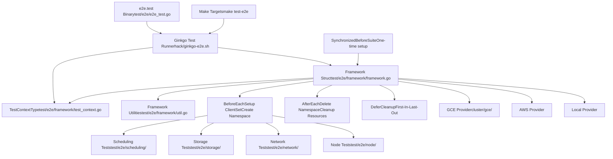
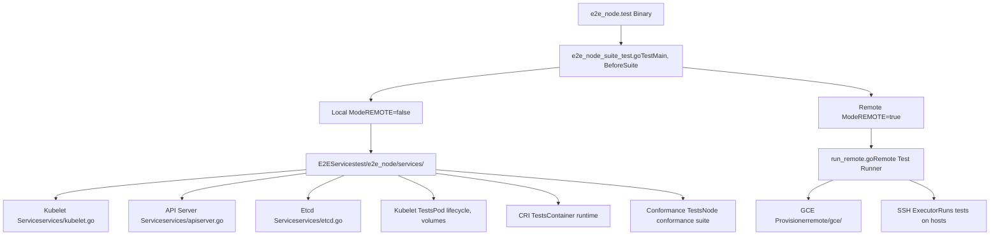
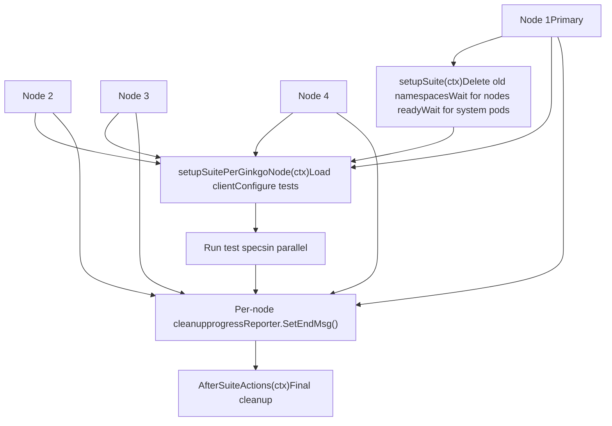

# 测试基础设施

相关源文件

-   [build/root/Makefile](https://github.com/kubernetes/kubernetes/blob/2757a872/build/root/Makefile)
-   [hack/ginkgo-e2e.sh](https://github.com/kubernetes/kubernetes/blob/2757a872/hack/ginkgo-e2e.sh)
-   [hack/lib/init.sh](https://github.com/kubernetes/kubernetes/blob/2757a872/hack/lib/init.sh)
-   [hack/local-up-cluster.sh](https://github.com/kubernetes/kubernetes/blob/2757a872/hack/local-up-cluster.sh)
-   [hack/make-rules/test-e2e-node.sh](https://github.com/kubernetes/kubernetes/blob/2757a872/hack/make-rules/test-e2e-node.sh)
-   [test/e2e/chaosmonkey/chaosmonkey.go](https://github.com/kubernetes/kubernetes/blob/2757a872/test/e2e/chaosmonkey/chaosmonkey.go)
-   [test/e2e/e2e.go](https://github.com/kubernetes/kubernetes/blob/2757a872/test/e2e/e2e.go)
-   [test/e2e/e2e\_test.go](https://github.com/kubernetes/kubernetes/blob/2757a872/test/e2e/e2e_test.go)
-   [test/e2e/framework/framework.go](https://github.com/kubernetes/kubernetes/blob/2757a872/test/e2e/framework/framework.go)
-   [test/e2e/framework/kubelet/kubelet\_pods.go](https://github.com/kubernetes/kubernetes/blob/2757a872/test/e2e/framework/kubelet/kubelet_pods.go)
-   [test/e2e/framework/kubelet/stats.go](https://github.com/kubernetes/kubernetes/blob/2757a872/test/e2e/framework/kubelet/stats.go)
-   [test/e2e/framework/test\_context.go](https://github.com/kubernetes/kubernetes/blob/2757a872/test/e2e/framework/test_context.go)
-   [test/e2e/framework/util.go](https://github.com/kubernetes/kubernetes/blob/2757a872/test/e2e/framework/util.go)
-   [test/e2e/reporters/progress.go](https://github.com/kubernetes/kubernetes/blob/2757a872/test/e2e/reporters/progress.go)
-   [test/e2e/scheduling/framework.go](https://github.com/kubernetes/kubernetes/blob/2757a872/test/e2e/scheduling/framework.go)
-   [test/e2e/scheduling/limit\_range.go](https://github.com/kubernetes/kubernetes/blob/2757a872/test/e2e/scheduling/limit_range.go)
-   [test/e2e/scheduling/predicates.go](https://github.com/kubernetes/kubernetes/blob/2757a872/test/e2e/scheduling/predicates.go)
-   [test/e2e/scheduling/preemption.go](https://github.com/kubernetes/kubernetes/blob/2757a872/test/e2e/scheduling/preemption.go)
-   [test/e2e/scheduling/priorities.go](https://github.com/kubernetes/kubernetes/blob/2757a872/test/e2e/scheduling/priorities.go)
-   [test/e2e/scheduling/ubernetes\_lite.go](https://github.com/kubernetes/kubernetes/blob/2757a872/test/e2e/scheduling/ubernetes_lite.go)
-   [test/e2e/suites.go](https://github.com/kubernetes/kubernetes/blob/2757a872/test/e2e/suites.go)
-   [test/e2e\_kubeadm/e2e\_kubeadm\_suite\_test.go](https://github.com/kubernetes/kubernetes/blob/2757a872/test/e2e_kubeadm/e2e_kubeadm_suite_test.go)
-   [test/e2e\_node/builder/build.go](https://github.com/kubernetes/kubernetes/blob/2757a872/test/e2e_node/builder/build.go)
-   [test/e2e\_node/conformance/run\_test.sh](https://github.com/kubernetes/kubernetes/blob/2757a872/test/e2e_node/conformance/run_test.sh)
-   [test/e2e\_node/e2e\_node\_suite\_test.go](https://github.com/kubernetes/kubernetes/blob/2757a872/test/e2e_node/e2e_node_suite_test.go)
-   [test/e2e\_node/kubeletconfig/kubeletconfig.go](https://github.com/kubernetes/kubernetes/blob/2757a872/test/e2e_node/kubeletconfig/kubeletconfig.go)
-   [test/e2e\_node/remote/cadvisor\_e2e.go](https://github.com/kubernetes/kubernetes/blob/2757a872/test/e2e_node/remote/cadvisor_e2e.go)
-   [test/e2e\_node/remote/node\_conformance.go](https://github.com/kubernetes/kubernetes/blob/2757a872/test/e2e_node/remote/node_conformance.go)
-   [test/e2e\_node/remote/node\_e2e.go](https://github.com/kubernetes/kubernetes/blob/2757a872/test/e2e_node/remote/node_e2e.go)
-   [test/e2e\_node/remote/remote.go](https://github.com/kubernetes/kubernetes/blob/2757a872/test/e2e_node/remote/remote.go)
-   [test/e2e\_node/remote/types.go](https://github.com/kubernetes/kubernetes/blob/2757a872/test/e2e_node/remote/types.go)
-   [test/e2e\_node/remote/utils.go](https://github.com/kubernetes/kubernetes/blob/2757a872/test/e2e_node/remote/utils.go)
-   [test/e2e\_node/runner/local/run\_local.go](https://github.com/kubernetes/kubernetes/blob/2757a872/test/e2e_node/runner/local/run_local.go)
-   [test/e2e\_node/runner/remote/run\_remote.go](https://github.com/kubernetes/kubernetes/blob/2757a872/test/e2e_node/runner/remote/run_remote.go)
-   [test/e2e\_node/services/kubelet.go](https://github.com/kubernetes/kubernetes/blob/2757a872/test/e2e_node/services/kubelet.go)
-   [test/e2e\_node/services/server.go](https://github.com/kubernetes/kubernetes/blob/2757a872/test/e2e_node/services/server.go)
-   [test/e2e\_node/services/services.go](https://github.com/kubernetes/kubernetes/blob/2757a872/test/e2e_node/services/services.go)
-   [test/e2e\_node/services/util.go](https://github.com/kubernetes/kubernetes/blob/2757a872/test/e2e_node/services/util.go)
-   [test/utils/paths.go](https://github.com/kubernetes/kubernetes/blob/2757a872/test/utils/paths.go)

## 目的与范围

本文档介绍用于通过端到端（E2E）测试和节点级测试验证 Kubernetes 功能的测试基础设施。该测试基础设施提供了在本地和远程 Kubernetes 集群上运行测试所需的框架、工具与执行模式。

关于编译测试二进制的构建系统，请参见 [Build and Release Process](/kubernetes/kubernetes/7.2-build-and-release-process)。关于测试过程中使用的集群配置，请参见 [Local Development Environment](/kubernetes/kubernetes/5.3-local-development-environment) 和 [GCE Cluster Provisioning](/kubernetes/kubernetes/5.2-gce-cluster-provisioning)。

---

## E2E 测试框架概览

E2E 测试基础设施构建在 [Ginkgo](https://onsi.github.io/ginkgo/) 测试框架之上，提供用于验证 Kubernetes 各主要组件功能的完整测试套件。该框架包含测试生命周期管理、配置处理、资源清理以及与多种云厂商的集成。

### 架构


**来源：** [test/e2e/e2e.go1-257](https://github.com/kubernetes/kubernetes/blob/2757a872/test/e2e/e2e.go#L1-L257) [test/e2e/framework/framework.go1-153](https://github.com/kubernetes/kubernetes/blob/2757a872/test/e2e/framework/framework.go#L1-L153) [test/e2e/framework/test\_context.go1-99](https://github.com/kubernetes/kubernetes/blob/2757a872/test/e2e/framework/test_context.go#L1-L99)

---

## Framework 结构与测试生命周期

### Framework 结构

`Framework` 结构体是提供测试基础设施的核心组件。每个测试套件会创建一个 `Framework` 实例来管理测试生命周期、资源和清理。

| 字段 | 类型 | 用途 |
| --- | --- | --- |
| `BaseName` | `string` | 生成资源的基础名称 |
| `UniqueName` | `string` | 测试运行唯一标识 |
| `ClientSet` | `clientset.Interface` | Kubernetes API 客户端 |
| `DynamicClient` | `dynamic.Interface` | 动态资源客户端 |
| `Namespace` | `*v1.Namespace` | 测试命名空间 |
| `namespacesToDelete` | `[]*v1.Namespace` | 需清理的命名空间 |
| `Timeouts` | `*TimeoutContext` | 可配置测试超时 |
| `SkipNamespaceCreation` | `bool` | 是否跳过命名空间创建 |

**来源：** [test/e2e/framework/framework.go92-153](https://github.com/kubernetes/kubernetes/blob/2757a872/test/e2e/framework/framework.go#L92-L153)

### 测试生命周期执行流

> **[Mermaid sequence]**
> *(图表结构无法解析)*

**来源：** [test/e2e/framework/framework.go310-394](https://github.com/kubernetes/kubernetes/blob/2757a872/test/e2e/framework/framework.go#L310-L394) [test/e2e/framework/framework.go452-519](https://github.com/kubernetes/kubernetes/blob/2757a872/test/e2e/framework/framework.go#L452-L519)

### Framework 初始化

Framework 初始化过程会创建客户端并准备测试环境：

**NewDefaultFramework：**

-   使用默认设置（QPS=20，Burst=50）创建 `Framework` 实例
-   注册用于初始化的 `BeforeEach` hook
-   调用 `NewFrameworkExtensions` 以允许自定义
-   返回 framework 实例

**BeforeEach（每个测试）：**

1.  设置 `f.TB = ginkgo.GinkgoT()` 以启用测试上下文
2.  为 `AfterEach` 注册 `DeferCleanup`（最后执行）
3.  为 `dumpNamespaceInfo` 注册 `DeferCleanup`（在 AfterEach 之前执行）
4.  通过 `LoadConfig()` 加载 kubeconfig [test/e2e/framework/util.go432-474](https://github.com/kubernetes/kubernetes/blob/2757a872/test/e2e/framework/util.go#L432-L474)
5.  根据配置创建 `ClientSet`
6.  创建 `DynamicClient` 和 `ScalesGetter`
7.  调用 provider 专用初始化：`TestContext.CloudConfig.Provider.FrameworkBeforeEach(f)`
8.  若 `!SkipNamespaceCreation` 则创建命名空间
9.  等待默认 service account 和 kube-root-ca ConfigMap

**来源：** [test/e2e/framework/framework.go289-308](https://github.com/kubernetes/kubernetes/blob/2757a872/test/e2e/framework/framework.go#L289-L308) [test/e2e/framework/framework.go310-394](https://github.com/kubernetes/kubernetes/blob/2757a872/test/e2e/framework/framework.go#L310-L394)

---

## TestContext 配置

`TestContext` 全局变量保存全部测试配置，包括集群连接详情、provider 设置和测试行为标志。

### TestContextType 结构

```mermaid
flowchart TD
    KC["KubeConfigPath to kubeconfig"]
    Host["HostAPI server address"]
    BT["BearerTokenAuth token"]
    Provider["Providergce, gke, aws, local"]
    CloudConfig["CloudConfigProvider-specific settings"]
    DeleteNS["DeleteNamespaceCleanup after test"]
    DumpLogs["DumpLogsOnFailureGather logs on failure"]
    Timeouts["timeoutsOperation timeouts"]
    NodeE2E["NodeE2ERunning node tests"]
    NodeName["NodeNameTarget node"]
    NodeConformance["NodeConformanceConformance mode"]
    ReportDir["ReportDirTest results location"]
    OutputDir["OutputDirArtifacts location"]
    TestContext["TestContextTypeGlobal Configuration"]

    TestContext --> KC
    TestContext --> Host
    TestContext --> BT
    TestContext --> Provider
    TestContext --> CloudConfig
    TestContext --> DeleteNS
    TestContext --> DumpLogs
    TestContext --> Timeouts
    TestContext --> NodeE2E
    TestContext --> NodeName
    TestContext --> NodeConformance
    TestContext --> ReportDir
    TestContext --> OutputDir
```


**来源：** [test/e2e/framework/test\_context.go71-225](https://github.com/kubernetes/kubernetes/blob/2757a872/test/e2e/framework/test_context.go#L71-L225)

### 关键配置字段

| 分类 | 字段 | 默认值 | 用途 |
| --- | --- | --- | --- |
| **Connection** | `KubeConfig` | `$KUBECONFIG` | kubeconfig 文件路径 |
|  | `Host` | `https://127.0.0.1:6443` | API server URL |
| **Provider** | `Provider` | `""` | 云提供商（gce、gke、aws、local） |
|  | `CloudConfig.NumNodes` | `-1`（自动检测） | 集群节点数量 |
| **Cleanup** | `DeleteNamespace` | `true` | 测试后删除测试命名空间 |
|  | `DeleteNamespaceOnFailure` | `true` | 失败时也删除命名空间 |
| **Logging** | `DumpLogsOnFailure` | `true` | 测试失败时采集日志 |
|  | `DisableLogDump` | `false` | 完全禁用日志采集 |
| **Node E2E** | `NodeE2E` | `false` | 是否运行 Node E2E 测试 |
|  | `NodeConformance` | `false` | Node conformance 测试模式 |
|  | `ContainerRuntimeEndpoint` | `unix:///run/containerd/containerd.sock` | CRI endpoint |

**来源：** [test/e2e/framework/test\_context.go99-225](https://github.com/kubernetes/kubernetes/blob/2757a872/test/e2e/framework/test_context.go#L99-L225) [test/e2e/framework/test\_context.go320-367](https://github.com/kubernetes/kubernetes/blob/2757a872/test/e2e/framework/test_context.go#L320-L367)

### Flag 注册

测试会分两个阶段注册 flags：

1.  **通用 flags**（全部测试）：[test/e2e/framework/test\_context.go320-367](https://github.com/kubernetes/kubernetes/blob/2757a872/test/e2e/framework/test_context.go#L320-L367)

    -   `--kubeconfig`、`--host`、`--report-dir`
    -   `--delete-namespace`、`--dump-logs-on-failure`
    -   `--max-nodes-to-gather-from`、`--gather-resource-usage`
2.  **集群 flags**（集群 E2E）：[test/e2e/framework/test\_context.go382-432](https://github.com/kubernetes/kubernetes/blob/2757a872/test/e2e/framework/test_context.go#L382-L432)

    -   `--provider`、`--gce-project`、`--gce-zone`
    -   `--num-nodes`、`--node-os-distro`
3.  **节点 flags**（node E2E）：[test/e2e\_node/e2e\_node\_suite\_test.go88-109](https://github.com/kubernetes/kubernetes/blob/2757a872/test/e2e_node/e2e_node_suite_test.go#L88-L109)

    -   `--node-name`、`--bearer-token`
    -   `--conformance`、`--restart-kubelet`

**来源：** [test/e2e/framework/test\_context.go320-432](https://github.com/kubernetes/kubernetes/blob/2757a872/test/e2e/framework/test_context.go#L320-L432) [test/e2e\_node/e2e\_node\_suite\_test.go88-109](https://github.com/kubernetes/kubernetes/blob/2757a872/test/e2e_node/e2e_node_suite_test.go#L88-L109)

---

## Node E2E 测试

Node E2E 测试用于验证单节点上的 kubelet 和容器运行时行为。测试可在单节点本地运行，也可在已配置实例上远程运行。

### 节点测试架构


**来源：** [test/e2e\_node/e2e\_node\_suite\_test.go1-70](https://github.com/kubernetes/kubernetes/blob/2757a872/test/e2e_node/e2e_node_suite_test.go#L1-L70) [test/e2e\_node/services/services.go1-200](https://github.com/kubernetes/kubernetes/blob/2757a872/test/e2e_node/services/services.go#L1-L200)

### 本地执行模式

在本地模式下，测试框架会直接在测试机器上启动 kubelet 和必要服务（etcd、API server）。

**流程：**

1.  **BeforeSuite** 设置 `runServicesMode` 或 `runKubeletMode` 标志
2.  `E2EServices` 结构体管理服务生命周期 [test/e2e\_node/services/services.go42-91](https://github.com/kubernetes/kubernetes/blob/2757a872/test/e2e_node/services/services.go#L42-L91)
3.  按顺序启动服务：
    -   通过 `startEtcd()` 启动 Etcd [test/e2e\_node/services/etcd.go](https://github.com/kubernetes/kubernetes/blob/2757a872/test/e2e_node/services/etcd.go)
    -   通过 `startAPIServer()` 启动 API Server [test/e2e\_node/services/apiserver.go](https://github.com/kubernetes/kubernetes/blob/2757a872/test/e2e_node/services/apiserver.go)
    -   通过 `startKubelet()` 启动 Kubelet [test/e2e\_node/services/kubelet.go78-90](https://github.com/kubernetes/kubernetes/blob/2757a872/test/e2e_node/services/kubelet.go#L78-L90)
4.  针对本地服务执行测试
5.  **AfterSuite** 通过 `e2es.Stop()` 停止服务

**Kubelet 启动：**

```
Command: ${KUBE_ROOT}/_output/bin/kubelet
Args:
  --root-dir=/var/lib/kubelet
  --v=4
  --container-runtime-endpoint=${CONTAINER_RUNTIME_ENDPOINT}
  --kubeconfig=${KUBECONFIG}
  --config=${KUBELET_CONFIG_FILE}
  --feature-gates=${FEATURE_GATES}
  [additional flags from --kubelet-flags]
```
**来源：** [test/e2e\_node/services/kubelet.go92-280](https://github.com/kubernetes/kubernetes/blob/2757a872/test/e2e_node/services/kubelet.go#L92-L280) [test/e2e\_node/services/services.go42-91](https://github.com/kubernetes/kubernetes/blob/2757a872/test/e2e_node/services/services.go#L42-L91) [test/e2e\_node/e2e\_node\_suite\_test.go180-334](https://github.com/kubernetes/kubernetes/blob/2757a872/test/e2e_node/e2e_node_suite_test.go#L180-L334)

### 远程执行模式

远程模式会在云厂商（GCE、AWS）上配置测试实例，或通过 SSH 连接已有主机，然后在这些远程节点运行测试。

**执行流程：**

> **[Mermaid sequence]**
> *(图表结构无法解析)*

**来源：** [test/e2e\_node/remote/remote.go1-400](https://github.com/kubernetes/kubernetes/blob/2757a872/test/e2e_node/remote/remote.go#L1-L400) [hack/make-rules/test-e2e-node.sh1-270](https://github.com/kubernetes/kubernetes/blob/2757a872/hack/make-rules/test-e2e-node.sh#L1-L270)

### 远程测试运行器实现

远程运行器会并行协调多个主机上的测试执行：

**关键组件：**

1.  **RemoteRunner** 接口 [test/e2e\_node/remote/remote.go33-46](https://github.com/kubernetes/kubernetes/blob/2757a872/test/e2e_node/remote/remote.go#L33-L46)

    -   `Validate()` - 检查前置条件
    -   `StartTests(suite TestSuite, ...)` - 执行测试
    -   `Cleanup()` - 清理产物
2.  **测试套件类型** [test/e2e\_node/remote/node\_e2e.go35-37](https://github.com/kubernetes/kubernetes/blob/2757a872/test/e2e_node/remote/node_e2e.go#L35-L37)

    -   `NodeE2ERemote` - 标准 node E2E 测试
    -   `NodeConformanceRemote` - conformance 测试
    -   `NodeSoakRemote` - 长时稳定性测试
3.  **归档创建** [test/e2e\_node/remote/remote.go111-167](https://github.com/kubernetes/kubernetes/blob/2757a872/test/e2e_node/remote/remote.go#L111-L167)

    -   构建 `e2e_node_test.tar.gz`，包含：
        -   `e2e_node.test` 二进制
        -   `ginkgo` 测试运行器
        -   CNI 插件
        -   测试配置文件

**并行化：**运行器使用 goroutine 在多个主机并发执行测试 [test/e2e\_node/remote/remote.go200-350](https://github.com/kubernetes/kubernetes/blob/2757a872/test/e2e_node/remote/remote.go#L200-L350)：

```
for each host:
  goroutine:
    1. SSH connect
    2. SCP test archive
    3. Extract archive
    4. Run ginkgo e2e_node.test
    5. Collect results
    6. SCP results back
    7. Cleanup (if enabled)
```
**来源：** [test/e2e\_node/remote/remote.go33-400](https://github.com/kubernetes/kubernetes/blob/2757a872/test/e2e_node/remote/remote.go#L33-L400) [test/e2e\_node/remote/node\_e2e.go35-180](https://github.com/kubernetes/kubernetes/blob/2757a872/test/e2e_node/remote/node_e2e.go#L35-L180) [hack/make-rules/test-e2e-node.sh217-223](https://github.com/kubernetes/kubernetes/blob/2757a872/hack/make-rules/test-e2e-node.sh#L217-L223)

---

## 测试执行与构建集成

### 测试相关 Make 目标

根 Makefile 提供多个测试目标：

| Target | 用途 | 实现 |
| --- | --- | --- |
| `test` / `check` | 运行单元测试 | [build/root/Makefile186-193](https://github.com/kubernetes/kubernetes/blob/2757a872/build/root/Makefile#L186-L193) |
| `test-integration` | 运行集成测试 | [build/root/Makefile208-216](https://github.com/kubernetes/kubernetes/blob/2757a872/build/root/Makefile#L208-L216) |
| `test-e2e-node` | 运行 Node E2E 测试 | [build/root/Makefile286-293](https://github.com/kubernetes/kubernetes/blob/2757a872/build/root/Makefile#L286-L293) |
| `test-cmd` | 运行 kubectl 命令测试 | [build/root/Makefile305-312](https://github.com/kubernetes/kubernetes/blob/2757a872/build/root/Makefile#L305-L312) |
| `ginkgo` | 构建 ginkgo 二进制 | [build/root/Makefile106-113](https://github.com/kubernetes/kubernetes/blob/2757a872/build/root/Makefile#L106-L113) |

**来源：** [build/root/Makefile1-517](https://github.com/kubernetes/kubernetes/blob/2757a872/build/root/Makefile#L1-L517)

### E2E 测试执行脚本

**hack/ginkgo-e2e.sh** - 主 E2E 测试运行脚本：

```
# Usage: hack/ginkgo-e2e.sh# Key steps:1. Find ginkgo and e2e.test binaries2. Load cluster configuration (kube-util.sh)3. Detect Kubernetes master from kubeconfig4. Set up authentication (--kubeconfig)5. Configure provider-specific settings6. Build ginkgo command with flags:   --focus="${GINKGO_FOCUS}"   --skip="${GINKGO_SKIP}"   --nodes="${GINKGO_PARALLEL_NODES}"7. Execute: ${ginkgo} ${ginkgoflags} ${e2e_test} -- ${test_args}
```
**环境变量：**

-   `GINKGO_PARALLEL=y` - 并行运行测试
-   `GINKGO_FOCUS` - 用于选择测试的正则
-   `GINKGO_SKIP` - 用于跳过测试的正则
-   `KUBERNETES_PROVIDER` - 云提供商（gce、aws、local）

**来源：** [hack/ginkgo-e2e.sh1-200](https://github.com/kubernetes/kubernetes/blob/2757a872/hack/ginkgo-e2e.sh#L1-L200)

**hack/make-rules/test-e2e-node.sh** - Node E2E 测试运行脚本：

```
# Usage: hack/make-rules/test-e2e-node.sh# Execution modes:1. Local mode (REMOTE=false):   - Build e2e_node.test binary   - Run directly: ${e2e_node_test} --ginkgo.focus="${focus}" 2. Remote mode (REMOTE=true, REMOTE_MODE=gce):   - Build test archive   - Provision GCE instances or use existing hosts   - Run via: go run test/e2e_node/runner/remote/run_remote.go   3. Remote mode (REMOTE=true, REMOTE_MODE=ssh):   - Use provided SSH hosts   - Execute tests over SSH
```
**关键参数：**

-   `FOCUS` - 测试 focus 正则（默认：""）
-   `SKIP` - 测试 skip 正则（默认："\[Flaky\]|\[Slow\]|\[Serial\]")
-   `PARALLELISM` - 并行测试节点数量（默认：8）
-   `REMOTE` - 是否在远程主机运行（默认：false）
-   `IMAGES` - 要配置的 GCE 镜像
-   `HOSTS` - 现有待测主机

**来源：** [hack/make-rules/test-e2e-node.sh1-270](https://github.com/kubernetes/kubernetes/blob/2757a872/hack/make-rules/test-e2e-node.sh#L1-L270)

### 测试二进制编译

E2E 测试会被编译为独立测试二进制：

**e2e.test** - 集群 E2E 测试：

```
# Build command:make WHAT=test/e2e/e2e.test # Binary location:_output/bin/e2e.test # Entry point:test/e2e/e2e_test.go - TestE2E(t *testing.T)
```
**e2e\_node.test** - Node E2E 测试：

```
# Build command:make WHAT=test/e2e_node/e2e_node.test # Binary location:_output/bin/e2e_node.test # Entry point:test/e2e_node/e2e_node_suite_test.go - TestE2eNode(t *testing.T)
```
测试二进制包含：

1.  Ginkgo 测试规范（It、Describe 块）
2.  框架初始化代码
3.  测试工具和辅助函数
4.  provider 集成代码

**来源：** [test/e2e/e2e\_test.go1-150](https://github.com/kubernetes/kubernetes/blob/2757a872/test/e2e/e2e_test.go#L1-L150) [test/e2e\_node/e2e\_node\_suite\_test.go1-300](https://github.com/kubernetes/kubernetes/blob/2757a872/test/e2e_node/e2e_node_suite_test.go#L1-L300)

---

## 套件初始化与收尾

### SynchronizedBeforeSuite 与 SynchronizedAfterSuite

E2E 测试使用 Ginkgo 的同步套件初始化来执行一次性初始化：


**来源：** [test/e2e/e2e.go69-84](https://github.com/kubernetes/kubernetes/blob/2757a872/test/e2e/e2e.go#L69-L84)

### setupSuite 实现

`setupSuite` 函数只在第一个 Ginkgo 节点运行一次：

**步骤：**

1.  **记录集群镜像来源**（仅 GCE） [test/e2e/e2e.go258-278](https://github.com/kubernetes/kubernetes/blob/2757a872/test/e2e/e2e.go#L258-L278)
2.  **加载客户端**：`framework.LoadClientset()`
3.  若 `CleanStart=true`，**删除孤儿命名空间** [test/e2e/e2e.go190-204](https://github.com/kubernetes/kubernetes/blob/2757a872/test/e2e/e2e.go#L190-L204)
    -   删除除 `kube-system`、`default`、`kube-public`、`kube-node-lease` 之外的所有命名空间
    -   最长等待 15 分钟完成删除
4.  **等待节点可调度**：`e2enode.WaitForAllNodesSchedulable()` [test/e2e/e2e.go211](https://github.com/kubernetes/kubernetes/blob/2757a872/test/e2e/e2e.go#L211-L211)
5.  若未指定，**自动检测节点数** [test/e2e/e2e.go214-218](https://github.com/kubernetes/kubernetes/blob/2757a872/test/e2e/e2e.go#L214-L218)
6.  **等待系统 Pod 就绪**：`e2epod.WaitForAlmostAllPodsReady()` [test/e2e/e2e.go229-233](https://github.com/kubernetes/kubernetes/blob/2757a872/test/e2e/e2e.go#L229-L233)
    -   允许 `AllowedNotReadyNodes` 指定数量的节点未就绪
    -   超时：`SystemPodsStartup`（默认 10 分钟）
7.  **等待 DaemonSet 就绪**：`waitForDaemonSets()` [test/e2e/e2e.go235-237](https://github.com/kubernetes/kubernetes/blob/2757a872/test/e2e/e2e.go#L235-L237)
8.  若 `PrepullImages=true`，**预拉取镜像** [test/e2e/e2e.go239-242](https://github.com/kubernetes/kubernetes/blob/2757a872/test/e2e/e2e.go#L239-L242)
9.  **记录服务端版本** [test/e2e/e2e.go245-255](https://github.com/kubernetes/kubernetes/blob/2757a872/test/e2e/e2e.go#L245-L255)

**来源：** [test/e2e/e2e.go177-256](https://github.com/kubernetes/kubernetes/blob/2757a872/test/e2e/e2e.go#L177-L256)

---

## Framework 工具与辅助函数

Framework 提供了大量用于常见测试操作的工具函数：

### 命名空间管理

| 函数 | 用途 | 位置 |
| --- | --- | --- |
| `CreateTestingNS()` | 创建带 e2e-run 标签的命名空间 | [test/e2e/framework/util.go323-371](https://github.com/kubernetes/kubernetes/blob/2757a872/test/e2e/framework/util.go#L323-L371) |
| `DeleteNamespaces()` | 删除匹配过滤器的命名空间 | [test/e2e/framework/util.go191-227](https://github.com/kubernetes/kubernetes/blob/2757a872/test/e2e/framework/util.go#L191-L227) |
| `WaitForNamespacesDeleted()` | 等待命名空间删除完成 | [test/e2e/framework/util.go230-250](https://github.com/kubernetes/kubernetes/blob/2757a872/test/e2e/framework/util.go#L230-L250) |
| `CheckTestingNSDeletedExcept()` | 验证旧测试命名空间已删除 | [test/e2e/framework/util.go375-410](https://github.com/kubernetes/kubernetes/blob/2757a872/test/e2e/framework/util.go#L375-L410) |

### 客户端与配置加载

| 函数 | 用途 | 位置 |
| --- | --- | --- |
| `LoadConfig()` | 从 kubeconfig 加载 REST 配置 | [test/e2e/framework/util.go433-474](https://github.com/kubernetes/kubernetes/blob/2757a872/test/e2e/framework/util.go#L433-L474) |
| `LoadClientset()` | 从配置创建 clientset | [test/e2e/framework/util.go477-483](https://github.com/kubernetes/kubernetes/blob/2757a872/test/e2e/framework/util.go#L477-L483) |
| `restclientConfig()` | 解析 kubeconfig 文件 | [test/e2e/framework/util.go413-427](https://github.com/kubernetes/kubernetes/blob/2757a872/test/e2e/framework/util.go#L413-L427) |

**LoadConfig() 行为：**

-   使用 `TestContext.KubeConfig` 路径（默认：`$KUBECONFIG`）
-   若未指定 kubeconfig，回退到 `InClusterConfig()`
-   将 `UserAgent` 设置为包含当前 Ginkgo 测试名
-   对 Node E2E：直接使用 `TestContext.Host` 与 `BearerToken`

**来源：** [test/e2e/framework/util.go433-483](https://github.com/kubernetes/kubernetes/blob/2757a872/test/e2e/framework/util.go#L433-L483)

### 命令执行

| 函数 | 用途 | 位置 |
| --- | --- | --- |
| `RunCmd()` | 执行命令并返回 stdout/stderr | [test/e2e/framework/util.go554-580](https://github.com/kubernetes/kubernetes/blob/2757a872/test/e2e/framework/util.go#L554-L580) |
| `RunCmdEnv()` | 使用自定义环境执行命令 | [test/e2e/framework/util.go561-580](https://github.com/kubernetes/kubernetes/blob/2757a872/test/e2e/framework/util.go#L561-L580) |
| `StartCmdAndStreamOutput()` | 异步启动命令 | [test/e2e/framework/util.go491-505](https://github.com/kubernetes/kubernetes/blob/2757a872/test/e2e/framework/util.go#L491-L505) |
| `TryKill()` | 向进程发送 kill 信号 | [test/e2e/framework/util.go508-512](https://github.com/kubernetes/kubernetes/blob/2757a872/test/e2e/framework/util.go#L508-L512) |

### 日志采集

**CoreDump()** - 测试失败后采集集群日志 [test/e2e/framework/util.go522-545](https://github.com/kubernetes/kubernetes/blob/2757a872/test/e2e/framework/util.go#L522-L545)：

```
# Executes: cluster/log-dump/log-dump.sh# Collects:- Kubelet logs- Container runtime logs- Kernel logs (dmesg)- Systemd journal (if enabled) # Upload to GCS if LogexporterGCSPath set
```
**环境变量：**

-   `LOG_DUMP_SYSTEMD_SERVICES` - 需要导出日志的服务
-   `LOG_DUMP_SYSTEMD_JOURNAL` - 是否导出完整 journal

**来源：** [test/e2e/framework/util.go522-550](https://github.com/kubernetes/kubernetes/blob/2757a872/test/e2e/framework/util.go#L522-L550)

---

## 测试选择与过滤

可通过多种机制过滤测试：

### Ginkgo Focus 与 Skip

**通过命令行：**

```
# Run only tests matching patternginkgo --focus="Scheduler.*preemption" e2e.test # Skip tests matching patternginkgo --skip="\[Slow\]|\[Flaky\]" e2e.test # Combine focus and skipginkgo --focus="Scheduling" --skip="\[Serial\]" e2e.test
```
**通过环境变量：**

```
GINKGO_FOCUS="Scheduler" make test-e2eGINKGO_SKIP="\[Flaky\]" make test-e2e
```
**来源：** [hack/ginkgo-e2e.sh34-36](https://github.com/kubernetes/kubernetes/blob/2757a872/hack/ginkgo-e2e.sh#L34-L36) [hack/make-rules/test-e2e-node.sh30-36](https://github.com/kubernetes/kubernetes/blob/2757a872/hack/make-rules/test-e2e-node.sh#L30-L36)

### 标签过滤

Ginkgo v2 支持基于标签过滤：

```
# Run conformance tests onlyginkgo --label-filter="Conformance" e2e.test # Run non-slow testsginkgo --label-filter="!Slow" e2e.test # Complex expressionsginkgo --label-filter="(Feature:Storage || Feature:Network) && !Flaky" e2e.test
```
**Kubernetes 测试中的常见标签：**

-   `Conformance` - 必须通过 conformance 认证的测试
-   `Flaky` - 已知稳定性问题测试
-   `Slow` - 耗时较长测试
-   `Serial` - 不能并行运行的测试
-   `Feature:<name>` - 特性相关测试

**来源：** [test/e2e/framework/test\_context.go352-353](https://github.com/kubernetes/kubernetes/blob/2757a872/test/e2e/framework/test_context.go#L352-L353) [hack/make-rules/test-e2e-node.sh31-33](https://github.com/kubernetes/kubernetes/blob/2757a872/hack/make-rules/test-e2e-node.sh#L31-L33)

### 默认过滤器

当未指定过滤条件时，E2E 测试会应用默认 skip 规则 [test/e2e/framework/test\_context.go369-378](https://github.com/kubernetes/kubernetes/blob/2757a872/test/e2e/framework/test_context.go#L369-L378)：

```
if len(suiteConfig.FocusStrings) == 0 &&    len(suiteConfig.SkipStrings) == 0 &&    suiteConfig.LabelFilter == "" {    // Skip flaky and feature-gated tests by default    suiteConfig.SkipStrings = []string{`\[Flaky\]|\[Feature:.+\]`}}
```
**来源：** [test/e2e/framework/test\_context.go369-378](https://github.com/kubernetes/kubernetes/blob/2757a872/test/e2e/framework/test_context.go#L369-L378)

---

## 与本地开发的集成

测试基础设施可与本地集群搭建集成，用于开发测试：

**local-up-cluster.sh** 提供本地 Kubernetes 集群：

-   启动 etcd、API server、controller-manager、scheduler
-   可选启动 kubelet 与 kube-proxy
-   配置网络（DNS、CNI）
-   在 `${CERT_DIR}/admin.kubeconfig` 创建管理员 kubeconfig

**在本地集群上运行 E2E 测试：**

```
# Start local clusterhack/local-up-cluster.sh # In another terminal, run E2E testsexport KUBECONFIG=/var/run/kubernetes/admin.kubeconfigexport KUBERNETES_PROVIDER=localhack/ginkgo-e2e.sh --ginkgo.focus="Scheduler"
```
**来源：** [hack/local-up-cluster.sh1-1200](https://github.com/kubernetes/kubernetes/blob/2757a872/hack/local-up-cluster.sh#L1-L1200)

---

## 关键组件汇总

| 组件 | 文件路径 | 用途 |
| --- | --- | --- |
| **Framework** | `test/e2e/framework/framework.go` | 核心测试框架，生命周期管理 |
| **TestContext** | `test/e2e/framework/test_context.go` | 全局配置、flags |
| **Utilities** | `test/e2e/framework/util.go` | 辅助函数（命名空间、客户端、命令） |
| **E2E Suite** | `test/e2e/e2e.go` | 集群 E2E 测试初始化与收尾 |
| **Node Suite** | `test/e2e_node/e2e_node_suite_test.go` | Node E2E 测试初始化 |
| **E2E Runner** | `hack/ginkgo-e2e.sh` | 执行集群 E2E 测试脚本 |
| **Node Runner** | `hack/make-rules/test-e2e-node.sh` | 执行 Node E2E 测试脚本 |
| **Remote Runner** | `test/e2e_node/runner/remote/run_remote.go` | 远程测试执行协调器 |
| **Kubelet Service** | `test/e2e_node/services/kubelet.go` | 本地节点测试中的 Kubelet 启动 |
| **Build Targets** | `build/root/Makefile` | 构建与运行测试的 Make 目标 |

**来源：** 上表中列出的全部文件
