# E2E 测试框架

相关源文件

-   [build/root/Makefile](https://github.com/kubernetes/kubernetes/blob/2757a872/build/root/Makefile)
-   [hack/ginkgo-e2e.sh](https://github.com/kubernetes/kubernetes/blob/2757a872/hack/ginkgo-e2e.sh)
-   [hack/lib/init.sh](https://github.com/kubernetes/kubernetes/blob/2757a872/hack/lib/init.sh)
-   [hack/local-up-cluster.sh](https://github.com/kubernetes/kubernetes/blob/2757a872/hack/local-up-cluster.sh)
-   [hack/make-rules/test-e2e-node.sh](https://github.com/kubernetes/kubernetes/blob/2757a872/hack/make-rules/test-e2e-node.sh)
-   [test/e2e/chaosmonkey/chaosmonkey.go](https://github.com/kubernetes/kubernetes/blob/2757a872/test/e2e/chaosmonkey/chaosmonkey.go)
-   [test/e2e/e2e.go](https://github.com/kubernetes/kubernetes/blob/2757a872/test/e2e/e2e.go)
-   [test/e2e/e2e\_test.go](https://github.com/kubernetes/kubernetes/blob/2757a872/test/e2e/e2e_test.go)
-   [test/e2e/framework/framework.go](https://github.com/kubernetes/kubernetes/blob/2757a872/test/e2e/framework/framework.go)
-   [test/e2e/framework/kubelet/kubelet\_pods.go](https://github.com/kubernetes/kubernetes/blob/2757a872/test/e2e/framework/kubelet/kubelet_pods.go)
-   [test/e2e/framework/kubelet/stats.go](https://github.com/kubernetes/kubernetes/blob/2757a872/test/e2e/framework/kubelet/stats.go)
-   [test/e2e/framework/test\_context.go](https://github.com/kubernetes/kubernetes/blob/2757a872/test/e2e/framework/test_context.go)
-   [test/e2e/framework/util.go](https://github.com/kubernetes/kubernetes/blob/2757a872/test/e2e/framework/util.go)
-   [test/e2e/reporters/progress.go](https://github.com/kubernetes/kubernetes/blob/2757a872/test/e2e/reporters/progress.go)
-   [test/e2e/scheduling/framework.go](https://github.com/kubernetes/kubernetes/blob/2757a872/test/e2e/scheduling/framework.go)
-   [test/e2e/scheduling/limit\_range.go](https://github.com/kubernetes/kubernetes/blob/2757a872/test/e2e/scheduling/limit_range.go)
-   [test/e2e/scheduling/predicates.go](https://github.com/kubernetes/kubernetes/blob/2757a872/test/e2e/scheduling/predicates.go)
-   [test/e2e/scheduling/preemption.go](https://github.com/kubernetes/kubernetes/blob/2757a872/test/e2e/scheduling/preemption.go)
-   [test/e2e/scheduling/priorities.go](https://github.com/kubernetes/kubernetes/blob/2757a872/test/e2e/scheduling/priorities.go)
-   [test/e2e/scheduling/ubernetes\_lite.go](https://github.com/kubernetes/kubernetes/blob/2757a872/test/e2e/scheduling/ubernetes_lite.go)
-   [test/e2e/suites.go](https://github.com/kubernetes/kubernetes/blob/2757a872/test/e2e/suites.go)
-   [test/e2e\_kubeadm/e2e\_kubeadm\_suite\_test.go](https://github.com/kubernetes/kubernetes/blob/2757a872/test/e2e_kubeadm/e2e_kubeadm_suite_test.go)
-   [test/e2e\_node/builder/build.go](https://github.com/kubernetes/kubernetes/blob/2757a872/test/e2e_node/builder/build.go)
-   [test/e2e\_node/conformance/run\_test.sh](https://github.com/kubernetes/kubernetes/blob/2757a872/test/e2e_node/conformance/run_test.sh)
-   [test/e2e\_node/e2e\_node\_suite\_test.go](https://github.com/kubernetes/kubernetes/blob/2757a872/test/e2e_node/e2e_node_suite_test.go)
-   [test/e2e\_node/kubeletconfig/kubeletconfig.go](https://github.com/kubernetes/kubernetes/blob/2757a872/test/e2e_node/kubeletconfig/kubeletconfig.go)
-   [test/e2e\_node/remote/cadvisor\_e2e.go](https://github.com/kubernetes/kubernetes/blob/2757a872/test/e2e_node/remote/cadvisor_e2e.go)
-   [test/e2e\_node/remote/node\_conformance.go](https://github.com/kubernetes/kubernetes/blob/2757a872/test/e2e_node/remote/node_conformance.go)
-   [test/e2e\_node/remote/node\_e2e.go](https://github.com/kubernetes/kubernetes/blob/2757a872/test/e2e_node/remote/node_e2e.go)
-   [test/e2e\_node/remote/remote.go](https://github.com/kubernetes/kubernetes/blob/2757a872/test/e2e_node/remote/remote.go)
-   [test/e2e\_node/remote/types.go](https://github.com/kubernetes/kubernetes/blob/2757a872/test/e2e_node/remote/types.go)
-   [test/e2e\_node/remote/utils.go](https://github.com/kubernetes/kubernetes/blob/2757a872/test/e2e_node/remote/utils.go)
-   [test/e2e\_node/runner/local/run\_local.go](https://github.com/kubernetes/kubernetes/blob/2757a872/test/e2e_node/runner/local/run_local.go)
-   [test/e2e\_node/runner/remote/run\_remote.go](https://github.com/kubernetes/kubernetes/blob/2757a872/test/e2e_node/runner/remote/run_remote.go)
-   [test/e2e\_node/services/kubelet.go](https://github.com/kubernetes/kubernetes/blob/2757a872/test/e2e_node/services/kubelet.go)
-   [test/e2e\_node/services/server.go](https://github.com/kubernetes/kubernetes/blob/2757a872/test/e2e_node/services/server.go)
-   [test/e2e\_node/services/services.go](https://github.com/kubernetes/kubernetes/blob/2757a872/test/e2e_node/services/services.go)
-   [test/e2e\_node/services/util.go](https://github.com/kubernetes/kubernetes/blob/2757a872/test/e2e_node/services/util.go)
-   [test/utils/paths.go](https://github.com/kubernetes/kubernetes/blob/2757a872/test/utils/paths.go)

## 目的与范围

E2E 测试框架提供了针对 Kubernetes 集群运行端到端集成测试所需的基础设施。它构建于 Ginkgo v2 之上，提供生命周期管理、通过命名空间实现测试隔离、客户端配置、资源清理以及用于验证集群行为的工具函数。

本文档覆盖位于 `test/e2e/framework/` 的集群 E2E 测试框架。关于在单节点上验证 kubelet 和容器运行时行为的节点级 E2E 测试，请参见 Node E2E 框架（对应测试文件位于 `test/e2e_node/`）。

## 架构概览

E2E 测试框架由三个主要组件构成：

| 组件 | 用途 | 关键文件 |
| --- | --- | --- |
| **Framework** | 每测试实例，管理命名空间、客户端与生命周期 | `test/e2e/framework/framework.go` |
| **TestContext** | 测试执行的全局配置 | `test/e2e/framework/test_context.go` |
| **Utilities** | 常见操作共享辅助函数 | `test/e2e/framework/util.go` |

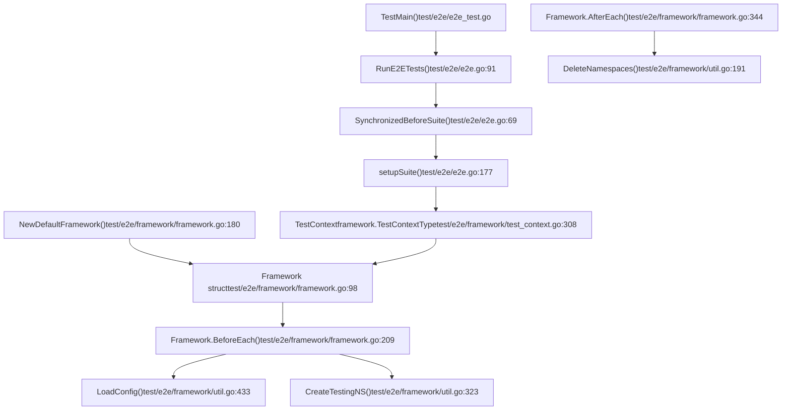
**图示：E2E 框架组件关系**

框架采用分层初始化模式：全局初始化仅执行一次，而每个测试的初始化会创建隔离环境。

来源： [test/e2e/e2e.go1-262](https://github.com/kubernetes/kubernetes/blob/2757a872/test/e2e/e2e.go#L1-L262) [test/e2e/framework/framework.go1-206](https://github.com/kubernetes/kubernetes/blob/2757a872/test/e2e/framework/framework.go#L1-L206) [test/e2e/framework/test\_context.go1-310](https://github.com/kubernetes/kubernetes/blob/2757a872/test/e2e/framework/test_context.go#L1-L310)

## 框架生命周期

### Framework 实例创建与生命周期 Hook

每个测试都会创建一个 `Framework` 实例，并通过 Ginkgo hooks 管理生命周期：

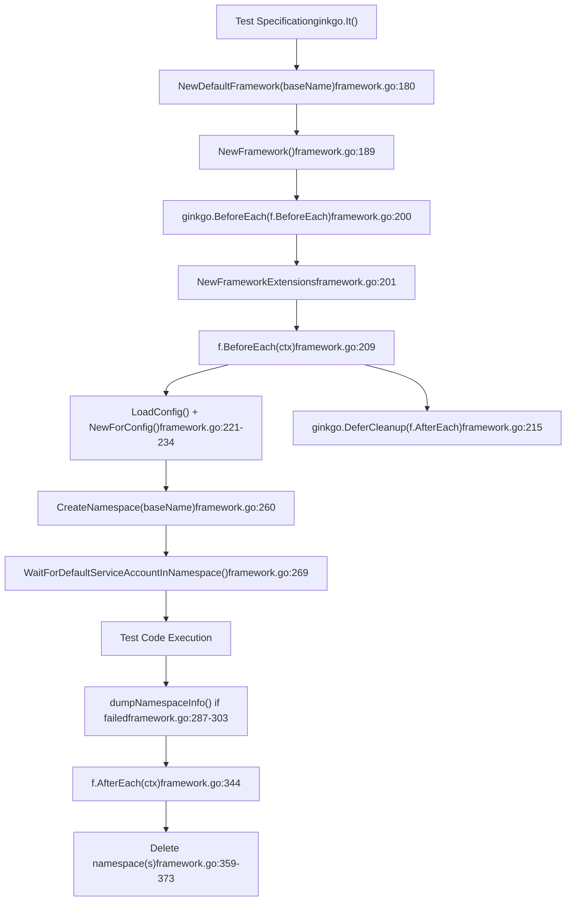
**图示：Framework 生命周期流程**

`Framework` 结构体包含每个测试的状态：

| 字段 | 类型 | 用途 | 填充时机 |
| --- | --- | --- | --- |
| `BaseName` | `string` | 测试标识 | 初始化 |
| `UniqueName` | `string` | 全局唯一名称 | `BeforeEach` 创建命名空间后 |
| `ClientSet` | `clientset.Interface` | Kubernetes API 客户端 | `BeforeEach` |
| `Namespace` | `*v1.Namespace` | 主测试命名空间 | `BeforeEach` |
| `namespacesToDelete` | `[]*v1.Namespace` | 待清理全部命名空间 | 测试期间累积 |
| `Timeouts` | `*TimeoutContext` | 自定义超时值 | 初始化 |

来源： [test/e2e/framework/framework.go88-141](https://github.com/kubernetes/kubernetes/blob/2757a872/test/e2e/framework/framework.go#L88-L141) [test/e2e/framework/framework.go176-206](https://github.com/kubernetes/kubernetes/blob/2757a872/test/e2e/framework/framework.go#L176-L206) [test/e2e/framework/framework.go208-285](https://github.com/kubernetes/kubernetes/blob/2757a872/test/e2e/framework/framework.go#L208-L285)

### 命名空间创建与隔离

命名空间用于实现测试间资源隔离：

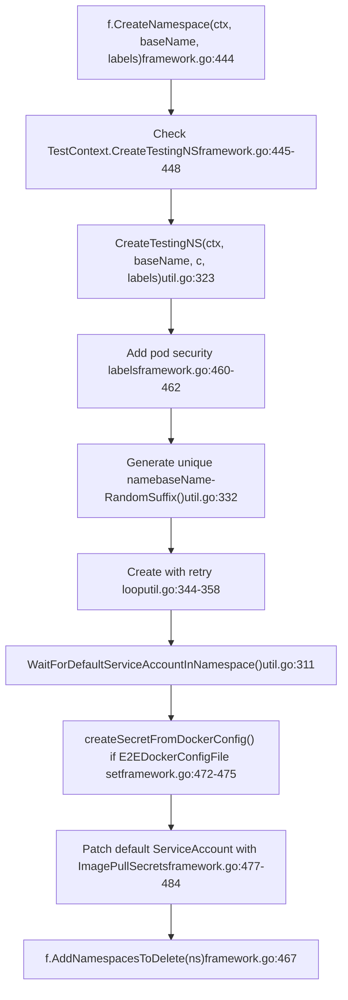
**图示：命名空间创建过程**

命名空间管理关键点：

-   **唯一命名**：使用 `RunID`（UUID）和 `RandomSuffix()` 保证唯一性 [test/e2e/framework/util.go332-333](https://github.com/kubernetes/kubernetes/blob/2757a872/test/e2e/framework/util.go#L332-L333)
-   **标签**：自动添加带 `RunID` 的 `e2e-run` 标签和 pod security 标签 [test/e2e/framework/util.go327](https://github.com/kubernetes/kubernetes/blob/2757a872/test/e2e/framework/util.go#L327-L327) [test/e2e/framework/framework.go460-462](https://github.com/kubernetes/kubernetes/blob/2757a872/test/e2e/framework/framework.go#L460-L462)
-   **重试逻辑**：遇到 `AlreadyExists` 错误时重新生成名称 [test/e2e/framework/util.go348-351](https://github.com/kubernetes/kubernetes/blob/2757a872/test/e2e/framework/util.go#L348-L351)
-   **等待 service account**：确保默认 service account 已创建后再继续测试 [test/e2e/framework/util.go311-312](https://github.com/kubernetes/kubernetes/blob/2757a872/test/e2e/framework/util.go#L311-L312)

来源： [test/e2e/framework/framework.go443-489](https://github.com/kubernetes/kubernetes/blob/2757a872/test/e2e/framework/framework.go#L443-L489) [test/e2e/framework/util.go321-371](https://github.com/kubernetes/kubernetes/blob/2757a872/test/e2e/framework/util.go#L321-L371)

### 清理与收尾

清理通过 `ginkgo.DeferCleanup` 按创建反序执行：

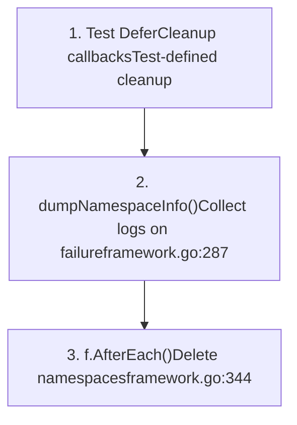
**图示：清理执行顺序**

`AfterEach` 方法负责命名空间删除：

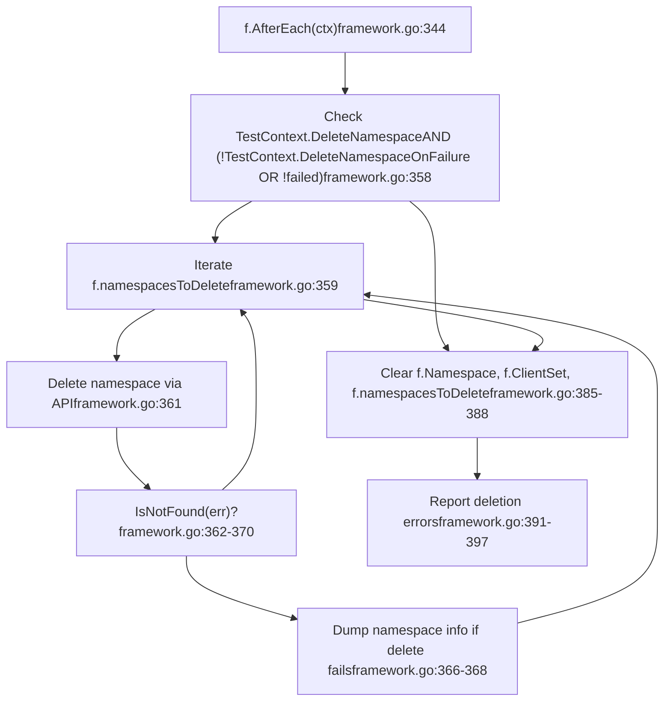
**图示：命名空间清理逻辑**

来源： [test/e2e/framework/framework.go343-409](https://github.com/kubernetes/kubernetes/blob/2757a872/test/e2e/framework/framework.go#L343-L409) [test/e2e/framework/framework.go287-304](https://github.com/kubernetes/kubernetes/blob/2757a872/test/e2e/framework/framework.go#L287-L304)

## TestContext 配置

`TestContext` 全局变量为所有测试提供配置：

### 核心配置字段

**图示：TestContext 配置结构**

### Flag 注册与配置

框架在多个阶段注册 flags：

| 函数 | 用途 | 关键 Flags | 文件 |
| --- | --- | --- | --- |
| `RegisterCommonFlags()` | 全部 E2E 测试通用 flags | `--gather-resource-usage`、`--dump-logs-on-failure`、`--delete-namespace` | `test_context.go:349-396` |
| `RegisterClusterFlags()` | 集群专用 flags | `--kubeconfig`、`--provider`、`--node-os-distro` | `test_context.go:411-467` |
| `RegisterNodeFlags()` | Node E2E 专用 flags | `--node-name`、`--conformance`、`--prepull-images` | `e2e_node_suite_test.go:88-115` |

配置加载流程：

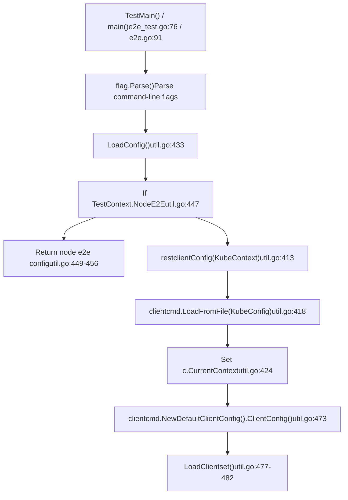
**图示：配置加载流程**

来源： [test/e2e/framework/test\_context.go101-230](https://github.com/kubernetes/kubernetes/blob/2757a872/test/e2e/framework/test_context.go#L101-L230) [test/e2e/framework/test\_context.go338-467](https://github.com/kubernetes/kubernetes/blob/2757a872/test/e2e/framework/test_context.go#L338-L467) [test/e2e/framework/util.go432-483](https://github.com/kubernetes/kubernetes/blob/2757a872/test/e2e/framework/util.go#L432-L483)

## 客户端管理

### 客户端初始化

框架会创建多种客户端：

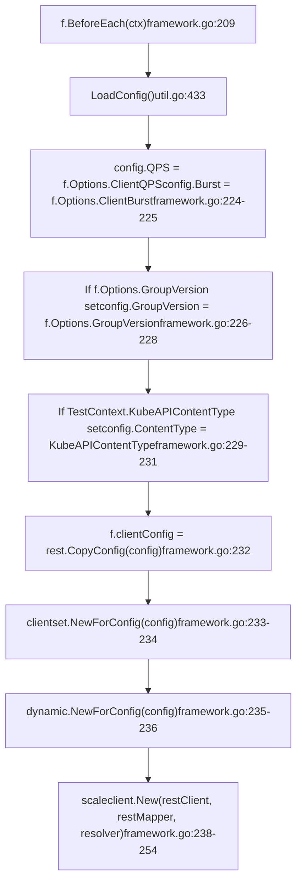
**图示：BeforeEach 中的客户端创建**

`Framework` 结构体维护以下客户端：

| 字段 | 类型 | 用途 | 创建位置 |
| --- | --- | --- | --- |
| `clientConfig` | `*rest.Config` | 基础 REST 配置 | Line 232 |
| `ClientSet` | `clientset.Interface` | 标准强类型客户端 | Line 233 |
| `DynamicClient` | `dynamic.Interface` | 动态非强类型客户端 | Line 235 |
| `ScalesGetter` | `scaleclient.ScalesGetter` | Scale 子资源客户端 | Line 254 |

### 客户端选项

`Options` 结构体用于配置客户端行为：

```
// Framework Options from framework.go:154-158type Options struct {    ClientQPS    float32              // Default: 20    ClientBurst  int                  // Default: 50    GroupVersion *schema.GroupVersion // Optional API version override}
```
来源： [test/e2e/framework/framework.go208-254](https://github.com/kubernetes/kubernetes/blob/2757a872/test/e2e/framework/framework.go#L208-L254) [test/e2e/framework/framework.go154-158](https://github.com/kubernetes/kubernetes/blob/2757a872/test/e2e/framework/framework.go#L154-L158) [test/e2e/framework/util.go432-474](https://github.com/kubernetes/kubernetes/blob/2757a872/test/e2e/framework/util.go#L432-L474)

## 工具函数

框架提供了大量用于常见操作的工具函数：

### 等待与轮询工具

| 函数 | 用途 | 默认超时 | 文件:行号 |
| --- | --- | --- | --- |
| `WaitForNamespacesDeleted()` | 等待命名空间删除 | 作为参数传入 | `util.go:230-250` |
| `WaitForDefaultServiceAccountInNamespace()` | 等待默认 SA | `ServiceAccountProvisionTimeout`（2m） | `util.go:310-312` |
| `WaitForKubeRootCAInNamespace()` | 等待 CA ConfigMap | `ServiceAccountProvisionTimeout`（2m） | `util.go:317-319` |
| `CheckTestingNSDeletedExcept()` | 验证旧命名空间已删除 | 60 分钟 | `util.go:375-410` |

常见超时常量（已弃用，建议改用 `Framework.Timeouts`）：

```
// Constants from util.go:58-127const (    PodStartTimeout             = 5 * time.Minute    PodDeleteTimeout            = 5 * time.Minute    ServiceStartTimeout         = 3 * time.Minute    ServiceAccountProvisionTimeout = 2 * time.Minute    SingleCallTimeout           = 5 * time.Minute    Poll                        = 2 * time.Second)
```
### Watch 事件校验

`WatchEventSequenceVerifier()` 用于验证 watch 事件是否按预期顺序发生：

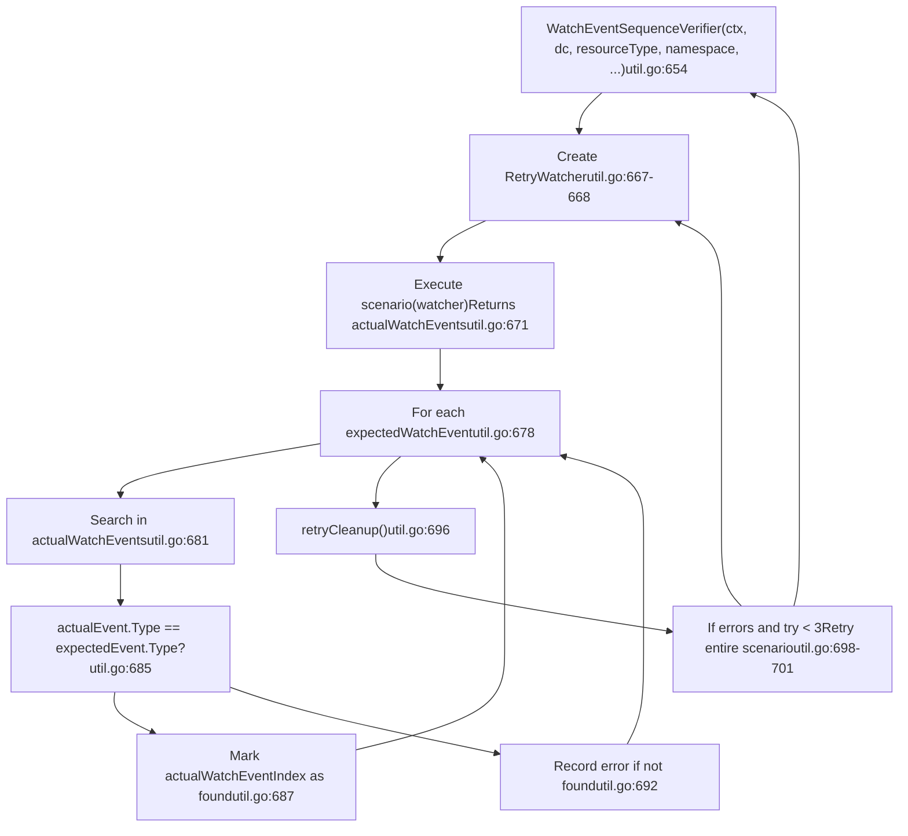
**图示：Watch 事件序列校验**

来源： [test/e2e/framework/util.go58-127](https://github.com/kubernetes/kubernetes/blob/2757a872/test/e2e/framework/util.go#L58-L127) [test/e2e/framework/util.go230-319](https://github.com/kubernetes/kubernetes/blob/2757a872/test/e2e/framework/util.go#L230-L319) [test/e2e/framework/util.go654-708](https://github.com/kubernetes/kubernetes/blob/2757a872/test/e2e/framework/util.go#L654-L708)

### 命令执行工具

| 函数 | 用途 | 文件:行号 |
| --- | --- | --- |
| `RunCmd(command, args...)` | 执行命令并返回 stdout/stderr | `util.go:554-556` |
| `RunCmdEnv(env, command, args...)` | 使用自定义环境执行 | `util.go:561-580` |
| `StartCmdAndStreamOutput(cmd)` | 异步启动命令 | `util.go:491-505` |
| `TryKill(cmd)` | 终止进程（用于清理） | `util.go:508-512` |
| `CoreDump(dir)` | SSH 到节点并导出日志 | `util.go:522-545` |

### 资源管理工具

| 函数 | 用途 | 文件:行号 |
| --- | --- | --- |
| `DeleteNamespaces(ctx, c, deleteFilter, skipFilter)` | 删除匹配命名空间 | `util.go:191-227` |
| `GetControlPlaneNodes(ctx, c)` | 列出控制平面节点 | `util.go:594-618` |
| `GetNodeExternalIPs(node)` | 提取节点外部 IP | `util.go:583-591` |

来源： [test/e2e/framework/util.go491-545](https://github.com/kubernetes/kubernetes/blob/2757a872/test/e2e/framework/util.go#L491-L545) [test/e2e/framework/util.go554-592](https://github.com/kubernetes/kubernetes/blob/2757a872/test/e2e/framework/util.go#L554-L592) [test/e2e/framework/util.go191-227](https://github.com/kubernetes/kubernetes/blob/2757a872/test/e2e/framework/util.go#L191-L227)

## 测试执行流程

### 套件初始化

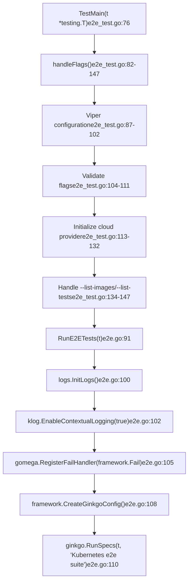
**图示：测试套件入口与初始化**

### 同步套件 Hook

Ginkgo 的 `SynchronizedBeforeSuite` 可确保并行测试节点间的一次性初始化：

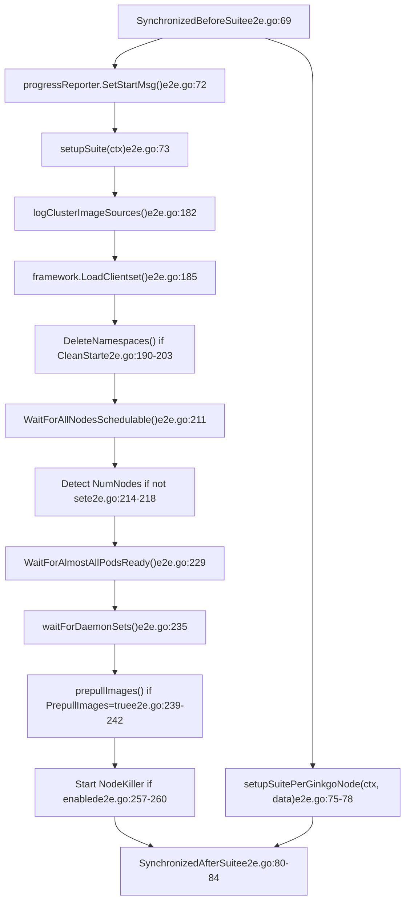
**图示：同步套件生命周期**

来源： [test/e2e/e2e.go69-84](https://github.com/kubernetes/kubernetes/blob/2757a872/test/e2e/e2e.go#L69-L84) [test/e2e/e2e.go168-261](https://github.com/kubernetes/kubernetes/blob/2757a872/test/e2e/e2e.go#L168-L261) [test/e2e/e2e\_test.go76-150](https://github.com/kubernetes/kubernetes/blob/2757a872/test/e2e/e2e_test.go#L76-L150)

## Node E2E 远程执行

对于节点级测试，框架支持在已配置 VM 上远程执行：

### 远程测试架构

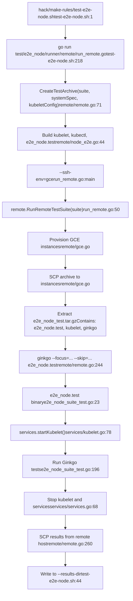
**图示：远程 Node E2E 测试执行流程**

### 测试套件配置

Node E2E 测试被组织为多个测试套件：

| 套件 | 用途 | 文件 |
| --- | --- | --- |
| `default` | 标准 node e2e 测试 | `remote/node_e2e.go:40` |
| `conformance` | Node conformance 测试 | `remote/node_conformance.go` |
| `cadvisor` | cAdvisor 专用测试 | `remote/node_e2e.go` |

每个套件都实现 `TestSuite` 接口：

```
// From remote/remote.gotype TestSuite interface {    SetupTestPackage(tardir, systemSpecName, kubeletConfigFile string) error    RunTest(host, workspace, results, imageDesc, junitFileName string, ...) (string, error)}
```
### 归档内容

`CreateTestArchive()` 打包所需二进制与配置：

```
e2e_node_test.tar.gz
├── e2e_node.test          # Test binary
├── ginkgo                 # Test runner
├── kubelet                # Kubelet binary
├── kubectl                # kubectl binary
├── cni/                   # CNI plugins
├── kubeletconfig.yaml     # Kubelet configuration
└── system-specs/          # System validation specs
```
来源： [hack/make-rules/test-e2e-node.sh1-293](https://github.com/kubernetes/kubernetes/blob/2757a872/hack/make-rules/test-e2e-node.sh#L1-L293) [test/e2e\_node/runner/remote/run\_remote.go1-52](https://github.com/kubernetes/kubernetes/blob/2757a872/test/e2e_node/runner/remote/run_remote.go#L1-L52) [test/e2e\_node/remote/remote.go70-138](https://github.com/kubernetes/kubernetes/blob/2757a872/test/e2e_node/remote/remote.go#L70-L138) [test/e2e\_node/remote/node\_e2e.go35-170](https://github.com/kubernetes/kubernetes/blob/2757a872/test/e2e_node/remote/node_e2e.go#L35-L170)

## 超时配置

框架提供两种超时配置方式：

### TimeoutContext 结构

```mermaid
flowchart TD
    TC["TimeoutContextframework/timeouts.go"]
    SystemPods["SystemPodsStartup: 10mWait for system pods"]
    SystemDaemonset["SystemDaemonsetStartup: 5mWait for daemonsets"]
    NodeSchedulable["NodeSchedulable: 30mWait for nodes schedulable"]
    PodStart["PodStart: 5mWait for pod running"]
    PodStartShort["PodStartShort: 2mShort pod start wait"]
    PodStartSlow["PodStartSlow: 15mSlow pod start wait"]
    PodDelete["PodDelete: 5mWait for pod deletion"]
    ClaimProvision["ClaimProvision: 5mWait for PVC provision"]
    PVReclaim["PVReclaim: 5mWait for PV reclaim"]
    PVBound["PVBound: 3mWait for PV bound"]
    PVCreate["PVCreate: 3mWait for PV creation"]

    TC --> SystemPods
    TC --> SystemDaemonset
    TC --> NodeSchedulable
    TC --> PodStart
    TC --> PodStartShort
    TC --> PodStartSlow
    TC --> PodDelete
    TC --> ClaimProvision
    TC --> PVReclaim
    TC --> PVBound
    TC --> PVCreate
```
**图示：TimeoutContext 配置**

### 使用自定义超时

测试可覆盖默认超时：

```
// From framework/framework.go:163-174func NewFrameworkWithCustomTimeouts(baseName string, timeouts *TimeoutContext) *Framework {    f := NewDefaultFramework(baseName)    // Copy non-zero timeout values    in := reflect.ValueOf(timeouts).Elem()    out := reflect.ValueOf(f.Timeouts).Elem()    for i := 0; i < in.NumField(); i++ {        value := in.Field(i)        if !value.IsZero() {            out.Field(i).Set(value)        }    }    return f}
```
通过 flags 进行全局超时配置：

| Flag | 环境变量 | 默认值 | 用途 |
| --- | --- | --- | --- |
| `--system-pods-startup-timeout` | \- | 10m | 系统 Pod 启动 |
| `--node-schedulable-timeout` | \- | 30m | 节点就绪 |
| `--pod-start-timeout` | \- | 5m | Pod 启动 |

来源： [test/e2e/framework/timeouts.go](https://github.com/kubernetes/kubernetes/blob/2757a872/test/e2e/framework/timeouts.go) [test/e2e/framework/framework.go160-174](https://github.com/kubernetes/kubernetes/blob/2757a872/test/e2e/framework/framework.go#L160-L174) [test/e2e/framework/test\_context.go460-465](https://github.com/kubernetes/kubernetes/blob/2757a872/test/e2e/framework/test_context.go#L460-L465)

## 测试辅助与模式

### 常见测试模式

框架鼓励采用特定测试结构模式：

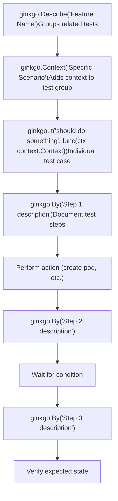
**图示：推荐的测试结构模式**

来自调度测试的结构示例：

```
// Pattern from test/e2e/scheduling/predicates.govar _ = SIGDescribe("SchedulerPredicates", framework.WithSerial(), func() {    f := framework.NewDefaultFramework("sched-pred")        ginkgo.BeforeEach(func(ctx context.Context) {        // Per-test setup    })        ginkgo.AfterEach(func(ctx context.Context) {        // Per-test cleanup    })        f.It("validates resource limits", func(ctx context.Context) {        ginkgo.By("Creating pods that consume resources")        // Test implementation                ginkgo.By("Verifying scheduler behavior")        // Verification    })})
```
### 断言辅助函数

框架提供了封装后的断言函数：

| 函数 | 用途 | 文件:行号 |
| --- | --- | --- |
| `ExpectNoError(err, ...explain)` | 断言无错误 | `framework/util.go` 通过 `framework/log.go` |
| `ExpectNoErrorWithOffset(offset int, err, ...explain)` | 带自定义栈偏移的断言 | `framework/log.go` |
| `Failf(format, args...)` | 以格式化消息使测试失败 | `framework/log.go` |
| `Logf(format, args...)` | 输出格式化日志 | `framework/log.go` |

来源： [test/e2e/scheduling/predicates.go82-203](https://github.com/kubernetes/kubernetes/blob/2757a872/test/e2e/scheduling/predicates.go#L82-L203) [test/e2e/framework/framework.go176-206](https://github.com/kubernetes/kubernetes/blob/2757a872/test/e2e/framework/framework.go#L176-L206)

## Provider 集成

框架通过 `ProviderInterface` 与云厂商集成：

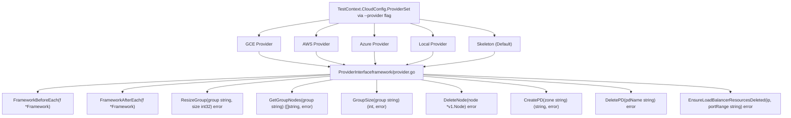
**图示：Provider 接口及实现**

provider 选择在 flags 处理阶段完成：

```
// From test/e2e/e2e_test.go:113-132func handleFlags() {    // ... flag parsing ...        framework.TestContext.CloudConfig.Provider =         framework.SetupProviderConfig(framework.TestContext.Provider)}
```
provider 生命周期 hooks 会由 Framework 调用：

-   `FrameworkBeforeEach(f)` - 在 `Framework.BeforeEach()` 中调用，位置 [framework.go256](https://github.com/kubernetes/kubernetes/blob/2757a872/framework.go#L256-L256)
-   `FrameworkAfterEach(f)` - 在 `Framework.AfterEach()` 中调用，位置 [framework.go400](https://github.com/kubernetes/kubernetes/blob/2757a872/framework.go#L400-L400)

来源： [test/e2e/framework/test\_context.go284-305](https://github.com/kubernetes/kubernetes/blob/2757a872/test/e2e/framework/test_context.go#L284-L305) [test/e2e/e2e\_test.go113-132](https://github.com/kubernetes/kubernetes/blob/2757a872/test/e2e/e2e_test.go#L113-L132) [test/e2e/framework/framework.go256](https://github.com/kubernetes/kubernetes/blob/2757a872/test/e2e/framework/framework.go#L256-L256) [test/e2e/framework/framework.go400](https://github.com/kubernetes/kubernetes/blob/2757a872/test/e2e/framework/framework.go#L400-L400)
