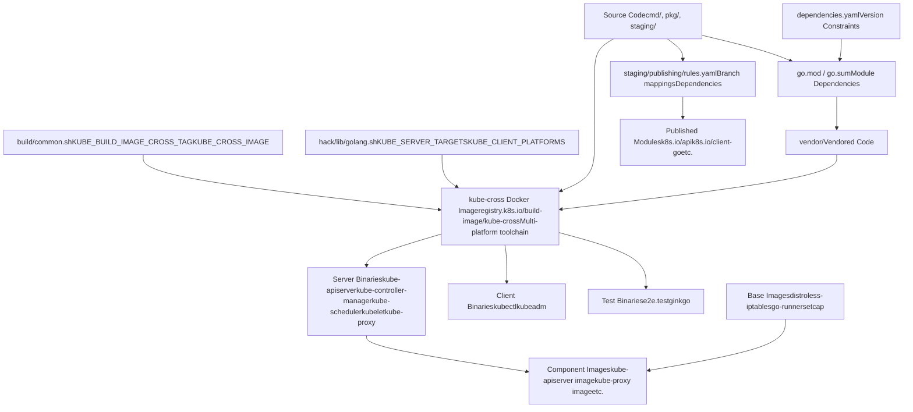
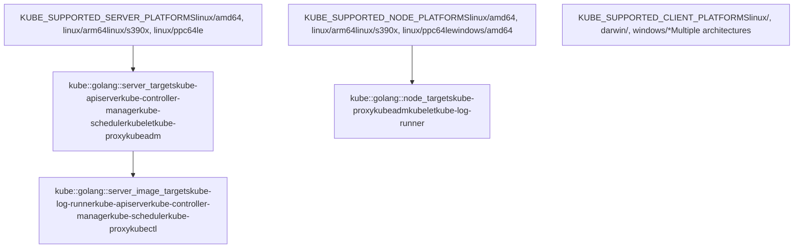
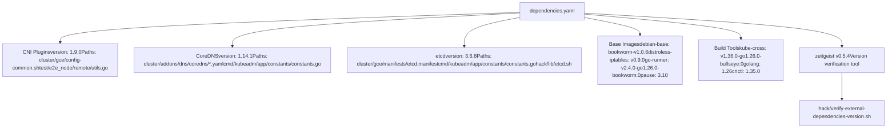
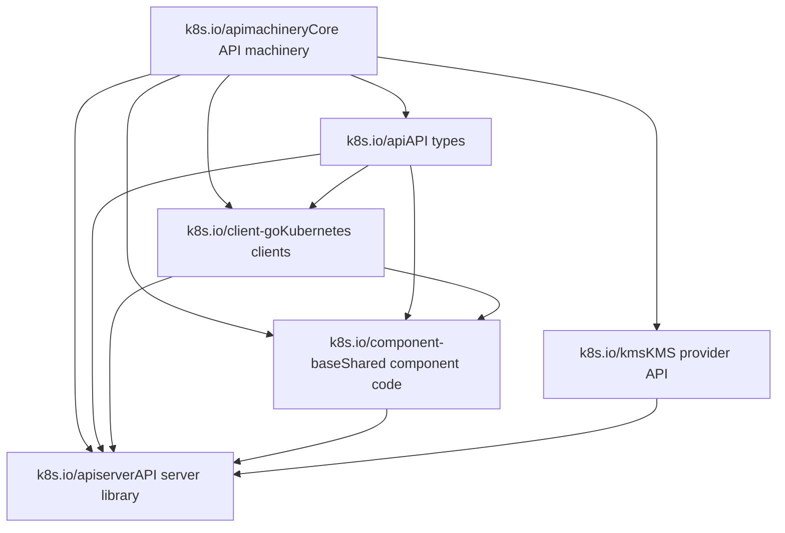

# 构建系统与依赖项

相关源文件

-   [.go-version](https://github.com/kubernetes/kubernetes/blob/2757a872/.go-version)
-   [build/build-image/cross/VERSION](https://github.com/kubernetes/kubernetes/blob/2757a872/build/build-image/cross/VERSION)
-   [build/common.sh](https://github.com/kubernetes/kubernetes/blob/2757a872/build/common.sh)
-   [build/dependencies.yaml](https://github.com/kubernetes/kubernetes/blob/2757a872/build/dependencies.yaml)
-   [cluster/gce/manifests/etcd.manifest](https://github.com/kubernetes/kubernetes/blob/2757a872/cluster/gce/manifests/etcd.manifest)
-   [cluster/gce/upgrade-aliases.sh](https://github.com/kubernetes/kubernetes/blob/2757a872/cluster/gce/upgrade-aliases.sh)
-   [cmd/kubeadm/app/constants/constants.go](https://github.com/kubernetes/kubernetes/blob/2757a872/cmd/kubeadm/app/constants/constants.go)
-   [cmd/kubeadm/app/constants/constants\_test.go](https://github.com/kubernetes/kubernetes/blob/2757a872/cmd/kubeadm/app/constants/constants_test.go)
-   [cmd/kubeadm/app/constants/constants\_unix.go](https://github.com/kubernetes/kubernetes/blob/2757a872/cmd/kubeadm/app/constants/constants_unix.go)
-   [cmd/kubeadm/app/constants/constants\_windows.go](https://github.com/kubernetes/kubernetes/blob/2757a872/cmd/kubeadm/app/constants/constants_windows.go)
-   [cmd/kubeadm/app/images/images.go](https://github.com/kubernetes/kubernetes/blob/2757a872/cmd/kubeadm/app/images/images.go)
-   [cmd/kubeadm/app/images/images\_test.go](https://github.com/kubernetes/kubernetes/blob/2757a872/cmd/kubeadm/app/images/images_test.go)
-   [cmd/kubeadm/app/phases/patchnode/patchnode\_test.go](https://github.com/kubernetes/kubernetes/blob/2757a872/cmd/kubeadm/app/phases/patchnode/patchnode_test.go)
-   [go.mod](https://github.com/kubernetes/kubernetes/blob/2757a872/go.mod)
-   [go.sum](https://github.com/kubernetes/kubernetes/blob/2757a872/go.sum)
-   [go.work](https://github.com/kubernetes/kubernetes/blob/2757a872/go.work)
-   [hack/lib/etcd.sh](https://github.com/kubernetes/kubernetes/blob/2757a872/hack/lib/etcd.sh)
-   [hack/lib/golang.sh](https://github.com/kubernetes/kubernetes/blob/2757a872/hack/lib/golang.sh)
-   [staging/README.md](https://github.com/kubernetes/kubernetes/blob/2757a872/staging/README.md?plain=1)
-   [staging/publishing/import-restrictions.yaml](https://github.com/kubernetes/kubernetes/blob/2757a872/staging/publishing/import-restrictions.yaml)
-   [staging/publishing/rules.yaml](https://github.com/kubernetes/kubernetes/blob/2757a872/staging/publishing/rules.yaml)
-   [staging/src/k8s.io/apiextensions-apiserver/go.mod](https://github.com/kubernetes/kubernetes/blob/2757a872/staging/src/k8s.io/apiextensions-apiserver/go.mod)
-   [staging/src/k8s.io/apiextensions-apiserver/go.sum](https://github.com/kubernetes/kubernetes/blob/2757a872/staging/src/k8s.io/apiextensions-apiserver/go.sum)
-   [staging/src/k8s.io/apiserver/go.mod](https://github.com/kubernetes/kubernetes/blob/2757a872/staging/src/k8s.io/apiserver/go.mod)
-   [staging/src/k8s.io/apiserver/go.sum](https://github.com/kubernetes/kubernetes/blob/2757a872/staging/src/k8s.io/apiserver/go.sum)
-   [staging/src/k8s.io/cloud-provider/go.sum](https://github.com/kubernetes/kubernetes/blob/2757a872/staging/src/k8s.io/cloud-provider/go.sum)
-   [staging/src/k8s.io/component-base/go.sum](https://github.com/kubernetes/kubernetes/blob/2757a872/staging/src/k8s.io/component-base/go.sum)
-   [staging/src/k8s.io/controller-manager/go.sum](https://github.com/kubernetes/kubernetes/blob/2757a872/staging/src/k8s.io/controller-manager/go.sum)
-   [staging/src/k8s.io/kube-aggregator/go.mod](https://github.com/kubernetes/kubernetes/blob/2757a872/staging/src/k8s.io/kube-aggregator/go.mod)
-   [staging/src/k8s.io/kube-aggregator/go.sum](https://github.com/kubernetes/kubernetes/blob/2757a872/staging/src/k8s.io/kube-aggregator/go.sum)
-   [staging/src/k8s.io/kube-controller-manager/go.sum](https://github.com/kubernetes/kubernetes/blob/2757a872/staging/src/k8s.io/kube-controller-manager/go.sum)
-   [staging/src/k8s.io/kube-proxy/go.sum](https://github.com/kubernetes/kubernetes/blob/2757a872/staging/src/k8s.io/kube-proxy/go.sum)
-   [staging/src/k8s.io/kube-scheduler/go.sum](https://github.com/kubernetes/kubernetes/blob/2757a872/staging/src/k8s.io/kube-scheduler/go.sum)
-   [staging/src/k8s.io/pod-security-admission/go.sum](https://github.com/kubernetes/kubernetes/blob/2757a872/staging/src/k8s.io/pod-security-admission/go.sum)
-   [staging/src/k8s.io/sample-apiserver/artifacts/example/deployment.yaml](https://github.com/kubernetes/kubernetes/blob/2757a872/staging/src/k8s.io/sample-apiserver/artifacts/example/deployment.yaml)
-   [staging/src/k8s.io/sample-apiserver/go.mod](https://github.com/kubernetes/kubernetes/blob/2757a872/staging/src/k8s.io/sample-apiserver/go.mod)
-   [staging/src/k8s.io/sample-apiserver/go.sum](https://github.com/kubernetes/kubernetes/blob/2757a872/staging/src/k8s.io/sample-apiserver/go.sum)
-   [test/e2e/framework/nodes\_util.go](https://github.com/kubernetes/kubernetes/blob/2757a872/test/e2e/framework/nodes_util.go)
-   [test/e2e/framework/providers/gcp.go](https://github.com/kubernetes/kubernetes/blob/2757a872/test/e2e/framework/providers/gcp.go)
-   [test/e2e/upgrades/network/kube\_proxy\_migration.go](https://github.com/kubernetes/kubernetes/blob/2757a872/test/e2e/upgrades/network/kube_proxy_migration.go)
-   [test/e2e/windows/device\_plugin.go](https://github.com/kubernetes/kubernetes/blob/2757a872/test/e2e/windows/device_plugin.go)
-   [test/images/Makefile](https://github.com/kubernetes/kubernetes/blob/2757a872/test/images/Makefile)
-   [test/utils/image/manifest.go](https://github.com/kubernetes/kubernetes/blob/2757a872/test/utils/image/manifest.go)
-   [test/utils/image/manifest\_test.go](https://github.com/kubernetes/kubernetes/blob/2757a872/test/utils/image/manifest_test.go)
-   [vendor/modules.txt](https://github.com/kubernetes/kubernetes/blob/2757a872/vendor/modules.txt)

## 目的与范围

本文档概述 Kubernetes 构建系统、依赖管理基础设施以及发布产物生成流程。内容涵盖源代码如何编译为二进制文件和容器镜像、外部与内部依赖如何跟踪和管理，以及单体仓库中的 staging 模块如何作为独立包发布。

关于使用 zeitgeist 进行依赖版本跟踪与校验的具体细节，请参见[依赖管理](/kubernetes/kubernetes/7.1-dependency-management)。关于包括交叉编译与 Docker 镜像创建在内的构建流程细节，请参见[构建与发布流程](/kubernetes/kubernetes/7.2-build-and-release-process)。关于 staging 目录结构与模块发布的信息，请参见[Go Modules 与 Staging](/kubernetes/kubernetes/7.3-go-modules-and-staging)。

## 构建系统架构

Kubernetes 构建系统通过一系列定义明确的阶段，将源代码转换为可部署工件。该系统支持跨平台编译、依赖管理以及多阶段 Docker 镜像构建。


**来源**: [build/common.sh1-247](https://github.com/kubernetes/kubernetes/blob/2757a872/build/common.sh#L1-L247) [hack/lib/golang.sh1-400](https://github.com/kubernetes/kubernetes/blob/2757a872/hack/lib/golang.sh#L1-L400) [build/dependencies.yaml1-268](https://github.com/kubernetes/kubernetes/blob/2757a872/build/dependencies.yaml#L1-L268) [staging/publishing/rules.yaml1-100](https://github.com/kubernetes/kubernetes/blob/2757a872/staging/publishing/rules.yaml#L1-L100)

## 核心构建系统组件

### 构建配置与环境

构建系统由 shell 脚本进行编排，这些脚本负责配置构建环境、管理 Docker 容器并定义编译目标。

| 组件 | 位置 | 目的 |
| --- | --- | --- |
| `build/common.sh` | [build/common.sh1-247](https://github.com/kubernetes/kubernetes/blob/2757a872/build/common.sh#L1-L247) | 核心构建配置、Docker 镜像版本、构建容器管理 |
| `hack/lib/golang.sh` | [hack/lib/golang.sh1-900](https://github.com/kubernetes/kubernetes/blob/2757a872/hack/lib/golang.sh#L1-L900) | Go 构建目标、平台定义、编译函数 |
| `build/build-image/cross/VERSION` | [build/build-image/cross/VERSION1](https://github.com/kubernetes/kubernetes/blob/2757a872/build/build-image/cross/VERSION#L1-L1) | 交叉编译 Docker 镜像版本 |
| `KUBE_CROSS_IMAGE` | [build/common.sh46-47](https://github.com/kubernetes/kubernetes/blob/2757a872/build/common.sh#L46-L47) | 完整限定的交叉编译镜像名称 |
| `KUBE_BUILD_IMAGE_CROSS_TAG` | [build/common.sh38-39](https://github.com/kubernetes/kubernetes/blob/2757a872/build/common.sh#L38-L39) | 当前交叉编译镜像标签 |

构建系统定义了若干关键环境变量：

-   `KUBE_ROOT`: 仓库根目录
-   `LOCAL_OUTPUT_ROOT`: 本地构建输出目录（`_output/`）
-   `LOCAL_OUTPUT_BINPATH`: 编译后的二进制输出目录（`_output/dockerized/bin/`）
-   `KUBE_GOPATH`: 构建使用的 Go 工作区路径
-   `KUBE_CROSS_IMAGE`: 交叉编译 Docker 镜像引用

**来源**: [build/common.sh32-77](https://github.com/kubernetes/kubernetes/blob/2757a872/build/common.sh#L32-L77) [hack/lib/golang.sh19-20](https://github.com/kubernetes/kubernetes/blob/2757a872/hack/lib/golang.sh#L19-L20)

### 构建目标与平台

Kubernetes 支持多平台构建，并针对不同平台类型定义了不同目标集合。


**来源**: [hack/lib/golang.sh23-139](https://github.com/kubernetes/kubernetes/blob/2757a872/hack/lib/golang.sh#L23-L139)

### 基础镜像配置

容器镜像使用特定基础镜像构建，以提供最小化的运行时依赖。

| 基础镜像变量 | 默认值 | 目的 |
| --- | --- | --- |
| `__default_distroless_iptables_version` | `v0.9.0` | 动态链接二进制（包含 iptables） |
| `__default_go_runner_version` | `v2.4.0-go1.26.0-bookworm.0` | 静态链接二进制 |
| `__default_setcap_version` | `bookworm-v1.0.6` | 用于设置 capabilities 的多阶段构建 |
| `KUBE_APISERVER_BASE_IMAGE` | 条件选择 | API server 容器基础镜像 |
| `KUBE_PROXY_BASE_IMAGE` | `distroless-iptables` | Proxy 容器基础镜像（需要 iptables） |

基础镜像选择通过 `__default_base_image()` 函数完成，该函数会判断二进制是静态链接还是动态链接：

**来源**: [build/common.sh79-116](https://github.com/kubernetes/kubernetes/blob/2757a872/build/common.sh#L79-L116)

## 依赖管理概览

Kubernetes 在多个层次管理依赖：Go 模块依赖、外部组件版本以及容器镜像版本。

### Go Modules

主 `go.mod` 文件声明整个仓库的所有直接依赖，包括外部包与内部 staging 模块。

[go.mod13-122](https://github.com/kubernetes/kubernetes/blob/2757a872/go.mod#L13-L122) 中的关键依赖类别：

-   **核心 Kubernetes 库**: 如 `k8s.io/api`、`k8s.io/client-go`、`k8s.io/apiserver` 等内部 staging 模块
-   **etcd**: 客户端与服务端库（`go.etcd.io/etcd/client/v3`、`go.etcd.io/etcd/server/v3`）
-   **容器运行时**: CRI、containerd 与 CRI-O 集成库
-   **网络**: gRPC、HTTP/2、WebSocket 与代理相关库
-   **可观测性**: OpenTelemetry、Prometheus 客户端库
-   **实用工具**: 命令行解析、日志、序列化相关库

仓库使用 workspace 模式与 replace 指令，将内部模块指向 `staging/` 目录中的位置：

```
replace (
    k8s.io/api => ./staging/src/k8s.io/api
    k8s.io/apiserver => ./staging/src/k8s.io/apiserver
    k8s.io/client-go => ./staging/src/k8s.io/client-go
    ...
)
```
**来源**: [go.mod1-252](https://github.com/kubernetes/kubernetes/blob/2757a872/go.mod#L1-L252) [vendor/modules.txt1-1500](https://github.com/kubernetes/kubernetes/blob/2757a872/vendor/modules.txt#L1-L1500)

### 使用 dependencies.yaml 进行版本跟踪

`dependencies.yaml` 文件通过 zeitgeist 提供额外一层版本校验。该文件跟踪必须在代码库多个位置保持同步的外部组件版本。


**来源**: [build/dependencies.yaml1-268](https://github.com/kubernetes/kubernetes/blob/2757a872/build/dependencies.yaml#L1-L268)

### 组件版本常量

组件版本也在代码常量中定义，以供运行时使用，尤其是 kubeadm 需要知道要部署哪些版本：

```
// From cmd/kubeadm/app/constants/constants.goconst (    DefaultEtcdVersion  = "3.6.8"    CoreDNSVersion      = "1.14.1"    PauseVersion        = "3.10")
```
**来源**: [cmd/kubeadm/app/constants/constants.go66-207](https://github.com/kubernetes/kubernetes/blob/2757a872/cmd/kubeadm/app/constants/constants.go#L66-L207)

## Staging 目录与模块发布

Kubernetes 仓库采用单体仓库结构，其中 `staging/` 目录包含会作为独立 Go 模块发布的子模块。

### Staging 模块结构

位于 [staging/src/k8s.io/](https://github.com/kubernetes/kubernetes/blob/2757a872/staging/src/k8s.io/) 的 staging 目录包含 20 多个独立模块：

-   `api`: Kubernetes API 类型
-   `apimachinery`: 通用 API machinery
-   `apiserver`: API server 库
-   `client-go`: Kubernetes 客户端库
-   `kubectl`: kubectl 命令实现
-   `kubelet`: 作为库的 Kubelet
-   以及更多模块...

每个 staging 模块都有自己的 `go.mod` 文件，用于声明对其他 staging 模块和外部包的依赖。例如，[staging/src/k8s.io/apiserver/go.mod9-64](https://github.com/kubernetes/kubernetes/blob/2757a872/staging/src/k8s.io/apiserver/go.mod#L9-L64) 展示了 apiserver 依赖 `k8s.io/api`、`k8s.io/client-go`、`k8s.io/component-base` 等。

### 发布规则

`staging/publishing/rules.yaml` 文件定义了 staging 模块如何发布到各自的 GitHub 仓库。每条规则指定：

-   **destination**: 目标仓库名称（如 `client-go`、`apiserver`）
-   **branches**: 哪些源分支映射到哪些目标分支
-   **dependencies**: 带分支映射的模块间依赖
-   **library**: 该模块是否为库（而非二进制）
-   **smoke-test**: 用于验证发布模块的可选构建/测试命令

规则结构示例：

```
- destination: client-go  branches:  - name: master    dependencies:    - repository: apimachinery      branch: master    - repository: api      branch: master    source:      branch: master      dirs:      - staging/src/k8s.io/client-go    smoke-test: |      go build -mod=mod ./...      go test -mod=mod ./...  library: true
```
**来源**: [staging/publishing/rules.yaml1-812](https://github.com/kubernetes/kubernetes/blob/2757a872/staging/publishing/rules.yaml#L1-L812)

### Staging 模块之间的依赖图


**来源**: [staging/publishing/rules.yaml2-439](https://github.com/kubernetes/kubernetes/blob/2757a872/staging/publishing/rules.yaml#L2-L439) [staging/src/k8s.io/apiserver/go.mod51-59](https://github.com/kubernetes/kubernetes/blob/2757a872/staging/src/k8s.io/apiserver/go.mod#L51-L59)

## 构建产物与输出结构

构建系统会生成多个类别的工件，并以结构化方式组织在输出目录中。

### 输出目录布局

```
_output/
├── dockerized/
│   ├── bin/
│   │   ├── linux/
│   │   │   ├── amd64/
│   │   │   │   ├── kube-apiserver
│   │   │   │   ├── kube-controller-manager
│   │   │   │   ├── kube-scheduler
│   │   │   │   ├── kubelet
│   │   │   │   ├── kube-proxy
│   │   │   │   └── kubectl
│   │   │   ├── arm64/
│   │   │   └── ...
│   │   ├── darwin/
│   │   │   ├── amd64/
│   │   │   └── arm64/
│   │   └── windows/
│   │       └── amd64/
│   └── go/
│       └── (Go build cache)
└── bin -> dockerized/bin/(host-platform)/
```
定义此结构的关键常量：

-   `LOCAL_OUTPUT_ROOT`: `${KUBE_ROOT}/_output`
-   `LOCAL_OUTPUT_BINPATH`: `${LOCAL_OUTPUT_ROOT}/dockerized/bin`
-   `LOCAL_OUTPUT_GOPATH`: `${LOCAL_OUTPUT_ROOT}/dockerized/go`
-   `THIS_PLATFORM_BIN`: `${LOCAL_OUTPUT_ROOT}/bin`（指向主机平台二进制的符号链接）

**来源**: [build/common.sh53-70](https://github.com/kubernetes/kubernetes/blob/2757a872/build/common.sh#L53-L70)

### 容器镜像工件

构建过程会为核心组件使用多阶段构建生成 Docker 镜像。`kube::build::get_docker_wrapped_binaries()` 函数定义了哪些二进制会被容器化：

| 二进制 | 基础镜像变量 | 默认基础镜像 |
| --- | --- | --- |
| `kube-apiserver` | `KUBE_APISERVER_BASE_IMAGE` | go-runner（静态）或 distroless-iptables（动态） |
| `kube-controller-manager` | `KUBE_CONTROLLER_MANAGER_BASE_IMAGE` | go-runner（静态）或 distroless-iptables（动态） |
| `kube-scheduler` | `KUBE_SCHEDULER_BASE_IMAGE` | go-runner（静态）或 distroless-iptables（动态） |
| `kube-proxy` | `KUBE_PROXY_BASE_IMAGE` | distroless-iptables（始终动态链接，需要 iptables） |
| `kubectl` | `KUBECTL_BASE_IMAGE` | go-runner（静态）或 distroless-iptables（动态） |

**来源**: [build/common.sh108-137](https://github.com/kubernetes/kubernetes/blob/2757a872/build/common.sh#L108-L137)

## 测试镜像管理

E2E 测试所用镜像通过集中清单进行版本控制。

### 测试镜像注册表

`test/utils/image/manifest.go` 文件定义了带版本的测试镜像注册表：

```
type RegistryList struct {    PromoterE2eRegistry      string  // registry.k8s.io/e2e-test-images    BuildImageRegistry       string  // registry.k8s.io/build-image    GcEtcdRegistry           string  // registry.k8s.io (for etcd)    GcRegistry               string  // registry.k8s.io (for pause)    // ...} // Image IDsconst (    Agnhost ImageID = iota    BusyBox    Etcd    Nginx    Pause    // ...)
```
测试镜像可通过环境变量覆盖：

-   `KUBE_TEST_REPO_LIST`: 自定义注册表列表 YAML 的 URL 或路径
-   `KUBE_TEST_REPO`: 用于映射所有测试镜像的替代镜像仓库

**来源**: [test/utils/image/manifest.go34-323](https://github.com/kubernetes/kubernetes/blob/2757a872/test/utils/image/manifest.go#L34-L323)

### 镜像版本示例

| 镜像 | 版本 | 代码位置 |
| --- | --- | --- |
| Agnhost | 2.63.0 | [test/utils/image/manifest.go212](https://github.com/kubernetes/kubernetes/blob/2757a872/test/utils/image/manifest.go#L212-L212) |
| Etcd | 3.6.8-0 | [test/utils/image/manifest.go218](https://github.com/kubernetes/kubernetes/blob/2757a872/test/utils/image/manifest.go#L218-L218) |
| Pause | 3.10.1 | [test/utils/image/manifest.go233](https://github.com/kubernetes/kubernetes/blob/2757a872/test/utils/image/manifest.go#L233-L233) |
| BusyBox | 1.37.0-1 | [test/utils/image/manifest.go216](https://github.com/kubernetes/kubernetes/blob/2757a872/test/utils/image/manifest.go#L216-L216) |
| DistrolessIptables | v0.9.0 | [test/utils/image/manifest.go217](https://github.com/kubernetes/kubernetes/blob/2757a872/test/utils/image/manifest.go#L217-L217) |

**来源**: [test/utils/image/manifest.go209-238](https://github.com/kubernetes/kubernetes/blob/2757a872/test/utils/image/manifest.go#L209-L238) [build/dependencies.yaml85-243](https://github.com/kubernetes/kubernetes/blob/2757a872/build/dependencies.yaml#L85-L243)

## 跨平台编译

构建系统使用 Docker 容器执行跨平台编译，以确保在不同主机操作系统上的构建环境一致。

### kube-cross Docker 镜像

交叉编译环境由 `kube-cross` Docker 镜像提供，其中包括：

-   与 `.go-version` 指定版本对应的 Go 工具链
-   对所有受支持平台的交叉编译支持
-   构建工具与依赖
-   已为目标平台预编译的标准库

镜像版本记录于 [build/build-image/cross/VERSION1](https://github.com/kubernetes/kubernetes/blob/2757a872/build/build-image/cross/VERSION#L1-L1)：`v1.36.0-go1.26.0-bullseye.0`

该版本字符串编码了：

-   `v1.36.0`: kube-cross 镜像版本
-   `go1.26.0`: Go 编译器版本
-   `bullseye.0`: Debian 基础镜像版本

**来源**: [build/build-image/cross/VERSION1](https://github.com/kubernetes/kubernetes/blob/2757a872/build/build-image/cross/VERSION#L1-L1) [build/common.sh38-51](https://github.com/kubernetes/kubernetes/blob/2757a872/build/common.sh#L38-L51)

### 平台支持矩阵

| 平台类别 | 支持平台 | 用例 |
| --- | --- | --- |
| Server | `linux/amd64`, `linux/arm64`, `linux/s390x`, `linux/ppc64le` | 控制平面与节点组件 |
| Node | Server 平台 + `windows/amd64` | 工作节点组件（kubelet、kube-proxy） |
| Client | Server 平台 + `darwin/amd64`, `darwin/arm64`, `windows/386`, `windows/arm64`, `linux/386`, `linux/arm` | kubectl 与 kubeadm |
| Test | Client 平台子集 | E2E 测试二进制 |

**来源**: [hack/lib/golang.sh23-66](https://github.com/kubernetes/kubernetes/blob/2757a872/hack/lib/golang.sh#L23-L66)

### 构建容器管理

构建系统管理用于增量构建的长生命周期 Docker 容器。容器命名包含仓库位置哈希，以支持多个 checkout 并行构建：

```
KUBE_ROOT_HASH = hash(HOSTNAME:KUBE_ROOT:GIT_BRANCH)
KUBE_BUILD_CONTAINER_NAME = "kube-build-${KUBE_ROOT_HASH}-6"
```
这样可确保不同仓库 checkout 或分支不会互相干扰彼此的构建容器。

**来源**: [build/common.sh149-157](https://github.com/kubernetes/kubernetes/blob/2757a872/build/common.sh#L149-L157)

## 与校验工具的集成

构建与依赖系统集成了多种校验工具以保证一致性：

| 工具 | 目的 | 调用方式 |
| --- | --- | --- |
| zeitgeist | 校验多个文件中的依赖版本是否一致 | `hack/verify-external-dependencies-version.sh` |
| go mod | 校验 go.mod 与 go.sum 一致性 | `hack/update-vendor.sh`, `hack/pin-dependency.sh` |
| Import restrictions | 校验 staging 模块依赖关系 | 通过 `staging/publishing/import-restrictions.yaml` 检查 |

**来源**: [build/dependencies.yaml2-17](https://github.com/kubernetes/kubernetes/blob/2757a872/build/dependencies.yaml#L2-L17) [go.mod1-5](https://github.com/kubernetes/kubernetes/blob/2757a872/go.mod#L1-L5) [staging/publishing/import-restrictions.yaml1-50](https://github.com/kubernetes/kubernetes/blob/2757a872/staging/publishing/import-restrictions.yaml#L1-L50)

---

本文档概述了构建系统架构与依赖管理。关于特定子系统的详细信息：

-   **依赖版本跟踪与 zeitgeist**: 请参见[依赖管理](/kubernetes/kubernetes/7.1-dependency-management)
-   **构建脚本、交叉编译与镜像创建**: 请参见[构建与发布流程](/kubernetes/kubernetes/7.2-build-and-release-process)
-   **Staging 模块结构与发布工作流**: 请参见[Go Modules 与 Staging](/kubernetes/kubernetes/7.3-go-modules-and-staging)
