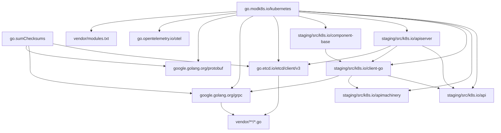
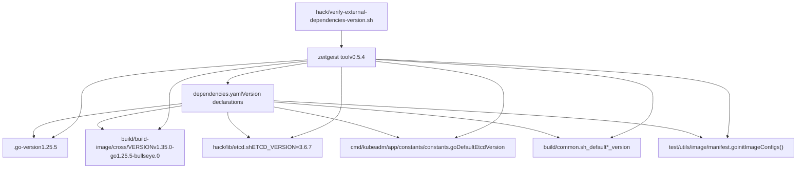
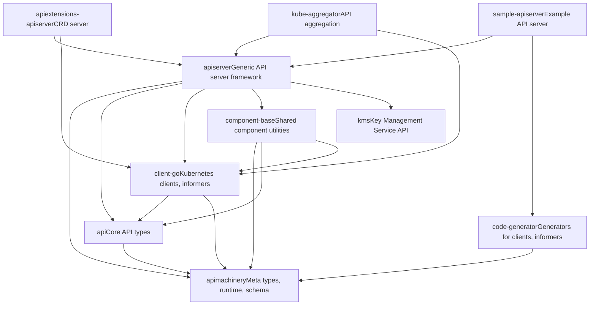
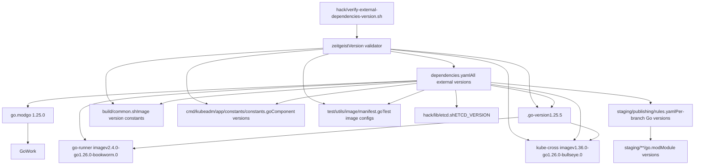

# 依赖管理

相关源文件

-   [.go-version](https://github.com/kubernetes/kubernetes/blob/2757a872/.go-version)
-   [build/build-image/cross/VERSION](https://github.com/kubernetes/kubernetes/blob/2757a872/build/build-image/cross/VERSION)
-   [build/common.sh](https://github.com/kubernetes/kubernetes/blob/2757a872/build/common.sh)
-   [build/dependencies.yaml](https://github.com/kubernetes/kubernetes/blob/2757a872/build/dependencies.yaml)
-   [cluster/gce/manifests/etcd.manifest](https://github.com/kubernetes/kubernetes/blob/2757a872/cluster/gce/manifests/etcd.manifest)
-   [cluster/gce/upgrade-aliases.sh](https://github.com/kubernetes/kubernetes/blob/2757a872/cluster/gce/upgrade-aliases.sh)
-   [cmd/kubeadm/app/constants/constants.go](https://github.com/kubernetes/kubernetes/blob/2757a872/cmd/kubeadm/app/constants/constants.go)
-   [cmd/kubeadm/app/constants/constants\_test.go](https://github.com/kubernetes/kubernetes/blob/2757a872/cmd/kubeadm/app/constants/constants_test.go)
-   [cmd/kubeadm/app/constants/constants\_unix.go](https://github.com/kubernetes/kubernetes/blob/2757a872/cmd/kubeadm/app/constants/constants_unix.go)
-   [cmd/kubeadm/app/constants/constants\_windows.go](https://github.com/kubernetes/kubernetes/blob/2757a872/cmd/kubeadm/app/constants/constants_windows.go)
-   [cmd/kubeadm/app/images/images.go](https://github.com/kubernetes/kubernetes/blob/2757a872/cmd/kubeadm/app/images/images.go)
-   [cmd/kubeadm/app/images/images\_test.go](https://github.com/kubernetes/kubernetes/blob/2757a872/cmd/kubeadm/app/images/images_test.go)
-   [cmd/kubeadm/app/phases/patchnode/patchnode\_test.go](https://github.com/kubernetes/kubernetes/blob/2757a872/cmd/kubeadm/app/phases/patchnode/patchnode_test.go)
-   [go.work](https://github.com/kubernetes/kubernetes/blob/2757a872/go.work)
-   [hack/lib/etcd.sh](https://github.com/kubernetes/kubernetes/blob/2757a872/hack/lib/etcd.sh)
-   [hack/lib/golang.sh](https://github.com/kubernetes/kubernetes/blob/2757a872/hack/lib/golang.sh)
-   [staging/README.md](https://github.com/kubernetes/kubernetes/blob/2757a872/staging/README.md?plain=1)
-   [staging/publishing/import-restrictions.yaml](https://github.com/kubernetes/kubernetes/blob/2757a872/staging/publishing/import-restrictions.yaml)
-   [staging/publishing/rules.yaml](https://github.com/kubernetes/kubernetes/blob/2757a872/staging/publishing/rules.yaml)
-   [staging/src/k8s.io/sample-apiserver/artifacts/example/deployment.yaml](https://github.com/kubernetes/kubernetes/blob/2757a872/staging/src/k8s.io/sample-apiserver/artifacts/example/deployment.yaml)
-   [test/e2e/framework/nodes\_util.go](https://github.com/kubernetes/kubernetes/blob/2757a872/test/e2e/framework/nodes_util.go)
-   [test/e2e/framework/providers/gcp.go](https://github.com/kubernetes/kubernetes/blob/2757a872/test/e2e/framework/providers/gcp.go)
-   [test/e2e/upgrades/network/kube\_proxy\_migration.go](https://github.com/kubernetes/kubernetes/blob/2757a872/test/e2e/upgrades/network/kube_proxy_migration.go)
-   [test/e2e/windows/device\_plugin.go](https://github.com/kubernetes/kubernetes/blob/2757a872/test/e2e/windows/device_plugin.go)
-   [test/images/Makefile](https://github.com/kubernetes/kubernetes/blob/2757a872/test/images/Makefile)
-   [test/utils/image/manifest.go](https://github.com/kubernetes/kubernetes/blob/2757a872/test/utils/image/manifest.go)
-   [test/utils/image/manifest\_test.go](https://github.com/kubernetes/kubernetes/blob/2757a872/test/utils/image/manifest_test.go)

## 目的与范围

本文档描述 Kubernetes 仓库如何管理其依赖，包括 Go 模块依赖、外部工具版本、vendor 代码以及 staging 模块架构。内容涵盖版本跟踪、依赖解析机制，以及 Kubernetes 客户端库的发布工作流。

关于使用这些依赖的构建系统信息，请参见[构建与发布流程](/kubernetes/kubernetes/7.2-build-and-release-process)。

---

## Go 模块系统

Kubernetes 使用 Go modules 进行依赖管理，主模块定义于 [go.mod1-253](https://github.com/kubernetes/kubernetes/blob/2757a872/go.mod#L1-L253)

### 模块声明与 Go 版本

该仓库要求 Go 1.26.0，并设置默认 godebug 模式：

```
module k8s.io/kubernetes go 1.26.0 godebug default=go1.26
```
**来源：** [go.mod7-11](https://github.com/kubernetes/kubernetes/blob/2757a872/go.mod#L7-L11) [.go-version1](https://github.com/kubernetes/kubernetes/blob/2757a872/.go-version#L1-L1)

### 直接依赖

主 `go.mod` 文件在 `require` 块中声明了约 120 个直接依赖，涵盖：

-   **核心基础设施**: etcd 客户端库、gRPC、Protocol Buffers
-   **可观测性**: OpenTelemetry 插桩与导出器
-   **认证**: OAuth2、OIDC、JWT 库
-   **容器运行时**: CRI API、containerd 类型
-   **工具类**: CLI 框架（cobra、pflag）、测试（ginkgo、gomega）、YAML 解析器

关键直接依赖包括：

| 依赖 | 版本 | 目的 |
| --- | --- | --- |
| `go.etcd.io/etcd/client/v3` | v3.6.6 | 用于集群状态存储的 etcd 客户端 |
| `google.golang.org/grpc` | v1.75.0 | 组件间通信的 RPC 框架 |
| `github.com/onsi/ginkgo/v2` | v2.27.4 | E2E 测试的 BDD 测试框架 |
| `github.com/spf13/cobra` | v1.10.0 | CLI 命令框架 |
| `github.com/prometheus/client_golang` | v1.23.2 | 指标采集 |

这些版本在 [go.mod13-123](https://github.com/kubernetes/kubernetes/blob/2757a872/go.mod#L13-L123) 的 `require` 块中指定。

**来源：** [go.mod13-123](https://github.com/kubernetes/kubernetes/blob/2757a872/go.mod#L13-L123)

### 间接依赖

从第 125 行开始的 `require` 区段声明了约 100 个间接依赖。这些是由直接依赖引入的传递依赖，但被显式跟踪以确保构建可复现。

**来源：** [go.mod125-219](https://github.com/kubernetes/kubernetes/blob/2757a872/go.mod#L125-L219)

### 用于 Staging 模块的 Replace 指令

Kubernetes 依赖结构的一个关键特性是使用 `replace` 指令将 staging 模块映射到本地文件系统路径：

```
replace (    k8s.io/api => ./staging/src/k8s.io/api    k8s.io/apiextensions-apiserver => ./staging/src/k8s.io/apiextensions-apiserver    k8s.io/apimachinery => ./staging/src/k8s.io/apimachinery    k8s.io/apiserver => ./staging/src/k8s.io/apiserver    k8s.io/client-go => ./staging/src/k8s.io/client-go    // ... 20+ more staging modules)
```
这些指令使单体仓库在开发时可直接引用以独立仓库发布的 staging 模块。进行本地开发时，Go 会将这些导入解析到 `staging/src/k8s.io/*` 目录。

**来源：** [go.mod221-253](https://github.com/kubernetes/kubernetes/blob/2757a872/go.mod#L221-L253)

### 依赖解析流程


**依赖解析流程图**

**来源：** [go.mod1-253](https://github.com/kubernetes/kubernetes/blob/2757a872/go.mod#L1-L253) [staging/src/k8s.io/apiserver/go.mod1-133](https://github.com/kubernetes/kubernetes/blob/2757a872/staging/src/k8s.io/apiserver/go.mod#L1-L133) [staging/src/k8s.io/client-go/go.mod1-133](https://github.com/kubernetes/kubernetes/blob/2757a872/staging/src/k8s.io/client-go/go.mod#L1-L133)

---

## 外部依赖跟踪

虽然 Go modules 管理 Go 依赖，Kubernetes 还在 `build/dependencies.yaml` 中跟踪外部二进制工具与容器镜像版本。

### Zeitgeist 工具

依赖项通过 `zeitgeist` 工具（v0.5.4）进行校验，用于验证代码库中的版本引用是否与声明版本一致：

```
- name: "zeitgeist"  version: "v0.5.4"  refPaths:  - path: hack/verify-external-dependencies-version.sh    match: sigs.k8s.io/zeitgeist@v.*
```
**来源：** [build/dependencies.yaml13-17](https://github.com/kubernetes/kubernetes/blob/2757a872/build/dependencies.yaml#L13-L17)

### 容器网络接口（CNI）

CNI 插件版本 1.9.0 在多个位置被引用：

```
- name: "cni"  version: 1.9.0  refPaths:  - path: cluster/gce/config-common.sh    match: WINDOWS_CNI_VERSION=  - path: cluster/gce/gci/configure.sh    match: DEFAULT_CNI_VERSION=  - path: test/e2e_node/remote/utils.go    match: cniVersion[\t\n\f\r ]*=  - path: hack/local-up-cluster.sh    match: CNI_PLUGINS_VERSION=
```
**来源：** [build/dependencies.yaml20-30](https://github.com/kubernetes/kubernetes/blob/2757a872/build/dependencies.yaml#L20-L30)

### CoreDNS 版本

CoreDNS 针对 kube-up 与 kubeadm 两种部署方式分别跟踪：

```
- name: "coredns-kube-up"  version: 1.14.1  refPaths:  - path: cluster/addons/dns/coredns/coredns.yaml.base    match: registry.k8s.io/coredns    - name: "coredns-kubeadm"  version: 1.14.1  refPaths:  - path: cmd/kubeadm/app/constants/constants.go    match: CoreDNSVersion =
```
kubeadm 引用指向 [cmd/kubeadm/app/constants/constants.go367](https://github.com/kubernetes/kubernetes/blob/2757a872/cmd/kubeadm/app/constants/constants.go#L367-L367) 处的 `CoreDNSVersion` 常量。

**来源：** [build/dependencies.yaml33-47](https://github.com/kubernetes/kubernetes/blob/2757a872/build/dependencies.yaml#L33-L47) [cmd/kubeadm/app/constants/constants.go367](https://github.com/kubernetes/kubernetes/blob/2757a872/cmd/kubeadm/app/constants/constants.go#L367-L367)

### etcd 版本

etcd 版本（3.6.8）在整个代码库中被多处引用：

```
- name: "etcd"  version: 3.6.8  refPaths:  - path: cluster/gce/manifests/etcd.manifest    match: etcd_docker_tag|etcd_version  - path: cluster/gce/upgrade-aliases.sh    match: ETCD_IMAGE|ETCD_VERSION  - path: cmd/kubeadm/app/constants/constants.go    match: DefaultEtcdVersion =  - path: hack/lib/etcd.sh    match: ETCD_VERSION=  - path: staging/src/k8s.io/sample-apiserver/artifacts/example/deployment.yaml    match: registry.k8s.io/etcd  - path: test/utils/image/manifest.go    match: configs\[Etcd\] = Config{list\.GcEtcdRegistry, "etcd", "\d+\.\d+.\d+(-(alpha|beta|rc).\d+)?(-\d+)?"}
```
常量 `DefaultEtcdVersion` 定义于 [cmd/kubeadm/app/constants/constants.go329](https://github.com/kubernetes/kubernetes/blob/2757a872/cmd/kubeadm/app/constants/constants.go#L329-L329)，值为 `"3.6.8-0"`。`hack/lib/etcd.sh` 使用的版本在 [hack/lib/etcd.sh19](https://github.com/kubernetes/kubernetes/blob/2757a872/hack/lib/etcd.sh#L19-L19) 指定为 `ETCD_VERSION=${ETCD_VERSION:-3.6.8}`。

**来源：** [build/dependencies.yaml66-82](https://github.com/kubernetes/kubernetes/blob/2757a872/build/dependencies.yaml#L66-L82) [cmd/kubeadm/app/constants/constants.go329](https://github.com/kubernetes/kubernetes/blob/2757a872/cmd/kubeadm/app/constants/constants.go#L329-L329) [hack/lib/etcd.sh19](https://github.com/kubernetes/kubernetes/blob/2757a872/hack/lib/etcd.sh#L19-L19) [cluster/gce/upgrade-aliases.sh173-174](https://github.com/kubernetes/kubernetes/blob/2757a872/cluster/gce/upgrade-aliases.sh#L173-L174)

### Golang 版本管理

Go 工具链版本在多个位置跟踪以确保一致性：

```
- name: "golang: 1.<major>"  version: 1.26  refPaths:  - path: build/build-image/cross/VERSION  - path: hack/lib/golang.sh    match: minimum_go_version=go([0-9]+\.[0-9]+)
```
规范 Go 版本存储在 [.go-version1](https://github.com/kubernetes/kubernetes/blob/2757a872/.go-version#L1-L1)，其值为 `1.26.1`。该版本被嵌入 kube-cross 容器镜像：

```
- name: "registry.k8s.io/kube-cross: dependents"  version: v1.36.0-go1.26.0-bullseye.0  refPaths:  - path: build/build-image/cross/VERSION
```
[hack/lib/golang.sh154](https://github.com/kubernetes/kubernetes/blob/2757a872/hack/lib/golang.sh#L154-L154) 中的 `minimum_go_version` 变量可确保在使用较旧 Go 版本时构建失败。

**来源：** [build/dependencies.yaml144-154](https://github.com/kubernetes/kubernetes/blob/2757a872/build/dependencies.yaml#L144-L154) [build/build-image/cross/VERSION1](https://github.com/kubernetes/kubernetes/blob/2757a872/build/build-image/cross/VERSION#L1-L1) [.go-version1](https://github.com/kubernetes/kubernetes/blob/2757a872/.go-version#L1-L1) [hack/lib/golang.sh154](https://github.com/kubernetes/kubernetes/blob/2757a872/hack/lib/golang.sh#L154-L154)

### 基础镜像

用于构建 Kubernetes 组件的若干基础容器镜像会被跟踪：

| 镜像 | 版本 | 目的 |
| --- | --- | --- |
| `debian-base` | bookworm-v1.0.6 | 动态链接二进制基础镜像 |
| `distroless-iptables` | v0.9.0 | kube-proxy 的基础镜像（含 iptables） |
| `go-runner` | v2.4.0-go1.26.0-bookworm.0 | 静态链接二进制基础镜像 |
| `setcap` | bookworm-v1.0.6 | 用于设置 capabilities 的多阶段构建镜像 |
| `pause` | 3.10 | Pod 的最小 pause 容器 |

这些版本在构建脚本中被引用。默认基础镜像定义于 [build/common.sh80-116](https://github.com/kubernetes/kubernetes/blob/2757a872/build/common.sh#L80-L116)：

-   第 80 行 `__default_distroless_iptables_version`
-   第 81 行 `__default_go_runner_version`
-   第 82 行 `__default_setcap_version`
-   第 95 行 `KUBE_GORUNNER_IMAGE`
-   第 88 行 `__default_dynamic_base_image`
-   第 116 行 `KUBE_BUILD_SETCAP_IMAGE`

**来源：** [build/dependencies.yaml157-249](https://github.com/kubernetes/kubernetes/blob/2757a872/build/dependencies.yaml#L157-L249) [build/common.sh80-116](https://github.com/kubernetes/kubernetes/blob/2757a872/build/common.sh#L80-L116)

### 外部依赖跟踪流程


**外部依赖跟踪图**

**来源：** [build/dependencies.yaml1-248](https://github.com/kubernetes/kubernetes/blob/2757a872/build/dependencies.yaml#L1-L248) [hack/verify-external-dependencies-version.sh16-17](https://github.com/kubernetes/kubernetes/blob/2757a872/hack/verify-external-dependencies-version.sh#L16-L17)

---

## Vendoring 策略

Kubernetes 将所有外部 Go 依赖 vendoring 到 `vendor/` 目录，以实现可复现构建并确保仓库可在无网络环境下构建。

### Vendor 目录结构

`vendor/modules.txt` 文件作为所有 vendored 模块的清单：

```
## workspace
# bitbucket.org/bertimus9/systemstat v0.5.0
## explicit; go 1.17
bitbucket.org/bertimus9/systemstat
# cel.dev/expr v0.24.0
## explicit; go 1.22.0
cel.dev/expr
# github.com/Azure/go-ansiterm v0.0.0-20230124172434-306776ec8161
## explicit; go 1.16
github.com/Azure/go-ansiterm
github.com/Azure/go-ansiterm/winterm
```
每个条目包括：

-   模块路径和版本
-   它是显式依赖还是隐式依赖
-   模块要求的最小 Go 版本
-   模块提供的包列表

**来源：** [vendor/modules.txt1-1828](https://github.com/kubernetes/kubernetes/blob/2757a872/vendor/modules.txt#L1-L1828)

### Vendoring 工作流

Vendoring 过程由 `hack/` 目录中的脚本管理：

1.  **更新 vendor 目录**: `hack/update-vendor.sh` 运行 `go mod vendor` 以填充 `vendor/` 目录
2.  **固定依赖版本**: `hack/pin-dependency.sh` 更新 `go.mod` 中特定依赖版本

构建系统通过 `-mod=vendor` 标志引用 vendored 依赖，确保构建使用 vendored 代码而非从网络获取。

**来源：** [go.mod1-6](https://github.com/kubernetes/kubernetes/blob/2757a872/go.mod#L1-L6)

### 为什么要 Vendoring？

`go.mod` 中的注释解释了这样做的原因：

```
// This is a generated file. Do not edit directly.// Ensure you've carefully read// https://git.k8s.io/community/contributors/devel/sig-architecture/vendor.md// Run hack/pin-dependency.sh to change pinned dependency versions.// Run hack/update-vendor.sh to update go.mod files and the vendor directory.
```
Vendoring 带来：

-   **可复现性**: 精确依赖代码被提交到仓库
-   **离线构建**: 构建时无需网络
-   **可审计性**: 所有依赖代码在仓库内可见
-   **稳定性**: 防止上游变更或上游消失造成影响

**来源：** [go.mod1-6](https://github.com/kubernetes/kubernetes/blob/2757a872/go.mod#L1-L6)

---

## Staging 模块架构

Staging 模块是 Kubernetes 的关键架构模式之一，使客户端库与共享组件可在单体仓库中开发，同时以独立 Go 模块发布。

### Staging 模块布局

`staging/src/k8s.io/` 目录包含约 20 个可独立发布的模块：

```
staging/src/k8s.io/
├── api/                          # API types
├── apimachinery/                 # API machinery (meta types, runtime)
├── client-go/                    # Client library
├── apiserver/                    # API server framework
├── apiextensions-apiserver/      # CRD server
├── kube-aggregator/              # API aggregation
├── component-base/               # Shared components
├── kubectl/                      # kubectl library
├── kubelet/                      # Kubelet API
├── ... (15+ more)
```
每个 staging 模块都有自己的 `go.mod` 文件，声明其对其他 staging 模块的依赖。

**来源：** [staging/src/k8s.io/apiserver/go.mod1-133](https://github.com/kubernetes/kubernetes/blob/2757a872/staging/src/k8s.io/apiserver/go.mod#L1-L133) [staging/src/k8s.io/client-go/go.mod1-133](https://github.com/kubernetes/kubernetes/blob/2757a872/staging/src/k8s.io/client-go/go.mod#L1-L133)

### 依赖关系

Staging 模块构成依赖图。例如，`client-go` 依赖 `api` 和 `apimachinery`：

```
// staging/src/k8s.io/client-go/go.modmodule k8s.io/client-go require (    k8s.io/api v0.0.0    k8s.io/apimachinery v0.0.0    // ...) replace (    k8s.io/api => ../api    k8s.io/apimachinery => ../apimachinery)
```
`v0.0.0` 版本是占位符；开发期间通过 replace 指令指向同级目录。

**来源：** [staging/src/k8s.io/client-go/go.mod1-133](https://github.com/kubernetes/kubernetes/blob/2757a872/staging/src/k8s.io/client-go/go.mod#L1-L133)

### 发布规则

`staging/publishing/rules.yaml` 文件定义了 staging 模块如何发布到各自仓库：

```
rules:- destination: apimachinery  branches:  - name: master    source:      branch: master      dirs:      - staging/src/k8s.io/apimachinery  - name: release-1.35    go: 1.25.5    source:      branch: release-1.35      dirs:      - staging/src/k8s.io/apimachinery  library: true
```
每条规则指定：

-   **destination**: 目标仓库名（例如 `apimachinery` 发布到 `k8s.io/apimachinery`）
-   **branches**: kubernetes 分支与发布分支的映射关系
-   **go**: 该分支所需 Go 版本
-   **dependencies**: 该模块依赖的其他 staging 模块
-   **library**: 它是否是库模块（相对于命令程序）

**来源：** [staging/publishing/rules.yaml1-33](https://github.com/kubernetes/kubernetes/blob/2757a872/staging/publishing/rules.yaml#L1-L33)

### client-go 的发布工作流

`client-go` 模块依赖 `api` 与 `apimachinery`：

```
- destination: client-go  branches:  - name: master    dependencies:    - repository: apimachinery      branch: master    - repository: api      branch: master    source:      branch: master      dirs:      - staging/src/k8s.io/client-go    smoke-test: |      go build -mod=mod ./...      go test -mod=mod ./...
```
发布自动化会：

1.  将 `staging/src/k8s.io/client-go` 中代码同步到 `client-go` 仓库
2.  更新 `go.mod`，使其引用依赖的已发布版本
3.  运行 smoke test 以验证已发布模块可构建
4.  打发布标签

**来源：** [staging/publishing/rules.yaml81-157](https://github.com/kubernetes/kubernetes/blob/2757a872/staging/publishing/rules.yaml#L81-L157)

### Staging 模块依赖图


**Staging 模块依赖图**

**来源：** [staging/publishing/rules.yaml1-810](https://github.com/kubernetes/kubernetes/blob/2757a872/staging/publishing/rules.yaml#L1-L810) [staging/src/k8s.io/apiserver/go.mod1-133](https://github.com/kubernetes/kubernetes/blob/2757a872/staging/src/k8s.io/apiserver/go.mod#L1-L133) [staging/src/k8s.io/client-go/go.mod1-133](https://github.com/kubernetes/kubernetes/blob/2757a872/staging/src/k8s.io/client-go/go.mod#L1-L133)

---

## 版本管理与一致性

在 Kubernetes 代码库中保持版本一致性依赖若干机制协同工作。

### Go 版本要求

Go 版本要求出现在多个文件中，且必须保持同步：

| 文件 | 位置 | 格式 |
| --- | --- | --- |
| `.go-version` | 根目录 | `1.26.1` |
| `go.mod` | 第 9 行 | `go 1.26.0`（次版本） |
| `go.work` | 第 3 行 | `go 1.26.0`（workspace） |
| `build/build-image/cross/VERSION` | 第 1 行 | `v1.36.0-go1.26.0-bullseye.0` |
| `build/common.sh` | 第 81 行 | `__default_go_runner_version=v2.4.0-go1.26.0-bookworm.0` |
| `hack/lib/golang.sh` | 第 154 行 | `minimum_go_version=go([0-9]+\.[0-9]+)` 模式 |

`dependencies.yaml` 通过 [build/dependencies.yaml149-154](https://github.com/kubernetes/kubernetes/blob/2757a872/build/dependencies.yaml#L149-L154) 的 `golang: 1.<major>` 条目跟踪这些引用，确保其保持同步。

**来源：** [build/dependencies.yaml149-154](https://github.com/kubernetes/kubernetes/blob/2757a872/build/dependencies.yaml#L149-L154) [.go-version1](https://github.com/kubernetes/kubernetes/blob/2757a872/.go-version#L1-L1) [go.mod9](https://github.com/kubernetes/kubernetes/blob/2757a872/go.mod#L9-L9) [go.work3](https://github.com/kubernetes/kubernetes/blob/2757a872/go.work#L3-L3) [build/build-image/cross/VERSION1](https://github.com/kubernetes/kubernetes/blob/2757a872/build/build-image/cross/VERSION#L1-L1) [build/common.sh81](https://github.com/kubernetes/kubernetes/blob/2757a872/build/common.sh#L81-L81) [hack/lib/golang.sh154](https://github.com/kubernetes/kubernetes/blob/2757a872/hack/lib/golang.sh#L154-L154)

### 镜像清单版本管理

测试镜像在 `test/utils/image/manifest.go` 中通过 [test/utils/image/manifest.go209-252](https://github.com/kubernetes/kubernetes/blob/2757a872/test/utils/image/manifest.go#L209-L252) 的 `initImageConfigs()` 函数进行跟踪。该函数将 `ImageID` 常量映射到 `Config` 结构：

```
func initImageConfigs(list RegistryList) (map[ImageID]Config, map[ImageID]Config) {    configs := map[ImageID]Config{}    configs[Etcd] = Config{list.GcEtcdRegistry, "etcd", "3.6.8-0"}    configs[Pause] = Config{list.GcRegistry, "pause", "3.10.1"}    configs[DistrolessIptables] = Config{list.BuildImageRegistry, "distroless-iptables", "v0.9.0"}    configs[Agnhost] = Config{list.PromoterE2eRegistry, "agnhost", "2.63.0"}    // ...}
```
这些版本在 `dependencies.yaml` 中被交叉引用。例如 pause 镜像：

```
- name: "registry.k8s.io/pause: dependents"  version: 3.10  refPaths:  - path: cluster/gce/config-common.sh    match: registry.k8s.io\/pause:\d+\.\d+  - path: cmd/kubeadm/app/constants/constants.go    match: PauseVersion\s+=  - path: test/utils/image/manifest.go    match: configs\[Pause\] = Config{list\.GcRegistry, "pause", "\d+\.\d+(.\d+)?"}
```
`PauseVersion` 常量定义于 [cmd/kubeadm/app/constants/constants.go192](https://github.com/kubernetes/kubernetes/blob/2757a872/cmd/kubeadm/app/constants/constants.go#L192-L192)

**来源：** [test/utils/image/manifest.go209-252](https://github.com/kubernetes/kubernetes/blob/2757a872/test/utils/image/manifest.go#L209-L252) [build/dependencies.yaml197-243](https://github.com/kubernetes/kubernetes/blob/2757a872/build/dependencies.yaml#L197-L243) [cmd/kubeadm/app/constants/constants.go192](https://github.com/kubernetes/kubernetes/blob/2757a872/cmd/kubeadm/app/constants/constants.go#L192-L192)

### 依赖更新流程

更新依赖的典型工作流如下：

1.  **固定新版本**: 运行 `hack/pin-dependency.sh <module> <version>`

    -   在 `go.mod` 中更新对应版本
2.  **更新 vendor**: 运行 `hack/update-vendor.sh`

    -   运行 `go mod tidy`
    -   运行 `go mod vendor`
    -   更新 staging 模块中的所有 `go.mod` 文件
    -   更新 `vendor/` 目录
3.  **更新外部依赖**: 编辑 `build/dependencies.yaml`

    -   更新版本号
    -   确保所有 `refPaths` 都是最新的
4.  **一致性校验**: 运行 `hack/verify-external-dependencies-version.sh`

    -   运行 zeitgeist 验证所有引用是否一致
5.  **测试**: 运行相关测试套件以确保兼容性


**来源：** [go.mod1-6](https://github.com/kubernetes/kubernetes/blob/2757a872/go.mod#L1-L6) [build/dependencies.yaml1-17](https://github.com/kubernetes/kubernetes/blob/2757a872/build/dependencies.yaml#L1-L17)

### 版本同步架构


**版本同步机制图**

**来源：** [build/dependencies.yaml1-248](https://github.com/kubernetes/kubernetes/blob/2757a872/build/dependencies.yaml#L1-L248) [staging/publishing/rules.yaml1-810](https://github.com/kubernetes/kubernetes/blob/2757a872/staging/publishing/rules.yaml#L1-L810) [build/common.sh83-97](https://github.com/kubernetes/kubernetes/blob/2757a872/build/common.sh#L83-L97)

---

## 总结

Kubernetes 依赖管理涉及多个协同系统：

1.  **Go Modules**（`go.mod`、`go.sum`）通过针对 staging 模块的 replace 指令管理 Go 库依赖
2.  **外部依赖**（`dependencies.yaml`）在代码库范围内跟踪二进制工具、容器镜像及其版本
3.  **Vendoring** 通过将全部依赖纳入 `vendor/`，确保可复现、可离线构建
4.  **Staging 模块** 允许客户端库在仓内开发并独立发布，`staging/publishing/rules.yaml` 定义发布工作流
5.  **版本一致性** 通过 zeitgeist 校验，以及跨文件对 Go 版本、镜像标签与工具版本的谨慎跟踪来维持

该系统在单体仓库开发需求与对外发布稳定、可版本化客户端库（供外部使用者依赖）之间取得平衡。

**来源：** [go.mod1-253](https://github.com/kubernetes/kubernetes/blob/2757a872/go.mod#L1-L253) [build/dependencies.yaml1-248](https://github.com/kubernetes/kubernetes/blob/2757a872/build/dependencies.yaml#L1-L248) [vendor/modules.txt1-1828](https://github.com/kubernetes/kubernetes/blob/2757a872/vendor/modules.txt#L1-L1828) [staging/publishing/rules.yaml1-810](https://github.com/kubernetes/kubernetes/blob/2757a872/staging/publishing/rules.yaml#L1-L810)
