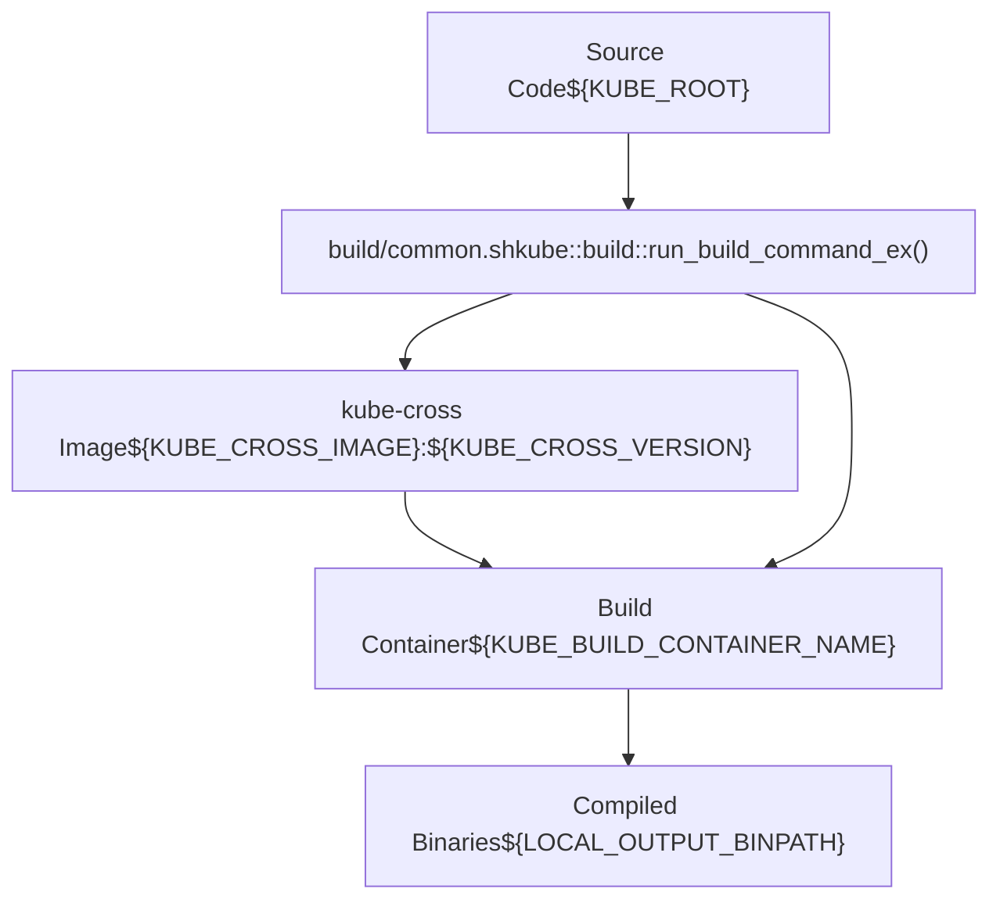
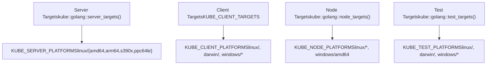
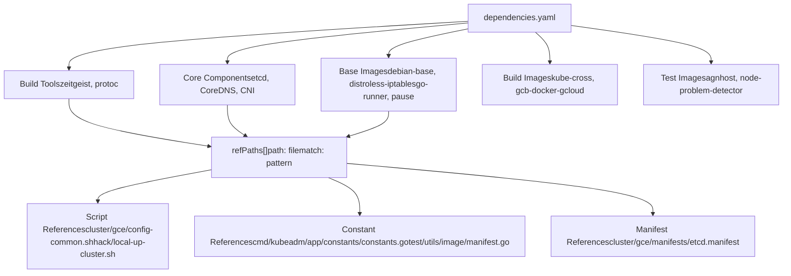
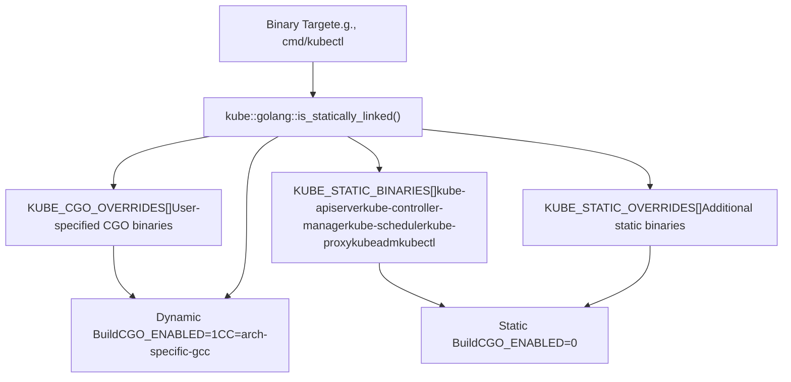
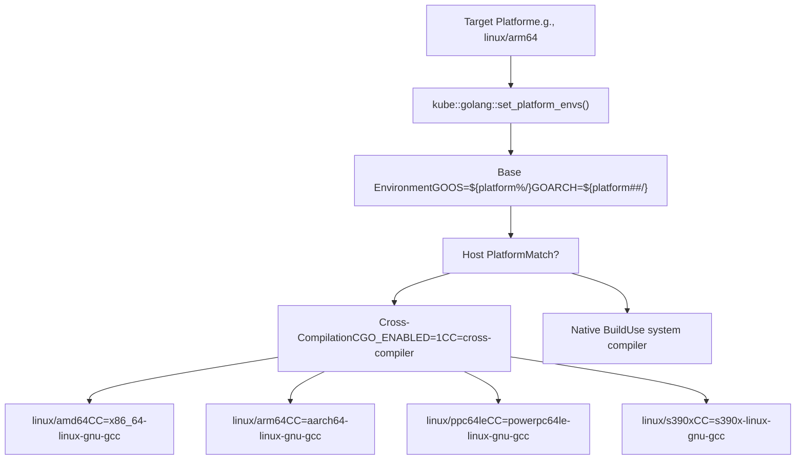
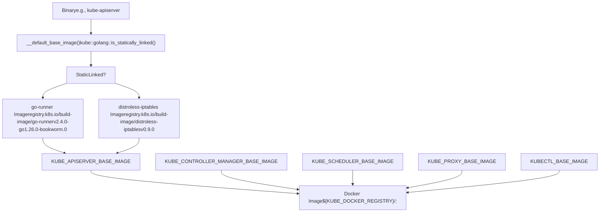
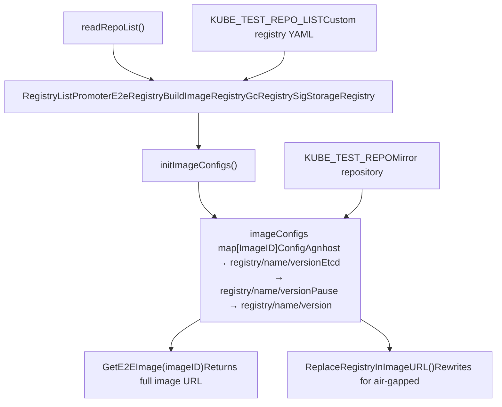
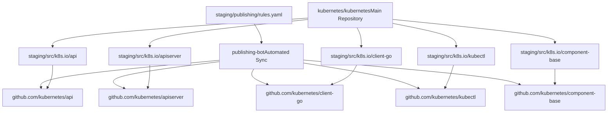
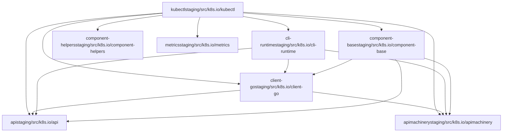
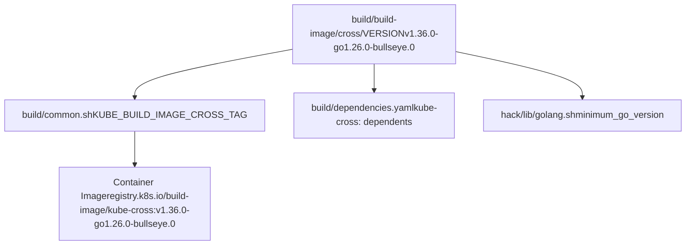

# 构建与发布流程

相关源文件

-   [.go-version](https://github.com/kubernetes/kubernetes/blob/2757a872/.go-version)
-   [build/build-image/cross/VERSION](https://github.com/kubernetes/kubernetes/blob/2757a872/build/build-image/cross/VERSION)
-   [build/common.sh](https://github.com/kubernetes/kubernetes/blob/2757a872/build/common.sh)
-   [build/dependencies.yaml](https://github.com/kubernetes/kubernetes/blob/2757a872/build/dependencies.yaml)
-   [cluster/gce/manifests/etcd.manifest](https://github.com/kubernetes/kubernetes/blob/2757a872/cluster/gce/manifests/etcd.manifest)
-   [cluster/gce/upgrade-aliases.sh](https://github.com/kubernetes/kubernetes/blob/2757a872/cluster/gce/upgrade-aliases.sh)
-   [cmd/kubeadm/app/constants/constants.go](https://github.com/kubernetes/kubernetes/blob/2757a872/cmd/kubeadm/app/constants/constants.go)
-   [cmd/kubeadm/app/constants/constants\_test.go](https://github.com/kubernetes/kubernetes/blob/2757a872/cmd/kubeadm/app/constants/constants_test.go)
-   [cmd/kubeadm/app/constants/constants\_unix.go](https://github.com/kubernetes/kubernetes/blob/2757a872/cmd/kubeadm/app/constants/constants_unix.go)
-   [cmd/kubeadm/app/constants/constants\_windows.go](https://github.com/kubernetes/kubernetes/blob/2757a872/cmd/kubeadm/app/constants/constants_windows.go)
-   [cmd/kubeadm/app/images/images.go](https://github.com/kubernetes/kubernetes/blob/2757a872/cmd/kubeadm/app/images/images.go)
-   [cmd/kubeadm/app/images/images\_test.go](https://github.com/kubernetes/kubernetes/blob/2757a872/cmd/kubeadm/app/images/images_test.go)
-   [cmd/kubeadm/app/phases/patchnode/patchnode\_test.go](https://github.com/kubernetes/kubernetes/blob/2757a872/cmd/kubeadm/app/phases/patchnode/patchnode_test.go)
-   [go.work](https://github.com/kubernetes/kubernetes/blob/2757a872/go.work)
-   [hack/lib/etcd.sh](https://github.com/kubernetes/kubernetes/blob/2757a872/hack/lib/etcd.sh)
-   [hack/lib/golang.sh](https://github.com/kubernetes/kubernetes/blob/2757a872/hack/lib/golang.sh)
-   [staging/README.md](https://github.com/kubernetes/kubernetes/blob/2757a872/staging/README.md?plain=1)
-   [staging/publishing/import-restrictions.yaml](https://github.com/kubernetes/kubernetes/blob/2757a872/staging/publishing/import-restrictions.yaml)
-   [staging/publishing/rules.yaml](https://github.com/kubernetes/kubernetes/blob/2757a872/staging/publishing/rules.yaml)
-   [staging/src/k8s.io/sample-apiserver/artifacts/example/deployment.yaml](https://github.com/kubernetes/kubernetes/blob/2757a872/staging/src/k8s.io/sample-apiserver/artifacts/example/deployment.yaml)
-   [test/e2e/framework/nodes\_util.go](https://github.com/kubernetes/kubernetes/blob/2757a872/test/e2e/framework/nodes_util.go)
-   [test/e2e/framework/providers/gcp.go](https://github.com/kubernetes/kubernetes/blob/2757a872/test/e2e/framework/providers/gcp.go)
-   [test/e2e/upgrades/network/kube\_proxy\_migration.go](https://github.com/kubernetes/kubernetes/blob/2757a872/test/e2e/upgrades/network/kube_proxy_migration.go)
-   [test/e2e/windows/device\_plugin.go](https://github.com/kubernetes/kubernetes/blob/2757a872/test/e2e/windows/device_plugin.go)
-   [test/images/Makefile](https://github.com/kubernetes/kubernetes/blob/2757a872/test/images/Makefile)
-   [test/utils/image/manifest.go](https://github.com/kubernetes/kubernetes/blob/2757a872/test/utils/image/manifest.go)
-   [test/utils/image/manifest\_test.go](https://github.com/kubernetes/kubernetes/blob/2757a872/test/utils/image/manifest_test.go)

本文档描述 Kubernetes 构建系统架构，包括交叉编译、依赖管理、二进制生成和容器镜像创建。内容涵盖为多个平台构建 Kubernetes 组件、管理外部依赖以及发布 staging 仓库的机制。

关于通过 Go modules 进行依赖管理的信息，请参见[Go Modules 与 Staging](/kubernetes/kubernetes/7.3-go-modules-and-staging)。关于集群部署工具，请参见[集群引导与管理](/kubernetes/kubernetes/5-cluster-bootstrap-and-management)。

---

## 构建系统架构

Kubernetes 构建系统使用基于 Docker 的交叉编译，为多个平台生成二进制和容器镜像。核心构建基础设施由 shell 脚本实现，用于编排 Docker 容器、Go 工具链配置与工件生成。

### 构建环境设置

构建系统通过 [build/common.sh1-193](https://github.com/kubernetes/kubernetes/blob/2757a872/build/common.sh#L1-L193) 初始化，该脚本建立构建常量与环境变量。关键配置包括：

| 配置 | 变量 | 默认值 |
| --- | --- | --- |
| 构建镜像 | `KUBE_CROSS_IMAGE` | `registry.k8s.io/build-image/kube-cross` |
| 构建镜像标签 | `KUBE_BUILD_IMAGE_CROSS_TAG` | 来自 [build/build-image/cross/VERSION1](https://github.com/kubernetes/kubernetes/blob/2757a872/build/build-image/cross/VERSION#L1-L1) |
| 输出根目录 | `LOCAL_OUTPUT_ROOT` | `_output` |
| 二进制输出目录 | `LOCAL_OUTPUT_BINPATH` | `_output/dockerized/bin` |
| Go 包 | `KUBE_GO_PACKAGE` | `k8s.io/kubernetes` |

构建容器名称基于主机名、仓库根路径和 git 分支的哈希生成：`KUBE_BUILD_CONTAINER_NAME_BASE="kube-build-${KUBE_ROOT_HASH}"` [build/common.sh150-156](https://github.com/kubernetes/kubernetes/blob/2757a872/build/common.sh#L150-L156)

### 使用 kube-cross 交叉编译

`kube-cross` Docker 镜像提供完整的交叉编译工具链。构建系统将源代码树挂载到容器中并执行编译命令：


**来源：** [build/common.sh358-473](https://github.com/kubernetes/kubernetes/blob/2757a872/build/common.sh#L358-L473) [build/build-image/cross/VERSION1](https://github.com/kubernetes/kubernetes/blob/2757a872/build/build-image/cross/VERSION#L1-L1)

构建容器通过环境变量进行构建控制 [build/common.sh405-427](https://github.com/kubernetes/kubernetes/blob/2757a872/build/common.sh#L405-L427)：

-   `KUBE_BUILD_PLATFORMS` - 目标平台（如 `linux/amd64`、`linux/arm64`）
-   `KUBE_FASTBUILD` - 仅为主机架构构建
-   `KUBE_STATIC_OVERRIDES` - 需要静态构建的二进制
-   `KUBE_CGO_OVERRIDES` - 需要开启 CGO 构建的二进制

### 构建目标与平台矩阵

构建系统根据用途定义多类构建目标：


**来源：** [hack/lib/golang.sh22-66](https://github.com/kubernetes/kubernetes/blob/2757a872/hack/lib/golang.sh#L22-L66) [hack/lib/golang.sh69-138](https://github.com/kubernetes/kubernetes/blob/2757a872/hack/lib/golang.sh#L69-L138) [hack/lib/golang.sh175-253](https://github.com/kubernetes/kubernetes/blob/2757a872/hack/lib/golang.sh#L175-L253)

Server targets [hack/lib/golang.sh69-83](https://github.com/kubernetes/kubernetes/blob/2757a872/hack/lib/golang.sh#L69-L83) 包括：

-   `cmd/kube-proxy`
-   `cmd/kube-apiserver`
-   `cmd/kube-controller-manager`
-   `cmd/kubelet`
-   `cmd/kubeadm`
-   `cmd/kube-scheduler`

Node targets [hack/lib/golang.sh126-134](https://github.com/kubernetes/kubernetes/blob/2757a872/hack/lib/golang.sh#L126-L134) 是面向工作节点的子集：

-   `cmd/kube-proxy`
-   `cmd/kubeadm`
-   `cmd/kubelet`
-   `staging/src/k8s.io/component-base/logs/kube-log-runner`

Client targets [hack/lib/golang.sh258-262](https://github.com/kubernetes/kubernetes/blob/2757a872/hack/lib/golang.sh#L258-L262) 包括：

-   `cmd/kubectl`
-   `cmd/kubectl-convert`

---

## 依赖管理

Kubernetes 构建系统通过集中式 YAML 文件与校验工具跟踪外部依赖。

### dependencies.yaml 结构

[build/dependencies.yaml1-268](https://github.com/kubernetes/kubernetes/blob/2757a872/build/dependencies.yaml#L1-L268) 定义了所有外部依赖及其版本和使用位置：


**来源：** [build/dependencies.yaml1-268](https://github.com/kubernetes/kubernetes/blob/2757a872/build/dependencies.yaml#L1-L268)

每个依赖条目包含：

-   `name` - 依赖标识符
-   `version` - 语义化版本或标签
-   `refPaths[]` - 带正则匹配模式的文件引用列表

### 使用 Zeitgeist 进行版本跟踪

`zeitgeist` 工具 [build/dependencies.yaml12-17](https://github.com/kubernetes/kubernetes/blob/2757a872/build/dependencies.yaml#L12-L17) 会验证所有被引用的版本是否与 `dependencies.yaml` 中声明版本一致。这可防止代码库中出现版本漂移。

关键组件版本 [build/dependencies.yaml19-329](https://github.com/kubernetes/kubernetes/blob/2757a872/build/dependencies.yaml#L19-L329)：

| 组件 | 版本 | 主要引用位置 |
| --- | --- | --- |
| CNI | 1.9.0 | [cluster/gce/config-common.sh](https://github.com/kubernetes/kubernetes/blob/2757a872/cluster/gce/config-common.sh) |
| CoreDNS（kube-up） | 1.14.1 | [cluster/addons/dns/coredns/](https://github.com/kubernetes/kubernetes/blob/2757a872/cluster/addons/dns/coredns/) |
| CoreDNS（kubeadm） | 1.14.1 | [cmd/kubeadm/app/constants/constants.go367](https://github.com/kubernetes/kubernetes/blob/2757a872/cmd/kubeadm/app/constants/constants.go#L367-L367) |
| crictl | 1.35.0 | [cluster/gce/gci/configure.sh](https://github.com/kubernetes/kubernetes/blob/2757a872/cluster/gce/gci/configure.sh) |
| etcd | 3.6.8 | [cluster/gce/manifests/etcd.manifest21](https://github.com/kubernetes/kubernetes/blob/2757a872/cluster/gce/manifests/etcd.manifest#L21-L21) |
| agnhost（测试） | 2.63.0 | [test/utils/image/manifest.go212](https://github.com/kubernetes/kubernetes/blob/2757a872/test/utils/image/manifest.go#L212-L212) |
| pause | 3.10.2 | [build/pause/Makefile195](https://github.com/kubernetes/kubernetes/blob/2757a872/build/pause/Makefile#L195-L195) |

### 组件版本常量

组件版本定义为常量，供代码库中各处使用：

**kubeadm 常量** [cmd/kubeadm/app/constants/constants.go325-367](https://github.com/kubernetes/kubernetes/blob/2757a872/cmd/kubeadm/app/constants/constants.go#L325-L367)：

```
MinExternalEtcdVersion = "3.5.24-0"DefaultEtcdVersion = "3.6.8-0"CoreDNSVersion = "v1.14.1"PauseVersion = "3.10"
```
**基础镜像版本** [build/common.sh79-82](https://github.com/kubernetes/kubernetes/blob/2757a872/build/common.sh#L79-L82)：

```
__default_distroless_iptables_version=v0.9.0__default_go_runner_version=v2.4.0-go1.26.0-bookworm.0__default_setcap_version=bookworm-v1.0.6
```
**测试镜像清单** [test/utils/image/manifest.go209-238](https://github.com/kubernetes/kubernetes/blob/2757a872/test/utils/image/manifest.go#L209-L238)：

```
configs[Etcd] = Config{list.GcEtcdRegistry, "etcd", "3.6.8-0"}configs[Pause] = Config{list.GcRegistry, "pause", "3.10.1"}configs[Agnhost] = Config{list.PromoterE2eRegistry, "agnhost", "2.63.0"}
```
**来源：** [cmd/kubeadm/app/constants/constants.go325-367](https://github.com/kubernetes/kubernetes/blob/2757a872/cmd/kubeadm/app/constants/constants.go#L325-L367) [build/common.sh79-116](https://github.com/kubernetes/kubernetes/blob/2757a872/build/common.sh#L79-L116) [test/utils/image/manifest.go209-251](https://github.com/kubernetes/kubernetes/blob/2757a872/test/utils/image/manifest.go#L209-L251)

---

## 二进制编译

构建系统使用平台特定配置和链接策略来编译 Go 二进制。

### 静态链接与动态链接

二进制会根据需求采用静态或动态方式编译。为便携性通常优先静态二进制：


**来源：** [hack/lib/golang.sh323-371](https://github.com/kubernetes/kubernetes/blob/2757a872/hack/lib/golang.sh#L323-L371) [hack/lib/golang.sh358-371](https://github.com/kubernetes/kubernetes/blob/2757a872/hack/lib/golang.sh#L358-L371)

静态二进制列表 [hack/lib/golang.sh323-336](https://github.com/kubernetes/kubernetes/blob/2757a872/hack/lib/golang.sh#L323-L336)：

-   核心控制平面：`kube-apiserver`、`kube-controller-manager`、`kube-scheduler`
-   网络：`kube-proxy`
-   节点：`kubeadm`、`kubelet` 相关组件
-   客户端：`kubectl`、`kubectl-convert`
-   辅助：`kube-log-runner`、`kubemark`、`mounter`

### 平台特定构建配置

交叉编译需要设置平台特定环境变量 [hack/lib/golang.sh477-519](https://github.com/kubernetes/kubernetes/blob/2757a872/hack/lib/golang.sh#L477-L519)：


**来源：** [hack/lib/golang.sh477-519](https://github.com/kubernetes/kubernetes/blob/2757a872/hack/lib/golang.sh#L477-L519)

平台矩阵 [hack/lib/golang.sh22-66](https://github.com/kubernetes/kubernetes/blob/2757a872/hack/lib/golang.sh#L22-L66)：

| 平台类别 | 支持平台 |
| --- | --- |
| Server | `linux/amd64`, `linux/arm64`, `linux/s390x`, `linux/ppc64le` |
| Node | Server 平台 + `windows/amd64` |
| Client | Server + Node + `linux/386`, `linux/arm`, `darwin/amd64`, `darwin/arm64`, `windows/386`, `windows/arm64` |
| Test | `linux/amd64`, `linux/arm64`, `linux/s390x`, `linux/ppc64le`, `darwin/amd64`, `darwin/arm64`, `windows/amd64`, `windows/arm64` |

### Go 版本管理

构建系统通过多个机制控制 Go 工具链版本 [hack/lib/golang.sh522-608](https://github.com/kubernetes/kubernetes/blob/2757a872/hack/lib/golang.sh#L522-L608)：

1.  **基础版本**: 从 [.go-version1](https://github.com/kubernetes/kubernetes/blob/2757a872/.go-version#L1-L1) 读取 → `1.26.1`
2.  **工具链选择**: 由 `GOTOOLCHAIN` 环境变量控制
3.  **自动下载**: 如所需版本不可用，`kube::golang::internal::verify_go_version()` 会下载该版本

**来源：** [.go-version1](https://github.com/kubernetes/kubernetes/blob/2757a872/.go-version#L1-L1) [hack/lib/golang.sh522-608](https://github.com/kubernetes/kubernetes/blob/2757a872/hack/lib/golang.sh#L522-L608)

---

## 容器镜像创建

Kubernetes 组件通过多阶段 Docker 构建打包为容器镜像，并使用最小化基础镜像。

### 基础镜像与选择策略

构建系统会根据二进制是静态还是动态链接来选择不同基础镜像：


**来源：** [build/common.sh79-116](https://github.com/kubernetes/kubernetes/blob/2757a872/build/common.sh#L79-L116)

基础镜像选择 [build/common.sh97-114](https://github.com/kubernetes/kubernetes/blob/2757a872/build/common.sh#L97-L114)：

-   **静态二进制**: 使用 `KUBE_GORUNNER_IMAGE`（go-runner 基础镜像）
-   **动态二进制**: 使用 `__default_dynamic_base_image`（distroless-iptables）
-   **kube-proxy**: 始终使用 distroless-iptables（需要 iptables 工具）
-   **kubectl (darwin)**: 使用 CGO 进行原生构建

### Docker 包装二进制

构建系统为特定组件创建容器镜像 [build/common.sh125-137](https://github.com/kubernetes/kubernetes/blob/2757a872/build/common.sh#L125-L137)：

```
kube::build::get_docker_wrapped_binaries() {  local targets=(    "kube-apiserver,${KUBE_APISERVER_BASE_IMAGE}"    "kube-controller-manager,${KUBE_CONTROLLER_MANAGER_BASE_IMAGE}"    "kube-scheduler,${KUBE_SCHEDULER_BASE_IMAGE}"    "kube-proxy,${KUBE_PROXY_BASE_IMAGE}"    "kubectl,${KUBECTL_BASE_IMAGE}"  )  echo "${targets[@]}"}
```
多阶段构建使用 [build/common.sh116](https://github.com/kubernetes/kubernetes/blob/2757a872/build/common.sh#L116-L116) 的 `setcap` 镜像进行 capability 管理：

-   `KUBE_BUILD_SETCAP_IMAGE` = `registry.k8s.io/build-image/setcap:bookworm-v1.0.6`

**来源：** [build/common.sh107-137](https://github.com/kubernetes/kubernetes/blob/2757a872/build/common.sh#L107-L137)

### 测试镜像管理

测试镜像通过独立的注册表配置系统管理 [test/utils/image/manifest.go34-145](https://github.com/kubernetes/kubernetes/blob/2757a872/test/utils/image/manifest.go#L34-L145)：


**来源：** [test/utils/image/manifest.go69-145](https://github.com/kubernetes/kubernetes/blob/2757a872/test/utils/image/manifest.go#L69-L145) [test/utils/image/manifest.go209-252](https://github.com/kubernetes/kubernetes/blob/2757a872/test/utils/image/manifest.go#L209-L252)

默认注册表 [test/utils/image/manifest.go130-142](https://github.com/kubernetes/kubernetes/blob/2757a872/test/utils/image/manifest.go#L130-L142)：

-   `PromoterE2eRegistry` = `registry.k8s.io/e2e-test-images`
-   `BuildImageRegistry` = `registry.k8s.io/build-image`
-   `GcEtcdRegistry` = `registry.k8s.io`
-   `GcRegistry` = `registry.k8s.io`
-   `SigStorageRegistry` = `registry.k8s.io/sig-storage`

测试镜像通过 [test/images/Makefile1-46](https://github.com/kubernetes/kubernetes/blob/2757a872/test/images/Makefile#L1-L46) 中的 `image-util.sh` 脚本构建。

---

## Staging 仓库发布

Kubernetes 单体仓库会将 staging 目录发布到各个独立仓库供外部使用。

### Staging 目录结构

Staging 仓库位于 [staging/src/k8s.io/](https://github.com/kubernetes/kubernetes/blob/2757a872/staging/src/k8s.io/)，并发布到 `kubernetes` 组织下的独立 GitHub 仓库。每个 staging 仓库都是拥有自身依赖的 Go 模块 [staging/README.md1-120](https://github.com/kubernetes/kubernetes/blob/2757a872/staging/README.md?plain=1#L1-L120)


**来源：** [staging/README.md1-120](https://github.com/kubernetes/kubernetes/blob/2757a872/staging/README.md?plain=1#L1-L120) [staging/publishing/rules.yaml1-100](https://github.com/kubernetes/kubernetes/blob/2757a872/staging/publishing/rules.yaml#L1-L100)

### 发布规则与依赖

[staging/publishing/rules.yaml1-2000](https://github.com/kubernetes/kubernetes/blob/2757a872/staging/publishing/rules.yaml#L1-L2000) 文件定义了每个 staging 仓库的发布配置：

**client-go 规则结构** [staging/publishing/rules.yaml73-144](https://github.com/kubernetes/kubernetes/blob/2757a872/staging/publishing/rules.yaml#L73-L144)：

```
- destination: client-go  branches:  - name: master    dependencies:    - repository: apimachinery      branch: master    - repository: api      branch: master    source:      branch: master      dirs:      - staging/src/k8s.io/client-go    smoke-test: |      go build -mod=mod ./...      go test -mod=mod ./...
```
每条规则指定：

-   `destination` - 目标仓库名
-   `branches[]` - 分支映射（master、release-1.32 等）
-   `dependencies[]` - 所需的其他 staging 仓库
-   `source.dirs[]` - 单体仓库中的源目录
-   `smoke-test` - 校验命令（可选）
-   `library` - 是否为库项目（相对于二进制项目）

**来源：** [staging/publishing/rules.yaml73-145](https://github.com/kubernetes/kubernetes/blob/2757a872/staging/publishing/rules.yaml#L73-L145)

### 依赖图示例

Staging 仓库存在依赖层级。例如，`kubectl` 依赖多个其他 staging 仓库 [staging/publishing/rules.yaml145-158](https://github.com/kubernetes/kubernetes/blob/2757a872/staging/publishing/rules.yaml#L145-L158)：


**来源：** [staging/publishing/rules.yaml145-158](https://github.com/kubernetes/kubernetes/blob/2757a872/staging/publishing/rules.yaml#L145-L158)

Go workspace [go.work1-41](https://github.com/kubernetes/kubernetes/blob/2757a872/go.work#L1-L41) 管理所有 staging 模块：

```
use (  .  ./staging/src/k8s.io/api  ./staging/src/k8s.io/apiextensions-apiserver  ./staging/src/k8s.io/apimachinery  // ... 30+ staging modules)
```
**来源：** [go.work1-41](https://github.com/kubernetes/kubernetes/blob/2757a872/go.work#L1-L41)

---

## 版本管理

### 组件版本跟踪

组件版本在不同位置跟踪以满足不同用途：

**构建/测试依赖** [build/dependencies.yaml66-83](https://github.com/kubernetes/kubernetes/blob/2757a872/build/dependencies.yaml#L66-L83)：

```
- name: "etcd"  version: 3.6.8  refPaths:  - path: cluster/gce/manifests/etcd.manifest    match: etcd_docker_tag|etcd_version  - path: cmd/kubeadm/app/constants/constants.go    match: DefaultEtcdVersion =  - path: hack/lib/etcd.sh    match: ETCD_VERSION=
```
**运行时常量** [cmd/kubeadm/app/constants/constants.go325-367](https://github.com/kubernetes/kubernetes/blob/2757a872/cmd/kubeadm/app/constants/constants.go#L325-L367)：

```
const (    MinExternalEtcdVersion = "3.5.24-0"    DefaultEtcdVersion = "3.6.8-0"    CoreDNSVersion = "v1.14.1"    PauseVersion = "3.10")
```
**GCE 集群清单** [cluster/gce/manifests/etcd.manifest21](https://github.com/kubernetes/kubernetes/blob/2757a872/cluster/gce/manifests/etcd.manifest#L21-L21)：

```
"image": "{{ pillar.get('etcd_docker_repository', 'registry.k8s.io/etcd') }}:{{ pillar.get('etcd_docker_tag', '3.6.8-0') }}"
```
**升级脚本** [cluster/gce/upgrade-aliases.sh173-174](https://github.com/kubernetes/kubernetes/blob/2757a872/cluster/gce/upgrade-aliases.sh#L173-L174)：

```
export ETCD_IMAGE=3.6.8-0export ETCD_VERSION=3.6.8
```
**来源：** [build/dependencies.yaml66-83](https://github.com/kubernetes/kubernetes/blob/2757a872/build/dependencies.yaml#L66-L83) [cmd/kubeadm/app/constants/constants.go325-367](https://github.com/kubernetes/kubernetes/blob/2757a872/cmd/kubeadm/app/constants/constants.go#L325-L367) [cluster/gce/manifests/etcd.manifest21](https://github.com/kubernetes/kubernetes/blob/2757a872/cluster/gce/manifests/etcd.manifest#L21-L21) [cluster/gce/upgrade-aliases.sh173-174](https://github.com/kubernetes/kubernetes/blob/2757a872/cluster/gce/upgrade-aliases.sh#L173-L174)

### 构建镜像版本管理

kube-cross 构建镜像版本记录于 [build/build-image/cross/VERSION1](https://github.com/kubernetes/kubernetes/blob/2757a872/build/build-image/cross/VERSION#L1-L1)，并在构建系统中被多处引用：


**来源：** [build/build-image/cross/VERSION1](https://github.com/kubernetes/kubernetes/blob/2757a872/build/build-image/cross/VERSION#L1-L1) [build/common.sh38-49](https://github.com/kubernetes/kubernetes/blob/2757a872/build/common.sh#L38-L49) [build/dependencies.yaml139-143](https://github.com/kubernetes/kubernetes/blob/2757a872/build/dependencies.yaml#L139-L143)

该版本格式编码了：

-   构建系统版本：`v1.36.0`
-   Go 版本：`go1.26.0`
-   基础操作系统：`bullseye`（Debian 11）
-   修订号：`.0`

这通过固定用于编译的精确工具链和依赖来确保构建可复现。
