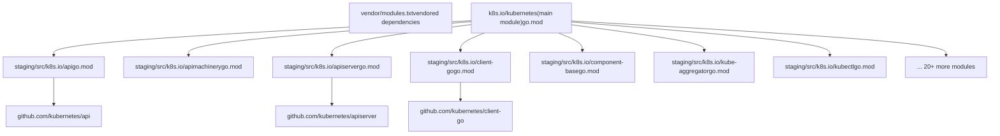
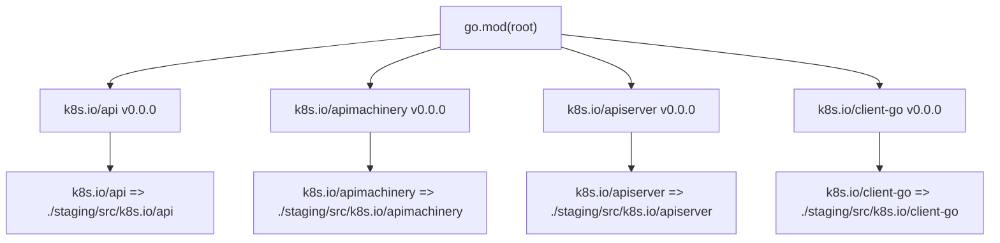
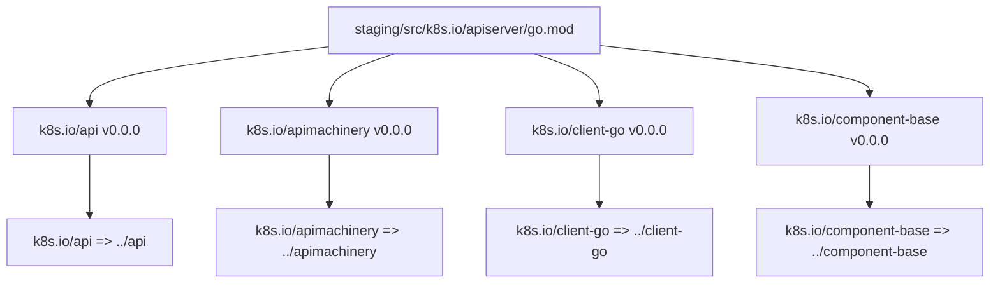
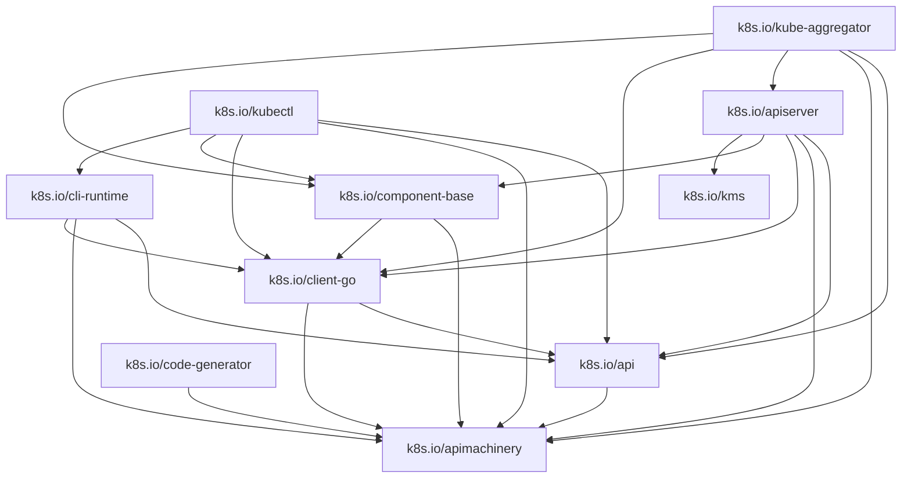
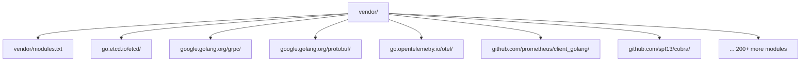
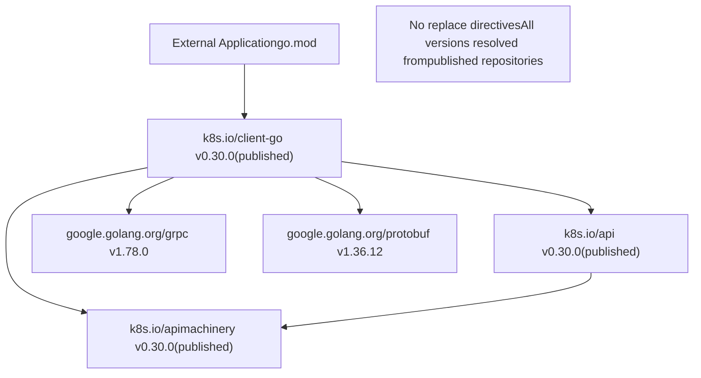
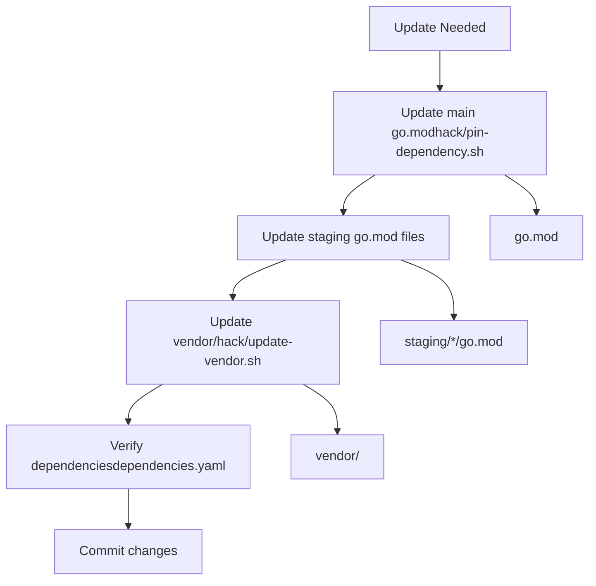

# Go Modules 与 Staging

相关源文件

-   [go.mod](https://github.com/kubernetes/kubernetes/blob/2757a872/go.mod)
-   [go.sum](https://github.com/kubernetes/kubernetes/blob/2757a872/go.sum)
-   [staging/src/k8s.io/apiextensions-apiserver/go.mod](https://github.com/kubernetes/kubernetes/blob/2757a872/staging/src/k8s.io/apiextensions-apiserver/go.mod)
-   [staging/src/k8s.io/apiextensions-apiserver/go.sum](https://github.com/kubernetes/kubernetes/blob/2757a872/staging/src/k8s.io/apiextensions-apiserver/go.sum)
-   [staging/src/k8s.io/apiserver/go.mod](https://github.com/kubernetes/kubernetes/blob/2757a872/staging/src/k8s.io/apiserver/go.mod)
-   [staging/src/k8s.io/apiserver/go.sum](https://github.com/kubernetes/kubernetes/blob/2757a872/staging/src/k8s.io/apiserver/go.sum)
-   [staging/src/k8s.io/cloud-provider/go.sum](https://github.com/kubernetes/kubernetes/blob/2757a872/staging/src/k8s.io/cloud-provider/go.sum)
-   [staging/src/k8s.io/component-base/go.sum](https://github.com/kubernetes/kubernetes/blob/2757a872/staging/src/k8s.io/component-base/go.sum)
-   [staging/src/k8s.io/controller-manager/go.sum](https://github.com/kubernetes/kubernetes/blob/2757a872/staging/src/k8s.io/controller-manager/go.sum)
-   [staging/src/k8s.io/kube-aggregator/go.mod](https://github.com/kubernetes/kubernetes/blob/2757a872/staging/src/k8s.io/kube-aggregator/go.mod)
-   [staging/src/k8s.io/kube-aggregator/go.sum](https://github.com/kubernetes/kubernetes/blob/2757a872/staging/src/k8s.io/kube-aggregator/go.sum)
-   [staging/src/k8s.io/kube-controller-manager/go.sum](https://github.com/kubernetes/kubernetes/blob/2757a872/staging/src/k8s.io/kube-controller-manager/go.sum)
-   [staging/src/k8s.io/kube-proxy/go.sum](https://github.com/kubernetes/kubernetes/blob/2757a872/staging/src/k8s.io/kube-proxy/go.sum)
-   [staging/src/k8s.io/kube-scheduler/go.sum](https://github.com/kubernetes/kubernetes/blob/2757a872/staging/src/k8s.io/kube-scheduler/go.sum)
-   [staging/src/k8s.io/pod-security-admission/go.sum](https://github.com/kubernetes/kubernetes/blob/2757a872/staging/src/k8s.io/pod-security-admission/go.sum)
-   [staging/src/k8s.io/sample-apiserver/go.mod](https://github.com/kubernetes/kubernetes/blob/2757a872/staging/src/k8s.io/sample-apiserver/go.mod)
-   [staging/src/k8s.io/sample-apiserver/go.sum](https://github.com/kubernetes/kubernetes/blob/2757a872/staging/src/k8s.io/sample-apiserver/go.sum)
-   [vendor/modules.txt](https://github.com/kubernetes/kubernetes/blob/2757a872/vendor/modules.txt)

## 目的与范围

本文档说明 Kubernetes 仓库的 Go 模块结构，重点介绍 staging 子目录，以及它们如何在单体仓库中作为可独立发布的 Go 模块运作。内容涵盖 `replace` 指令的使用、staging 模块间依赖关系，以及允许外部使用者将 Kubernetes 组件作为标准 Go 模块导入的发布机制。

关于外部依赖版本管理的信息，请参见[依赖管理](/kubernetes/kubernetes/7.1-dependency-management)。关于如何从这些模块构建二进制的流程细节，请参见[构建与发布流程](/kubernetes/kubernetes/7.2-build-and-release-process)。

---

## 含 Staging 的单体仓库结构

Kubernetes 仓库组织为一个单体仓库，包含一个主模块以及位于 `staging/src/k8s.io/` 目录中的多个子模块。每个 staging 模块都是独立 Go 模块，拥有各自的 `go.mod` 和 `go.sum` 文件，但它们在主仓库中开发，并发布到独立 Git 仓库。

### 仓库布局


**来源：** [go.mod1-251](https://github.com/kubernetes/kubernetes/blob/2757a872/go.mod#L1-L251) [staging/src/k8s.io/apiserver/go.mod1-133](https://github.com/kubernetes/kubernetes/blob/2757a872/staging/src/k8s.io/apiserver/go.mod#L1-L133) [staging/src/k8s.io/api/go.mod1-50](https://github.com/kubernetes/kubernetes/blob/2757a872/staging/src/k8s.io/api/go.mod#L1-L50)

---

## Staging 模块组织

Staging 模块位于 `staging/src/k8s.io/`，每个模块都代表可由外部项目独立消费的逻辑组件。

### Staging 模块完整列表

| Module Path | Purpose |
| --- | --- |
| `k8s.io/api` | Kubernetes 资源的 API 类型定义 |
| `k8s.io/apiextensions-apiserver` | CustomResourceDefinition API server 实现 |
| `k8s.io/apimachinery` | API 类型元数据、转换与序列化基础设施 |
| `k8s.io/apiserver` | 通用 API server 库 |
| `k8s.io/cli-runtime` | kubectl 命令运行时组件 |
| `k8s.io/client-go` | Kubernetes API 的 Go 客户端库 |
| `k8s.io/cloud-provider` | 云提供商集成接口 |
| `k8s.io/cluster-bootstrap` | 引导令牌管理 |
| `k8s.io/code-generator` | API 类型代码生成工具 |
| `k8s.io/component-base` | Kubernetes 二进制共享基础组件 |
| `k8s.io/component-helpers` | 组件实现辅助函数 |
| `k8s.io/controller-manager` | Controller manager 框架 |
| `k8s.io/cri-api` | Container Runtime Interface API 定义 |
| `k8s.io/cri-client` | CRI 客户端实现 |
| `k8s.io/csi-translation-lib` | CSI 卷插件转换 |
| `k8s.io/dynamic-resource-allocation` | 动态资源分配 API |
| `k8s.io/endpointslice` | EndpointSlice controller |
| `k8s.io/externaljwt` | 外部 JWT 认证 |
| `k8s.io/kms` | Key Management Service 集成 |
| `k8s.io/kube-aggregator` | API 聚合层 |
| `k8s.io/kube-controller-manager` | Controller manager 类型 |
| `k8s.io/kube-proxy` | Proxy 类型与接口 |
| `k8s.io/kube-scheduler` | Scheduler 类型与接口 |
| `k8s.io/kubectl` | kubectl 实现 |
| `k8s.io/kubelet` | Kubelet 类型与接口 |
| `k8s.io/metrics` | Metrics API 类型 |
| `k8s.io/mount-utils` | 挂载工具函数 |
| `k8s.io/pod-security-admission` | Pod Security Admission 插件 |
| `k8s.io/sample-apiserver` | 用于学习的示例 API server |
| `k8s.io/sample-cli-plugin` | 示例 kubectl 插件 |
| `k8s.io/sample-controller` | 示例 controller 实现 |

**来源：** [go.mod84-121](https://github.com/kubernetes/kubernetes/blob/2757a872/go.mod#L84-L121) [go.mod220-251](https://github.com/kubernetes/kubernetes/blob/2757a872/go.mod#L220-L251)

---

## Replace 指令机制

主模块与 staging 模块通过 `replace` 指令在开发期间将导入重定向到本地路径，同时允许外部使用者使用已发布版本。

### 主模块 Replace 指令

主 `go.mod` 文件包含指向 staging 子目录的 replace 指令：


**来自主 go.mod 的示例：**

```
require (
    ...
    k8s.io/api v0.0.0
    k8s.io/apimachinery v0.0.0
    k8s.io/apiserver v0.0.0
    k8s.io/client-go v0.0.0
    ...
)

replace (
    k8s.io/api => ./staging/src/k8s.io/api
    k8s.io/apimachinery => ./staging/src/k8s.io/apimachinery
    k8s.io/apiserver => ./staging/src/k8s.io/apiserver
    k8s.io/client-go => ./staging/src/k8s.io/client-go
    ...
)
```
**来源：** [go.mod84-121](https://github.com/kubernetes/kubernetes/blob/2757a872/go.mod#L84-L121) [go.mod219-251](https://github.com/kubernetes/kubernetes/blob/2757a872/go.mod#L219-L251)

### Staging 模块 Replace 指令

每个 staging 模块也包含 replace 指令，用于指向同级 staging 模块：


**apiserver go.mod 示例：**

```
require (
    ...
    k8s.io/api v0.0.0
    k8s.io/apimachinery v0.0.0
    k8s.io/client-go v0.0.0
    k8s.io/component-base v0.0.0
    ...
)

replace (
    k8s.io/api => ../api
    k8s.io/apimachinery => ../apimachinery
    k8s.io/client-go => ../client-go
    k8s.io/component-base => ../component-base
    k8s.io/kms => ../kms
)
```
**来源：** [staging/src/k8s.io/apiserver/go.mod51-64](https://github.com/kubernetes/kubernetes/blob/2757a872/staging/src/k8s.io/apiserver/go.mod#L51-L64) [staging/src/k8s.io/apiserver/go.mod126-132](https://github.com/kubernetes/kubernetes/blob/2757a872/staging/src/k8s.io/apiserver/go.mod#L126-L132)

---

## 依赖关系

Staging 模块之间彼此依赖，形成有向无环图（DAG）。较底层模块（如 `apimachinery`）会被较高层模块（如 `client-go` 与 `apiserver`）导入。

### Staging 模块依赖图


**来源：** [staging/src/k8s.io/apiserver/go.mod51-64](https://github.com/kubernetes/kubernetes/blob/2757a872/staging/src/k8s.io/apiserver/go.mod#L51-L64) [staging/src/k8s.io/kube-aggregator/go.mod19-28](https://github.com/kubernetes/kubernetes/blob/2757a872/staging/src/k8s.io/kube-aggregator/go.mod#L19-L28) [staging/src/k8s.io/client-go/go.mod1-50](https://github.com/kubernetes/kubernetes/blob/2757a872/staging/src/k8s.io/client-go/go.mod#L1-L50)

### 版本解析

Staging 模块之间的所有内部依赖都使用版本 `v0.0.0`：

```
require (
    k8s.io/api v0.0.0
    k8s.io/apimachinery v0.0.0
    k8s.io/client-go v0.0.0
    ...
)
```
此特殊版本在开发期间通过 `replace` 指令解析为本地路径。发布时会替换为实际语义化版本。

**来源：** [staging/src/k8s.io/apiserver/go.mod51-58](https://github.com/kubernetes/kubernetes/blob/2757a872/staging/src/k8s.io/apiserver/go.mod#L51-L58) [go.mod84-121](https://github.com/kubernetes/kubernetes/blob/2757a872/go.mod#L84-L121)

---

## Vendor 目录

主仓库包含一个 `vendor/` 目录，保存所有外部依赖。`vendor/modules.txt` 文件列出了所有 vendored 模块及其版本以及提供的包。

### Vendor 目录结构


### modules.txt 格式

`vendor/modules.txt` 文件记录每个 vendored 模块：

```
## explicit; go 1.26.0
cel.dev/expr
# github.com/emicklei/go-restful/v3 v3.13.0
## explicit; go 1.13
github.com/emicklei/go-restful/v3
github.com/emicklei/go-restful/v3/log
# go.etcd.io/etcd/api/v3 v3.6.8
## explicit; go 1.24.0
go.etcd.io/etcd/api/v3/authpb
go.etcd.io/etcd/api/v3/etcdserverpb
go.etcd.io/etcd/api/v3/mvccpb
...
```
每个条目包含：

-   模块路径与版本
-   Go 版本要求
-   提供的包列表

**来源：** [vendor/modules.txt1-50](https://github.com/kubernetes/kubernetes/blob/2757a872/vendor/modules.txt#L1-L50) [vendor/modules.txt583-592](https://github.com/kubernetes/kubernetes/blob/2757a872/vendor/modules.txt#L583-L592)

---

## 发布机制

Staging 模块会自动发布到 `github.com/kubernetes/` 组织下的独立 Git 仓库。外部使用者可导入这些已发布版本，而无需整个 Kubernetes 仓库。

### 发布流程

> **[Mermaid sequence]**
> *(图表结构无法解析)*

### 版本映射

Kubernetes 发布版本与已发布 staging 模块使用不同版本方案：

| Kubernetes Release | Staging Module Version | Example |
| --- | --- | --- |
| v1.30.0 | v0.30.0 | `k8s.io/api v0.30.0` |
| v1.29.3 | v0.29.3 | `k8s.io/client-go v0.29.3` |
| v1.28.1 | v0.28.1 | `k8s.io/apimachinery v0.28.1` |

Staging 模块的主版本始终为 0，以保持与 Go module 语义的兼容性。

**来源：** [go.mod7](https://github.com/kubernetes/kubernetes/blob/2757a872/go.mod#L7-L7) [staging/src/k8s.io/api/go.mod3](https://github.com/kubernetes/kubernetes/blob/2757a872/staging/src/k8s.io/api/go.mod#L3-L3)

---

## 外部使用

外部项目可将 staging 模块作为常规 Go 依赖导入，无需 replace 指令。已发布版本会自动将依赖解析到其他已发布 staging 模块。

### 示例：外部项目使用 client-go

```
// External project's go.mod
module example.com/my-k8s-app

go 1.26

require (
    k8s.io/api v0.30.0
    k8s.io/apimachinery v0.30.0
    k8s.io/client-go v0.30.0
)
```
当外部项目运行 `go mod download` 时，Go 工具链会：

1.  从已发布仓库下载 `k8s.io/client-go`
2.  将其依赖解析到正确的已发布版本
3.  不应用任何 replace 指令（这些仅存在于开发仓库中）

### 面向外部使用者的依赖解析


**来源：** [staging/src/k8s.io/client-go/go.mod1-50](https://github.com/kubernetes/kubernetes/blob/2757a872/staging/src/k8s.io/client-go/go.mod#L1-L50)

---

## 更新与同步流程

当单体仓库中需要跨模块更新依赖时，该过程涉及更新多个 go.mod 文件：

### 更新流程


### 更新脚本

-   `hack/pin-dependency.sh` - 将特定依赖固定到某个版本
-   `hack/update-vendor.sh` - 更新 `go.mod`、`go.sum` 与 `vendor/` 目录
-   `dependencies.yaml` 校验 - 确保模块间版本一致（参见[依赖管理](/kubernetes/kubernetes/7.1-dependency-management)）

**来源：** [go.mod1-6](https://github.com/kubernetes/kubernetes/blob/2757a872/go.mod#L1-L6)

---

## 模块元数据

每个 staging 模块都包含遵循特定约定的标准 Go module 文件：

### go.mod 结构

```
// This is a generated file. Do not edit directly.

module k8s.io/apiserver

go 1.26.0

godebug default=go1.26

require (
    // Direct dependencies
    k8s.io/api v0.0.0
    k8s.io/apimachinery v0.0.0
    ...
)

require (
    // Indirect dependencies
    cel.dev/expr v0.24.0 // indirect
    github.com/golang/protobuf v1.5.4 // indirect
    ...
)

replace (
    k8s.io/api => ../api
    k8s.io/apimachinery => ../apimachinery
    ...
)
```
**关键要素：**

-   **Header comment**: 表示该文件为自动生成
-   **Module declaration**: 模块路径
-   **Go version**: 最低 Go 版本要求
-   **godebug**: Go 调试标志
-   **require blocks**: 直接与间接依赖
-   **replace directives**: 本地路径覆盖

**来源：** [staging/src/k8s.io/apiserver/go.mod1-133](https://github.com/kubernetes/kubernetes/blob/2757a872/staging/src/k8s.io/apiserver/go.mod#L1-L133)

### go.sum 文件

每个模块维护一个 `go.sum` 文件，其中包含所有依赖的加密校验和：

```
cel.dev/expr v0.24.0 h1:56OvJKSH3hDGL0ml5uSxZmz3/3Pq4tJ+fb1unVLAFcY=
cel.dev/expr v0.24.0/go.mod h1:hLPLo1W4QUmuYdA72RBX06QTs6MXw941piREPl3Yfiw=
github.com/google/uuid v1.6.0 h1:NIvaJDMOsjHA8n1jAhLSgzrAzy1Hgr+hNrb57e+94F0=
github.com/google/uuid v1.6.0/go.mod h1:TIyPZe4MgqvfeYDBFedMoGGpEw/LqOeaOT+nhxU+yHo=
```
每个条目包含：

-   模块路径与版本
-   模块内容哈希（`h1:` 前缀）
-   go.mod 文件哈希

**来源：** [staging/src/k8s.io/apiserver/go.sum1-300](https://github.com/kubernetes/kubernetes/blob/2757a872/staging/src/k8s.io/apiserver/go.sum#L1-L300) [go.sum1-300](https://github.com/kubernetes/kubernetes/blob/2757a872/go.sum#L1-L300)

---

## Staging 架构的优势

Staging 模块架构带来多项优势：

| Benefit | Description |
| --- | --- |
| **Independent Consumption** | 外部项目可仅导入所需组件，无需整个 Kubernetes 代码库 |
| **Versioned APIs** | 每个模块可根据 API 稳定性独立版本化 |
| **Reduced Build Time** | 模块更小意味着外部使用者编译更快 |
| **Clear Dependencies** | 组件间依赖关系显式清晰 |
| **Easier Testing** | 单个模块可独立测试 |
| **Gradual Migration** | 外部项目可渐进式升级模块 |

**来源：** [go.mod84-121](https://github.com/kubernetes/kubernetes/blob/2757a872/go.mod#L84-L121) [go.mod219-251](https://github.com/kubernetes/kubernetes/blob/2757a872/go.mod#L219-L251)
