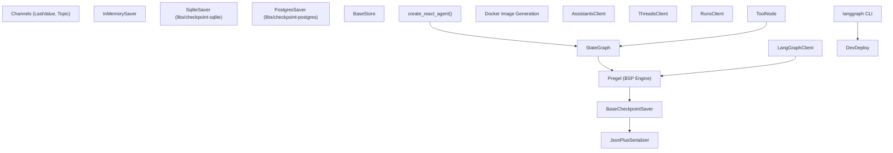
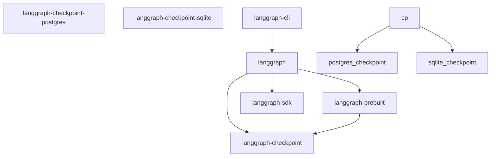
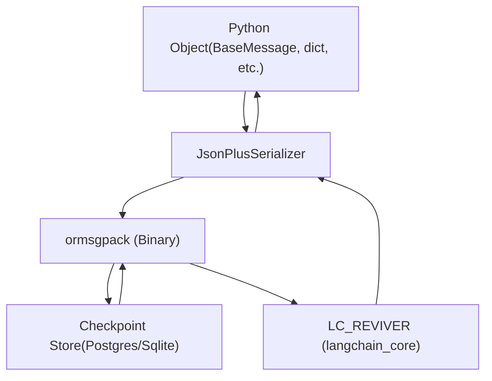

# 概述

相关源文件

-   [Makefile](https://github.com/langchain-ai/langgraph/blob/1fd51e8f/Makefile)
-   [README.md](https://github.com/langchain-ai/langgraph/blob/1fd51e8f/README.md?plain=1)
-   [examples/react-agent-structured-output.ipynb](https://github.com/langchain-ai/langgraph/blob/1fd51e8f/examples/react-agent-structured-output.ipynb)
-   [libs/checkpoint-postgres/uv.lock](https://github.com/langchain-ai/langgraph/blob/1fd51e8f/libs/checkpoint-postgres/uv.lock)
-   [libs/checkpoint-sqlite/uv.lock](https://github.com/langchain-ai/langgraph/blob/1fd51e8f/libs/checkpoint-sqlite/uv.lock)
-   [libs/checkpoint/langgraph/checkpoint/serde/jsonplus.py](https://github.com/langchain-ai/langgraph/blob/1fd51e8f/libs/checkpoint/langgraph/checkpoint/serde/jsonplus.py)
-   [libs/checkpoint/pyproject.toml](https://github.com/langchain-ai/langgraph/blob/1fd51e8f/libs/checkpoint/pyproject.toml)
-   [libs/checkpoint/tests/test\_jsonplus.py](https://github.com/langchain-ai/langgraph/blob/1fd51e8f/libs/checkpoint/tests/test_jsonplus.py)
-   [libs/checkpoint/uv.lock](https://github.com/langchain-ai/langgraph/blob/1fd51e8f/libs/checkpoint/uv.lock)
-   [libs/langgraph/README.md](https://github.com/langchain-ai/langgraph/blob/1fd51e8f/libs/langgraph/README.md?plain=1)
-   [libs/langgraph/pyproject.toml](https://github.com/langchain-ai/langgraph/blob/1fd51e8f/libs/langgraph/pyproject.toml)
-   [libs/langgraph/tests/\_\_snapshots\_\_/test\_pregel.ambr](https://github.com/langchain-ai/langgraph/blob/1fd51e8f/libs/langgraph/tests/__snapshots__/test_pregel.ambr)
-   [libs/langgraph/tests/\_\_snapshots\_\_/test\_pregel\_async.ambr](https://github.com/langchain-ai/langgraph/blob/1fd51e8f/libs/langgraph/tests/__snapshots__/test_pregel_async.ambr)
-   [libs/langgraph/uv.lock](https://github.com/langchain-ai/langgraph/blob/1fd51e8f/libs/langgraph/uv.lock)
-   [libs/prebuilt/pyproject.toml](https://github.com/langchain-ai/langgraph/blob/1fd51e8f/libs/prebuilt/pyproject.toml)
-   [libs/prebuilt/uv.lock](https://github.com/langchain-ai/langgraph/blob/1fd51e8f/libs/prebuilt/uv.lock)
-   [libs/sdk-py/uv.lock](https://github.com/langchain-ai/langgraph/blob/1fd51e8f/libs/sdk-py/uv.lock)

## 目标与范围

LangGraph 是一个用于构建具备状态的多参与者大型语言模型（LLM）应用的底层编排框架。不同于高层抽象，LangGraph 提供基础设施但不抽象提示词或架构，从而让开发者能够完全掌控其应用逻辑 [libs/langgraph/pyproject.toml8](https://github.com/langchain-ai/langgraph/blob/1fd51e8f/libs/langgraph/pyproject.toml#L8-L8)

### 核心能力

LangGraph 为构建生产级代理提供基础能力：

| 能力 | 描述 | 实现 |
| --- | --- | --- |
| **持久执行** | 代理可跨故障持续运行，并从精确状态恢复 | `BaseCheckpointSaver` 在每个执行步骤后持久化包含通道值与版本的 `Checkpoint` 对象 [README.md39](https://github.com/langchain-ai/langgraph/blob/1fd51e8f/README.md?plain=1#L39-L39) |
| **人机协同（Human-in-the-Loop）** | 在任意执行点检查并修改代理状态 | 中断系统允许通过 `update_state()` 修改状态并恢复执行 [README.md40](https://github.com/langchain-ai/langgraph/blob/1fd51e8f/README.md?plain=1#L40-L40) |
| **全面内存** | 短期工作内存与长期持久存储 | 通道系统用于步骤级状态 + `BaseStore` 用于跨线程持久内存 [README.md41](https://github.com/langchain-ai/langgraph/blob/1fd51e8f/README.md?plain=1#L41-L41) |

该框架基于受 Google Pregel 论文启发的批量同步并行（BSP）执行模型构建 [README.md82](https://github.com/langchain-ai/langgraph/blob/1fd51e8f/README.md?plain=1#L82-L82)

来源：[README.md12-43](https://github.com/langchain-ai/langgraph/blob/1fd51e8f/README.md?plain=1#L12-L43) [libs/langgraph/pyproject.toml5-8](https://github.com/langchain-ai/langgraph/blob/1fd51e8f/libs/langgraph/pyproject.toml#L5-L8) [README.md80-83](https://github.com/langchain-ai/langgraph/blob/1fd51e8f/README.md?plain=1#L80-L83)

## 核心概念

LangGraph 实现了 **批量同步并行（BSP）** 执行模型。该框架围绕四个基础抽象：

### 核心抽象

| 概念 | 描述 | 主要实现 |
| --- | --- | --- |
| **图（Graph）** | 由节点（函数）和边（控制流）组成的计算 DAG | `StateGraph` 类 [libs/langgraph/README.md29](https://github.com/langchain-ai/langgraph/blob/1fd51e8f/libs/langgraph/README.md?plain=1#L29-L29) |
| **状态（State）** | 通过类型化通道管理的共享数据结构 | `TypedDict` 模式 [libs/langgraph/README.md33-35](https://github.com/langchain-ai/langgraph/blob/1fd51e8f/libs/langgraph/README.md?plain=1#L33-L35) |
| **通道（Channels）** | 具备合并语义的类型化状态容器 | `LastValue`, `Topic`, `BinaryOperatorAggregate` |
| **检查点（Checkpoint）** | 包含通道值与执行元数据的序列化快照 | `BaseCheckpointSaver` 接口 [libs/checkpoint/pyproject.toml8](https://github.com/langchain-ai/langgraph/blob/1fd51e8f/libs/checkpoint/pyproject.toml#L8-L8) |

### 图定义方式

**声明式 API**（StateGraph）：

```
from langgraph.graph import START, StateGraphfrom typing_extensions import TypedDict class State(TypedDict):    text: str def node_a(state: State) -> dict:    return {"text": state["text"] + "a"} graph = StateGraph(State)graph.add_node("node_a", node_a)graph.add_edge(START, "node_a")
```
### 执行模型

在运行时，执行引擎以离散的超级步编排执行：

1.  **规划（Plan）**：基于通道状态确定要执行哪些节点。
2.  **执行（Execute）**：并行运行节点。
3.  **更新（Update）**：使用 reducer 将写入应用到通道。
4.  **检查点（Checkpoint）**：通过 `BaseCheckpointSaver` 持久化状态。

来源：[libs/langgraph/README.md26-53](https://github.com/langchain-ai/langgraph/blob/1fd51e8f/libs/langgraph/README.md?plain=1#L26-L53) [libs/checkpoint/pyproject.toml5-17](https://github.com/langchain-ai/langgraph/blob/1fd51e8f/libs/checkpoint/pyproject.toml#L5-L17) [README.md80-83](https://github.com/langchain-ai/langgraph/blob/1fd51e8f/README.md?plain=1#L80-L83)

## 架构组件

LangGraph 系统由多个主要子系统组成，并以单体仓库（monorepo）形式组织。

### 高层系统架构


**代码实体映射：**

1.  **核心执行引擎**：

    -   [libs/langgraph/README.md29-45](https://github.com/langchain-ai/langgraph/blob/1fd51e8f/libs/langgraph/README.md?plain=1#L29-L45) 中的 `StateGraph`：用于图构建的声明式 API。
    -   `Pregel`：底层引擎，实现受 Google Pregel 启发的 BSP 模型 [README.md82](https://github.com/langchain-ai/langgraph/blob/1fd51e8f/README.md?plain=1#L82-L82)
2.  **持久化层**：

    -   [libs/checkpoint/pyproject.toml8](https://github.com/langchain-ai/langgraph/blob/1fd51e8f/libs/checkpoint/pyproject.toml#L8-L8) 中的 `BaseCheckpointSaver`：检查点机制的基础接口。
    -   [libs/langgraph/pyproject.toml60](https://github.com/langchain-ai/langgraph/blob/1fd51e8f/libs/langgraph/pyproject.toml#L60-L60) 中的 `PostgresSaver`：生产级 PostgreSQL 持久化。
    -   [libs/langgraph/pyproject.toml59](https://github.com/langchain-ai/langgraph/blob/1fd51e8f/libs/langgraph/pyproject.toml#L59-L59) 中的 `SqliteSaver`：本地 SQLite 持久化。
    -   [libs/checkpoint/langgraph/checkpoint/serde/jsonplus.py50](https://github.com/langchain-ai/langgraph/blob/1fd51e8f/libs/checkpoint/langgraph/checkpoint/serde/jsonplus.py#L50-L50) 中的 `JsonPlusSerializer`：高级序列化器，支持 `ormsgpack` 与 `langchain-core` reviver [libs/checkpoint/langgraph/checkpoint/serde/jsonplus.py30-45](https://github.com/langchain-ai/langgraph/blob/1fd51e8f/libs/checkpoint/langgraph/checkpoint/serde/jsonplus.py#L30-L45)
3.  **客户端 SDK**：

    -   [libs/langgraph/pyproject.toml29](https://github.com/langchain-ai/langgraph/blob/1fd51e8f/libs/langgraph/pyproject.toml#L29-L29) 中的 `LangGraphClient`：用于与已部署图交互的 Python 客户端。
4.  **预构建组件**：

    -   `create_react_agent()`：ReAct 风格代理的工厂函数 [libs/langgraph/pyproject.toml30](https://github.com/langchain-ai/langgraph/blob/1fd51e8f/libs/langgraph/pyproject.toml#L30-L30)
    -   `ToolNode`：用于执行 LangChain 工具的标准节点。

来源：[libs/langgraph/pyproject.toml26-33](https://github.com/langchain-ai/langgraph/blob/1fd51e8f/libs/langgraph/pyproject.toml#L26-L33) [libs/checkpoint/pyproject.toml5-17](https://github.com/langchain-ai/langgraph/blob/1fd51e8f/libs/checkpoint/pyproject.toml#L5-L17) [libs/checkpoint/langgraph/checkpoint/serde/jsonplus.py50-100](https://github.com/langchain-ai/langgraph/blob/1fd51e8f/libs/checkpoint/langgraph/checkpoint/serde/jsonplus.py#L50-L100) [README.md80-83](https://github.com/langchain-ai/langgraph/blob/1fd51e8f/README.md?plain=1#L80-L83)

## 包生态

LangGraph 以多个包的形式分发，包之间的显式依赖关系由 `uv` 管理 [libs/langgraph/pyproject.toml83-90](https://github.com/langchain-ai/langgraph/blob/1fd51e8f/libs/langgraph/pyproject.toml#L83-L90)


**包描述：**

| 包 | 目的 | 关键依赖 |
| --- | --- | --- |
| `langgraph` | 提供图构建与执行的核心框架 | `langgraph-checkpoint`, `langchain-core` [libs/langgraph/pyproject.toml26-28](https://github.com/langchain-ai/langgraph/blob/1fd51e8f/libs/langgraph/pyproject.toml#L26-L28) |
| `langgraph-checkpoint` | 检查点保存器的基础接口 | `ormsgpack`, `langchain-core` [libs/checkpoint/pyproject.toml14-17](https://github.com/langchain-ai/langgraph/blob/1fd51e8f/libs/checkpoint/pyproject.toml#L14-L17) |
| `langgraph-prebuilt` | 高层代理与工具抽象 | `langgraph-checkpoint`, `langchain-core` [libs/prebuilt/pyproject.toml26-29](https://github.com/langchain-ai/langgraph/blob/1fd51e8f/libs/prebuilt/pyproject.toml#L26-L29) |

来源：[libs/langgraph/pyproject.toml26-33](https://github.com/langchain-ai/langgraph/blob/1fd51e8f/libs/langgraph/pyproject.toml#L26-L33) [libs/checkpoint/pyproject.toml14-17](https://github.com/langchain-ai/langgraph/blob/1fd51e8f/libs/checkpoint/pyproject.toml#L14-L17) [libs/prebuilt/pyproject.toml26-29](https://github.com/langchain-ai/langgraph/blob/1fd51e8f/libs/prebuilt/pyproject.toml#L26-L29) [libs/langgraph/pyproject.toml83-90](https://github.com/langchain-ai/langgraph/blob/1fd51e8f/libs/langgraph/pyproject.toml#L83-L90)

## 执行与序列化

### 序列化流程

`JsonPlusSerializer` 负责将复杂 Python 对象（如 LangChain 消息）转换为可存储格式。


1.  **编码（Encoding）**：`JsonPlusSerializer` 使用 `ormsgpack` 进行高性能二进制序列化 [libs/checkpoint/langgraph/checkpoint/serde/jsonplus.py30-50](https://github.com/langchain-ai/langgraph/blob/1fd51e8f/libs/checkpoint/langgraph/checkpoint/serde/jsonplus.py#L30-L50)
2.  **复原（Revival）**：它与 `langchain_core.load.load.Reviver` 集成，以在反序列化期间正确重建 LangChain 对象 [libs/checkpoint/langgraph/checkpoint/serde/jsonplus.py45-50](https://github.com/langchain-ai/langgraph/blob/1fd51e8f/libs/checkpoint/langgraph/checkpoint/serde/jsonplus.py#L45-L50)
3.  **安全性（Security）**：它包含模块白名单机制，以防止在复原期间执行任意代码 [libs/checkpoint/langgraph/checkpoint/serde/jsonplus.py65-80](https://github.com/langchain-ai/langgraph/blob/1fd51e8f/libs/checkpoint/langgraph/checkpoint/serde/jsonplus.py#L65-L80)

来源：[libs/checkpoint/langgraph/checkpoint/serde/jsonplus.py1-87](https://github.com/langchain-ai/langgraph/blob/1fd51e8f/libs/checkpoint/langgraph/checkpoint/serde/jsonplus.py#L1-L87) [libs/checkpoint/pyproject.toml16](https://github.com/langchain-ai/langgraph/blob/1fd51e8f/libs/checkpoint/pyproject.toml#L16-L16)

## 与 LangChain 生态系统集成

LangGraph 旨在可独立运行，同时提供与 LangChain 的深度集成：

| 组件 | 角色 |
| --- | --- |
| **LangChain Core** | 模型和消息的基础接口 [libs/langgraph/pyproject.toml27](https://github.com/langchain-ai/langgraph/blob/1fd51e8f/libs/langgraph/pyproject.toml#L27-L27) |
| **LangSmith** | 调试、追踪与可观测性 [README.md42](https://github.com/langchain-ai/langgraph/blob/1fd51e8f/README.md?plain=1#L42-L42) |
| **LangGraph Studio** | 可视化原型设计与调试 [libs/langgraph/README.md74](https://github.com/langchain-ai/langgraph/blob/1fd51e8f/libs/langgraph/README.md?plain=1#L74-L74) |

来源：[README.md42-57](https://github.com/langchain-ai/langgraph/blob/1fd51e8f/README.md?plain=1#L42-L57) [libs/langgraph/README.md69-76](https://github.com/langchain-ai/langgraph/blob/1fd51e8f/libs/langgraph/README.md?plain=1#L69-L76)

## 系统要求

**Python 版本**：`>=3.10` [libs/langgraph/pyproject.toml10](https://github.com/langchain-ai/langgraph/blob/1fd51e8f/libs/langgraph/pyproject.toml#L10-L10)

**核心依赖**：

-   `langchain-core>=0.1` [libs/langgraph/pyproject.toml27](https://github.com/langchain-ai/langgraph/blob/1fd51e8f/libs/langgraph/pyproject.toml#L27-L27)
-   `langgraph-checkpoint>=2.1.0` [libs/langgraph/pyproject.toml28](https://github.com/langchain-ai/langgraph/blob/1fd51e8f/libs/langgraph/pyproject.toml#L28-L28)
-   `pydantic>=2.7.4` [libs/langgraph/pyproject.toml32](https://github.com/langchain-ai/langgraph/blob/1fd51e8f/libs/langgraph/pyproject.toml#L32-L32)
-   `ormsgpack>=1.12.0` [libs/checkpoint/pyproject.toml16](https://github.com/langchain-ai/langgraph/blob/1fd51e8f/libs/checkpoint/pyproject.toml#L16-L16)

来源：[libs/langgraph/pyproject.toml10-33](https://github.com/langchain-ai/langgraph/blob/1fd51e8f/libs/langgraph/pyproject.toml#L10-L33) [libs/checkpoint/pyproject.toml10-17](https://github.com/langchain-ai/langgraph/blob/1fd51e8f/libs/checkpoint/pyproject.toml#L10-L17)
