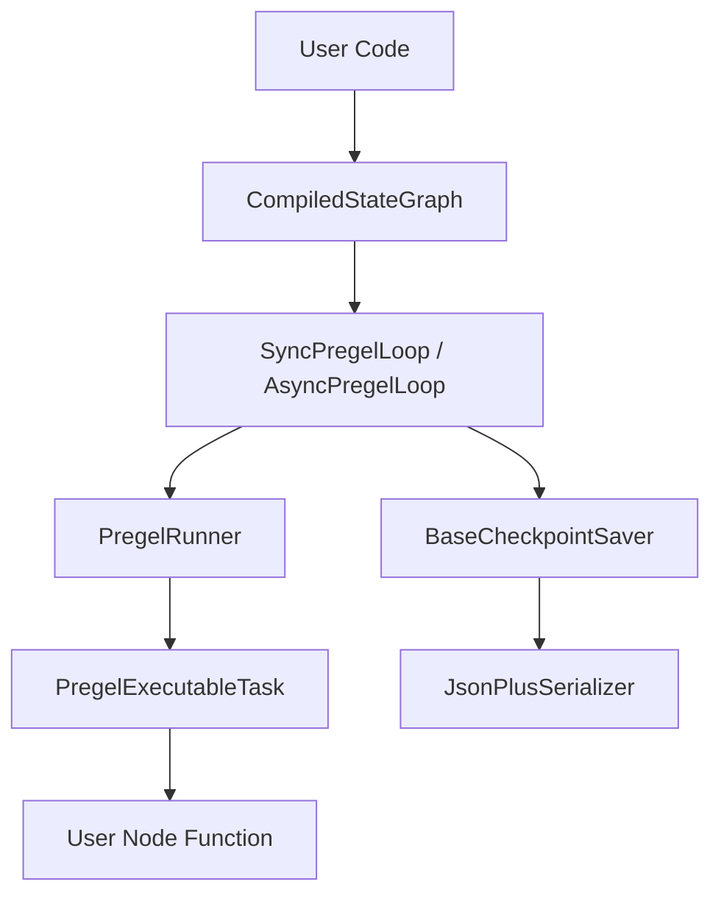
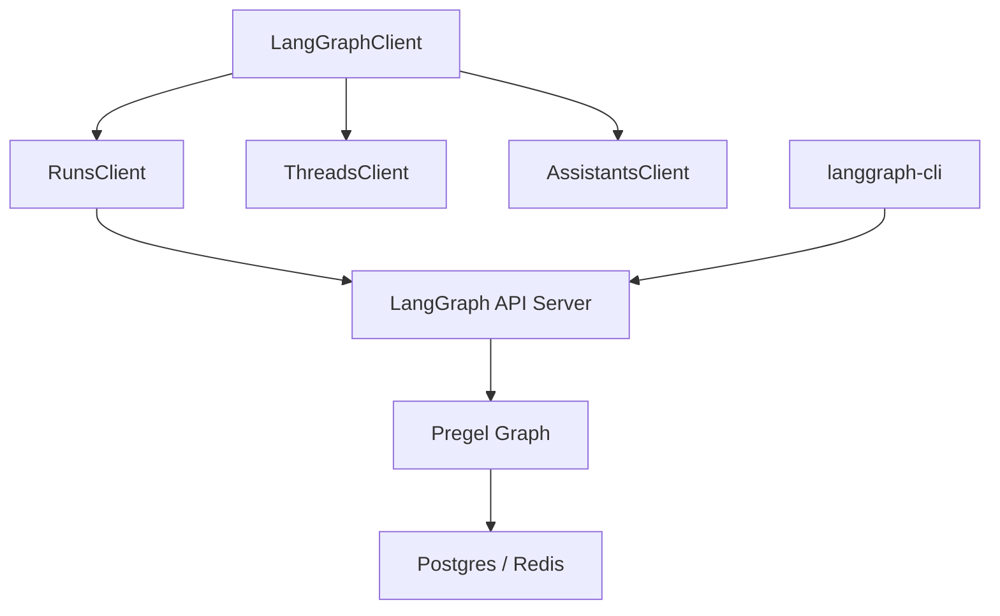

# 术语表

相关源文件

-   [libs/checkpoint-postgres/langgraph/checkpoint/postgres/\_\_init\_\_.py](https://github.com/langchain-ai/langgraph/blob/1fd51e8f/libs/checkpoint-postgres/langgraph/checkpoint/postgres/__init__.py)
-   [libs/checkpoint-postgres/langgraph/checkpoint/postgres/aio.py](https://github.com/langchain-ai/langgraph/blob/1fd51e8f/libs/checkpoint-postgres/langgraph/checkpoint/postgres/aio.py)
-   [libs/checkpoint-postgres/langgraph/checkpoint/postgres/base.py](https://github.com/langchain-ai/langgraph/blob/1fd51e8f/libs/checkpoint-postgres/langgraph/checkpoint/postgres/base.py)
-   [libs/checkpoint-postgres/langgraph/checkpoint/postgres/shallow.py](https://github.com/langchain-ai/langgraph/blob/1fd51e8f/libs/checkpoint-postgres/langgraph/checkpoint/postgres/shallow.py)
-   [libs/checkpoint-postgres/tests/test\_async.py](https://github.com/langchain-ai/langgraph/blob/1fd51e8f/libs/checkpoint-postgres/tests/test_async.py)
-   [libs/checkpoint-postgres/tests/test\_sync.py](https://github.com/langchain-ai/langgraph/blob/1fd51e8f/libs/checkpoint-postgres/tests/test_sync.py)
-   [libs/checkpoint-postgres/uv.lock](https://github.com/langchain-ai/langgraph/blob/1fd51e8f/libs/checkpoint-postgres/uv.lock)
-   [libs/checkpoint-sqlite/langgraph/checkpoint/sqlite/\_\_init\_\_.py](https://github.com/langchain-ai/langgraph/blob/1fd51e8f/libs/checkpoint-sqlite/langgraph/checkpoint/sqlite/__init__.py)
-   [libs/checkpoint-sqlite/langgraph/checkpoint/sqlite/aio.py](https://github.com/langchain-ai/langgraph/blob/1fd51e8f/libs/checkpoint-sqlite/langgraph/checkpoint/sqlite/aio.py)
-   [libs/checkpoint-sqlite/langgraph/checkpoint/sqlite/utils.py](https://github.com/langchain-ai/langgraph/blob/1fd51e8f/libs/checkpoint-sqlite/langgraph/checkpoint/sqlite/utils.py)
-   [libs/checkpoint-sqlite/tests/test\_aiosqlite.py](https://github.com/langchain-ai/langgraph/blob/1fd51e8f/libs/checkpoint-sqlite/tests/test_aiosqlite.py)
-   [libs/checkpoint-sqlite/tests/test\_sqlite.py](https://github.com/langchain-ai/langgraph/blob/1fd51e8f/libs/checkpoint-sqlite/tests/test_sqlite.py)
-   [libs/checkpoint-sqlite/uv.lock](https://github.com/langchain-ai/langgraph/blob/1fd51e8f/libs/checkpoint-sqlite/uv.lock)
-   [libs/checkpoint/langgraph/checkpoint/base/\_\_init\_\_.py](https://github.com/langchain-ai/langgraph/blob/1fd51e8f/libs/checkpoint/langgraph/checkpoint/base/__init__.py)
-   [libs/checkpoint/langgraph/checkpoint/memory/\_\_init\_\_.py](https://github.com/langchain-ai/langgraph/blob/1fd51e8f/libs/checkpoint/langgraph/checkpoint/memory/__init__.py)
-   [libs/checkpoint/langgraph/checkpoint/serde/jsonplus.py](https://github.com/langchain-ai/langgraph/blob/1fd51e8f/libs/checkpoint/langgraph/checkpoint/serde/jsonplus.py)
-   [libs/checkpoint/langgraph/checkpoint/serde/types.py](https://github.com/langchain-ai/langgraph/blob/1fd51e8f/libs/checkpoint/langgraph/checkpoint/serde/types.py)
-   [libs/checkpoint/pyproject.toml](https://github.com/langchain-ai/langgraph/blob/1fd51e8f/libs/checkpoint/pyproject.toml)
-   [libs/checkpoint/tests/test\_jsonplus.py](https://github.com/langchain-ai/langgraph/blob/1fd51e8f/libs/checkpoint/tests/test_jsonplus.py)
-   [libs/checkpoint/tests/test\_memory.py](https://github.com/langchain-ai/langgraph/blob/1fd51e8f/libs/checkpoint/tests/test_memory.py)
-   [libs/checkpoint/uv.lock](https://github.com/langchain-ai/langgraph/blob/1fd51e8f/libs/checkpoint/uv.lock)
-   [libs/cli/README.md](https://github.com/langchain-ai/langgraph/blob/1fd51e8f/libs/cli/README.md?plain=1)
-   [libs/cli/langgraph\_cli/\_\_init\_\_.py](https://github.com/langchain-ai/langgraph/blob/1fd51e8f/libs/cli/langgraph_cli/__init__.py)
-   [libs/cli/langgraph\_cli/cli.py](https://github.com/langchain-ai/langgraph/blob/1fd51e8f/libs/cli/langgraph_cli/cli.py)
-   [libs/cli/langgraph\_cli/config.py](https://github.com/langchain-ai/langgraph/blob/1fd51e8f/libs/cli/langgraph_cli/config.py)
-   [libs/cli/langgraph\_cli/helpers.py](https://github.com/langchain-ai/langgraph/blob/1fd51e8f/libs/cli/langgraph_cli/helpers.py)
-   [libs/cli/langgraph\_cli/host\_backend.py](https://github.com/langchain-ai/langgraph/blob/1fd51e8f/libs/cli/langgraph_cli/host_backend.py)
-   [libs/cli/langgraph\_cli/progress.py](https://github.com/langchain-ai/langgraph/blob/1fd51e8f/libs/cli/langgraph_cli/progress.py)
-   [libs/cli/langgraph\_cli/util.py](https://github.com/langchain-ai/langgraph/blob/1fd51e8f/libs/cli/langgraph_cli/util.py)
-   [libs/cli/pyproject.toml](https://github.com/langchain-ai/langgraph/blob/1fd51e8f/libs/cli/pyproject.toml)
-   [libs/cli/tests/unit\_tests/cli/test\_cli.py](https://github.com/langchain-ai/langgraph/blob/1fd51e8f/libs/cli/tests/unit_tests/cli/test_cli.py)
-   [libs/cli/tests/unit\_tests/test\_config.py](https://github.com/langchain-ai/langgraph/blob/1fd51e8f/libs/cli/tests/unit_tests/test_config.py)
-   [libs/cli/tests/unit\_tests/test\_deploy\_helpers.py](https://github.com/langchain-ai/langgraph/blob/1fd51e8f/libs/cli/tests/unit_tests/test_deploy_helpers.py)
-   [libs/cli/tests/unit\_tests/test\_host\_backend.py](https://github.com/langchain-ai/langgraph/blob/1fd51e8f/libs/cli/tests/unit_tests/test_host_backend.py)
-   [libs/cli/tests/unit\_tests/test\_logs\_helpers.py](https://github.com/langchain-ai/langgraph/blob/1fd51e8f/libs/cli/tests/unit_tests/test_logs_helpers.py)
-   [libs/cli/tests/unit\_tests/test\_util.py](https://github.com/langchain-ai/langgraph/blob/1fd51e8f/libs/cli/tests/unit_tests/test_util.py)
-   [libs/cli/uv.lock](https://github.com/langchain-ai/langgraph/blob/1fd51e8f/libs/cli/uv.lock)
-   [libs/langgraph/langgraph/constants.py](https://github.com/langchain-ai/langgraph/blob/1fd51e8f/libs/langgraph/langgraph/constants.py)
-   [libs/langgraph/langgraph/errors.py](https://github.com/langchain-ai/langgraph/blob/1fd51e8f/libs/langgraph/langgraph/errors.py)
-   [libs/langgraph/langgraph/func/\_\_init\_\_.py](https://github.com/langchain-ai/langgraph/blob/1fd51e8f/libs/langgraph/langgraph/func/__init__.py)
-   [libs/langgraph/langgraph/graph/\_\_init\_\_.py](https://github.com/langchain-ai/langgraph/blob/1fd51e8f/libs/langgraph/langgraph/graph/__init__.py)
-   [libs/langgraph/langgraph/graph/state.py](https://github.com/langchain-ai/langgraph/blob/1fd51e8f/libs/langgraph/langgraph/graph/state.py)
-   [libs/langgraph/langgraph/pregel/\_\_init\_\_.py](https://github.com/langchain-ai/langgraph/blob/1fd51e8f/libs/langgraph/langgraph/pregel/__init__.py)
-   [libs/langgraph/langgraph/pregel/debug.py](https://github.com/langchain-ai/langgraph/blob/1fd51e8f/libs/langgraph/langgraph/pregel/debug.py)
-   [libs/langgraph/langgraph/pregel/types.py](https://github.com/langchain-ai/langgraph/blob/1fd51e8f/libs/langgraph/langgraph/pregel/types.py)
-   [libs/langgraph/langgraph/types.py](https://github.com/langchain-ai/langgraph/blob/1fd51e8f/libs/langgraph/langgraph/types.py)
-   [libs/langgraph/pyproject.toml](https://github.com/langchain-ai/langgraph/blob/1fd51e8f/libs/langgraph/pyproject.toml)
-   [libs/langgraph/tests/\_\_snapshots\_\_/test\_large\_cases.ambr](https://github.com/langchain-ai/langgraph/blob/1fd51e8f/libs/langgraph/tests/__snapshots__/test_large_cases.ambr)
-   [libs/langgraph/tests/\_\_snapshots\_\_/test\_pregel.ambr](https://github.com/langchain-ai/langgraph/blob/1fd51e8f/libs/langgraph/tests/__snapshots__/test_pregel.ambr)
-   [libs/langgraph/tests/\_\_snapshots\_\_/test\_pregel\_async.ambr](https://github.com/langchain-ai/langgraph/blob/1fd51e8f/libs/langgraph/tests/__snapshots__/test_pregel_async.ambr)
-   [libs/langgraph/tests/test\_checkpoint\_migration.py](https://github.com/langchain-ai/langgraph/blob/1fd51e8f/libs/langgraph/tests/test_checkpoint_migration.py)
-   [libs/langgraph/tests/test\_large\_cases.py](https://github.com/langchain-ai/langgraph/blob/1fd51e8f/libs/langgraph/tests/test_large_cases.py)
-   [libs/langgraph/tests/test\_large\_cases\_async.py](https://github.com/langchain-ai/langgraph/blob/1fd51e8f/libs/langgraph/tests/test_large_cases_async.py)
-   [libs/langgraph/tests/test\_pregel.py](https://github.com/langchain-ai/langgraph/blob/1fd51e8f/libs/langgraph/tests/test_pregel.py)
-   [libs/langgraph/tests/test\_pregel\_async.py](https://github.com/langchain-ai/langgraph/blob/1fd51e8f/libs/langgraph/tests/test_pregel_async.py)
-   [libs/langgraph/uv.lock](https://github.com/langchain-ai/langgraph/blob/1fd51e8f/libs/langgraph/uv.lock)
-   [libs/prebuilt/langgraph/prebuilt/\_\_init\_\_.py](https://github.com/langchain-ai/langgraph/blob/1fd51e8f/libs/prebuilt/langgraph/prebuilt/__init__.py)
-   [libs/prebuilt/langgraph/prebuilt/chat\_agent\_executor.py](https://github.com/langchain-ai/langgraph/blob/1fd51e8f/libs/prebuilt/langgraph/prebuilt/chat_agent_executor.py)
-   [libs/prebuilt/langgraph/prebuilt/tool\_node.py](https://github.com/langchain-ai/langgraph/blob/1fd51e8f/libs/prebuilt/langgraph/prebuilt/tool_node.py)
-   [libs/prebuilt/langgraph/prebuilt/tool\_validator.py](https://github.com/langchain-ai/langgraph/blob/1fd51e8f/libs/prebuilt/langgraph/prebuilt/tool_validator.py)
-   [libs/prebuilt/pyproject.toml](https://github.com/langchain-ai/langgraph/blob/1fd51e8f/libs/prebuilt/pyproject.toml)
-   [libs/prebuilt/tests/test\_deprecation.py](https://github.com/langchain-ai/langgraph/blob/1fd51e8f/libs/prebuilt/tests/test_deprecation.py)
-   [libs/prebuilt/tests/test\_on\_tool\_call.py](https://github.com/langchain-ai/langgraph/blob/1fd51e8f/libs/prebuilt/tests/test_on_tool_call.py)
-   [libs/prebuilt/tests/test\_react\_agent.py](https://github.com/langchain-ai/langgraph/blob/1fd51e8f/libs/prebuilt/tests/test_react_agent.py)
-   [libs/prebuilt/tests/test\_tool\_node.py](https://github.com/langchain-ai/langgraph/blob/1fd51e8f/libs/prebuilt/tests/test_tool_node.py)
-   [libs/prebuilt/tests/test\_tool\_node\_interceptor\_unregistered.py](https://github.com/langchain-ai/langgraph/blob/1fd51e8f/libs/prebuilt/tests/test_tool_node_interceptor_unregistered.py)
-   [libs/prebuilt/tests/test\_tool\_node\_validation\_error\_filtering.py](https://github.com/langchain-ai/langgraph/blob/1fd51e8f/libs/prebuilt/tests/test_tool_node_validation_error_filtering.py)
-   [libs/prebuilt/uv.lock](https://github.com/langchain-ai/langgraph/blob/1fd51e8f/libs/prebuilt/uv.lock)
-   [libs/sdk-py/langgraph\_sdk/\_\_init\_\_.py](https://github.com/langchain-ai/langgraph/blob/1fd51e8f/libs/sdk-py/langgraph_sdk/__init__.py)
-   [libs/sdk-py/langgraph\_sdk/cache.py](https://github.com/langchain-ai/langgraph/blob/1fd51e8f/libs/sdk-py/langgraph_sdk/cache.py)
-   [libs/sdk-py/langgraph\_sdk/client.py](https://github.com/langchain-ai/langgraph/blob/1fd51e8f/libs/sdk-py/langgraph_sdk/client.py)
-   [libs/sdk-py/langgraph\_sdk/schema.py](https://github.com/langchain-ai/langgraph/blob/1fd51e8f/libs/sdk-py/langgraph_sdk/schema.py)
-   [libs/sdk-py/pyproject.toml](https://github.com/langchain-ai/langgraph/blob/1fd51e8f/libs/sdk-py/pyproject.toml)
-   [libs/sdk-py/tests/test\_cache.py](https://github.com/langchain-ai/langgraph/blob/1fd51e8f/libs/sdk-py/tests/test_cache.py)
-   [libs/sdk-py/tests/test\_crons\_client.py](https://github.com/langchain-ai/langgraph/blob/1fd51e8f/libs/sdk-py/tests/test_crons_client.py)
-   [libs/sdk-py/uv.lock](https://github.com/langchain-ai/langgraph/blob/1fd51e8f/libs/sdk-py/uv.lock)

本术语表定义了 LangGraph 仓库中使用的代码库特定术语、行话与领域概念。它可作为技术参考，帮助新加入工程师理解框架的实现细节与数据流。

## 核心概念

### Pregel

LangGraph 的底层执行引擎。它基于 Pregel 图处理模型，节点按“超步（supersteps）”执行。在每一步中，收到更新（triggers）的节点会并行执行，并向共享状态（channels）写入更新，进而触发后续节点。

-   **实现**：主循环由 [libs/langgraph/langgraph/pregel/\_loop.py](https://github.com/langchain-ai/langgraph/blob/1fd51e8f/libs/langgraph/langgraph/pregel/_loop.py) 中的 `SyncPregelLoop` 与 `AsyncPregelLoop` 管理
-   **任务编排**：`PregelRunner` 负责实际执行节点逻辑 [libs/langgraph/langgraph/pregel/\_runner.py](https://github.com/langchain-ai/langgraph/blob/1fd51e8f/libs/langgraph/langgraph/pregel/_runner.py)
-   **入口点**：`Pregel` 类是图编译后的可执行形态 [libs/langgraph/langgraph/pregel/main.py](https://github.com/langchain-ai/langgraph/blob/1fd51e8f/libs/langgraph/langgraph/pregel/main.py)

### Channel

图中的状态容器。Channel 不只是变量；它们定义了处理更新的特定行为（例如覆盖、追加或聚合）。

| Channel 类型 | 代码实体 | 描述 |
| --- | --- | --- |
| **LastValue** | `LastValue` [libs/langgraph/langgraph/channels/last\_value.py](https://github.com/langchain-ai/langgraph/blob/1fd51e8f/libs/langgraph/langgraph/channels/last_value.py) | 仅存储最近一次写入值。 |
| **Topic** | `Topic` [libs/langgraph/langgraph/channels/topic.py](https://github.com/langchain-ai/langgraph/blob/1fd51e8f/libs/langgraph/langgraph/channels/topic.py) | 类队列 channel，会累积值直到被消费。 |
| **BinaryOperatorAggregate** | `BinaryOperatorAggregate` [libs/langgraph/langgraph/channels/binop.py](https://github.com/langchain-ai/langgraph/blob/1fd51e8f/libs/langgraph/langgraph/channels/binop.py) | 应用 reducer 函数（例如 `operator.add`）将新值与现有值聚合。 |
| **EphemeralValue** | `EphemeralValue` [libs/langgraph/langgraph/channels/ephemeral\_value.py](https://github.com/langchain-ai/langgraph/blob/1fd51e8f/libs/langgraph/langgraph/channels/ephemeral_value.py) | 仅在单个步骤期间存在的值。 |

### Checkpoint

图在某个时间点（某个“线程”）的持久化状态快照。Checkpoint 支持“时间旅行（Time Travel）”、错误恢复与 human-in-the-loop 交互。

-   **数据模型**：由 `Checkpoint` TypedDict 定义 [libs/checkpoint/langgraph/checkpoint/base/\_\_init\_\_.py47-84](https://github.com/langchain-ai/langgraph/blob/1fd51e8f/libs/checkpoint/langgraph/checkpoint/base/__init__.py#L47-L84)
-   **接口**：所有 saver 必须实现 `BaseCheckpointSaver` [libs/checkpoint/langgraph/checkpoint/base/\_\_init\_\_.py186-210](https://github.com/langchain-ai/langgraph/blob/1fd51e8f/libs/checkpoint/langgraph/checkpoint/base/__init__.py#L186-L210)
-   **元数据**：`CheckpointMetadata` 记录创建该 checkpoint 的步号、来源与写入内容 [libs/checkpoint/langgraph/checkpoint/base/\_\_init\_\_.py110-135](https://github.com/langchain-ai/langgraph/blob/1fd51e8f/libs/checkpoint/langgraph/checkpoint/base/__init__.py#L110-L135)

### Thread

某次图执行实例的唯一标识符。同一 `thread_id` 下的所有 checkpoints 共享历史。

### Reducer

由 `BinaryOperatorAggregate` channel 使用的函数，用于将新更新与当前状态合并。

-   **签名**：`(current_state, update) -> new_state`。
-   **用法**：在 `TypedDict` 状态 schema 中通过 `Annotated[Type, reducer_function]` 定义 [libs/langgraph/langgraph/graph/state.py152-159](https://github.com/langchain-ai/langgraph/blob/1fd51e8f/libs/langgraph/langgraph/graph/state.py#L152-L159)

---

## 控制流原语

### Command

节点返回的控制对象，用于动态影响图执行。它可更新状态、路由到指定节点，或触发中断。

-   **定义**：`Command` dataclass [libs/langgraph/langgraph/types.py465-490](https://github.com/langchain-ai/langgraph/blob/1fd51e8f/libs/langgraph/langgraph/types.py#L465-L490)
-   **属性**：
    -   `goto`：下一步的目标节点。
    -   `update`：要应用的状态更新。
    -   `resume`：提供给 `interrupt` 的值。

### Send

用于动态扇出（map-reduce 模式）的原语。它允许一个节点以不同输入调度另一个节点的多个实例。

-   **定义**：`Send` 命名元组 [libs/langgraph/langgraph/types.py448-462](https://github.com/langchain-ai/langgraph/blob/1fd51e8f/libs/langgraph/langgraph/types.py#L448-L462)
-   **用法**：`return [Send("node_name", arg1), Send("node_name", arg2)]`。

### Interrupt

用于暂停图执行并等待外部输入的机制。

-   **函数**：在节点内使用 `interrupt()` 以中止并向调用方返回值 [libs/langgraph/langgraph/types.py530-570](https://github.com/langchain-ai/langgraph/blob/1fd51e8f/libs/langgraph/langgraph/types.py#L530-L570)
-   **配置**：`graph.compile()` 中的 `interrupt_before` 与 `interrupt_after` 设置。

---

## 代码映射图

### 执行流：从用户调用到 Pregel 循环

该图将高级 API 调用映射到处理 Pregel 执行循环的内部类。

**来源**: [libs/langgraph/langgraph/pregel/\_loop.py](https://github.com/langchain-ai/langgraph/blob/1fd51e8f/libs/langgraph/langgraph/pregel/_loop.py) [libs/langgraph/langgraph/pregel/\_runner.py](https://github.com/langchain-ai/langgraph/blob/1fd51e8f/libs/langgraph/langgraph/pregel/_runner.py) [libs/langgraph/langgraph/graph/state.py](https://github.com/langchain-ai/langgraph/blob/1fd51e8f/libs/langgraph/langgraph/graph/state.py)

### 远程执行：从 SDK 到 API Server

该图展示 `LangGraphClient` 如何与远程 API server 交互，以及代码中的资源映射关系。

**来源**: [libs/sdk-py/langgraph\_sdk/client.py](https://github.com/langchain-ai/langgraph/blob/1fd51e8f/libs/sdk-py/langgraph_sdk/client.py) [libs/cli/langgraph\_cli/cli.py](https://github.com/langchain-ai/langgraph/blob/1fd51e8f/libs/cli/langgraph_cli/cli.py)

---

## 技术缩写与行话

| 术语 | 全称 | 上下文 |
| --- | --- | --- |
| **SSE** | Server-Sent Events | 用于流式输出图结果的协议 [libs/sdk-py/langgraph\_sdk/\_async/http.py](https://github.com/langchain-ai/langgraph/blob/1fd51e8f/libs/sdk-py/langgraph_sdk/_async/http.py) |
| **HIL** | Human-in-the-Loop | 涉及 `interrupt` 与 `Command(resume=...)` 的模式。 |
| **Serde** | Serialization/Deserialization | 指 `JsonPlusSerializer`，可处理 `UUID`、`BaseMessage` 等复杂类型 [libs/checkpoint/langgraph/checkpoint/serde/jsonplus.py](https://github.com/langchain-ai/langgraph/blob/1fd51e8f/libs/checkpoint/langgraph/checkpoint/serde/jsonplus.py) |
| **Managed Value** | Managed Value | 由框架而非用户管理的状态组件，例如 `BaseStore` 或 `BaseCache` [libs/langgraph/langgraph/managed/base.py](https://github.com/langchain-ai/langgraph/blob/1fd51e8f/libs/langgraph/langgraph/managed/base.py) |
| **Configurable** | Configurable Field | `RunnableConfig` 中支持运行时定制的字段（例如 `thread_id`） [libs/langgraph/langgraph/types.py228-250](https://github.com/langchain-ai/langgraph/blob/1fd51e8f/libs/langgraph/langgraph/types.py#L228-L250) |

## 持久化实现

该仓库提供了多个可用于生产环境的 checkpoint 接口实现：

1.  **Memory**：`InMemorySaver` [libs/checkpoint/langgraph/checkpoint/memory/\_\_init\_\_.py](https://github.com/langchain-ai/langgraph/blob/1fd51e8f/libs/checkpoint/langgraph/checkpoint/memory/__init__.py) 用于测试和临时会话。
2.  **SQLite**：`SqliteSaver` [libs/checkpoint-sqlite/langgraph/checkpoint/sqlite/\_\_init\_\_.py](https://github.com/langchain-ai/langgraph/blob/1fd51e8f/libs/checkpoint-sqlite/langgraph/checkpoint/sqlite/__init__.py) 本地持久化存储。
3.  **PostgreSQL**：`PostgresSaver` [libs/checkpoint-postgres/langgraph/checkpoint/postgres/\_\_init\_\_.py](https://github.com/langchain-ai/langgraph/blob/1fd51e8f/libs/checkpoint-postgres/langgraph/checkpoint/postgres/__init__.py) 生产级存储，并支持 `ShallowPostgresSaver` 以优化性能 [libs/checkpoint-postgres/langgraph/checkpoint/postgres/shallow.py](https://github.com/langchain-ai/langgraph/blob/1fd51e8f/libs/checkpoint-postgres/langgraph/checkpoint/postgres/shallow.py)

**来源**：

-   `Pregel` 定义: [libs/langgraph/langgraph/pregel/main.py112-115](https://github.com/langchain-ai/langgraph/blob/1fd51e8f/libs/langgraph/langgraph/pregel/main.py#L112-L115)
-   `Checkpoint` 结构: [libs/checkpoint/langgraph/checkpoint/base/\_\_init\_\_.py47-84](https://github.com/langchain-ai/langgraph/blob/1fd51e8f/libs/checkpoint/langgraph/checkpoint/base/__init__.py#L47-L84)
-   `Command` 定义: [libs/langgraph/langgraph/types.py465-490](https://github.com/langchain-ai/langgraph/blob/1fd51e8f/libs/langgraph/langgraph/types.py#L465-L490)
-   `Send` 定义: [libs/langgraph/langgraph/types.py448-462](https://github.com/langchain-ai/langgraph/blob/1fd51e8f/libs/langgraph/langgraph/types.py#L448-L462)
-   `StateGraph` 逻辑: [libs/langgraph/langgraph/graph/state.py115-184](https://github.com/langchain-ai/langgraph/blob/1fd51e8f/libs/langgraph/langgraph/graph/state.py#L115-L184)
-   `LangGraphClient` 导出: [libs/sdk-py/langgraph\_sdk/client.py12-55](https://github.com/langchain-ai/langgraph/blob/1fd51e8f/libs/sdk-py/langgraph_sdk/client.py#L12-L55)
