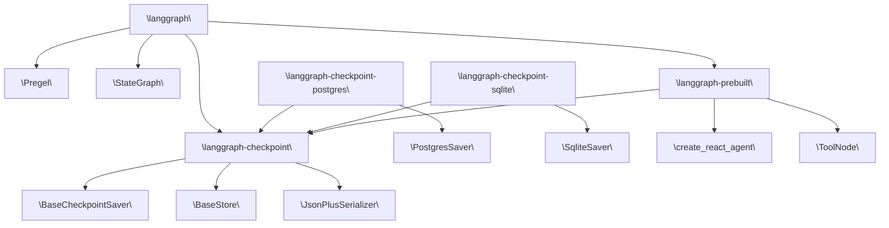

# 包结构与依赖关系

相关源文件

-   [Makefile](https://github.com/langchain-ai/langgraph/blob/1fd51e8f/Makefile)
-   [README.md](https://github.com/langchain-ai/langgraph/blob/1fd51e8f/README.md?plain=1)
-   [libs/checkpoint-postgres/Makefile](https://github.com/langchain-ai/langgraph/blob/1fd51e8f/libs/checkpoint-postgres/Makefile)
-   [libs/checkpoint-postgres/pyproject.toml](https://github.com/langchain-ai/langgraph/blob/1fd51e8f/libs/checkpoint-postgres/pyproject.toml)
-   [libs/checkpoint-postgres/tests/compose-postgres.yml](https://github.com/langchain-ai/langgraph/blob/1fd51e8f/libs/checkpoint-postgres/tests/compose-postgres.yml)
-   [libs/checkpoint-postgres/uv.lock](https://github.com/langchain-ai/langgraph/blob/1fd51e8f/libs/checkpoint-postgres/uv.lock)
-   [libs/checkpoint-sqlite/Makefile](https://github.com/langchain-ai/langgraph/blob/1fd51e8f/libs/checkpoint-sqlite/Makefile)
-   [libs/checkpoint-sqlite/pyproject.toml](https://github.com/langchain-ai/langgraph/blob/1fd51e8f/libs/checkpoint-sqlite/pyproject.toml)
-   [libs/checkpoint-sqlite/uv.lock](https://github.com/langchain-ai/langgraph/blob/1fd51e8f/libs/checkpoint-sqlite/uv.lock)
-   [libs/checkpoint/Makefile](https://github.com/langchain-ai/langgraph/blob/1fd51e8f/libs/checkpoint/Makefile)
-   [libs/checkpoint/langgraph/checkpoint/serde/jsonplus.py](https://github.com/langchain-ai/langgraph/blob/1fd51e8f/libs/checkpoint/langgraph/checkpoint/serde/jsonplus.py)
-   [libs/checkpoint/pyproject.toml](https://github.com/langchain-ai/langgraph/blob/1fd51e8f/libs/checkpoint/pyproject.toml)
-   [libs/checkpoint/tests/test\_jsonplus.py](https://github.com/langchain-ai/langgraph/blob/1fd51e8f/libs/checkpoint/tests/test_jsonplus.py)
-   [libs/checkpoint/uv.lock](https://github.com/langchain-ai/langgraph/blob/1fd51e8f/libs/checkpoint/uv.lock)
-   [libs/cli/Makefile](https://github.com/langchain-ai/langgraph/blob/1fd51e8f/libs/cli/Makefile)
-   [libs/langgraph/Makefile](https://github.com/langchain-ai/langgraph/blob/1fd51e8f/libs/langgraph/Makefile)
-   [libs/langgraph/README.md](https://github.com/langchain-ai/langgraph/blob/1fd51e8f/libs/langgraph/README.md?plain=1)
-   [libs/langgraph/pyproject.toml](https://github.com/langchain-ai/langgraph/blob/1fd51e8f/libs/langgraph/pyproject.toml)
-   [libs/langgraph/tests/\_\_snapshots\_\_/test\_pregel.ambr](https://github.com/langchain-ai/langgraph/blob/1fd51e8f/libs/langgraph/tests/__snapshots__/test_pregel.ambr)
-   [libs/langgraph/tests/\_\_snapshots\_\_/test\_pregel\_async.ambr](https://github.com/langchain-ai/langgraph/blob/1fd51e8f/libs/langgraph/tests/__snapshots__/test_pregel_async.ambr)
-   [libs/langgraph/tests/conftest.py](https://github.com/langchain-ai/langgraph/blob/1fd51e8f/libs/langgraph/tests/conftest.py)
-   [libs/langgraph/uv.lock](https://github.com/langchain-ai/langgraph/blob/1fd51e8f/libs/langgraph/uv.lock)
-   [libs/prebuilt/Makefile](https://github.com/langchain-ai/langgraph/blob/1fd51e8f/libs/prebuilt/Makefile)
-   [libs/prebuilt/pyproject.toml](https://github.com/langchain-ai/langgraph/blob/1fd51e8f/libs/prebuilt/pyproject.toml)
-   [libs/prebuilt/tests/any\_str.py](https://github.com/langchain-ai/langgraph/blob/1fd51e8f/libs/prebuilt/tests/any_str.py)
-   [libs/prebuilt/tests/memory\_assert.py](https://github.com/langchain-ai/langgraph/blob/1fd51e8f/libs/prebuilt/tests/memory_assert.py)
-   [libs/prebuilt/tests/messages.py](https://github.com/langchain-ai/langgraph/blob/1fd51e8f/libs/prebuilt/tests/messages.py)
-   [libs/prebuilt/uv.lock](https://github.com/langchain-ai/langgraph/blob/1fd51e8f/libs/prebuilt/uv.lock)
-   [libs/sdk-py/Makefile](https://github.com/langchain-ai/langgraph/blob/1fd51e8f/libs/sdk-py/Makefile)
-   [libs/sdk-py/uv.lock](https://github.com/langchain-ai/langgraph/blob/1fd51e8f/libs/sdk-py/uv.lock)

本页枚举了 LangGraph 单体仓库中的每个包，说明各包的职责，并记录包间依赖图。内容涵盖 `libs/` 下的源码布局以及每个包声明的运行时依赖。

关于单体仓库构建与依赖管理系统的细节，请参见 [Monorepo Structure and Build System](/langchain-ai/langgraph/2.1-monorepo-structure-and-build-system)。关于持久化接口的细节，请参见 [Persistence and Memory](/langchain-ai/langgraph/4-persistence-and-memory)。关于 CLI 与部署的具体内容，请参见 [CLI and Deployment](/langchain-ai/langgraph/6-cli-and-deployment)。

---

## 仓库布局

该单体仓库将所有 Python 包组织在 `libs/` 目录下。每个子目录都是一个可独立安装的 Python 包，并拥有自己的 `pyproject.toml` 和 `uv.lock` 文件。

```
libs/
├── langgraph/              # Core graph execution library
├── checkpoint/             # Base persistence interfaces
├── checkpoint-postgres/    # PostgreSQL checkpoint/store implementations
├── checkpoint-sqlite/      # SQLite checkpoint implementation
├── prebuilt/               # High-level agent APIs
├── sdk-py/                 # Python client SDK
├── cli/                    # langgraph CLI tool
└── scheduler-kafka/        # Distributed Kafka-based scheduler
```
根目录 `Makefile` 提供了在所有包之间编排任务的目标，例如 `lint`、`format` 和 `test`。

来源：[libs/langgraph/pyproject.toml83-89](https://github.com/langchain-ai/langgraph/blob/1fd51e8f/libs/langgraph/pyproject.toml#L83-L89) [libs/checkpoint/pyproject.toml1-17](https://github.com/langchain-ai/langgraph/blob/1fd51e8f/libs/checkpoint/pyproject.toml#L1-L17) [libs/prebuilt/pyproject.toml64-68](https://github.com/langchain-ai/langgraph/blob/1fd51e8f/libs/prebuilt/pyproject.toml#L64-L68)

---

## 包清单

| 包名 | 目录 | 当前版本 | 主要角色 |
| --- | --- | --- | --- |
| `langgraph` | `libs/langgraph/` | 1.1.3 | 核心图构建与执行 |
| `langgraph-checkpoint` | `libs/checkpoint/` | 4.0.1 | 抽象检查点与存储接口 |
| `langgraph-checkpoint-postgres` | `libs/checkpoint-postgres/` | 3.0.5 | 基于 PostgreSQL 的检查点与存储 |
| `langgraph-checkpoint-sqlite` | `libs/checkpoint-sqlite/` | 3.0.4 | 基于 SQLite 的检查点实现 |
| `langgraph-prebuilt` | `libs/prebuilt/` | 1.0.8 | 预构建代理图（`create_react_agent`、`ToolNode`） |
| `langgraph-sdk` | `libs/sdk-py/` | ≥0.3.0,<0.4.0 | LangGraph API 服务器的 Python 客户端 |
| `langgraph-cli` | `libs/cli/` | — | `langgraph` CLI 命令组 |

来源：[libs/langgraph/pyproject.toml6-33](https://github.com/langchain-ai/langgraph/blob/1fd51e8f/libs/langgraph/pyproject.toml#L6-L33) [libs/checkpoint/pyproject.toml6-17](https://github.com/langchain-ai/langgraph/blob/1fd51e8f/libs/checkpoint/pyproject.toml#L6-L17) [libs/checkpoint-postgres/pyproject.toml6-19](https://github.com/langchain-ai/langgraph/blob/1fd51e8f/libs/checkpoint-postgres/pyproject.toml#L6-L19) [libs/prebuilt/pyproject.toml6-29](https://github.com/langchain-ai/langgraph/blob/1fd51e8f/libs/prebuilt/pyproject.toml#L6-L29)

---

## 包说明

### `langgraph`

面向用户的核心库。它提供 `StateGraph` 构建器、函数式 API（`@task`、`@entrypoint`）以及 `Pregel` 执行引擎。它将 SDK 与预构建组件作为传递依赖引入，以确保完整的运行时环境。

在 [libs/langgraph/pyproject.toml26-33](https://github.com/langchain-ai/langgraph/blob/1fd51e8f/libs/langgraph/pyproject.toml#L26-L33) 中声明的**运行时依赖**：

-   `langchain-core>=0.1`
-   `langgraph-checkpoint>=2.1.0,<5.0.0`
-   `langgraph-sdk>=0.3.0,<0.4.0`
-   `langgraph-prebuilt>=1.0.8,<1.1.0`
-   `xxhash>=3.5.0`
-   `pydantic>=2.7.4`

---

### `langgraph-checkpoint`

抽象持久化层。它定义了所有检查点器必须实现的基础接口，例如 `BaseCheckpointSaver`。该包保持最小化，以避免向用户强制引入特定数据库驱动。

在 [libs/checkpoint/pyproject.toml14-17](https://github.com/langchain-ai/langgraph/blob/1fd51e8f/libs/checkpoint/pyproject.toml#L14-L17) 中声明的**运行时依赖**：

-   `langchain-core>=0.2.38`
-   `ormsgpack>=1.12.0`（用于通过 `JsonPlusSerializer` 进行二进制序列化）

---

### `langgraph-checkpoint-postgres`

实现基于 PostgreSQL 的持久化。它提供 `PostgresSaver` 与 `PostgresStore`，用于状态和跨线程内存。

在 [libs/checkpoint-postgres/pyproject.toml14-19](https://github.com/langchain-ai/langgraph/blob/1fd51e8f/libs/checkpoint-postgres/pyproject.toml#L14-L19) 中声明的**运行时依赖**：

-   `langgraph-checkpoint>=2.1.2,<5.0.0`
-   `orjson>=3.11.5`
-   `psycopg>=3.2.0`（支持异步的 PostgreSQL 驱动）
-   `psycopg-pool>=3.2.0`

---

### `langgraph-checkpoint-sqlite`

实现基于 SQLite 的持久化。它提供 `SqliteSaver`，用于本地开发与轻量级生产场景。

在 [libs/checkpoint-sqlite/pyproject.toml14-18](https://github.com/langchain-ai/langgraph/blob/1fd51e8f/libs/checkpoint-sqlite/pyproject.toml#L14-L18) 中声明的**运行时依赖**：

-   `langgraph-checkpoint>=3,<5.0.0`
-   `aiosqlite>=0.20`
-   `sqlite-vec>=0.1.6`（在 SQLite 内启用向量检索能力）

---

### `langgraph-prebuilt`

包含高层代理模式（如 `create_react_agent`）以及基础设施组件（如 `ToolNode`）。

在 [libs/prebuilt/pyproject.toml26-29](https://github.com/langchain-ai/langgraph/blob/1fd51e8f/libs/prebuilt/pyproject.toml#L26-L29) 中声明的**运行时依赖**：

-   `langgraph-checkpoint>=2.1.0,<5.0.0`
-   `langchain-core>=1.0.0`

注意：为避免循环依赖，`langgraph-prebuilt` 在运行时**不**依赖 `langgraph`。`langgraph` 依赖 `prebuilt`。

---

## 依赖关系图

下图展示了核心包及其对应代码实体之间的关系。

**图：系统组件到代码实体**


来源：[libs/langgraph/pyproject.toml26-33](https://github.com/langchain-ai/langgraph/blob/1fd51e8f/libs/langgraph/pyproject.toml#L26-L33) [libs/checkpoint/pyproject.toml14-17](https://github.com/langchain-ai/langgraph/blob/1fd51e8f/libs/checkpoint/pyproject.toml#L14-L17) [libs/prebuilt/pyproject.toml26-29](https://github.com/langchain-ai/langgraph/blob/1fd51e8f/libs/prebuilt/pyproject.toml#L26-L29)

---

## 开发依赖管理

在开发过程中，单体仓库使用 `uv` 的工作区特性，将内部依赖解析为本地文件路径而非 PyPI 版本。

**图：本地路径解析**

来源：[libs/langgraph/pyproject.toml83-89](https://github.com/langchain-ai/langgraph/blob/1fd51e8f/libs/langgraph/pyproject.toml#L83-L89) [libs/prebuilt/pyproject.toml64-68](https://github.com/langchain-ai/langgraph/blob/1fd51e8f/libs/prebuilt/pyproject.toml#L64-L68)

---

## Python 版本支持

单体仓库中的所有包都以 Python `>=3.10` 为目标。项目在 CPython 3.10 至 3.13 以及 PyPy 上进行测试。

来源：[libs/langgraph/pyproject.toml10-25](https://github.com/langchain-ai/langgraph/blob/1fd51e8f/libs/langgraph/pyproject.toml#L10-L25) [libs/prebuilt/pyproject.toml10-25](https://github.com/langchain-ai/langgraph/blob/1fd51e8f/libs/prebuilt/pyproject.toml#L10-L25)

---

## 关键外部依赖

| 包 | 被谁使用 | 角色 |
| --- | --- | --- |
| `langchain-core` | 大多数包 | 消息类型与 Runnable 协议 |
| `ormsgpack` | `langgraph-checkpoint` | 高性能二进制序列化 |
| `psycopg` | `langgraph-checkpoint-postgres` | 非阻塞 PostgreSQL 通信 |
| `aiosqlite` | `langgraph-checkpoint-sqlite` | SQLite 的异步封装 |
| `pydantic` | `langgraph` | 数据校验与配置管理 |
| `xxhash` | `langgraph` | 用于状态跟踪的快速非加密哈希 |

来源：[libs/langgraph/pyproject.toml26-33](https://github.com/langchain-ai/langgraph/blob/1fd51e8f/libs/langgraph/pyproject.toml#L26-L33) [libs/checkpoint/pyproject.toml14-17](https://github.com/langchain-ai/langgraph/blob/1fd51e8f/libs/checkpoint/pyproject.toml#L14-L17) [libs/checkpoint-postgres/pyproject.toml14-19](https://github.com/langchain-ai/langgraph/blob/1fd51e8f/libs/checkpoint-postgres/pyproject.toml#L14-L19)
