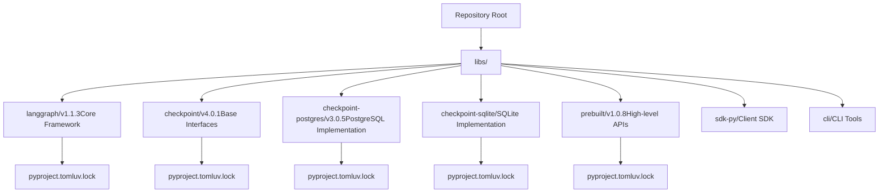
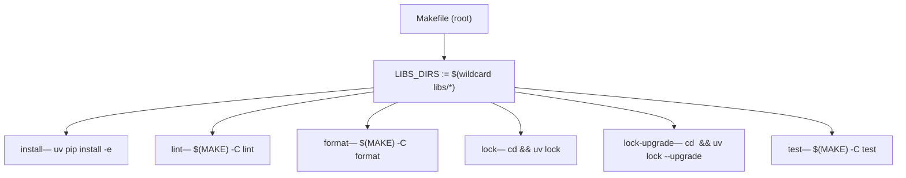
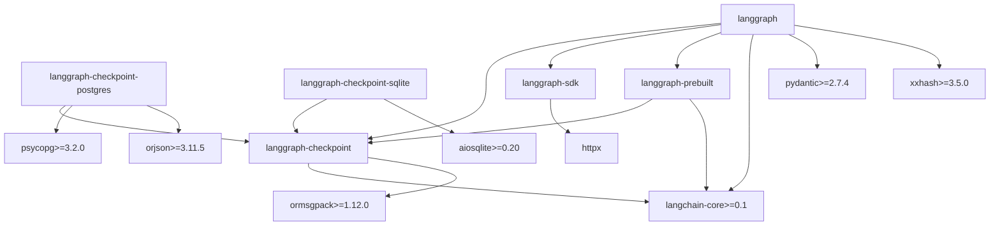
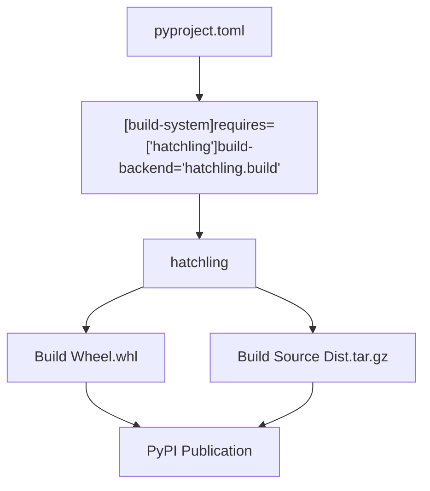

# 单体仓库结构与构建系统

相关源文件

-   [libs/checkpoint-postgres/Makefile](https://github.com/langchain-ai/langgraph/blob/1fd51e8f/libs/checkpoint-postgres/Makefile)
-   [libs/checkpoint-postgres/pyproject.toml](https://github.com/langchain-ai/langgraph/blob/1fd51e8f/libs/checkpoint-postgres/pyproject.toml)
-   [libs/checkpoint-postgres/tests/compose-postgres.yml](https://github.com/langchain-ai/langgraph/blob/1fd51e8f/libs/checkpoint-postgres/tests/compose-postgres.yml)
-   [libs/checkpoint-postgres/uv.lock](https://github.com/langchain-ai/langgraph/blob/1fd51e8f/libs/checkpoint-postgres/uv.lock)
-   [libs/checkpoint-sqlite/Makefile](https://github.com/langchain-ai/langgraph/blob/1fd51e8f/libs/checkpoint-sqlite/Makefile)
-   [libs/checkpoint-sqlite/pyproject.toml](https://github.com/langchain-ai/langgraph/blob/1fd51e8f/libs/checkpoint-sqlite/pyproject.toml)
-   [libs/checkpoint-sqlite/uv.lock](https://github.com/langchain-ai/langgraph/blob/1fd51e8f/libs/checkpoint-sqlite/uv.lock)
-   [libs/checkpoint/Makefile](https://github.com/langchain-ai/langgraph/blob/1fd51e8f/libs/checkpoint/Makefile)
-   [libs/checkpoint/langgraph/checkpoint/serde/jsonplus.py](https://github.com/langchain-ai/langgraph/blob/1fd51e8f/libs/checkpoint/langgraph/checkpoint/serde/jsonplus.py)
-   [libs/checkpoint/pyproject.toml](https://github.com/langchain-ai/langgraph/blob/1fd51e8f/libs/checkpoint/pyproject.toml)
-   [libs/checkpoint/tests/test\_jsonplus.py](https://github.com/langchain-ai/langgraph/blob/1fd51e8f/libs/checkpoint/tests/test_jsonplus.py)
-   [libs/checkpoint/uv.lock](https://github.com/langchain-ai/langgraph/blob/1fd51e8f/libs/checkpoint/uv.lock)
-   [libs/cli/Makefile](https://github.com/langchain-ai/langgraph/blob/1fd51e8f/libs/cli/Makefile)
-   [libs/langgraph/Makefile](https://github.com/langchain-ai/langgraph/blob/1fd51e8f/libs/langgraph/Makefile)
-   [libs/langgraph/pyproject.toml](https://github.com/langchain-ai/langgraph/blob/1fd51e8f/libs/langgraph/pyproject.toml)
-   [libs/langgraph/tests/\_\_snapshots\_\_/test\_pregel.ambr](https://github.com/langchain-ai/langgraph/blob/1fd51e8f/libs/langgraph/tests/__snapshots__/test_pregel.ambr)
-   [libs/langgraph/tests/\_\_snapshots\_\_/test\_pregel\_async.ambr](https://github.com/langchain-ai/langgraph/blob/1fd51e8f/libs/langgraph/tests/__snapshots__/test_pregel_async.ambr)
-   [libs/langgraph/tests/conftest.py](https://github.com/langchain-ai/langgraph/blob/1fd51e8f/libs/langgraph/tests/conftest.py)
-   [libs/langgraph/uv.lock](https://github.com/langchain-ai/langgraph/blob/1fd51e8f/libs/langgraph/uv.lock)
-   [libs/prebuilt/Makefile](https://github.com/langchain-ai/langgraph/blob/1fd51e8f/libs/prebuilt/Makefile)
-   [libs/prebuilt/pyproject.toml](https://github.com/langchain-ai/langgraph/blob/1fd51e8f/libs/prebuilt/pyproject.toml)
-   [libs/prebuilt/tests/any\_str.py](https://github.com/langchain-ai/langgraph/blob/1fd51e8f/libs/prebuilt/tests/any_str.py)
-   [libs/prebuilt/tests/memory\_assert.py](https://github.com/langchain-ai/langgraph/blob/1fd51e8f/libs/prebuilt/tests/memory_assert.py)
-   [libs/prebuilt/tests/messages.py](https://github.com/langchain-ai/langgraph/blob/1fd51e8f/libs/prebuilt/tests/messages.py)
-   [libs/prebuilt/uv.lock](https://github.com/langchain-ai/langgraph/blob/1fd51e8f/libs/prebuilt/uv.lock)
-   [libs/sdk-py/Makefile](https://github.com/langchain-ai/langgraph/blob/1fd51e8f/libs/sdk-py/Makefile)
-   [libs/sdk-py/uv.lock](https://github.com/langchain-ai/langgraph/blob/1fd51e8f/libs/sdk-py/uv.lock)

本文档描述了 LangGraph 仓库作为 Python 单体仓库的组织方式，包括包结构、构建系统配置、工作区依赖管理，以及包管理器 `uv` 的作用。

---

## 概览

LangGraph 仓库被组织为一个**单体仓库（monorepo）**，其中包含多个独立但相关的 Python 包，位于 `libs/` 目录下。每个包都独立版本化并发布到 PyPI，但共享统一的开发环境与构建基础设施。该单体仓库使用 `uv` 作为包管理器，并支持可编辑工作区依赖，以实现高效的本地开发。

---

## 目录结构

仓库在 `libs/` 下以扁平层级组织各个包：


**来源：** [libs/langgraph/pyproject.toml1-129](https://github.com/langchain-ai/langgraph/blob/1fd51e8f/libs/langgraph/pyproject.toml#L1-L129) [libs/checkpoint/pyproject.toml1-82](https://github.com/langchain-ai/langgraph/blob/1fd51e8f/libs/checkpoint/pyproject.toml#L1-L82) [libs/checkpoint-postgres/pyproject.toml1-87](https://github.com/langchain-ai/langgraph/blob/1fd51e8f/libs/checkpoint-postgres/pyproject.toml#L1-L87) [libs/prebuilt/pyproject.toml1-97](https://github.com/langchain-ai/langgraph/blob/1fd51e8f/libs/prebuilt/pyproject.toml#L1-L97)

每个包目录都包含：

-   `pyproject.toml` - 包元数据、依赖和构建配置。
-   `uv.lock` - 锁定的依赖版本（在包含开发依赖的包中）。
-   与包名匹配的子目录中的包源码（例如 `libs/langgraph/langgraph`）。
-   `README.md` - 包级文档。

---

## Makefile 构建系统

每个包都提供一个 `Makefile`，且目标集合保持一致。仓库根目录也有一个 `Makefile`，用于在所有包间编排这些目标。

### 根 Makefile 编排

根 `Makefile` 通过匹配 `libs/*` 发现所有包，并委派到每个包自己的 `Makefile`。

**根 Makefile 目标分发 — `Makefile`**


-   `install` — 遍历每个 `libs/*/pyproject.toml` 并执行 `uv pip install -e <dir>`，在根虚拟环境中创建可编辑安装。
-   `lock` — 在每个包目录中执行 `uv lock`，根据当前约束重新生成 `uv.lock`。
-   `lock-upgrade` — 与 `lock` 相同，但传入 `--upgrade` 以拉取最新兼容版本。
-   `lint`、`format`、`test` — 通过 `$(MAKE) -C <dir> <target>` 委派到每个包自己的 `Makefile`。

### 各包 Makefile

各包 Makefile 保持统一的标准目标，以确保一致的开发者体验。

| 目标 | 执行内容 | 说明 |
| --- | --- | --- |
| `lint` | `ruff check .`, `ruff format --diff`, `mypy` | 任一问题都会失败。 |
| `format` | `ruff format`, `ruff check --select I --fix` | 原地修改文件。 |
| `type` | `mypy <package>` | 独立类型检查。 |
| `test` | `uv run pytest` | 可能先启动 Docker 服务。 |
| `test_watch` | `uv run ptw` | 保存文件时重新运行测试。 |
| `integration_tests` | `uv run pytest integration_tests` | 长时间运行 / 外部依赖。 |
| `coverage` | `pytest --cov` | 生成 XML + 终端报告。 |
| `spell_check` / `spell_fix` | `codespell --toml pyproject.toml` | 拼写错误检测。 |

**来源：** [libs/langgraph/Makefile1-160](https://github.com/langchain-ai/langgraph/blob/1fd51e8f/libs/langgraph/Makefile#L1-L160) [libs/checkpoint/Makefile1-41](https://github.com/langchain-ai/langgraph/blob/1fd51e8f/libs/checkpoint/Makefile#L1-L41) [libs/checkpoint-postgres/Makefile1-70](https://github.com/langchain-ai/langgraph/blob/1fd51e8f/libs/checkpoint-postgres/Makefile#L1-L70) [libs/prebuilt/Makefile1-86](https://github.com/langchain-ai/langgraph/blob/1fd51e8f/libs/prebuilt/Makefile#L1-L86) [libs/cli/Makefile1-44](https://github.com/langchain-ai/langgraph/blob/1fd51e8f/libs/cli/Makefile#L1-L44) [libs/sdk-py/Makefile1-28](https://github.com/langchain-ai/langgraph/blob/1fd51e8f/libs/sdk-py/Makefile#L1-L28)

### 测试服务管理

对 PostgreSQL 或 Redis 有依赖的测试包，会包含 `start-services` 与 `stop-services` 目标，并由 Docker Compose 文件提供支持。

**`test` 目标中的服务生命周期**

> **[Mermaid sequence]**
> *(图表结构无法解析)*

**来源：** [libs/langgraph/Makefile40-73](https://github.com/langchain-ai/langgraph/blob/1fd51e8f/libs/langgraph/Makefile#L40-L73) [libs/prebuilt/Makefile10-25](https://github.com/langchain-ai/langgraph/blob/1fd51e8f/libs/prebuilt/Makefile#L10-L25) [libs/checkpoint-postgres/Makefile7-33](https://github.com/langchain-ai/langgraph/blob/1fd51e8f/libs/checkpoint-postgres/Makefile#L7-L33)

`langgraph` 包的 `test` 目标还会在执行期间管理本地 `langgraph dev` 服务器 [libs/langgraph/Makefile46-56](https://github.com/langchain-ai/langgraph/blob/1fd51e8f/libs/langgraph/Makefile#L46-L56) `NO_DOCKER` 环境变量允许在 Docker 不可用时跳过外部服务 [libs/langgraph/Makefile59-74](https://github.com/langchain-ai/langgraph/blob/1fd51e8f/libs/langgraph/Makefile#L59-L74)

---

## 包依赖关系图

这些包具有清晰的依赖层级，旨在最小化耦合：


**来源：** [libs/langgraph/pyproject.toml26-33](https://github.com/langchain-ai/langgraph/blob/1fd51e8f/libs/langgraph/pyproject.toml#L26-L33) [libs/checkpoint/pyproject.toml14-17](https://github.com/langchain-ai/langgraph/blob/1fd51e8f/libs/checkpoint/pyproject.toml#L14-L17) [libs/checkpoint-postgres/pyproject.toml14-19](https://github.com/langchain-ai/langgraph/blob/1fd51e8f/libs/checkpoint-postgres/pyproject.toml#L14-L19) [libs/prebuilt/pyproject.toml26-29](https://github.com/langchain-ai/langgraph/blob/1fd51e8f/libs/prebuilt/pyproject.toml#L26-L29)

### 依赖约束

内部包依赖使用版本范围以提供灵活性：

| 包 | Checkpoint 版本 | SDK 版本 | Prebuilt 版本 |
| --- | --- | --- | --- |
| `langgraph` | `>=2.1.0,<5.0.0` | `>=0.3.0,<0.4.0` | `>=1.0.8,<1.1.0` |
| `langgraph-prebuilt` | `>=2.1.0,<5.0.0` | \- | \- |
| `langgraph-checkpoint-postgres` | `>=2.1.2,<5.0.0` | \- | \- |

**来源：** [libs/langgraph/pyproject.toml28-30](https://github.com/langchain-ai/langgraph/blob/1fd51e8f/libs/langgraph/pyproject.toml#L28-L30) [libs/prebuilt/pyproject.toml27](https://github.com/langchain-ai/langgraph/blob/1fd51e8f/libs/prebuilt/pyproject.toml#L27-L27) [libs/checkpoint-postgres/pyproject.toml15](https://github.com/langchain-ai/langgraph/blob/1fd51e8f/libs/checkpoint-postgres/pyproject.toml#L15-L15)

---

## 构建系统架构

### 构建后端：Hatchling

所有包都使用 `hatchling` 作为构建后端，并通过 `pyproject.toml` 配置：


**来源：** [libs/langgraph/pyproject.toml1-3](https://github.com/langchain-ai/langgraph/blob/1fd51e8f/libs/langgraph/pyproject.toml#L1-L3) [libs/checkpoint/pyproject.toml1-3](https://github.com/langchain-ai/langgraph/blob/1fd51e8f/libs/checkpoint/pyproject.toml#L1-L3) [libs/checkpoint-postgres/pyproject.toml1-3](https://github.com/langchain-ai/langgraph/blob/1fd51e8f/libs/checkpoint-postgres/pyproject.toml#L1-L3)

### Wheel 配置

每个包都会指定在构建 wheel 时包含哪些目录。例如，`langgraph` 仅包含源码包 [libs/langgraph/pyproject.toml120-121](https://github.com/langchain-ai/langgraph/blob/1fd51e8f/libs/langgraph/pyproject.toml#L120-L121)，而 checkpoint 包使用 `include` 键 [libs/checkpoint/pyproject.toml48-49](https://github.com/langchain-ai/langgraph/blob/1fd51e8f/libs/checkpoint/pyproject.toml#L48-L49)

---

## 包管理器：uv

该仓库使用 `uv` 实现快速依赖解析和跨平台锁文件。

### UV 锁文件

每个包都维护一个 `uv.lock` 文件，用于固定所有传递依赖的精确版本。这些锁文件包含 SHA256 哈希和平台特定的 wheel，以确保环境可复现。

**来源：** [libs/langgraph/uv.lock1-17](https://github.com/langchain-ai/langgraph/blob/1fd51e8f/libs/langgraph/uv.lock#L1-L17) [libs/checkpoint/uv.lock1-30](https://github.com/langchain-ai/langgraph/blob/1fd51e8f/libs/checkpoint/uv.lock#L1-L30) [libs/checkpoint-postgres/uv.lock1-25](https://github.com/langchain-ai/langgraph/blob/1fd51e8f/libs/checkpoint-postgres/uv.lock#L1-L25)

---

## 工作区依赖与可编辑安装

### 工作区源配置

在本地开发中，包通过 `[tool.uv.sources]` 以可编辑工作区依赖方式互相引用。这使得在依赖包（如 `langgraph-checkpoint`）中的更改无需重新安装即可立即反映到依赖方包（如 `langgraph`）中。

```
[tool.uv.sources]langgraph-prebuilt = { path = "../prebuilt", editable = true }langgraph-checkpoint = { path = "../checkpoint", editable = true }langgraph-checkpoint-sqlite = { path = "../checkpoint-sqlite", editable = true }langgraph-checkpoint-postgres = { path = "../checkpoint-postgres", editable = true }langgraph-sdk = { path = "../sdk-py", editable = true }langgraph-cli = { path = "../cli", editable = true }
```
**来源：** [libs/langgraph/pyproject.toml83-89](https://github.com/langchain-ai/langgraph/blob/1fd51e8f/libs/langgraph/pyproject.toml#L83-L89) [libs/prebuilt/pyproject.toml64-68](https://github.com/langchain-ai/langgraph/blob/1fd51e8f/libs/prebuilt/pyproject.toml#L64-L68) [libs/checkpoint-postgres/pyproject.toml50-51](https://github.com/langchain-ai/langgraph/blob/1fd51e8f/libs/checkpoint-postgres/pyproject.toml#L50-L51)

---

## 依赖分组

各包通过 `[dependency-groups]` 定义用于不同目的的依赖集合。

| 分组 | 目的 | 关键依赖 |
| --- | --- | --- |
| `test` | 测试基础设施 | `pytest`, `pytest-asyncio`, `syrupy`, `httpx` |
| `lint` | 代码质量 | `mypy`, `ruff`, `codespell` |
| `dev` | 完整环境 | 包含 `test` 和 `lint` 分组 |

**来源：** [libs/langgraph/pyproject.toml45-80](https://github.com/langchain-ai/langgraph/blob/1fd51e8f/libs/langgraph/pyproject.toml#L45-L80) [libs/checkpoint/pyproject.toml25-46](https://github.com/langchain-ai/langgraph/blob/1fd51e8f/libs/checkpoint/pyproject.toml#L25-L46) [libs/prebuilt/pyproject.toml37-59](https://github.com/langchain-ai/langgraph/blob/1fd51e8f/libs/prebuilt/pyproject.toml#L37-L59)

---

## 开发工具配置

### Ruff（Lint 与格式化）

各包统一采用 Lint 规则，选择错误（`E`）、pyflakes（`F`）、isort（`I`）和 pyupgrade（`UP`）。

**来源：** [libs/langgraph/pyproject.toml91-97](https://github.com/langchain-ai/langgraph/blob/1fd51e8f/libs/langgraph/pyproject.toml#L91-L97) [libs/checkpoint/pyproject.toml55-65](https://github.com/langchain-ai/langgraph/blob/1fd51e8f/libs/checkpoint/pyproject.toml#L55-L65) [libs/prebuilt/pyproject.toml77-80](https://github.com/langchain-ai/langgraph/blob/1fd51e8f/libs/prebuilt/pyproject.toml#L77-L80)

### Mypy（类型检查）

通过 `disallow_untyped_defs = "True"` 与 `explicit_package_bases = "True"` 强制执行严格类型检查。

**来源：** [libs/langgraph/pyproject.toml102-110](https://github.com/langchain-ai/langgraph/blob/1fd51e8f/libs/langgraph/pyproject.toml#L102-L110) [libs/checkpoint/pyproject.toml73-81](https://github.com/langchain-ai/langgraph/blob/1fd51e8f/libs/checkpoint/pyproject.toml#L73-L81) [libs/prebuilt/pyproject.toml88-96](https://github.com/langchain-ai/langgraph/blob/1fd51e8f/libs/prebuilt/pyproject.toml#L88-L96)

### Pytest 配置

测试执行设置强调严格配置与时序控制。

**来源：** [libs/langgraph/pyproject.toml123-124](https://github.com/langchain-ai/langgraph/blob/1fd51e8f/libs/langgraph/pyproject.toml#L123-L124) [libs/checkpoint/pyproject.toml51-53](https://github.com/langchain-ai/langgraph/blob/1fd51e8f/libs/checkpoint/pyproject.toml#L51-L53) [libs/checkpoint-postgres/pyproject.toml56-58](https://github.com/langchain-ai/langgraph/blob/1fd51e8f/libs/checkpoint-postgres/pyproject.toml#L56-L58)

---

## Python 版本支持

所有包都要求 Python 3.10 或更高版本，并明确支持 Python 3.10 到 3.13。

**来源：** [libs/langgraph/pyproject.toml10-24](https://github.com/langchain-ai/langgraph/blob/1fd51e8f/libs/langgraph/pyproject.toml#L10-L24) [libs/prebuilt/pyproject.toml10-24](https://github.com/langchain-ai/langgraph/blob/1fd51e8f/libs/prebuilt/pyproject.toml#L10-L24)
