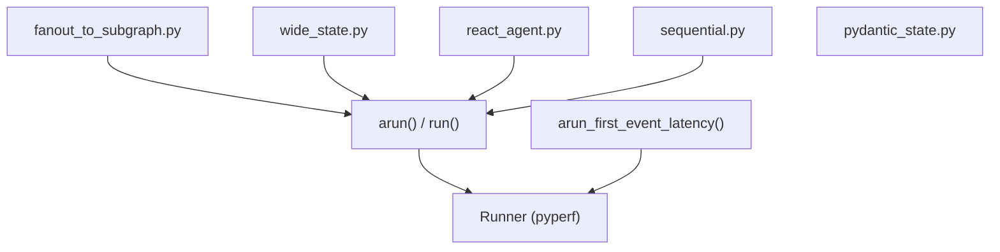

# 测试基础设施

相关源文件

-   [libs/checkpoint-conformance/langgraph/checkpoint/conformance/test\_utils.py](https://github.com/langchain-ai/langgraph/blob/1fd51e8f/libs/checkpoint-conformance/langgraph/checkpoint/conformance/test_utils.py)
-   [libs/checkpoint-conformance/uv.lock](https://github.com/langchain-ai/langgraph/blob/1fd51e8f/libs/checkpoint-conformance/uv.lock)
-   [libs/checkpoint-postgres/Makefile](https://github.com/langchain-ai/langgraph/blob/1fd51e8f/libs/checkpoint-postgres/Makefile)
-   [libs/checkpoint-postgres/tests/compose-postgres.yml](https://github.com/langchain-ai/langgraph/blob/1fd51e8f/libs/checkpoint-postgres/tests/compose-postgres.yml)
-   [libs/checkpoint-sqlite/Makefile](https://github.com/langchain-ai/langgraph/blob/1fd51e8f/libs/checkpoint-sqlite/Makefile)
-   [libs/checkpoint/Makefile](https://github.com/langchain-ai/langgraph/blob/1fd51e8f/libs/checkpoint/Makefile)
-   [libs/cli/Makefile](https://github.com/langchain-ai/langgraph/blob/1fd51e8f/libs/cli/Makefile)
-   [libs/langgraph/Makefile](https://github.com/langchain-ai/langgraph/blob/1fd51e8f/libs/langgraph/Makefile)
-   [libs/langgraph/bench/\_\_main\_\_.py](https://github.com/langchain-ai/langgraph/blob/1fd51e8f/libs/langgraph/bench/__main__.py)
-   [libs/langgraph/bench/fanout\_to\_subgraph.py](https://github.com/langchain-ai/langgraph/blob/1fd51e8f/libs/langgraph/bench/fanout_to_subgraph.py)
-   [libs/langgraph/bench/pydantic\_state.py](https://github.com/langchain-ai/langgraph/blob/1fd51e8f/libs/langgraph/bench/pydantic_state.py)
-   [libs/langgraph/bench/react\_agent.py](https://github.com/langchain-ai/langgraph/blob/1fd51e8f/libs/langgraph/bench/react_agent.py)
-   [libs/langgraph/bench/sequential.py](https://github.com/langchain-ai/langgraph/blob/1fd51e8f/libs/langgraph/bench/sequential.py)
-   [libs/langgraph/bench/wide\_dict.py](https://github.com/langchain-ai/langgraph/blob/1fd51e8f/libs/langgraph/bench/wide_dict.py)
-   [libs/langgraph/bench/wide\_state.py](https://github.com/langchain-ai/langgraph/blob/1fd51e8f/libs/langgraph/bench/wide_state.py)
-   [libs/langgraph/tests/conftest.py](https://github.com/langchain-ai/langgraph/blob/1fd51e8f/libs/langgraph/tests/conftest.py)
-   [libs/prebuilt/Makefile](https://github.com/langchain-ai/langgraph/blob/1fd51e8f/libs/prebuilt/Makefile)
-   [libs/prebuilt/tests/any\_str.py](https://github.com/langchain-ai/langgraph/blob/1fd51e8f/libs/prebuilt/tests/any_str.py)
-   [libs/prebuilt/tests/memory\_assert.py](https://github.com/langchain-ai/langgraph/blob/1fd51e8f/libs/prebuilt/tests/memory_assert.py)
-   [libs/prebuilt/tests/messages.py](https://github.com/langchain-ai/langgraph/blob/1fd51e8f/libs/prebuilt/tests/messages.py)
-   [libs/sdk-py/Makefile](https://github.com/langchain-ai/langgraph/blob/1fd51e8f/libs/sdk-py/Makefile)

本页记录了 LangGraph 单体仓库中的测试设置、pytest 配置、测试矩阵、集成测试、基准测试以及测试辅助工具。该基础设施旨在跨多个 Python 版本和数据库后端，验证核心图引擎、持久化层和预构建组件。

---

## 概览

测试套件围绕参数化的 pytest fixture 系统构建，使同一测试可以针对多个后端实现（内存、SQLite、PostgreSQL）运行。fixture 会在收集阶段根据 `NO_DOCKER` 环境变量进行条件参数化，以决定测试矩阵中是否包含依赖 Docker 的后端（如 PostgreSQL 与 Redis）。

核心配置位于 `libs/langgraph/tests/conftest.py`，用于把 checkpointer、store 和 cache fixture 串联起来。

---

## Fixture 架构

该测试基础设施采用分层 fixture 方式，为图提供可互换组件。

**Fixture 依赖与数据流**

```mermaid
flowchart TD
    SC["sync_checkpointer"]
    AC["async_checkpointer"]
    SS["sync_store"]
    AS["async_store"]
    CF["cache"]
    DU["durability"]
    DUUID["deterministic_uuids"]
    CM["_checkpointer_memory()"]
    CMS["_checkpointer_memory_migrate_sends()"]
    CS["_checkpointer_sqlite()"]
    CSA["_checkpointer_sqlite_aes()"]
    CSAI["_checkpointer_sqlite_aio()"]
    CP["_checkpointer_postgres()"]
    CPP["_checkpointer_postgres_pipe()"]
    CPAIO["_checkpointer_postgres_aio()"]
    SM["_store_memory()"]
    SP["_store_postgres()"]
    SPAIO["_store_postgres_aio()"]

    SC --> CM
    SC --> CMS
    SC --> CS
    SC --> CP
    AC --> CM
    AC --> CSAI
    AC --> CPAIO
    SS --> SM
    SS --> SP
    AS --> SM
    AS --> SPAIO
```


来源：[libs/langgraph/tests/conftest.py1-227](https://github.com/langchain-ai/langgraph/blob/1fd51e8f/libs/langgraph/tests/conftest.py#L1-L227) [libs/langgraph/tests/conftest.py42-141](https://github.com/langchain-ai/langgraph/blob/1fd51e8f/libs/langgraph/tests/conftest.py#L42-L141)

---

## `NO_DOCKER` 环境变量

测试环境的一个关键控制项是 `NO_DOCKER` 标志。它决定测试运行器是否期望通过 Docker 提供外部服务（Postgres、Redis）。

[libs/langgraph/tests/conftest.py39](https://github.com/langchain-ai/langgraph/blob/1fd51e8f/libs/langgraph/tests/conftest.py#L39-L39) 定义为：

```
NO_DOCKER = os.getenv("NO_DOCKER", "false") == "true"
```
当 `NO_DOCKER=true` 时，fixture 会回退到进程内或基于文件的后端（SQLite/Memory），以便在受限环境中测试或进行快速本地迭代。

**Fixture 参数化矩阵**

| Fixture | `NO_DOCKER=false`（默认） | `NO_DOCKER=true` |
| --- | --- | --- |
| `sync_checkpointer` | memory, memory\_migrate\_sends, sqlite, sqlite\_aes, postgres, postgres\_pipe, postgres\_pool | memory, sqlite, sqlite\_aes |
| `async_checkpointer` | memory, sqlite\_aio, postgres\_aio, postgres\_aio\_pipe, postgres\_aio\_pool | memory, sqlite\_aio |
| `sync_store` | in\_memory, postgres, postgres\_pipe, postgres\_pool | in\_memory |
| `async_store` | in\_memory, postgres\_aio, postgres\_aio\_pipe, postgres\_aio\_pool | in\_memory |
| `cache` | sqlite, memory, redis | sqlite, memory |

来源：[libs/langgraph/tests/conftest.py60-63](https://github.com/langchain-ai/langgraph/blob/1fd51e8f/libs/langgraph/tests/conftest.py#L60-L63) [libs/langgraph/tests/conftest.py92-96](https://github.com/langchain-ai/langgraph/blob/1fd51e8f/libs/langgraph/tests/conftest.py#L92-L96) [libs/langgraph/tests/conftest.py144-161](https://github.com/langchain-ai/langgraph/blob/1fd51e8f/libs/langgraph/tests/conftest.py#L144-L161)

---

## Checkpointer 与 Store Fixture

### Checkpointer 实现测试

`sync_checkpointer` 与 `async_checkpointer` fixture 确保 `StateGraph` 持久化在所有受支持的 `BaseCheckpointSaver` 实现上行为一致。

-   **同步变体**：包含 `SqliteSaver`、`PostgresSaver`（含 pipeline 和 pool 变体）以及 `InMemorySaver` [libs/langgraph/tests/conftest.py165-186](https://github.com/langchain-ai/langgraph/blob/1fd51e8f/libs/langgraph/tests/conftest.py#L165-L186)
-   **异步变体**：包含 `AsyncSqliteSaver` 与 `AsyncPostgresSaver` [libs/langgraph/tests/conftest.py209-225](https://github.com/langchain-ai/langgraph/blob/1fd51e8f/libs/langgraph/tests/conftest.py#L209-L225)

### Store 实现测试

`sync_store` 与 `async_store` fixture 提供 `BaseStore` 的实例（例如 `InMemoryStore`、`PostgresStore`），以测试跨线程内存和语义检索能力 [libs/langgraph/tests/conftest.py98-141](https://github.com/langchain-ai/langgraph/blob/1fd51e8f/libs/langgraph/tests/conftest.py#L98-L141)

---

## Cache Fixture 与并行性

`cache` fixture [libs/langgraph/tests/conftest.py60-89](https://github.com/langchain-ai/langgraph/blob/1fd51e8f/libs/langgraph/tests/conftest.py#L60-L89) 会产出 `BaseCache` 实现。对于 `RedisCache`，基础设施通过 `pytest-xdist` 处理并行测试隔离。

-   **隔离**：从 pytest 配置中获取 `workerid` [libs/langgraph/tests/conftest.py71](https://github.com/langchain-ai/langgraph/blob/1fd51e8f/libs/langgraph/tests/conftest.py#L71-L71)
-   **前缀**：应用 worker 专属前缀 `test:cache:{worker_id}:`，避免并行进程间键冲突 [libs/langgraph/tests/conftest.py77](https://github.com/langchain-ai/langgraph/blob/1fd51e8f/libs/langgraph/tests/conftest.py#L77-L77)
-   **清理**：teardown 逻辑确保仅删除带有该 worker 专属前缀的键 [libs/langgraph/tests/conftest.py81-87](https://github.com/langchain-ai/langgraph/blob/1fd51e8f/libs/langgraph/tests/conftest.py#L81-L87)

---

## 基准测试基础设施

LangGraph 在 `libs/langgraph/bench/` 中提供专用基准测试套件，用于跟踪执行性能、延迟和序列化开销。

**基准测试组件**


### 关键基准

-   **Fanout to Subgraph**：衡量 `Send` 操作与嵌套图执行的性能 [libs/langgraph/bench/fanout\_to\_subgraph.py11-58](https://github.com/langchain-ai/langgraph/blob/1fd51e8f/libs/langgraph/bench/fanout_to_subgraph.py#L11-L58)
-   **Wide State**：测试管理包含大量字段且频繁更新的大状态对象时的开销 [libs/langgraph/bench/wide\_state.py12-135](https://github.com/langchain-ai/langgraph/blob/1fd51e8f/libs/langgraph/bench/wide_state.py#L12-L135)
-   **Sequential**：衡量含数千个空操作节点的图的开销 [libs/langgraph/bench/sequential.py7-28](https://github.com/langchain-ai/langgraph/blob/1fd51e8f/libs/langgraph/bench/sequential.py#L7-L28)
-   **Latency**：使用 `arun_first_event_latency` 测量“首事件时间” [libs/langgraph/bench/\_\_main\_\_.py36-55](https://github.com/langchain-ai/langgraph/blob/1fd51e8f/libs/langgraph/bench/__main__.py#L36-L55)

### 运行基准测试

基准测试通过 `Makefile` 执行：

-   `make benchmark`：使用 `pyperf` 严格运行整个套件 [libs/langgraph/Makefile17-20](https://github.com/langchain-ai/langgraph/blob/1fd51e8f/libs/langgraph/Makefile#L17-L20)
-   `make profile`：针对特定图使用 `py-spy` 生成火焰图 [libs/langgraph/Makefile29-31](https://github.com/langchain-ai/langgraph/blob/1fd51e8f/libs/langgraph/Makefile#L29-L31)

来源：[libs/langgraph/bench/\_\_main\_\_.py99-238](https://github.com/langchain-ai/langgraph/blob/1fd51e8f/libs/langgraph/bench/__main__.py#L99-L238) [libs/langgraph/Makefile10-31](https://github.com/langchain-ai/langgraph/blob/1fd51e8f/libs/langgraph/Makefile#L10-L31)

---

## 测试工具与辅助函数

### 非确定性数据的匹配器

由于图执行涉及生成的 ID 和时间戳，测试套件在 `tests/any_str.py` 中使用了自定义匹配器。

-   `AnyStr`：匹配任意字符串，或匹配具有特定前缀的字符串 [libs/prebuilt/tests/any\_str.py4-17](https://github.com/langchain-ai/langgraph/blob/1fd51e8f/libs/prebuilt/tests/any_str.py#L4-L17)
-   `_AnyIdHumanMessage`：创建消息时将 `id` 字段自动匹配为任意字符串 [libs/prebuilt/tests/messages.py11-14](https://github.com/langchain-ai/langgraph/blob/1fd51e8f/libs/prebuilt/tests/messages.py#L11-L14)

### 确定性 UUID

`deterministic_uuids` fixture [libs/langgraph/tests/conftest.py47-52](https://github.com/langchain-ai/langgraph/blob/1fd51e8f/libs/langgraph/tests/conftest.py#L47-L52) 会 patch `uuid.uuid4` 使其返回可预测序列。这对于比较完整状态快照的测试至关重要，因为内部任务 ID 必须稳定。

### 内存断言

`MemorySaverAssertImmutable` [libs/prebuilt/tests/memory\_assert.py16-58](https://github.com/langchain-ai/langgraph/blob/1fd51e8f/libs/prebuilt/tests/memory_assert.py#L16-L58) 用于确保执行引擎不会修改存储在 checkpointer 中的状态对象，从而强制落实框架的不可变性保证。

---

## 服务管理（Docker）

集成测试所需的外部服务（Postgres、Redis）通过 Docker Compose 管理。

**服务拓扑**

| 服务 | 镜像 | 端口 | 配置文件 |
| --- | --- | --- | --- |
| PostgreSQL | `pgvector/pgvector:pg16` | 5441 | `tests/compose-postgres.yml` |
| Redis | `redis:alpine` | 6379 | `tests/compose-redis.yml` |

`Makefile` 提供了用于编排这些服务的目标：

-   `make start-services`：启动 Postgres 和 Redis，并使用 `--wait` 确保服务就绪 [libs/langgraph/Makefile40-41](https://github.com/langchain-ai/langgraph/blob/1fd51e8f/libs/langgraph/Makefile#L40-L41)
-   `make test_pg_version`：通过轮换 `POSTGRES_VERSION` 环境变量，专门针对多个 Postgres 版本（如 15、16）进行测试 [libs/checkpoint-postgres/Makefile18-33](https://github.com/langchain-ai/langgraph/blob/1fd51e8f/libs/checkpoint-postgres/Makefile#L18-L33)

来源：[libs/langgraph/Makefile40-45](https://github.com/langchain-ai/langgraph/blob/1fd51e8f/libs/langgraph/Makefile#L40-L45) [libs/checkpoint-postgres/Makefile7-15](https://github.com/langchain-ai/langgraph/blob/1fd51e8f/libs/checkpoint-postgres/Makefile#L7-L15)

---

## 测试执行摘要

| 命令 | 范围 | 特性 |
| --- | --- | --- |
| `uv run pytest` | 单元测试 | 核心逻辑、Pregel 算法、StateGraph 构建器 |
| `make integration_tests` | 集成测试 | 端到端流程、外部服务连通性 [libs/langgraph/Makefile85-86](https://github.com/langchain-ai/langgraph/blob/1fd51e8f/libs/langgraph/Makefile#L85-L86) |
| `make test_parallel` | 全部 | 使用 `pytest-xdist` 与 `worksteal` 分发策略 [libs/langgraph/Makefile76-83](https://github.com/langchain-ai/langgraph/blob/1fd51e8f/libs/langgraph/Makefile#L76-L83) |
| `make coverage` | 单元/集成 | 为 CI 和终端摘要生成 XML 报告 [libs/langgraph/Makefile34-38](https://github.com/langchain-ai/langgraph/blob/1fd51e8f/libs/langgraph/Makefile#L34-L38) |

来源：[libs/langgraph/Makefile61-106](https://github.com/langchain-ai/langgraph/blob/1fd51e8f/libs/langgraph/Makefile#L61-L106) [libs/cli/Makefile8-11](https://github.com/langchain-ai/langgraph/blob/1fd51e8f/libs/cli/Makefile#L8-L11) [libs/sdk-py/Makefile3-4](https://github.com/langchain-ai/langgraph/blob/1fd51e8f/libs/sdk-py/Makefile#L3-L4)
