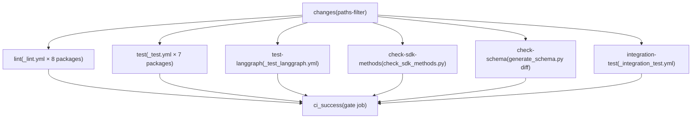
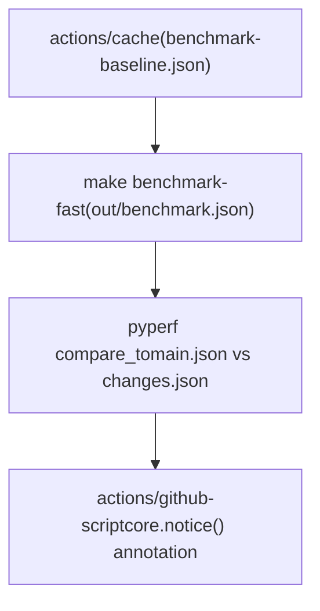
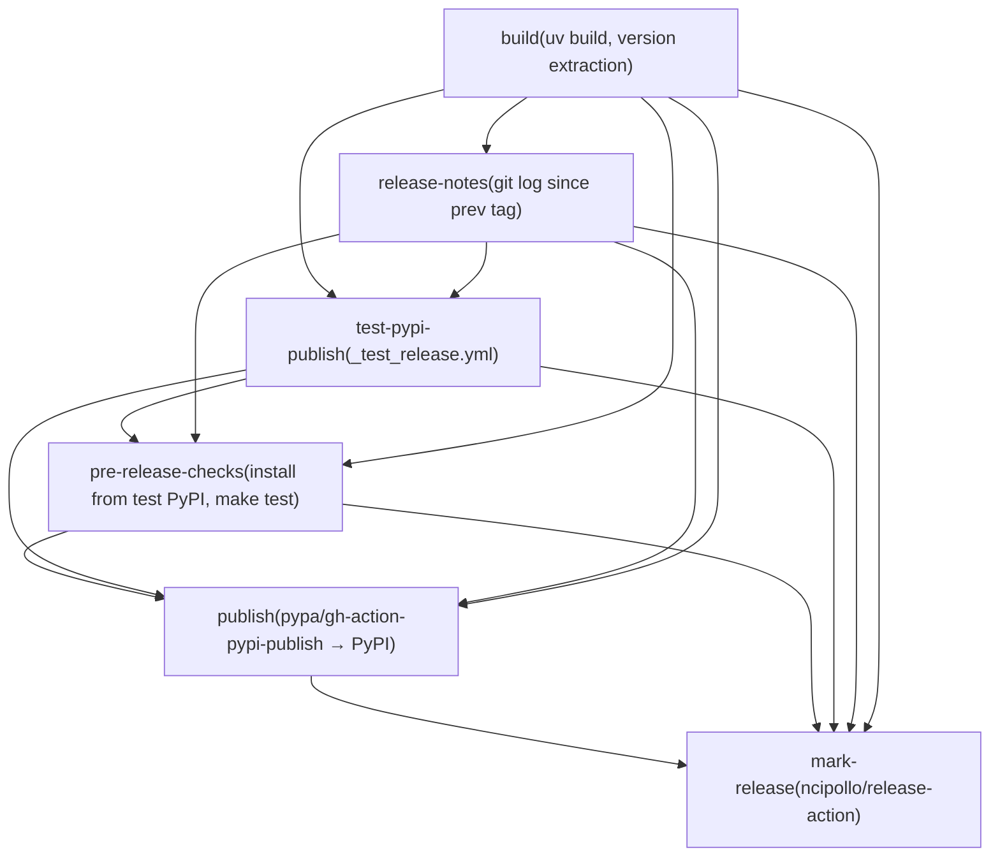
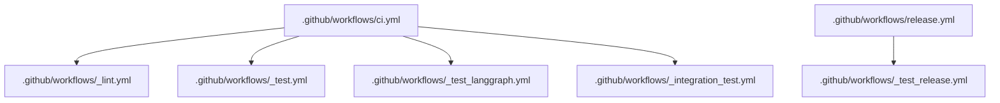

# CI/CD 工作流

相关源文件

-   [.github/ISSUE\_TEMPLATE/bug-report.yml](https://github.com/langchain-ai/langgraph/blob/1fd51e8f/.github/ISSUE_TEMPLATE/bug-report.yml)
-   [.github/ISSUE\_TEMPLATE/config.yml](https://github.com/langchain-ai/langgraph/blob/1fd51e8f/.github/ISSUE_TEMPLATE/config.yml)
-   [.github/ISSUE\_TEMPLATE/privileged.yml](https://github.com/langchain-ai/langgraph/blob/1fd51e8f/.github/ISSUE_TEMPLATE/privileged.yml)
-   [.github/PULL\_REQUEST\_TEMPLATE.md](https://github.com/langchain-ai/langgraph/blob/1fd51e8f/.github/PULL_REQUEST_TEMPLATE.md?plain=1)
-   [.github/actions/uv\_setup/action.yml](https://github.com/langchain-ai/langgraph/blob/1fd51e8f/.github/actions/uv_setup/action.yml)
-   [.github/workflows/\_integration\_test.yml](https://github.com/langchain-ai/langgraph/blob/1fd51e8f/.github/workflows/_integration_test.yml)
-   [.github/workflows/\_lint.yml](https://github.com/langchain-ai/langgraph/blob/1fd51e8f/.github/workflows/_lint.yml)
-   [.github/workflows/\_test.yml](https://github.com/langchain-ai/langgraph/blob/1fd51e8f/.github/workflows/_test.yml)
-   [.github/workflows/\_test\_langgraph.yml](https://github.com/langchain-ai/langgraph/blob/1fd51e8f/.github/workflows/_test_langgraph.yml)
-   [.github/workflows/\_test\_release.yml](https://github.com/langchain-ai/langgraph/blob/1fd51e8f/.github/workflows/_test_release.yml)
-   [.github/workflows/baseline.yml](https://github.com/langchain-ai/langgraph/blob/1fd51e8f/.github/workflows/baseline.yml)
-   [.github/workflows/bench.yml](https://github.com/langchain-ai/langgraph/blob/1fd51e8f/.github/workflows/bench.yml)
-   [.github/workflows/ci.yml](https://github.com/langchain-ai/langgraph/blob/1fd51e8f/.github/workflows/ci.yml)
-   [.github/workflows/release.yml](https://github.com/langchain-ai/langgraph/blob/1fd51e8f/.github/workflows/release.yml)
-   [.github/workflows/uv\_lock\_ugprade.yml](https://github.com/langchain-ai/langgraph/blob/1fd51e8f/.github/workflows/uv_lock_ugprade.yml)
-   [AGENTS.md](https://github.com/langchain-ai/langgraph/blob/1fd51e8f/AGENTS.md?plain=1)
-   [CLAUDE.md](https://github.com/langchain-ai/langgraph/blob/1fd51e8f/CLAUDE.md?plain=1)

本页记录了 LangGraph 单体仓库中的所有 GitHub Actions 工作流：主 CI 流水线、可复用作业工作流、基准测试流水线、每周依赖锁升级以及发布工作流。关于发布流程本身（PyPI 发布、打标签、发布说明），请参见 [9.4](https://github.com/langchain-ai/langgraph/blob/1fd51e8f/9.4) 关于测试基础设施细节（fixtures、Docker 服务、conftest 设置），请参见 [9.2](https://github.com/langchain-ai/langgraph/blob/1fd51e8f/9.2) 关于这些工作流调用的单体仓库构建系统与 `make` 目标，请参见 [9.1](https://github.com/langchain-ai/langgraph/blob/1fd51e8f/9.1)

---

## 工作流清单

所有工作流文件都位于 `.github/workflows/` 下。以 `_` 前缀命名的文件是可复用工作流，通过 `workflow_call` 从其他工作流中调用。

| 文件 | 名称 | 触发器 | 目的 |
| --- | --- | --- | --- |
| `ci.yml` | CI | `push` 到 `main`、`pull_request` | 编排 lint、测试、schema 和集成检查 |
| `_lint.yml` | lint | `workflow_call` | 按包运行 ruff 和 mypy |
| `_test.yml` | test | `workflow_call` | 按包、跨 Python 版本运行 `make test` |
| `_test_langgraph.yml` | test | `workflow_call` | 专门对 `libs/langgraph` 运行 `make test_parallel` |
| `_integration_test.yml` | CLI integration test | `workflow_call` | 通过 `langgraph build` 构建并进行 Docker 镜像冒烟测试 |
| `bench.yml` | bench | 对 `libs/**` 的 `pull_request` | 运行基准并与基线比较 |
| `baseline.yml` | baseline | `push` 到 `main`、`workflow_dispatch` | 将基准基线保存到缓存 |
| `uv_lock_ugprade.yml` | UV Lock Upgrade | 每周 cron、`workflow_dispatch` | 运行 `make lock-upgrade` 并打开 PR |
| `release.yml` | release | `workflow_dispatch` | 完整发布流水线（build → test PyPI → pre-check → publish → tag） |
| `_test_release.yml` | test-release | `workflow_call` | 构建并发布到 test PyPI |

来源：[.github/workflows/ci.yml1-10](https://github.com/langchain-ai/langgraph/blob/1fd51e8f/.github/workflows/ci.yml#L1-L10) [.github/workflows/\_lint.yml1-10](https://github.com/langchain-ai/langgraph/blob/1fd51e8f/.github/workflows/_lint.yml#L1-L10) [.github/workflows/\_test.yml1-10](https://github.com/langchain-ai/langgraph/blob/1fd51e8f/.github/workflows/_test.yml#L1-L10) [.github/workflows/\_test\_langgraph.yml1-10](https://github.com/langchain-ai/langgraph/blob/1fd51e8f/.github/workflows/_test_langgraph.yml#L1-L10) [.github/workflows/\_integration\_test.yml1-10](https://github.com/langchain-ai/langgraph/blob/1fd51e8f/.github/workflows/_integration_test.yml#L1-L10) [.github/workflows/bench.yml1-10](https://github.com/langchain-ai/langgraph/blob/1fd51e8f/.github/workflows/bench.yml#L1-L10) [.github/workflows/baseline.yml1-10](https://github.com/langchain-ai/langgraph/blob/1fd51e8f/.github/workflows/baseline.yml#L1-L10) [.github/workflows/uv\_lock\_ugprade.yml1-10](https://github.com/langchain-ai/langgraph/blob/1fd51e8f/.github/workflows/uv_lock_ugprade.yml#L1-L10) [.github/workflows/release.yml1-10](https://github.com/langchain-ai/langgraph/blob/1fd51e8f/.github/workflows/release.yml#L1-L10)

---

## 主 CI 流水线（`ci.yml`）

CI 工作流是所有拉取请求和推送到 `main` 的主要门禁。

### 并发控制

使用 `${{ github.workflow }}-${{ github.ref }}` 作为键的并发组可确保：如果同一分支的 CI 仍在运行时有新推送到达，则旧运行会被取消 [.github/workflows/ci.yml21-23](https://github.com/langchain-ai/langgraph/blob/1fd51e8f/.github/workflows/ci.yml#L21-L23)

### 路径过滤（`changes` 作业）

首个作业使用 `dorny/paths-filter` action 来判定仓库的哪些区域发生了变更 [.github/workflows/ci.yml26-50](https://github.com/langchain-ai/langgraph/blob/1fd51e8f/.github/workflows/ci.yml#L26-L50) 两个输出标志控制下游作业：

| 标志 | 监控路径 |
| --- | --- |
| `python` | `libs/langgraph/**`, `libs/sdk-py/**`, `libs/cli/**`, `libs/checkpoint/**`, `libs/checkpoint-sqlite/**`, `libs/checkpoint-postgres/**`, `libs/checkpoint-conformance/**`, `libs/prebuilt/**` |
| `deps` | `**/pyproject.toml`, `**/uv.lock` |

仅当 `python == 'true'` 或 `deps == 'true'` 时才会运行下游作业，从而避免在仅文档变更时做无谓工作 [.github/workflows/ci.yml67](https://github.com/langchain-ai/langgraph/blob/1fd51e8f/.github/workflows/ci.yml#L67-L67)

### 作业图

**CI 流水线作业依赖图：**

来源：[.github/workflows/ci.yml25-169](https://github.com/langchain-ai/langgraph/blob/1fd51e8f/.github/workflows/ci.yml#L25-L169)

### `ci_success` 门禁作业

最终的 `ci_success` 作业 [.github/workflows/ci.yml159-184](https://github.com/langchain-ai/langgraph/blob/1fd51e8f/.github/workflows/ci.yml#L159-L184) 始终运行（通过 `if: always()`），并在任一上游作业结果为 `failure` 或 `cancelled` 时以非零状态退出。这提供了一个可供分支保护规则统一引用的必需状态检查，不受路径过滤导致的作业跳过影响。

---

## 可复用工作流

### `_lint.yml` — 按包 Lint

通过 `workflow_call` 和 `working-directory` 输入触发。仅在 Python 3.12 上运行（该版本用于代表最低与最高支持范围，在覆盖率与 CI 速度间平衡） [.github/workflows/\_lint.yml19-32](https://github.com/langchain-ai/langgraph/blob/1fd51e8f/.github/workflows/_lint.yml#L19-L32)

步骤：

1.  **变更文件检测** — 使用 `Ana06/get-changed-files` 并过滤到 `${{ inputs.working-directory }}/**` [.github/workflows/\_lint.yml35-40](https://github.com/langchain-ai/langgraph/blob/1fd51e8f/.github/workflows/_lint.yml#L35-L40) 如果没有文件变更，后续步骤会被跳过。
2.  **安装 lint 依赖** — `uv sync --frozen --group lint` [.github/workflows/\_lint.yml52](https://github.com/langchain-ai/langgraph/blob/1fd51e8f/.github/workflows/_lint.yml#L52-L52)
3.  **恢复 mypy 缓存** — 依据 `uv.lock` 哈希缓存 `.mypy_cache`，加速类型检查 [.github/workflows/\_lint.yml54-62](https://github.com/langchain-ai/langgraph/blob/1fd51e8f/.github/workflows/_lint.yml#L54-L62)
4.  **`lint_package`** — 运行 `make lint_package`（若目标不存在则回退到 `make lint`） [.github/workflows/\_lint.yml64-73](https://github.com/langchain-ai/langgraph/blob/1fd51e8f/.github/workflows/_lint.yml#L64-L73)
5.  **安装测试 lint 依赖** — `uv sync --group lint`（为测试文件类型检查添加测试依赖） [.github/workflows/\_lint.yml78](https://github.com/langchain-ai/langgraph/blob/1fd51e8f/.github/workflows/_lint.yml#L78-L78)
6.  **恢复 mypy 测试缓存** — 单独的 `.mypy_cache_test` 缓存 [.github/workflows/\_lint.yml80-88](https://github.com/langchain-ai/langgraph/blob/1fd51e8f/.github/workflows/_lint.yml#L80-L88)
7.  **`lint_tests`** — 运行 `make lint_tests`（若目标不存在则跳过） [.github/workflows/\_lint.yml90-98](https://github.com/langchain-ai/langgraph/blob/1fd51e8f/.github/workflows/_lint.yml#L90-L98)

环境变量 `RUFF_OUTPUT_FORMAT: github` 会使 ruff 输出行内 PR 注释 [.github/workflows/\_lint.yml16](https://github.com/langchain-ai/langgraph/blob/1fd51e8f/.github/workflows/_lint.yml#L16-L16)

来源：[.github/workflows/\_lint.yml1-99](https://github.com/langchain-ai/langgraph/blob/1fd51e8f/.github/workflows/_lint.yml#L1-L99)

### `_test.yml` — 按包测试

通过 `workflow_call` 和 `working-directory` 输入触发。以 **Python 3.10、3.11、3.12、3.13、3.14** 运行矩阵 [.github/workflows/\_test.yml17-24](https://github.com/langchain-ai/langgraph/blob/1fd51e8f/.github/workflows/_test.yml#L17-L24)

步骤：

1.  **Docker Hub 登录** — 为避免拉取限速进行认证（在 fork PR 中跳过） [.github/workflows/\_test.yml35-40](https://github.com/langchain-ai/langgraph/blob/1fd51e8f/.github/workflows/_test.yml#L35-L40)
2.  **安装依赖** — `uv sync --frozen --group test --no-dev` [.github/workflows/\_test.yml45](https://github.com/langchain-ai/langgraph/blob/1fd51e8f/.github/workflows/_test.yml#L45-L45)
3.  **运行测试** — `make test` [.github/workflows/\_test.yml50](https://github.com/langchain-ai/langgraph/blob/1fd51e8f/.github/workflows/_test.yml#L50-L50)
4.  **工作树清洁检查** — 若测试产生了未跟踪文件则失败 [.github/workflows/\_test.yml52-63](https://github.com/langchain-ai/langgraph/blob/1fd51e8f/.github/workflows/_test.yml#L52-L63)

来源：[.github/workflows/\_test.yml1-64](https://github.com/langchain-ai/langgraph/blob/1fd51e8f/.github/workflows/_test.yml#L1-L64)

### `_test_langgraph.yml` — LangGraph 专用测试

与 `_test.yml` 基本一致，但固定到 `libs/langgraph`，并调用 `make test_parallel` 而非 `make test` [.github/workflows/\_test\_langgraph.yml46](https://github.com/langchain-ai/langgraph/blob/1fd51e8f/.github/workflows/_test_langgraph.yml#L46-L46)，以实现 pytest 并行执行。它还在 Python 3.13 上包含一次严格 msgpack pregel 测试专用运行 [.github/workflows/\_test\_langgraph.yml48-53](https://github.com/langchain-ai/langgraph/blob/1fd51e8f/.github/workflows/_test_langgraph.yml#L48-L53)

来源：[.github/workflows/\_test\_langgraph.yml1-66](https://github.com/langchain-ai/langgraph/blob/1fd51e8f/.github/workflows/_test_langgraph.yml#L1-L66)

---

## Schema 与 SDK 一致性检查

### `check-sdk-methods`

运行脚本 `.github/scripts/check_sdk_methods.py` [.github/workflows/ci.yml102-114](https://github.com/langchain-ai/langgraph/blob/1fd51e8f/.github/workflows/ci.yml#L102-L114) 用于校验 SDK 中定义的方法是否与服务器 API 期望一致。仅当 Python 源文件变更时运行。

### `check-schema`

在 `libs/cli` 中通过 `uv run python generate_schema.py` 生成 `langgraph.json` 配置 schema，然后与已提交的 `schemas/schema.json` 做 diff [.github/workflows/ci.yml116-150](https://github.com/langchain-ai/langgraph/blob/1fd51e8f/.github/workflows/ci.yml#L116-L150) 若生成结果与已提交版本不一致，CI 会失败并提示重新生成并提交文件。运行于 Python 3.13。

来源：[.github/workflows/ci.yml102-150](https://github.com/langchain-ai/langgraph/blob/1fd51e8f/.github/workflows/ci.yml#L102-L150)

---

## CLI 集成测试（`_integration_test.yml`）

该可复用工作流使用 `langgraph build` 构建真实 Docker 镜像，并在存在 `LANGSMITH_API_KEY` 时，用构建容器对 LangGraph 服务器 API 进行测试。

### 矩阵

矩阵是二维的：Python 版本（3.10、3.14）× 示例目录 [.github/workflows/\_integration\_test.yml13-33](https://github.com/langchain-ai/langgraph/blob/1fd51e8f/.github/workflows/_integration_test.yml#L13-L33)：

| 示例 | 工作目录 | Tag |
| --- | --- | --- |
| A | `libs/cli/examples` | `langgraph-test-a` |
| B | `libs/cli/examples/graphs` | `langgraph-test-b` |
| C | `libs/cli/examples/graphs_reqs_a` | `langgraph-test-c` |
| D | `libs/cli/examples/graphs_reqs_b` | `langgraph-test-d` |

### 额外构建（仅 Example A）

当矩阵条目为 Example A 时，该工作流还会构建：

-   来自 `libs/cli/js-examples` 的 JavaScript 服务（tag `langgraph-test-e`） [.github/workflows/\_integration\_test.yml76-80](https://github.com/langchain-ai/langgraph/blob/1fd51e8f/.github/workflows/_integration_test.yml#L76-L80)
-   来自 `libs/cli/js-monorepo-example` 的 JS monorepo 服务，使用自定义 `--build-command` 与 `--install-command`（tag `langgraph-test-f`） [.github/workflows/\_integration\_test.yml82-86](https://github.com/langchain-ai/langgraph/blob/1fd51e8f/.github/workflows/_integration_test.yml#L82-L86)
-   来自 `libs/cli/python-monorepo-example` 的 Python monorepo 服务（tag `langgraph-test-g`） [.github/workflows/\_integration\_test.yml88-92](https://github.com/langchain-ai/langgraph/blob/1fd51e8f/.github/workflows/_integration_test.yml#L88-L92)
-   来自 `libs/cli/examples/graph_prerelease_reqs` 的预发布 requirements 服务（tag `langgraph-test-h`） [.github/workflows/\_integration\_test.yml103-107](https://github.com/langchain-ai/langgraph/blob/1fd51e8f/.github/workflows/_integration_test.yml#L103-L107)
-   预期失败的预发布失败场景 `libs/cli/examples/graph_prerelease_reqs_fail`（tag `langgraph-test-i`） [.github/workflows/\_integration\_test.yml134-138](https://github.com/langchain-ai/langgraph/blob/1fd51e8f/.github/workflows/_integration_test.yml#L134-L138)

测试运行脚本是 `.github/scripts/run_langgraph_cli_test.py`，外层包裹 60 秒超时 [.github/workflows/\_integration\_test.yml74](https://github.com/langchain-ai/langgraph/blob/1fd51e8f/.github/workflows/_integration_test.yml#L74-L74)

来源：[.github/workflows/\_integration\_test.yml1-139](https://github.com/langchain-ai/langgraph/blob/1fd51e8f/.github/workflows/_integration_test.yml#L1-L139)

---

## 基准测试工作流

### `baseline.yml` — 保存基线

**触发器：** 推送到 `main` 或 `workflow_dispatch`，且 `libs/**` 有变更 [.github/workflows/baseline.yml1-8](https://github.com/langchain-ai/langgraph/blob/1fd51e8f/.github/workflows/baseline.yml#L1-L8)

在 `libs/langgraph` 中运行 `make benchmark`，并将输出以 `out/benchmark-baseline.json` 保存到 Actions 缓存，键格式为 `${{ runner.os }}-benchmark-baseline-${{ env.SHA }}` [.github/workflows/baseline.yml31-37](https://github.com/langchain-ai/langgraph/blob/1fd51e8f/.github/workflows/baseline.yml#L31-L37) 这使每个 `main` 提交都拥有独立缓存的基线。

### `bench.yml` — PR 对比

**触发器：** 触及 `libs/**` 的拉取请求 [.github/workflows/bench.yml4-6](https://github.com/langchain-ai/langgraph/blob/1fd51e8f/.github/workflows/bench.yml#L4-L6)

**基准对比图：**

步骤 [.github/workflows/bench.yml17-71](https://github.com/langchain-ai/langgraph/blob/1fd51e8f/.github/workflows/bench.yml#L17-L71)：

1.  从缓存恢复基线 [.github/workflows/bench.yml32-40](https://github.com/langchain-ai/langgraph/blob/1fd51e8f/.github/workflows/bench.yml#L32-L40)
2.  运行 `make benchmark-fast` → 写入 `out/benchmark.json` [.github/workflows/bench.yml41-48](https://github.com/langchain-ai/langgraph/blob/1fd51e8f/.github/workflows/bench.yml#L41-L48)
3.  重命名文件并运行 `uv run pyperf compare_to out/main.json out/changes.json --table --group-by-speed` [.github/workflows/bench.yml49-58](https://github.com/langchain-ai/langgraph/blob/1fd51e8f/.github/workflows/bench.yml#L49-L58)
4.  通过 `core.notice()` 将原始结果和对比表作为 PR 注释发布 [.github/workflows/bench.yml59-71](https://github.com/langchain-ai/langgraph/blob/1fd51e8f/.github/workflows/bench.yml#L59-L71)

来源：[.github/workflows/bench.yml1-71](https://github.com/langchain-ai/langgraph/blob/1fd51e8f/.github/workflows/bench.yml#L1-L71) [.github/workflows/baseline.yml1-37](https://github.com/langchain-ai/langgraph/blob/1fd51e8f/.github/workflows/baseline.yml#L1-L37)

---

## 每周依赖锁升级（`uv_lock_ugprade.yml`）

**触发器：** `0 0 * * 0` 的 cron（UTC 每周日午夜）或 `workflow_dispatch` [.github/workflows/uv\_lock\_ugprade.yml4-8](https://github.com/langchain-ai/langgraph/blob/1fd51e8f/.github/workflows/uv_lock_ugprade.yml#L4-L8)

在仓库根目录运行 `make lock-upgrade` [.github/workflows/uv\_lock\_ugprade.yml28](https://github.com/langchain-ai/langgraph/blob/1fd51e8f/.github/workflows/uv_lock_ugprade.yml#L28-L28)，该命令会在所有 Python 包中调用 `uv lock --upgrade`。随后使用 `peter-evans/create-pull-request` 在 `deps/uv-lock-upgrade` 分支上创建 PR，并打上 `dependencies` 标签 [.github/workflows/uv\_lock\_ugprade.yml30-46](https://github.com/langchain-ai/langgraph/blob/1fd51e8f/.github/workflows/uv_lock_ugprade.yml#L30-L46)

来源：[.github/workflows/uv\_lock\_ugprade.yml1-46](https://github.com/langchain-ai/langgraph/blob/1fd51e8f/.github/workflows/uv_lock_ugprade.yml#L1-L46)

---

## 发布流水线

发布工作流在 [9.4](https://github.com/langchain-ai/langgraph/blob/1fd51e8f/9.4) 页有详细记录。下文仅涵盖工作流文件之间的结构关系与作业时序。

### 作业顺序

**发布工作流作业依赖图：**

### 权限隔离

`build` 作业仅以 `contents: read` 权限运行 [.github/workflows/release.yml11-12](https://github.com/langchain-ai/langgraph/blob/1fd51e8f/.github/workflows/release.yml#L11-L12) `test-pypi-publish` 作业需要 `id-token: write`（用于 PyPI trusted publishing） [.github/workflows/release.yml145-147](https://github.com/langchain-ai/langgraph/blob/1fd51e8f/.github/workflows/release.yml#L145-L147) 这些权限被有意分离到不同作业中，以防构建步骤被攻破后访问发布凭据 [.github/workflows/release.yml37-47](https://github.com/langchain-ai/langgraph/blob/1fd51e8f/.github/workflows/release.yml#L37-L47)

### `_test_release.yml` 可复用工作流

由 `release.yml` 中的 `test-pypi-publish` 作业调用 [.github/workflows/release.yml148-151](https://github.com/langchain-ai/langgraph/blob/1fd51e8f/.github/workflows/release.yml#L148-L151) 它通过 `uv build` 构建包，并使用 `pypa/gh-action-pypi-publish`（`repository-url: https://test.pypi.org/legacy/`）上传到 test PyPI [.github/workflows/\_test\_release.yml84-90](https://github.com/langchain-ai/langgraph/blob/1fd51e8f/.github/workflows/_test_release.yml#L84-L90)

来源：[.github/workflows/release.yml1-157](https://github.com/langchain-ai/langgraph/blob/1fd51e8f/.github/workflows/release.yml#L1-L157) [.github/workflows/\_test\_release.yml1-98](https://github.com/langchain-ai/langgraph/blob/1fd51e8f/.github/workflows/_test_release.yml#L1-L98)

---

## 可复用工作流模式

所有可复用工作流都使用 `on: workflow_call` 并接受 `working-directory` 输入。主 `ci.yml` 通过策略矩阵调用它们，以扇出覆盖所有包。

**可复用工作流调用结构：**

每个调用方都通过 `secrets: inherit` 转发密钥 [.github/workflows/ci.yml71](https://github.com/langchain-ai/langgraph/blob/1fd51e8f/.github/workflows/ci.yml#L71-L71)，因此仓库密钥（例如 `DOCKERHUB_USERNAME`、`LANGSMITH_API_KEY`）可被可复用工作流使用。

来源：[.github/workflows/ci.yml68-157](https://github.com/langchain-ai/langgraph/blob/1fd51e8f/.github/workflows/ci.yml#L68-L157) [.github/workflows/release.yml148-151](https://github.com/langchain-ai/langgraph/blob/1fd51e8f/.github/workflows/release.yml#L148-L151)

---

## Python 版本覆盖摘要

| 工作流 | Python 版本 |
| --- | --- |
| `_lint.yml` | 仅 3.12 |
| `_test.yml` | 3.10, 3.11, 3.12, 3.13, 3.14 |
| `_test_langgraph.yml` | 3.10, 3.11, 3.12, 3.13, 3.14 |
| `_integration_test.yml` | 3.10, 3.14 |
| `bench.yml` | 3.11 |
| `baseline.yml` | 3.11 |
| `release.yml` | 3.11 |
| `_test_release.yml` | 3.10 |
| `uv_lock_ugprade.yml` | 3.10 |

来源：[.github/workflows/\_lint.yml31](https://github.com/langchain-ai/langgraph/blob/1fd51e8f/.github/workflows/_lint.yml#L31-L31) [.github/workflows/\_test.yml20-24](https://github.com/langchain-ai/langgraph/blob/1fd51e8f/.github/workflows/_test.yml#L20-L24) [.github/workflows/\_test\_langgraph.yml15-19](https://github.com/langchain-ai/langgraph/blob/1fd51e8f/.github/workflows/_test_langgraph.yml#L15-L19) [.github/workflows/\_integration\_test.yml18-19](https://github.com/langchain-ai/langgraph/blob/1fd51e8f/.github/workflows/_integration_test.yml#L18-L19) [.github/workflows/bench.yml24](https://github.com/langchain-ai/langgraph/blob/1fd51e8f/.github/workflows/bench.yml#L24-L24) [.github/workflows/baseline.yml22](https://github.com/langchain-ai/langgraph/blob/1fd51e8f/.github/workflows/baseline.yml#L22-L22) [.github/workflows/release.yml15](https://github.com/langchain-ai/langgraph/blob/1fd51e8f/.github/workflows/release.yml#L15-L15) [.github/workflows/\_test\_release.yml12](https://github.com/langchain-ai/langgraph/blob/1fd51e8f/.github/workflows/_test_release.yml#L12-L12) [.github/workflows/uv\_lock\_ugprade.yml24](https://github.com/langchain-ai/langgraph/blob/1fd51e8f/.github/workflows/uv_lock_ugprade.yml#L24-L24)
