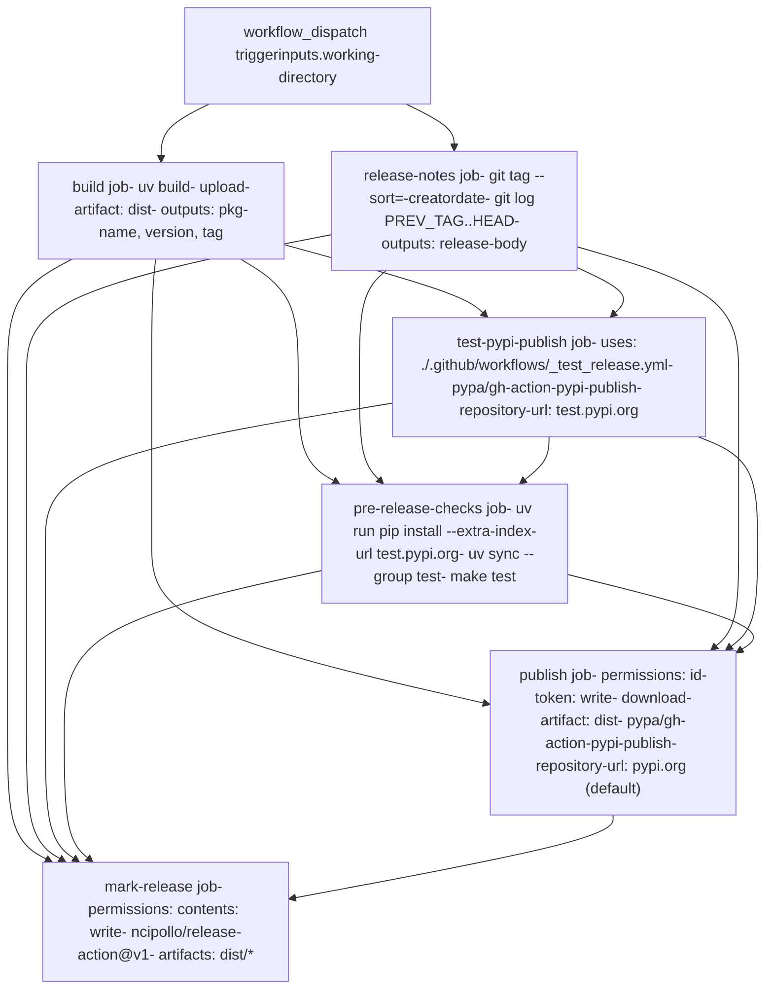
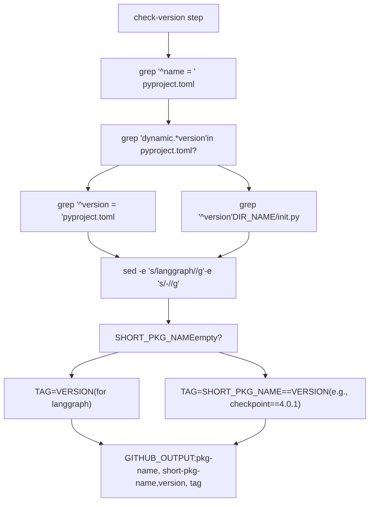
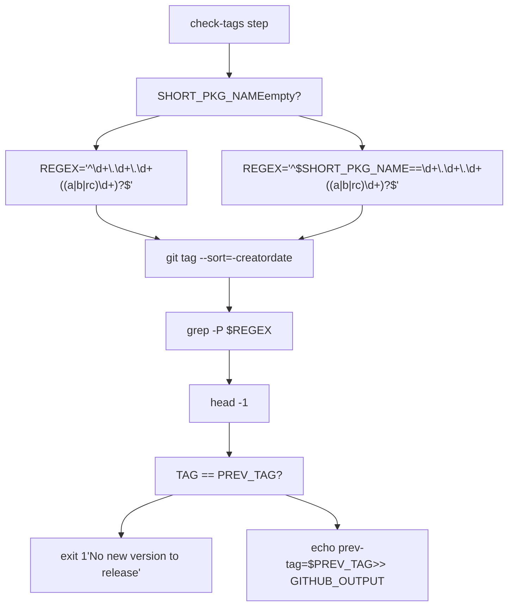
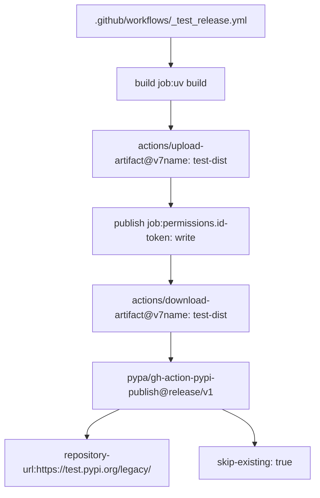
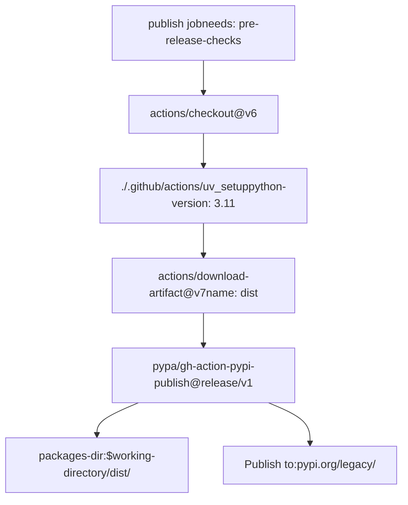
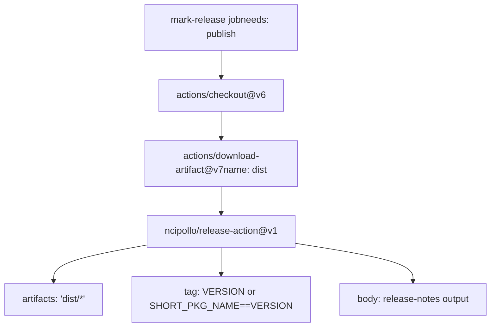

# 发布流程

相关源文件

-   [.github/workflows/\_integration\_test.yml](https://github.com/langchain-ai/langgraph/blob/1fd51e8f/.github/workflows/_integration_test.yml)
-   [.github/workflows/\_lint.yml](https://github.com/langchain-ai/langgraph/blob/1fd51e8f/.github/workflows/_lint.yml)
-   [.github/workflows/\_test.yml](https://github.com/langchain-ai/langgraph/blob/1fd51e8f/.github/workflows/_test.yml)
-   [.github/workflows/\_test\_langgraph.yml](https://github.com/langchain-ai/langgraph/blob/1fd51e8f/.github/workflows/_test_langgraph.yml)
-   [.github/workflows/\_test\_release.yml](https://github.com/langchain-ai/langgraph/blob/1fd51e8f/.github/workflows/_test_release.yml)
-   [.github/workflows/baseline.yml](https://github.com/langchain-ai/langgraph/blob/1fd51e8f/.github/workflows/baseline.yml)
-   [.github/workflows/bench.yml](https://github.com/langchain-ai/langgraph/blob/1fd51e8f/.github/workflows/bench.yml)
-   [.github/workflows/ci.yml](https://github.com/langchain-ai/langgraph/blob/1fd51e8f/.github/workflows/ci.yml)
-   [.github/workflows/release.yml](https://github.com/langchain-ai/langgraph/blob/1fd51e8f/.github/workflows/release.yml)
-   [.github/workflows/uv\_lock\_ugprade.yml](https://github.com/langchain-ai/langgraph/blob/1fd51e8f/.github/workflows/uv_lock_ugprade.yml)
-   [libs/checkpoint-postgres/uv.lock](https://github.com/langchain-ai/langgraph/blob/1fd51e8f/libs/checkpoint-postgres/uv.lock)
-   [libs/checkpoint-sqlite/uv.lock](https://github.com/langchain-ai/langgraph/blob/1fd51e8f/libs/checkpoint-sqlite/uv.lock)
-   [libs/checkpoint/langgraph/checkpoint/serde/jsonplus.py](https://github.com/langchain-ai/langgraph/blob/1fd51e8f/libs/checkpoint/langgraph/checkpoint/serde/jsonplus.py)
-   [libs/checkpoint/pyproject.toml](https://github.com/langchain-ai/langgraph/blob/1fd51e8f/libs/checkpoint/pyproject.toml)
-   [libs/checkpoint/tests/test\_jsonplus.py](https://github.com/langchain-ai/langgraph/blob/1fd51e8f/libs/checkpoint/tests/test_jsonplus.py)
-   [libs/checkpoint/uv.lock](https://github.com/langchain-ai/langgraph/blob/1fd51e8f/libs/checkpoint/uv.lock)
-   [libs/langgraph/pyproject.toml](https://github.com/langchain-ai/langgraph/blob/1fd51e8f/libs/langgraph/pyproject.toml)
-   [libs/langgraph/tests/\_\_snapshots\_\_/test\_pregel.ambr](https://github.com/langchain-ai/langgraph/blob/1fd51e8f/libs/langgraph/tests/__snapshots__/test_pregel.ambr)
-   [libs/langgraph/tests/\_\_snapshots\_\_/test\_pregel\_async.ambr](https://github.com/langchain-ai/langgraph/blob/1fd51e8f/libs/langgraph/tests/__snapshots__/test_pregel_async.ambr)
-   [libs/langgraph/uv.lock](https://github.com/langchain-ai/langgraph/blob/1fd51e8f/libs/langgraph/uv.lock)
-   [libs/prebuilt/pyproject.toml](https://github.com/langchain-ai/langgraph/blob/1fd51e8f/libs/prebuilt/pyproject.toml)
-   [libs/prebuilt/uv.lock](https://github.com/langchain-ai/langgraph/blob/1fd51e8f/libs/prebuilt/uv.lock)
-   [libs/sdk-py/uv.lock](https://github.com/langchain-ai/langgraph/blob/1fd51e8f/libs/sdk-py/uv.lock)

LangGraph 的发布流程由手动触发的 GitHub Actions 工作流（[.github/workflows/release.yml1-328](https://github.com/langchain-ai/langgraph/blob/1fd51e8f/.github/workflows/release.yml#L1-L328)）实现，用于将包发布到 PyPI。该工作流在构建与发布阶段之间强制权限隔离，在正式发布前先在 TestPyPI 验证包，并基于 git 变更日志创建 GitHub Release。

## 工作流作业

`release.yml` 工作流按严格依赖顺序执行六个作业：

| 作业名 | 依赖 | 目的 |
| --- | --- | --- |
| `build` | \- | 执行 `uv build` 并提取 `pkg-name`、`version`、`tag` 输出 |
| `release-notes` | `build` | 比较 git tag 并通过 `git log` 生成变更日志 |
| `test-pypi-publish` | `build`, `release-notes` | 调用 `.github/workflows/_test_release.yml` 发布到 test.pypi.org |
| `pre-release-checks` | `build`, `release-notes`, `test-pypi-publish` | 使用 `--extra-index-url` 从 TestPyPI 安装并运行 `make test` |
| `publish` | `build`, `release-notes`, `test-pypi-publish`, `pre-release-checks` | 通过 `pypa/gh-action-pypi-publish@release/v1` 发布到 pypi.org |
| `mark-release` | `build`, `release-notes`, `test-pypi-publish`, `pre-release-checks`, `publish` | 通过 `ncipollo/release-action@v1` 创建 GitHub Release |

来源：[.github/workflows/release.yml17-328](https://github.com/langchain-ai/langgraph/blob/1fd51e8f/.github/workflows/release.yml#L17-L328)

## 作业依赖图

**目的**：映射 GitHub Actions 工作流作业依赖关系，以及每个作业中使用的关键 action 与权限。

来源：[.github/workflows/release.yml17-328](https://github.com/langchain-ai/langgraph/blob/1fd51e8f/.github/workflows/release.yml#L17-L328)

## 触发器与输入

发布工作流通过 `workflow_dispatch` 手动触发，并带有一个必填输入：

| 输入 | 类型 | 默认值 | 描述 |
| --- | --- | --- | --- |
| `working-directory` | string | `libs/langgraph` | 要发布的包目录 |

**支持的包**：

| 包 | 目录 | 版本文件 |
| --- | --- | --- |
| `langgraph` | `libs/langgraph` | [libs/langgraph/pyproject.toml7](https://github.com/langchain-ai/langgraph/blob/1fd51e8f/libs/langgraph/pyproject.toml#L7-L7) |
| `langgraph-checkpoint` | `libs/checkpoint` | [libs/checkpoint/pyproject.toml7](https://github.com/langchain-ai/langgraph/blob/1fd51e8f/libs/checkpoint/pyproject.toml#L7-L7) |
| `langgraph-prebuilt` | `libs/prebuilt` | [libs/prebuilt/pyproject.toml7](https://github.com/langchain-ai/langgraph/blob/1fd51e8f/libs/prebuilt/pyproject.toml#L7-L7) |

来源：[.github/workflows/release.yml3-9](https://github.com/langchain-ai/langgraph/blob/1fd51e8f/.github/workflows/release.yml#L3-L9) [libs/langgraph/pyproject.toml5-7](https://github.com/langchain-ai/langgraph/blob/1fd51e8f/libs/langgraph/pyproject.toml#L5-L7) [libs/checkpoint/pyproject.toml5-7](https://github.com/langchain-ai/langgraph/blob/1fd51e8f/libs/checkpoint/pyproject.toml#L5-L7) [libs/prebuilt/pyproject.toml5-7](https://github.com/langchain-ai/langgraph/blob/1fd51e8f/libs/prebuilt/pyproject.toml#L5-L7)

## 构建阶段

`build` 作业会提取版本信息，并通过 `uv build` 创建分发产物（[.github/workflows/release.yml49](https://github.com/langchain-ai/langgraph/blob/1fd51e8f/.github/workflows/release.yml#L49-L49)）。

### 版本检测

**目的**：展示从 `pyproject.toml` 或 `__init__.py` 提取版本信息的 bash 脚本逻辑。

版本检测脚本执行以下步骤（[.github/workflows/release.yml58-80](https://github.com/langchain-ai/langgraph/blob/1fd51e8f/.github/workflows/release.yml#L58-L80)）：

1.  **提取包名**：`PKG_NAME=$(grep -m 1 "^name = " pyproject.toml | cut -d '"' -f 2)`
2.  **检查动态版本**：`grep -q 'dynamic.*=.*\[.*"version".*\]' pyproject.toml`
3.  **提取版本**：
    -   **静态（如 langgraph）**：`VERSION=$(grep -m 1 "^version = " pyproject.toml | cut -d '"' -f 2)`
    -   **动态**：`DIR_NAME=$(echo "$PKG_NAME" | tr '-' '_')` 然后 `VERSION=$(grep -m 1 '^__version__' "${DIR_NAME}/__init__.py" | cut -d '"' -f 2)`
4.  **生成短名**：`SHORT_PKG_NAME="$(echo "$PKG_NAME" | sed -e 's/langgraph//g' -e 's/-//g')"` → `langgraph-checkpoint` 的结果为 `checkpoint`
5.  **创建 tag**：
    -   **langgraph 包**：`TAG="$VERSION"`
    -   **其他包**：`TAG="${SHORT_PKG_NAME}==${VERSION}"` → `checkpoint==4.0.1`

### 构建产物

构建步骤在 [.github/workflows/release.yml49-50](https://github.com/langchain-ai/langgraph/blob/1fd51e8f/.github/workflows/release.yml#L49-L50) 使用 `uv build` 创建源码分发和 wheel 分发。产物通过 [.github/workflows/release.yml52-56](https://github.com/langchain-ai/langgraph/blob/1fd51e8f/.github/workflows/release.yml#L52-L56) 的 `actions/upload-artifact@v7` 上传，artifact 名称为 `dist`。

构建输出使用 `hatchling` 作为构建后端，见各包配置：

-   `langgraph`：[libs/langgraph/pyproject.toml1-3](https://github.com/langchain-ai/langgraph/blob/1fd51e8f/libs/langgraph/pyproject.toml#L1-L3)
-   `langgraph-checkpoint`：[libs/checkpoint/pyproject.toml1-3](https://github.com/langchain-ai/langgraph/blob/1fd51e8f/libs/checkpoint/pyproject.toml#L1-L3)
-   `langgraph-prebuilt`：[libs/prebuilt/pyproject.toml1-3](https://github.com/langchain-ai/langgraph/blob/1fd51e8f/libs/prebuilt/pyproject.toml#L1-L3)

## 发布说明生成

`release-notes` 作业通过 `git log` 比较当前版本 tag 与最近一个前序 tag，从而生成变更日志（[.github/workflows/release.yml136](https://github.com/langchain-ai/langgraph/blob/1fd51e8f/.github/workflows/release.yml#L136-L136)）。

### Tag 比较逻辑

**目的**：展示查找前一版本 tag 并校验新发布版本的 bash 脚本逻辑。

在 [.github/workflows/release.yml97-119](https://github.com/langchain-ai/langgraph/blob/1fd51e8f/.github/workflows/release.yml#L97-L119) 的 tag 比较中，会依据目标包是核心 `langgraph` 还是子包（如 `langgraph-checkpoint`）使用不同 regex 模式过滤已有 tag。

### 变更日志生成

`generate-release-body` 步骤（[.github/workflows/release.yml120-139](https://github.com/langchain-ai/langgraph/blob/1fd51e8f/.github/workflows/release.yml#L120-L139)）通过提取自上一 tag 以来的提交主题来创建发布说明。若找不到上一 tag，则默认写入 “Initial release”（[.github/workflows/release.yml131-137](https://github.com/langchain-ai/langgraph/blob/1fd51e8f/.github/workflows/release.yml#L131-L137)）。

## TestPyPI 发布

`test-pypi-publish` 作业（[.github/workflows/release.yml141-151](https://github.com/langchain-ai/langgraph/blob/1fd51e8f/.github/workflows/release.yml#L141-L151)）使用可复用工作流 `_test_release.yml` 将包发布到 TestPyPI。

### TestPyPI 工作流

**目的**：展示 TestPyPI 发布工作流结构和 artifact 流向。

该工作流使用带 OIDC 的 Trusted Publishing，需要 `id-token: write` 权限（[.github/workflows/release.yml147](https://github.com/langchain-ai/langgraph/blob/1fd51e8f/.github/workflows/release.yml#L147-L147)）。

## 发布前检查

`pre-release-checks` 作业（[.github/workflows/release.yml153-242](https://github.com/langchain-ai/langgraph/blob/1fd51e8f/.github/workflows/release.yml#L153-L242)）会在干净环境中安装已发布到 TestPyPI 的包并运行测试套件，以进行验证。

### 从 TestPyPI 安装包

在 [.github/workflows/release.yml182-221](https://github.com/langchain-ai/langgraph/blob/1fd51e8f/.github/workflows/release.yml#L182-L221) 的安装逻辑中，`pip install` 使用 `test.pypi.org` 作为额外索引 URL。它包含带 5 秒 sleep 的重试机制，用于应对 TestPyPI 索引延迟（[.github/workflows/release.yml188-200](https://github.com/langchain-ai/langgraph/blob/1fd51e8f/.github/workflows/release.yml#L188-L200)）。

**排除缓存**：该作业显式禁用缓存（[.github/workflows/release.yml179](https://github.com/langchain-ai/langgraph/blob/1fd51e8f/.github/workflows/release.yml#L179-L179)），以确保测试能暴露缺失依赖问题，避免被缓存环境掩盖（[.github/workflows/release.yml162-173](https://github.com/langchain-ai/langgraph/blob/1fd51e8f/.github/workflows/release.yml#L162-L173)）。

## PyPI 发布

`publish` 作业（[.github/workflows/release.yml243-285](https://github.com/langchain-ai/langgraph/blob/1fd51e8f/.github/workflows/release.yml#L243-L285)）执行最终的生产发布到 PyPI。

### 生产发布工作流

**目的**：展示生产发布作业步骤和 `pypa/gh-action-pypi-publish` 配置。

该作业通过 `id-token: write` 权限使用 Trusted Publishing（[.github/workflows/release.yml256](https://github.com/langchain-ai/langgraph/blob/1fd51e8f/.github/workflows/release.yml#L256-L256)），并指向 `build` 作业产物所在的 `dist/` 目录（[.github/workflows/release.yml280](https://github.com/langchain-ai/langgraph/blob/1fd51e8f/.github/workflows/release.yml#L280-L280)）。

## GitHub Release 创建

`mark-release` 作业（[.github/workflows/release.yml286-328](https://github.com/langchain-ai/langgraph/blob/1fd51e8f/.github/workflows/release.yml#L286-L328)）负责创建最终 GitHub Release。

### Release 创建工作流

**目的**：展示创建 GitHub Release 时 `ncipollo/release-action` 的配置。

Release 使用带 `contents: write` 权限的 `GITHUB_TOKEN` 创建（[.github/workflows/release.yml297](https://github.com/langchain-ai/langgraph/blob/1fd51e8f/.github/workflows/release.yml#L297-L297)）。它会上传 `dist/` 目录中的全部产物（[.github/workflows/release.yml321](https://github.com/langchain-ai/langgraph/blob/1fd51e8f/.github/workflows/release.yml#L321-L321)），并使用 `release-notes` 作业生成的正文（[.github/workflows/release.yml326](https://github.com/langchain-ai/langgraph/blob/1fd51e8f/.github/workflows/release.yml#L326-L326)）。

来源：[.github/workflows/release.yml1-328](https://github.com/langchain-ai/langgraph/blob/1fd51e8f/.github/workflows/release.yml#L1-L328) [libs/langgraph/pyproject.toml1-33](https://github.com/langchain-ai/langgraph/blob/1fd51e8f/libs/langgraph/pyproject.toml#L1-L33) [libs/checkpoint/pyproject.toml1-17](https://github.com/langchain-ai/langgraph/blob/1fd51e8f/libs/checkpoint/pyproject.toml#L1-L17) [libs/prebuilt/pyproject.toml1-29](https://github.com/langchain-ai/langgraph/blob/1fd51e8f/libs/prebuilt/pyproject.toml#L1-L29)
