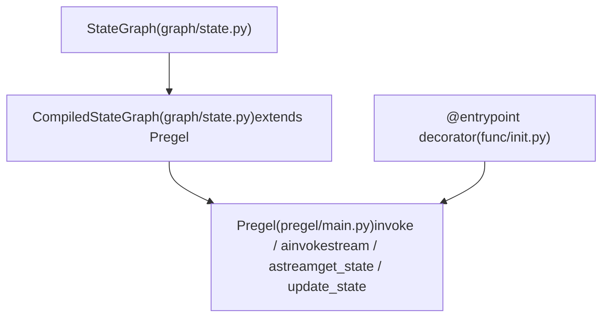
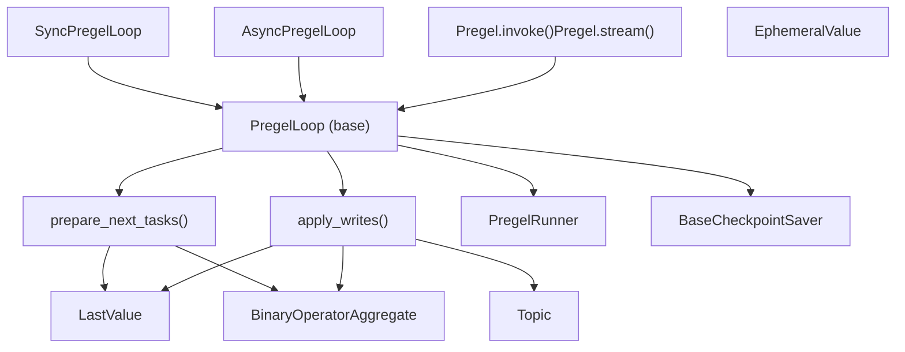
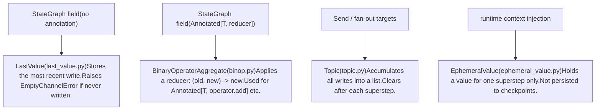

# 核心执行系统

相关源文件

-   [libs/langgraph/langgraph/channels/\_\_init\_\_.py](https://github.com/langchain-ai/langgraph/blob/1fd51e8f/libs/langgraph/langgraph/channels/__init__.py)
-   [libs/langgraph/langgraph/channels/any\_value.py](https://github.com/langchain-ai/langgraph/blob/1fd51e8f/libs/langgraph/langgraph/channels/any_value.py)
-   [libs/langgraph/langgraph/channels/base.py](https://github.com/langchain-ai/langgraph/blob/1fd51e8f/libs/langgraph/langgraph/channels/base.py)
-   [libs/langgraph/langgraph/channels/binop.py](https://github.com/langchain-ai/langgraph/blob/1fd51e8f/libs/langgraph/langgraph/channels/binop.py)
-   [libs/langgraph/langgraph/channels/ephemeral\_value.py](https://github.com/langchain-ai/langgraph/blob/1fd51e8f/libs/langgraph/langgraph/channels/ephemeral_value.py)
-   [libs/langgraph/langgraph/channels/last\_value.py](https://github.com/langchain-ai/langgraph/blob/1fd51e8f/libs/langgraph/langgraph/channels/last_value.py)
-   [libs/langgraph/langgraph/channels/named\_barrier\_value.py](https://github.com/langchain-ai/langgraph/blob/1fd51e8f/libs/langgraph/langgraph/channels/named_barrier_value.py)
-   [libs/langgraph/langgraph/channels/topic.py](https://github.com/langchain-ai/langgraph/blob/1fd51e8f/libs/langgraph/langgraph/channels/topic.py)
-   [libs/langgraph/langgraph/channels/untracked\_value.py](https://github.com/langchain-ai/langgraph/blob/1fd51e8f/libs/langgraph/langgraph/channels/untracked_value.py)
-   [libs/langgraph/langgraph/constants.py](https://github.com/langchain-ai/langgraph/blob/1fd51e8f/libs/langgraph/langgraph/constants.py)
-   [libs/langgraph/langgraph/errors.py](https://github.com/langchain-ai/langgraph/blob/1fd51e8f/libs/langgraph/langgraph/errors.py)
-   [libs/langgraph/langgraph/func/\_\_init\_\_.py](https://github.com/langchain-ai/langgraph/blob/1fd51e8f/libs/langgraph/langgraph/func/__init__.py)
-   [libs/langgraph/langgraph/graph/state.py](https://github.com/langchain-ai/langgraph/blob/1fd51e8f/libs/langgraph/langgraph/graph/state.py)
-   [libs/langgraph/langgraph/pregel/\_\_init\_\_.py](https://github.com/langchain-ai/langgraph/blob/1fd51e8f/libs/langgraph/langgraph/pregel/__init__.py)
-   [libs/langgraph/langgraph/pregel/debug.py](https://github.com/langchain-ai/langgraph/blob/1fd51e8f/libs/langgraph/langgraph/pregel/debug.py)
-   [libs/langgraph/langgraph/pregel/types.py](https://github.com/langchain-ai/langgraph/blob/1fd51e8f/libs/langgraph/langgraph/pregel/types.py)
-   [libs/langgraph/langgraph/types.py](https://github.com/langchain-ai/langgraph/blob/1fd51e8f/libs/langgraph/langgraph/types.py)
-   [libs/langgraph/langgraph/utils/\_\_init\_\_.py](https://github.com/langchain-ai/langgraph/blob/1fd51e8f/libs/langgraph/langgraph/utils/__init__.py)
-   [libs/langgraph/langgraph/utils/config.py](https://github.com/langchain-ai/langgraph/blob/1fd51e8f/libs/langgraph/langgraph/utils/config.py)
-   [libs/langgraph/langgraph/utils/runnable.py](https://github.com/langchain-ai/langgraph/blob/1fd51e8f/libs/langgraph/langgraph/utils/runnable.py)
-   [libs/langgraph/tests/\_\_snapshots\_\_/test\_large\_cases.ambr](https://github.com/langchain-ai/langgraph/blob/1fd51e8f/libs/langgraph/tests/__snapshots__/test_large_cases.ambr)
-   [libs/langgraph/tests/test\_checkpoint\_migration.py](https://github.com/langchain-ai/langgraph/blob/1fd51e8f/libs/langgraph/tests/test_checkpoint_migration.py)
-   [libs/langgraph/tests/test\_large\_cases.py](https://github.com/langchain-ai/langgraph/blob/1fd51e8f/libs/langgraph/tests/test_large_cases.py)
-   [libs/langgraph/tests/test\_large\_cases\_async.py](https://github.com/langchain-ai/langgraph/blob/1fd51e8f/libs/langgraph/tests/test_large_cases_async.py)
-   [libs/langgraph/tests/test\_pregel.py](https://github.com/langchain-ai/langgraph/blob/1fd51e8f/libs/langgraph/tests/test_pregel.py)
-   [libs/langgraph/tests/test\_pregel\_async.py](https://github.com/langchain-ai/langgraph/blob/1fd51e8f/libs/langgraph/tests/test_pregel_async.py)

本页描述了 LangGraph 核心执行引擎的架构：Pregel 计算模型、两种面向用户的图定义 API，以及每个内部组件如何参与图运行。它覆盖系统层面的 **what** 与 **why**。

如需各子系统的完整 API 细节，请参见子页面：

-   状态 schema、`add_node`、`compile()` → [StateGraph API](/langchain-ai/langgraph/3.1-stategraph-api)
-   `@task` 与 `@entrypoint` → [Functional API (@task and @entrypoint)](/langchain-ai/langgraph/3.2-functional-api-(@task-and-@entrypoint))
-   超级步循环内部机制 → [Pregel Execution Engine](/langchain-ai/langgraph/3.3-pregel-execution-engine)
-   通道类型与 reducer → [State Management and Channels](/langchain-ai/langgraph/3.4-state-management-and-channels)
-   `Send`、`Command`、条件边 → [Control Flow Primitives](/langchain-ai/langgraph/3.5-control-flow-primitives)
-   图组合与嵌套结构 → [Graph Composition and Nested Graphs](/langchain-ai/langgraph/3.6-graph-composition-and-nested-graphs)
-   中断与 human-in-the-loop → [Human-in-the-Loop and Interrupts](/langchain-ai/langgraph/3.7-human-in-the-loop-and-interrupts)
-   `RetryPolicy`、`CachePolicy` → [Error Handling and Retry Policies](/langchain-ai/langgraph/3.8-error-handling-and-retry-policies), [Caching System](/langchain-ai/langgraph/3.10-caching-system)
-   Runtime 与依赖注入 → [Runtime and Dependency Injection](/langchain-ai/langgraph/3.9-runtime-and-dependency-injection)

---

## 计算模型

LangGraph 的执行引擎是 **Pregel / 批量同步并行（BSP）** 模型的一种实现。在该模型中，图由 **actor**（节点）构成，它们仅通过 **channel**（共享状态槽）通信。执行被划分为离散的 **superstep**。在同一个 superstep 内，任何 actor 都不能观察到其他 actor 的写入——某个 superstep 的所有写入都要到下一个 superstep 开始时才可见。

每个 superstep 依次运行三个阶段：

| 阶段 | 描述 | 关键代码 |
| --- | --- | --- |
| **Plan** | 根据上一 superstep 中哪些 channel 被更新，确定哪些 actor 有资格运行。 | `prepare_next_tasks()` in `pregel/_algo.py` |
| **Execute** | 并发运行所有选定 actor。每个 actor 从其订阅 channel 读取并写出结果。 | `PregelRunner` in `pregel/_runner.py` |
| **Update** | 将 actor 的写入提交到 channel，并应用所有 reducer。 | `apply_writes()` in `pregel/_algo.py` |

循环会持续直到没有 actor 可运行（图执行完成）、达到递归上限或发生中断。

来源：[libs/langgraph/langgraph/pregel/main.py324-360](https://github.com/langchain-ai/langgraph/blob/1fd51e8f/libs/langgraph/langgraph/pregel/main.py#L324-L360) [libs/langgraph/langgraph/pregel/\_loop.py140-200](https://github.com/langchain-ai/langgraph/blob/1fd51e8f/libs/langgraph/langgraph/pregel/_loop.py#L140-L200)

---

## 两个入口，一个运行时

用户可以用两种方式定义图。两者最终都会产出一个 `Pregel` 实例，它才是实际运行时对象，支持 `invoke`、`stream`、`ainvoke` 和 `astream`。

**图：图定义 API 及其编译产物**


来源：[libs/langgraph/langgraph/graph/state.py115-184](https://github.com/langchain-ai/langgraph/blob/1fd51e8f/libs/langgraph/langgraph/graph/state.py#L115-L184) [libs/langgraph/langgraph/func/\_\_init\_\_.py238-300](https://github.com/langchain-ai/langgraph/blob/1fd51e8f/libs/langgraph/langgraph/func/__init__.py#L238-L300) [libs/langgraph/langgraph/pregel/main.py324-330](https://github.com/langchain-ai/langgraph/blob/1fd51e8f/libs/langgraph/langgraph/pregel/main.py#L324-L330)

### StateGraph 路径

`StateGraph` 是一个**构建器**——它保存节点和边的声明，但自身不能直接执行。调用 `.compile()` 会验证图结构并返回 `CompiledStateGraph`，后者是 `Pregel` 的子类。在编译过程中，`StateGraph` 会把其节点和 channel 转换为运行时由 `Pregel` 使用的内部 `PregelNode` 与 `BaseChannel` 对象。

```
# Example: StateGraph -> CompiledStateGraph (Pregel)builder = StateGraph(State)builder.add_node("my_node", my_func)builder.add_edge(START, "my_node")graph = builder.compile()        # returns CompiledStateGraphgraph.invoke({"key": "value"})   # runs via Pregel
```
来源：[libs/langgraph/langgraph/graph/state.py197-250](https://github.com/langchain-ai/langgraph/blob/1fd51e8f/libs/langgraph/langgraph/graph/state.py#L197-L250) [libs/langgraph/tests/test\_pregel.py87-117](https://github.com/langchain-ai/langgraph/blob/1fd51e8f/libs/langgraph/tests/test_pregel.py#L87-L117)

### 函数式 API 路径

`@entrypoint` 装饰器会包装一个 Python 函数，并直接构建 `Pregel` 实例。无需显式构造 `StateGraph`。通过 `@task` 声明的任务会成为由 `@entrypoint` 创建的 Pregel 图中的 `PregelNode` actor。

```
# Example: @entrypoint -> Pregel@taskdef fetch_data(url: str) -> str: ... @entrypoint(checkpointer=InMemorySaver())def my_workflow(input: str) -> str:    result = fetch_data(input).result()    return result my_workflow.invoke("http://...")   # my_workflow IS a Pregel instance
```
`entrypoint` 装饰器内部使用 `get_runnable_for_entrypoint` 将函数映射到底层 Pregel 结构。

来源：[libs/langgraph/langgraph/func/\_\_init\_\_.py127-190](https://github.com/langchain-ai/langgraph/blob/1fd51e8f/libs/langgraph/langgraph/func/__init__.py#L127-L190) [libs/langgraph/langgraph/func/\_\_init\_\_.py35-39](https://github.com/langchain-ai/langgraph/blob/1fd51e8f/libs/langgraph/langgraph/func/__init__.py#L35-L39)

---

## Pregel 运行时

[libs/langgraph/langgraph/pregel/main.py324](https://github.com/langchain-ai/langgraph/blob/1fd51e8f/libs/langgraph/langgraph/pregel/main.py#L324-L324) 中的 `Pregel` 是核心运行时类。它持有：

| 属性 | 类型 | 目的 |
| --- | --- | --- |
| `nodes` | `Mapping[str, PregelNode]` | 所有 actor 定义 |
| `channels` | `Mapping[str, BaseChannel]` | 所有通信 channel |
| `input_channels` | `str | Sequence[str]` | 哪些 channel 接受外部输入 |
| `output_channels` | `str | Sequence[str]` | 哪些 channel 产出最终输出 |
| `checkpointer` | `BaseCheckpointSaver | None` | 持久化层 |
| `interrupt_before` | `Sequence[str] | All` | 在这些节点之前中断 |
| `interrupt_after` | `Sequence[str] | All` | 在这些节点之后中断 |
| `retry_policy` | `RetryPolicy | None` | 默认重试行为 |
| `cache_policy` | `CachePolicy | None` | 默认缓存行为 |

`Pregel` 暴露公共执行接口：`invoke`、`ainvoke`、`stream`、`astream`、`batch`、`get_state`、`update_state`、`get_state_history`。

### NodeBuilder

[libs/langgraph/langgraph/pregel/main.py160-322](https://github.com/langchain-ai/langgraph/blob/1fd51e8f/libs/langgraph/langgraph/pregel/main.py#L160-L322) 中的 `NodeBuilder` 是一个流式构建器，可直接创建底层 `PregelNode` actor——主要用于测试和高级场景（无需 `StateGraph` 时）。

```
node = (    NodeBuilder()    .subscribe_only("input")   # read from channel "input"    .do(my_func)               # run my_func    .write_to("output")        # write result to channel "output"    .build()                   # returns PregelNode)
```
`StateGraph` 会在 `compile()` 期间在内部创建 `PregelNode` 实例，因此大多数用户不会直接使用 `NodeBuilder`。

来源：[libs/langgraph/langgraph/pregel/main.py160-322](https://github.com/langchain-ai/langgraph/blob/1fd51e8f/libs/langgraph/langgraph/pregel/main.py#L160-L322) [libs/langgraph/tests/test\_large\_cases.py55-70](https://github.com/langchain-ai/langgraph/blob/1fd51e8f/libs/langgraph/tests/test_large_cases.py#L55-L70)

---

## 内部执行组件

**图：运行时组件关系**


来源：[libs/langgraph/langgraph/pregel/\_loop.py57-58](https://github.com/langchain-ai/langgraph/blob/1fd51e8f/libs/langgraph/langgraph/pregel/_loop.py#L57-L58) [libs/langgraph/langgraph/pregel/\_runner.py57-58](https://github.com/langchain-ai/langgraph/blob/1fd51e8f/libs/langgraph/langgraph/pregel/_runner.py#L57-L58) [libs/langgraph/langgraph/pregel/main.py324-400](https://github.com/langchain-ai/langgraph/blob/1fd51e8f/libs/langgraph/langgraph/pregel/main.py#L324-L400)

### PregelLoop

`PregelLoop` 是 superstep 控制器。它有两个具体子类：

-   `SyncPregelLoop` — 由 `invoke` 和 `stream` 使用 [libs/langgraph/langgraph/pregel/\_loop.py57](https://github.com/langchain-ai/langgraph/blob/1fd51e8f/libs/langgraph/langgraph/pregel/_loop.py#L57-L57)
-   `AsyncPregelLoop` — 由 `ainvoke` 和 `astream` 使用 [libs/langgraph/langgraph/pregel/\_loop.py56](https://github.com/langchain-ai/langgraph/blob/1fd51e8f/libs/langgraph/langgraph/pregel/_loop.py#L56-L56)

该循环会跟踪：

-   `step` — 当前 superstep 索引
-   `stop` — 允许的最大步数（递归上限）
-   `tasks` — 当前 superstep 准备执行的 `PregelExecutableTask` 集合
-   checkpoint 管理（读取初始状态、每一步后写入）
-   中断处理（`interrupt_before`、`interrupt_after`）
-   流式输出发射

来源：[libs/langgraph/langgraph/pregel/\_loop.py56-58](https://github.com/langchain-ai/langgraph/blob/1fd51e8f/libs/langgraph/langgraph/pregel/_loop.py#L56-L58) [libs/langgraph/tests/test\_pregel.py57-58](https://github.com/langchain-ai/langgraph/blob/1fd51e8f/libs/langgraph/tests/test_pregel.py#L57-L58)

### prepare\_next\_tasks

`prepare_next_tasks()` 在每个 superstep 开始时调用（Plan 阶段）。它会检查上一 superstep 哪些 channel 被更新，并返回触发条件满足的 `PregelExecutableTask` 集合。

`PregelExecutableTask` 携带：

-   `name` — 节点名
-   `input` — 节点接收的 channel 值
-   `proc` — 要执行的 `Runnable`
-   `writes` — 用于收集输出的 `deque`
-   `config` — 注入上下文的 `RunnableConfig`
-   `retry_policy`、`cache_key`、`id`、`path`

来源：[libs/langgraph/langgraph/types.py74-80](https://github.com/langchain-ai/langgraph/blob/1fd51e8f/libs/langgraph/langgraph/types.py#L74-L80) [libs/langgraph/langgraph/pregel/debug.py37-49](https://github.com/langchain-ai/langgraph/blob/1fd51e8f/libs/langgraph/langgraph/pregel/debug.py#L37-L49)

### PregelRunner

`PregelRunner` 会并发执行一组 `PregelExecutableTask`（Execute 阶段）。它会：

-   在线程池中运行同步任务
-   用 `asyncio` 运行异步任务
-   应用每个任务 `retry_policy` 中的重试逻辑
-   在执行前检查缓存（通过 `CachePolicy`）
-   若任一任务抛出不可恢复错误，则取消所有运行中的任务

来源：[libs/langgraph/langgraph/pregel/\_runner.py57-58](https://github.com/langchain-ai/langgraph/blob/1fd51e8f/libs/langgraph/langgraph/pregel/_runner.py#L57-L58) [libs/langgraph/tests/test\_pregel.py58](https://github.com/langchain-ai/langgraph/blob/1fd51e8f/libs/langgraph/tests/test_pregel.py#L58-L58)

### apply\_writes

`apply_writes()` 处理 `PregelExecutableTask.writes` 中累计的所有写入（Update 阶段）。它用新值调用每个 channel 的 `update()` 方法，并在适用时应用 reducer。冲突（例如两个节点在同一 superstep 中向同一个 `LastValue` channel 写入且无 reducer）会抛出 `InvalidUpdateError`。

来源：[libs/langgraph/langgraph/errors.py47-51](https://github.com/langchain-ai/langgraph/blob/1fd51e8f/libs/langgraph/langgraph/errors.py#L47-L51) [libs/langgraph/langgraph/pregel/debug.py60-80](https://github.com/langchain-ai/langgraph/blob/1fd51e8f/libs/langgraph/langgraph/pregel/debug.py#L60-L80)

---

## Channels

Channel 是节点之间共享状态的机制。每个状态字段都映射到且仅映射到一个 channel 实例。Channel 跨 superstep 自行管理其值。

**图：Channel 类型及其语义**


来源：[libs/langgraph/langgraph/graph/state.py49-56](https://github.com/langchain-ai/langgraph/blob/1fd51e8f/libs/langgraph/langgraph/graph/state.py#L49-L56) [libs/langgraph/langgraph/channels/last\_value.py52-53](https://github.com/langchain-ai/langgraph/blob/1fd51e8f/libs/langgraph/langgraph/channels/last_value.py#L52-L53) [libs/langgraph/langgraph/channels/binop.py43-44](https://github.com/langchain-ai/langgraph/blob/1fd51e8f/libs/langgraph/langgraph/channels/binop.py#L43-L44) [libs/langgraph/langgraph/channels/topic.py46-47](https://github.com/langchain-ai/langgraph/blob/1fd51e8f/libs/langgraph/langgraph/channels/topic.py#L46-L47)

---

## 关键类型

来自 [libs/langgraph/langgraph/types.py](https://github.com/langchain-ai/langgraph/blob/1fd51e8f/libs/langgraph/langgraph/types.py) 的这些类型贯穿整个执行系统：

| 类型 | 目的 |
| --- | --- |
| `PregelExecutableTask` | 在一个 superstep 中可直接执行的完整任务。 |
| `PregelTask` | 用于状态快照（`get_state()`）的轻量任务信息。 |
| `StateSnapshot` | 某个 checkpoint 时图的状态（值、下一节点、任务、中断）。 |
| `Send` | 携带自定义输入路由到节点；支持动态扇出。 |
| `Command` | 将状态更新与路由指令和/或中断恢复值结合。 |
| `Interrupt` | 由 `interrupt()` 函数产生并返回给调用方的载荷。 |
| `RetryPolicy` | 配置重试行为：`max_attempts`、`backoff_factor`、`retry_on`。 |
| `CachePolicy` | 配置结果缓存：`key_func`、`ttl`。 |
| `StreamMode` | 选择流输出内容：`"values"`、`"updates"`、`"messages"`、`"debug"`、`"custom"` 等。 |
| `Durability` | 控制 checkpoint 写入时机：`"sync"`、`"async"` 或 `"exit"`。 |
| `StreamWriter` | 在 `stream_mode="custom"` 下注入节点的可调用输出器。 |

来源：[libs/langgraph/langgraph/types.py51-83](https://github.com/langchain-ai/langgraph/blob/1fd51e8f/libs/langgraph/langgraph/types.py#L51-L83) [libs/langgraph/langgraph/types.py118-138](https://github.com/langchain-ai/langgraph/blob/1fd51e8f/libs/langgraph/langgraph/types.py#L118-L138)

---

## 常量

`START` 和 `END` 是在 [libs/langgraph/langgraph/constants.py28-31](https://github.com/langchain-ai/langgraph/blob/1fd51e8f/libs/langgraph/langgraph/constants.py#L28-L31) 中定义的特殊哨兵节点名：

-   `START = "__start__"` — 虚拟入口节点。从 `START` 发出的边指定首先运行哪些真实节点。
-   `END = "__end__"` — 虚拟出口节点。指向 `END` 的边标记终止路径。

二者都是 interned string，可安全用于 `add_edge(START, "my_node")` 和 `add_edge("my_node", END)`。

来源：[libs/langgraph/langgraph/constants.py24-31](https://github.com/langchain-ai/langgraph/blob/1fd51e8f/libs/langgraph/langgraph/constants.py#L24-L31)

---

## 单个 Superstep 中的数据流

**图：一个 Superstep 中的数据流**

> **[Mermaid sequence]**
> *(图表结构无法解析)*

来源：[libs/langgraph/langgraph/pregel/\_loop.py56-58](https://github.com/langchain-ai/langgraph/blob/1fd51e8f/libs/langgraph/langgraph/pregel/_loop.py#L56-L58) [libs/langgraph/langgraph/pregel/\_runner.py57-58](https://github.com/langchain-ai/langgraph/blob/1fd51e8f/libs/langgraph/langgraph/pregel/_runner.py#L57-L58) [libs/langgraph/langgraph/pregel/debug.py121-183](https://github.com/langchain-ai/langgraph/blob/1fd51e8f/libs/langgraph/langgraph/pregel/debug.py#L121-L183)

---

## 与持久化层的关系

`Pregel` 接受一个可选的 `checkpointer: BaseCheckpointSaver`。当其存在时：

1.  在 `invoke`/`stream` 开始时，`PregelLoop` 调用 `checkpointer.get_tuple()` 恢复先前状态。
2.  每个 superstep 后，循环调用 `checkpointer.put()`（用于完整 checkpoint）和 `checkpointer.put_writes()`（用于增量任务写入）。
3.  `invoke`/`stream` 上的 `durability` 参数控制 checkpoint 刷盘积极程度：`"sync"`（下一步前）、`"async"`（后台）、或 `"exit"`（仅图退出时）。

来源：[libs/langgraph/langgraph/types.py85-91](https://github.com/langchain-ai/langgraph/blob/1fd51e8f/libs/langgraph/langgraph/types.py#L85-L91) [libs/langgraph/tests/test\_pregel.py158-210](https://github.com/langchain-ai/langgraph/blob/1fd51e8f/libs/langgraph/tests/test_pregel.py#L158-L210) [libs/langgraph/tests/test\_pregel\_async.py91-138](https://github.com/langchain-ai/langgraph/blob/1fd51e8f/libs/langgraph/tests/test_pregel_async.py#L91-L138)
