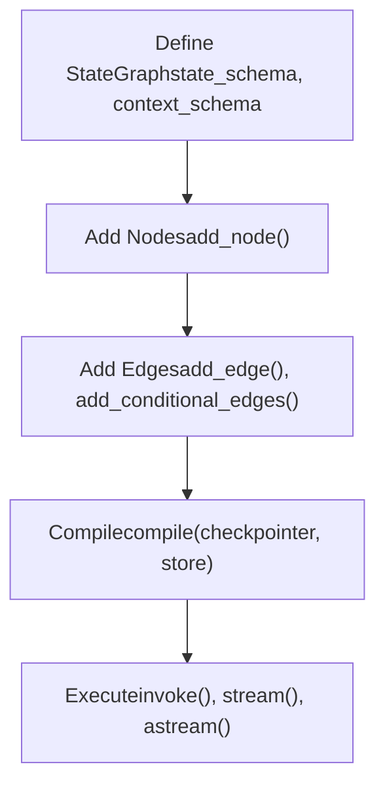
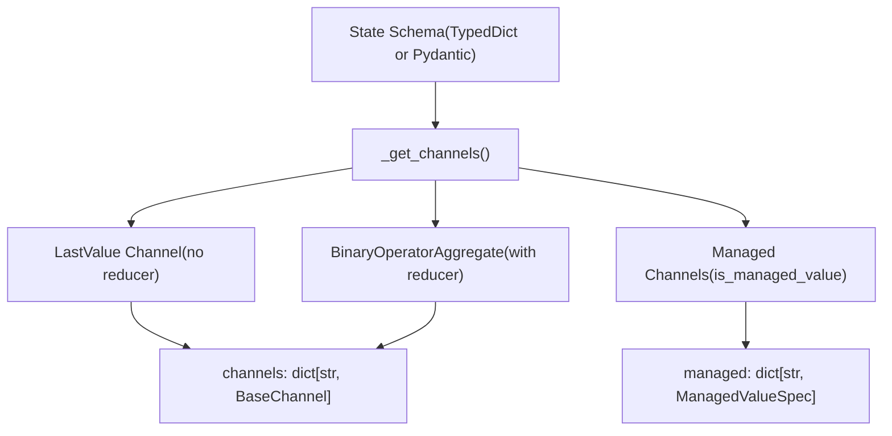
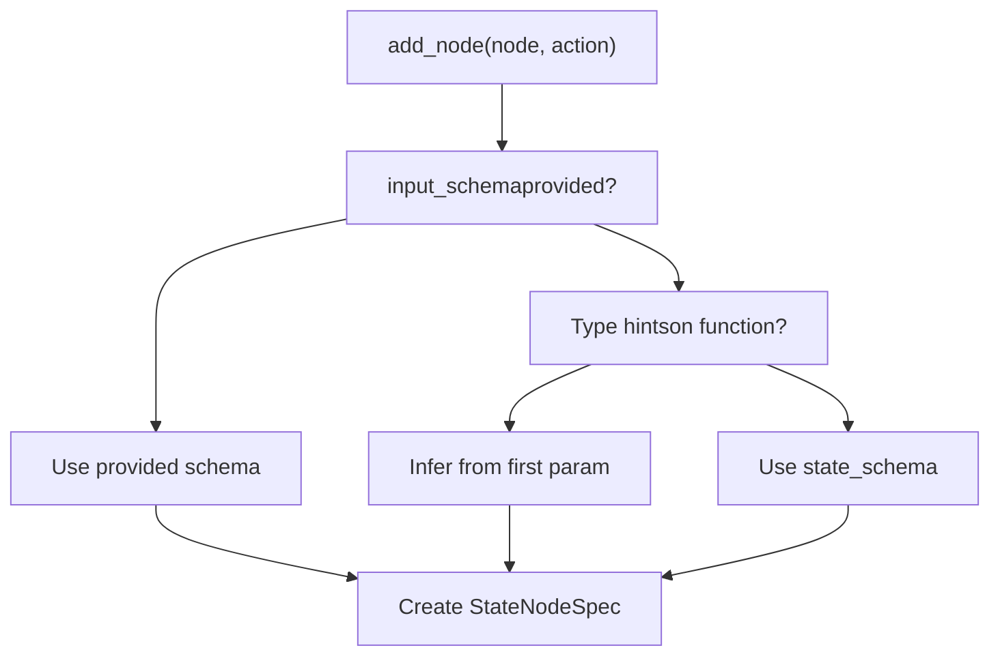
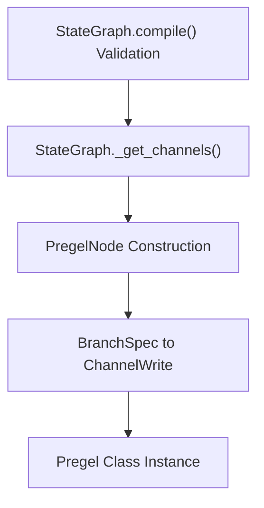
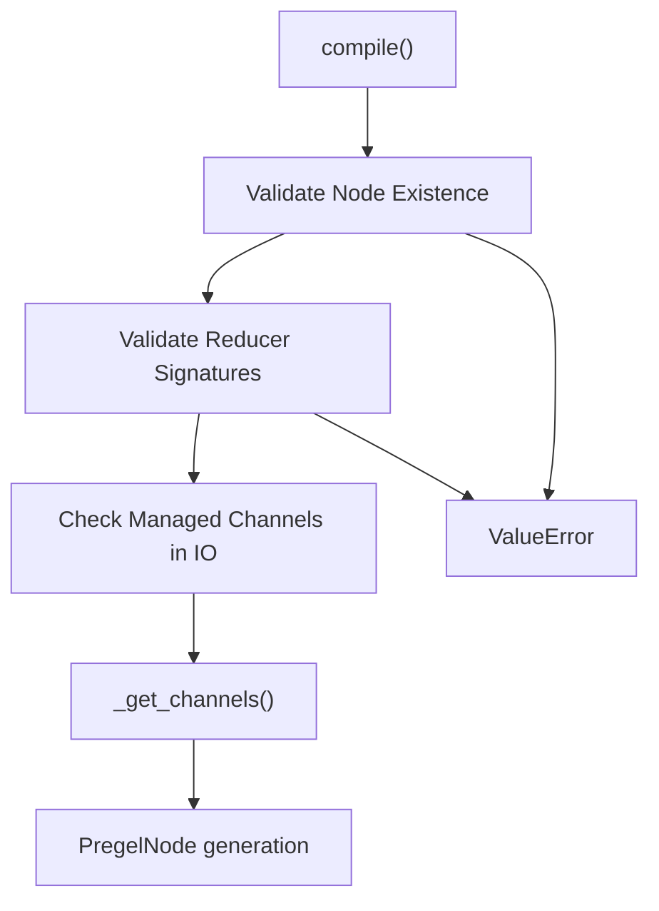

# StateGraph API

相关源文件

-   [libs/langgraph/langgraph/constants.py](https://github.com/langchain-ai/langgraph/blob/1fd51e8f/libs/langgraph/langgraph/constants.py)
-   [libs/langgraph/langgraph/errors.py](https://github.com/langchain-ai/langgraph/blob/1fd51e8f/libs/langgraph/langgraph/errors.py)
-   [libs/langgraph/langgraph/func/\_\_init\_\_.py](https://github.com/langchain-ai/langgraph/blob/1fd51e8f/libs/langgraph/langgraph/func/__init__.py)
-   [libs/langgraph/langgraph/graph/state.py](https://github.com/langchain-ai/langgraph/blob/1fd51e8f/libs/langgraph/langgraph/graph/state.py)
-   [libs/langgraph/langgraph/pregel/\_\_init\_\_.py](https://github.com/langchain-ai/langgraph/blob/1fd51e8f/libs/langgraph/langgraph/pregel/__init__.py)
-   [libs/langgraph/langgraph/pregel/debug.py](https://github.com/langchain-ai/langgraph/blob/1fd51e8f/libs/langgraph/langgraph/pregel/debug.py)
-   [libs/langgraph/langgraph/pregel/types.py](https://github.com/langchain-ai/langgraph/blob/1fd51e8f/libs/langgraph/langgraph/pregel/types.py)
-   [libs/langgraph/langgraph/types.py](https://github.com/langchain-ai/langgraph/blob/1fd51e8f/libs/langgraph/langgraph/types.py)
-   [libs/langgraph/langgraph/utils/\_\_init\_\_.py](https://github.com/langchain-ai/langgraph/blob/1fd51e8f/libs/langgraph/langgraph/utils/__init__.py)
-   [libs/langgraph/langgraph/utils/config.py](https://github.com/langchain-ai/langgraph/blob/1fd51e8f/libs/langgraph/langgraph/utils/config.py)
-   [libs/langgraph/langgraph/utils/runnable.py](https://github.com/langchain-ai/langgraph/blob/1fd51e8f/libs/langgraph/langgraph/utils/runnable.py)
-   [libs/langgraph/tests/\_\_snapshots\_\_/test\_large\_cases.ambr](https://github.com/langchain-ai/langgraph/blob/1fd51e8f/libs/langgraph/tests/__snapshots__/test_large_cases.ambr)
-   [libs/langgraph/tests/test\_checkpoint\_migration.py](https://github.com/langchain-ai/langgraph/blob/1fd51e8f/libs/langgraph/tests/test_checkpoint_migration.py)
-   [libs/langgraph/tests/test\_large\_cases.py](https://github.com/langchain-ai/langgraph/blob/1fd51e8f/libs/langgraph/tests/test_large_cases.py)
-   [libs/langgraph/tests/test\_large\_cases\_async.py](https://github.com/langchain-ai/langgraph/blob/1fd51e8f/libs/langgraph/tests/test_large_cases_async.py)
-   [libs/langgraph/tests/test\_pregel.py](https://github.com/langchain-ai/langgraph/blob/1fd51e8f/libs/langgraph/tests/test_pregel.py)
-   [libs/langgraph/tests/test\_pregel\_async.py](https://github.com/langchain-ai/langgraph/blob/1fd51e8f/libs/langgraph/tests/test_pregel_async.py)

`StateGraph` API 提供了一个声明式接口，用于定义节点通过共享状态进行通信的工作流。每个节点从状态通道读取并写入状态，并可通过可选的 reducer 函数控制更新如何聚合。该 API 是构建 LangGraph 应用程序的主要入口。

关于编译后图的执行信息，请参见 [Pregel 执行引擎](/langchain-ai/langgraph/3.3-pregel-execution-engine)。关于 `Command` 和 `Send` 等控制流机制，请参见 [控制流原语](/langchain-ai/langgraph/3.5-control-flow-primitives)。关于使用 `@task` 和 `@entrypoint` 装饰器的函数式 API 替代方案，请参见 [函数式 API（@task 和 @entrypoint）](/langchain-ai/langgraph/3.2-functional-api-(@task-and-@entrypoint))。

## 概述

`StateGraph` 是一个构建器类，通过以下方式构建图：

1.  定义带可选 reducer 函数的状态模式。
2.  添加用于转换状态的节点（计算单元）。 [libs/langgraph/langgraph/graph/state.py359-572](https://github.com/langchain-ai/langgraph/blob/1fd51e8f/libs/langgraph/langgraph/graph/state.py#L359-L572)
3.  在节点之间添加边（路由）。 [libs/langgraph/langgraph/graph/state.py574-715](https://github.com/langchain-ai/langgraph/blob/1fd51e8f/libs/langgraph/langgraph/graph/state.py#L574-L715)
4.  编译为用于执行的 `CompiledStateGraph`（一个 `Pregel` 实例）。 [libs/langgraph/langgraph/graph/state.py782-1107](https://github.com/langchain-ai/langgraph/blob/1fd51e8f/libs/langgraph/langgraph/graph/state.py#L782-L1107)

图通过从状态模式派生出的通道进行通信，其中每个状态键都映射到一个 `BaseChannel` 实现，用于处理值存储与更新。 [libs/langgraph/langgraph/graph/state.py882-967](https://github.com/langchain-ai/langgraph/blob/1fd51e8f/libs/langgraph/langgraph/graph/state.py#L882-L967)

来源： [libs/langgraph/langgraph/graph/state.py115-184](https://github.com/langchain-ai/langgraph/blob/1fd51e8f/libs/langgraph/langgraph/graph/state.py#L115-L184)

## StateGraph 生命周期

该生命周期涉及从构建器状态过渡到可执行的 `Pregel` 实例。

标题：StateGraph 构建与执行流程


来源： [libs/langgraph/langgraph/graph/state.py115-687](https://github.com/langchain-ai/langgraph/blob/1fd51e8f/libs/langgraph/langgraph/graph/state.py#L115-L687) [libs/langgraph/tests/test\_pregel.py87-121](https://github.com/langchain-ai/langgraph/blob/1fd51e8f/libs/langgraph/tests/test_pregel.py#L87-L121)

## 状态模式与通道

状态模式定义了共享状态的结构以及更新如何聚合。模式中的每个键都映射到一个 `BaseChannel` 实现：

| 通道类型 | 用途 | Reducer 行为 |
| --- | --- | --- |
| `LastValue` | 无 reducer 的单值键 | 替换先前值 [libs/langgraph/langgraph/channels/last\_value.py1-53](https://github.com/langchain-ai/langgraph/blob/1fd51e8f/libs/langgraph/langgraph/channels/last_value.py#L1-L53) |
| `BinaryOperatorAggregate` | 带 reducer 的键（例如 `operator.add`） | 使用 reducer 聚合值 [libs/langgraph/langgraph/channels/binop.py1-46](https://github.com/langchain-ai/langgraph/blob/1fd51e8f/libs/langgraph/langgraph/channels/binop.py#L1-L46) |
| `Topic` | 多写入者通道 | 按序累积更新 [libs/langgraph/langgraph/channels/topic.py1-50](https://github.com/langchain-ai/langgraph/blob/1fd51e8f/libs/langgraph/langgraph/channels/topic.py#L1-L50) |
| `EphemeralValue` | 临时数据 | 不持久化到检查点 [libs/langgraph/langgraph/channels/ephemeral\_value.py1-40](https://github.com/langchain-ai/langgraph/blob/1fd51e8f/libs/langgraph/langgraph/channels/ephemeral_value.py#L1-L40) |
| `UntrackedValue` | 非快照数据 | 从状态快照中排除 [libs/langgraph/langgraph/channels/untracked\_value.py1-47](https://github.com/langchain-ai/langgraph/blob/1fd51e8f/libs/langgraph/langgraph/channels/untracked_value.py#L1-L47) |

标题：状态模式到通道的映射


来源： [libs/langgraph/langgraph/graph/state.py257-288](https://github.com/langchain-ai/langgraph/blob/1fd51e8f/libs/langgraph/langgraph/graph/state.py#L257-L288) [libs/langgraph/langgraph/graph/state.py882-967](https://github.com/langchain-ai/langgraph/blob/1fd51e8f/libs/langgraph/langgraph/graph/state.py#L882-L967)

## 类定义

`StateGraph` 类在编译期间最终定型之前，维护节点、边和分支的内部注册表。

```
class StateGraph(Generic[StateT, ContextT, InputT, OutputT]):    nodes: dict[str, StateNodeSpec[Any, ContextT]]    edges: set[tuple[str, str]]    branches: defaultdict[str, dict[str, BranchSpec]]    channels: dict[str, BaseChannel]    managed: dict[str, ManagedValueSpec]    waiting_edges: set[tuple[tuple[str, ...], str]]        def __init__(        self,        state_schema: type[StateT],        context_schema: type[ContextT] | None = None,        *,        input_schema: type[InputT] | None = None,        output_schema: type[OutputT] | None = None,    )
```
**类型参数：**

-   `StateT`：状态模式（TypedDict 或 Pydantic 模型） [libs/langgraph/langgraph/graph/state.py195](https://github.com/langchain-ai/langgraph/blob/1fd51e8f/libs/langgraph/langgraph/graph/state.py#L195-L195)
-   `ContextT`：运行时上下文模式（不可变的运行范围数据） [libs/langgraph/langgraph/graph/state.py196](https://github.com/langchain-ai/langgraph/blob/1fd51e8f/libs/langgraph/langgraph/graph/state.py#L196-L196)
-   `InputT`：输入模式（默认为 `StateT`） [libs/langgraph/langgraph/graph/state.py197](https://github.com/langchain-ai/langgraph/blob/1fd51e8f/libs/langgraph/langgraph/graph/state.py#L197-L197)
-   `OutputT`：输出模式（默认为 `StateT`） [libs/langgraph/langgraph/graph/state.py198](https://github.com/langchain-ai/langgraph/blob/1fd51e8f/libs/langgraph/langgraph/graph/state.py#L198-L198)

来源： [libs/langgraph/langgraph/graph/state.py115-250](https://github.com/langchain-ai/langgraph/blob/1fd51e8f/libs/langgraph/langgraph/graph/state.py#L115-L250)

## 添加节点

节点是计算单元，以状态作为输入并返回部分状态更新。`add_node` 方法负责将函数或 `Runnable` 对象注册到图的 `nodes` 字典中。 [libs/langgraph/langgraph/graph/state.py359-572](https://github.com/langchain-ai/langgraph/blob/1fd51e8f/libs/langgraph/langgraph/graph/state.py#L359-L572)

**输入模式推断：** 如果节点函数具有类型提示，`StateGraph` 会尝试使用 `get_type_hints` 从第一个参数推断输入模式。 [libs/langgraph/langgraph/graph/state.py441-445](https://github.com/langchain-ai/langgraph/blob/1fd51e8f/libs/langgraph/langgraph/graph/state.py#L441-L445)

标题：节点输入模式解析


来源： [libs/langgraph/langgraph/graph/state.py359-572](https://github.com/langchain-ai/langgraph/blob/1fd51e8f/libs/langgraph/langgraph/graph/state.py#L359-L572) [libs/langgraph/tests/test\_pregel.py255-309](https://github.com/langchain-ai/langgraph/blob/1fd51e8f/libs/langgraph/tests/test_pregel.py#L255-L309)

## 添加边

### 常规边

常规边定义了节点之间的转换。它们存储在 `edges` 集合中；若提供多个源节点，则存储在 `waiting_edges` 中。 [libs/langgraph/langgraph/graph/state.py574-626](https://github.com/langchain-ai/langgraph/blob/1fd51e8f/libs/langgraph/langgraph/graph/state.py#L574-L626)

**边约束：**

-   `START` 和 `END` 是用于标记边界的虚拟节点。 [libs/langgraph/langgraph/constants.py28-31](https://github.com/langchain-ai/langgraph/blob/1fd51e8f/libs/langgraph/langgraph/constants.py#L28-L31)
-   所有被引用的节点都必须存在，这会在 `compile()` 期间验证。 [libs/langgraph/langgraph/graph/state.py804-814](https://github.com/langchain-ai/langgraph/blob/1fd51e8f/libs/langgraph/langgraph/graph/state.py#L804-L814)

### 条件边

条件边可基于状态或节点输出实现动态路由。它们使用 `BranchSpec` 来管理路由逻辑。 [libs/langgraph/langgraph/graph/state.py628-715](https://github.com/langchain-ai/langgraph/blob/1fd51e8f/libs/langgraph/langgraph/graph/state.py#L628-L715)

来源： [libs/langgraph/langgraph/graph/state.py574-715](https://github.com/langchain-ai/langgraph/blob/1fd51e8f/libs/langgraph/langgraph/graph/state.py#L574-L715)

## 编译

`compile` 方法将构建器转换为 `CompiledStateGraph`，后者继承自 `Pregel`。 [libs/langgraph/langgraph/graph/state.py782-1107](https://github.com/langchain-ai/langgraph/blob/1fd51e8f/libs/langgraph/langgraph/graph/state.py#L782-L1107)

标题：Code Entity Space 中的编译阶段


**编译参数：**

| 参数 | 类型 | 描述 |
| --- | --- | --- |
| `checkpointer` | `BaseCheckpointSaver` | 启用状态持久化。 [libs/langgraph/langgraph/graph/state.py793](https://github.com/langchain-ai/langgraph/blob/1fd51e8f/libs/langgraph/langgraph/graph/state.py#L793-L793) |
| `store` | `BaseStore` | 跨线程持久内存。 [libs/langgraph/langgraph/graph/state.py794](https://github.com/langchain-ai/langgraph/blob/1fd51e8f/libs/langgraph/langgraph/graph/state.py#L794-L794) |
| `interrupt_before` | `list[str]` | 在执行前中断的节点。 [libs/langgraph/langgraph/graph/state.py795](https://github.com/langchain-ai/langgraph/blob/1fd51e8f/libs/langgraph/langgraph/graph/state.py#L795-L795) |
| `interrupt_after` | `list[str]` | 在执行后中断的节点。 [libs/langgraph/langgraph/graph/state.py796](https://github.com/langchain-ai/langgraph/blob/1fd51e8f/libs/langgraph/langgraph/graph/state.py#L796-L796) |

来源： [libs/langgraph/langgraph/graph/state.py782-1107](https://github.com/langchain-ai/langgraph/blob/1fd51e8f/libs/langgraph/langgraph/graph/state.py#L782-L1107) [libs/langgraph/tests/test\_pregel.py87-121](https://github.com/langchain-ai/langgraph/blob/1fd51e8f/libs/langgraph/tests/test_pregel.py#L87-L121)

## 状态 Reducer

Reducer 控制对同一状态键的多个更新如何聚合。如果某个键通过函数进行 `Annotated` 标注，`StateGraph` 会创建一个 `BinaryOperatorAggregate` 通道。 [libs/langgraph/langgraph/graph/state.py882-967](https://github.com/langchain-ai/langgraph/blob/1fd51e8f/libs/langgraph/langgraph/graph/state.py#L882-L967)

**特殊 Reducer：**

-   `add_messages`：合并消息列表，并处理 ID 去重。 [libs/langgraph/langgraph/graph/message.py52](https://github.com/langchain-ai/langgraph/blob/1fd51e8f/libs/langgraph/langgraph/graph/message.py#L52-L52)
-   `operator.add`：用于简单累积。 [libs/langgraph/tests/test\_pregel.py186](https://github.com/langchain-ai/langgraph/blob/1fd51e8f/libs/langgraph/tests/test_pregel.py#L186-L186)

标题：Code Entity Space 中的通道选择逻辑

来源： [libs/langgraph/langgraph/graph/state.py882-967](https://github.com/langchain-ai/langgraph/blob/1fd51e8f/libs/langgraph/langgraph/graph/state.py#L882-L967)

## 图验证

验证在 `compile()` 期间进行，以确保结构完整性。 [libs/langgraph/langgraph/graph/state.py782-860](https://github.com/langchain-ai/langgraph/blob/1fd51e8f/libs/langgraph/langgraph/graph/state.py#L782-L860)

标题：编译验证流程


来源： [libs/langgraph/langgraph/graph/state.py782-860](https://github.com/langchain-ai/langgraph/blob/1fd51e8f/libs/langgraph/langgraph/graph/state.py#L782-L860) [libs/langgraph/tests/test\_pregel.py87-121](https://github.com/langchain-ai/langgraph/blob/1fd51e8f/libs/langgraph/tests/test_pregel.py#L87-L121)

## 图可视化

`CompiledStateGraph` 通过 `get_graph()` 方法提供可视化能力，该方法返回一个 `langchain_core.runnables.graph.Graph` 对象。 [libs/langgraph/langgraph/graph/state.py1109-1193](https://github.com/langchain-ai/langgraph/blob/1fd51e8f/libs/langgraph/langgraph/graph/state.py#L1109-L1193)

-   `draw_mermaid()`：生成 Mermaid 字符串。
-   `to_json()`：返回 JSON 表示。

来源： [libs/langgraph/langgraph/graph/state.py1109-1193](https://github.com/langchain-ai/langgraph/blob/1fd51e8f/libs/langgraph/langgraph/graph/state.py#L1109-L1193) [libs/langgraph/tests/test\_pregel.py1105-1129](https://github.com/langchain-ai/langgraph/blob/1fd51e8f/libs/langgraph/tests/test_pregel.py#L1105-L1129)
