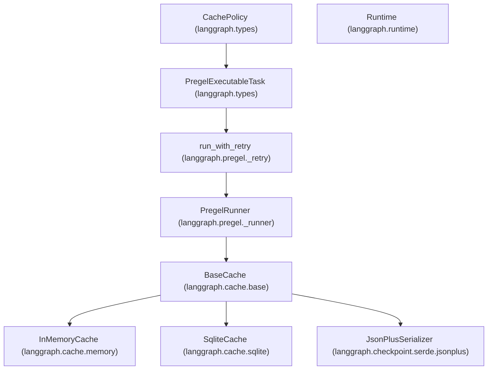

# 缓存系统

相关源文件

-   [libs/checkpoint-sqlite/langgraph/cache/sqlite/__init__.py](https://github.com/langchain-ai/langgraph/blob/1fd51e8f/libs/checkpoint-sqlite/langgraph/cache/sqlite/__init__.py)
-   [libs/checkpoint/langgraph/cache/base/__init__.py](https://github.com/langchain-ai/langgraph/blob/1fd51e8f/libs/checkpoint/langgraph/cache/base/__init__.py)
-   [libs/checkpoint/langgraph/cache/base/py.typed](https://github.com/langchain-ai/langgraph/blob/1fd51e8f/libs/checkpoint/langgraph/cache/base/py.typed)
-   [libs/checkpoint/langgraph/cache/memory/__init__.py](https://github.com/langchain-ai/langgraph/blob/1fd51e8f/libs/checkpoint/langgraph/cache/memory/__init__.py)
-   [libs/langgraph/langgraph/_internal/_config.py](https://github.com/langchain-ai/langgraph/blob/1fd51e8f/libs/langgraph/langgraph/_internal/_config.py)
-   [libs/langgraph/langgraph/_internal/_runnable.py](https://github.com/langchain-ai/langgraph/blob/1fd51e8f/libs/langgraph/langgraph/_internal/_runnable.py)
-   [libs/langgraph/langgraph/_internal/_scratchpad.py](https://github.com/langchain-ai/langgraph/blob/1fd51e8f/libs/langgraph/langgraph/_internal/_scratchpad.py)
-   [libs/langgraph/langgraph/pregel/_algo.py](https://github.com/langchain-ai/langgraph/blob/1fd51e8f/libs/langgraph/langgraph/pregel/_algo.py)
-   [libs/langgraph/langgraph/pregel/_retry.py](https://github.com/langchain-ai/langgraph/blob/1fd51e8f/libs/langgraph/langgraph/pregel/_retry.py)
-   [libs/langgraph/langgraph/pregel/_runner.py](https://github.com/langchain-ai/langgraph/blob/1fd51e8f/libs/langgraph/langgraph/pregel/_runner.py)
-   [libs/langgraph/langgraph/runtime.py](https://github.com/langchain-ai/langgraph/blob/1fd51e8f/libs/langgraph/langgraph/runtime.py)
-   [libs/langgraph/tests/test_channels.py](https://github.com/langchain-ai/langgraph/blob/1fd51e8f/libs/langgraph/tests/test_channels.py)
-   [libs/langgraph/tests/test_managed_values.py](https://github.com/langchain-ai/langgraph/blob/1fd51e8f/libs/langgraph/tests/test_managed_values.py)
-   [libs/langgraph/tests/test_parent_command.py](https://github.com/langchain-ai/langgraph/blob/1fd51e8f/libs/langgraph/tests/test_parent_command.py)
-   [libs/langgraph/tests/test_parent_command_async.py](https://github.com/langchain-ai/langgraph/blob/1fd51e8f/libs/langgraph/tests/test_parent_command_async.py)
-   [libs/langgraph/tests/test_retry.py](https://github.com/langchain-ai/langgraph/blob/1fd51e8f/libs/langgraph/tests/test_retry.py)
-   [libs/langgraph/tests/test_runnable.py](https://github.com/langchain-ai/langgraph/blob/1fd51e8f/libs/langgraph/tests/test_runnable.py)

本页记录 LangGraph 缓存系统。该系统为节点和任务提供结果记忆化（memoization），以避免冗余的重复执行。内容涵盖 `CachePolicy` 配置、`BaseCache` 接口、具体后端实现（Memory、SQLite），以及系统如何与 Pregel 执行循环集成。

---

## 概览

缓存系统允许 `StateGraph` 中的单个节点或函数式 API 中的任务在其输入此前已处理过时跳过执行。这与 checkpointing 不同：后者持久化的是整个图状态，用于恢复与时间旅行。

| 组件 | 职责 |
| --- | --- |
| **`CachePolicy`** | 定义节点应如何缓存（TTL、键生成函数）。 |
| **`BaseCache`** | 缓存存储后端的抽象接口。 |
| **`CacheKey`** | 某次特定执行尝试的唯一标识符（命名空间 + 哈希）。 |
| **`PregelRunner`** | 在执行 tick 期间编排结果的查找与存储。 |

来源： [libs/langgraph/langgraph/types.py74-82](https://github.com/langchain-ai/langgraph/blob/1fd51e8f/libs/langgraph/langgraph/types.py#L74-L82) [libs/checkpoint/langgraph/cache/base/__init__.py15-18](https://github.com/langchain-ai/langgraph/blob/1fd51e8f/libs/checkpoint/langgraph/cache/base/__init__.py#L15-L18)

---

## 缓存配置

### CachePolicy

`CachePolicy` 是一个 dataclass，用于为特定节点或任务配置缓存行为。

| 字段 | 类型 | 描述 |
| --- | --- | --- |
| `key_func` | `Callable` | 根据节点输入生成字符串/字节键的函数。 |
| `ttl` | \`int | None\` |

来源： [libs/langgraph/langgraph/types.py74-82](https://github.com/langchain-ai/langgraph/blob/1fd51e8f/libs/langgraph/langgraph/types.py#L74-L82) [libs/langgraph/langgraph/pregel/_algo.py115-138](https://github.com/langchain-ai/langgraph/blob/1fd51e8f/libs/langgraph/langgraph/pregel/_algo.py#L115-L138)

### CacheKey

执行引擎使用 `CacheKey` 进行查找。它将命名空间（避免不同节点之间冲突）与策略生成的具体键组合在一起。

来源： [libs/langgraph/langgraph/pregel/_algo.py71-72](https://github.com/langchain-ai/langgraph/blob/1fd51e8f/libs/langgraph/langgraph/pregel/_algo.py#L71-L72) [libs/langgraph/langgraph/types.py74-76](https://github.com/langchain-ai/langgraph/blob/1fd51e8f/libs/langgraph/langgraph/types.py#L74-L76)

---

## 缓存后端接口

所有缓存后端都必须实现 `BaseCache` 接口。该接口同时支持同步和异步操作，并使用 `SerializerProtocol`（默认 `JsonPlusSerializer`）进行数据转换。

**核心接口方法：**

-   `get(keys: Sequence[FullKey]) -> dict[FullKey, ValueT]` [libs/checkpoint/langgraph/cache/base/__init__.py25-27](https://github.com/langchain-ai/langgraph/blob/1fd51e8f/libs/checkpoint/langgraph/cache/base/__init__.py#L25-L27)
-   `set(pairs: Mapping[FullKey, tuple[ValueT, int | None]])` [libs/checkpoint/langgraph/cache/base/__init__.py33-35](https://github.com/langchain-ai/langgraph/blob/1fd51e8f/libs/checkpoint/langgraph/cache/base/__init__.py#L33-L35)
-   `clear(namespaces: Sequence[Namespace] | None)` [libs/checkpoint/langgraph/cache/base/__init__.py41-43](https://github.com/langchain-ai/langgraph/blob/1fd51e8f/libs/checkpoint/langgraph/cache/base/__init__.py#L41-L43)

### 实现

#### 1\. InMemoryCache

线程安全、非持久化的缓存，存储在 Python 字典中。它使用 `threading.RLock` 管理并发访问。

-   **文件：** `libs/checkpoint/langgraph/cache/memory/__init__.py` [libs/checkpoint/langgraph/cache/memory/__init__.py11-15](https://github.com/langchain-ai/langgraph/blob/1fd51e8f/libs/checkpoint/langgraph/cache/memory/__init__.py#L11-L15)
-   **存储：** `dict[Namespace, dict[str, tuple[str, bytes, float | None]]]` [libs/checkpoint/langgraph/cache/memory/__init__.py14](https://github.com/langchain-ai/langgraph/blob/1fd51e8f/libs/checkpoint/langgraph/cache/memory/__init__.py#L14-L14)

#### 2\. SqliteCache

使用 SQLite 的持久化文件缓存。它启用 WAL（Write-Ahead Logging）模式以提升并发性。

-   **文件：** `libs/checkpoint-sqlite/langgraph/cache/sqlite/__init__.py` [libs/checkpoint-sqlite/langgraph/cache/sqlite/__init__.py13-15](https://github.com/langchain-ai/langgraph/blob/1fd51e8f/libs/checkpoint-sqlite/langgraph/cache/sqlite/__init__.py#L13-L15)
-   **模式：** 一个 `cache` 表，包含 `ns`、`key`、`expiry`、`encoding` 和 `val` 列。 [libs/checkpoint-sqlite/langgraph/cache/sqlite/__init__.py35-42](https://github.com/langchain-ai/langgraph/blob/1fd51e8f/libs/checkpoint-sqlite/langgraph/cache/sqlite/__init__.py#L35-L42)

---

## 执行集成

缓存直接集成到 `PregelRunner` 和重试逻辑中。在任务执行前，runner 会检查是否存在已缓存的写入。

### 数据流图

下图展示 `PregelRunner` 在单次执行“tick”期间如何与 `BaseCache` 交互。

**Pregel 执行与缓存查找**

> **[Mermaid sequence]**
> *(图表结构无法解析)*

来源： [libs/langgraph/langgraph/pregel/_runner.py164-184](https://github.com/langchain-ai/langgraph/blob/1fd51e8f/libs/langgraph/langgraph/pregel/_runner.py#L164-L184) [libs/langgraph/langgraph/pregel/_retry.py158-187](https://github.com/langchain-ai/langgraph/blob/1fd51e8f/libs/langgraph/langgraph/pregel/_retry.py#L158-L187) [libs/langgraph/langgraph/pregel/_algo.py115-138](https://github.com/langchain-ai/langgraph/blob/1fd51e8f/libs/langgraph/langgraph/pregel/_algo.py#L115-L138)

---

## 代码实体映射

该图将概念层面的“缓存系统”与代码库中的具体类和文件关联起来。

**缓存系统代码映射**

来源： [libs/langgraph/langgraph/types.py74-82](https://github.com/langchain-ai/langgraph/blob/1fd51e8f/libs/langgraph/langgraph/types.py#L74-L82) [libs/langgraph/langgraph/pregel/_runner.py122-140](https://github.com/langchain-ai/langgraph/blob/1fd51e8f/libs/langgraph/langgraph/pregel/_runner.py#L122-L140) [libs/langgraph/langgraph/pregel/_retry.py57-61](https://github.com/langchain-ai/langgraph/blob/1fd51e8f/libs/langgraph/langgraph/pregel/_retry.py#L57-L61) [libs/checkpoint/langgraph/cache/base/__init__.py15-23](https://github.com/langchain-ai/langgraph/blob/1fd51e8f/libs/checkpoint/langgraph/cache/base/__init__.py#L15-L23)

---

## 关键函数与类

### `run_with_retry` 和 `arun_with_retry`

这些函数包装 `PregelExecutableTask` 的执行。它们负责在调用节点底层过程（`task.proc`）之前检查缓存。若存在 `cache_key` 且后端命中，则会把缓存写入直接应用到任务，跳过函数调用。

-   **文件：** `libs/langgraph/langgraph/pregel/_retry.py` [libs/langgraph/langgraph/pregel/_retry.py158-187](https://github.com/langchain-ai/langgraph/blob/1fd51e8f/libs/langgraph/langgraph/pregel/_retry.py#L158-L187)

### `BaseCache.get` / `BaseCache.set`

这些方法处理序列化与 TTL 逻辑。

-   在 `SqliteCache.get` 中，若当前时间戳超过数据库中存储的 `expiry` 值，过期项会被自动清理。 [libs/checkpoint-sqlite/langgraph/cache/sqlite/__init__.py63-68](https://github.com/langchain-ai/langgraph/blob/1fd51e8f/libs/checkpoint-sqlite/langgraph/cache/sqlite/__init__.py#L63-L68)
-   在 `InMemoryCache.get` 中，锁可确保读取和清理过期项是原子操作。 [libs/checkpoint/langgraph/cache/memory/__init__.py19-31](https://github.com/langchain-ai/langgraph/blob/1fd51e8f/libs/checkpoint/langgraph/cache/memory/__init__.py#L19-L31)

### `Runtime` 集成

注入到节点中的 `Runtime` 对象通过 `ExecutionInfo` 提供 `node_attempt`、`node_first_attempt_time` 等元数据。虽然它本身不是缓存，但这些元数据常被自定义 `key_func` 用于判断结果应缓存还是重算。

-   **文件：** `libs/langgraph/langgraph/runtime.py` [libs/langgraph/langgraph/runtime.py17-25](https://github.com/langchain-ai/langgraph/blob/1fd51e8f/libs/langgraph/langgraph/runtime.py#L17-L25)

来源： [libs/langgraph/langgraph/pregel/_retry.py57-187](https://github.com/langchain-ai/langgraph/blob/1fd51e8f/libs/langgraph/langgraph/pregel/_retry.py#L57-L187) [libs/checkpoint-sqlite/langgraph/cache/sqlite/__init__.py46-72](https://github.com/langchain-ai/langgraph/blob/1fd51e8f/libs/checkpoint-sqlite/langgraph/cache/sqlite/__init__.py#L46-L72) [libs/langgraph/langgraph/runtime.py133-135](https://github.com/langchain-ai/langgraph/blob/1fd51e8f/libs/langgraph/langgraph/runtime.py#L133-L135)
