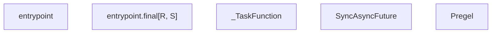
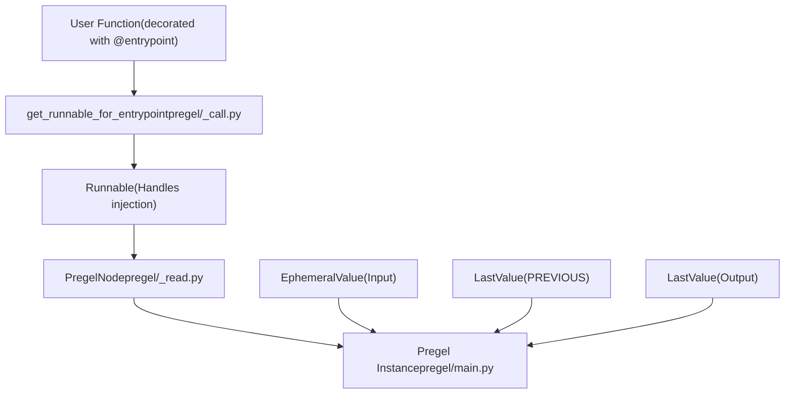

# 函数式 API（@task 和 @entrypoint）

相关源文件

-   [libs/langgraph/langgraph/constants.py](https://github.com/langchain-ai/langgraph/blob/1fd51e8f/libs/langgraph/langgraph/constants.py)
-   [libs/langgraph/langgraph/errors.py](https://github.com/langchain-ai/langgraph/blob/1fd51e8f/libs/langgraph/langgraph/errors.py)
-   [libs/langgraph/langgraph/func/\_\_init\_\_.py](https://github.com/langchain-ai/langgraph/blob/1fd51e8f/libs/langgraph/langgraph/func/__init__.py)
-   [libs/langgraph/langgraph/graph/state.py](https://github.com/langchain-ai/langgraph/blob/1fd51e8f/libs/langgraph/langgraph/graph/state.py)
-   [libs/langgraph/langgraph/pregel/\_\_init\_\_.py](https://github.com/langchain-ai/langgraph/blob/1fd51e8f/libs/langgraph/langgraph/pregel/__init__.py)
-   [libs/langgraph/langgraph/pregel/debug.py](https://github.com/langchain-ai/langgraph/blob/1fd51e8f/libs/langgraph/langgraph/pregel/debug.py)
-   [libs/langgraph/langgraph/pregel/types.py](https://github.com/langchain-ai/langgraph/blob/1fd51e8f/libs/langgraph/langgraph/pregel/types.py)
-   [libs/langgraph/langgraph/types.py](https://github.com/langchain-ai/langgraph/blob/1fd51e8f/libs/langgraph/langgraph/types.py)
-   [libs/langgraph/tests/\_\_snapshots\_\_/test\_large\_cases.ambr](https://github.com/langchain-ai/langgraph/blob/1fd51e8f/libs/langgraph/tests/__snapshots__/test_large_cases.ambr)
-   [libs/langgraph/tests/test\_checkpoint\_migration.py](https://github.com/langchain-ai/langgraph/blob/1fd51e8f/libs/langgraph/tests/test_checkpoint_migration.py)
-   [libs/langgraph/tests/test\_large\_cases.py](https://github.com/langchain-ai/langgraph/blob/1fd51e8f/libs/langgraph/tests/test_large_cases.py)
-   [libs/langgraph/tests/test\_large\_cases\_async.py](https://github.com/langchain-ai/langgraph/blob/1fd51e8f/libs/langgraph/tests/test_large_cases_async.py)
-   [libs/langgraph/tests/test\_pregel.py](https://github.com/langchain-ai/langgraph/blob/1fd51e8f/libs/langgraph/tests/test_pregel.py)
-   [libs/langgraph/tests/test\_pregel\_async.py](https://github.com/langchain-ai/langgraph/blob/1fd51e8f/libs/langgraph/tests/test_pregel_async.py)

本页记录了 `langgraph.func` 中的 `@task` 和 `@entrypoint` 装饰器，它们允许在 Python 中完全以函数式方式组合 LangGraph 工作流，而无需显式构造 `StateGraph`。与 `StateGraph` 一样，这两个装饰器最终都会编译为 `Pregel` 实例——即驱动所有 LangGraph 图的同一核心执行引擎。

关于显式图构建器模式，请参见 [StateGraph API](/langchain-ai/langgraph/3.1-stategraph-api)。关于同时运行两种模型的 Pregel 执行引擎，请参见 [Pregel 执行引擎](/langchain-ai/langgraph/3.3-pregel-execution-engine)。

---

## 概述

这两个装饰器都从 `langgraph.func` 导出 [libs/langgraph/langgraph/func/\_\_init\_\_.py44](https://github.com/langchain-ai/langgraph/blob/1fd51e8f/libs/langgraph/langgraph/func/__init__.py#L44-L44) 它们为底层 Pregel 编排系统提供了函数式接口。

| 装饰器 | 角色 | 返回值 |
| --- | --- | --- |
| `@task` | 工作单元，可作为并发 future 调度 | 包装 `SyncAsyncFuture[T]` 的 `_TaskFunction[P, T]` |
| `@entrypoint` | 顶层工作流；图的入口与出口 | `Pregel` 实例 |

**与 `StateGraph` 的比较：**

| 方面 | `StateGraph` | 函数式 API |
| --- | --- | --- |
| 结构定义 | 显式节点 + 边 | Python 控制流（循环、if/else） |
| 状态 | 类型化字典 / 模式通道 | 函数参数与返回值 |
| 并行性 | 同一 superstep 中的多个节点 | 在 `result()` 前分发多个 `@task` future |
| 默认流模式 | `"updates"` | `"updates"` |
| 编译 | `builder.compile()` | 通过装饰器自动完成 |

来源： [libs/langgraph/langgraph/func/\_\_init\_\_.py44-50](https://github.com/langchain-ai/langgraph/blob/1fd51e8f/libs/langgraph/langgraph/func/__init__.py#L44-L50) [libs/langgraph/langgraph/graph/state.py115-184](https://github.com/langchain-ai/langgraph/blob/1fd51e8f/libs/langgraph/langgraph/graph/state.py#L115-L184)

---

## 关键代码实体

函数式 API 将 Python 函数映射为 `Pregel` 节点和通道。

### 类关系


来源： [libs/langgraph/langgraph/func/\_\_init\_\_.py47-80](https://github.com/langchain-ai/langgraph/blob/1fd51e8f/libs/langgraph/langgraph/func/__init__.py#L47-L80) [libs/langgraph/langgraph/pregel/main.py1-2](https://github.com/langchain-ai/langgraph/blob/1fd51e8f/libs/langgraph/langgraph/pregel/main.py#L1-L2)

---

## `@task` 装饰器

**源码：** [libs/langgraph/langgraph/func/\_\_init\_\_.py116-217](https://github.com/langchain-ai/langgraph/blob/1fd51e8f/libs/langgraph/langgraph/func/__init__.py#L116-L217)

`@task` 将同步或异步函数包装为 `_TaskFunction`。调用被包装函数会在当前 Pregel superstep 内调度执行，并返回一个 `SyncAsyncFuture[T]`。

### 参数

| 参数 | 类型 | 默认值 | 描述 |
| --- | --- | --- | --- |
| `name` | `str | None` | `None` | 覆盖任务名称；默认为 `func.__name__` [libs/langgraph/langgraph/func/\_\_init\_\_.py56-66](https://github.com/langchain-ai/langgraph/blob/1fd51e8f/libs/langgraph/langgraph/func/__init__.py#L56-L66) |
| `retry_policy` | `RetryPolicy | Sequence[RetryPolicy] | None` | `None` | 失败时的重试配置 [libs/langgraph/langgraph/func/\_\_init\_\_.py143](https://github.com/langchain-ai/langgraph/blob/1fd51e8f/libs/langgraph/langgraph/func/__init__.py#L143-L143) |
| `cache_policy` | `CachePolicy | None` | `None` | 结果缓存配置 [libs/langgraph/langgraph/func/\_\_init\_\_.py144](https://github.com/langchain-ai/langgraph/blob/1fd51e8f/libs/langgraph/langgraph/func/__init__.py#L144-L144) |

### 执行与并行性

调用任务会返回一个 future。要并行运行任务，请先分发，再收集结果：

```
# Dispatched in parallelfutures = [my_task(i) for i in range(3)]# Block/Await for resultsresults = [f.result() for f in futures]
```
任务只能从 `@entrypoint` 内部或 `StateGraph` 节点中调用 [libs/langgraph/langgraph/func/\_\_init\_\_.py133-138](https://github.com/langchain-ai/langgraph/blob/1fd51e8f/libs/langgraph/langgraph/func/__init__.py#L133-L138)

---

## `@entrypoint` 装饰器

**源码：** [libs/langgraph/langgraph/func/\_\_init\_\_.py228-492](https://github.com/langchain-ai/langgraph/blob/1fd51e8f/libs/langgraph/langgraph/func/__init__.py#L228-L492)

`@entrypoint` 装饰器会将 Python 函数转换为 `Pregel` 实例。它管理工作流生命周期，包括 checkpointing 和依赖注入。

### 参数

| 参数 | 类型 | 描述 |
| --- | --- | --- |
| `checkpointer` | `Checkpointer` | 启用跨调用持久化 [libs/langgraph/langgraph/func/\_\_init\_\_.py255](https://github.com/langchain-ai/langgraph/blob/1fd51e8f/libs/langgraph/langgraph/func/__init__.py#L255-L255) |
| `store` | `BaseStore | None` | 跨线程键值存储 [libs/langgraph/langgraph/func/\_\_init\_\_.py256](https://github.com/langchain-ai/langgraph/blob/1fd51e8f/libs/langgraph/langgraph/func/__init__.py#L256-L256) |
| `context_schema` | `type[ContextT] | None` | 运行范围上下文的模式 [libs/langgraph/langgraph/func/\_\_init\_\_.py258](https://github.com/langchain-ai/langgraph/blob/1fd51e8f/libs/langgraph/langgraph/func/__init__.py#L258-L258) |

### 运行时注入

Entrypoint 可通过在函数签名中包含以下参数来接收注入参数：

-   `config`：当前运行的 `RunnableConfig`。
-   `previous`：上一次调用的返回值（需要 checkpointer）。
-   `runtime`：一个 `Runtime` 对象，包含 `context`、`store` 和 `stream_writer`。

来源： [libs/langgraph/langgraph/func/\_\_init\_\_.py278-310](https://github.com/langchain-ai/langgraph/blob/1fd51e8f/libs/langgraph/langgraph/func/__init__.py#L278-L310)

---

## 编译为 Pregel

当 `@entrypoint` 应用于函数时，它会通过将函数逻辑映射到 `PregelNode` 并设置适当通道，将其编译为 `Pregel` 对象。

### 编译流程


来源： [libs/langgraph/langgraph/func/\_\_init\_\_.py471-492](https://github.com/langchain-ai/langgraph/blob/1fd51e8f/libs/langgraph/langgraph/func/__init__.py#L471-L492) [libs/langgraph/langgraph/pregel/\_call.py35](https://github.com/langchain-ai/langgraph/blob/1fd51e8f/libs/langgraph/langgraph/pregel/_call.py#L35-L35)

### 任务调度时序

> **[Mermaid sequence]**
> *(图表结构无法解析)*

来源： [libs/langgraph/langgraph/func/\_\_init\_\_.py72-79](https://github.com/langchain-ai/langgraph/blob/1fd51e8f/libs/langgraph/langgraph/func/__init__.py#L72-L79) [libs/langgraph/langgraph/pregel/\_runner.py57-58](https://github.com/langchain-ai/langgraph/blob/1fd51e8f/libs/langgraph/langgraph/pregel/_runner.py#L57-L58)

---

## 状态与持久化

### `entrypoint.final`

要将返回给用户的值与保存到下次调用（`previous` 参数）的值解耦，请使用 `entrypoint.final` [libs/langgraph/langgraph/func/\_\_init\_\_.py430-469](https://github.com/langchain-ai/langgraph/blob/1fd51e8f/libs/langgraph/langgraph/func/__init__.py#L430-L469)

| 字段 | 描述 |
| --- | --- |
| `value` | 由 `invoke()` 或 `stream()` 返回的结果 |
| `save` | 作为 `PREVIOUS` 持久化到检查点的值 |

### 通道布局

函数式 API 使用特定的通道布局来模拟标准函数行为：

| 通道 | 类型 | 角色 |
| --- | --- | --- |
| Input | `EphemeralValue` | 保存当前 superstep 的输入 [libs/langgraph/langgraph/func/\_\_init\_\_.py26](https://github.com/langchain-ai/langgraph/blob/1fd51e8f/libs/langgraph/langgraph/func/__init__.py#L26-L26) |
| `PREVIOUS` | `LastValue` | 跨线程/检查点持久化状态 [libs/langgraph/langgraph/func/\_\_init\_\_.py27](https://github.com/langchain-ai/langgraph/blob/1fd51e8f/libs/langgraph/langgraph/func/__init__.py#L27-L27) |
| Output | `LastValue` | 捕获最终返回值 |

来源： [libs/langgraph/langgraph/func/\_\_init\_\_.py23-28](https://github.com/langchain-ai/langgraph/blob/1fd51e8f/libs/langgraph/langgraph/func/__init__.py#L23-L28) [libs/langgraph/langgraph/channels/ephemeral\_value.py1-5](https://github.com/langchain-ai/langgraph/blob/1fd51e8f/libs/langgraph/langgraph/channels/ephemeral_value.py#L1-L5) [libs/langgraph/langgraph/channels/last\_value.py1-5](https://github.com/langchain-ai/langgraph/blob/1fd51e8f/libs/langgraph/langgraph/channels/last_value.py#L1-L5)

---

## 流式输出与中断

-   **Streaming**：函数式 API 支持所有 `StreamMode` 值。`"values"` 模式会发出最终结果，而 `"updates"` 会发出单个任务结果 [libs/langgraph/langgraph/types.py118-132](https://github.com/langchain-ai/langgraph/blob/1fd51e8f/libs/langgraph/langgraph/types.py#L118-L132)
-   **Interrupts**：可在任务或 entrypoint 内使用 `interrupt()` 函数暂停执行。恢复时会从检查点重放已完成任务 [libs/langgraph/langgraph/types.py79](https://github.com/langchain-ai/langgraph/blob/1fd51e8f/libs/langgraph/langgraph/types.py#L79-L79) [libs/langgraph/langgraph/func/\_\_init\_\_.py312-325](https://github.com/langchain-ai/langgraph/blob/1fd51e8f/libs/langgraph/langgraph/func/__init__.py#L312-L325)

来源： [libs/langgraph/langgraph/types.py79-132](https://github.com/langchain-ai/langgraph/blob/1fd51e8f/libs/langgraph/langgraph/types.py#L79-L132) [libs/langgraph/langgraph/func/\_\_init\_\_.py312-325](https://github.com/langchain-ai/langgraph/blob/1fd51e8f/libs/langgraph/langgraph/func/__init__.py#L312-L325)
