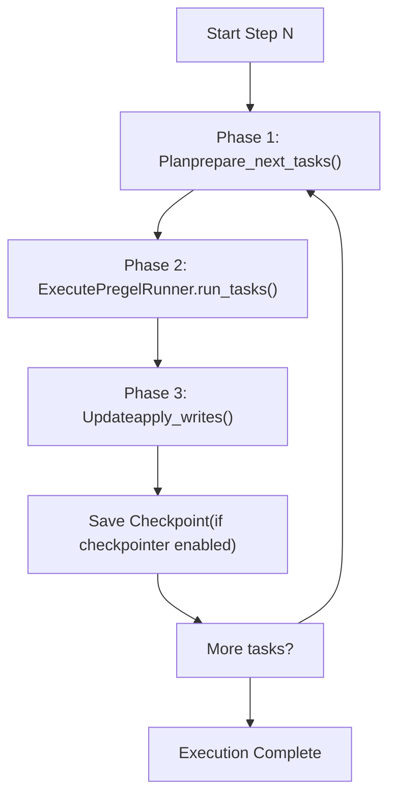
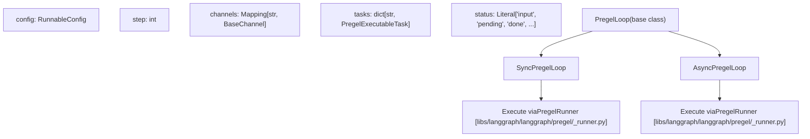
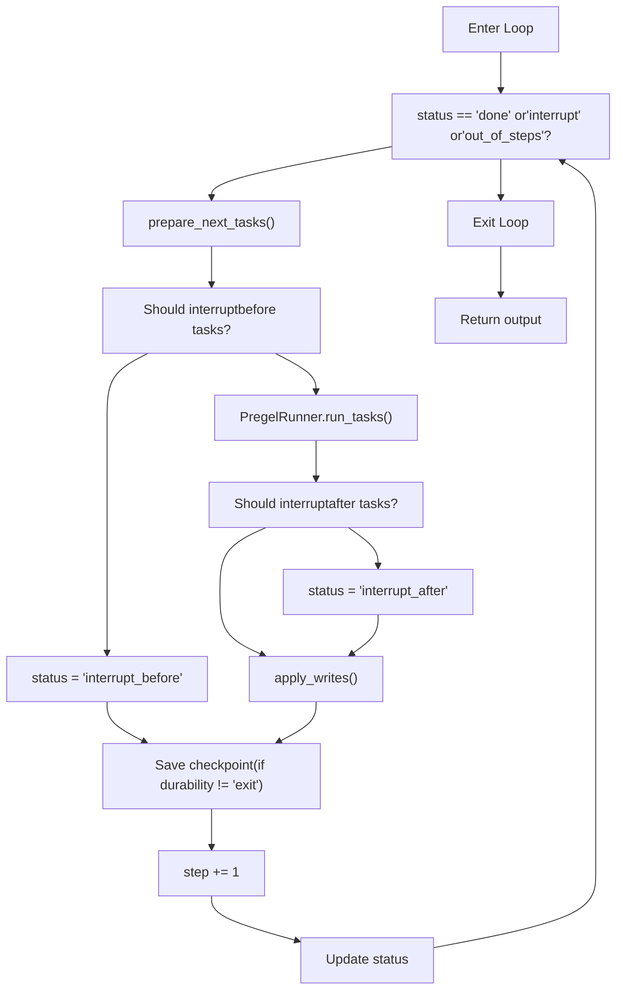
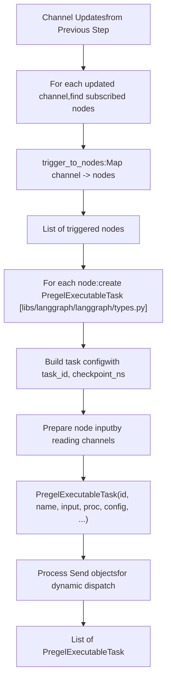
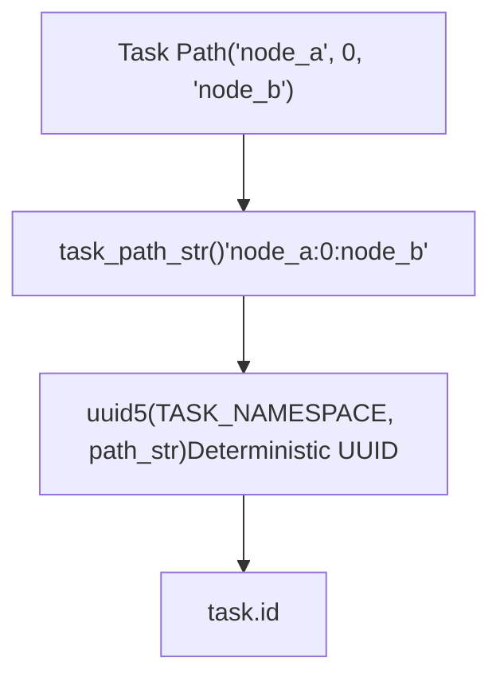
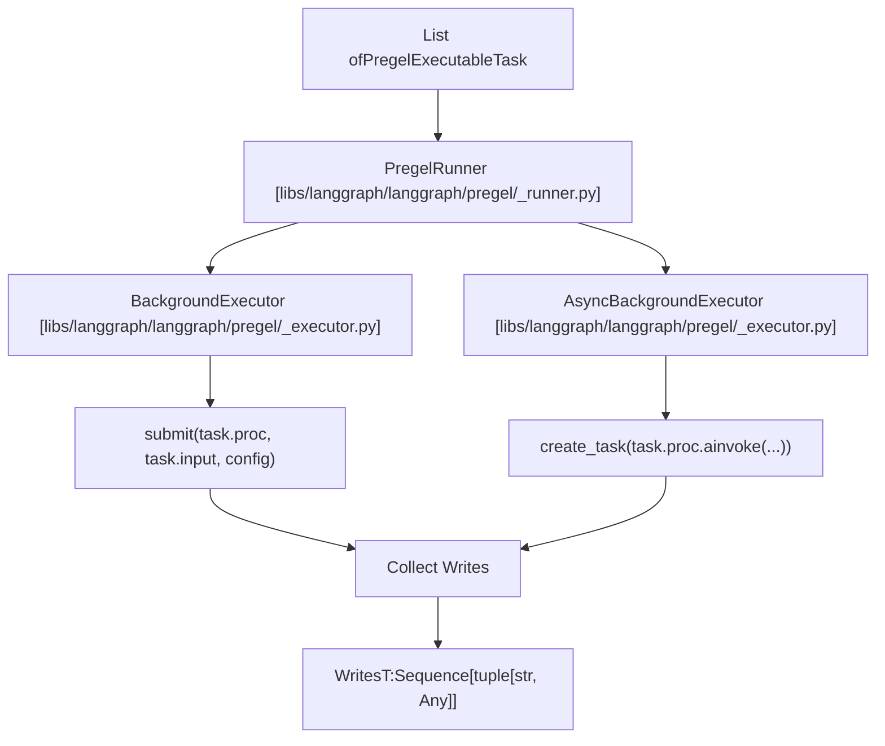
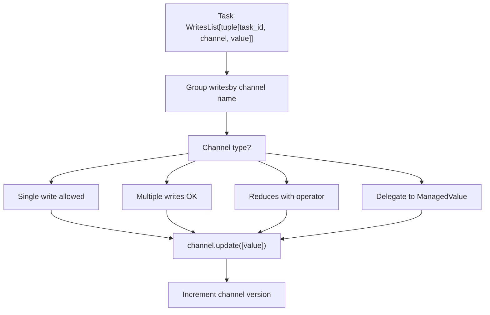

# Pregel 执行引擎

相关源文件

-   [libs/langgraph/langgraph/\_internal/\_config.py](https://github.com/langchain-ai/langgraph/blob/1fd51e8f/libs/langgraph/langgraph/_internal/_config.py)
-   [libs/langgraph/langgraph/\_internal/\_runnable.py](https://github.com/langchain-ai/langgraph/blob/1fd51e8f/libs/langgraph/langgraph/_internal/_runnable.py)
-   [libs/langgraph/langgraph/\_internal/\_scratchpad.py](https://github.com/langchain-ai/langgraph/blob/1fd51e8f/libs/langgraph/langgraph/_internal/_scratchpad.py)
-   [libs/langgraph/langgraph/constants.py](https://github.com/langchain-ai/langgraph/blob/1fd51e8f/libs/langgraph/langgraph/constants.py)
-   [libs/langgraph/langgraph/errors.py](https://github.com/langchain-ai/langgraph/blob/1fd51e8f/libs/langgraph/langgraph/errors.py)
-   [libs/langgraph/langgraph/func/\_\_init\_\_.py](https://github.com/langchain-ai/langgraph/blob/1fd51e8f/libs/langgraph/langgraph/func/__init__.py)
-   [libs/langgraph/langgraph/graph/state.py](https://github.com/langchain-ai/langgraph/blob/1fd51e8f/libs/langgraph/langgraph/graph/state.py)
-   [libs/langgraph/langgraph/pregel/\_\_init\_\_.py](https://github.com/langchain-ai/langgraph/blob/1fd51e8f/libs/langgraph/langgraph/pregel/__init__.py)
-   [libs/langgraph/langgraph/pregel/\_algo.py](https://github.com/langchain-ai/langgraph/blob/1fd51e8f/libs/langgraph/langgraph/pregel/_algo.py)
-   [libs/langgraph/langgraph/pregel/\_retry.py](https://github.com/langchain-ai/langgraph/blob/1fd51e8f/libs/langgraph/langgraph/pregel/_retry.py)
-   [libs/langgraph/langgraph/pregel/\_runner.py](https://github.com/langchain-ai/langgraph/blob/1fd51e8f/libs/langgraph/langgraph/pregel/_runner.py)
-   [libs/langgraph/langgraph/pregel/debug.py](https://github.com/langchain-ai/langgraph/blob/1fd51e8f/libs/langgraph/langgraph/pregel/debug.py)
-   [libs/langgraph/langgraph/pregel/types.py](https://github.com/langchain-ai/langgraph/blob/1fd51e8f/libs/langgraph/langgraph/pregel/types.py)
-   [libs/langgraph/langgraph/runtime.py](https://github.com/langchain-ai/langgraph/blob/1fd51e8f/libs/langgraph/langgraph/runtime.py)
-   [libs/langgraph/langgraph/types.py](https://github.com/langchain-ai/langgraph/blob/1fd51e8f/libs/langgraph/langgraph/types.py)
-   [libs/langgraph/tests/\_\_snapshots\_\_/test\_large\_cases.ambr](https://github.com/langchain-ai/langgraph/blob/1fd51e8f/libs/langgraph/tests/__snapshots__/test_large_cases.ambr)
-   [libs/langgraph/tests/test\_channels.py](https://github.com/langchain-ai/langgraph/blob/1fd51e8f/libs/langgraph/tests/test_channels.py)
-   [libs/langgraph/tests/test\_checkpoint\_migration.py](https://github.com/langchain-ai/langgraph/blob/1fd51e8f/libs/langgraph/tests/test_checkpoint_migration.py)
-   [libs/langgraph/tests/test\_large\_cases.py](https://github.com/langchain-ai/langgraph/blob/1fd51e8f/libs/langgraph/tests/test_large_cases.py)
-   [libs/langgraph/tests/test\_large\_cases\_async.py](https://github.com/langchain-ai/langgraph/blob/1fd51e8f/libs/langgraph/tests/test_large_cases_async.py)
-   [libs/langgraph/tests/test\_managed\_values.py](https://github.com/langchain-ai/langgraph/blob/1fd51e8f/libs/langgraph/tests/test_managed_values.py)
-   [libs/langgraph/tests/test\_parent\_command.py](https://github.com/langchain-ai/langgraph/blob/1fd51e8f/libs/langgraph/tests/test_parent_command.py)
-   [libs/langgraph/tests/test\_parent\_command\_async.py](https://github.com/langchain-ai/langgraph/blob/1fd51e8f/libs/langgraph/tests/test_parent_command_async.py)
-   [libs/langgraph/tests/test\_pregel.py](https://github.com/langchain-ai/langgraph/blob/1fd51e8f/libs/langgraph/tests/test_pregel.py)
-   [libs/langgraph/tests/test\_pregel\_async.py](https://github.com/langchain-ai/langgraph/blob/1fd51e8f/libs/langgraph/tests/test_pregel_async.py)
-   [libs/langgraph/tests/test\_retry.py](https://github.com/langchain-ai/langgraph/blob/1fd51e8f/libs/langgraph/tests/test_retry.py)
-   [libs/langgraph/tests/test\_runnable.py](https://github.com/langchain-ai/langgraph/blob/1fd51e8f/libs/langgraph/tests/test_runnable.py)

Pregel 执行引擎是 LangGraph 中用于编排图执行的核心运行时。它实现了受 Google Pregel 算法启发的 **Bulk Synchronous Parallel (BSP)** 模型，负责节点的逐步执行、任务调度、并行执行以及通过通道进行状态同步。

有关使用 StateGraph API 构建图的信息，请参见 [StateGraph API](/langchain-ai/langgraph/3.1-stategraph-api)。有关函数式 API 的信息，请参见 [Functional API (@task and @entrypoint)](/langchain-ai/langgraph/3.2-functional-api-(@task-and-@entrypoint))。有关状态管理与通道的信息，请参见 [State Management and Channels](/langchain-ai/langgraph/3.4-state-management-and-channels)。

## 目的与范围

本文档涵盖 Pregel 引擎的内部执行机制：

-   Bulk Synchronous Parallel 执行模型
-   `Pregel` 类与 `PregelLoop` 执行生命周期
-   任务调度与准备（`prepare_next_tasks`）
-   通过 `PregelRunner` 进行并行任务执行
-   通道更新与状态同步
-   与 checkpointing 及持久化模式的集成

本文档不涵盖图构建（参见 [StateGraph API](/langchain-ai/langgraph/3.1-stategraph-api)）、控制流原语（参见 [Control Flow Primitives](/langchain-ai/langgraph/3.5-control-flow-primitives)）或中断处理（参见 [Human-in-the-Loop and Interrupts](/langchain-ai/langgraph/3.7-human-in-the-loop-and-interrupts)）。

## 执行模型概览

Pregel 引擎遵循 **Bulk Synchronous Parallel (BSP)** 模型，其中执行按离散步骤推进。每一步由三个阶段组成：

**阶段 1：Plan** —— 通过检查上一步的通道更新来确定要执行哪些节点。`prepare_next_tasks` 函数会选择其触发通道已更新的节点。

**阶段 2：Execute** —— 使用 `PregelRunner` 并行运行所有已选任务。任务并发执行，但在下一步之前无法看到彼此的写入。

**阶段 3：Update** —— 使用 `apply_writes` 将已完成任务的所有写入应用到通道。在一个步骤内更新是原子的。

### Pregel 执行循环图

来源： [libs/langgraph/langgraph/pregel/main.py336-360](https://github.com/langchain-ai/langgraph/blob/1fd51e8f/libs/langgraph/langgraph/pregel/main.py#L336-L360) [libs/langgraph/langgraph/pregel/\_loop.py142-206](https://github.com/langchain-ai/langgraph/blob/1fd51e8f/libs/langgraph/langgraph/pregel/_loop.py#L142-L206)

## 核心组件

### Pregel 类

`Pregel` 类是图执行的主入口。它扩展了 `PregelProtocol` 并管理整体执行生命周期。

**Pregel 系统组件**

```mermaid
flowchart TD
    Nodes["nodes: dict[str, PregelNode]"]
    Channels["channels: dict[str, BaseChannel]"]
    Managed["managed: dict[str, ManagedValueSpec]"]
    InputKeys["input_channels: str | Sequence[str]"]
    OutputKeys["output_channels: str | Sequence[str]"]
    StreamKeys["stream_channels: str | Sequence[str]"]
    Invoke["invoke()"]
    Stream["stream()"]
    AInvoke["ainvoke()"]
    AStream["astream()"]
    GetState["get_state()"]
    UpdateState["update_state()"]
    GetHistory["get_state_history()"]
    Loop["SyncPregelLoop [libs/langgraph/langgraph/pregel/_loop.py]"]
    AsyncLoop["AsyncPregelLoop [libs/langgraph/langgraph/pregel/_loop.py]"]
    Checkpointer["BaseCheckpointSaver"]

    Invoke --> Loop
    Stream --> Loop
    AInvoke --> AsyncLoop
    AStream --> AsyncLoop
    GetState --> Checkpointer
    UpdateState --> Checkpointer
    GetHistory --> Checkpointer
```

关键属性：

-   `nodes` — 节点名称到 `PregelNode` 实例的映射 [libs/langgraph/langgraph/pregel/main.py332-500](https://github.com/langchain-ai/langgraph/blob/1fd51e8f/libs/langgraph/langgraph/pregel/main.py#L332-L500)
-   `channels` — 通道名称到 `BaseChannel` 实例的映射 [libs/langgraph/langgraph/pregel/main.py332-500](https://github.com/langchain-ai/langgraph/blob/1fd51e8f/libs/langgraph/langgraph/pregel/main.py#L332-L500)
-   `input_channels` / `output_channels` — 定义图输入/输出模式 [libs/langgraph/langgraph/pregel/main.py332-500](https://github.com/langchain-ai/langgraph/blob/1fd51e8f/libs/langgraph/langgraph/pregel/main.py#L332-L500)
-   `stream_channels` — 要包含在流式输出中的通道 [libs/langgraph/langgraph/pregel/main.py332-500](https://github.com/langchain-ai/langgraph/blob/1fd51e8f/libs/langgraph/langgraph/pregel/main.py#L332-L500)
-   `checkpointer` — 用于持久化的可选 checkpoint 保存器 [libs/langgraph/langgraph/pregel/main.py332-500](https://github.com/langchain-ai/langgraph/blob/1fd51e8f/libs/langgraph/langgraph/pregel/main.py#L332-L500)
-   `interrupt_before` / `interrupt_after` — 用于中断的节点名称 [libs/langgraph/langgraph/pregel/main.py332-500](https://github.com/langchain-ai/langgraph/blob/1fd51e8f/libs/langgraph/langgraph/pregel/main.py#L332-L500)

来源： [libs/langgraph/langgraph/pregel/main.py332-500](https://github.com/langchain-ai/langgraph/blob/1fd51e8f/libs/langgraph/langgraph/pregel/main.py#L332-L500)

### PregelLoop 与执行变体

执行会根据调用方式委派给 `SyncPregelLoop` 或 `AsyncPregelLoop`。

`PregelLoop` 管理：

-   **步骤跟踪** —— 当前步骤编号与最大步数（`recursion_limit`） [libs/langgraph/langgraph/pregel/\_loop.py142-244](https://github.com/langchain-ai/langgraph/blob/1fd51e8f/libs/langgraph/langgraph/pregel/_loop.py#L142-L244)
-   **通道状态** —— 所有通道中的当前值 [libs/langgraph/langgraph/pregel/\_loop.py142-244](https://github.com/langchain-ai/langgraph/blob/1fd51e8f/libs/langgraph/langgraph/pregel/_loop.py#L142-L244)
-   **任务队列** —— 为当前步骤调度的任务 [libs/langgraph/langgraph/pregel/\_loop.py142-244](https://github.com/langchain-ai/langgraph/blob/1fd51e8f/libs/langgraph/langgraph/pregel/_loop.py#L142-L244)
-   **状态** —— 执行状态（input、pending、done、interrupt 等） [libs/langgraph/langgraph/pregel/\_loop.py142-244](https://github.com/langchain-ai/langgraph/blob/1fd51e8f/libs/langgraph/langgraph/pregel/_loop.py#L142-L244)
-   **Checkpointing** —— 步骤之间加载/保存检查点 [libs/langgraph/langgraph/pregel/\_loop.py142-244](https://github.com/langchain-ai/langgraph/blob/1fd51e8f/libs/langgraph/langgraph/pregel/_loop.py#L142-L244)

来源： [libs/langgraph/langgraph/pregel/\_loop.py142-244](https://github.com/langchain-ai/langgraph/blob/1fd51e8f/libs/langgraph/langgraph/pregel/_loop.py#L142-L244) [libs/langgraph/langgraph/pregel/\_loop.py697-894](https://github.com/langchain-ai/langgraph/blob/1fd51e8f/libs/langgraph/langgraph/pregel/_loop.py#L697-L894) [libs/langgraph/langgraph/pregel/\_loop.py897-1113](https://github.com/langchain-ai/langgraph/blob/1fd51e8f/libs/langgraph/langgraph/pregel/_loop.py#L897-L1113)

## 执行生命周期

### 初始化与上下文进入

当调用 `invoke()` 或 `ainvoke()` 时，会创建一个 `PregelLoop` 实例并以上下文管理器方式进入：

初始化期间：

1.  通过 `checkpointer.get_tuple()` 加载已有检查点（如可用） [libs/langgraph/langgraph/pregel/\_loop.py245-394](https://github.com/langchain-ai/langgraph/blob/1fd51e8f/libs/langgraph/langgraph/pregel/_loop.py#L245-L394)
2.  使用 `channels_from_checkpoint()` 恢复通道状态 [libs/langgraph/langgraph/pregel/\_loop.py245-394](https://github.com/langchain-ai/langgraph/blob/1fd51e8f/libs/langgraph/langgraph/pregel/_loop.py#L245-L394)
3.  通过 `map_input()` 将输入值应用到输入通道 [libs/langgraph/langgraph/pregel/\_loop.py245-394](https://github.com/langchain-ai/langgraph/blob/1fd51e8f/libs/langgraph/langgraph/pregel/_loop.py#L245-L394)
4.  初始化 `step = 0` 和 `status = "input"` [libs/langgraph/langgraph/pregel/\_loop.py245-394](https://github.com/langchain-ai/langgraph/blob/1fd51e8f/libs/langgraph/langgraph/pregel/_loop.py#L245-L394)

来源： [libs/langgraph/langgraph/pregel/\_loop.py245-394](https://github.com/langchain-ai/langgraph/blob/1fd51e8f/libs/langgraph/langgraph/pregel/_loop.py#L245-L394) [libs/langgraph/langgraph/pregel/\_checkpoint.py120-156](https://github.com/langchain-ai/langgraph/blob/1fd51e8f/libs/langgraph/langgraph/pregel/_checkpoint.py#L120-L156)

### 步骤执行循环

主执行循环会一直运行，直到完成、中断或达到步数限制：

来源： [libs/langgraph/langgraph/pregel/\_loop.py697-894](https://github.com/langchain-ai/langgraph/blob/1fd51e8f/libs/langgraph/langgraph/pregel/_loop.py#L697-L894) [libs/langgraph/langgraph/pregel/\_loop.py897-1113](https://github.com/langchain-ai/langgraph/blob/1fd51e8f/libs/langgraph/langgraph/pregel/_loop.py#L897-L1113)

## 任务准备与调度

### prepare\_next\_tasks 函数

`prepare_next_tasks` 函数用于确定当前步骤应执行哪些节点。它检查通道更新与节点订阅关系，构建 `PregelExecutableTask` 对象列表。

关键步骤：

1.  **识别触发器** —— 找出上一步中哪些通道已更新 [libs/langgraph/langgraph/pregel/\_algo.py442-698](https://github.com/langchain-ai/langgraph/blob/1fd51e8f/libs/langgraph/langgraph/pregel/_algo.py#L442-L698)
2.  **映射到节点** —— 使用 `trigger_to_nodes` 映射查找订阅节点 [libs/langgraph/langgraph/pregel/\_algo.py442-698](https://github.com/langchain-ai/langgraph/blob/1fd51e8f/libs/langgraph/langgraph/pregel/_algo.py#L442-L698)
3.  **创建任务** —— 为每个被触发节点构建 `PregelExecutableTask` [libs/langgraph/langgraph/pregel/\_algo.py442-698](https://github.com/langchain-ai/langgraph/blob/1fd51e8f/libs/langgraph/langgraph/pregel/_algo.py#L442-L698)
4.  **准备输入** —— 读取通道值以构造节点输入 [libs/langgraph/langgraph/pregel/\_algo.py442-698](https://github.com/langchain-ai/langgraph/blob/1fd51e8f/libs/langgraph/langgraph/pregel/_algo.py#L442-L698)
5.  **处理 Send** —— 处理用于条件分支的动态 `Send` 对象 [libs/langgraph/langgraph/pregel/\_algo.py442-698](https://github.com/langchain-ai/langgraph/blob/1fd51e8f/libs/langgraph/langgraph/pregel/_algo.py#L442-L698)

**PregelExecutableTask 结构：**

| 字段 | 类型 | 描述 |
| --- | --- | --- |
| `id` | `str` | 唯一任务标识符（基于路径的 UUIDv5） |
| `name` | `str` | 节点名称 |
| `path` | `tuple` | 嵌套图的任务路径 |
| `input` | `Any` | 节点输入数据 |
| `proc` | `Runnable` | 实际执行的节点 |
| `writes` | `deque` | 用于收集写入的队列 |
| `config` | `RunnableConfig` | 带任务上下文的配置 |
| `triggers` | `Sequence[str]` | 触发此任务的通道 |
| `retry_policy` | `Sequence[RetryPolicy]` | 重试配置 |
| `cache_key` | \`CacheKey | None\` |

来源： [libs/langgraph/langgraph/pregel/\_algo.py442-698](https://github.com/langchain-ai/langgraph/blob/1fd51e8f/libs/langgraph/langgraph/pregel/_algo.py#L442-L698) [libs/langgraph/langgraph/types.py537-551](https://github.com/langchain-ai/langgraph/blob/1fd51e8f/libs/langgraph/langgraph/types.py#L537-L551)

### 任务路径与 ID 生成

每个任务都会基于其执行路径分配唯一 ID。这使得跨检查点的跟踪与恢复成为可能。

该路径表示调用栈：

-   根图任务：`('node_name',)` [libs/langgraph/langgraph/pregel/\_algo.py84-93](https://github.com/langchain-ai/langgraph/blob/1fd51e8f/libs/langgraph/langgraph/pregel/_algo.py#L84-L93)
-   子图任务：`('parent_node', task_index, 'child_node')` [libs/langgraph/langgraph/pregel/\_algo.py84-93](https://github.com/langchain-ai/langgraph/blob/1fd51e8f/libs/langgraph/langgraph/pregel/_algo.py#L84-L93)
-   多层嵌套子图：`('root', 0, 'sub1', 1, 'sub2')` [libs/langgraph/langgraph/pregel/\_algo.py84-93](https://github.com/langchain-ai/langgraph/blob/1fd51e8f/libs/langgraph/langgraph/pregel/_algo.py#L84-L93)

来源： [libs/langgraph/langgraph/pregel/\_algo.py84-93](https://github.com/langchain-ai/langgraph/blob/1fd51e8f/libs/langgraph/langgraph/pregel/_algo.py#L84-L93) [libs/langgraph/langgraph/pregel/debug.py34](https://github.com/langchain-ai/langgraph/blob/1fd51e8f/libs/langgraph/langgraph/pregel/debug.py#L34-L34)

## 并行执行

### PregelRunner

`PregelRunner` 使用线程池（`BackgroundExecutor`）或异步并发（`AsyncBackgroundExecutor`）并行执行任务。

**执行流程：**

1.  **提交任务** —— 所有任务同时提交到执行器 [libs/langgraph/langgraph/pregel/\_runner.py1-150](https://github.com/langchain-ai/langgraph/blob/1fd51e8f/libs/langgraph/langgraph/pregel/_runner.py#L1-L150)
2.  **并行执行** —— 任务并发运行（线程或异步） [libs/langgraph/langgraph/pregel/\_runner.py1-150](https://github.com/langchain-ai/langgraph/blob/1fd51e8f/libs/langgraph/langgraph/pregel/_runner.py#L1-L150)
3.  **等待完成** —— 阻塞直至所有任务完成或某个任务失败 [libs/langgraph/langgraph/pregel/\_runner.py1-150](https://github.com/langchain-ai/langgraph/blob/1fd51e8f/libs/langgraph/langgraph/pregel/_runner.py#L1-L150)
4.  **收集写入** —— 从各任务写入队列聚合通道写入 [libs/langgraph/langgraph/pregel/\_runner.py1-150](https://github.com/langchain-ai/langgraph/blob/1fd51e8f/libs/langgraph/langgraph/pregel/_runner.py#L1-L150)
5.  **处理错误** —— 发生错误的任务会产出 `ERROR` 写入 [libs/langgraph/langgraph/pregel/\_runner.py1-150](https://github.com/langchain-ai/langgraph/blob/1fd51e8f/libs/langgraph/langgraph/pregel/_runner.py#L1-L150)

**重试逻辑：** 带有 `retry_policy` 的任务会在匹配异常时，使用带抖动的指数退避自动重试 [libs/langgraph/langgraph/pregel/\_retry.py1-100](https://github.com/langchain-ai/langgraph/blob/1fd51e8f/libs/langgraph/langgraph/pregel/_retry.py#L1-L100)

来源： [libs/langgraph/langgraph/pregel/\_runner.py1-150](https://github.com/langchain-ai/langgraph/blob/1fd51e8f/libs/langgraph/langgraph/pregel/_runner.py#L1-L150) [libs/langgraph/langgraph/pregel/\_executor.py1-200](https://github.com/langchain-ai/langgraph/blob/1fd51e8f/libs/langgraph/langgraph/pregel/_executor.py#L1-L200)

### 写入收集

在执行期间，节点通过注入的写入函数产出写入：

> **[Mermaid sequence]**
> *(图表结构无法解析)*

保留写入键：

-   `__input__` (`INPUT`) — 图的输入 [libs/langgraph/langgraph/\_internal/\_constants.py1-77](https://github.com/langchain-ai/langgraph/blob/1fd51e8f/libs/langgraph/langgraph/_internal/_constants.py#L1-L77)
-   `__interrupt__` (`INTERRUPT`) — 动态中断 [libs/langgraph/langgraph/\_internal/\_constants.py1-77](https://github.com/langchain-ai/langgraph/blob/1fd51e8f/libs/langgraph/langgraph/_internal/_constants.py#L1-L77)
-   `__error__` (`ERROR`) — 任务错误 [libs/langgraph/langgraph/\_internal/\_constants.py1-77](https://github.com/langchain-ai/langgraph/blob/1fd51e8f/libs/langgraph/langgraph/_internal/_constants.py#L1-L77)
-   `__return__` (`RETURN`) — 显式返回值 [libs/langgraph/langgraph/\_internal/\_constants.py1-77](https://github.com/langchain-ai/langgraph/blob/1fd51e8f/libs/langgraph/langgraph/_internal/_constants.py#L1-L77)
-   `__pregel_tasks` (`TASKS`) — 用于动态分支的 Send 对象 [libs/langgraph/langgraph/\_internal/\_constants.py1-77](https://github.com/langchain-ai/langgraph/blob/1fd51e8f/libs/langgraph/langgraph/_internal/_constants.py#L1-L77)

来源： [libs/langgraph/langgraph/\_internal/\_constants.py1-77](https://github.com/langchain-ai/langgraph/blob/1fd51e8f/libs/langgraph/langgraph/_internal/_constants.py#L1-L77) [libs/langgraph/langgraph/pregel/\_write.py1-200](https://github.com/langchain-ai/langgraph/blob/1fd51e8f/libs/langgraph/langgraph/pregel/_write.py#L1-L200)

## 状态更新与通道同步

### apply\_writes 函数

在所有任务完成后，`apply_writes` 会以原子方式将其写入应用到通道：

**写入应用规则：**

1.  **LastValue 通道** —— 每个步骤内每个通道只允许一次写入 [libs/langgraph/langgraph/channels/last\_value.py1-100](https://github.com/langchain-ai/langgraph/blob/1fd51e8f/libs/langgraph/langgraph/channels/last_value.py#L1-L100)
2.  **Topic 通道** —— 将所有写入累积为序列 [libs/langgraph/langgraph/channels/topic.py1-100](https://github.com/langchain-ai/langgraph/blob/1fd51e8f/libs/langgraph/langgraph/channels/topic.py#L1-L100)
3.  **BinaryOperatorAggregate** —— 使用配置的运算符归约多个写入 [libs/langgraph/langgraph/channels/binop.py1-100](https://github.com/langchain-ai/langgraph/blob/1fd51e8f/libs/langgraph/langgraph/channels/binop.py#L1-L100)

来源： [libs/langgraph/langgraph/pregel/\_algo.py324-440](https://github.com/langchain-ai/langgraph/blob/1fd51e8f/libs/langgraph/langgraph/pregel/_algo.py#L324-L440) [libs/langgraph/langgraph/channels/last\_value.py1-100](https://github.com/langchain-ai/langgraph/blob/1fd51e8f/libs/langgraph/langgraph/channels/last_value.py#L1-L100) [libs/langgraph/langgraph/channels/binop.py1-100](https://github.com/langchain-ai/langgraph/blob/1fd51e8f/libs/langgraph/langgraph/channels/binop.py#L1-L100)

### 检查点保存

写入应用后，会基于 `Durability` 模式保存检查点 [libs/langgraph/langgraph/types.py85-91](https://github.com/langchain-ai/langgraph/blob/1fd51e8f/libs/langgraph/langgraph/types.py#L85-L91)：

| 模式 | 行为 | 用例 |
| --- | --- | --- |
| `sync` | 每一步后保存完整检查点 | 最高安全性，速度较慢 |
| `async` | 异步保存写入，完成时保存检查点 | 平衡安全与速度 |
| `exit` | 仅在图退出时保存检查点 | 最高速度，安全性较低 |

来源： [libs/langgraph/langgraph/pregel/\_loop.py395-550](https://github.com/langchain-ai/langgraph/blob/1fd51e8f/libs/langgraph/langgraph/pregel/_loop.py#L395-L550) [libs/langgraph/langgraph/pregel/\_checkpoint.py1-156](https://github.com/langchain-ai/langgraph/blob/1fd51e8f/libs/langgraph/langgraph/pregel/_checkpoint.py#L1-L156) [libs/langgraph/langgraph/types.py85-91](https://github.com/langchain-ai/langgraph/blob/1fd51e8f/libs/langgraph/langgraph/types.py#L85-L91)

## 集成点

### 中断与 Human-in-the-Loop

Pregel 循环会在任务执行前后检查中断 [libs/langgraph/langgraph/pregel/\_loop.py750-850](https://github.com/langchain-ai/langgraph/blob/1fd51e8f/libs/langgraph/langgraph/pregel/_loop.py#L750-L850) 当发生中断时，执行会暂停，并通过 checkpointer 保存当前状态。

来源： [libs/langgraph/langgraph/pregel/\_loop.py750-850](https://github.com/langchain-ai/langgraph/blob/1fd51e8f/libs/langgraph/langgraph/pregel/_loop.py#L750-L850) [libs/langgraph/langgraph/pregel/\_algo.py223-267](https://github.com/langchain-ai/langgraph/blob/1fd51e8f/libs/langgraph/langgraph/pregel/_algo.py#L223-L267)

### 子图

当节点是一个已编译图（子图）时，Pregel 引擎会创建嵌套的 `checkpoint_ns`（例如 `parent_node:0:child_node`），并将 checkpointer 传递给子图 [libs/langgraph/langgraph/pregel/\_loop.py550-650](https://github.com/langchain-ai/langgraph/blob/1fd51e8f/libs/langgraph/langgraph/pregel/_loop.py#L550-L650)

来源： [libs/langgraph/langgraph/pregel/\_loop.py550-650](https://github.com/langchain-ai/langgraph/blob/1fd51e8f/libs/langgraph/langgraph/pregel/_loop.py#L550-L650) [libs/langgraph/langgraph/\_internal/\_constants.py36-59](https://github.com/langchain-ai/langgraph/blob/1fd51e8f/libs/langgraph/langgraph/_internal/_constants.py#L36-L59)

### 流式输出

Pregel 循环通过 `StreamProtocol` 发出事件，支持多种流式模式（`values`、`updates`、`tasks`、`checkpoints`、`debug`、`messages`、`custom`） [libs/langgraph/langgraph/types.py118-353](https://github.com/langchain-ai/langgraph/blob/1fd51e8f/libs/langgraph/langgraph/types.py#L118-L353)

来源： [libs/langgraph/langgraph/pregel/\_loop.py650-750](https://github.com/langchain-ai/langgraph/blob/1fd51e8f/libs/langgraph/langgraph/pregel/_loop.py#L650-L750) [libs/langgraph/langgraph/types.py118-353](https://github.com/langchain-ai/langgraph/blob/1fd51e8f/libs/langgraph/langgraph/types.py#L118-L353)

## 配置与自定义

### 运行时配置

执行行为由 `RunnableConfig` 键控制，例如 `recursion_limit` 与 `configurable.thread_id` [libs/langgraph/langgraph/pregel/\_loop.py209-244](https://github.com/langchain-ai/langgraph/blob/1fd51e8f/libs/langgraph/langgraph/pregel/_loop.py#L209-L244)

### 节点配置

各个节点会封装为 `PregelNode`，其定义了节点的 `channels`、`triggers` 和 `retry_policy` [libs/langgraph/langgraph/pregel/main.py168-330](https://github.com/langchain-ai/langgraph/blob/1fd51e8f/libs/langgraph/langgraph/pregel/main.py#L168-L330)

来源： [libs/langgraph/langgraph/pregel/main.py1-1500](https://github.com/langchain-ai/langgraph/blob/1fd51e8f/libs/langgraph/langgraph/pregel/main.py#L1-L1500) [libs/langgraph/langgraph/pregel/\_loop.py1-1113](https://github.com/langchain-ai/langgraph/blob/1fd51e8f/libs/langgraph/langgraph/pregel/_loop.py#L1-L1113) [libs/langgraph/langgraph/pregel/\_algo.py1-700](https://github.com/langchain-ai/langgraph/blob/1fd51e8f/libs/langgraph/langgraph/pregel/_algo.py#L1-L700)
