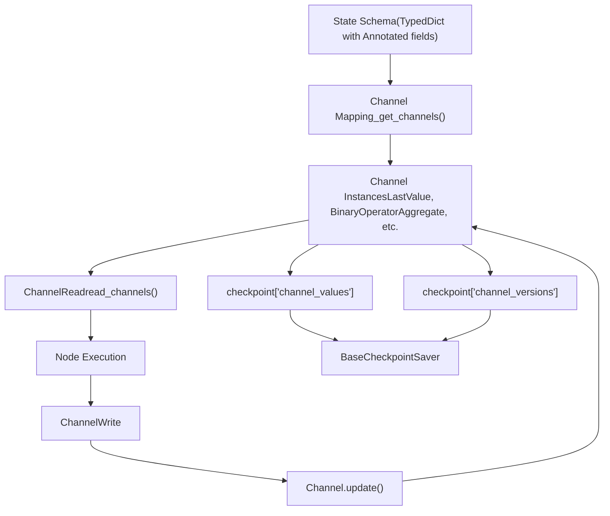
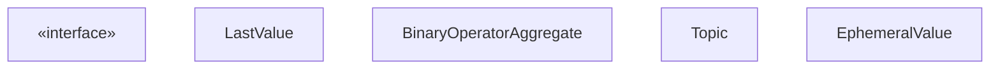
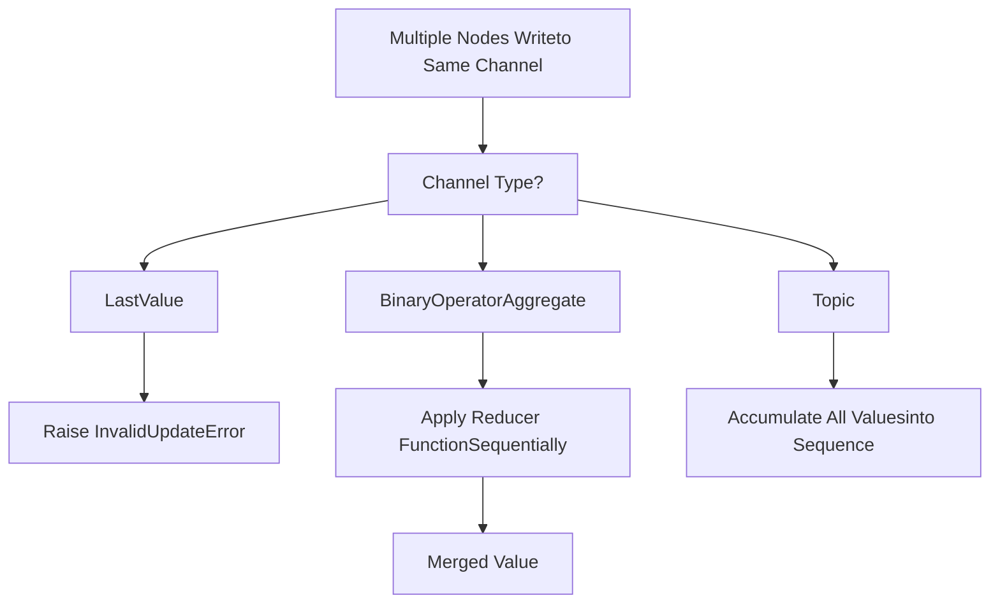

# 状态管理与通道

相关源文件

-   [libs/langgraph/langgraph/channels/\_\_init\_\_.py](https://github.com/langchain-ai/langgraph/blob/1fd51e8f/libs/langgraph/langgraph/channels/__init__.py)
-   [libs/langgraph/langgraph/channels/any\_value.py](https://github.com/langchain-ai/langgraph/blob/1fd51e8f/libs/langgraph/langgraph/channels/any_value.py)
-   [libs/langgraph/langgraph/channels/base.py](https://github.com/langchain-ai/langgraph/blob/1fd51e8f/libs/langgraph/langgraph/channels/base.py)
-   [libs/langgraph/langgraph/channels/binop.py](https://github.com/langchain-ai/langgraph/blob/1fd51e8f/libs/langgraph/langgraph/channels/binop.py)
-   [libs/langgraph/langgraph/channels/ephemeral\_value.py](https://github.com/langchain-ai/langgraph/blob/1fd51e8f/libs/langgraph/langgraph/channels/ephemeral_value.py)
-   [libs/langgraph/langgraph/channels/last\_value.py](https://github.com/langchain-ai/langgraph/blob/1fd51e8f/libs/langgraph/langgraph/channels/last_value.py)
-   [libs/langgraph/langgraph/channels/named\_barrier\_value.py](https://github.com/langchain-ai/langgraph/blob/1fd51e8f/libs/langgraph/langgraph/channels/named_barrier_value.py)
-   [libs/langgraph/langgraph/channels/topic.py](https://github.com/langchain-ai/langgraph/blob/1fd51e8f/libs/langgraph/langgraph/channels/topic.py)
-   [libs/langgraph/langgraph/channels/untracked\_value.py](https://github.com/langchain-ai/langgraph/blob/1fd51e8f/libs/langgraph/langgraph/channels/untracked_value.py)
-   [libs/langgraph/langgraph/constants.py](https://github.com/langchain-ai/langgraph/blob/1fd51e8f/libs/langgraph/langgraph/constants.py)
-   [libs/langgraph/langgraph/errors.py](https://github.com/langchain-ai/langgraph/blob/1fd51e8f/libs/langgraph/langgraph/errors.py)
-   [libs/langgraph/langgraph/func/\_\_init\_\_.py](https://github.com/langchain-ai/langgraph/blob/1fd51e8f/libs/langgraph/langgraph/func/__init__.py)
-   [libs/langgraph/langgraph/graph/state.py](https://github.com/langchain-ai/langgraph/blob/1fd51e8f/libs/langgraph/langgraph/graph/state.py)
-   [libs/langgraph/langgraph/pregel/\_\_init\_\_.py](https://github.com/langchain-ai/langgraph/blob/1fd51e8f/libs/langgraph/langgraph/pregel/__init__.py)
-   [libs/langgraph/langgraph/pregel/debug.py](https://github.com/langchain-ai/langgraph/blob/1fd51e8f/libs/langgraph/langgraph/pregel/debug.py)
-   [libs/langgraph/langgraph/pregel/types.py](https://github.com/langchain-ai/langgraph/blob/1fd51e8f/libs/langgraph/langgraph/pregel/types.py)
-   [libs/langgraph/langgraph/types.py](https://github.com/langchain-ai/langgraph/blob/1fd51e8f/libs/langgraph/langgraph/types.py)
-   [libs/langgraph/tests/\_\_snapshots\_\_/test\_large\_cases.ambr](https://github.com/langchain-ai/langgraph/blob/1fd51e8f/libs/langgraph/tests/__snapshots__/test_large_cases.ambr)
-   [libs/langgraph/tests/agents.py](https://github.com/langchain-ai/langgraph/blob/1fd51e8f/libs/langgraph/tests/agents.py)
-   [libs/langgraph/tests/test\_checkpoint\_migration.py](https://github.com/langchain-ai/langgraph/blob/1fd51e8f/libs/langgraph/tests/test_checkpoint_migration.py)
-   [libs/langgraph/tests/test\_large\_cases.py](https://github.com/langchain-ai/langgraph/blob/1fd51e8f/libs/langgraph/tests/test_large_cases.py)
-   [libs/langgraph/tests/test\_large\_cases\_async.py](https://github.com/langchain-ai/langgraph/blob/1fd51e8f/libs/langgraph/tests/test_large_cases_async.py)
-   [libs/langgraph/tests/test\_pregel.py](https://github.com/langchain-ai/langgraph/blob/1fd51e8f/libs/langgraph/tests/test_pregel.py)
-   [libs/langgraph/tests/test\_pregel\_async.py](https://github.com/langchain-ai/langgraph/blob/1fd51e8f/libs/langgraph/tests/test_pregel_async.py)
-   [libs/langgraph/tests/test\_pydantic.py](https://github.com/langchain-ai/langgraph/blob/1fd51e8f/libs/langgraph/tests/test_pydantic.py)
-   [libs/langgraph/tests/test\_state.py](https://github.com/langchain-ai/langgraph/blob/1fd51e8f/libs/langgraph/tests/test_state.py)
-   [libs/langgraph/tests/test\_utils.py](https://github.com/langchain-ai/langgraph/blob/1fd51e8f/libs/langgraph/tests/test_utils.py)

## 目的与范围

本文档描述 LangGraph 的通道系统，它为图提供核心状态管理原语。通道控制状态如何在节点之间流动、如何解析并发更新，以及状态如何在图执行之间持久化。

有关使用通道的 StateGraph API 信息，请参见 [StateGraph API](/langchain-ai/langgraph/3.1-stategraph-api)。有关 checkpointing 与状态持久化的信息，请参见 [Checkpointing Architecture](/langchain-ai/langgraph/4.1-checkpointing-architecture)。有关与状态交互的控制流原语，请参见 [Control Flow Primitives](/langchain-ai/langgraph/3.5-control-flow-primitives)。

## 通道系统概览

通道是 LangGraph 中状态管理的基础抽象。图状态模式中的每个键都映射到一个通道，该通道决定该键值如何读取、更新和持久化。

### 执行架构中的通道

下图说明了在模式中定义的状态如何转换为运行时 `BaseChannel` 实例，并由 `Pregel` 循环管理。


**来源：** [libs/langgraph/langgraph/graph/state.py186-191](https://github.com/langchain-ai/langgraph/blob/1fd51e8f/libs/langgraph/langgraph/graph/state.py#L186-L191) [libs/langgraph/langgraph/pregel/debug.py24](https://github.com/langchain-ai/langgraph/blob/1fd51e8f/libs/langgraph/langgraph/pregel/debug.py#L24-L24) [libs/langgraph/langgraph/pregel/\_read.py1-200](https://github.com/langchain-ai/langgraph/blob/1fd51e8f/libs/langgraph/langgraph/pregel/_read.py#L1-L200) [libs/langgraph/langgraph/pregel/\_write.py1-200](https://github.com/langchain-ai/langgraph/blob/1fd51e8f/libs/langgraph/langgraph/pregel/_write.py#L1-L200)

### 通道接口

所有通道都实现 `BaseChannel` 接口，该接口定义了状态在单个 superstep 内以及跨检查点的生命周期。

-   **`update(values)`**：将一个或多个更新应用到通道 [libs/langgraph/langgraph/channels/base.py1-50](https://github.com/langchain-ai/langgraph/blob/1fd51e8f/libs/langgraph/langgraph/channels/base.py#L1-L50)
-   **`get()`**：获取当前通道值 [libs/langgraph/langgraph/channels/base.py1-50](https://github.com/langchain-ai/langgraph/blob/1fd51e8f/libs/langgraph/langgraph/channels/base.py#L1-L50)
-   **`checkpoint()`**：返回用于持久化的可序列化表示 [libs/langgraph/langgraph/channels/base.py1-50](https://github.com/langchain-ai/langgraph/blob/1fd51e8f/libs/langgraph/langgraph/channels/base.py#L1-L50)
-   **`from_checkpoint(checkpoint)`**：从检查点恢复通道 [libs/langgraph/langgraph/channels/base.py1-50](https://github.com/langchain-ai/langgraph/blob/1fd51e8f/libs/langgraph/langgraph/channels/base.py#L1-L50)


**来源：** [libs/langgraph/langgraph/channels/base.py1-50](https://github.com/langchain-ai/langgraph/blob/1fd51e8f/libs/langgraph/langgraph/channels/base.py#L1-L50) [libs/langgraph/langgraph/channels/last\_value.py1-100](https://github.com/langchain-ai/langgraph/blob/1fd51e8f/libs/langgraph/langgraph/channels/last_value.py#L1-L100) [libs/langgraph/langgraph/channels/binop.py1-150](https://github.com/langchain-ai/langgraph/blob/1fd51e8f/libs/langgraph/langgraph/channels/binop.py#L1-L150) [libs/langgraph/langgraph/channels/topic.py1-100](https://github.com/langchain-ai/langgraph/blob/1fd51e8f/libs/langgraph/langgraph/channels/topic.py#L1-L100) [libs/langgraph/langgraph/channels/ephemeral\_value.py1-80](https://github.com/langchain-ai/langgraph/blob/1fd51e8f/libs/langgraph/langgraph/channels/ephemeral_value.py#L1-L80)

## 从状态模式到通道的映射

`StateGraph` 在编译过程中会自动将状态模式转换为通道。它会分析类型提示，以确定每个字段应使用哪种通道类型 [libs/langgraph/langgraph/graph/state.py1060-1130](https://github.com/langchain-ai/langgraph/blob/1fd51e8f/libs/langgraph/langgraph/graph/state.py#L1060-L1130)

### 映射规则

| 状态模式类型 | 通道类型 | 行为 |
| --- | --- | --- |
| `str`, `int`, `SomeClass` | `LastValue` | 每次更新时替换值。 |
| `Annotated[T, reducer]` | `BinaryOperatorAggregate` | 应用 reducer 函数来合并更新。 |
| `list`（无注解） | `LastValue` | 替换整个列表。 |
| `Annotated[list, operator.add]` | `BinaryOperatorAggregate` | 追加到列表。 |
| `Annotated[dict, operator.or_]` | `BinaryOperatorAggregate` | 合并字典。 |

### 示例：模式到通道转换

```
# State schema definitionclass State(TypedDict):    name: str                                    # → LastValue(str)    age: int                                     # → LastValue(int)    messages: Annotated[list, operator.add]      # → BinaryOperatorAggregate(list, operator.add)    metadata: Annotated[dict, operator.or_]      # → BinaryOperatorAggregate(dict, operator.or_)
```
该转换逻辑位于 `_get_channels()` 与 `get_type_hints()` [libs/langgraph/langgraph/graph/state.py23](https://github.com/langchain-ai/langgraph/blob/1fd51e8f/libs/langgraph/langgraph/graph/state.py#L23-L23) [libs/langgraph/langgraph/graph/state.py1060-1130](https://github.com/langchain-ai/langgraph/blob/1fd51e8f/libs/langgraph/langgraph/graph/state.py#L1060-L1130)

**来源：** [libs/langgraph/langgraph/graph/state.py1060-1130](https://github.com/langchain-ai/langgraph/blob/1fd51e8f/libs/langgraph/langgraph/graph/state.py#L1060-L1130) [libs/langgraph/tests/test\_pregel.py86-106](https://github.com/langchain-ai/langgraph/blob/1fd51e8f/libs/langgraph/tests/test_pregel.py#L86-L106) [libs/langgraph/tests/test\_state.py138-163](https://github.com/langchain-ai/langgraph/blob/1fd51e8f/libs/langgraph/tests/test_state.py#L138-L163)

## 通道类型

### LastValue

`LastValue` 存储单个值，并在每次更新时完全替换该值 [libs/langgraph/langgraph/channels/last\_value.py1-100](https://github.com/langchain-ai/langgraph/blob/1fd51e8f/libs/langgraph/langgraph/channels/last_value.py#L1-L100) 如果多个节点在单一步骤中尝试写入同一个 `LastValue` 通道，它会抛出 `InvalidUpdateError` [libs/langgraph/tests/test\_pregel.py119-121](https://github.com/langchain-ai/langgraph/blob/1fd51e8f/libs/langgraph/tests/test_pregel.py#L119-L121)

**来源：** [libs/langgraph/langgraph/channels/last\_value.py1-100](https://github.com/langchain-ai/langgraph/blob/1fd51e8f/libs/langgraph/langgraph/channels/last_value.py#L1-L100) [libs/langgraph/tests/test\_pregel.py725-755](https://github.com/langchain-ai/langgraph/blob/1fd51e8f/libs/langgraph/tests/test_pregel.py#L725-L755)

### BinaryOperatorAggregate（Reducers）

`BinaryOperatorAggregate` 应用 reducer 函数来合并多个更新。这是处理对同一通道并发写入的主要机制 [libs/langgraph/langgraph/channels/binop.py1-150](https://github.com/langchain-ai/langgraph/blob/1fd51e8f/libs/langgraph/langgraph/channels/binop.py#L1-L150)

常见 reducer 包括用于列表拼接的 `operator.add`，以及用于消息历史管理的 `add_messages` [libs/langgraph/langgraph/graph/message.py52](https://github.com/langchain-ai/langgraph/blob/1fd51e8f/libs/langgraph/langgraph/graph/message.py#L52-L52)

**来源：** [libs/langgraph/langgraph/graph/state.py99-105](https://github.com/langchain-ai/langgraph/blob/1fd51e8f/libs/langgraph/langgraph/graph/state.py#L99-L105) [libs/langgraph/langgraph/channels/binop.py1-150](https://github.com/langchain-ai/langgraph/blob/1fd51e8f/libs/langgraph/langgraph/channels/binop.py#L1-L150) [libs/langgraph/tests/test\_pregel.py556-567](https://github.com/langchain-ai/langgraph/blob/1fd51e8f/libs/langgraph/tests/test_pregel.py#L556-L567)

### Topic

`Topic` 会将值累积为一个序列，而不应用 reducer。与 `BinaryOperatorAggregate` 不同，它将每次更新作为列表中的独立项存储 [libs/langgraph/langgraph/channels/topic.py1-100](https://github.com/langchain-ai/langgraph/blob/1fd51e8f/libs/langgraph/langgraph/channels/topic.py#L1-L100)

**来源：** [libs/langgraph/langgraph/channels/topic.py1-100](https://github.com/langchain-ai/langgraph/blob/1fd51e8f/libs/langgraph/langgraph/channels/topic.py#L1-L100) [libs/langgraph/tests/test\_pregel.py758-775](https://github.com/langchain-ai/langgraph/blob/1fd51e8f/libs/langgraph/tests/test_pregel.py#L758-L775)

### EphemeralValue

`EphemeralValue` 创建作用域为步骤级别的值，这些值会在每个 superstep 后清除。这些值不会持久化到检查点中 [libs/langgraph/langgraph/channels/ephemeral\_value.py1-80](https://github.com/langchain-ai/langgraph/blob/1fd51e8f/libs/langgraph/langgraph/channels/ephemeral_value.py#L1-L80)

**来源：** [libs/langgraph/langgraph/channels/ephemeral\_value.py1-80](https://github.com/langchain-ai/langgraph/blob/1fd51e8f/libs/langgraph/langgraph/channels/ephemeral_value.py#L1-L80) [libs/langgraph/tests/test\_pregel.py212-234](https://github.com/langchain-ai/langgraph/blob/1fd51e8f/libs/langgraph/tests/test_pregel.py#L212-L234)

### UntrackedValue

`UntrackedValue` 存储不会保存到检查点的值。该通道在单次执行会话中保持，但在检查点恢复后不会保留 [libs/langgraph/langgraph/channels/untracked\_value.py1-80](https://github.com/langchain-ai/langgraph/blob/1fd51e8f/libs/langgraph/langgraph/channels/untracked_value.py#L1-L80)

**来源：** [libs/langgraph/langgraph/channels/untracked\_value.py1-80](https://github.com/langchain-ai/langgraph/blob/1fd51e8f/libs/langgraph/langgraph/channels/untracked_value.py#L1-L80) [libs/langgraph/tests/test\_large\_cases.py22](https://github.com/langchain-ai/langgraph/blob/1fd51e8f/libs/langgraph/tests/test_large_cases.py#L22-L22)

### NamedBarrierValue

`NamedBarrierValue` 协调等待边的同步点。它确保某些节点在执行前需要等待特定其他节点完成 [libs/langgraph/langgraph/channels/named\_barrier\_value.py1-120](https://github.com/langchain-ai/langgraph/blob/1fd51e8f/libs/langgraph/langgraph/channels/named_barrier_value.py#L1-L120)

**来源：** [libs/langgraph/langgraph/channels/named\_barrier\_value.py1-120](https://github.com/langchain-ai/langgraph/blob/1fd51e8f/libs/langgraph/langgraph/channels/named_barrier_value.py#L1-L120) [libs/langgraph/tests/test\_pregel.py1847-1932](https://github.com/langchain-ai/langgraph/blob/1fd51e8f/libs/langgraph/tests/test_pregel.py#L1847-L1932)

## 并发更新与 Reducers

通道会根据其类型以不同方式处理并发更新：


**来源：** [libs/langgraph/langgraph/channels/last\_value.py1-100](https://github.com/langchain-ai/langgraph/blob/1fd51e8f/libs/langgraph/langgraph/channels/last_value.py#L1-L100) [libs/langgraph/langgraph/channels/binop.py1-150](https://github.com/langchain-ai/langgraph/blob/1fd51e8f/libs/langgraph/langgraph/channels/binop.py#L1-L150) [libs/langgraph/langgraph/errors.py68-78](https://github.com/langchain-ai/langgraph/blob/1fd51e8f/libs/langgraph/langgraph/errors.py#L68-L78)

## Overwrite 原语

`Overwrite` 类型允许绕过 reducer，直接替换通道值。这在你需要重置状态而非合并状态时很有用 [libs/langgraph/langgraph/types.py80](https://github.com/langchain-ai/langgraph/blob/1fd51e8f/libs/langgraph/langgraph/types.py#L80-L80)

### 约束

-   仅对 `BinaryOperatorAggregate` 通道有效 [libs/langgraph/langgraph/channels/binop.py50-100](https://github.com/langchain-ai/langgraph/blob/1fd51e8f/libs/langgraph/langgraph/channels/binop.py#L50-L100)
-   在同一步骤中，对同一通道进行多个 `Overwrite` 写入会抛出 `InvalidUpdateError`。
-   在同一步骤中，不能将 `Overwrite` 与对同一通道的普通写入混用。

**来源：** [libs/langgraph/langgraph/types.py80](https://github.com/langchain-ai/langgraph/blob/1fd51e8f/libs/langgraph/langgraph/types.py#L80-L80) [libs/langgraph/langgraph/channels/binop.py50-100](https://github.com/langchain-ai/langgraph/blob/1fd51e8f/libs/langgraph/langgraph/channels/binop.py#L50-L100)

## 通道版本控制

每个通道都会维护一个版本号，并在每次更新时递增。版本有助于并发控制和高效状态差分。通道版本存储在 `checkpoint['channel_versions']` 中 [libs/langgraph/langgraph/checkpoint/base.py28-32](https://github.com/langchain-ai/langgraph/blob/1fd51e8f/libs/langgraph/langgraph/checkpoint/base.py#L28-L32)

**来源：** [libs/langgraph/langgraph/checkpoint/base.py1-200](https://github.com/langchain-ai/langgraph/blob/1fd51e8f/libs/langgraph/langgraph/checkpoint/base.py#L1-L200) [libs/langgraph/tests/test\_pregel.py849-920](https://github.com/langchain-ai/langgraph/blob/1fd51e8f/libs/langgraph/tests/test_pregel.py#L849-L920)

## 通道状态校验

`StateGraph` 会在运行时校验通道更新以确保类型安全：

1.  **类型检查**：确保更新与通道声明类型匹配。
2.  **Reducer 校验**：验证 reducer 恰好接受两个参数 [libs/langgraph/langgraph/graph/state.py99-105](https://github.com/langchain-ai/langgraph/blob/1fd51e8f/libs/langgraph/langgraph/graph/state.py#L99-L105)
3.  **并发写入检测**：识别对 `LastValue` 通道的无效并发写入。

**来源：** [libs/langgraph/langgraph/graph/state.py99-105](https://github.com/langchain-ai/langgraph/blob/1fd51e8f/libs/langgraph/langgraph/graph/state.py#L99-L105) [libs/langgraph/langgraph/errors.py68-78](https://github.com/langchain-ai/langgraph/blob/1fd51e8f/libs/langgraph/langgraph/errors.py#L68-L78) [libs/langgraph/tests/test\_pregel.py87-121](https://github.com/langchain-ai/langgraph/blob/1fd51e8f/libs/langgraph/tests/test_pregel.py#L87-L121)
