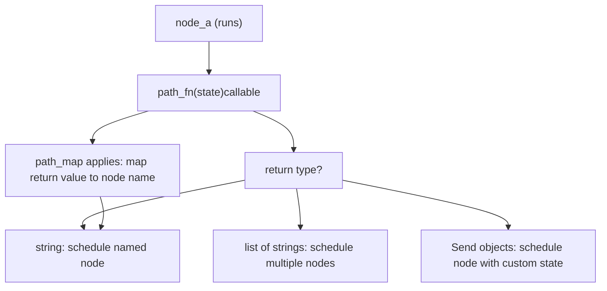
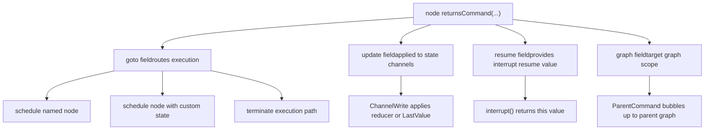
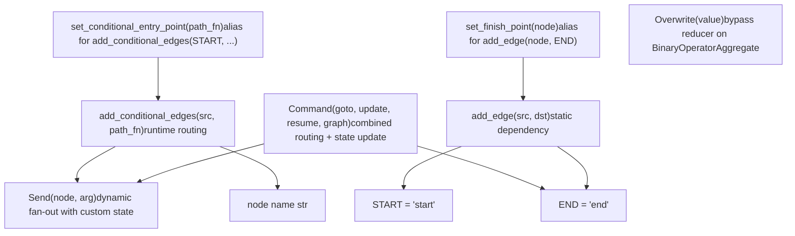

# 控制流原语

相关源文件

-   [libs/langgraph/langgraph/constants.py](https://github.com/langchain-ai/langgraph/blob/1fd51e8f/libs/langgraph/langgraph/constants.py)
-   [libs/langgraph/langgraph/errors.py](https://github.com/langchain-ai/langgraph/blob/1fd51e8f/libs/langgraph/langgraph/errors.py)
-   [libs/langgraph/langgraph/func/\_\_init\_\_.py](https://github.com/langchain-ai/langgraph/blob/1fd51e8f/libs/langgraph/langgraph/func/__init__.py)
-   [libs/langgraph/langgraph/graph/state.py](https://github.com/langchain-ai/langgraph/blob/1fd51e8f/libs/langgraph/langgraph/graph/state.py)
-   [libs/langgraph/langgraph/pregel/\_\_init\_\_.py](https://github.com/langchain-ai/langgraph/blob/1fd51e8f/libs/langgraph/langgraph/pregel/__init__.py)
-   [libs/langgraph/langgraph/pregel/debug.py](https://github.com/langchain-ai/langgraph/blob/1fd51e8f/libs/langgraph/langgraph/pregel/debug.py)
-   [libs/langgraph/langgraph/pregel/types.py](https://github.com/langchain-ai/langgraph/blob/1fd51e8f/libs/langgraph/langgraph/pregel/types.py)
-   [libs/langgraph/langgraph/types.py](https://github.com/langchain-ai/langgraph/blob/1fd51e8f/libs/langgraph/langgraph/types.py)
-   [libs/langgraph/tests/\_\_snapshots\_\_/test\_large\_cases.ambr](https://github.com/langchain-ai/langgraph/blob/1fd51e8f/libs/langgraph/tests/__snapshots__/test_large_cases.ambr)
-   [libs/langgraph/tests/test\_checkpoint\_migration.py](https://github.com/langchain-ai/langgraph/blob/1fd51e8f/libs/langgraph/tests/test_checkpoint_migration.py)
-   [libs/langgraph/tests/test\_large\_cases.py](https://github.com/langchain-ai/langgraph/blob/1fd51e8f/libs/langgraph/tests/test_large_cases.py)
-   [libs/langgraph/tests/test\_large\_cases\_async.py](https://github.com/langchain-ai/langgraph/blob/1fd51e8f/libs/langgraph/tests/test_large_cases_async.py)
-   [libs/langgraph/tests/test\_pregel.py](https://github.com/langchain-ai/langgraph/blob/1fd51e8f/libs/langgraph/tests/test_pregel.py)
-   [libs/langgraph/tests/test\_pregel\_async.py](https://github.com/langchain-ai/langgraph/blob/1fd51e8f/libs/langgraph/tests/test_pregel_async.py)

本页记录了控制 LangGraph 图执行顺序的机制：`START`/`END` 常量、静态边与条件边、用于动态扇出的 `Send` API，以及用于组合路由与状态更新的 `Command` 类型。关于在路由解析后节点如何执行，请参见 [3.3 Pregel 执行引擎](https://github.com/langchain-ai/langgraph/blob/1fd51e8f/3.3 Pregel Execution Engine)。关于使用 `interrupt()` 与 `Command(resume=...)` 的 human-in-the-loop 模式，请参见 [3.7 Human-in-the-Loop 与中断](https://github.com/langchain-ai/langgraph/blob/1fd51e8f/3.7 Human-in-the-Loop and Interrupts)

---

## START 与 END 常量

`START` 和 `END` 是驻留（interned）的字符串哨兵，表示图的虚拟入口与出口。它们不会作为节点执行；仅在边声明中作为端点使用。

| 常量 | 值 | 用途 |
| --- | --- | --- |
| `START` | `"__start__"` | 虚拟入口节点；图输入发出边的源头 |
| `END` | `"__end__"` | 虚拟出口节点；任何到 `END` 的边都会终止该执行路径 |

**来源：** [libs/langgraph/langgraph/constants.py28-31](https://github.com/langchain-ai/langgraph/blob/1fd51e8f/libs/langgraph/langgraph/constants.py#L28-L31)

节点与边始终相对于这些哨兵进行声明：

```
from langgraph.graph import START, END, StateGraph builder = StateGraph(State)builder.add_edge(START, "my_node")builder.add_edge("my_node", END)
```
---

## 静态边

`StateGraph.add_edge(source, dest)` 声明无条件依赖：当 `source` 完成后，总会调度 `dest`。同一节点的多条出向静态边会使目标节点在同一 superstep 运行（并行）。

```
builder.add_edge(START, "a")   # run "a" firstbuilder.add_edge("a", "b")     # run "b" after "a"builder.add_edge("a", "c")     # also run "c" after "a" (parallel with "b")
```
当同一源节点发出静态边连接两个节点时，这两个节点会在同一 superstep 执行。若二者都写入同一个 `LastValue` 通道，将抛出 `InvalidUpdateError` [libs/langgraph/langgraph/graph/state.py119-120](https://github.com/langchain-ai/langgraph/blob/1fd51e8f/libs/langgraph/langgraph/graph/state.py#L119-L120) —— 如果预期存在多个写入者，请使用 `BinaryOperatorAggregate` 通道或 `Topic` 通道（见 [3.4 状态管理与通道](https://github.com/langchain-ai/langgraph/blob/1fd51e8f/3.4 State Management and Channels)）。

---

## 条件边

`StateGraph.add_conditional_edges(source, path, path_map=None)` 允许在运行时做出路由决策。`path` 参数是一个可调用对象，接收当前图状态并返回以下之一：

-   单个节点名字符串
-   节点名字符串列表（fan-out）
-   一个 `Send` 对象
-   `Send` 对象列表
-   字符串与 `Send` 对象混合列表

**来源：** [libs/langgraph/langgraph/graph/state.py183-191](https://github.com/langchain-ai/langgraph/blob/1fd51e8f/libs/langgraph/langgraph/graph/state.py#L183-L191)

**图：条件边解析**


**来源：** [libs/langgraph/langgraph/graph/state.py183-191](https://github.com/langchain-ai/langgraph/blob/1fd51e8f/libs/langgraph/langgraph/graph/state.py#L183-L191) [libs/langgraph/langgraph/types.py289-361](https://github.com/langchain-ai/langgraph/blob/1fd51e8f/libs/langgraph/langgraph/types.py#L289-L361) [libs/langgraph/tests/test\_pregel.py1105-1128](https://github.com/langchain-ai/langgraph/blob/1fd51e8f/libs/langgraph/tests/test_pregel.py#L1105-L1128)

### 路径函数

路径函数接收完整图状态并返回路由决策。返回值会与图中注册的节点名匹配。

```
def route(state: State) -> Literal["node_b", "node_c"]:    if state["condition"]:        return "node_b"    return "node_c" builder.add_conditional_edges("node_a", route)
```
### 路径映射（带标签边）

`path_map` 提供从函数返回值到实际节点名的映射。这在图可视化中用于带标签边，或用于返回值是符号而非精确节点名的场景。

```
builder.add_conditional_edges(    "agent",    route,    path_map={"continue": "tools", "exit": END})
```
在渲染后的图中，边标签（`"continue"`、`"exit"`）会显示为虚线箭头注释。

**来源：** [libs/langgraph/tests/\_\_snapshots\_\_/test\_large\_cases.ambr55-88](https://github.com/langchain-ai/langgraph/blob/1fd51e8f/libs/langgraph/tests/__snapshots__/test_large_cases.ambr#L55-L88)

### 条件入口点

`StateGraph.set_conditional_entry_point(path, path_map=None)` 等价于 `add_conditional_edges(START, path, path_map)`。它定义了从图输入到首个节点（或多个节点）的路由。

```
builder.set_conditional_entry_point(lambda _: ["node_a", "node_b"])  # fan-out from input
```
**来源：** [libs/langgraph/tests/test\_pregel.py752-755](https://github.com/langchain-ai/langgraph/blob/1fd51e8f/libs/langgraph/tests/test_pregel.py#L752-L755) [libs/langgraph/tests/test\_pregel\_async.py534-535](https://github.com/langchain-ai/langgraph/blob/1fd51e8f/libs/langgraph/tests/test_pregel_async.py#L534-L535)

---

## Send API

`Send` 允许条件边函数以与当前图状态不同的*自定义状态*调度节点。这是动态 fan-out 的主要机制（即 map-reduce 工作流中的“map”步骤）。

**类定义：** [libs/langgraph/langgraph/types.py289-361](https://github.com/langchain-ai/langgraph/blob/1fd51e8f/libs/langgraph/langgraph/types.py#L289-L361)

| 属性 | 类型 | 描述 |
| --- | --- | --- |
| `node` | `str` | 要调度的目标节点名称 |
| `arg` | `Any` | 传递给该节点调用的状态值 |

```
from langgraph.types import Send def fan_out(state: OverallState):    return [Send("worker", {"item": x}) for x in state["items"]] builder.add_conditional_edges(START, fan_out)
```
每个 `Send` 都会创建一个独立任务。同一边函数返回的多个 `Send` 对象会在下一 superstep 并发执行。

**图：使用 Send API 的 Map-Reduce**

**来源：** [libs/langgraph/langgraph/types.py289-361](https://github.com/langchain-ai/langgraph/blob/1fd51e8f/libs/langgraph/langgraph/types.py#L289-L361) [libs/langgraph/tests/test\_pregel.py1105-1128](https://github.com/langchain-ai/langgraph/blob/1fd51e8f/libs/langgraph/tests/test_pregel.py#L1105-L1128) [libs/langgraph/tests/test\_pregel\_async.py914-942](https://github.com/langchain-ai/langgraph/blob/1fd51e8f/libs/langgraph/tests/test_pregel_async.py#L914-L942)

### 在条件边函数中使用 Send

`Send` 可与普通字符串节点名混合出现在同一返回值中：

```
def start(state: State) -> list[Send | str]:    return ["tool_two", Send("tool_one", state)]
```
这会用常规图状态调度 `tool_two`，并用显式提供的状态调度 `tool_one`。

**来源：** [libs/langgraph/tests/test\_pregel\_async.py915-916](https://github.com/langchain-ai/langgraph/blob/1fd51e8f/libs/langgraph/tests/test_pregel_async.py#L915-L916)

---

## Command 类型

`Command` 是一个 dataclass，允许节点同时更新图状态**并且**指定下一个要运行的节点。这使得当路由决策在节点内部完成时，不再需要单独的条件边。

**类定义：** [libs/langgraph/langgraph/types.py367-417](https://github.com/langchain-ai/langgraph/blob/1fd51e8f/libs/langgraph/langgraph/types.py#L367-L417)

| 字段 | 类型 | 描述 |
| --- | --- | --- |
| `goto` | `str | Send | Sequence[str | Send]` | 下一步路由到的节点 |
| `update` | `Any | None` | 要应用的状态更新（格式与普通节点返回值相同） |
| `resume` | `Any | None` | 恢复已暂停 `interrupt()` 时注入的值 |
| `graph` | `str | None` | 目标图（`None` = 当前图，`Command.PARENT` = 最近父图） |

**图：Command 类型字段及其效果**


**来源：** [libs/langgraph/langgraph/types.py367-417](https://github.com/langchain-ai/langgraph/blob/1fd51e8f/libs/langgraph/langgraph/types.py#L367-L417) [libs/langgraph/langgraph/errors.py111-115](https://github.com/langchain-ai/langgraph/blob/1fd51e8f/libs/langgraph/langgraph/errors.py#L111-L115)

### goto：路由

```
def node_a(state: State):    return Command(goto="b", update={"foo": "bar"}) def node_b(state: State):    return Command(goto=END, update={"bar": "baz"})
```
`goto` 也可以接收 `Send` 对象以实现动态 fan-out：

```
def node_a(state: State):    return Command(goto=[Send("worker", {"item": x}) for x in state["items"]])
```
**来源：** [libs/langgraph/tests/test\_pregel.py139-155](https://github.com/langchain-ai/langgraph/blob/1fd51e8f/libs/langgraph/tests/test_pregel.py#L139-L155)

### update：状态更新

`update` 支持与常规节点返回值相同的格式：

-   以状态字段名为键的 `dict`
-   `(field_name, value)` 元组列表
-   Pydantic 或 dataclass 模型实例（如果状态模式使用它们）

在下一 superstep 开始前，该更新会由每个字段的 reducer 处理。

### resume：恢复中断

当将 `Command` 作为图的*输入*（而非节点返回值）传入时，`resume` 字段用于为待处理的 `interrupt()` 调用提供值。运行时按顺序将 resume 值与中断匹配。

```
# Graph was paused by an interrupt(); resume it:for chunk in graph.stream(Command(resume="user response"), config):    ...
```
**来源：** [libs/langgraph/tests/test\_pregel\_async.py632-636](https://github.com/langchain-ai/langgraph/blob/1fd51e8f/libs/langgraph/tests/test_pregel_async.py#L632-L636) [libs/langgraph/langgraph/types.py420-543](https://github.com/langchain-ai/langgraph/blob/1fd51e8f/libs/langgraph/langgraph/types.py#L420-L543)

### graph：跨图路由

当子图内的节点需要更新*父*图状态，或在父图内路由时，请设置 `graph=Command.PARENT`。

| 值 | 效果 |
| --- | --- |
| `None`（默认） | Command 应用于当前图 |
| `Command.PARENT` (`"__parent__"`) | Command 通过 `ParentCommand` 异常冒泡到最近父图 |

在内部，`Command(graph=Command.PARENT, ...)` 会导致子图抛出 `ParentCommand` 异常（定义于 [libs/langgraph/langgraph/errors.py111-115](https://github.com/langchain-ai/langgraph/blob/1fd51e8f/libs/langgraph/langgraph/errors.py#L111-L115)），并由父图执行循环捕获并处理。

**来源：** [libs/langgraph/langgraph/types.py417](https://github.com/langchain-ai/langgraph/blob/1fd51e8f/libs/langgraph/langgraph/types.py#L417-L417) [libs/langgraph/langgraph/errors.py111-115](https://github.com/langchain-ai/langgraph/blob/1fd51e8f/libs/langgraph/langgraph/errors.py#L111-L115)

---

## Overwrite 类型

`Overwrite` 会绕过 `BinaryOperatorAggregate` 通道上的 reducer，并直接替换通道值。若不使用 `Overwrite`，对带注解字段返回值时总会调用其 reducer（例如 `operator.add`）。

**类定义：** [libs/langgraph/langgraph/types.py546-587](https://github.com/langchain-ai/langgraph/blob/1fd51e8f/libs/langgraph/langgraph/types.py#L546-L587)

```
from langgraph.types import Overwrite def node_b(state: State):    # Bypasses operator.add reducer; replaces list entirely    return {"messages": Overwrite(value=["b"])}
```
在单个 superstep 中，同一通道接收多个 `Overwrite` 值会抛出 `InvalidUpdateError`。

---

## 常见路由模式

**图：控制流原语与代码实体**


**来源：** [libs/langgraph/langgraph/constants.py28-31](https://github.com/langchain-ai/langgraph/blob/1fd51e8f/libs/langgraph/langgraph/constants.py#L28-L31) [libs/langgraph/langgraph/types.py289-417](https://github.com/langchain-ai/langgraph/blob/1fd51e8f/libs/langgraph/langgraph/types.py#L289-L417) [libs/langgraph/langgraph/graph/state.py183-191](https://github.com/langchain-ai/langgraph/blob/1fd51e8f/libs/langgraph/langgraph/graph/state.py#L183-L191)

### If-Else 分支

```
def route(state: State) -> Literal["tools", "__end__"]:    if state["needs_tool"]:        return "tools"    return END builder.add_conditional_edges("agent", route)
```
### 自循环（Agent 循环）

```
builder.add_conditional_edges(    "worker",    lambda state: "worker" if state["count"] < 6 else END)
```
**来源：** [libs/langgraph/tests/test\_large\_cases.py297-299](https://github.com/langchain-ai/langgraph/blob/1fd51e8f/libs/langgraph/tests/test_large_cases.py#L297-L299)

### Fan-out / Fan-in（并行节点）

```
builder.add_edge(START, "retriever_one")   # both start simultaneouslybuilder.add_edge(START, "retriever_two")builder.add_edge("retriever_one", "aggregate")builder.add_edge("retriever_two", "aggregate")
```
当 `retriever_one` 和 `retriever_two` 都完成后，会调度 `aggregate`。由两个 retriever 都写入的状态字段必须使用 reducer（例如 `Annotated[list, operator.add]`）。

### 使用 Send 的 Map-Reduce

```
class OverallState(TypedDict):    subjects: list[str]    jokes: Annotated[list[str], operator.add] def continue_to_jokes(state: OverallState):    return [Send("generate_joke", {"subject": s}) for s in state["subjects"]] builder.add_conditional_edges(START, continue_to_jokes)builder.add_edge("generate_joke", END)
```
每次 `generate_joke` 调用都会收到其自身隔离的 `{"subject": s}` 字典。结果通过 `operator.add` 合并到 `jokes`。

**来源：** [libs/langgraph/langgraph/types.py308-331](https://github.com/langchain-ai/langgraph/blob/1fd51e8f/libs/langgraph/langgraph/types.py#L308-L331)

### 节点使用 Command 进行自路由

当路由在节点内部确定时（例如基于 LLM 输出），返回 `Command` 可省去单独调用 `add_conditional_edges`。传给 `add_node` 的 `destinations` 参数用于记录 `Command` 可能路由到哪些节点（仅用于可视化——对执行无影响）：

```
builder.add_node(    "agent",    agent_fn,    destinations={"tools": "tools", END: END})# No add_conditional_edges needed if agent_fn returns Command(goto=...)
```
**来源：** [libs/langgraph/langgraph/graph/state.py295-325](https://github.com/langchain-ai/langgraph/blob/1fd51e8f/libs/langgraph/langgraph/graph/state.py#L295-L325)

---

## 交互总结

| 原语 | 定义位置 | 使用时机 |
| --- | --- | --- |
| `START` | `langgraph.constants` | 所有入口边的源点 |
| `END` | `langgraph.constants` | 任一执行路径的终止点 |
| `add_edge` | `StateGraph` | 无条件、始终生效的连接 |
| `add_conditional_edges` | `StateGraph` | 由函数在运行时决定路由 |
| `Send` | `langgraph.types` | 按条目自定义状态进行 fan-out |
| `Command` | `langgraph.types` | 节点同时控制自身更新与下一节点 |
| `Command.PARENT` | `langgraph.types` | 子图与父图通信 |
| `Overwrite` | `langgraph.types` | 完整替换 reducer 通道值 |

**来源：** [libs/langgraph/langgraph/constants.py28-31](https://github.com/langchain-ai/langgraph/blob/1fd51e8f/libs/langgraph/langgraph/constants.py#L28-L31) [libs/langgraph/langgraph/types.py289-587](https://github.com/langchain-ai/langgraph/blob/1fd51e8f/libs/langgraph/langgraph/types.py#L289-L587) [libs/langgraph/langgraph/graph/state.py183-191](https://github.com/langchain-ai/langgraph/blob/1fd51e8f/libs/langgraph/langgraph/graph/state.py#L183-L191) [libs/langgraph/langgraph/errors.py111-115](https://github.com/langchain-ai/langgraph/blob/1fd51e8f/libs/langgraph/langgraph/errors.py#L111-L115)
