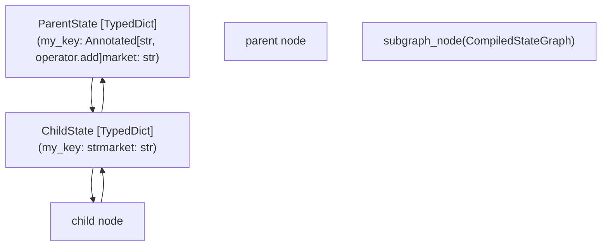
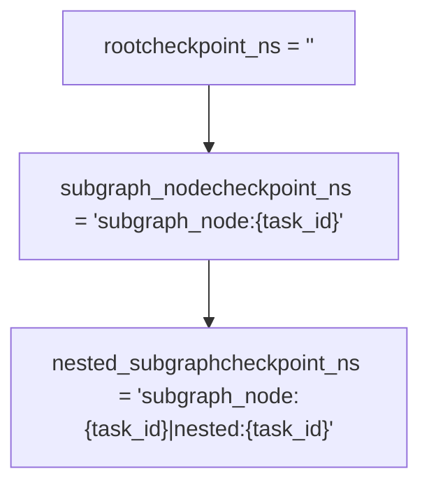
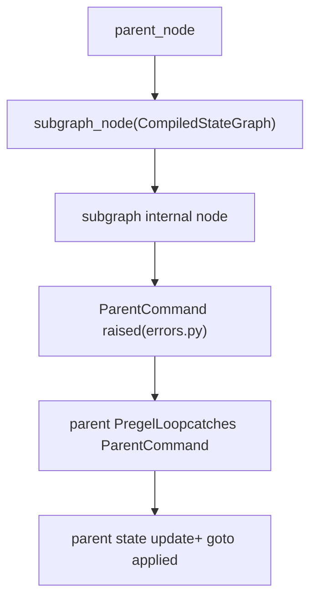

# 图组合与嵌套图

相关源文件

-   [libs/langgraph/langgraph/\_internal/\_constants.py](https://github.com/langchain-ai/langgraph/blob/1fd51e8f/libs/langgraph/langgraph/_internal/_constants.py)
-   [libs/langgraph/langgraph/\_internal/\_replay.py](https://github.com/langchain-ai/langgraph/blob/1fd51e8f/libs/langgraph/langgraph/_internal/_replay.py)
-   [libs/langgraph/langgraph/constants.py](https://github.com/langchain-ai/langgraph/blob/1fd51e8f/libs/langgraph/langgraph/constants.py)
-   [libs/langgraph/langgraph/errors.py](https://github.com/langchain-ai/langgraph/blob/1fd51e8f/libs/langgraph/langgraph/errors.py)
-   [libs/langgraph/langgraph/func/\_\_init\_\_.py](https://github.com/langchain-ai/langgraph/blob/1fd51e8f/libs/langgraph/langgraph/func/__init__.py)
-   [libs/langgraph/langgraph/graph/state.py](https://github.com/langchain-ai/langgraph/blob/1fd51e8f/libs/langgraph/langgraph/graph/state.py)
-   [libs/langgraph/langgraph/pregel/\_\_init\_\_.py](https://github.com/langchain-ai/langgraph/blob/1fd51e8f/libs/langgraph/langgraph/pregel/__init__.py)
-   [libs/langgraph/langgraph/pregel/\_loop.py](https://github.com/langchain-ai/langgraph/blob/1fd51e8f/libs/langgraph/langgraph/pregel/_loop.py)
-   [libs/langgraph/langgraph/pregel/debug.py](https://github.com/langchain-ai/langgraph/blob/1fd51e8f/libs/langgraph/langgraph/pregel/debug.py)
-   [libs/langgraph/langgraph/pregel/main.py](https://github.com/langchain-ai/langgraph/blob/1fd51e8f/libs/langgraph/langgraph/pregel/main.py)
-   [libs/langgraph/langgraph/pregel/protocol.py](https://github.com/langchain-ai/langgraph/blob/1fd51e8f/libs/langgraph/langgraph/pregel/protocol.py)
-   [libs/langgraph/langgraph/pregel/remote.py](https://github.com/langchain-ai/langgraph/blob/1fd51e8f/libs/langgraph/langgraph/pregel/remote.py)
-   [libs/langgraph/langgraph/pregel/types.py](https://github.com/langchain-ai/langgraph/blob/1fd51e8f/libs/langgraph/langgraph/pregel/types.py)
-   [libs/langgraph/langgraph/types.py](https://github.com/langchain-ai/langgraph/blob/1fd51e8f/libs/langgraph/langgraph/types.py)
-   [libs/langgraph/langgraph/warnings.py](https://github.com/langchain-ai/langgraph/blob/1fd51e8f/libs/langgraph/langgraph/warnings.py)
-   [libs/langgraph/tests/\_\_snapshots\_\_/test\_large\_cases.ambr](https://github.com/langchain-ai/langgraph/blob/1fd51e8f/libs/langgraph/tests/__snapshots__/test_large_cases.ambr)
-   [libs/langgraph/tests/test\_checkpoint\_migration.py](https://github.com/langchain-ai/langgraph/blob/1fd51e8f/libs/langgraph/tests/test_checkpoint_migration.py)
-   [libs/langgraph/tests/test\_deprecation.py](https://github.com/langchain-ai/langgraph/blob/1fd51e8f/libs/langgraph/tests/test_deprecation.py)
-   [libs/langgraph/tests/test\_interruption.py](https://github.com/langchain-ai/langgraph/blob/1fd51e8f/libs/langgraph/tests/test_interruption.py)
-   [libs/langgraph/tests/test\_large\_cases.py](https://github.com/langchain-ai/langgraph/blob/1fd51e8f/libs/langgraph/tests/test_large_cases.py)
-   [libs/langgraph/tests/test\_large\_cases\_async.py](https://github.com/langchain-ai/langgraph/blob/1fd51e8f/libs/langgraph/tests/test_large_cases_async.py)
-   [libs/langgraph/tests/test\_pregel.py](https://github.com/langchain-ai/langgraph/blob/1fd51e8f/libs/langgraph/tests/test_pregel.py)
-   [libs/langgraph/tests/test\_pregel\_async.py](https://github.com/langchain-ai/langgraph/blob/1fd51e8f/libs/langgraph/tests/test_pregel_async.py)
-   [libs/langgraph/tests/test\_remote\_graph.py](https://github.com/langchain-ai/langgraph/blob/1fd51e8f/libs/langgraph/tests/test_remote_graph.py)
-   [libs/langgraph/tests/test\_stream\_v2.py](https://github.com/langchain-ai/langgraph/blob/1fd51e8f/libs/langgraph/tests/test_stream_v2.py)
-   [libs/langgraph/tests/test\_time\_travel.py](https://github.com/langchain-ai/langgraph/blob/1fd51e8f/libs/langgraph/tests/test_time_travel.py)
-   [libs/langgraph/tests/test\_time\_travel\_async.py](https://github.com/langchain-ai/langgraph/blob/1fd51e8f/libs/langgraph/tests/test_time_travel_async.py)

本页介绍如何将已编译的 LangGraph 图嵌入为其他图中的节点、如何在父子作用域之间传递状态、如何为嵌套执行进行检查点命名空间划分，以及如何检查组合图的层级结构。

关于 Pregel 执行引擎的工作原理背景，请参见 [核心执行系统](/langchain-ai/langgraph/3-core-execution-system)。关于用于构建单个图的 `StateGraph` API，请参见 [StateGraph API](/langchain-ai/langgraph/3.1-stategraph-api)。关于嵌套图中的 human-in-the-loop 中断处理，请参见 [Human-in-the-Loop 与中断](/langchain-ai/langgraph/3.7-human-in-the-loop-and-interrupts)。

---

## 子图基础

由 `StateGraph.compile()` 生成的 `CompiledStateGraph` 实现了 `PregelProtocol`，可以直接作为节点传给 `StateGraph.add_node()`。随后父图会将子图视为不透明节点：执行期间调用子图的 `invoke`/`ainvoke`，并由子图运行其自身完整的 `Pregel` 循环。

[libs/langgraph/langgraph/graph/state.py115-199](https://github.com/langchain-ai/langgraph/blob/1fd51e8f/libs/langgraph/langgraph/graph/state.py#L115-L199) [libs/langgraph/langgraph/pregel/main.py1-3](https://github.com/langchain-ai/langgraph/blob/1fd51e8f/libs/langgraph/langgraph/pregel/main.py#L1-L3)

**基本模式：**

```
# Define and compile the child graphchild_graph = StateGraph(ChildState)child_graph.add_node("child_node", ...)compiled_child = child_graph.compile() # Add it as a node in the parent graphparent_graph = StateGraph(ParentState)parent_graph.add_node("subgraph_node", compiled_child)parent_graph.add_edge(START, "subgraph_node")parent_graph.add_edge("subgraph_node", END)parent = parent_graph.compile()
```
在 `add_node` 中使用的子图名称会成为其在父图拓扑中的节点标识符。

**图数据中的子图节点类型：** 当在父图上调用 `get_graph()` 时，子图节点会通过其底层 `Pregel` 实现来标识。

[libs/langgraph/langgraph/pregel/main.py42](https://github.com/langchain-ai/langgraph/blob/1fd51e8f/libs/langgraph/langgraph/pregel/main.py#L42-L42)

---

## 父子图之间的状态映射

当父图调用子图节点时，状态不会整体传递；而是通过模式匹配进行投影。

**输入投影（parent → child）：** 父图会传递其当前状态中所有同时出现在子图 `input_schema`（若未定义独立 `input_schema` 则为 `state_schema`）中的键组成的 dict。

**输出应用（child → parent）：** 子图返回其 `output_schema` 中的值。每个返回键都会使用**父图的**通道 reducer 写回父状态。

这意味着父图与子图可为同一键使用不同的 reducer 注解。例如：

| 字段 | 父模式 | 子模式 |
| --- | --- | --- |
| `my_key` | `Annotated[str, operator.add]` | `str` |
| `market` | `str` | `str` |

如果子图返回 `{"my_key": " appended"}`，父 reducer `operator.add` 会累积它：`"original" + " appended" = "original appended"`。

[libs/langgraph/tests/test\_pregel\_async.py123-182](https://github.com/langchain-ai/langgraph/blob/1fd51e8f/libs/langgraph/tests/test_pregel_async.py#L123-L182)

**状态映射图：**


来源: [libs/langgraph/langgraph/pregel/\_io.py125](https://github.com/langchain-ai/langgraph/blob/1fd51e8f/libs/langgraph/langgraph/pregel/_io.py#L125-L125) [libs/langgraph/langgraph/pregel/\_algo.py113](https://github.com/langchain-ai/langgraph/blob/1fd51e8f/libs/langgraph/langgraph/pregel/_algo.py#L113-L113) [libs/langgraph/langgraph/graph/state.py115-184](https://github.com/langchain-ai/langgraph/blob/1fd51e8f/libs/langgraph/langgraph/graph/state.py#L115-L184)

---

## 检查点命名空间

当父图启用了 checkpointer 时，每次子图调用都会获得自己的检查点命名空间（`checkpoint_ns`）。这使每次嵌套执行都拥有独立状态历史。

**命名空间格式：**

```
{node_name}:{task_id}
```
对于嵌套子图（深度 > 1）：

```
{parent_node}:{parent_task_id}|{child_node}:{child_task_id}
```
分隔符（`|`）是 `NS_SEP`，定界符（`:`）是 `NS_END`，两者都定义在 `langgraph._internal._constants` 中。

[libs/langgraph/langgraph/\_internal/\_constants.py37-38](https://github.com/langchain-ai/langgraph/blob/1fd51e8f/libs/langgraph/langgraph/_internal/_constants.py#L37-L38) [libs/langgraph/langgraph/pregel/debug.py141-151](https://github.com/langchain-ai/langgraph/blob/1fd51e8f/libs/langgraph/langgraph/pregel/debug.py#L141-L151)

**构建方式：**

```
# From map_debug_checkpoint in debug.pytask_ns = f"{task.name}{NS_END}{task.id}"if parent_ns:    task_ns = f"{parent_ns}{NS_SEP}{task_ns}"
```
父图与所有子图的所有检查点共享同一个 `thread_id`，但 `checkpoint_ns` 不同。

**命名空间结构图：**


来源: [libs/langgraph/langgraph/pregel/debug.py133-152](https://github.com/langchain-ai/langgraph/blob/1fd51e8f/libs/langgraph/langgraph/pregel/debug.py#L133-L152) [libs/langgraph/langgraph/\_internal/\_constants.py37-38](https://github.com/langchain-ai/langgraph/blob/1fd51e8f/libs/langgraph/langgraph/_internal/_constants.py#L37-L38)

---

## 子图 Checkpointer 配置

`compile()` 方法接受类型为 `Checkpointer` 的 `checkpointer` 参数（定义于 `langgraph.types`）：

[libs/langgraph/langgraph/types.py96-102](https://github.com/langchain-ai/langgraph/blob/1fd51e8f/libs/langgraph/langgraph/types.py#L96-L102)

| 值 | 行为 |
| --- | --- |
| `None`（默认） | 继承父图的 checkpointer |
| `True` | 为该子图启用独立持久化 checkpointing |
| `False` | 即使父图有 checkpointer，也为该子图禁用 checkpointing |
| `BaseCheckpointSaver` 实例 | 为子图使用该特定保存器 |

```
# Child inherits parent's checkpointer (default)compiled_child = child_graph.compile() # Child is independently checkpointedcompiled_child = child_graph.compile(checkpointer=True) # Child has no checkpointing regardless of parentcompiled_child = child_graph.compile(checkpointer=False)
```
当为 `None` 时，子图检查点写入会通过与父图相同的 `BaseCheckpointSaver`，并由 `checkpoint_ns` 区分。

来源: [libs/langgraph/langgraph/types.py96-115](https://github.com/langchain-ai/langgraph/blob/1fd51e8f/libs/langgraph/langgraph/types.py#L96-L115)

---

## 访问子图状态

当父图启用了 checkpointing 且子图被中断或正在运行时，在父图上调用 `get_state()` / `aget_state()` 会返回 `StateSnapshot`，其 `tasks` 字段包含 `PregelTask` 实例。

对于封装子图的任务，`PregelTask.state` 会被设为指向子图检查点命名空间的 `RunnableConfig`：

[libs/langgraph/langgraph/types.py168-190](https://github.com/langchain-ai/langgraph/blob/1fd51e8f/libs/langgraph/langgraph/types.py#L168-L190)

```
parent_snapshot = parent.get_state(config)for task in parent_snapshot.tasks:    if task.state is not None:        # task.state is a RunnableConfig with checkpoint_ns set        subgraph_snapshot = parent.get_state(task.state)
```
当底层 `PregelExecutableTask` 表示子图执行时，`task.state` 字段会在 `tasks_w_writes()` 和 `map_debug_checkpoint()` 中被填充。

[libs/langgraph/langgraph/pregel/debug.py121-183](https://github.com/langchain-ai/langgraph/blob/1fd51e8f/libs/langgraph/langgraph/pregel/debug.py#L121-L183)

**子图节点的 `PregelTask` 示例：**

```
PregelTask(    id="abc123",    name="subgraph_node",            # node name in parent    path=(PULL, "subgraph_node"),    interrupts=(Interrupt(...),),    state={        "configurable": {            "thread_id": "1",            "checkpoint_ns": "subgraph_node:abc123",  # subgraph's checkpoint        }    })
```
[libs/langgraph/langgraph/types.py168-190](https://github.com/langchain-ai/langgraph/blob/1fd51e8f/libs/langgraph/langgraph/types.py#L168-L190)

**状态访问流程图：**

> **[Mermaid sequence]**
> *(图表结构无法解析)*

来源: [libs/langgraph/langgraph/types.py168-190](https://github.com/langchain-ai/langgraph/blob/1fd51e8f/libs/langgraph/langgraph/types.py#L168-L190) [libs/langgraph/langgraph/pregel/debug.py121-183](https://github.com/langchain-ai/langgraph/blob/1fd51e8f/libs/langgraph/langgraph/pregel/debug.py#L121-L183) [libs/langgraph/langgraph/pregel/main.py149](https://github.com/langchain-ai/langgraph/blob/1fd51e8f/libs/langgraph/langgraph/pregel/main.py#L149-L149)

---

## 中断传播

在子图中通过 `interrupt()` 引发的中断会向上冒泡到父图。父图会捕获它们，并将其暴露在自己的 `StateSnapshot.interrupts` 以及相关 `PregelTask.interrupts` 列表中。

父图**不**需要知道中断源于子图；它会像处理顶层中断一样处理。恢复时向父图传入 `Command(resume=value)`，父图会通过检查点命名空间将其路由到正确的子图任务。

[libs/langgraph/langgraph/errors.py57](https://github.com/langchain-ai/langgraph/blob/1fd51e8f/libs/langgraph/langgraph/errors.py#L57-L57) [libs/langgraph/langgraph/types.py71](https://github.com/langchain-ai/langgraph/blob/1fd51e8f/libs/langgraph/langgraph/types.py#L71-L71)

```
# Subgraph interrupt bubbles up to parentresult = parent.invoke({"input": "v"}, config)# result contains interrupts if subgraph called interrupt() # Resume by passing Command to parentresult = parent.invoke(Command(resume="my answer"), config)
```
来源: [libs/langgraph/langgraph/types.py71](https://github.com/langchain-ai/langgraph/blob/1fd51e8f/libs/langgraph/langgraph/types.py#L71-L71) [libs/langgraph/langgraph/errors.py57](https://github.com/langchain-ai/langgraph/blob/1fd51e8f/libs/langgraph/langgraph/errors.py#L57-L57)

---

## 跨图命令：`Command.PARENT`

子图节点可通过返回 `graph=Command.PARENT` 的 `Command`，将更新和路由决策定向到其**父**图。

[libs/langgraph/langgraph/types.py367-417](https://github.com/langchain-ai/langgraph/blob/1fd51e8f/libs/langgraph/langgraph/types.py#L367-L417)（注：该引用对应通用 Command 行为）

```
# Inside a node that is itself inside a subgraphdef my_subgraph_node(state: SubgraphState):    return Command(        graph="parent",  # Directing to parent        update={"parent_key": "new_value"},        goto="some_parent_node",    )
```
在内部，子图节点会抛出 `ParentCommand` 异常，父图执行循环会捕获该异常，并按自身状态与路由表将其作为 `Command` 处理。

[libs/langgraph/langgraph/errors.py49-50](https://github.com/langchain-ai/langgraph/blob/1fd51e8f/libs/langgraph/langgraph/errors.py#L49-L50)

**Command 路由图：**


来源: [libs/langgraph/langgraph/types.py367-417](https://github.com/langchain-ai/langgraph/blob/1fd51e8f/libs/langgraph/langgraph/types.py#L367-L417) [libs/langgraph/langgraph/errors.py49-50](https://github.com/langchain-ai/langgraph/blob/1fd51e8f/libs/langgraph/langgraph/errors.py#L49-L50)

---

## 远程子图

`RemoteGraph` 类允许将部署在 LangGraph 服务器上的图作为本地图中的节点使用。它实现了与本地图相同的 `PregelProtocol`，使组合过程透明。

[libs/langgraph/langgraph/pregel/remote.py112-121](https://github.com/langchain-ai/langgraph/blob/1fd51e8f/libs/langgraph/langgraph/pregel/remote.py#L112-L121)

```
from langgraph.pregel.remote import RemoteGraph remote_subgraph = RemoteGraph(assistant_id="my-deployed-graph", url="http://localhost:8123") builder = StateGraph(State)builder.add_node("remote", remote_subgraph)
```
调用 `RemoteGraph` 时，它会使用 `LangGraphClient` 触发远程服务器上的运行，并将结果流式回传到本地图状态中。

来源: [libs/langgraph/langgraph/pregel/remote.py112-174](https://github.com/langchain-ai/langgraph/blob/1fd51e8f/libs/langgraph/langgraph/pregel/remote.py#L112-L174)

---

## 摘要参考

| 概念 | 类型 / 符号 | 位置 |
| --- | --- | --- |
| 已编译子图类型 | `CompiledStateGraph` | `langgraph/graph/state.py` |
| 子图 checkpointer 配置 | `Checkpointer` | `langgraph/types.py` |
| 任务中的子图状态 | `PregelTask.state` | `langgraph/types.py` |
| 跨图命令 | `Command(graph='parent', ...)` | `langgraph/types.py` |
| 内部跨图异常 | `ParentCommand` | `langgraph/errors.py` |
| 检查点命名空间分隔符 | `NS_SEP` (\` | \`) |
| 检查点命名空间任务定界符 | `NS_END` (`:`) | `langgraph/_internal/_constants.py` |
| 子图任务检测 | `PregelExecutableTask.subgraphs` | `langgraph/types.py` |
| 远程图组合 | `RemoteGraph` | `langgraph/pregel/remote.py` |

来源: [libs/langgraph/langgraph/graph/state.py115](https://github.com/langchain-ai/langgraph/blob/1fd51e8f/libs/langgraph/langgraph/graph/state.py#L115-L115) [libs/langgraph/langgraph/types.py96](https://github.com/langchain-ai/langgraph/blob/1fd51e8f/libs/langgraph/langgraph/types.py#L96-L96) [libs/langgraph/langgraph/errors.py49](https://github.com/langchain-ai/langgraph/blob/1fd51e8f/libs/langgraph/langgraph/errors.py#L49-L49) [libs/langgraph/langgraph/\_internal/\_constants.py37-38](https://github.com/langchain-ai/langgraph/blob/1fd51e8f/libs/langgraph/langgraph/_internal/_constants.py#L37-L38) [libs/langgraph/langgraph/pregel/remote.py112](https://github.com/langchain-ai/langgraph/blob/1fd51e8f/libs/langgraph/langgraph/pregel/remote.py#L112-L112)
