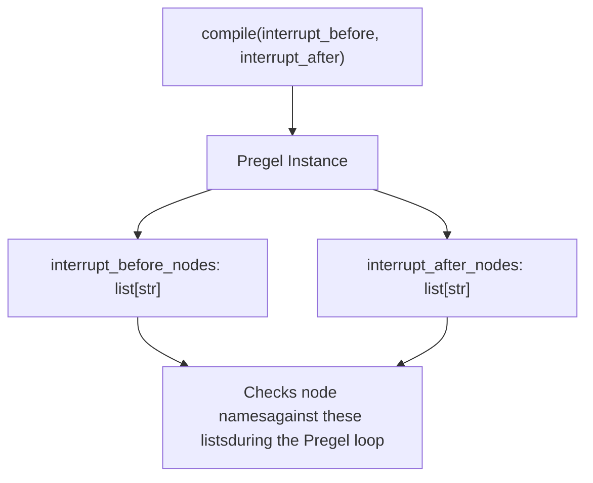
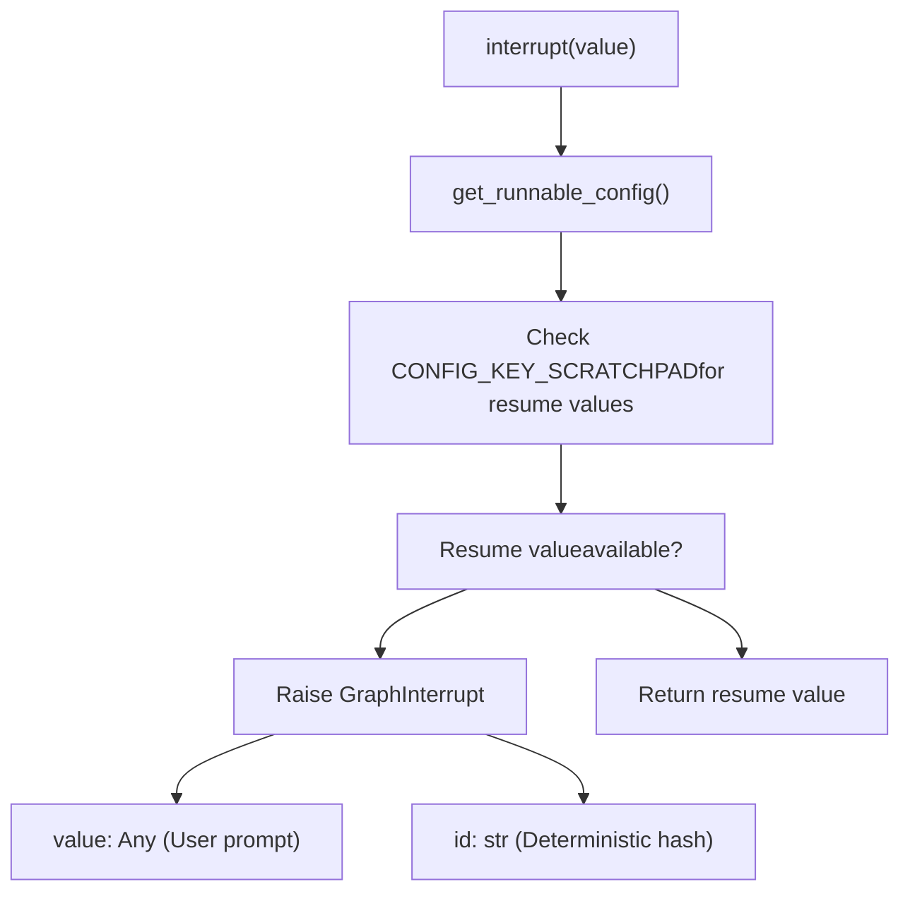
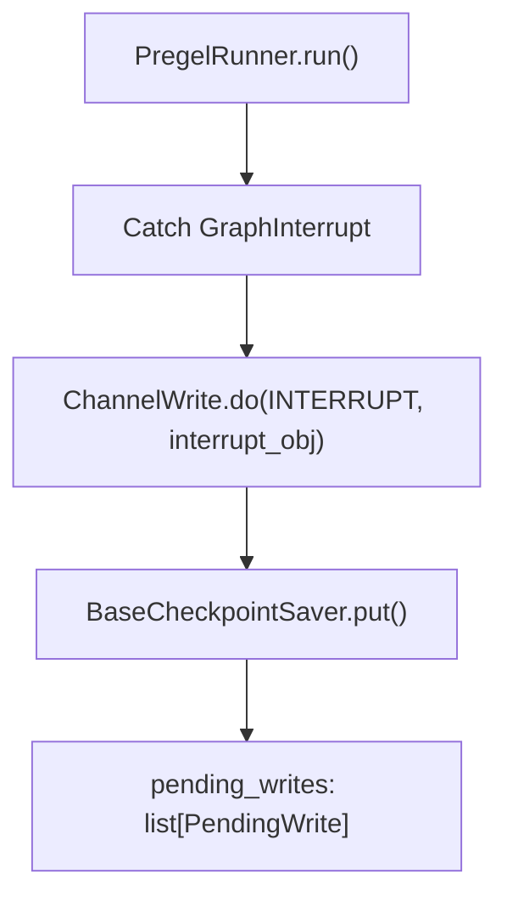
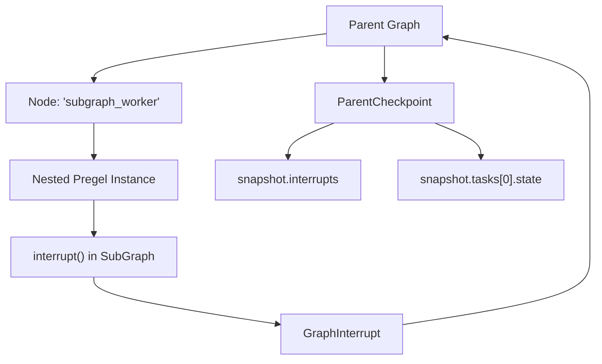

# Human-in-the-Loop 与中断

相关源文件

-   [libs/langgraph/langgraph/constants.py](https://github.com/langchain-ai/langgraph/blob/1fd51e8f/libs/langgraph/langgraph/constants.py)
-   [libs/langgraph/langgraph/errors.py](https://github.com/langchain-ai/langgraph/blob/1fd51e8f/libs/langgraph/langgraph/errors.py)
-   [libs/langgraph/langgraph/func/\_\_init\_\_.py](https://github.com/langchain-ai/langgraph/blob/1fd51e8f/libs/langgraph/langgraph/func/__init__.py)
-   [libs/langgraph/langgraph/graph/state.py](https://github.com/langchain-ai/langgraph/blob/1fd51e8f/libs/langgraph/langgraph/graph/state.py)
-   [libs/langgraph/langgraph/pregel/\_\_init\_\_.py](https://github.com/langchain-ai/langgraph/blob/1fd51e8f/libs/langgraph/langgraph/pregel/__init__.py)
-   [libs/langgraph/langgraph/pregel/debug.py](https://github.com/langchain-ai/langgraph/blob/1fd51e8f/libs/langgraph/langgraph/pregel/debug.py)
-   [libs/langgraph/langgraph/pregel/types.py](https://github.com/langchain-ai/langgraph/blob/1fd51e8f/libs/langgraph/langgraph/pregel/types.py)
-   [libs/langgraph/langgraph/types.py](https://github.com/langchain-ai/langgraph/blob/1fd51e8f/libs/langgraph/langgraph/types.py)
-   [libs/langgraph/tests/\_\_snapshots\_\_/test\_large\_cases.ambr](https://github.com/langchain-ai/langgraph/blob/1fd51e8f/libs/langgraph/tests/__snapshots__/test_large_cases.ambr)
-   [libs/langgraph/tests/test\_checkpoint\_migration.py](https://github.com/langchain-ai/langgraph/blob/1fd51e8f/libs/langgraph/tests/test_checkpoint_migration.py)
-   [libs/langgraph/tests/test\_large\_cases.py](https://github.com/langchain-ai/langgraph/blob/1fd51e8f/libs/langgraph/tests/test_large_cases.py)
-   [libs/langgraph/tests/test\_large\_cases\_async.py](https://github.com/langchain-ai/langgraph/blob/1fd51e8f/libs/langgraph/tests/test_large_cases_async.py)
-   [libs/langgraph/tests/test\_pregel.py](https://github.com/langchain-ai/langgraph/blob/1fd51e8f/libs/langgraph/tests/test_pregel.py)
-   [libs/langgraph/tests/test\_pregel\_async.py](https://github.com/langchain-ai/langgraph/blob/1fd51e8f/libs/langgraph/tests/test_pregel_async.py)

**目的**：本文档说明如何在特定点暂停图执行，以支持人工审阅、输入或决策。中断使图能够在指定节点处，或在节点逻辑内部停止，然后使用人工提供的输入或状态修改恢复执行。

**范围**：涵盖静态中断（编译时配置）、动态中断（通过 `interrupt()` 函数触发）、恢复机制，以及在检查点中的中断存储。有关状态持久化的相关主题，请参见 [Checkpointing Architecture](/langchain-ai/langgraph/4.1-checkpointing-architecture)。有关无人工交互的控制流，请参见 [Control Flow Primitives](/langchain-ai/langgraph/3.5-control-flow-primitives)。

## 概述

中断通过暂停图执行并向用户暴露信息，使 human-in-the-loop 工作流成为可能。LangGraph 支持两种中断机制：

| 中断类型 | 配置方式 | 触发点 | 恢复方式 |
| --- | --- | --- | --- |
| **静态** | 在 `compile()` 上设置 `interrupt_before` / `interrupt_after` | 在特定节点执行前或后 | 以 `None` 或新输入调用 |
| **动态** | 在节点内部调用 `interrupt()` 函数 | 节点执行逻辑内部 | `Command(resume=value)` |

两种机制都需要 checkpointer 来在执行边界之间持久化状态。发生中断时，图会保存当前状态并将控制权返回调用方。再次调用时，会从同一检查点恢复执行。

来源: [libs/langgraph/langgraph/types.py71-80](https://github.com/langchain-ai/langgraph/blob/1fd51e8f/libs/langgraph/langgraph/types.py#L71-L80) [libs/langgraph/langgraph/graph/state.py834-855](https://github.com/langchain-ai/langgraph/blob/1fd51e8f/libs/langgraph/langgraph/graph/state.py#L834-L855) [libs/langgraph/tests/test\_pregel\_async.py568-716](https://github.com/langchain-ai/langgraph/blob/1fd51e8f/libs/langgraph/tests/test_pregel_async.py#L568-L716)

---

## 静态中断

### 编译时配置

静态中断在编译图时配置，使用 `StateGraph.compile()` 中的 `interrupt_before` 或 `interrupt_after` 参数 [libs/langgraph/langgraph/graph/state.py834-855](https://github.com/langchain-ai/langgraph/blob/1fd51e8f/libs/langgraph/langgraph/graph/state.py#L834-L855)

```
# Example configuration in StateGraphbuilder = StateGraph(State)builder.add_node("step_1", logic)# ...graph = builder.compile(    checkpointer=memory_saver,    interrupt_after=["step_1"]  # Pause after step_1 finishes)
```
该配置会映射到底层 `Pregel` 引擎的 `interrupt_before_nodes` 与 `interrupt_after_nodes` 属性 [libs/langgraph/langgraph/pregel/main.py175-180](https://github.com/langchain-ai/langgraph/blob/1fd51e8f/libs/langgraph/langgraph/pregel/main.py#L175-L180)

**静态中断配置模型**


**带静态中断的执行流程**

来源: [libs/langgraph/langgraph/graph/state.py834-855](https://github.com/langchain-ai/langgraph/blob/1fd51e8f/libs/langgraph/langgraph/graph/state.py#L834-L855) [libs/langgraph/tests/test\_large\_cases.py51-70](https://github.com/langchain-ai/langgraph/blob/1fd51e8f/libs/langgraph/tests/test_large_cases.py#L51-L70) [libs/langgraph/langgraph/pregel/main.py175-180](https://github.com/langchain-ai/langgraph/blob/1fd51e8f/libs/langgraph/langgraph/pregel/main.py#L175-L180)

### 中断时的状态检查

当图被中断时，可以使用 `get_state()` 检查其状态 [libs/langgraph/langgraph/pregel/main.py480-500](https://github.com/langchain-ai/langgraph/blob/1fd51e8f/libs/langgraph/langgraph/pregel/main.py#L480-L500)

| StateSnapshot 字段 | 描述 | 代码实体 |
| --- | --- | --- |
| `values` | 当前通道值 | `StateSnapshot.values` |
| `next` | 下一待执行节点元组 | `StateSnapshot.next` |
| `tasks` | 待执行任务 | `StateSnapshot.tasks` |
| `interrupts` | 当前活跃动态中断元组 | `StateSnapshot.interrupts` |

静态中断会得到空的 `interrupts` 元组，因为图是在边界处暂停，而不是由节点显式抛出 `Interrupt` 对象。

来源: [libs/langgraph/langgraph/types.py218-243](https://github.com/langchain-ai/langgraph/blob/1fd51e8f/libs/langgraph/langgraph/types.py#L218-L243) [libs/langgraph/tests/test\_large\_cases.py101-104](https://github.com/langchain-ai/langgraph/blob/1fd51e8f/libs/langgraph/tests/test_large_cases.py#L101-L104)

---

## 动态中断

### interrupt() 函数

`interrupt()` 函数允许节点在自身逻辑内部暂停执行，并向用户请求特定输入 [libs/langgraph/langgraph/types.py420-543](https://github.com/langchain-ai/langgraph/blob/1fd51e8f/libs/langgraph/langgraph/types.py#L420-L543)

```
from langgraph.types import interrupt def human_node(state: State):    # This call raises GraphInterrupt on first execution    user_provided = interrupt("Please approve the budget")    # This code only runs after the graph is resumed    return {"approval": user_provided}
```
**interrupt() 的内部逻辑**


**关键特性**：

1.  **首次调用会抛出异常**：任务内第一次调用时，`interrupt()` 会抛出 `GraphInterrupt` 异常 [libs/langgraph/langgraph/types.py483-485](https://github.com/langchain-ai/langgraph/blob/1fd51e8f/libs/langgraph/langgraph/types.py#L483-L485)
2.  **确定性 ID**：中断 ID 基于检查点命名空间与计数器生成，以确保跨重试一致性 [libs/langgraph/langgraph/types.py465-475](https://github.com/langchain-ai/langgraph/blob/1fd51e8f/libs/langgraph/langgraph/types.py#L465-L475)
3.  **恢复时重新执行**：恢复后，节点会从头重新执行。随后 `interrupt()` 会在 scratchpad 中找到恢复值并返回，而不是抛出异常 [libs/langgraph/langgraph/types.py455-463](https://github.com/langchain-ai/langgraph/blob/1fd51e8f/libs/langgraph/langgraph/types.py#L455-L463)

来源: [libs/langgraph/langgraph/types.py420-543](https://github.com/langchain-ai/langgraph/blob/1fd51e8f/libs/langgraph/langgraph/types.py#L420-L543) [libs/langgraph/tests/test\_pregel\_async.py568-716](https://github.com/langchain-ai/langgraph/blob/1fd51e8f/libs/langgraph/tests/test_pregel_async.py#L568-L716)

---

## 中断数据结构

### Interrupt 类

`Interrupt` 类表示一个挂起的执行点 [libs/langgraph/langgraph/types.py159-214](https://github.com/langchain-ai/langgraph/blob/1fd51e8f/libs/langgraph/langgraph/types.py#L159-L214)

| 字段 | 类型 | 描述 |
| --- | --- | --- |
| `value` | `Any` | 传给 `interrupt()` 的信息，通常是给用户的提示或数据。 |
| `id` | `str` | 此特定中断实例的唯一标识符。 |

**来源**： [libs/langgraph/langgraph/types.py159-170](https://github.com/langchain-ai/langgraph/blob/1fd51e8f/libs/langgraph/langgraph/types.py#L159-L170)

### 在检查点中的存储

中断会作为待处理写入存储在检查点中的特殊 `INTERRUPT` 通道下 [libs/langgraph/langgraph/pregel/debug.py99-104](https://github.com/langchain-ai/langgraph/blob/1fd51e8f/libs/langgraph/langgraph/pregel/debug.py#L99-L104)


来源: [libs/langgraph/langgraph/pregel/debug.py99-104](https://github.com/langchain-ai/langgraph/blob/1fd51e8f/libs/langgraph/langgraph/pregel/debug.py#L99-L104) [libs/langgraph/langgraph/pregel/debug.py208-213](https://github.com/langchain-ai/langgraph/blob/1fd51e8f/libs/langgraph/langgraph/pregel/debug.py#L208-L213)

---

## 恢复执行

### 恢复机制

可通过提供带 `resume` 值的 `Command` 对象来恢复已中断图 [libs/langgraph/langgraph/types.py289-323](https://github.com/langchain-ai/langgraph/blob/1fd51e8f/libs/langgraph/langgraph/types.py#L289-L323)

| 恢复方式 | 代码示例 |
| --- | --- |
| **标准恢复** | `graph.invoke(Command(resume="approved"), config)` |
| **字典恢复** | `graph.invoke(Command(resume={"id_1": "val1"}), config)` |
| **静态恢复** | `graph.invoke(None, config)`（用于静态中断） |

**恢复数据流**

来源: [libs/langgraph/langgraph/types.py315-323](https://github.com/langchain-ai/langgraph/blob/1fd51e8f/libs/langgraph/langgraph/types.py#L315-L323) [libs/langgraph/tests/test\_pregel\_async.py616-636](https://github.com/langchain-ai/langgraph/blob/1fd51e8f/libs/langgraph/tests/test_pregel_async.py#L616-L636) [libs/langgraph/langgraph/pregel/\_runner.py](https://github.com/langchain-ai/langgraph/blob/1fd51e8f/libs/langgraph/langgraph/pregel/_runner.py)

### 清除中断

若要在不完成触发该中断逻辑的情况下清除中断，可对线程应用状态更新：使用 `update_state` 并设置 `as_node="__end__"`，或提供特定 `checkpoint_id` [libs/langgraph/langgraph/graph/state.py1050-1070](https://github.com/langchain-ai/langgraph/blob/1fd51e8f/libs/langgraph/langgraph/graph/state.py#L1050-L1070)

来源: [libs/langgraph/tests/test\_pregel\_async.py697-715](https://github.com/langchain-ai/langgraph/blob/1fd51e8f/libs/langgraph/tests/test_pregel_async.py#L697-L715) [libs/langgraph/langgraph/graph/state.py1050-1070](https://github.com/langchain-ai/langgraph/blob/1fd51e8f/libs/langgraph/langgraph/graph/state.py#L1050-L1070)

---

## 子图中断

当节点是子图（例如另一个已编译 LangGraph）时，子图中的中断会向上冒泡到父图。父图的 `StateSnapshot` 将包含该中断，并且子图节点对应的 `tasks` 条目会包含一个 `state` 字段（一个 `RunnableConfig`），该字段指向子图的特定检查点命名空间 [libs/langgraph/langgraph/pregel/debug.py136-152](https://github.com/langchain-ai/langgraph/blob/1fd51e8f/libs/langgraph/langgraph/pregel/debug.py#L136-L152)


来源: [libs/langgraph/langgraph/pregel/debug.py136-152](https://github.com/langchain-ai/langgraph/blob/1fd51e8f/libs/langgraph/langgraph/pregel/debug.py#L136-L152) [libs/langgraph/tests/test\_pregel\_async.py718-890](https://github.com/langchain-ai/langgraph/blob/1fd51e8f/libs/langgraph/tests/test_pregel_async.py#L718-L890)
