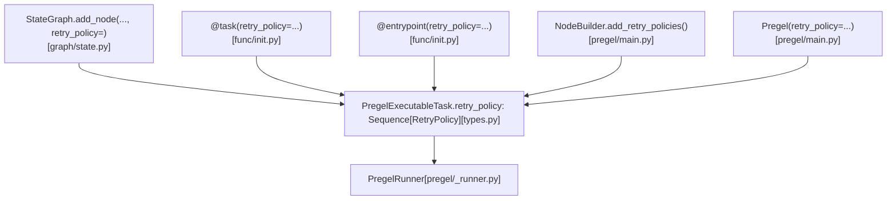
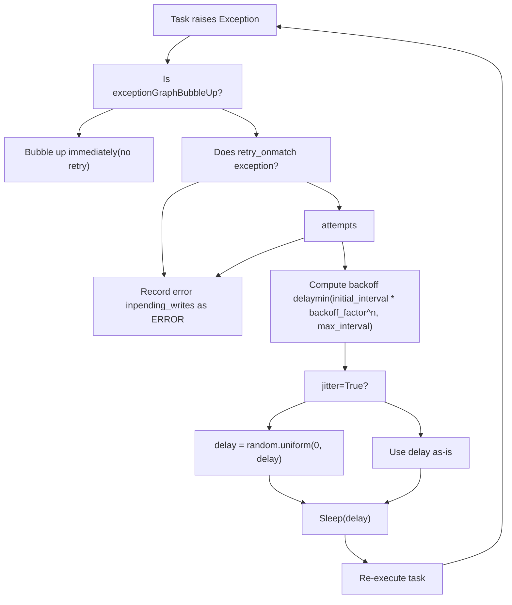
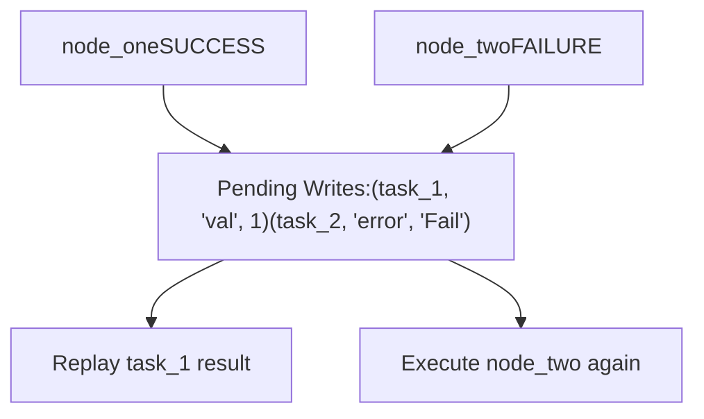
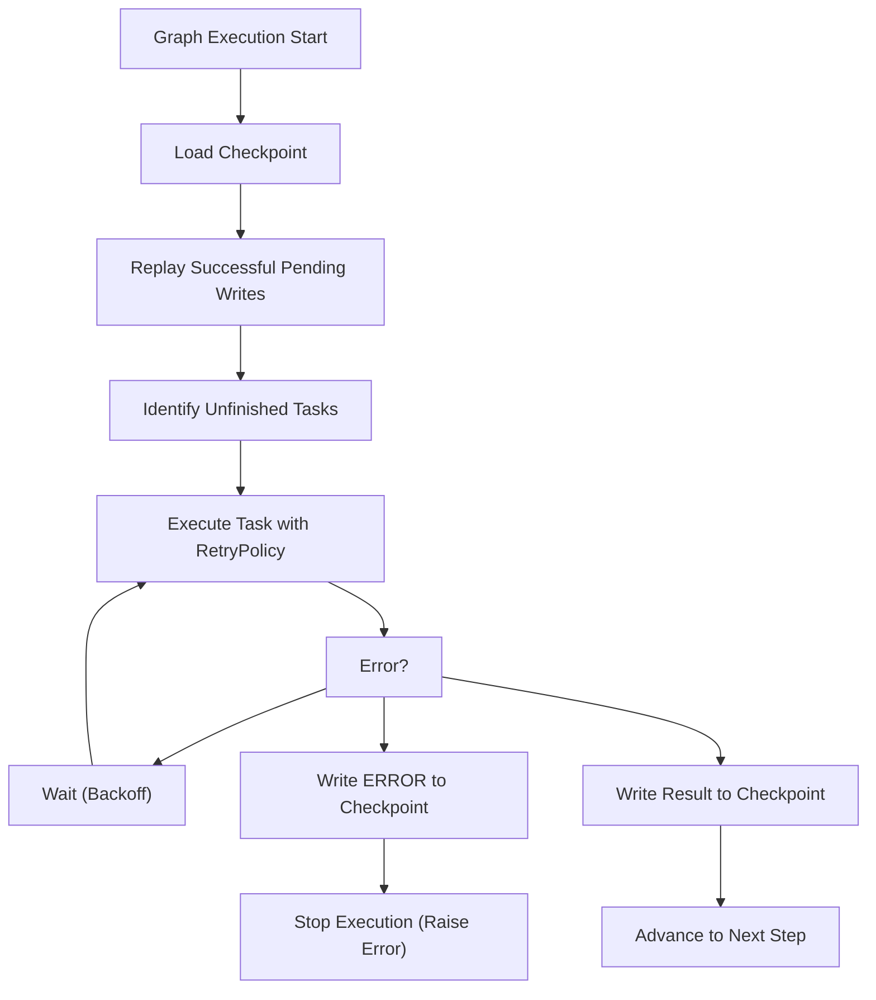

# 错误处理与重试策略

相关源文件

-   [libs/langgraph/langgraph/_internal/_config.py](https://github.com/langchain-ai/langgraph/blob/1fd51e8f/libs/langgraph/langgraph/_internal/_config.py)
-   [libs/langgraph/langgraph/_internal/_runnable.py](https://github.com/langchain-ai/langgraph/blob/1fd51e8f/libs/langgraph/langgraph/_internal/_runnable.py)
-   [libs/langgraph/langgraph/_internal/_scratchpad.py](https://github.com/langchain-ai/langgraph/blob/1fd51e8f/libs/langgraph/langgraph/_internal/_scratchpad.py)
-   [libs/langgraph/langgraph/constants.py](https://github.com/langchain-ai/langgraph/blob/1fd51e8f/libs/langgraph/langgraph/constants.py)
-   [libs/langgraph/langgraph/errors.py](https://github.com/langchain-ai/langgraph/blob/1fd51e8f/libs/langgraph/langgraph/errors.py)
-   [libs/langgraph/langgraph/func/__init__.py](https://github.com/langchain-ai/langgraph/blob/1fd51e8f/libs/langgraph/langgraph/func/__init__.py)
-   [libs/langgraph/langgraph/graph/state.py](https://github.com/langchain-ai/langgraph/blob/1fd51e8f/libs/langgraph/langgraph/graph/state.py)
-   [libs/langgraph/langgraph/pregel/__init__.py](https://github.com/langchain-ai/langgraph/blob/1fd51e8f/libs/langgraph/langgraph/pregel/__init__.py)
-   [libs/langgraph/langgraph/pregel/_algo.py](https://github.com/langchain-ai/langgraph/blob/1fd51e8f/libs/langgraph/langgraph/pregel/_algo.py)
-   [libs/langgraph/langgraph/pregel/_retry.py](https://github.com/langchain-ai/langgraph/blob/1fd51e8f/libs/langgraph/langgraph/pregel/_retry.py)
-   [libs/langgraph/langgraph/pregel/_runner.py](https://github.com/langchain-ai/langgraph/blob/1fd51e8f/libs/langgraph/langgraph/pregel/_runner.py)
-   [libs/langgraph/langgraph/pregel/debug.py](https://github.com/langchain-ai/langgraph/blob/1fd51e8f/libs/langgraph/langgraph/pregel/debug.py)
-   [libs/langgraph/langgraph/pregel/types.py](https://github.com/langchain-ai/langgraph/blob/1fd51e8f/libs/langgraph/langgraph/pregel/types.py)
-   [libs/langgraph/langgraph/runtime.py](https://github.com/langchain-ai/langgraph/blob/1fd51e8f/libs/langgraph/langgraph/runtime.py)
-   [libs/langgraph/langgraph/types.py](https://github.com/langchain-ai/langgraph/blob/1fd51e8f/libs/langgraph/langgraph/types.py)
-   [libs/langgraph/tests/__snapshots__/test_large_cases.ambr](https://github.com/langchain-ai/langgraph/blob/1fd51e8f/libs/langgraph/tests/__snapshots__/test_large_cases.ambr)
-   [libs/langgraph/tests/test_channels.py](https://github.com/langchain-ai/langgraph/blob/1fd51e8f/libs/langgraph/tests/test_channels.py)
-   [libs/langgraph/tests/test_checkpoint_migration.py](https://github.com/langchain-ai/langgraph/blob/1fd51e8f/libs/langgraph/tests/test_checkpoint_migration.py)
-   [libs/langgraph/tests/test_large_cases.py](https://github.com/langchain-ai/langgraph/blob/1fd51e8f/libs/langgraph/tests/test_large_cases.py)
-   [libs/langgraph/tests/test_large_cases_async.py](https://github.com/langchain-ai/langgraph/blob/1fd51e8f/libs/langgraph/tests/test_large_cases_async.py)
-   [libs/langgraph/tests/test_managed_values.py](https://github.com/langchain-ai/langgraph/blob/1fd51e8f/libs/langgraph/tests/test_managed_values.py)
-   [libs/langgraph/tests/test_parent_command.py](https://github.com/langchain-ai/langgraph/blob/1fd51e8f/libs/langgraph/tests/test_parent_command.py)
-   [libs/langgraph/tests/test_parent_command_async.py](https://github.com/langchain-ai/langgraph/blob/1fd51e8f/libs/langgraph/tests/test_parent_command_async.py)
-   [libs/langgraph/tests/test_pregel.py](https://github.com/langchain-ai/langgraph/blob/1fd51e8f/libs/langgraph/tests/test_pregel.py)
-   [libs/langgraph/tests/test_pregel_async.py](https://github.com/langchain-ai/langgraph/blob/1fd51e8f/libs/langgraph/tests/test_pregel_async.py)
-   [libs/langgraph/tests/test_retry.py](https://github.com/langchain-ai/langgraph/blob/1fd51e8f/libs/langgraph/tests/test_retry.py)
-   [libs/langgraph/tests/test_runnable.py](https://github.com/langchain-ai/langgraph/blob/1fd51e8f/libs/langgraph/tests/test_runnable.py)

本页说明 LangGraph 如何处理节点级错误、如何配置自动重试行为，以及在发生失败时如何保留部分执行状态。重点包括 `RetryPolicy` 类型、它如何附加到节点与任务、退避与重试执行机制，以及错误与检查点之间的关系。

关于 human-in-the-loop 中断（它们使用 `GraphInterrupt`，但并非错误），参见 [3.7](https://github.com/langchain-ai/langgraph/blob/1fd51e8f/3.7)；关于支持执行恢复的检查点系统，参见 [4.1](https://github.com/langchain-ai/langgraph/blob/1fd51e8f/4.1)

---

## RetryPolicy

`RetryPolicy` 是定义在 [libs/langgraph/langgraph/types.py225-244](https://github.com/langchain-ai/langgraph/blob/1fd51e8f/libs/langgraph/langgraph/types.py#L225-L244) 的 `TypedDict`，用于为节点或任务配置自动重试行为。

| 字段 | 类型 | 默认值 | 描述 |
| --- | --- | --- | --- |
| `initial_interval` | `float` | `0.5` | 首次重试前等待的秒数 |
| `backoff_factor` | `float` | `2.0` | 每次重试后应用于间隔的乘数 |
| `max_interval` | `float` | `128.0` | 重试间最大秒数 |
| `max_attempts` | `int` | `3` | 总尝试次数，包含首次执行 |
| `jitter` | `bool` | `True` | 向计算出的间隔加入随机扰动 |
| `retry_on` | `type[Exception] | Sequence[type[Exception]] | Callable[[Exception], bool]` | `default_retry_on` | 用于判定哪些异常应触发重试的过滤器 |

第 `n` 次尝试（从 1 开始计数，1 表示第一次重试）的计算延迟为：

```
delay = min(initial_interval * (backoff_factor ** (n - 1)), max_interval)if jitter:    import random    delay = random.uniform(0, delay)
```
### `retry_on` 与 `default_retry_on`

`retry_on` 字段控制对哪些异常执行重试。它接受单个异常类、异常类序列或谓词函数。默认值为 `default_retry_on`，从 `langgraph._internal._retry` 导入 [libs/langgraph/langgraph/types.py28](https://github.com/langchain-ai/langgraph/blob/1fd51e8f/libs/langgraph/langgraph/types.py#L28-L28)。默认会包含瞬时错误。控制流信号如 `GraphInterrupt` 和 `ParentCommand` 无论策略如何都不会重试 [libs/langgraph/langgraph/errors.py](https://github.com/langchain-ai/langgraph/blob/1fd51e8f/libs/langgraph/langgraph/errors.py)

### 多策略

`StateGraph.add_node` 与 `@task` 都接受 `retry_policy: RetryPolicy | Sequence[RetryPolicy]`。当提供一个序列时，会应用 **第一个其 `retry_on` 与异常匹配的策略** [libs/langgraph/langgraph/func/__init__.py200-206](https://github.com/langchain-ai/langgraph/blob/1fd51e8f/libs/langgraph/langgraph/func/__init__.py#L200-L206)

---

## 附加重试策略

**RetryPolicy** 可以附加在图/`Pregel` 级别、节点级别或任务（函数式 API）级别。

### 图示：RetryPolicy 附加点


来源： [libs/langgraph/langgraph/types.py225-244](https://github.com/langchain-ai/langgraph/blob/1fd51e8f/libs/langgraph/langgraph/types.py#L225-L244) [libs/langgraph/langgraph/graph/state.py569-582](https://github.com/langchain-ai/langgraph/blob/1fd51e8f/libs/langgraph/langgraph/graph/state.py#L569-L582) [libs/langgraph/langgraph/func/__init__.py94-126](https://github.com/langchain-ai/langgraph/blob/1fd51e8f/libs/langgraph/langgraph/func/__init__.py#L94-L126) [libs/langgraph/langgraph/pregel/main.py1-2](https://github.com/langchain-ai/langgraph/blob/1fd51e8f/libs/langgraph/langgraph/pregel/main.py#L1-L2)

#### `StateGraph.add_node`

向 `StateGraph` 添加节点时，`retry_policy` 会传递到底层 `StateNodeSpec` [libs/langgraph/langgraph/graph/state.py569-582](https://github.com/langchain-ai/langgraph/blob/1fd51e8f/libs/langgraph/langgraph/graph/state.py#L569-L582)

#### `@task` 装饰器

`@task` 装饰器会把函数包装成 `_TaskFunction`，并在其中保存 `retry_policy` [libs/langgraph/langgraph/func/__init__.py47-70](https://github.com/langchain-ai/langgraph/blob/1fd51e8f/libs/langgraph/langgraph/func/__init__.py#L47-L70)。调用时，它会携带该策略执行 `call()` [libs/langgraph/langgraph/func/__init__.py73-79](https://github.com/langchain-ai/langgraph/blob/1fd51e8f/libs/langgraph/langgraph/func/__init__.py#L73-L79)

---

## 重试执行机制

`PregelRunner` 负责执行任务并实现重试逻辑。每个 `PregelExecutableTask` 都带有其 `retry_policy` 序列。当任务抛出异常时，runner 会评估策略。

### 图示：重试决策流程


来源： [libs/langgraph/langgraph/pregel/_runner.py](https://github.com/langchain-ai/langgraph/blob/1fd51e8f/libs/langgraph/langgraph/pregel/_runner.py) [libs/langgraph/langgraph/types.py225-244](https://github.com/langchain-ai/langgraph/blob/1fd51e8f/libs/langgraph/langgraph/types.py#L225-L244) [libs/langgraph/langgraph/pregel/_retry.py](https://github.com/langchain-ai/langgraph/blob/1fd51e8f/libs/langgraph/langgraph/pregel/_retry.py)

### 并行取消

当节点在同一个 superstep 中并行运行，且某个节点失败（并已耗尽重试）时，执行引擎会处理任务取消。在异步模式下，这通常意味着取消同级任务以避免浪费计算资源。测试在 [libs/langgraph/tests/test_pregel_async.py175-210](https://github.com/langchain-ai/langgraph/blob/1fd51e8f/libs/langgraph/tests/test_pregel_async.py#L175-L210) 中验证了该行为。

---

## 错误传播与状态

当节点失败时，错误会以待写入记录的形式保存，键为 `ERROR`（定义于 [libs/langgraph/langgraph/_internal/_constants.py](https://github.com/langchain-ai/langgraph/blob/1fd51e8f/libs/langgraph/langgraph/_internal/_constants.py)）。检查点 **不会推进** 到下一步；相反，错误会与当前步骤的任务 ID 关联。

### 图示：Pending Writes 中的错误

来源： [libs/langgraph/langgraph/pregel/_loop.py](https://github.com/langchain-ai/langgraph/blob/1fd51e8f/libs/langgraph/langgraph/pregel/_loop.py) [libs/langgraph/tests/test_pregel.py158-211](https://github.com/langchain-ai/langgraph/blob/1fd51e8f/libs/langgraph/tests/test_pregel.py#L158-L211)

检查点中的 `pending_writes` 会存储失败信息。这使系统在恢复图执行时能够精确知道是哪一个任务失败 [libs/langgraph/langgraph/pregel/debug.py186-214](https://github.com/langchain-ai/langgraph/blob/1fd51e8f/libs/langgraph/langgraph/pregel/debug.py#L186-L214)

---

## 失败后的恢复

当图在同一线程上再次调用且该线程存在失败状态时，`PregelLoop` 会加载待写入记录：

-   **成功任务**：重放写入。
-   **失败任务**：从头重新执行（使用全新的重试预算）。

### 图示：恢复行为


来源： [libs/langgraph/tests/test_pregel.py51-112](https://github.com/langchain-ai/langgraph/blob/1fd51e8f/libs/langgraph/tests/test_pregel.py#L51-L112) [libs/langgraph/langgraph/pregel/debug.py186-214](https://github.com/langchain-ai/langgraph/blob/1fd51e8f/libs/langgraph/langgraph/pregel/debug.py#L186-L214)

---

## 错误类型参考

错误类定义在 [libs/langgraph/langgraph/errors.py](https://github.com/langchain-ai/langgraph/blob/1fd51e8f/libs/langgraph/langgraph/errors.py)

| 类 | 基类 | 描述 |
| --- | --- | --- |
| `GraphRecursionError` | `RecursionError` | 当超过 `recursion_limit` 时抛出 [libs/langgraph/langgraph/errors.py48](https://github.com/langchain-ai/langgraph/blob/1fd51e8f/libs/langgraph/langgraph/errors.py#L48-L48) |
| `InvalidUpdateError` | `Exception` | 在无效通道更新或 reducer 失败时抛出 [libs/langgraph/langgraph/errors.py49](https://github.com/langchain-ai/langgraph/blob/1fd51e8f/libs/langgraph/langgraph/errors.py#L49-L49) |
| `ParentCommand` | `GraphBubbleUp` | 用于将命令向上传递到父图 [libs/langgraph/langgraph/errors.py50](https://github.com/langchain-ai/langgraph/blob/1fd51e8f/libs/langgraph/langgraph/errors.py#L50-L50) |

### `GraphRecursionError`

当 superstep 数量超过配置上限时由循环抛出。这可防止循环图中的无限循环 [libs/langgraph/tests/test_pregel.py49](https://github.com/langchain-ai/langgraph/blob/1fd51e8f/libs/langgraph/tests/test_pregel.py#L49-L49)

### 中断不是错误

`GraphInterrupt`（及其别名 `NodeInterrupt`）用于 human-in-the-loop 模式。它们不被视为失败，也不会触发 `RetryPolicy` [libs/langgraph/langgraph/types.py71](https://github.com/langchain-ai/langgraph/blob/1fd51e8f/libs/langgraph/langgraph/types.py#L71-L71)

---

## 检查点错误

如果检查点器本身失败（例如在 `aput` 期间出现数据库连接错误），LangGraph 会立即抛出该错误。测试验证了有缺陷的检查点器在 `aget_tuple`、`aput` 和 `aput_writes` 期间会正确传播异常 [libs/langgraph/tests/test_pregel_async.py91-210](https://github.com/langchain-ai/langgraph/blob/1fd51e8f/libs/langgraph/tests/test_pregel_async.py#L91-L210)

| 故障点 | 来源 |
| --- | --- |
| `aget_tuple` | [libs/langgraph/tests/test_pregel_async.py93-94](https://github.com/langchain-ai/langgraph/blob/1fd51e8f/libs/langgraph/tests/test_pregel_async.py#L93-L94) |
| `aput` | [libs/langgraph/tests/test_pregel_async.py97-104](https://github.com/langchain-ai/langgraph/blob/1fd51e8f/libs/langgraph/tests/test_pregel_async.py#L97-L104) |
| `aput_writes` | [libs/langgraph/tests/test_pregel_async.py106-110](https://github.com/langchain-ai/langgraph/blob/1fd51e8f/libs/langgraph/tests/test_pregel_async.py#L106-L110) |
| `get_next_version` | [libs/langgraph/tests/test_pregel_async.py112-114](https://github.com/langchain-ai/langgraph/blob/1fd51e8f/libs/langgraph/tests/test_pregel_async.py#L112-L114) |

---

## RetryPolicy 与检查点的交互总结


来源： [libs/langgraph/langgraph/pregel/_loop.py](https://github.com/langchain-ai/langgraph/blob/1fd51e8f/libs/langgraph/langgraph/pregel/_loop.py) [libs/langgraph/langgraph/pregel/_runner.py](https://github.com/langchain-ai/langgraph/blob/1fd51e8f/libs/langgraph/langgraph/pregel/_runner.py) [libs/langgraph/langgraph/types.py225-244](https://github.com/langchain-ai/langgraph/blob/1fd51e8f/libs/langgraph/langgraph/types.py#L225-L244)
