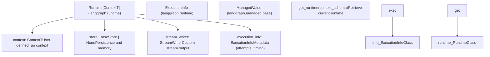
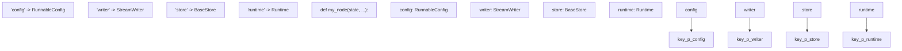
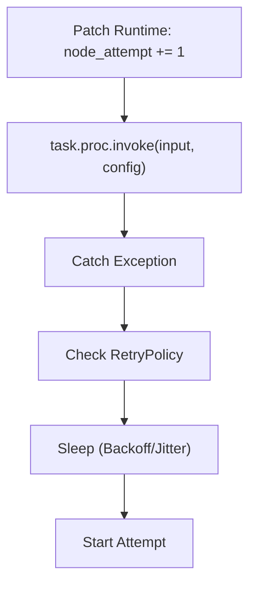

# 运行时与依赖注入

相关源文件

-   [libs/langgraph/langgraph/_internal/_config.py](https://github.com/langchain-ai/langgraph/blob/1fd51e8f/libs/langgraph/langgraph/_internal/_config.py)
-   [libs/langgraph/langgraph/_internal/_runnable.py](https://github.com/langchain-ai/langgraph/blob/1fd51e8f/libs/langgraph/langgraph/_internal/_runnable.py)
-   [libs/langgraph/langgraph/_internal/_scratchpad.py](https://github.com/langchain-ai/langgraph/blob/1fd51e8f/libs/langgraph/langgraph/_internal/_scratchpad.py)
-   [libs/langgraph/langgraph/managed/base.py](https://github.com/langchain-ai/langgraph/blob/1fd51e8f/libs/langgraph/langgraph/managed/base.py)
-   [libs/langgraph/langgraph/managed/is_last_step.py](https://github.com/langchain-ai/langgraph/blob/1fd51e8f/libs/langgraph/langgraph/managed/is_last_step.py)
-   [libs/langgraph/langgraph/pregel/_algo.py](https://github.com/langchain-ai/langgraph/blob/1fd51e8f/libs/langgraph/langgraph/pregel/_algo.py)
-   [libs/langgraph/langgraph/pregel/_retry.py](https://github.com/langchain-ai/langgraph/blob/1fd51e8f/libs/langgraph/langgraph/pregel/_retry.py)
-   [libs/langgraph/langgraph/pregel/_runner.py](https://github.com/langchain-ai/langgraph/blob/1fd51e8f/libs/langgraph/langgraph/pregel/_runner.py)
-   [libs/langgraph/langgraph/runtime.py](https://github.com/langchain-ai/langgraph/blob/1fd51e8f/libs/langgraph/langgraph/runtime.py)
-   [libs/langgraph/tests/test_channels.py](https://github.com/langchain-ai/langgraph/blob/1fd51e8f/libs/langgraph/tests/test_channels.py)
-   [libs/langgraph/tests/test_managed_values.py](https://github.com/langchain-ai/langgraph/blob/1fd51e8f/libs/langgraph/tests/test_managed_values.py)
-   [libs/langgraph/tests/test_parent_command.py](https://github.com/langchain-ai/langgraph/blob/1fd51e8f/libs/langgraph/tests/test_parent_command.py)
-   [libs/langgraph/tests/test_parent_command_async.py](https://github.com/langchain-ai/langgraph/blob/1fd51e8f/libs/langgraph/tests/test_parent_command_async.py)
-   [libs/langgraph/tests/test_retry.py](https://github.com/langchain-ai/langgraph/blob/1fd51e8f/libs/langgraph/tests/test_retry.py)
-   [libs/langgraph/tests/test_runnable.py](https://github.com/langchain-ai/langgraph/blob/1fd51e8f/libs/langgraph/tests/test_runnable.py)

## 目的与范围

本文解释 LangGraph 的运行时依赖注入系统（在 v0.6.0 引入）。该系统使节点和工具无需手动传参，即可接收执行作用域依赖（context、store、stream writer 和执行元数据）。`Runtime` 类将这些依赖打包，并基于类型注解通过自动参数注入提供给节点函数。

关于状态管理与通道的信息，参见 [State Management and Channels](/langchain-ai/langgraph/3.4-state-management-and-channels)。关于 Store 系统本身的细节，参见 [Store System](/langchain-ai/langgraph/4.3-store-system)。

---

## Runtime 类结构

`Runtime` 类是一个泛型 dataclass，用于打包图执行期间节点可用的运行作用域依赖和工具。

### Runtime 与执行实体

下图将自然语言中的执行上下文概念与 LangGraph runtime 中使用的具体代码实体对应起来。


**来源：** [libs/langgraph/langgraph/runtime.py17-135](https://github.com/langchain-ai/langgraph/blob/1fd51e8f/libs/langgraph/langgraph/runtime.py#L17-L135) [libs/langgraph/langgraph/managed/base.py18-23](https://github.com/langchain-ai/langgraph/blob/1fd51e8f/libs/langgraph/langgraph/managed/base.py#L18-L23)

### Runtime 属性与 Execution Info

| 属性 | 类型 | 用途 |
| --- | --- | --- |
| `context` | `ContextT` | 图运行的静态上下文（例如 `user_id`、`db_conn`），由 `context_schema` 定义。 |
| `store` | `BaseStore | None` | 用于持久化和长期记忆的键值存储。 |
| `stream_writer` | `StreamWriter` | 向自定义流模式写入数据的函数。 |
| `execution_info` | `ExecutionInfo` | 当前节点执行的只读元数据。 |
| `previous` | `Any` | 线程上的前一个返回值（仅函数式 API 且启用 checkpointer 时可用）。 |

`ExecutionInfo` 类为当前执行提供了具体的跟踪数据：

-   `node_attempt`：当前节点执行尝试次数（从 1 开始），用于重试逻辑。 [libs/langgraph/langgraph/runtime.py20-21](https://github.com/langchain-ai/langgraph/blob/1fd51e8f/libs/langgraph/langgraph/runtime.py#L20-L21)
-   `node_first_attempt_time`：该节点首次尝试开始时的 Unix 时间戳。 [libs/langgraph/langgraph/runtime.py23-24](https://github.com/langchain-ai/langgraph/blob/1fd51e8f/libs/langgraph/langgraph/runtime.py#L23-L24)

**来源：** [libs/langgraph/langgraph/runtime.py17-29](https://github.com/langchain-ai/langgraph/blob/1fd51e8f/libs/langgraph/langgraph/runtime.py#L17-L29) [libs/langgraph/langgraph/runtime.py116-134](https://github.com/langchain-ai/langgraph/blob/1fd51e8f/libs/langgraph/langgraph/runtime.py#L116-L134)

---

## 可注入依赖

LangGraph 支持基于函数签名和类型注解，向节点函数、工具和任务自动注入多种依赖。该机制由 `RunnableCallable` 类管理。

### 注入关联图

该图将内部 `KWARGS_CONFIG_KEYS` 配置映射到用户节点函数中可用的参数。


**来源：** [libs/langgraph/langgraph/_internal/_runnable.py132-184](https://github.com/langchain-ai/langgraph/blob/1fd51e8f/libs/langgraph/langgraph/_internal/_runnable.py#L132-L184)

### 支持的可注入参数

注入系统识别以下参数名与类型：

1.  **`config: RunnableConfig`**：当前 runnable 配置。始终可用。 [libs/langgraph/langgraph/_internal/_runnable.py133-145](https://github.com/langchain-ai/langgraph/blob/1fd51e8f/libs/langgraph/langgraph/_internal/_runnable.py#L133-L145)
2.  **`writer: StreamWriter`**：写入自定义流的函数。来自 `runtime.stream_writer`。 [libs/langgraph/langgraph/_internal/_runnable.py147-151](https://github.com/langchain-ai/langgraph/blob/1fd51e8f/libs/langgraph/langgraph/_internal/_runnable.py#L147-L151)
3.  **`store: BaseStore`**：键值存储实例。来自 `runtime.store`。 [libs/langgraph/langgraph/_internal/_runnable.py153-170](https://github.com/langchain-ai/langgraph/blob/1fd51e8f/libs/langgraph/langgraph/_internal/_runnable.py#L153-L170)
4.  **`runtime: Runtime[Context]`**：完整运行时对象，可访问 `execution_info` 和 `context`。 [libs/langgraph/langgraph/_internal/_runnable.py178-184](https://github.com/langchain-ai/langgraph/blob/1fd51e8f/libs/langgraph/langgraph/_internal/_runnable.py#L178-L184)
5.  **`previous: Any`**：前一个返回值。仅在函数式 API 且启用 checkpointer 时可用。 [libs/langgraph/langgraph/_internal/_runnable.py172-176](https://github.com/langchain-ai/langgraph/blob/1fd51e8f/libs/langgraph/langgraph/_internal/_runnable.py#L172-L176)

**来源：** [libs/langgraph/langgraph/_internal/_runnable.py132-184](https://github.com/langchain-ai/langgraph/blob/1fd51e8f/libs/langgraph/langgraph/_internal/_runnable.py#L132-L184)

---

## 注入机制

`RunnableCallable` 类通过检查函数签名并自动提供所需参数来实现依赖注入。所需参数来自存储在 runnable config `__pregel_runtime` 键下的 `Runtime` 对象。

### 签名检查与调用

1.  **检查**：初始化期间，`RunnableCallable` 使用 `inspect.signature` 检查函数签名。它会将与 `KWARGS_CONFIG_KEYS` 匹配的键填入 `self.func_accepts`。 [libs/langgraph/langgraph/_internal/_runnable.py293-320](https://github.com/langchain-ai/langgraph/blob/1fd51e8f/libs/langgraph/langgraph/_internal/_runnable.py#L293-L320)
2.  **解析**：运行时，`invoke()` 或 `ainvoke()` 从 `config[CONF][CONFIG_KEY_RUNTIME]` 读取 `Runtime` 对象。 [libs/langgraph/langgraph/_internal/_runnable.py347-353](https://github.com/langchain-ai/langgraph/blob/1fd51e8f/libs/langgraph/langgraph/_internal/_runnable.py#L347-L353)
3.  **注入**：它遍历 `func_accepts`。若参数为 `runtime`，注入整个对象；若为 `writer` 或 `store`，则从 `Runtime` 实例中提取对应属性。 [libs/langgraph/langgraph/_internal/_runnable.py355-403](https://github.com/langchain-ai/langgraph/blob/1fd51e8f/libs/langgraph/langgraph/_internal/_runnable.py#L355-L403)

**来源：** [libs/langgraph/langgraph/_internal/_runnable.py293-403](https://github.com/langchain-ai/langgraph/blob/1fd51e8f/libs/langgraph/langgraph/_internal/_runnable.py#L293-L403) [libs/langgraph/langgraph/_internal/_constants.py44](https://github.com/langchain-ai/langgraph/blob/1fd51e8f/libs/langgraph/langgraph/_internal/_constants.py#L44-L44)

---

## Managed Values

Managed values 提供了一种向节点注入“计算得到”或“派生”执行上下文的方式。与通过 config 传递的 `Runtime` 对象不同，`ManagedValue` 实现会基于 `PregelScratchpad` 计算值。

| 类 | 类型 | 用途 |
| --- | --- | --- |
| `IsLastStepManager` | `bool` | 作为 `IsLastStep` 注入。如果当前步骤是允许的最后一步，则返回 `True`。 |
| `RemainingStepsManager` | `int` | 作为 `RemainingSteps` 注入。返回达到递归上限前剩余的步数。 |

**来源：** [libs/langgraph/langgraph/managed/is_last_step.py9-25](https://github.com/langchain-ai/langgraph/blob/1fd51e8f/libs/langgraph/langgraph/managed/is_last_step.py#L9-L25) [libs/langgraph/langgraph/managed/base.py18-23](https://github.com/langchain-ai/langgraph/blob/1fd51e8f/libs/langgraph/langgraph/managed/base.py#L18-L23)

---

## Runtime 与重试集成

运行时系统与图的重试机制深度集成。在重试期间，会补丁更新 `Runtime` 对象中的 `ExecutionInfo`。

### 重试循环与 Runtime 补丁


当任务失败且匹配某个 `RetryPolicy` 时，执行引擎会：

1.  递增 `attempts` 计数器。 [libs/langgraph/langgraph/pregel/_retry.py131](https://github.com/langchain-ai/langgraph/blob/1fd51e8f/libs/langgraph/langgraph/pregel/_retry.py#L131-L131)
2.  调用 `runtime.patch_execution_info(node_attempt=attempts + 1)`。 [libs/langgraph/langgraph/pregel/_retry.py85-91](https://github.com/langchain-ai/langgraph/blob/1fd51e8f/libs/langgraph/langgraph/pregel/_retry.py#L85-L91)
3.  在下一次调用前，用新的补丁化 `Runtime` 更新 `RunnableConfig`。 [libs/langgraph/langgraph/pregel/_retry.py82-91](https://github.com/langchain-ai/langgraph/blob/1fd51e8f/libs/langgraph/langgraph/pregel/_retry.py#L82-L91)

**来源：** [libs/langgraph/langgraph/pregel/_retry.py57-91](https://github.com/langchain-ai/langgraph/blob/1fd51e8f/libs/langgraph/langgraph/pregel/_retry.py#L57-L91) [libs/langgraph/langgraph/runtime.py157-162](https://github.com/langchain-ai/langgraph/blob/1fd51e8f/libs/langgraph/langgraph/runtime.py#L157-L162)

---

## 使用示例

### 访问 Execution Info 和 Store

节点可以使用 `Runtime` 对象，基于重试次数做决策，或访问跨线程 `BaseStore`。

```
from langgraph.runtime import Runtimefrom langgraph.store.base import BaseStore def my_node(state: dict, runtime: Runtime, store: BaseStore):    # Check attempt number    attempt = runtime.execution_info.node_attempt        # Access store (injected directly or via runtime)    user_id = runtime.context.get("user_id")    memory = store.get(("memories", user_id), "profile")        return {"attempt_logged": attempt}
```
**来源：** [libs/langgraph/langgraph/runtime.py86-95](https://github.com/langchain-ai/langgraph/blob/1fd51e8f/libs/langgraph/langgraph/runtime.py#L86-L95) [libs/langgraph/tests/test_retry.py175-183](https://github.com/langchain-ai/langgraph/blob/1fd51e8f/libs/langgraph/tests/test_retry.py#L175-L183)

### 使用 Managed Values

```
from langgraph.managed.is_last_step import IsLastStep def smart_node(state: dict, is_last_step: IsLastStep):    if is_last_step:        return {"response": "I'm running out of time, here is my best guess..."}    return {"response": "Let me think more about this."}
```
**来源：** [libs/langgraph/langgraph/managed/is_last_step.py9-15](https://github.com/langchain-ai/langgraph/blob/1fd51e8f/libs/langgraph/langgraph/managed/is_last_step.py#L9-L15)

---

## 配置摘要

运行时系统依赖 `_constants.py` 中定义的内部配置键，并由 `_config.py` 管理。

| 常量 | 值 | 描述 |
| --- | --- | --- |
| `CONFIG_KEY_RUNTIME` | `"__pregel_runtime"` | `configurable` 中 `Runtime` 实例对应的键。 |
| `CONFIG_KEY_SCRATCHPAD` | `"__pregel_scratchpad"` | `PregelScratchpad` 对应的键，供 managed values 使用。 |
| `CONFIG_KEY_READ` | `"__pregel_read"` | 注入到条件边中的状态读取函数对应的键。 |

**来源：** [libs/langgraph/langgraph/_internal/_constants.py44-46](https://github.com/langchain-ai/langgraph/blob/1fd51e8f/libs/langgraph/langgraph/_internal/_constants.py#L44-L46) [libs/langgraph/langgraph/pregel/_algo.py181-209](https://github.com/langchain-ai/langgraph/blob/1fd51e8f/libs/langgraph/langgraph/pregel/_algo.py#L181-L209)
