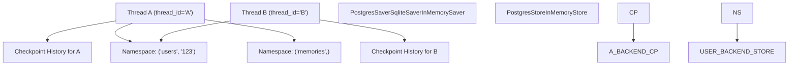

# 持久化与记忆

相关源文件

-   [libs/checkpoint-postgres/langgraph/checkpoint/postgres/__init__.py](https://github.com/langchain-ai/langgraph/blob/1fd51e8f/libs/checkpoint-postgres/langgraph/checkpoint/postgres/__init__.py)
-   [libs/checkpoint-postgres/langgraph/checkpoint/postgres/aio.py](https://github.com/langchain-ai/langgraph/blob/1fd51e8f/libs/checkpoint-postgres/langgraph/checkpoint/postgres/aio.py)
-   [libs/checkpoint-postgres/langgraph/checkpoint/postgres/base.py](https://github.com/langchain-ai/langgraph/blob/1fd51e8f/libs/checkpoint-postgres/langgraph/checkpoint/postgres/base.py)
-   [libs/checkpoint-postgres/langgraph/checkpoint/postgres/shallow.py](https://github.com/langchain-ai/langgraph/blob/1fd51e8f/libs/checkpoint-postgres/langgraph/checkpoint/postgres/shallow.py)
-   [libs/checkpoint-postgres/langgraph/store/postgres/aio.py](https://github.com/langchain-ai/langgraph/blob/1fd51e8f/libs/checkpoint-postgres/langgraph/store/postgres/aio.py)
-   [libs/checkpoint-postgres/langgraph/store/postgres/base.py](https://github.com/langchain-ai/langgraph/blob/1fd51e8f/libs/checkpoint-postgres/langgraph/store/postgres/base.py)
-   [libs/checkpoint-postgres/tests/conftest.py](https://github.com/langchain-ai/langgraph/blob/1fd51e8f/libs/checkpoint-postgres/tests/conftest.py)
-   [libs/checkpoint-postgres/tests/test_async.py](https://github.com/langchain-ai/langgraph/blob/1fd51e8f/libs/checkpoint-postgres/tests/test_async.py)
-   [libs/checkpoint-postgres/tests/test_async_store.py](https://github.com/langchain-ai/langgraph/blob/1fd51e8f/libs/checkpoint-postgres/tests/test_async_store.py)
-   [libs/checkpoint-postgres/tests/test_store.py](https://github.com/langchain-ai/langgraph/blob/1fd51e8f/libs/checkpoint-postgres/tests/test_store.py)
-   [libs/checkpoint-postgres/tests/test_sync.py](https://github.com/langchain-ai/langgraph/blob/1fd51e8f/libs/checkpoint-postgres/tests/test_sync.py)
-   [libs/checkpoint-postgres/uv.lock](https://github.com/langchain-ai/langgraph/blob/1fd51e8f/libs/checkpoint-postgres/uv.lock)
-   [libs/checkpoint-sqlite/langgraph/checkpoint/sqlite/__init__.py](https://github.com/langchain-ai/langgraph/blob/1fd51e8f/libs/checkpoint-sqlite/langgraph/checkpoint/sqlite/__init__.py)
-   [libs/checkpoint-sqlite/langgraph/checkpoint/sqlite/aio.py](https://github.com/langchain-ai/langgraph/blob/1fd51e8f/libs/checkpoint-sqlite/langgraph/checkpoint/sqlite/aio.py)
-   [libs/checkpoint-sqlite/langgraph/checkpoint/sqlite/utils.py](https://github.com/langchain-ai/langgraph/blob/1fd51e8f/libs/checkpoint-sqlite/langgraph/checkpoint/sqlite/utils.py)
-   [libs/checkpoint-sqlite/tests/test_aiosqlite.py](https://github.com/langchain-ai/langgraph/blob/1fd51e8f/libs/checkpoint-sqlite/tests/test_aiosqlite.py)
-   [libs/checkpoint-sqlite/tests/test_sqlite.py](https://github.com/langchain-ai/langgraph/blob/1fd51e8f/libs/checkpoint-sqlite/tests/test_sqlite.py)
-   [libs/checkpoint-sqlite/uv.lock](https://github.com/langchain-ai/langgraph/blob/1fd51e8f/libs/checkpoint-sqlite/uv.lock)
-   [libs/checkpoint/langgraph/checkpoint/base/__init__.py](https://github.com/langchain-ai/langgraph/blob/1fd51e8f/libs/checkpoint/langgraph/checkpoint/base/__init__.py)
-   [libs/checkpoint/langgraph/checkpoint/memory/__init__.py](https://github.com/langchain-ai/langgraph/blob/1fd51e8f/libs/checkpoint/langgraph/checkpoint/memory/__init__.py)
-   [libs/checkpoint/langgraph/checkpoint/serde/jsonplus.py](https://github.com/langchain-ai/langgraph/blob/1fd51e8f/libs/checkpoint/langgraph/checkpoint/serde/jsonplus.py)
-   [libs/checkpoint/langgraph/checkpoint/serde/types.py](https://github.com/langchain-ai/langgraph/blob/1fd51e8f/libs/checkpoint/langgraph/checkpoint/serde/types.py)
-   [libs/checkpoint/langgraph/store/base/__init__.py](https://github.com/langchain-ai/langgraph/blob/1fd51e8f/libs/checkpoint/langgraph/store/base/__init__.py)
-   [libs/checkpoint/langgraph/store/base/batch.py](https://github.com/langchain-ai/langgraph/blob/1fd51e8f/libs/checkpoint/langgraph/store/base/batch.py)
-   [libs/checkpoint/langgraph/store/base/embed.py](https://github.com/langchain-ai/langgraph/blob/1fd51e8f/libs/checkpoint/langgraph/store/base/embed.py)
-   [libs/checkpoint/langgraph/store/memory/__init__.py](https://github.com/langchain-ai/langgraph/blob/1fd51e8f/libs/checkpoint/langgraph/store/memory/__init__.py)
-   [libs/checkpoint/pyproject.toml](https://github.com/langchain-ai/langgraph/blob/1fd51e8f/libs/checkpoint/pyproject.toml)
-   [libs/checkpoint/tests/test_jsonplus.py](https://github.com/langchain-ai/langgraph/blob/1fd51e8f/libs/checkpoint/tests/test_jsonplus.py)
-   [libs/checkpoint/tests/test_memory.py](https://github.com/langchain-ai/langgraph/blob/1fd51e8f/libs/checkpoint/tests/test_memory.py)
-   [libs/checkpoint/tests/test_store.py](https://github.com/langchain-ai/langgraph/blob/1fd51e8f/libs/checkpoint/tests/test_store.py)
-   [libs/checkpoint/uv.lock](https://github.com/langchain-ai/langgraph/blob/1fd51e8f/libs/checkpoint/uv.lock)
-   [libs/langgraph/pyproject.toml](https://github.com/langchain-ai/langgraph/blob/1fd51e8f/libs/langgraph/pyproject.toml)
-   [libs/langgraph/tests/__snapshots__/test_pregel.ambr](https://github.com/langchain-ai/langgraph/blob/1fd51e8f/libs/langgraph/tests/__snapshots__/test_pregel.ambr)
-   [libs/langgraph/tests/__snapshots__/test_pregel_async.ambr](https://github.com/langchain-ai/langgraph/blob/1fd51e8f/libs/langgraph/tests/__snapshots__/test_pregel_async.ambr)
-   [libs/langgraph/tests/memory_assert.py](https://github.com/langchain-ai/langgraph/blob/1fd51e8f/libs/langgraph/tests/memory_assert.py)
-   [libs/langgraph/uv.lock](https://github.com/langchain-ai/langgraph/blob/1fd51e8f/libs/langgraph/uv.lock)
-   [libs/prebuilt/pyproject.toml](https://github.com/langchain-ai/langgraph/blob/1fd51e8f/libs/prebuilt/pyproject.toml)
-   [libs/prebuilt/uv.lock](https://github.com/langchain-ai/langgraph/blob/1fd51e8f/libs/prebuilt/uv.lock)
-   [libs/sdk-py/uv.lock](https://github.com/langchain-ai/langgraph/blob/1fd51e8f/libs/sdk-py/uv.lock)

## 概览

LangGraph 的持久化与记忆系统分为两个彼此独立但互补的层，用于支持有状态应用。

| 层 | 接口 | 范围 | 主要用途 |
| --- | --- | --- | --- |
| **Checkpointer** | `BaseCheckpointSaver` | 每线程 | 持久执行、错误恢复与“时间旅行”（状态回放） |
| **Store** | `BaseStore` | 跨线程 | 长期记忆、共享知识、用户画像与全局状态 |

**Checkpointers** 会在每个 superstep 后保存图状态的完整快照。它们按 `thread_id` 建索引，因此可以暂停并恢复特定会话或工作流。**Stores** 提供全局的、按命名空间和键组织的文档存储，任何线程都可访问，因此非常适合需要跨不同会话持续存在的信息（例如在多个彼此独立的线程中记住同一个用户姓名）。

### 系统架构

下图展示这两个系统如何与图执行线程交互。

**持久化架构概览**

来源： [libs/checkpoint/langgraph/checkpoint/base/__init__.py118-150](https://github.com/langchain-ai/langgraph/blob/1fd51e8f/libs/checkpoint/langgraph/checkpoint/base/__init__.py#L118-L150) [libs/checkpoint/langgraph/store/base/__init__.py51-100](https://github.com/langchain-ai/langgraph/blob/1fd51e8f/libs/checkpoint/langgraph/store/base/__init__.py#L51-L100)

---

## Checkpointer 层

checkpointer 负责图执行状态的持久化。它会在每个 superstep 结束时捕获所有通道（状态变量）的值。

### 关键数据模型

-   **`Checkpoint`**：一个包含原始状态的 `TypedDict`，包括 `channel_values`、`channel_versions` 和 `versions_seen`。 [libs/checkpoint/langgraph/checkpoint/base/__init__.py61-92](https://github.com/langchain-ai/langgraph/blob/1fd51e8f/libs/checkpoint/langgraph/checkpoint/base/__init__.py#L61-L92)
-   **`CheckpointTuple`**：由 saver 返回的容器，将 `Checkpoint` 与其 `config`、`metadata` 和任意 `pending_writes` 打包在一起。 [libs/checkpoint/langgraph/checkpoint/base/__init__.py95-116](https://github.com/langchain-ai/langgraph/blob/1fd51e8f/libs/checkpoint/langgraph/checkpoint/base/__init__.py#L95-L116)
-   **`CheckpointMetadata`**：关于步骤的元数据，如 `source`（例如 "loop"、"input"、"update"）和 `step` 编号。 [libs/checkpoint/langgraph/checkpoint/base/__init__.py31-56](https://github.com/langchain-ai/langgraph/blob/1fd51e8f/libs/checkpoint/langgraph/checkpoint/base/__init__.py#L31-L56)

### 实现

LangGraph 提供了多个 `BaseCheckpointSaver` 的具体实现：

-   **`PostgresSaver` / `AsyncPostgresSaver`**：推荐用于生产环境。通过 `psycopg` 连接池和 pipeline 模式支持高并发。 [libs/checkpoint-postgres/langgraph/checkpoint/postgres/aio.py32-80](https://github.com/langchain-ai/langgraph/blob/1fd51e8f/libs/checkpoint-postgres/langgraph/checkpoint/postgres/aio.py#L32-L80)
-   **`SqliteSaver` / `AsyncSqliteSaver`**：适合本地开发和轻量应用。 [libs/checkpoint-sqlite/langgraph/checkpoint/sqlite/__init__.py38-70](https://github.com/langchain-ai/langgraph/blob/1fd51e8f/libs/checkpoint-sqlite/langgraph/checkpoint/sqlite/__init__.py#L38-L70)
-   **`InMemorySaver`**：易失性存储，主要用于测试和临时会话。 [libs/checkpoint/langgraph/checkpoint/memory/__init__.py31-64](https://github.com/langchain-ai/langgraph/blob/1fd51e8f/libs/checkpoint/langgraph/checkpoint/memory/__init__.py#L31-L64)

关于架构与生命周期的更多细节，参见 [Checkpointing Architecture](/langchain-ai/langgraph/4.1-checkpointing-architecture) 和 [Checkpoint Implementations](/langchain-ai/langgraph/4.2-checkpoint-implementations)。

---

## Store 系统

`BaseStore` 提供分层的文档式存储系统。与绑定到特定 `thread_id` 的 checkpointer 不同，Store 允许节点通过 **Namespaces** 在不同线程间共享数据。

### 特性

-   **Namespacing**：数据按字符串元组组织（例如 `("users", "user_1", "preferences")`）。 [libs/checkpoint/langgraph/store/base/__init__.py120-150](https://github.com/langchain-ai/langgraph/blob/1fd51e8f/libs/checkpoint/langgraph/store/base/__init__.py#L120-L150)
-   **Vector Search**：`PostgresStore` 通过 `pgvector` 支持语义搜索，从而可在记忆层直接实现 Retrieval-Augmented Generation (RAG) 模式。 [libs/checkpoint-postgres/langgraph/store/postgres/base.py177-233](https://github.com/langchain-ai/langgraph/blob/1fd51e8f/libs/checkpoint-postgres/langgraph/store/postgres/base.py#L177-L233)
-   **TTL (Time-to-Live)**：可将条目配置为自动过期，适合缓存或临时会话数据。 [libs/checkpoint-postgres/langgraph/store/postgres/base.py62-89](https://github.com/langchain-ai/langgraph/blob/1fd51e8f/libs/checkpoint-postgres/langgraph/store/postgres/base.py#L62-L89)

关于跨线程记忆的更多细节，参见 [Store System](/langchain-ai/langgraph/4.3-store-system)。

---

## 序列化与安全

LangGraph 使用专门的序列化协议，将复杂 Python 对象（如 LangChain 消息或 Pydantic 模型）转换为可存储格式。

-   **`JsonPlusSerializer`**：默认序列化器。使用 `ormsgpack` 提升性能，并处理 `UUID`、`datetime`、`Enum` 等扩展类型。 [libs/checkpoint/langgraph/checkpoint/serde/jsonplus.py50-88](https://github.com/langchain-ai/langgraph/blob/1fd51e8f/libs/checkpoint/langgraph/checkpoint/serde/jsonplus.py#L50-L88)
-   **安全性**：系统在反序列化期间包含类白名单机制，以防来自不受信任数据库写入的任意代码执行。 [libs/checkpoint/langgraph/checkpoint/serde/jsonplus.py143-160](https://github.com/langchain-ai/langgraph/blob/1fd51e8f/libs/checkpoint/langgraph/checkpoint/serde/jsonplus.py#L143-L160)

关于数据编码方式的更多细节，参见 [Serialization](/langchain-ai/langgraph/4.4-serialization)。

---

## 时间旅行与状态分叉

由于每个 superstep 都会作为唯一检查点持久化，LangGraph 支持“时间旅行”。这使开发者可以：

1.  **查看状态历史**：重新检查图在任意历史步骤时的状态。
2.  **回放**：从过去的检查点恢复执行。
3.  **分叉**：更新过去检查点的状态并从该处恢复，以创建新的执行分支。

这通过 `RunnableConfig` 中的 `checkpoint_id` 管理。如果提供了 `checkpoint_id`，图会加载该特定状态，而不是最新状态。 [libs/checkpoint/langgraph/checkpoint/base/__init__.py485-487](https://github.com/langchain-ai/langgraph/blob/1fd51e8f/libs/checkpoint/langgraph/checkpoint/base/__init__.py#L485-L487)

关于这些能力的更多细节，参见 [Time Travel and State Forking](/langchain-ai/langgraph/4.5-time-travel-and-state-forking)。

---

## 核心实体总结

下图将概念层面的持久化实体映射到具体代码实现。

**实体到代码映射**

来源： [libs/checkpoint/langgraph/checkpoint/base/__init__.py118-150](https://github.com/langchain-ai/langgraph/blob/1fd51e8f/libs/checkpoint/langgraph/checkpoint/base/__init__.py#L118-L150) [libs/checkpoint/langgraph/store/base/__init__.py51-100](https://github.com/langchain-ai/langgraph/blob/1fd51e8f/libs/checkpoint/langgraph/store/base/__init__.py#L51-L100) [libs/checkpoint/langgraph/checkpoint/serde/jsonplus.py50-60](https://github.com/langchain-ai/langgraph/blob/1fd51e8f/libs/checkpoint/langgraph/checkpoint/serde/jsonplus.py#L50-L60)

**来源**：

-   [libs/checkpoint/langgraph/checkpoint/base/__init__.py](https://github.com/langchain-ai/langgraph/blob/1fd51e8f/libs/checkpoint/langgraph/checkpoint/base/__init__.py)
-   [libs/checkpoint/langgraph/store/base/__init__.py](https://github.com/langchain-ai/langgraph/blob/1fd51e8f/libs/checkpoint/langgraph/store/base/__init__.py)
-   [libs/checkpoint-postgres/langgraph/checkpoint/postgres/aio.py](https://github.com/langchain-ai/langgraph/blob/1fd51e8f/libs/checkpoint-postgres/langgraph/checkpoint/postgres/aio.py)
-   [libs/checkpoint/langgraph/checkpoint/serde/jsonplus.py](https://github.com/langchain-ai/langgraph/blob/1fd51e8f/libs/checkpoint/langgraph/checkpoint/serde/jsonplus.py)
-   [libs/langgraph/langgraph/types.py](https://github.com/langchain-ai/langgraph/blob/1fd51e8f/libs/langgraph/langgraph/types.py)
