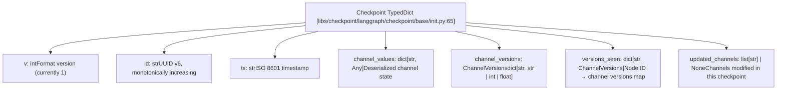
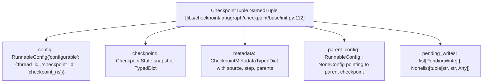
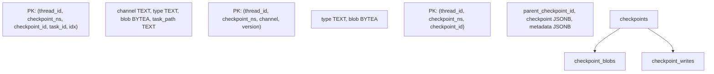

# 检查点架构

相关源文件

-   [libs/checkpoint-postgres/langgraph/checkpoint/postgres/__init__.py](https://github.com/langchain-ai/langgraph/blob/1fd51e8f/libs/checkpoint-postgres/langgraph/checkpoint/postgres/__init__.py)
-   [libs/checkpoint-postgres/langgraph/checkpoint/postgres/aio.py](https://github.com/langchain-ai/langgraph/blob/1fd51e8f/libs/checkpoint-postgres/langgraph/checkpoint/postgres/aio.py)
-   [libs/checkpoint-postgres/langgraph/checkpoint/postgres/base.py](https://github.com/langchain-ai/langgraph/blob/1fd51e8f/libs/checkpoint-postgres/langgraph/checkpoint/postgres/base.py)
-   [libs/checkpoint-postgres/langgraph/checkpoint/postgres/shallow.py](https://github.com/langchain-ai/langgraph/blob/1fd51e8f/libs/checkpoint-postgres/langgraph/checkpoint/postgres/shallow.py)
-   [libs/checkpoint-postgres/tests/test_async.py](https://github.com/langchain-ai/langgraph/blob/1fd51e8f/libs/checkpoint-postgres/tests/test_async.py)
-   [libs/checkpoint-postgres/tests/test_sync.py](https://github.com/langchain-ai/langgraph/blob/1fd51e8f/libs/checkpoint-postgres/tests/test_sync.py)
-   [libs/checkpoint-sqlite/langgraph/checkpoint/sqlite/__init__.py](https://github.com/langchain-ai/langgraph/blob/1fd51e8f/libs/checkpoint-sqlite/langgraph/checkpoint/sqlite/__init__.py)
-   [libs/checkpoint-sqlite/langgraph/checkpoint/sqlite/aio.py](https://github.com/langchain-ai/langgraph/blob/1fd51e8f/libs/checkpoint-sqlite/langgraph/checkpoint/sqlite/aio.py)
-   [libs/checkpoint-sqlite/langgraph/checkpoint/sqlite/utils.py](https://github.com/langchain-ai/langgraph/blob/1fd51e8f/libs/checkpoint-sqlite/langgraph/checkpoint/sqlite/utils.py)
-   [libs/checkpoint-sqlite/tests/test_aiosqlite.py](https://github.com/langchain-ai/langgraph/blob/1fd51e8f/libs/checkpoint-sqlite/tests/test_aiosqlite.py)
-   [libs/checkpoint-sqlite/tests/test_sqlite.py](https://github.com/langchain-ai/langgraph/blob/1fd51e8f/libs/checkpoint-sqlite/tests/test_sqlite.py)
-   [libs/checkpoint/langgraph/checkpoint/base/__init__.py](https://github.com/langchain-ai/langgraph/blob/1fd51e8f/libs/checkpoint/langgraph/checkpoint/base/__init__.py)
-   [libs/checkpoint/langgraph/checkpoint/memory/__init__.py](https://github.com/langchain-ai/langgraph/blob/1fd51e8f/libs/checkpoint/langgraph/checkpoint/memory/__init__.py)
-   [libs/checkpoint/langgraph/checkpoint/serde/types.py](https://github.com/langchain-ai/langgraph/blob/1fd51e8f/libs/checkpoint/langgraph/checkpoint/serde/types.py)
-   [libs/checkpoint/tests/test_memory.py](https://github.com/langchain-ai/langgraph/blob/1fd51e8f/libs/checkpoint/tests/test_memory.py)

## 目的与范围

本文档描述了使 LangGraph 具备持久化、有状态执行能力的检查点架构。检查点会在特定时间点捕获图的完整状态，从而支持持久化、可恢复执行、时间旅行调试以及 human-in-the-loop 工作流。

本页涵盖检查点数据模型（`Checkpoint`、`CheckpointTuple`、`CheckpointMetadata`）、`BaseCheckpointSaver` 抽象接口（`get_tuple`、`list`、`put`、`put_writes`、`delete_thread` 及其异步对应方法），以及 Pregel 执行循环如何与 checkpointer 交互。关于具体实现（InMemorySaver、SqliteSaver、PostgresSaver），参见 4.2。关于序列化细节，参见 4.4。关于时间旅行与状态分叉能力，参见 4.5。

---

## 核心数据结构

检查点系统围绕三种主要数据结构构建，它们协同工作以捕获和恢复图状态。

### Checkpoint TypedDict

`Checkpoint` TypedDict（[libs/checkpoint/langgraph/checkpoint/base/__init__.py65-97](https://github.com/langchain-ai/langgraph/blob/1fd51e8f/libs/checkpoint/langgraph/checkpoint/base/__init__.py#L65-L97)）表示某一时间点图状态的完整快照。

**Checkpoint 结构图**：

来源： [libs/checkpoint/langgraph/checkpoint/base/__init__.py65-97](https://github.com/langchain-ai/langgraph/blob/1fd51e8f/libs/checkpoint/langgraph/checkpoint/base/__init__.py#L65-L97)

**Checkpoint 结构字段**：

| 字段 | 类型 | 描述 |
| --- | --- | --- |
| `v` | `int` | 检查点格式版本（当前为 `1`） |
| `id` | `str` | 通过 `uuid6` 生成的唯一标识，单调递增 |
| `ts` | `str` | ISO 8601 格式的创建时间戳 |
| `channel_values` | `dict[str, Any]` | 按通道名索引的已反序列化状态值 |
| `channel_versions` | `ChannelVersions` | 每个通道的版本标识（str/int/float） |
| `versions_seen` | `dict[str, ChannelVersions]` | 将节点 ID 映射到该节点已处理的通道版本 |
| `updated_channels` | `list[str] | None` | 在该检查点中被修改的通道名列表 |

`id` 字段使用 UUID v6（[libs/checkpoint/langgraph/checkpoint/base/__init__.py17](https://github.com/langchain-ai/langgraph/blob/1fd51e8f/libs/checkpoint/langgraph/checkpoint/base/__init__.py#L17-L17)），它是单调递增的，确保检查点可按时间顺序排序。`versions_seen` 映射使 Pregel 算法能够通过与 `channel_versions` 比较来判断哪些节点需要执行。

来源： [libs/checkpoint/langgraph/checkpoint/base/__init__.py65-97](https://github.com/langchain-ai/langgraph/blob/1fd51e8f/libs/checkpoint/langgraph/checkpoint/base/__init__.py#L65-L97) [libs/checkpoint/langgraph/checkpoint/base/__init__.py17](https://github.com/langchain-ai/langgraph/blob/1fd51e8f/libs/checkpoint/langgraph/checkpoint/base/__init__.py#L17-L17)

### CheckpointTuple NamedTuple

`CheckpointTuple`（[libs/checkpoint/langgraph/checkpoint/base/__init__.py112-119](https://github.com/langchain-ai/langgraph/blob/1fd51e8f/libs/checkpoint/langgraph/checkpoint/base/__init__.py#L112-L119)）将 `Checkpoint` 与其关联元数据和配置封装在一起。

**CheckpointTuple 关系图**：

来源： [libs/checkpoint/langgraph/checkpoint/base/__init__.py112-119](https://github.com/langchain-ai/langgraph/blob/1fd51e8f/libs/checkpoint/langgraph/checkpoint/base/__init__.py#L112-L119)

**CheckpointTuple 字段**：

| 字段 | 类型 | 描述 |
| --- | --- | --- |
| `config` | `RunnableConfig` | 包含 `thread_id`、`checkpoint_id`、`checkpoint_ns` 的 `configurable` 字典 |
| `checkpoint` | `Checkpoint` | 完整状态快照 TypedDict |
| `metadata` | `CheckpointMetadata` | 包含 `source`、`step`、`parents` 及自定义字段的元数据 TypedDict |
| `parent_config` | `RunnableConfig | None` | 指向父检查点的配置（支持向后遍历） |
| `pending_writes` | `list[PendingWrite] | None` | 尚未应用的 `(task_id, channel, value)` 元组列表 |

`parent_config` 字段会在检查点历史中创建链表结构。`pending_writes` 字段（类型别名 `PendingWrite = tuple[str, str, Any]`，见 [libs/checkpoint/langgraph/checkpoint/base/__init__.py30](https://github.com/langchain-ai/langgraph/blob/1fd51e8f/libs/checkpoint/langgraph/checkpoint/base/__init__.py#L30-L30)）包含通过 `put_writes()` 记录但尚未并入 `channel_values` 的写入。

来源： [libs/checkpoint/langgraph/checkpoint/base/__init__.py112-119](https://github.com/langchain-ai/langgraph/blob/1fd51e8f/libs/checkpoint/langgraph/checkpoint/base/__init__.py#L112-L119) [libs/checkpoint/langgraph/checkpoint/base/__init__.py30](https://github.com/langchain-ai/langgraph/blob/1fd51e8f/libs/checkpoint/langgraph/checkpoint/base/__init__.py#L30-L30)

### CheckpointMetadata TypedDict

`CheckpointMetadata`（[libs/checkpoint/langgraph/checkpoint/base/__init__.py35-61](https://github.com/langchain-ai/langgraph/blob/1fd51e8f/libs/checkpoint/langgraph/checkpoint/base/__init__.py#L35-L61)）存储检查点创建时的上下文信息以及创建原因。

| 字段 | 类型 | 描述 |
| --- | --- | --- |
| `source` | `"input" | "loop" | "update" | "fork"` | 检查点的创建方式 |
| `step` | `int` | 步骤编号（初始输入为 -1，执行步骤为 0+） |
| `parents` | `dict[str, str]` | 按命名空间记录父检查点 ID（用于嵌套图） |
| `run_id` | `str` | 创建该检查点的运行 ID |

来源： [libs/checkpoint/langgraph/checkpoint/base/__init__.py35-61](https://github.com/langchain-ai/langgraph/blob/1fd51e8f/libs/checkpoint/langgraph/checkpoint/base/__init__.py#L35-L61)

`source` 字段用于区分：由初始输入创建（`"input"`）、在执行循环中创建（`"loop"`）、由手动状态更新创建（`"update"`）或由分叉现有检查点创建（`"fork"`）的检查点。

---

## BaseCheckpointSaver 接口

`BaseCheckpointSaver` 抽象类（[libs/checkpoint/langgraph/checkpoint/base/__init__.py122](https://github.com/langchain-ai/langgraph/blob/1fd51e8f/libs/checkpoint/langgraph/checkpoint/base/__init__.py#L122-L122)）定义了所有检查点实现必须满足的契约。它同时提供同步与异步方法，用于检查点持久化和读取。

### 核心方法

**`BaseCheckpointSaver` 功能映射**：

```mermaid
flowchart TD
    get_next_version["get_next_version(current, channel)Generate next channel version ID"]
    serde["serde: SerializerProtocolSerialization (default: JsonPlusSerializer)"]
    put["put(config, checkpoint, metadata, new_versions)Save Checkpoint, returns updated RunnableConfig"]
    put_writes["put_writes(config, writes, task_id, task_path)Save PendingWrite list"]
    aput["aput(...)Async put"]
    aput_writes["aput_writes(...)Async put_writes"]
    get_tuple["get_tuple(config)Retrieve single CheckpointTuple"]
    list["list(config, filter, before, limit)Query CheckpointTuple iterator"]
    aget_tuple["aget_tuple(config)Async get_tuple"]
    alist["alist(config, filter, before, limit)Async list"]
```

来源： [libs/checkpoint/langgraph/checkpoint/base/__init__.py122-396](https://github.com/langchain-ai/langgraph/blob/1fd51e8f/libs/checkpoint/langgraph/checkpoint/base/__init__.py#L122-L396)

#### 检索模式

`get_tuple(config)` 根据 `RunnableConfig` 解析检查点。根据 `config["configurable"]` 中是否包含 `checkpoint_id`，支持两种查找模式：

-   **带 `checkpoint_id`**：通过 `get_checkpoint_id(config)`（[libs/checkpoint/langgraph/checkpoint/base/__init__.py185-186](https://github.com/langchain-ai/langgraph/blob/1fd51e8f/libs/checkpoint/langgraph/checkpoint/base/__init__.py#L185-L186)）检索精确匹配 `(thread_id, checkpoint_ns, checkpoint_id)` 的检查点。
-   **不带 `checkpoint_id`**：检索给定 `(thread_id, checkpoint_ns)` 下的最新检查点。

便捷方法 `get(config)`（[libs/checkpoint/langgraph/checkpoint/base/__init__.py173](https://github.com/langchain-ai/langgraph/blob/1fd51e8f/libs/checkpoint/langgraph/checkpoint/base/__init__.py#L173-L173)）会委托给 `get_tuple()`，并只返回 `Checkpoint` 字典。

`list(config, filter, before, limit)`（[libs/checkpoint/langgraph/checkpoint/base/__init__.py199](https://github.com/langchain-ai/langgraph/blob/1fd51e8f/libs/checkpoint/langgraph/checkpoint/base/__init__.py#L199-L199)）返回按从新到旧顺序排列的 `CheckpointTuple` 迭代器。`filter` 参数接受一个元数据字段字典用于匹配；`before` 参数接受带 `checkpoint_id` 的配置，仅返回更旧的检查点。

来源： [libs/checkpoint/langgraph/checkpoint/base/__init__.py173-215](https://github.com/langchain-ai/langgraph/blob/1fd51e8f/libs/checkpoint/langgraph/checkpoint/base/__init__.py#L173-L215)

#### 持久化模式

`put(config, checkpoint, metadata, new_versions)`（[libs/checkpoint/langgraph/checkpoint/base/__init__.py221](https://github.com/langchain-ai/langgraph/blob/1fd51e8f/libs/checkpoint/langgraph/checkpoint/base/__init__.py#L221-L221)）用于保存 `Checkpoint` 快照，并返回更新后的 `RunnableConfig`。`new_versions` 字典把通道名映射到其新版本标识。

`put_writes(config, writes, task_id, task_path)`（[libs/checkpoint/langgraph/checkpoint/base/__init__.py243](https://github.com/langchain-ai/langgraph/blob/1fd51e8f/libs/checkpoint/langgraph/checkpoint/base/__init__.py#L243-L243)）用于保存与特定任务执行关联的 `PendingWrite` 元组列表。这些写入会单独存储，并在下一次调用 `get_tuple()` 时作为 `pending_writes` 暴露。

来源： [libs/checkpoint/langgraph/checkpoint/base/__init__.py221-259](https://github.com/langchain-ai/langgraph/blob/1fd51e8f/libs/checkpoint/langgraph/checkpoint/base/__init__.py#L221-L259)

---

## 存储模型与数据库 Schema

检查点实现通常采用多表 schema，以高效存储小型基础值和大型复杂对象。

### 三表存储模式

持久化检查点实现（Postgres、SQLite）使用三表逻辑模型，定义在 SQL 迁移中（例如 [libs/checkpoint-postgres/langgraph/checkpoint/postgres/base.py37-85](https://github.com/langchain-ai/langgraph/blob/1fd51e8f/libs/checkpoint-postgres/langgraph/checkpoint/postgres/base.py#L37-L85)）。

**数据库实体映射**：

来源： [libs/checkpoint-postgres/langgraph/checkpoint/postgres/base.py37-85](https://github.com/langchain-ai/langgraph/blob/1fd51e8f/libs/checkpoint-postgres/langgraph/checkpoint/postgres/base.py#L37-L85) [libs/checkpoint-sqlite/langgraph/checkpoint/sqlite/__init__.py132-157](https://github.com/langchain-ai/langgraph/blob/1fd51e8f/libs/checkpoint-sqlite/langgraph/checkpoint/sqlite/__init__.py#L132-L157)

**表角色**：

| 表 | 主键 | 用途 |
| --- | --- | --- |
| `checkpoints` | `(thread_id, checkpoint_ns, checkpoint_id)` | 主检查点记录；内联基础通道值；存储元数据。 |
| `checkpoint_blobs` | `(thread_id, checkpoint_ns, channel, version)` | 序列化后的复杂通道值，按通道名和版本字符串建键。 |
| `checkpoint_writes` | `(thread_id, checkpoint_ns, checkpoint_id, task_id, idx)` | 来自 `put_writes()` 的待写入；在下一个检查点前按任务累积。 |

来源： [libs/checkpoint-postgres/langgraph/checkpoint/postgres/base.py37-85](https://github.com/langchain-ai/langgraph/blob/1fd51e8f/libs/checkpoint-postgres/langgraph/checkpoint/postgres/base.py#L37-L85) [libs/checkpoint-sqlite/langgraph/checkpoint/sqlite/__init__.py132-157](https://github.com/langchain-ai/langgraph/blob/1fd51e8f/libs/checkpoint-sqlite/langgraph/checkpoint/sqlite/__init__.py#L132-L157)

### 值存储策略

通道值会按类型拆分到不同表中。基础值内联在 `checkpoint` JSON 列中。复杂对象通过 `serde.dumps_typed()` 序列化后存入 `checkpoint_blobs`。读取时，实现会使用单条包含子查询或 join 的查询来重建完整 `CheckpointTuple`（[libs/checkpoint-postgres/langgraph/checkpoint/postgres/base.py87-112](https://github.com/langchain-ai/langgraph/blob/1fd51e8f/libs/checkpoint-postgres/langgraph/checkpoint/postgres/base.py#L87-L112)）。

**特殊写入索引值**（来自 [libs/checkpoint/langgraph/checkpoint/base/__init__.py441-448](https://github.com/langchain-ai/langgraph/blob/1fd51e8f/libs/checkpoint/langgraph/checkpoint/base/__init__.py#L441-L448) 中的 `WRITES_IDX_MAP`）：

| 常量 | 索引 | 含义 |
| --- | --- | --- |
| `ERROR` | `-1` | 节点错误写入 |
| `SCHEDULED` | `-2` | 已调度任务写入 |
| `INTERRUPT` | `-3` | 中断写入 |
| `RESUME` | `-4` | 恢复值写入 |

来源： [libs/checkpoint-postgres/langgraph/checkpoint/postgres/base.py87-112](https://github.com/langchain-ai/langgraph/blob/1fd51e8f/libs/checkpoint-postgres/langgraph/checkpoint/postgres/base.py#L87-L112) [libs/checkpoint/langgraph/checkpoint/base/__init__.py441-448](https://github.com/langchain-ai/langgraph/blob/1fd51e8f/libs/checkpoint/langgraph/checkpoint/base/__init__.py#L441-L448)

---

## 检查点生命周期

随着图执行，检查点会经历一套生命周期，版本跟踪确保状态演进的一致性。

### 创建与版本化

**检查点创建序列**：

> **[Mermaid sequence]**
> *(图表结构无法解析)*

来源： [libs/checkpoint-postgres/langgraph/checkpoint/postgres/base.py198-250](https://github.com/langchain-ai/langgraph/blob/1fd51e8f/libs/checkpoint-postgres/langgraph/checkpoint/postgres/base.py#L198-L250) [libs/checkpoint-postgres/langgraph/checkpoint/postgres/__init__.py224-334](https://github.com/langchain-ai/langgraph/blob/1fd51e8f/libs/checkpoint-postgres/langgraph/checkpoint/postgres/__init__.py#L224-L334)

通道版本由 checkpointer 上定义的 `get_next_version(current, channel)` 生成。PostgreSQL 实现会生成形如 `"{step:032}.{random:016}"` 的字符串（[libs/checkpoint-postgres/langgraph/checkpoint/postgres/base.py262-271](https://github.com/langchain-ai/langgraph/blob/1fd51e8f/libs/checkpoint-postgres/langgraph/checkpoint/postgres/base.py#L262-L271)）。

### Pending Writes 生命周期

待写入会经历两阶段流程：

1.  **阶段 1（任务执行）**：节点任务通过 `put_writes()` 记录输出。它们存储在 `checkpoint_writes` 中（[libs/checkpoint-postgres/langgraph/checkpoint/postgres/base.py140-147](https://github.com/langchain-ai/langgraph/blob/1fd51e8f/libs/checkpoint-postgres/langgraph/checkpoint/postgres/base.py#L140-L147)）。
2.  **阶段 2（下一检查点）**：当通过 `get_tuple()` 加载下一个检查点时，会检索 `pending_writes`（[libs/checkpoint-postgres/langgraph/checkpoint/postgres/base.py104-111](https://github.com/langchain-ai/langgraph/blob/1fd51e8f/libs/checkpoint-postgres/langgraph/checkpoint/postgres/base.py#L104-L111)）。Pregel 循环将这些写入应用到通道，从而推进状态。

来源： [libs/checkpoint-postgres/langgraph/checkpoint/postgres/base.py104-147](https://github.com/langchain-ai/langgraph/blob/1fd51e8f/libs/checkpoint-postgres/langgraph/checkpoint/postgres/base.py#L104-L147)

---

## 实现变体

LangGraph 提供了多种检查点实现，具有不同的性能与耐久性特征。

**检查点实现汇总**：

| 类 | 模块 | 存储 | 持久性 | 并发 |
| --- | --- | --- | --- | --- |
| `InMemorySaver` | `langgraph.checkpoint.memory` | `defaultdict` | 无（进程生命周期） | Sync + async |
| `SqliteSaver` | `langgraph.checkpoint.sqlite` | SQLite 文件 | 基于文件 | 仅 Sync |
| `AsyncSqliteSaver` | `langgraph.checkpoint.sqlite.aio` | SQLite via `aiosqlite` | 基于文件 | Async |
| `PostgresSaver` | `langgraph.checkpoint.postgres` | PostgreSQL | 持久 | Sync + pipeline |
| `AsyncPostgresSaver` | `langgraph.checkpoint.postgres.aio` | PostgreSQL | 持久 | Async + pipeline |

### 浅层检查点

`ShallowPostgresSaver`（[libs/checkpoint-postgres/langgraph/checkpoint/postgres/shallow.py169](https://github.com/langchain-ai/langgraph/blob/1fd51e8f/libs/checkpoint-postgres/langgraph/checkpoint/postgres/shallow.py#L169-L169)）是一个只存储最新检查点、不保留历史的专用实现。它已被弃用，推荐改用 `PostgresSaver` 并在调用模式中设置 `durability='exit'`。

来源： [libs/checkpoint/langgraph/checkpoint/memory/__init__.py31](https://github.com/langchain-ai/langgraph/blob/1fd51e8f/libs/checkpoint/langgraph/checkpoint/memory/__init__.py#L31-L31) [libs/checkpoint-sqlite/langgraph/checkpoint/sqlite/__init__.py38](https://github.com/langchain-ai/langgraph/blob/1fd51e8f/libs/checkpoint-sqlite/langgraph/checkpoint/sqlite/__init__.py#L38-L38) [libs/checkpoint-sqlite/langgraph/checkpoint/sqlite/aio.py31](https://github.com/langchain-ai/langgraph/blob/1fd51e8f/libs/checkpoint-sqlite/langgraph/checkpoint/sqlite/aio.py#L31-L31) [libs/checkpoint-postgres/langgraph/checkpoint/postgres/__init__.py32](https://github.com/langchain-ai/langgraph/blob/1fd51e8f/libs/checkpoint-postgres/langgraph/checkpoint/postgres/__init__.py#L32-L32) [libs/checkpoint-postgres/langgraph/checkpoint/postgres/aio.py32](https://github.com/langchain-ai/langgraph/blob/1fd51e8f/libs/checkpoint-postgres/langgraph/checkpoint/postgres/aio.py#L32-L32) [libs/checkpoint-postgres/langgraph/checkpoint/postgres/shallow.py169](https://github.com/langchain-ai/langgraph/blob/1fd51e8f/libs/checkpoint-postgres/langgraph/checkpoint/postgres/shallow.py#L169-L169)

---

## 总结

检查点架构通过以下能力构成了 LangGraph 持久性的基础：

-   **结构化数据模型**：`Checkpoint` 与 `CheckpointTuple` 精确捕获执行状态。
-   **抽象接口**：`BaseCheckpointSaver` 支持后端可替换（Memory、SQLite、Postgres）。
-   **高效存储**：内联基础值与 blob 存储复杂对象相分离。
-   **Pending Writes**：将任务输出记录与状态应用解耦，以支持中断。
-   **单调版本化**：检查点与通道 ID 单调递增，便于排序与冲突解决。

该架构支持了时间旅行调试、human-in-the-loop 审核以及容错执行等高级能力。
