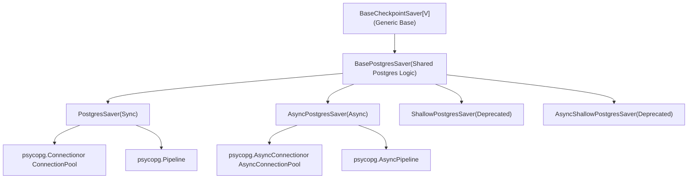
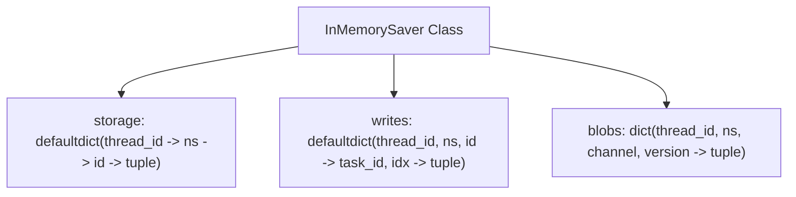
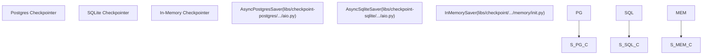

# 检查点实现

相关源文件

-   [libs/checkpoint-postgres/langgraph/checkpoint/postgres/__init__.py](https://github.com/langchain-ai/langgraph/blob/1fd51e8f/libs/checkpoint-postgres/langgraph/checkpoint/postgres/__init__.py)
-   [libs/checkpoint-postgres/langgraph/checkpoint/postgres/aio.py](https://github.com/langchain-ai/langgraph/blob/1fd51e8f/libs/checkpoint-postgres/langgraph/checkpoint/postgres/aio.py)
-   [libs/checkpoint-postgres/langgraph/checkpoint/postgres/base.py](https://github.com/langchain-ai/langgraph/blob/1fd51e8f/libs/checkpoint-postgres/langgraph/checkpoint/postgres/base.py)
-   [libs/checkpoint-postgres/langgraph/checkpoint/postgres/shallow.py](https://github.com/langchain-ai/langgraph/blob/1fd51e8f/libs/checkpoint-postgres/langgraph/checkpoint/postgres/shallow.py)
-   [libs/checkpoint-postgres/tests/test_async.py](https://github.com/langchain-ai/langgraph/blob/1fd51e8f/libs/checkpoint-postgres/tests/test_async.py)
-   [libs/checkpoint-postgres/tests/test_sync.py](https://github.com/langchain-ai/langgraph/blob/1fd51e8f/libs/checkpoint-postgres/tests/test_sync.py)
-   [libs/checkpoint-sqlite/langgraph/checkpoint/sqlite/__init__.py](https://github.com/langchain-ai/langgraph/blob/1fd51e8f/libs/checkpoint-sqlite/langgraph/checkpoint/sqlite/__init__.py)
-   [libs/checkpoint-sqlite/langgraph/checkpoint/sqlite/aio.py](https://github.com/langchain-ai/langgraph/blob/1fd51e8f/libs/checkpoint-sqlite/langgraph/checkpoint/sqlite/aio.py)
-   [libs/checkpoint-sqlite/langgraph/checkpoint/sqlite/utils.py](https://github.com/langchain-ai/langgraph/blob/1fd51e8f/libs/checkpoint-sqlite/langgraph/checkpoint/sqlite/utils.py)
-   [libs/checkpoint-sqlite/tests/test_aiosqlite.py](https://github.com/langchain-ai/langgraph/blob/1fd51e8f/libs/checkpoint-sqlite/tests/test_aiosqlite.py)
-   [libs/checkpoint-sqlite/tests/test_sqlite.py](https://github.com/langchain-ai/langgraph/blob/1fd51e8f/libs/checkpoint-sqlite/tests/test_sqlite.py)
-   [libs/checkpoint/langgraph/checkpoint/base/__init__.py](https://github.com/langchain-ai/langgraph/blob/1fd51e8f/libs/checkpoint/langgraph/checkpoint/base/__init__.py)
-   [libs/checkpoint/langgraph/checkpoint/memory/__init__.py](https://github.com/langchain-ai/langgraph/blob/1fd51e8f/libs/checkpoint/langgraph/checkpoint/memory/__init__.py)
-   [libs/checkpoint/langgraph/checkpoint/serde/types.py](https://github.com/langchain-ai/langgraph/blob/1fd51e8f/libs/checkpoint/langgraph/checkpoint/serde/types.py)
-   [libs/checkpoint/tests/test_memory.py](https://github.com/langchain-ai/langgraph/blob/1fd51e8f/libs/checkpoint/tests/test_memory.py)

本文档描述检查点持久化层的具体实现。这些实现为图执行状态的保存与读取提供不同存储后端，包括 PostgreSQL、SQLite 和内存选项。

关于抽象检查点接口与基础概念，参见 **4.1**（Checkpointing Architecture）。关于检查点数据的序列化，参见 **4.4**（Serialization）。

---

## 概览

LangGraph 提供多个检查点保存器实现，分别适用于不同场景：

| 实现 | 模块 | Async 支持 | 生产可用 | 使用场景 |
| --- | --- | --- | --- | --- |
| `PostgresSaver` | `langgraph.checkpoint.postgres` | Yes (`AsyncPostgresSaver`) | ✓ | 生产负载、完整历史 |
| `SqliteSaver` | `langgraph.checkpoint.sqlite` | Yes (`AsyncSqliteSaver`) | Limited | 本地开发、小型项目 |
| `InMemorySaver` | `langgraph.checkpoint.memory` | Yes (native async) | ✗ | 测试、调试 |
| `ShallowPostgresSaver` / `AsyncShallowPostgresSaver` | `langgraph.checkpoint.postgres.shallow` | Yes | Deprecated | 已由 `durability='exit'` 模式取代 |

所有实现都继承自 `BaseCheckpointSaver` [libs/checkpoint/langgraph/checkpoint/base/__init__.py122-155](https://github.com/langchain-ai/langgraph/blob/1fd51e8f/libs/checkpoint/langgraph/checkpoint/base/__init__.py#L122-L155)，并必须实现以下核心方法：

-   `get_tuple()` / `aget_tuple()` - 读取检查点 [libs/checkpoint/langgraph/checkpoint/base/__init__.py185-197](https://github.com/langchain-ai/langgraph/blob/1fd51e8f/libs/checkpoint/langgraph/checkpoint/base/__init__.py#L185-L197)
-   `list()` / `alist()` - 按过滤条件列出检查点 [libs/checkpoint/langgraph/checkpoint/base/__init__.py199-231](https://github.com/langchain-ai/langgraph/blob/1fd51e8f/libs/checkpoint/langgraph/checkpoint/base/__init__.py#L199-L231)
-   `put()` / `aput()` - 保存检查点 [libs/checkpoint/langgraph/checkpoint/base/__init__.py233-261](https://github.com/langchain-ai/langgraph/blob/1fd51e8f/libs/checkpoint/langgraph/checkpoint/base/__init__.py#L233-L261)
-   `put_writes()` / `aput_writes()` - 保存中间写入 [libs/checkpoint/langgraph/checkpoint/base/__init__.py263-286](https://github.com/langchain-ai/langgraph/blob/1fd51e8f/libs/checkpoint/langgraph/checkpoint/base/__init__.py#L263-L286)

**来源：** [libs/checkpoint/langgraph/checkpoint/base/__init__.py122-286](https://github.com/langchain-ai/langgraph/blob/1fd51e8f/libs/checkpoint/langgraph/checkpoint/base/__init__.py#L122-L286) [libs/checkpoint-postgres/langgraph/checkpoint/postgres/__init__.py32-35](https://github.com/langchain-ai/langgraph/blob/1fd51e8f/libs/checkpoint-postgres/langgraph/checkpoint/postgres/__init__.py#L32-L35) [libs/checkpoint-sqlite/langgraph/checkpoint/sqlite/__init__.py38-47](https://github.com/langchain-ai/langgraph/blob/1fd51e8f/libs/checkpoint-sqlite/langgraph/checkpoint/sqlite/__init__.py#L38-L47) [libs/checkpoint/langgraph/checkpoint/memory/__init__.py31-64](https://github.com/langchain-ai/langgraph/blob/1fd51e8f/libs/checkpoint/langgraph/checkpoint/memory/__init__.py#L31-L64)

---

## PostgreSQL 实现

### 类层次结构


**来源：** [libs/checkpoint-postgres/langgraph/checkpoint/postgres/base.py156-165](https://github.com/langchain-ai/langgraph/blob/1fd51e8f/libs/checkpoint-postgres/langgraph/checkpoint/postgres/base.py#L156-L165) [libs/checkpoint-postgres/langgraph/checkpoint/postgres/__init__.py32-53](https://github.com/langchain-ai/langgraph/blob/1fd51e8f/libs/checkpoint-postgres/langgraph/checkpoint/postgres/__init__.py#L32-L53) [libs/checkpoint-postgres/langgraph/checkpoint/postgres/aio.py32-54](https://github.com/langchain-ai/langgraph/blob/1fd51e8f/libs/checkpoint-postgres/langgraph/checkpoint/postgres/aio.py#L32-L54) [libs/checkpoint-postgres/langgraph/checkpoint/postgres/shallow.py169-183](https://github.com/langchain-ai/langgraph/blob/1fd51e8f/libs/checkpoint-postgres/langgraph/checkpoint/postgres/shallow.py#L169-L183)

### 数据库 Schema

PostgreSQL 实现使用多张表存储检查点数据，并针对小型基础值和大型二进制对象做了优化：


该 schema 设计包含两项关键优化：

1.  **Blob 分离**：`checkpoints` 表将检查点结构存为 JSONB [libs/checkpoint-postgres/langgraph/checkpoint/postgres/base.py41-50](https://github.com/langchain-ai/langgraph/blob/1fd51e8f/libs/checkpoint-postgres/langgraph/checkpoint/postgres/base.py#L41-L50)，而复杂通道值存放在 `checkpoint_blobs` 表 [libs/checkpoint-postgres/langgraph/checkpoint/postgres/base.py51-59](https://github.com/langchain-ai/langgraph/blob/1fd51e8f/libs/checkpoint-postgres/langgraph/checkpoint/postgres/base.py#L51-L59)
2.  **写入分离**：`checkpoint_writes` 表单独保存中间任务输出，使系统可以处理多步执行与待写入数据 [libs/checkpoint-postgres/langgraph/checkpoint/postgres/base.py60-70](https://github.com/langchain-ai/langgraph/blob/1fd51e8f/libs/checkpoint-postgres/langgraph/checkpoint/postgres/base.py#L60-L70)

**来源：** [libs/checkpoint-postgres/langgraph/checkpoint/postgres/base.py37-85](https://github.com/langchain-ai/langgraph/blob/1fd51e8f/libs/checkpoint-postgres/langgraph/checkpoint/postgres/base.py#L37-L85)

### PostgresSaver

同步版 `PostgresSaver` 类使用 psycopg3 的同步 API 提供检查点持久化能力。

#### 连接模式

该实现支持多种连接模式 [libs/checkpoint-postgres/langgraph/checkpoint/postgres/__init__.py37-53](https://github.com/langchain-ai/langgraph/blob/1fd51e8f/libs/checkpoint-postgres/langgraph/checkpoint/postgres/__init__.py#L37-L53)：

| 模式 | 连接类型 | 使用场景 |
| --- | --- | --- |
| 单连接 | `psycopg.Connection` | 简单应用 |
| 连接池 | `psycopg_pool.ConnectionPool` | 多线程应用 |
| Pipeline 模式 | `psycopg.Pipeline` | 高吞吐批处理 |

```
# Single connection with context managerwith PostgresSaver.from_conn_string(conn_string) as saver:    saver.setup()    # With pipelinewith PostgresSaver.from_conn_string(conn_string, pipeline=True) as saver:    saver.setup()
```
**来源：** [libs/checkpoint-postgres/langgraph/checkpoint/postgres/__init__.py54-76](https://github.com/langchain-ai/langgraph/blob/1fd51e8f/libs/checkpoint-postgres/langgraph/checkpoint/postgres/__init__.py#L54-L76)

#### 迁移系统

PostgreSQL 实现包含一个带版本的迁移系统 [libs/checkpoint-postgres/langgraph/checkpoint/postgres/base.py37-85](https://github.com/langchain-ai/langgraph/blob/1fd51e8f/libs/checkpoint-postgres/langgraph/checkpoint/postgres/base.py#L37-L85)。`setup()` 方法会自动执行 `checkpoint_migrations` 中记录的所有待执行迁移 [libs/checkpoint-postgres/langgraph/checkpoint/postgres/__init__.py77-102](https://github.com/langchain-ai/langgraph/blob/1fd51e8f/libs/checkpoint-postgres/langgraph/checkpoint/postgres/__init__.py#L77-L102)

#### 关键操作

**检查点读取（get\_tuple）** `get_tuple()` 方法 \[libs/checkpoint-postgres/langgraph/checkpoint/postgres/**init**.py:184-253\] 会查询 `checkpoints` 表。它使用复杂的 `SELECT_SQL` 查询 [libs/checkpoint-postgres/langgraph/checkpoint/postgres/base.py87-112](https://github.com/langchain-ai/langgraph/blob/1fd51e8f/libs/checkpoint-postgres/langgraph/checkpoint/postgres/base.py#L87-L112)，并与 `checkpoint_blobs` 联合以重建完整状态。

**检查点写入（put）** `put()` 方法 [libs/checkpoint-postgres/langgraph/checkpoint/postgres/__init__.py255-334](https://github.com/langchain-ai/langgraph/blob/1fd51e8f/libs/checkpoint-postgres/langgraph/checkpoint/postgres/__init__.py#L255-L334) 执行 upsert。它提取通道值，并使用 `UPSERT_CHECKPOINT_BLOBS_SQL` [libs/checkpoint-postgres/langgraph/checkpoint/postgres/base.py125-129](https://github.com/langchain-ai/langgraph/blob/1fd51e8f/libs/checkpoint-postgres/langgraph/checkpoint/postgres/base.py#L125-L129) 和 `UPSERT_CHECKPOINTS_SQL` [libs/checkpoint-postgres/langgraph/checkpoint/postgres/base.py131-138](https://github.com/langchain-ai/langgraph/blob/1fd51e8f/libs/checkpoint-postgres/langgraph/checkpoint/postgres/base.py#L131-L138) 进行存储。

**来源：** [libs/checkpoint-postgres/langgraph/checkpoint/postgres/base.py87-147](https://github.com/langchain-ai/langgraph/blob/1fd51e8f/libs/checkpoint-postgres/langgraph/checkpoint/postgres/base.py#L87-L147) [libs/checkpoint-postgres/langgraph/checkpoint/postgres/__init__.py184-334](https://github.com/langchain-ai/langgraph/blob/1fd51e8f/libs/checkpoint-postgres/langgraph/checkpoint/postgres/__init__.py#L184-L334)

---

## SQLite 实现

### SqliteSaver

`SqliteSaver` 类使用 SQLite 提供轻量级检查点实现 [libs/checkpoint-sqlite/langgraph/checkpoint/sqlite/__init__.py38-73](https://github.com/langchain-ai/langgraph/blob/1fd51e8f/libs/checkpoint-sqlite/langgraph/checkpoint/sqlite/__init__.py#L38-L73)

#### Schema

SQLite schema 比 Postgres 更简单，使用两个主表：`checkpoints` 与 `writes` [libs/checkpoint-sqlite/langgraph/checkpoint/sqlite/__init__.py135-157](https://github.com/langchain-ai/langgraph/blob/1fd51e8f/libs/checkpoint-sqlite/langgraph/checkpoint/sqlite/__init__.py#L135-L157)


#### 线程安全

`SqliteSaver` 使用 `threading.Lock` [libs/checkpoint-sqlite/langgraph/checkpoint/sqlite/__init__.py88](https://github.com/langchain-ai/langgraph/blob/1fd51e8f/libs/checkpoint-sqlite/langgraph/checkpoint/sqlite/__init__.py#L88-L88) 来保证数据库连接的线程安全访问，因为 SQLite 在多线程环境中的写入性能受限 [libs/checkpoint-sqlite/langgraph/checkpoint/sqlite/__init__.py41-44](https://github.com/langchain-ai/langgraph/blob/1fd51e8f/libs/checkpoint-sqlite/langgraph/checkpoint/sqlite/__init__.py#L41-L44)

**来源：** [libs/checkpoint-sqlite/langgraph/checkpoint/sqlite/__init__.py132-157](https://github.com/langchain-ai/langgraph/blob/1fd51e8f/libs/checkpoint-sqlite/langgraph/checkpoint/sqlite/__init__.py#L132-L157) [libs/checkpoint-sqlite/langgraph/checkpoint/sqlite/__init__.py161-182](https://github.com/langchain-ai/langgraph/blob/1fd51e8f/libs/checkpoint-sqlite/langgraph/checkpoint/sqlite/__init__.py#L161-L182)

### AsyncSqliteSaver

`AsyncSqliteSaver` 类使用 `aiosqlite` 提供异步支持 [libs/checkpoint-sqlite/langgraph/checkpoint/sqlite/aio.py31-44](https://github.com/langchain-ai/langgraph/blob/1fd51e8f/libs/checkpoint-sqlite/langgraph/checkpoint/sqlite/aio.py#L31-L44)

```
async with AsyncSqliteSaver.from_conn_string("checkpoints.db") as saver:    graph = builder.compile(checkpointer=saver)    # ... execution ...
```
**来源：** [libs/checkpoint-sqlite/langgraph/checkpoint/sqlite/aio.py124-138](https://github.com/langchain-ai/langgraph/blob/1fd51e8f/libs/checkpoint-sqlite/langgraph/checkpoint/sqlite/aio.py#L124-L138)

---

## 内存实现

### InMemorySaver

`InMemorySaver` 类使用嵌套 `defaultdict` 结构在内存中存储检查点 [libs/checkpoint/langgraph/checkpoint/memory/__init__.py31-64](https://github.com/langchain-ai/langgraph/blob/1fd51e8f/libs/checkpoint/langgraph/checkpoint/memory/__init__.py#L31-L64)

#### 存储结构


内部存储 [libs/checkpoint/langgraph/checkpoint/memory/__init__.py67-81](https://github.com/langchain-ai/langgraph/blob/1fd51e8f/libs/checkpoint/langgraph/checkpoint/memory/__init__.py#L67-L81) 映射如下：

-   `storage`：将线程与命名空间映射到检查点数据。
-   `writes`：将检查点 ID 映射到任务写入。
-   `blobs`：将通道版本映射到序列化数据。

**来源：** [libs/checkpoint/langgraph/checkpoint/memory/__init__.py66-92](https://github.com/langchain-ai/langgraph/blob/1fd51e8f/libs/checkpoint/langgraph/checkpoint/memory/__init__.py#L66-L92)

#### 用法与持久性

虽然它主要用于测试，但也可通过 `PersistentDict` 工厂 [libs/checkpoint/langgraph/checkpoint/memory/__init__.py533-604](https://github.com/langchain-ai/langgraph/blob/1fd51e8f/libs/checkpoint/langgraph/checkpoint/memory/__init__.py#L533-L604) 实现持久化，将数据 pickle 到磁盘。

---

## 实现对比

### 功能矩阵

| 功能 | PostgresSaver | SqliteSaver | InMemorySaver |
| --- | --- | --- | --- |
| **后端** | PostgreSQL | SQLite | 内存（RAM） |
| **Async 支持** | 原生（`AsyncPostgresSaver`） | 原生（`AsyncSqliteSaver`） | 原生 |
| **耐久性** | 高 | 中 | 低（进程生命周期） |
| **Blob 处理** | 独立表 | 内联 BLOB | 字典 |
| **时间旅行** | 支持 | 支持 | 支持 |

### 代码实体关联


**来源：** [libs/checkpoint-postgres/langgraph/checkpoint/postgres/aio.py32-33](https://github.com/langchain-ai/langgraph/blob/1fd51e8f/libs/checkpoint-postgres/langgraph/checkpoint/postgres/aio.py#L32-L33) [libs/checkpoint-sqlite/langgraph/checkpoint/sqlite/aio.py31-32](https://github.com/langchain-ai/langgraph/blob/1fd51e8f/libs/checkpoint-sqlite/langgraph/checkpoint/sqlite/aio.py#L31-L32) [libs/checkpoint/langgraph/checkpoint/memory/__init__.py31-34](https://github.com/langchain-ai/langgraph/blob/1fd51e8f/libs/checkpoint/langgraph/checkpoint/memory/__init__.py#L31-L34)

### 弃用摘要

`ShallowPostgresSaver` 与 `AsyncShallowPostgresSaver` 自 2.0.20 起已弃用 [libs/checkpoint-postgres/langgraph/checkpoint/postgres/shallow.py192-197](https://github.com/langchain-ai/langgraph/blob/1fd51e8f/libs/checkpoint-postgres/langgraph/checkpoint/postgres/shallow.py#L192-L197)。建议用户在图调用期间使用带 `durability='exit'` 配置的 `PostgresSaver`。

**来源：** [libs/checkpoint-postgres/langgraph/checkpoint/postgres/shallow.py169-197](https://github.com/langchain-ai/langgraph/blob/1fd51e8f/libs/checkpoint-postgres/langgraph/checkpoint/postgres/shallow.py#L169-L197)
