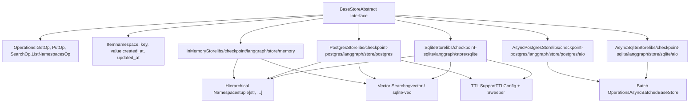
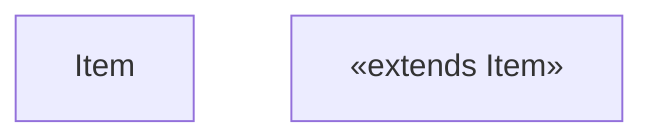
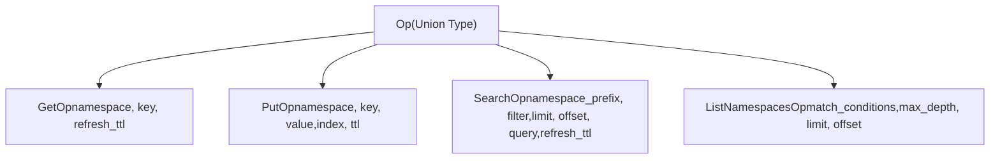
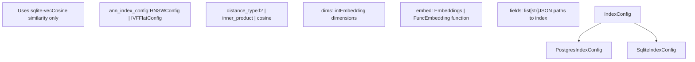

# 存储系统

相关源文件

-   [libs/checkpoint-postgres/langgraph/store/postgres/aio.py](https://github.com/langchain-ai/langgraph/blob/1fd51e8f/libs/checkpoint-postgres/langgraph/store/postgres/aio.py)
-   [libs/checkpoint-postgres/langgraph/store/postgres/base.py](https://github.com/langchain-ai/langgraph/blob/1fd51e8f/libs/checkpoint-postgres/langgraph/store/postgres/base.py)
-   [libs/checkpoint-postgres/tests/conftest.py](https://github.com/langchain-ai/langgraph/blob/1fd51e8f/libs/checkpoint-postgres/tests/conftest.py)
-   [libs/checkpoint-postgres/tests/test_async_store.py](https://github.com/langchain-ai/langgraph/blob/1fd51e8f/libs/checkpoint-postgres/tests/test_async_store.py)
-   [libs/checkpoint-postgres/tests/test_store.py](https://github.com/langchain-ai/langgraph/blob/1fd51e8f/libs/checkpoint-postgres/tests/test_store.py)
-   [libs/checkpoint-sqlite/langgraph/store/sqlite/__init__.py](https://github.com/langchain-ai/langgraph/blob/1fd51e8f/libs/checkpoint-sqlite/langgraph/store/sqlite/__init__.py)
-   [libs/checkpoint-sqlite/langgraph/store/sqlite/aio.py](https://github.com/langchain-ai/langgraph/blob/1fd51e8f/libs/checkpoint-sqlite/langgraph/store/sqlite/aio.py)
-   [libs/checkpoint-sqlite/langgraph/store/sqlite/base.py](https://github.com/langchain-ai/langgraph/blob/1fd51e8f/libs/checkpoint-sqlite/langgraph/store/sqlite/base.py)
-   [libs/checkpoint-sqlite/tests/test_async_store.py](https://github.com/langchain-ai/langgraph/blob/1fd51e8f/libs/checkpoint-sqlite/tests/test_async_store.py)
-   [libs/checkpoint-sqlite/tests/test_store.py](https://github.com/langchain-ai/langgraph/blob/1fd51e8f/libs/checkpoint-sqlite/tests/test_store.py)
-   [libs/checkpoint-sqlite/tests/test_ttl.py](https://github.com/langchain-ai/langgraph/blob/1fd51e8f/libs/checkpoint-sqlite/tests/test_ttl.py)
-   [libs/checkpoint/langgraph/store/base/__init__.py](https://github.com/langchain-ai/langgraph/blob/1fd51e8f/libs/checkpoint/langgraph/store/base/__init__.py)
-   [libs/checkpoint/langgraph/store/base/batch.py](https://github.com/langchain-ai/langgraph/blob/1fd51e8f/libs/checkpoint/langgraph/store/base/batch.py)
-   [libs/checkpoint/langgraph/store/base/embed.py](https://github.com/langchain-ai/langgraph/blob/1fd51e8f/libs/checkpoint/langgraph/store/base/embed.py)
-   [libs/checkpoint/langgraph/store/memory/__init__.py](https://github.com/langchain-ai/langgraph/blob/1fd51e8f/libs/checkpoint/langgraph/store/memory/__init__.py)
-   [libs/checkpoint/tests/test_store.py](https://github.com/langchain-ai/langgraph/blob/1fd51e8f/libs/checkpoint/tests/test_store.py)
-   [libs/langgraph/tests/memory_assert.py](https://github.com/langchain-ai/langgraph/blob/1fd51e8f/libs/langgraph/tests/memory_assert.py)

存储系统为 LangGraph 应用提供带分层命名空间的持久化键值存储。它支持跨线程、跨会话持久存在的长期记忆，并可选提供向量搜索与 TTL（time-to-live）能力。

**范围**：本页涵盖 Store 接口、操作、实现和数据模型。关于通过 checkpointing 持久化图状态，参见 [Checkpointing Architecture](/langchain-ai/langgraph/4.1-checkpointing-architecture)。关于检查点实现，参见 [Checkpoint Implementations](/langchain-ai/langgraph/4.2-checkpoint-implementations)。关于序列化机制，参见 [Serialization](/langchain-ai/langgraph/4.4-serialization)。

---

## 核心架构

存储系统围绕基础接口构建，并通过可插拔实现支持不同存储后端，包括 PostgreSQL、SQLite 以及内存变体。

### 存储系统概览

**代码实体映射**：

-   `BaseStore`：抽象接口，位于 [libs/checkpoint/langgraph/store/base/__init__.py700-721](https://github.com/langchain-ai/langgraph/blob/1fd51e8f/libs/checkpoint/langgraph/store/base/__init__.py#L700-L721)
-   `InMemoryStore`：内存实现，位于 [libs/checkpoint/langgraph/store/memory/__init__.py136-174](https://github.com/langchain-ai/langgraph/blob/1fd51e8f/libs/checkpoint/langgraph/store/memory/__init__.py#L136-L174)
-   `PostgresStore`：PostgreSQL 同步实现，位于 [libs/checkpoint-postgres/langgraph/store/postgres/base.py640-716](https://github.com/langchain-ai/langgraph/blob/1fd51e8f/libs/checkpoint-postgres/langgraph/store/postgres/base.py#L640-L716)
-   `SqliteStore`：SQLite 同步实现，位于 [libs/checkpoint-sqlite/langgraph/store/sqlite/base.py211-218](https://github.com/langchain-ai/langgraph/blob/1fd51e8f/libs/checkpoint-sqlite/langgraph/store/sqlite/base.py#L211-L218)
-   `AsyncPostgresStore`：带批处理的 PostgreSQL 异步实现，位于 [libs/checkpoint-postgres/langgraph/store/postgres/aio.py42-118](https://github.com/langchain-ai/langgraph/blob/1fd51e8f/libs/checkpoint-postgres/langgraph/store/postgres/aio.py#L42-L118)
-   `AsyncSqliteStore`：带批处理的 SQLite 异步实现，位于 [libs/checkpoint-sqlite/langgraph/store/sqlite/aio.py39-87](https://github.com/langchain-ai/langgraph/blob/1fd51e8f/libs/checkpoint-sqlite/langgraph/store/sqlite/aio.py#L39-L87)

**来源**： [libs/checkpoint/langgraph/store/base/__init__.py700-721](https://github.com/langchain-ai/langgraph/blob/1fd51e8f/libs/checkpoint/langgraph/store/base/__init__.py#L700-L721) [libs/checkpoint-postgres/langgraph/store/postgres/base.py640-716](https://github.com/langchain-ai/langgraph/blob/1fd51e8f/libs/checkpoint-postgres/langgraph/store/postgres/base.py#L640-L716) [libs/checkpoint-sqlite/langgraph/store/sqlite/base.py211-218](https://github.com/langchain-ai/langgraph/blob/1fd51e8f/libs/checkpoint-sqlite/langgraph/store/sqlite/base.py#L211-L218) [libs/checkpoint/langgraph/store/memory/__init__.py136-174](https://github.com/langchain-ai/langgraph/blob/1fd51e8f/libs/checkpoint/langgraph/store/memory/__init__.py#L136-L174) [libs/checkpoint-postgres/langgraph/store/postgres/aio.py42-118](https://github.com/langchain-ai/langgraph/blob/1fd51e8f/libs/checkpoint-postgres/langgraph/store/postgres/aio.py#L42-L118) [libs/checkpoint-sqlite/langgraph/store/sqlite/aio.py39-87](https://github.com/langchain-ai/langgraph/blob/1fd51e8f/libs/checkpoint-sqlite/langgraph/store/sqlite/aio.py#L39-L87)

---

## 基础 Store 接口

### BaseStore 类

`BaseStore` 抽象类定义了存储接口，同时提供同步与异步方法。

| 方法 | 描述 | 返回值 |
| --- | --- | --- |
| `batch(ops)` | 同步执行多个操作 | `list[Result]` |
| `abatch(ops)` | 异步执行多个操作 | `list[Result]` |
| `get(namespace, key)` | 获取单个条目 | `Item | None` |
| `put(namespace, key, value)` | 存储或更新条目 | `None` |
| `search(namespace_prefix, ...)` | 带过滤条件搜索条目 | `list[SearchItem]` |
| `delete(namespace, key)` | 删除条目 | `None` |
| `list_namespaces(...)` | 按过滤条件列出命名空间 | `list[tuple[str, ...]]` |

**来源**： [libs/checkpoint/langgraph/store/base/__init__.py700-995](https://github.com/langchain-ai/langgraph/blob/1fd51e8f/libs/checkpoint/langgraph/store/base/__init__.py#L700-L995)

### Item 数据模型

`Item` 类表示带元数据的存储文档。

**来源**： [libs/checkpoint/langgraph/store/base/__init__.py51-116](https://github.com/langchain-ai/langgraph/blob/1fd51e8f/libs/checkpoint/langgraph/store/base/__init__.py#L51-L116) [libs/checkpoint/langgraph/store/base/__init__.py118-155](https://github.com/langchain-ai/langgraph/blob/1fd51e8f/libs/checkpoint/langgraph/store/base/__init__.py#L118-L155)

---

## 操作

### 操作类型

存储系统使用强类型操作进行批处理：

**来源**： [libs/checkpoint/langgraph/store/base/__init__.py157-201](https://github.com/langchain-ai/langgraph/blob/1fd51e8f/libs/checkpoint/langgraph/store/base/__init__.py#L157-L201) [libs/checkpoint/langgraph/store/base/__init__.py203-308](https://github.com/langchain-ai/langgraph/blob/1fd51e8f/libs/checkpoint/langgraph/store/base/__init__.py#L203-L308) [libs/checkpoint/langgraph/store/base/__init__.py431-535](https://github.com/langchain-ai/langgraph/blob/1fd51e8f/libs/checkpoint/langgraph/store/base/__init__.py#L431-L535) [libs/checkpoint/langgraph/store/base/__init__.py368-429](https://github.com/langchain-ai/langgraph/blob/1fd51e8f/libs/checkpoint/langgraph/store/base/__init__.py#L368-L429)

### PutOp - 存储条目

用于存储或更新条目。设置 `value=None` 会删除该条目。

**参数**：

-   `namespace`：以元组表示的层级路径
-   `key`：唯一标识符
-   `value`：字典数据，或用于删除的 `None`
-   `index`：用于搜索建立索引的字段路径（默认使用 store 配置）
-   `ttl`：存活时间（分钟，可选）

**来源**： [libs/checkpoint/langgraph/store/base/__init__.py431-535](https://github.com/langchain-ai/langgraph/blob/1fd51e8f/libs/checkpoint/langgraph/store/base/__init__.py#L431-L535)

---

## 层级命名空间

命名空间以类似文件系统路径的层级结构组织数据。

### 命名空间结构

**命名空间规则**：

1.  使用字符串元组表示 [libs/checkpoint/langgraph/store/base/__init__.py57-59](https://github.com/langchain-ai/langgraph/blob/1fd51e8f/libs/checkpoint/langgraph/store/base/__init__.py#L57-L59)
2.  不能是空元组 `()` [libs/checkpoint/langgraph/store/base/batch.py141](https://github.com/langchain-ai/langgraph/blob/1fd51e8f/libs/checkpoint/langgraph/store/base/batch.py#L141-L141)
3.  在某些实现（Postgres/SQLite）中，单个组件不能包含点号（`.`） [libs/checkpoint-postgres/langgraph/store/postgres/base.py1561-1590](https://github.com/langchain-ai/langgraph/blob/1fd51e8f/libs/checkpoint-postgres/langgraph/store/postgres/base.py#L1561-L1590) [libs/checkpoint-sqlite/langgraph/store/sqlite/base.py96-102](https://github.com/langchain-ai/langgraph/blob/1fd51e8f/libs/checkpoint-sqlite/langgraph/store/sqlite/base.py#L96-L102)

**来源**： [libs/checkpoint/langgraph/store/base/__init__.py57-59](https://github.com/langchain-ai/langgraph/blob/1fd51e8f/libs/checkpoint/langgraph/store/base/__init__.py#L57-L59) [libs/checkpoint/langgraph/store/base/batch.py141](https://github.com/langchain-ai/langgraph/blob/1fd51e8f/libs/checkpoint/langgraph/store/base/batch.py#L141-L141)

---

## 向量搜索

向量搜索支持使用嵌入进行语义相似度查询。

### 向量搜索配置

**来源**： [libs/checkpoint/langgraph/store/base/__init__.py570-698](https://github.com/langchain-ai/langgraph/blob/1fd51e8f/libs/checkpoint/langgraph/store/base/__init__.py#L570-L698) [libs/checkpoint-postgres/langgraph/store/postgres/base.py177-233](https://github.com/langchain-ai/langgraph/blob/1fd51e8f/libs/checkpoint-postgres/langgraph/store/postgres/base.py#L177-L233) [libs/checkpoint-sqlite/langgraph/store/sqlite/base.py90-93](https://github.com/langchain-ai/langgraph/blob/1fd51e8f/libs/checkpoint-sqlite/langgraph/store/sqlite/base.py#L90-L93)

---

## TTL 支持

存活时间（TTL）支持存储条目自动过期。

### TTL 配置

`TTLConfig` 控制过期行为 [libs/checkpoint/langgraph/store/base/__init__.py545-568](https://github.com/langchain-ai/langgraph/blob/1fd51e8f/libs/checkpoint/langgraph/store/base/__init__.py#L545-L568)

| 字段 | 描述 |
| --- | --- |
| `default_ttl` | 默认过期时间（分钟） |
| `refresh_on_read` | 是否在 get/search 时刷新 TTL |
| `sweep_interval_minutes` | 清理过期条目的频率 |

**来源**： [libs/checkpoint/langgraph/store/base/__init__.py545-568](https://github.com/langchain-ai/langgraph/blob/1fd51e8f/libs/checkpoint/langgraph/store/base/__init__.py#L545-L568)

---

## 存储实现

### InMemoryStore

用于开发与测试的非持久化、字典后端存储。

**实现细节**：

-   数据存储在：`_data: dict[tuple[str, ...], dict[str, Item]]` [libs/checkpoint/langgraph/store/memory/__init__.py186](https://github.com/langchain-ai/langgraph/blob/1fd51e8f/libs/checkpoint/langgraph/store/memory/__init__.py#L186-L186)
-   向量存储在：`_vectors: dict[tuple[str, ...], dict[str, dict[str, list[float]]]]` [libs/checkpoint/langgraph/store/memory/__init__.py188-190](https://github.com/langchain-ai/langgraph/blob/1fd51e8f/libs/checkpoint/langgraph/store/memory/__init__.py#L188-L190)

**来源**： [libs/checkpoint/langgraph/store/memory/__init__.py136-190](https://github.com/langchain-ai/langgraph/blob/1fd51e8f/libs/checkpoint/langgraph/store/memory/__init__.py#L136-L190)

### PostgresStore & AsyncPostgresStore

面向生产环境、基于 PostgreSQL 且使用 `pgvector` 的存储实现。

**关键特性**：

-   同步版本使用 `psycopg` 连接/连接池 [libs/checkpoint-postgres/langgraph/store/postgres/base.py640-650](https://github.com/langchain-ai/langgraph/blob/1fd51e8f/libs/checkpoint-postgres/langgraph/store/postgres/base.py#L640-L650)
-   异步版本支持 `AsyncPipeline` 与 `AsyncConnectionPool` [libs/checkpoint-postgres/langgraph/store/postgres/aio.py133-161](https://github.com/langchain-ai/langgraph/blob/1fd51e8f/libs/checkpoint-postgres/langgraph/store/postgres/aio.py#L133-L161)
-   支持 HNSW 与 IVFFlat 索引类型 [libs/checkpoint-postgres/langgraph/store/postgres/base.py177-218](https://github.com/langchain-ai/langgraph/blob/1fd51e8f/libs/checkpoint-postgres/langgraph/store/postgres/base.py#L177-L218)

**来源**： [libs/checkpoint-postgres/langgraph/store/postgres/base.py640-650](https://github.com/langchain-ai/langgraph/blob/1fd51e8f/libs/checkpoint-postgres/langgraph/store/postgres/base.py#L640-L650) [libs/checkpoint-postgres/langgraph/store/postgres/aio.py42-161](https://github.com/langchain-ai/langgraph/blob/1fd51e8f/libs/checkpoint-postgres/langgraph/store/postgres/aio.py#L42-L161)

### SqliteStore & AsyncSqliteStore

基于 SQLite 的存储实现，向量搜索使用 `sqlite-vec`。

**关键特性**：

-   同步版本使用 `sqlite3` [libs/checkpoint-sqlite/langgraph/store/sqlite/base.py211-218](https://github.com/langchain-ai/langgraph/blob/1fd51e8f/libs/checkpoint-sqlite/langgraph/store/sqlite/base.py#L211-L218)
-   异步版本使用 `aiosqlite` [libs/checkpoint-sqlite/langgraph/store/sqlite/aio.py89-111](https://github.com/langchain-ai/langgraph/blob/1fd51e8f/libs/checkpoint-sqlite/langgraph/store/sqlite/aio.py#L89-L111)
-   向量搜索需要 `sqlite-vec` 扩展 [libs/checkpoint-sqlite/langgraph/store/sqlite/aio.py182-184](https://github.com/langchain-ai/langgraph/blob/1fd51e8f/libs/checkpoint-sqlite/langgraph/store/sqlite/aio.py#L182-L184)

**来源**： [libs/checkpoint-sqlite/langgraph/store/sqlite/base.py211-218](https://github.com/langchain-ai/langgraph/blob/1fd51e8f/libs/checkpoint-sqlite/langgraph/store/sqlite/base.py#L211-L218) [libs/checkpoint-sqlite/langgraph/store/sqlite/aio.py39-111](https://github.com/langchain-ai/langgraph/blob/1fd51e8f/libs/checkpoint-sqlite/langgraph/store/sqlite/aio.py#L39-L111)

---

## 批处理与异步处理

`AsyncBatchedBaseStore` 类提供高效的后台任务，用于批量处理存储操作。

> **[Mermaid sequence]**
> *(图表结构无法解析)*

**来源**： [libs/checkpoint/langgraph/store/base/batch.py58-101](https://github.com/langchain-ai/langgraph/blob/1fd51e8f/libs/checkpoint/langgraph/store/base/batch.py#L58-L101) [libs/checkpoint/langgraph/store/base/batch.py368-450](https://github.com/langchain-ai/langgraph/blob/1fd51e8f/libs/checkpoint/langgraph/store/base/batch.py#L368-L450)

---

## 数据库 Schemas

### PostgreSQL Schema

-   `store` 表：键值对主存储 [libs/checkpoint-postgres/langgraph/store/postgres/base.py64-72](https://github.com/langchain-ai/langgraph/blob/1fd51e8f/libs/checkpoint-postgres/langgraph/store/postgres/base.py#L64-L72)
-   `store_vectors` 表：向量嵌入存储 [libs/checkpoint-postgres/langgraph/store/postgres/base.py104-114](https://github.com/langchain-ai/langgraph/blob/1fd51e8f/libs/checkpoint-postgres/langgraph/store/postgres/base.py#L104-L114)

### SQLite Schema

-   `store` 表：主存储 [libs/checkpoint-sqlite/langgraph/store/sqlite/base.py43-51](https://github.com/langchain-ai/langgraph/blob/1fd51e8f/libs/checkpoint-sqlite/langgraph/store/sqlite/base.py#L43-L51)
-   `store_vectors` 表：向量嵌入存储 [libs/checkpoint-sqlite/langgraph/store/sqlite/base.py76-85](https://github.com/langchain-ai/langgraph/blob/1fd51e8f/libs/checkpoint-sqlite/langgraph/store/sqlite/base.py#L76-L85)

**来源**： [libs/checkpoint-postgres/langgraph/store/postgres/base.py64-114](https://github.com/langchain-ai/langgraph/blob/1fd51e8f/libs/checkpoint-postgres/langgraph/store/postgres/base.py#L64-L114) [libs/checkpoint-sqlite/langgraph/store/sqlite/base.py43-85](https://github.com/langchain-ai/langgraph/blob/1fd51e8f/libs/checkpoint-sqlite/langgraph/store/sqlite/base.py#L43-L85)
