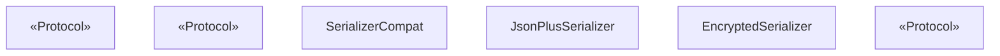
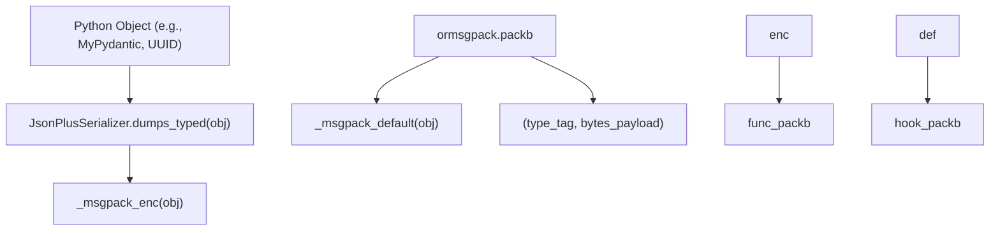
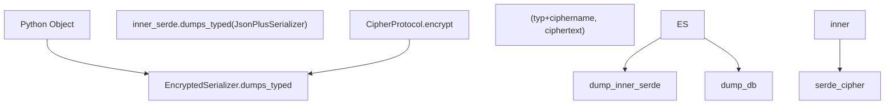

# 序列化

相关源文件

-   [libs/checkpoint-postgres/uv.lock](https://github.com/langchain-ai/langgraph/blob/1fd51e8f/libs/checkpoint-postgres/uv.lock)
-   [libs/checkpoint-sqlite/uv.lock](https://github.com/langchain-ai/langgraph/blob/1fd51e8f/libs/checkpoint-sqlite/uv.lock)
-   [libs/checkpoint/langgraph/checkpoint/serde/base.py](https://github.com/langchain-ai/langgraph/blob/1fd51e8f/libs/checkpoint/langgraph/checkpoint/serde/base.py)
-   [libs/checkpoint/langgraph/checkpoint/serde/encrypted.py](https://github.com/langchain-ai/langgraph/blob/1fd51e8f/libs/checkpoint/langgraph/checkpoint/serde/encrypted.py)
-   [libs/checkpoint/langgraph/checkpoint/serde/jsonplus.py](https://github.com/langchain-ai/langgraph/blob/1fd51e8f/libs/checkpoint/langgraph/checkpoint/serde/jsonplus.py)
-   [libs/checkpoint/pyproject.toml](https://github.com/langchain-ai/langgraph/blob/1fd51e8f/libs/checkpoint/pyproject.toml)
-   [libs/checkpoint/tests/test_jsonplus.py](https://github.com/langchain-ai/langgraph/blob/1fd51e8f/libs/checkpoint/tests/test_jsonplus.py)
-   [libs/checkpoint/uv.lock](https://github.com/langchain-ai/langgraph/blob/1fd51e8f/libs/checkpoint/uv.lock)
-   [libs/langgraph/pyproject.toml](https://github.com/langchain-ai/langgraph/blob/1fd51e8f/libs/langgraph/pyproject.toml)
-   [libs/langgraph/tests/__snapshots__/test_pregel.ambr](https://github.com/langchain-ai/langgraph/blob/1fd51e8f/libs/langgraph/tests/__snapshots__/test_pregel.ambr)
-   [libs/langgraph/tests/__snapshots__/test_pregel_async.ambr](https://github.com/langchain-ai/langgraph/blob/1fd51e8f/libs/langgraph/tests/__snapshots__/test_pregel_async.ambr)
-   [libs/langgraph/tests/test_interrupt_migration.py](https://github.com/langchain-ai/langgraph/blob/1fd51e8f/libs/langgraph/tests/test_interrupt_migration.py)
-   [libs/langgraph/uv.lock](https://github.com/langchain-ai/langgraph/blob/1fd51e8f/libs/langgraph/uv.lock)
-   [libs/prebuilt/pyproject.toml](https://github.com/langchain-ai/langgraph/blob/1fd51e8f/libs/prebuilt/pyproject.toml)
-   [libs/prebuilt/uv.lock](https://github.com/langchain-ai/langgraph/blob/1fd51e8f/libs/prebuilt/uv.lock)
-   [libs/sdk-py/uv.lock](https://github.com/langchain-ai/langgraph/blob/1fd51e8f/libs/sdk-py/uv.lock)

本页介绍 checkpointers 与 stores 用于在 Python 对象和字节之间进行编码与解码的序列化层。主要实现是 `JsonPlusSerializer`，位于 `libs/checkpoint/langgraph/checkpoint/serde/`。该层属于持久化子系统的内部组件——关于 checkpointer 在执行循环中如何使用它，参见 [4.1 Checkpointing Architecture](https://github.com/langchain-ai/langgraph/blob/1fd51e8f/4.1 Checkpointing Architecture)；关于 store 如何持久化条目，参见 [4.3 Store System](https://github.com/langchain-ai/langgraph/blob/1fd51e8f/4.3 Store System)

---

## 概览

checkpointer 必须将任意 Python 对象（图状态、通道值、元数据）序列化为字节，以便存储到 SQLite、Postgres 或其他后端。序列化层提供：

-   一个 **协议接口**（`SerializerProtocol`），任何序列化器都必须实现 \[libs/checkpoint/langgraph/checkpoint/serde/base.py:14-26\]。
-   一个 **默认实现**（`JsonPlusSerializer`），由 `ormsgpack` 驱动，并原生支持丰富类型 \[libs/checkpoint/langgraph/checkpoint/serde/jsonplus.py:50-59\]。
-   一个 **pickle 回退机制**，用于处理原生不支持的类型 \[libs/checkpoint/langgraph/checkpoint/serde/jsonplus.py:64-64\]。
-   一个 **白名单机制**（`allowed_json_modules` 和 `allowed_msgpack_modules`），用于控制允许反序列化的类 \[libs/checkpoint/langgraph/checkpoint/serde/jsonplus.py:65-80\]。
-   一个 **加密包装器**（`EncryptedSerializer`），可对序列化字节进行透明加密 \[libs/checkpoint/langgraph/checkpoint/serde/encrypted.py:8-10\]。

---

## 序列化器接口

**模块：** `libs/checkpoint/langgraph/checkpoint/serde/base.py`

### `SerializerProtocol`

所有序列化器都必须满足的核心协议。它使用带类型标记的二元组 `(type_tag: str, payload: bytes)` 而非原始字节，以便反序列化器可按格式分发 \[libs/checkpoint/langgraph/checkpoint/serde/base.py:14-26\]。

| 方法 | 签名 | 描述 |
| --- | --- | --- |
| `dumps_typed` | `(obj: Any) → tuple[str, bytes]` | 序列化对象；返回 `(type_tag, bytes)` |
| `loads_typed` | `(data: tuple[str, bytes]) → Any` | 从 `(type_tag, bytes)` 反序列化 |

### `UntypedSerializerProtocol`

更简单的旧版序列化器协议，仅包含 `dumps(obj) → bytes` / `loads(data) → Any` \[libs/checkpoint/langgraph/checkpoint/serde/base.py:6-11\]。适配器 `SerializerCompat` 会将其包装为满足 `SerializerProtocol` \[libs/checkpoint/langgraph/checkpoint/serde/base.py:29-49\]。

### `CipherProtocol`

`EncryptedSerializer` 使用的加密后端协议 \[libs/checkpoint/langgraph/checkpoint/serde/base.py:51-64\]。

| 方法 | 签名 | 描述 |
| --- | --- | --- |
| `encrypt` | `(plaintext: bytes) → tuple[str, bytes]` | 返回 `(cipher_name, ciphertext)` |
| `decrypt` | `(ciphername: str, ciphertext: bytes) → bytes` | 返回解密后的明文 |

---

**协议层次图：**

来源： \[libs/checkpoint/langgraph/checkpoint/serde/base.py:1-64\], \[libs/checkpoint/langgraph/checkpoint/serde/jsonplus.py:50-87\], \[libs/checkpoint/langgraph/checkpoint/serde/encrypted.py:8-36\]

---

## `JsonPlusSerializer`

**文件：** `libs/checkpoint/langgraph/checkpoint/serde/jsonplus.py`

`JsonPlusSerializer` 是所有 checkpointer 实现使用的默认序列化器。其构造参数可控制回退行为与安全性 \[libs/checkpoint/langgraph/checkpoint/serde/jsonplus.py:61-70\]：

| 参数 | 类型 | 默认值 | 描述 |
| --- | --- | --- | --- |
| `pickle_fallback` | `bool` | `False` | 为其他方式不支持的类型启用 `pickle` |
| `allowed_json_modules` | `Iterable[tuple[str,...]] | True | None` | `None` | 旧版 JSON 构造反序列化的白名单 |
| `allowed_msgpack_modules` | `AllowedMsgpackModules | True | None` | `STRICT_MSGPACK_ENABLED` | msgpack 扩展反序列化白名单 |
| `__unpack_ext_hook__` | `Callable[[int, bytes], Any] | None` | `None` | 覆盖 msgpack 扩展钩子 |

### `dumps_typed` 分发

`dumps_typed` 会检查对象类型并返回带标签的字节负载 \[libs/checkpoint/langgraph/checkpoint/serde/jsonplus.py:221-240\]：

| 类型标签 | 条件 | 负载 |
| --- | --- | --- |
| `"null"` | `obj is None` | `b""`（空） |
| `"bytes"` | `isinstance(obj, bytes)` | 原始 bytes |
| `"bytearray"` | `isinstance(obj, bytearray)` | 原始 bytearray |
| `"msgpack"` | 其他所有类型 | `ormsgpack.packb(...)` 结果 |
| `"pickle"` | msgpack 失败且 `pickle_fallback=True` | `pickle.dumps(obj)` |

### `loads_typed` 分发

`loads_typed` 根据类型标签分发 \[libs/checkpoint/langgraph/checkpoint/serde/jsonplus.py:242-263\]：

| 类型标签 | 反序列化 |
| --- | --- |
| `"null"` | 返回 `None` |
| `"bytes"` | 返回原始 bytes |
| `"bytearray"` | 返回 `bytearray(data)` |
| `"json"` | `json.loads`，并以 `_reviver` 作为 `object_hook`（旧版） |
| `"msgpack"` | `ormsgpack.unpackb`，并使用扩展钩子 |
| `"pickle"` | `pickle.loads`（仅当 `pickle_fallback=True`） |

---

## msgpack 扩展类型系统

`JsonPlusSerializer` 使用 `ormsgpack` 扩展类型处理复杂 Python 对象 \[libs/checkpoint/langgraph/checkpoint/serde/jsonplus.py:266-311\]。

### 扩展代码

定义了 7 个整数代码 \[libs/checkpoint/langgraph/checkpoint/serde/jsonplus.py:215-222\]：

| 常量 | 值 | 用途 |
| --- | --- | --- |
| `EXT_CONSTRUCTOR_SINGLE_ARG` | `0` | 以单参数重建的类型（UUID、Decimal、Enum、set、deque、ZoneInfo、SecretStr） |
| `EXT_CONSTRUCTOR_POS_ARGS` | `1` | 以位置参数重建的类型（pathlib.Path、re.Pattern、timedelta、date、timezone、Send） |
| `EXT_CONSTRUCTOR_KW_ARGS` | `2` | 以关键字参数重建的类型（namedtuple、time、dataclass、Item） |
| `EXT_METHOD_SINGLE_ARG` | `3` | 通过类方法重建的类型（datetime → `fromisoformat`） |
| `EXT_PYDANTIC_V1` | `4` | Pydantic v1 `BaseModel` 实例 |
| `EXT_PYDANTIC_V2` | `5` | Pydantic v2 `BaseModel` 实例 |
| `EXT_NUMPY_ARRAY` | `6` | `numpy.ndarray` |

### 支持类型摘要

| Python 类型 | 扩展代码 | 编码方法 |
| --- | --- | --- |
| `pydantic.BaseModel` (v2) | `EXT_PYDANTIC_V2` | `.model_dump()` \[libs/checkpoint/langgraph/checkpoint/serde/jsonplus.py:355-356\] |
| `pydantic.v1.BaseModel` | `EXT_PYDANTIC_V1` | `.dict()` \[libs/checkpoint/langgraph/checkpoint/serde/jsonplus.py:363-364\] |
| `uuid.UUID` | `EXT_CONSTRUCTOR_SINGLE_ARG` | `.hex` \[libs/checkpoint/langgraph/checkpoint/serde/jsonplus.py:377-378\] |
| `decimal.Decimal` | `EXT_CONSTRUCTOR_SINGLE_ARG` | `str(d)` \[libs/checkpoint/langgraph/checkpoint/serde/jsonplus.py:381-382\] |
| `set`, `frozenset`, `deque` | `EXT_CONSTRUCTOR_SINGLE_ARG` | `tuple(obj)` \[libs/checkpoint/langgraph/checkpoint/serde/jsonplus.py:385-391\] |
| `datetime.datetime` | `EXT_METHOD_SINGLE_ARG` | `.isoformat()` \[libs/checkpoint/langgraph/checkpoint/serde/jsonplus.py:416-417\] |
| `numpy.ndarray` | `EXT_NUMPY_ARRAY` | `(dtype, shape, order, buffer)` \[libs/checkpoint/langgraph/checkpoint/serde/jsonplus.py:440-448\] |

---

## 编码 / 解码流程

**图：从 Python 空间到序列化空间的数据流**

来源： \[libs/checkpoint/langgraph/checkpoint/serde/jsonplus.py:224-240\], \[libs/checkpoint/langgraph/checkpoint/serde/jsonplus.py:314-448\], \[libs/checkpoint/langgraph/checkpoint/serde/jsonplus.py:639-650\]

---

## 安全与白名单

`JsonPlusSerializer` 对旧版 JSON 与 msgpack 扩展类型都实现了严格白名单，以防止任意代码执行 \[libs/checkpoint/langgraph/checkpoint/serde/jsonplus.py:53-59\]。

### `allowed_msgpack_modules`

在 msgpack 反序列化期间，`_msgpack_ext_hook` 会检查正在重建的模块/类是否被允许 \[libs/checkpoint/langgraph/checkpoint/serde/jsonplus.py:451-457\]。

-   若 `allowed_msgpack_modules` 为 `True`，则允许所有模块 \[libs/checkpoint/langgraph/checkpoint/serde/jsonplus.py:516-517\]。
-   若其为元组列表，仅允许其中指定的类 \[libs/checkpoint/langgraph/checkpoint/serde/jsonplus.py:521-523\]。
-   若类不被允许，则抛出 `InvalidModuleError` \[libs/checkpoint/langgraph/checkpoint/serde/jsonplus.py:531-536\]。

### `allowed_json_modules`

对于旧版 `"json"` 标签数据，`_reviver` 方法使用 `allowed_json_modules` 过滤哪些 `lc2` 构造负载可以被恢复 \[libs/checkpoint/langgraph/checkpoint/serde/jsonplus.py:142-157\]。

---

## `EncryptedSerializer`

**文件：** `libs/checkpoint/langgraph/checkpoint/serde/encrypted.py`

`EncryptedSerializer` 使用 `CipherProtocol` 包装任意 `SerializerProtocol`，以提供透明的静态加密 \[libs/checkpoint/langgraph/checkpoint/serde/encrypted.py:8-10\]。

**图：加密数据流**

来源： \[libs/checkpoint/langgraph/checkpoint/serde/encrypted.py:12-36\], \[libs/checkpoint/langgraph/checkpoint/serde/base.py:51-64\]

### AES 实现

工厂方法 `from_pycryptodome_aes` 使用 `pycryptodome` 库提供 AES 加密 \[libs/checkpoint/langgraph/checkpoint/serde/encrypted.py:39-44\]。如果未直接提供密钥，它会从 `LANGGRAPH_AES_KEY` 环境变量读取 \[libs/checkpoint/langgraph/checkpoint/serde/encrypted.py:51-53\]。

来源： \[libs/checkpoint/langgraph/checkpoint/serde/encrypted.py:39-80\]
