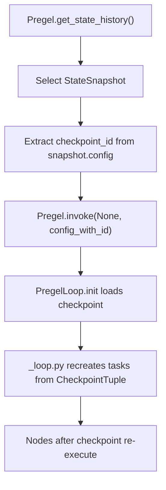
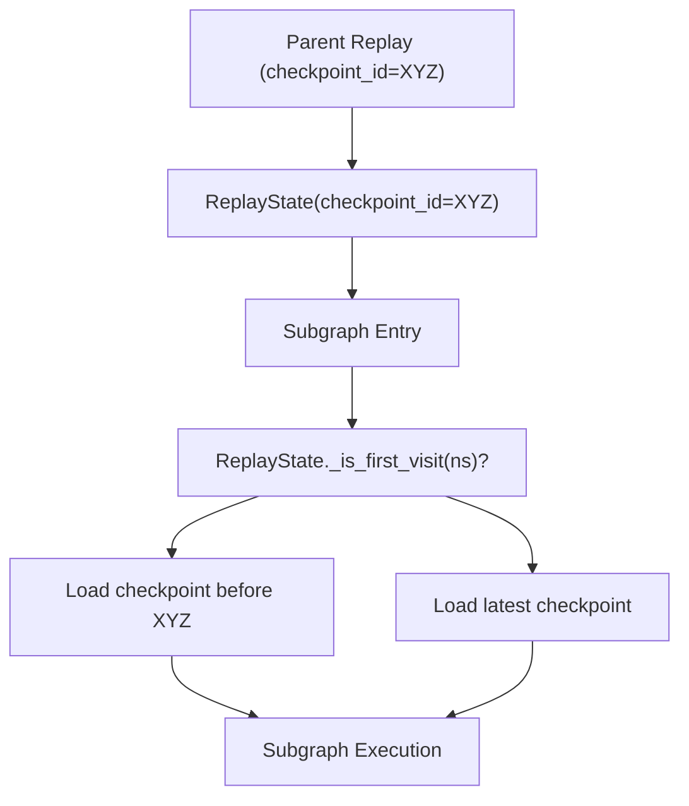

# 时间旅行与状态分叉

相关源文件

-   [libs/langgraph/langgraph/_internal/_constants.py](https://github.com/langchain-ai/langgraph/blob/1fd51e8f/libs/langgraph/langgraph/_internal/_constants.py)
-   [libs/langgraph/langgraph/_internal/_replay.py](https://github.com/langchain-ai/langgraph/blob/1fd51e8f/libs/langgraph/langgraph/_internal/_replay.py)
-   [libs/langgraph/langgraph/pregel/_loop.py](https://github.com/langchain-ai/langgraph/blob/1fd51e8f/libs/langgraph/langgraph/pregel/_loop.py)
-   [libs/langgraph/langgraph/pregel/main.py](https://github.com/langchain-ai/langgraph/blob/1fd51e8f/libs/langgraph/langgraph/pregel/main.py)
-   [libs/langgraph/langgraph/pregel/protocol.py](https://github.com/langchain-ai/langgraph/blob/1fd51e8f/libs/langgraph/langgraph/pregel/protocol.py)
-   [libs/langgraph/langgraph/pregel/remote.py](https://github.com/langchain-ai/langgraph/blob/1fd51e8f/libs/langgraph/langgraph/pregel/remote.py)
-   [libs/langgraph/langgraph/warnings.py](https://github.com/langchain-ai/langgraph/blob/1fd51e8f/libs/langgraph/langgraph/warnings.py)
-   [libs/langgraph/tests/test_deprecation.py](https://github.com/langchain-ai/langgraph/blob/1fd51e8f/libs/langgraph/tests/test_deprecation.py)
-   [libs/langgraph/tests/test_interruption.py](https://github.com/langchain-ai/langgraph/blob/1fd51e8f/libs/langgraph/tests/test_interruption.py)
-   [libs/langgraph/tests/test_remote_graph.py](https://github.com/langchain-ai/langgraph/blob/1fd51e8f/libs/langgraph/tests/test_remote_graph.py)
-   [libs/langgraph/tests/test_stream_v2.py](https://github.com/langchain-ai/langgraph/blob/1fd51e8f/libs/langgraph/tests/test_stream_v2.py)
-   [libs/langgraph/tests/test_time_travel.py](https://github.com/langchain-ai/langgraph/blob/1fd51e8f/libs/langgraph/tests/test_time_travel.py)
-   [libs/langgraph/tests/test_time_travel_async.py](https://github.com/langchain-ai/langgraph/blob/1fd51e8f/libs/langgraph/tests/test_time_travel_async.py)

本文档解释 LangGraph 的时间旅行与状态分叉能力。这些能力允许从历史检查点回放图执行并创建替代执行分支。借助这些特性，你可以在任意时间点导航检查点历史、重新执行节点并探索替代执行路径。

**范围**：本页涵盖从检查点回放与分叉执行状态的机制。关于检查点数据结构与持久化层的信息，参见 [Checkpointing Architecture](/langchain-ai/langgraph/4.1-checkpointing-architecture)。关于执行期间的中断处理，参见 [Human-in-the-Loop and Interrupts](/langchain-ai/langgraph/3.7-human-in-the-loop-and-interrupts)。

## 核心概念

### 检查点与状态历史

LangGraph 执行中的每一步都会创建一个检查点，用于捕获通道值（状态）、待处理任务和元数据。检查点通过 `parent_config` 形成链表结构，构成执行历史。`Pregel` 中的 `get_state_history` 方法 [libs/langgraph/langgraph/pregel/main.py1155-1244](https://github.com/langchain-ai/langgraph/blob/1fd51e8f/libs/langgraph/langgraph/pregel/main.py#L1155-L1244) 会按逆时间顺序遍历该链。

来源： [libs/langgraph/langgraph/pregel/main.py1155-1244](https://github.com/langchain-ai/langgraph/blob/1fd51e8f/libs/langgraph/langgraph/pregel/main.py#L1155-L1244) [libs/langgraph/tests/test_time_travel.py34-59](https://github.com/langchain-ai/langgraph/blob/1fd51e8f/libs/langgraph/tests/test_time_travel.py#L34-L59)

### 回放与分叉

LangGraph 支持两种不同的时间旅行操作，区别在于它们与 checkpointer 的交互方式：

| 操作 | 机制 | 检查点谱系 | 使用场景 |
| --- | --- | --- | --- |
| **Replay** | 在配置中携带 `checkpoint_id` 调用 | 延续同一谱系 | 从某个时间点重新执行，中断会再次触发 |
| **Fork** | 先 `update_state()` 再调用 | 创建新分支 | 探索替代执行路径 |

**Replay**：重新执行指定检查点之后的节点。检查点之前的节点不会重跑。原始执行中遇到的中断会在回放时再次触发，因为待处理任务会被重建 [libs/langgraph/tests/test_time_travel.py1-17](https://github.com/langchain-ai/langgraph/blob/1fd51e8f/libs/langgraph/tests/test_time_travel.py#L1-L17)

**Fork**：通过 `update_state` 创建新检查点 [libs/langgraph/langgraph/pregel/main.py1462-1529](https://github.com/langchain-ai/langgraph/blob/1fd51e8f/libs/langgraph/langgraph/pregel/main.py#L1462-L1529)。该新检查点不包含原执行缓存的待写入，从而强制节点重新执行，并创建独立执行分支。

来源： [libs/langgraph/langgraph/pregel/main.py1462-1529](https://github.com/langchain-ai/langgraph/blob/1fd51e8f/libs/langgraph/langgraph/pregel/main.py#L1462-L1529) [libs/langgraph/tests/test_time_travel.py1-17](https://github.com/langchain-ai/langgraph/blob/1fd51e8f/libs/langgraph/tests/test_time_travel.py#L1-L17) [libs/langgraph/langgraph/pregel/_loop.py248-305](https://github.com/langchain-ai/langgraph/blob/1fd51e8f/libs/langgraph/langgraph/pregel/_loop.py#L248-L305)

## 回放机制

### 基础回放流程

下图展示系统如何从历史状态切换到回放执行。

**回放执行数据流**


回放时，`PregelLoop` [libs/langgraph/langgraph/pregel/_loop.py142-206](https://github.com/langchain-ai/langgraph/blob/1fd51e8f/libs/langgraph/langgraph/pregel/_loop.py#L142-L206) 会检测 `RunnableConfig` 中的 `checkpoint_id` [libs/langgraph/langgraph/_internal/_constants.py53-54](https://github.com/langchain-ai/langgraph/blob/1fd51e8f/libs/langgraph/langgraph/_internal/_constants.py#L53-L54)。随后它使用 checkpointer 加载该时间点的特定状态。

来源： [libs/langgraph/langgraph/pregel/_loop.py248-305](https://github.com/langchain-ai/langgraph/blob/1fd51e8f/libs/langgraph/langgraph/pregel/_loop.py#L248-L305) [libs/langgraph/tests/test_time_travel.py67-107](https://github.com/langchain-ai/langgraph/blob/1fd51e8f/libs/langgraph/tests/test_time_travel.py#L67-L107) [libs/langgraph/langgraph/_internal/_constants.py53-54](https://github.com/langchain-ai/langgraph/blob/1fd51e8f/libs/langgraph/langgraph/_internal/_constants.py#L53-L54)

### 子图的 ReplayState

当回放包含子图的父图时，`ReplayState` 类 [libs/langgraph/langgraph/_internal/_replay.py16-18](https://github.com/langchain-ai/langgraph/blob/1fd51e8f/libs/langgraph/langgraph/_internal/_replay.py#L16-L18) 可确保子图相对于父图回放点加载正确检查点。

**子图检查点解析**


`ReplayState` 会在 `_visited_ns` 中跟踪已访问命名空间 [libs/langgraph/langgraph/_internal/_replay.py25-26](https://github.com/langchain-ai/langgraph/blob/1fd51e8f/libs/langgraph/langgraph/_internal/_replay.py#L25-L26)。在回放期间首次访问某子图时，它会查找紧邻父图回放点之前的检查点 [libs/langgraph/langgraph/_internal/_replay.py53-65](https://github.com/langchain-ai/langgraph/blob/1fd51e8f/libs/langgraph/langgraph/_internal/_replay.py#L53-L65)

来源： [libs/langgraph/langgraph/_internal/_replay.py16-91](https://github.com/langchain-ai/langgraph/blob/1fd51e8f/libs/langgraph/langgraph/_internal/_replay.py#L16-L91) [libs/langgraph/tests/test_time_travel.py387-461](https://github.com/langchain-ai/langgraph/blob/1fd51e8f/libs/langgraph/tests/test_time_travel.py#L387-L461)

## 状态分叉

### 使用 update\_state 创建分叉

分叉会创建新的检查点分支。调用 `update_state()` [libs/langgraph/langgraph/pregel/main.py1462-1529](https://github.com/langchain-ai/langgraph/blob/1fd51e8f/libs/langgraph/langgraph/pregel/main.py#L1462-L1529) 后再调用 `invoke()` 将产生分叉：

```
# Fork by updating state at a specific checkpointfork_config = graph.update_state(before_node_b_config, {"value": ["modified"]}) # Then invoke - creates new branch starting from modified stategraph.invoke(None, fork_config)
```
`update_state` 调用会创建一个新的检查点，其 `parent_checkpoint_id` 指向历史检查点 [libs/langgraph/langgraph/pregel/main.py1462-1529](https://github.com/langchain-ai/langgraph/blob/1fd51e8f/libs/langgraph/langgraph/pregel/main.py#L1462-L1529)。关键在于，它会清空待写入，从而迫使图基于新的状态值重新评估后续步骤。

来源： [libs/langgraph/langgraph/pregel/main.py1462-1529](https://github.com/langchain-ai/langgraph/blob/1fd51e8f/libs/langgraph/langgraph/pregel/main.py#L1462-L1529) [libs/langgraph/tests/test_time_travel.py109-153](https://github.com/langchain-ai/langgraph/blob/1fd51e8f/libs/langgraph/tests/test_time_travel.py#L109-L153)

### 作为拷贝模式的分叉

通过调用 `update_state(config, None)` 可以创建“纯”分叉 [libs/langgraph/tests/test_time_travel.py564-606](https://github.com/langchain-ai/langgraph/blob/1fd51e8f/libs/langgraph/tests/test_time_travel.py#L564-L606)。这会创建一个与父检查点值完全相同的新检查点，但不包含原执行的待处理任务，从而可以从该状态进行全新执行。

来源： [libs/langgraph/tests/test_time_travel.py564-606](https://github.com/langchain-ai/langgraph/blob/1fd51e8f/libs/langgraph/tests/test_time_travel.py#L564-L606)

## 状态历史 API

### StateSnapshot 结构

`get_state_history` 方法会产出 `StateSnapshot` 对象 [libs/langgraph/langgraph/types.py149](https://github.com/langchain-ai/langgraph/blob/1fd51e8f/libs/langgraph/langgraph/types.py#L149-L149)

| 字段 | 描述 |
| --- | --- |
| `values` | 该检查点下的状态（通道值）。 |
| `next` | 下一步将被调度运行的节点名元组。 |
| `config` | 包含该快照 `checkpoint_id` 的 `RunnableConfig`。 |
| `parent_config` | 当前检查点之前那个检查点的配置。 |
| `tasks` | 表示待处理工作的 `PregelTask` 对象。 |

来源： [libs/langgraph/langgraph/pregel/main.py1155-1244](https://github.com/langchain-ai/langgraph/blob/1fd51e8f/libs/langgraph/langgraph/pregel/main.py#L1155-L1244) [libs/langgraph/langgraph/types.py149](https://github.com/langchain-ai/langgraph/blob/1fd51e8f/libs/langgraph/langgraph/types.py#L149-L149)

### 远程时间旅行

`RemoteGraph` [libs/langgraph/langgraph/pregel/remote.py112](https://github.com/langchain-ai/langgraph/blob/1fd51e8f/libs/langgraph/langgraph/pregel/remote.py#L112-L112) 实现了 `PregelProtocol` [libs/langgraph/langgraph/pregel/protocol.py25](https://github.com/langchain-ai/langgraph/blob/1fd51e8f/libs/langgraph/langgraph/pregel/protocol.py#L25-L25)，通过代理调用 LangGraph API 服务器，提供 `get_state_history` 与 `update_state`。

```
# RemoteGraph proxies to the server's threads.get_state_historyhistory = remote_graph.get_state_history(config)
```
来源： [libs/langgraph/langgraph/pregel/remote.py402-636](https://github.com/langchain-ai/langgraph/blob/1fd51e8f/libs/langgraph/langgraph/pregel/remote.py#L402-L636) [libs/langgraph/langgraph/pregel/protocol.py25-75](https://github.com/langchain-ai/langgraph/blob/1fd51e8f/libs/langgraph/langgraph/pregel/protocol.py#L25-L75)

## 实现细节

### 时间旅行的配置键

`configurable` 中的以下内部键 [libs/langgraph/langgraph/_internal/_constants.py79-80](https://github.com/langchain-ai/langgraph/blob/1fd51e8f/libs/langgraph/langgraph/_internal/_constants.py#L79-L80) 驱动时间旅行逻辑：

-   `CONFIG_KEY_CHECKPOINT_ID` (`checkpoint_id`)：要加载的特定检查点 ID [libs/langgraph/langgraph/_internal/_constants.py53-54](https://github.com/langchain-ai/langgraph/blob/1fd51e8f/libs/langgraph/langgraph/_internal/_constants.py#L53-L54)
-   `CONFIG_KEY_REPLAY_STATE` (`__pregel_replay_state`)：保存 `ReplayState` 对象，用于协调子图检查点加载 [libs/langgraph/langgraph/_internal/_constants.py44-46](https://github.com/langchain-ai/langgraph/blob/1fd51e8f/libs/langgraph/langgraph/_internal/_constants.py#L44-L46)
-   `CONFIG_KEY_CHECKPOINT_MAP` (`checkpoint_map`)：`checkpoint_ns` 到 `checkpoint_id` 的映射，用于嵌套图回放 [libs/langgraph/langgraph/_internal/_constants.py51-52](https://github.com/langchain-ai/langgraph/blob/1fd51e8f/libs/langgraph/langgraph/_internal/_constants.py#L51-L52)

来源： [libs/langgraph/langgraph/_internal/_constants.py40-60](https://github.com/langchain-ai/langgraph/blob/1fd51e8f/libs/langgraph/langgraph/_internal/_constants.py#L40-L60)

### PregelLoop 初始化

在 `PregelLoop.__init__` 期间 [libs/langgraph/langgraph/pregel/_loop.py209-231](https://github.com/langchain-ai/langgraph/blob/1fd51e8f/libs/langgraph/langgraph/pregel/_loop.py#L209-L231)，引擎会检查是否应进入“恢复中”模式。如果配置中提供了 `checkpoint_id`，则会设置 `self.is_replaying = True`（若为嵌套场景），或准备从 checkpointer 加载该特定版本。

来源： [libs/langgraph/langgraph/pregel/_loop.py248-305](https://github.com/langchain-ai/langgraph/blob/1fd51e8f/libs/langgraph/langgraph/pregel/_loop.py#L248-L305) [libs/langgraph/langgraph/_internal/_config.py57-61](https://github.com/langchain-ai/langgraph/blob/1fd51e8f/libs/langgraph/langgraph/_internal/_config.py#L57-L61)
