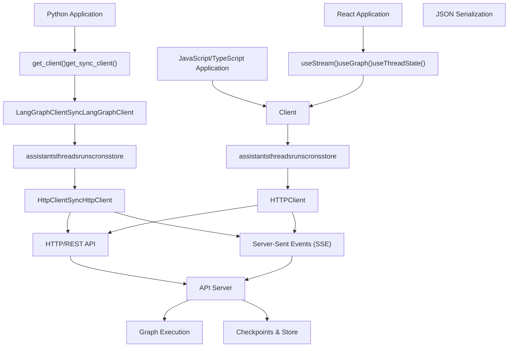
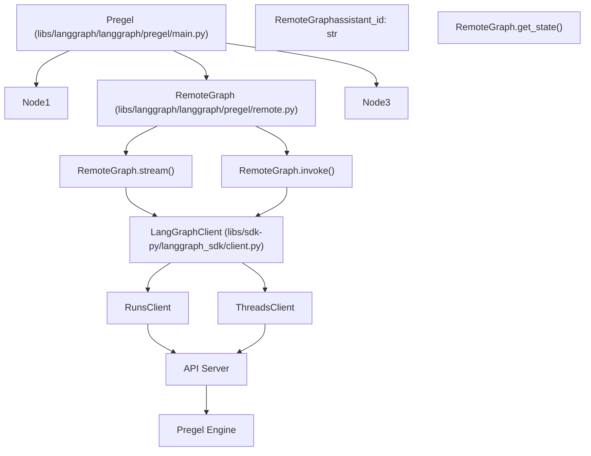

# 客户端 SDK 与远程执行

相关源文件

-   [libs/langgraph/langgraph/_internal/_constants.py](https://github.com/langchain-ai/langgraph/blob/1fd51e8f/libs/langgraph/langgraph/_internal/_constants.py)
-   [libs/langgraph/langgraph/_internal/_replay.py](https://github.com/langchain-ai/langgraph/blob/1fd51e8f/libs/langgraph/langgraph/_internal/_replay.py)
-   [libs/langgraph/langgraph/pregel/_loop.py](https://github.com/langchain-ai/langgraph/blob/1fd51e8f/libs/langgraph/langgraph/pregel/_loop.py)
-   [libs/langgraph/langgraph/pregel/main.py](https://github.com/langchain-ai/langgraph/blob/1fd51e8f/libs/langgraph/langgraph/pregel/main.py)
-   [libs/langgraph/langgraph/pregel/protocol.py](https://github.com/langchain-ai/langgraph/blob/1fd51e8f/libs/langgraph/langgraph/pregel/protocol.py)
-   [libs/langgraph/langgraph/pregel/remote.py](https://github.com/langchain-ai/langgraph/blob/1fd51e8f/libs/langgraph/langgraph/pregel/remote.py)
-   [libs/langgraph/langgraph/warnings.py](https://github.com/langchain-ai/langgraph/blob/1fd51e8f/libs/langgraph/langgraph/warnings.py)
-   [libs/langgraph/tests/test_deprecation.py](https://github.com/langchain-ai/langgraph/blob/1fd51e8f/libs/langgraph/tests/test_deprecation.py)
-   [libs/langgraph/tests/test_interruption.py](https://github.com/langchain-ai/langgraph/blob/1fd51e8f/libs/langgraph/tests/test_interruption.py)
-   [libs/langgraph/tests/test_remote_graph.py](https://github.com/langchain-ai/langgraph/blob/1fd51e8f/libs/langgraph/tests/test_remote_graph.py)
-   [libs/langgraph/tests/test_stream_v2.py](https://github.com/langchain-ai/langgraph/blob/1fd51e8f/libs/langgraph/tests/test_stream_v2.py)
-   [libs/langgraph/tests/test_time_travel.py](https://github.com/langchain-ai/langgraph/blob/1fd51e8f/libs/langgraph/tests/test_time_travel.py)
-   [libs/langgraph/tests/test_time_travel_async.py](https://github.com/langchain-ai/langgraph/blob/1fd51e8f/libs/langgraph/tests/test_time_travel_async.py)
-   [libs/sdk-py/langgraph_sdk/__init__.py](https://github.com/langchain-ai/langgraph/blob/1fd51e8f/libs/sdk-py/langgraph_sdk/__init__.py)
-   [libs/sdk-py/langgraph_sdk/cache.py](https://github.com/langchain-ai/langgraph/blob/1fd51e8f/libs/sdk-py/langgraph_sdk/cache.py)
-   [libs/sdk-py/langgraph_sdk/client.py](https://github.com/langchain-ai/langgraph/blob/1fd51e8f/libs/sdk-py/langgraph_sdk/client.py)
-   [libs/sdk-py/langgraph_sdk/schema.py](https://github.com/langchain-ai/langgraph/blob/1fd51e8f/libs/sdk-py/langgraph_sdk/schema.py)
-   [libs/sdk-py/pyproject.toml](https://github.com/langchain-ai/langgraph/blob/1fd51e8f/libs/sdk-py/pyproject.toml)
-   [libs/sdk-py/tests/test_cache.py](https://github.com/langchain-ai/langgraph/blob/1fd51e8f/libs/sdk-py/tests/test_cache.py)
-   [libs/sdk-py/tests/test_crons_client.py](https://github.com/langchain-ai/langgraph/blob/1fd51e8f/libs/sdk-py/tests/test_crons_client.py)

## 目的与范围

本文档概述了用于通过 HTTP API 与已部署 LangGraph 应用交互的客户端库。这些 SDK 使 Python 与 JavaScript/TypeScript 应用都能以编程方式访问远程图部署。关键能力包括：

-   创建和管理助手、线程、运行与定时任务
-   通过 Server-Sent Events (SSE) 流式获取执行结果
-   通过 `RemoteGraph` 将远程图作为本地图中的节点使用
-   自定义认证与授权
-   通过 Store API 实现跨线程持久存储

部署信息请参见 [CLI and Deployment](/langchain-ai/langgraph/6-cli-and-deployment)。API 端点详情请参见 [LangGraph API Server](#7)。

**相关页面：**

-   [Python SDK](/langchain-ai/langgraph/5.1-python-sdk) - Python 客户端实现细节
-   [JavaScript/TypeScript SDK](/langchain-ai/langgraph/5.2-javascripttypescript-sdk) - JavaScript 客户端实现
-   [HTTP Client and Streaming](/langchain-ai/langgraph/5.3-http-client-and-streaming) - HTTP 层与 SSE 流式传输
-   [Authentication and Authorization](/langchain-ai/langgraph/5.4-authentication-and-authorization) - 自定义认证处理器
-   [Data Models and Schemas](/langchain-ai/langgraph/5.5-data-models-and-schemas) - TypedDict 模式与类型
-   [RemoteGraph](/langchain-ai/langgraph/5.6-remotegraph) - 将远程图作为本地节点使用

**来源：** [libs/sdk-py/langgraph_sdk/client.py1-8](https://github.com/langchain-ai/langgraph/blob/1fd51e8f/libs/sdk-py/langgraph_sdk/client.py#L1-L8) [libs/langgraph/langgraph/pregel/remote.py112-121](https://github.com/langchain-ai/langgraph/blob/1fd51e8f/libs/langgraph/langgraph/pregel/remote.py#L112-L121)

---

## 架构概览

LangGraph SDK 架构提供多语言客户端库，通过 HTTP API 与已部署 LangGraph 应用通信。每个 SDK 都为资源管理、流式执行和认证提供类型化接口。

### 多语言客户端架构


**来源：** [libs/sdk-py/langgraph_sdk/client.py1-55](https://github.com/langchain-ai/langgraph/blob/1fd51e8f/libs/sdk-py/langgraph_sdk/client.py#L1-L55) [libs/sdk-py/pyproject.toml5-14](https://github.com/langchain-ai/langgraph/blob/1fd51e8f/libs/sdk-py/pyproject.toml#L5-L14)

---

## 客户端工厂函数

SDK 提供两个工厂函数，用于创建已配置的客户端实例，具备自动认证、连接处理和可选的进程内通信能力。

### get_client() - 异步客户端

```
def get_client(    *,    url: str | None = None,    api_key: str | None = NOT_PROVIDED,    headers: Mapping[str, str] | None = None,    timeout: TimeoutTypes | None = None,) -> LangGraphClient
```
创建异步 `LangGraphClient` 实例。关键行为包括：

-   **API Key 解析**：从环境变量解析 API key：`LANGGRAPH_API_KEY`、`LANGSMITH_API_KEY` 或 `LANGCHAIN_API_KEY`。
-   **传输层**：对远程 URL 使用 `httpx.AsyncClient`；对进程内服务器实例使用 loopback 专用传输。
-   **序列化**：使用 `orjson` 进行高性能 JSON 编解码。

**来源：** [libs/sdk-py/langgraph_sdk/client.py16](https://github.com/langchain-ai/langgraph/blob/1fd51e8f/libs/sdk-py/langgraph_sdk/client.py#L16-L16) [libs/sdk-py/langgraph_sdk/__init__.py2](https://github.com/langchain-ai/langgraph/blob/1fd51e8f/libs/sdk-py/langgraph_sdk/__init__.py#L2-L2) [libs/sdk-py/pyproject.toml14](https://github.com/langchain-ai/langgraph/blob/1fd51e8f/libs/sdk-py/pyproject.toml#L14-L14)

### get_sync_client() - 同步客户端

```
def get_sync_client(    *,    url: str | None = None,    api_key: str | None = NOT_PROVIDED,    headers: Mapping[str, str] | None = None,    timeout: TimeoutTypes | None = None,) -> SyncLangGraphClient
```
创建同步 `SyncLangGraphClient`，其配置选项与异步版本一致。它使用 `httpx.Client` 而非 `httpx.AsyncClient`。

**来源：** [libs/sdk-py/langgraph_sdk/client.py26](https://github.com/langchain-ai/langgraph/blob/1fd51e8f/libs/sdk-py/langgraph_sdk/client.py#L26-L26) [libs/sdk-py/langgraph_sdk/__init__.py2](https://github.com/langchain-ai/langgraph/blob/1fd51e8f/libs/sdk-py/langgraph_sdk/__init__.py#L2-L2)

---

## 顶层客户端类

### LangGraphClient

异步顶层客户端暴露五个资源专用子客户端：

```
class LangGraphClient:    assistants: AssistantsClient    threads: ThreadsClient    runs: RunsClient    crons: CronClient    store: StoreClient
```
**来源：** [libs/sdk-py/langgraph_sdk/client.py16-21](https://github.com/langchain-ai/langgraph/blob/1fd51e8f/libs/sdk-py/langgraph_sdk/client.py#L16-L21)

### SyncLangGraphClient

具有相同结构的同步版本：

```
class SyncLangGraphClient:    assistants: SyncAssistantsClient    threads: SyncThreadsClient    runs: SyncRunsClient    crons: SyncCronClient    store: SyncStoreClient
```
**来源：** [libs/sdk-py/langgraph_sdk/client.py26-31](https://github.com/langchain-ai/langgraph/blob/1fd51e8f/libs/sdk-py/langgraph_sdk/client.py#L26-L31)

### 子客户端映射

每个资源专用子客户端提供特化操作：

| 子客户端 | 异步类 | 同步类 |
| --- | --- | --- |
| Assistants | `AssistantsClient` | `SyncAssistantsClient` |
| Threads | `ThreadsClient` | `SyncThreadsClient` |
| Runs | `RunsClient` | `SyncRunsClient` |
| Crons | `CronClient` | `SyncCronClient` |
| Store | `StoreClient` | `SyncStoreClient` |

**来源：** [libs/sdk-py/langgraph_sdk/client.py12-31](https://github.com/langchain-ai/langgraph/blob/1fd51e8f/libs/sdk-py/langgraph_sdk/client.py#L12-L31)

---

## RemoteGraph - 将远程执行作为本地节点

`RemoteGraph` 类实现了 `PregelProtocol` 接口，使远程图可以作为本地图中的节点使用。这使得分布式图架构成为可能，即子图可在不同服务器上运行。

### RemoteGraph 架构


**来源：** [libs/langgraph/langgraph/pregel/remote.py112-139](https://github.com/langchain-ai/langgraph/blob/1fd51e8f/libs/langgraph/langgraph/pregel/remote.py#L112-L139) [libs/langgraph/langgraph/pregel/protocol.py25-50](https://github.com/langchain-ai/langgraph/blob/1fd51e8f/libs/langgraph/langgraph/pregel/protocol.py#L25-L50)

### 关键方法

#### stream() and astream()

从远程部署流式获取执行结果。它负责将远程 `StreamPart` 对象映射回本地图事件。

**来源：** [libs/langgraph/langgraph/pregel/remote.py685-700](https://github.com/langchain-ai/langgraph/blob/1fd51e8f/libs/langgraph/langgraph/pregel/remote.py#L685-L700) [libs/langgraph/langgraph/pregel/protocol.py108-149](https://github.com/langchain-ai/langgraph/blob/1fd51e8f/libs/langgraph/langgraph/pregel/protocol.py#L108-L149)

#### get_state() and aget_state()

从远程服务器检索线程状态，返回包含值、下一节点和配置的 `StateSnapshot`。

**来源：** [libs/langgraph/langgraph/pregel/remote.py398-410](https://github.com/langchain-ai/langgraph/blob/1fd51e8f/libs/langgraph/langgraph/pregel/remote.py#L398-L410) [libs/langgraph/langgraph/pregel/protocol.py48-55](https://github.com/langchain-ai/langgraph/blob/1fd51e8f/libs/langgraph/langgraph/pregel/protocol.py#L48-L55)

---

## 数据模型与模式

SDK 使用 `TypedDict` 类来提供类型安全的数据结构。所有模式都定义在 `langgraph_sdk.schema` 中。

### 核心资源模型

-   **Assistant**：表示图的一个带版本配置。[libs/sdk-py/langgraph_sdk/schema.py236-240](https://github.com/langchain-ai/langgraph/blob/1fd51e8f/libs/sdk-py/langgraph_sdk/schema.py#L236-L240)
-   **Thread**：表示具有持久状态的会话线程。[libs/sdk-py/langgraph_sdk/schema.py34-41](https://github.com/langchain-ai/langgraph/blob/1fd51e8f/libs/sdk-py/langgraph_sdk/schema.py#L34-L41)
-   **Run**：表示图在线程上的一次单独执行运行。[libs/sdk-py/langgraph_sdk/schema.py23-32](https://github.com/langchain-ai/langgraph/blob/1fd51e8f/libs/sdk-py/langgraph_sdk/schema.py#L23-L32)
-   **Cron**：表示按指定间隔创建运行的定时任务。[libs/sdk-py/langgraph_sdk/schema.py156-167](https://github.com/langchain-ai/langgraph/blob/1fd51e8f/libs/sdk-py/langgraph_sdk/schema.py#L156-L167)

### 流式模型

事件以 `StreamPart` 命名元组返回，包含 `event` 类型与 `data` 负载。

**来源：** [libs/sdk-py/langgraph_sdk/schema.py51-72](https://github.com/langchain-ai/langgraph/blob/1fd51e8f/libs/sdk-py/langgraph_sdk/schema.py#L51-L72)

---

## 认证与授权

SDK 通过 `Auth` 类提供自定义认证与授权框架。

-   **@auth.authenticate**：用于定义自定义认证器的装饰器，可从请求头或参数中解析用户身份。
-   **@auth.on**：用于定义特定资源（Assistants、Threads、Runs 等）和操作（create、read、update、delete）的授权处理器装饰器。

**来源：** [libs/sdk-py/langgraph_sdk/__init__.py1](https://github.com/langchain-ai/langgraph/blob/1fd51e8f/libs/sdk-py/langgraph_sdk/__init__.py#L1-L1) [libs/sdk-py/langgraph_sdk/client.py1-8](https://github.com/langchain-ai/langgraph/blob/1fd51e8f/libs/sdk-py/langgraph_sdk/client.py#L1-L8)

---

## 包结构与分发

SDK 以 `langgraph-sdk` 包进行分发。

### 包元数据

来自 `libs/sdk-py/pyproject.toml`：

```
[project]name = "langgraph-sdk"dependencies = ["httpx>=0.25.2", "orjson>=3.11.5"]
```
**来源：** [libs/sdk-py/pyproject.toml6-14](https://github.com/langchain-ai/langgraph/blob/1fd51e8f/libs/sdk-py/pyproject.toml#L6-L14)

### 公共 API 表面

顶层 `__init__.py` 导出主要工厂函数和基类：

```
from langgraph_sdk import Auth, Encryption, get_client, get_sync_client
```
**来源：** [libs/sdk-py/langgraph_sdk/__init__.py1-8](https://github.com/langchain-ai/langgraph/blob/1fd51e8f/libs/sdk-py/langgraph_sdk/__init__.py#L1-L8)
