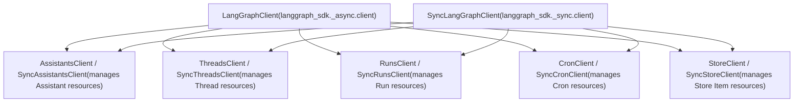
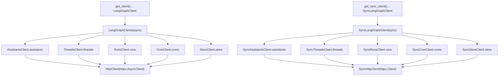
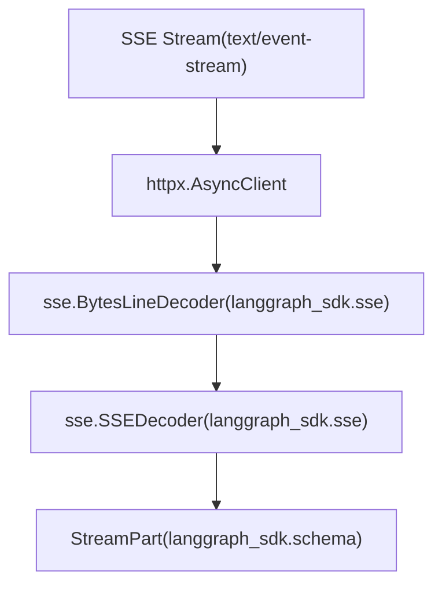

# Python SDK

相关源文件

-   [libs/checkpoint-conformance/pyproject.toml](https://github.com/langchain-ai/langgraph/blob/1fd51e8f/libs/checkpoint-conformance/pyproject.toml)
-   [libs/sdk-py/langgraph_sdk/__init__.py](https://github.com/langchain-ai/langgraph/blob/1fd51e8f/libs/sdk-py/langgraph_sdk/__init__.py)
-   [libs/sdk-py/langgraph_sdk/_async/assistants.py](https://github.com/langchain-ai/langgraph/blob/1fd51e8f/libs/sdk-py/langgraph_sdk/_async/assistants.py)
-   [libs/sdk-py/langgraph_sdk/_async/client.py](https://github.com/langchain-ai/langgraph/blob/1fd51e8f/libs/sdk-py/langgraph_sdk/_async/client.py)
-   [libs/sdk-py/langgraph_sdk/_async/cron.py](https://github.com/langchain-ai/langgraph/blob/1fd51e8f/libs/sdk-py/langgraph_sdk/_async/cron.py)
-   [libs/sdk-py/langgraph_sdk/_async/runs.py](https://github.com/langchain-ai/langgraph/blob/1fd51e8f/libs/sdk-py/langgraph_sdk/_async/runs.py)
-   [libs/sdk-py/langgraph_sdk/_async/store.py](https://github.com/langchain-ai/langgraph/blob/1fd51e8f/libs/sdk-py/langgraph_sdk/_async/store.py)
-   [libs/sdk-py/langgraph_sdk/_async/threads.py](https://github.com/langchain-ai/langgraph/blob/1fd51e8f/libs/sdk-py/langgraph_sdk/_async/threads.py)
-   [libs/sdk-py/langgraph_sdk/_shared/utilities.py](https://github.com/langchain-ai/langgraph/blob/1fd51e8f/libs/sdk-py/langgraph_sdk/_shared/utilities.py)
-   [libs/sdk-py/langgraph_sdk/_sync/assistants.py](https://github.com/langchain-ai/langgraph/blob/1fd51e8f/libs/sdk-py/langgraph_sdk/_sync/assistants.py)
-   [libs/sdk-py/langgraph_sdk/_sync/cron.py](https://github.com/langchain-ai/langgraph/blob/1fd51e8f/libs/sdk-py/langgraph_sdk/_sync/cron.py)
-   [libs/sdk-py/langgraph_sdk/_sync/runs.py](https://github.com/langchain-ai/langgraph/blob/1fd51e8f/libs/sdk-py/langgraph_sdk/_sync/runs.py)
-   [libs/sdk-py/langgraph_sdk/_sync/store.py](https://github.com/langchain-ai/langgraph/blob/1fd51e8f/libs/sdk-py/langgraph_sdk/_sync/store.py)
-   [libs/sdk-py/langgraph_sdk/_sync/threads.py](https://github.com/langchain-ai/langgraph/blob/1fd51e8f/libs/sdk-py/langgraph_sdk/_sync/threads.py)
-   [libs/sdk-py/langgraph_sdk/cache.py](https://github.com/langchain-ai/langgraph/blob/1fd51e8f/libs/sdk-py/langgraph_sdk/cache.py)
-   [libs/sdk-py/langgraph_sdk/client.py](https://github.com/langchain-ai/langgraph/blob/1fd51e8f/libs/sdk-py/langgraph_sdk/client.py)
-   [libs/sdk-py/langgraph_sdk/schema.py](https://github.com/langchain-ai/langgraph/blob/1fd51e8f/libs/sdk-py/langgraph_sdk/schema.py)
-   [libs/sdk-py/pyproject.toml](https://github.com/langchain-ai/langgraph/blob/1fd51e8f/libs/sdk-py/pyproject.toml)
-   [libs/sdk-py/tests/test_cache.py](https://github.com/langchain-ai/langgraph/blob/1fd51e8f/libs/sdk-py/tests/test_cache.py)
-   [libs/sdk-py/tests/test_crons_client.py](https://github.com/langchain-ai/langgraph/blob/1fd51e8f/libs/sdk-py/tests/test_crons_client.py)

Python SDK 提供了与 LangGraph API 服务器交互的客户端库。它同时提供异步与同步客户端，用于管理 assistants、threads、runs、cron jobs 以及持久化存储。SDK 负责 HTTP 通信、带自动重连的 Server-Sent Events (SSE) 流式传输，并为所有 API 资源提供强类型数据模型。

关于该 SDK 的 JavaScript/TypeScript 对应实现，请参见 [JavaScript/TypeScript SDK](/langchain-ai/langgraph/5.2-javascripttypescript-sdk)。关于认证与授权配置（服务端）详情，请参见 [Authentication and Authorization](/langchain-ai/langgraph/5.4-authentication-and-authorization)。关于 RemoteGraph 用法（将已部署图作为节点），请参见 [RemoteGraph](/langchain-ai/langgraph/5.6-remotegraph)。

---

## 包结构与依赖

SDK 是位于 `libs/sdk-py` 的独立包，依赖最小。它使用 `hatchling` 作为构建后端，并使用 `uv` 进行依赖管理。

**依赖：**

-   `httpx>=0.25.2` - 支持异步的 HTTP 客户端。[libs/sdk-py/pyproject.toml14](https://github.com/langchain-ai/langgraph/blob/1fd51e8f/libs/sdk-py/pyproject.toml#L14-L14)
-   `orjson>=3.11.5` - 高速 JSON 序列化。[libs/sdk-py/pyproject.toml14](https://github.com/langchain-ai/langgraph/blob/1fd51e8f/libs/sdk-py/pyproject.toml#L14-L14)
-   Python 3.10+ [libs/sdk-py/pyproject.toml10](https://github.com/langchain-ai/langgraph/blob/1fd51e8f/libs/sdk-py/pyproject.toml#L10-L10)

**安装：**

```
pip install langgraph-sdk
```
来源: [libs/sdk-py/pyproject.toml1-57](https://github.com/langchain-ai/langgraph/blob/1fd51e8f/libs/sdk-py/pyproject.toml#L1-L57)

---

## 客户端架构

SDK 被组织为资源专用客户端，这些客户端封装了底层 HTTP 客户端。

### 代码实体空间到系统名称

该图将 Python 类映射到它们在 LangGraph 生态中管理的逻辑资源。


来源: [libs/sdk-py/langgraph_sdk/client.py12-31](https://github.com/langchain-ai/langgraph/blob/1fd51e8f/libs/sdk-py/langgraph_sdk/client.py#L12-L31) [libs/sdk-py/langgraph_sdk/_async/client.py1-20](https://github.com/langchain-ai/langgraph/blob/1fd51e8f/libs/sdk-py/langgraph_sdk/_async/client.py#L1-L20)

### 客户端工厂与层级

主要入口是工厂函数，它们会实例化主客户端类。


**主客户端结构**

SDK 提供两个作为入口点的主客户端类：

| 客户端 | 用途 | 导入路径 |
| --- | --- | --- |
| `LangGraphClient` | 异步操作 | `from langgraph_sdk import get_client` |
| `SyncLangGraphClient` | 同步操作 | `from langgraph_sdk import get_sync_client` |

每个主客户端都通过属性（`.assistants`、`.threads`、`.runs`、`.crons`、`.store`）提供对资源专用子客户端的访问。[libs/sdk-py/langgraph_sdk/client.py12-31](https://github.com/langchain-ai/langgraph/blob/1fd51e8f/libs/sdk-py/langgraph_sdk/client.py#L12-L31)

来源: [libs/sdk-py/langgraph_sdk/client.py1-55](https://github.com/langchain-ai/langgraph/blob/1fd51e8f/libs/sdk-py/langgraph_sdk/client.py#L1-L55) [libs/sdk-py/langgraph_sdk/__init__.py1-9](https://github.com/langchain-ai/langgraph/blob/1fd51e8f/libs/sdk-py/langgraph_sdk/__init__.py#L1-L9)

---

## 资源客户端 API

### AssistantsClient / SyncAssistantsClient

管理 `Assistant` 资源，它是图的带版本配置（将 `graph_id` 关联到特定 `config`、`metadata` 与 `context`）。[libs/sdk-py/langgraph_sdk/schema.py211-231](https://github.com/langchain-ai/langgraph/blob/1fd51e8f/libs/sdk-py/langgraph_sdk/schema.py#L211-L231)

**关键方法：**

| 方法 | 描述 | 返回 |
| --- | --- | --- |
| `create(graph_id, ...)` | 创建新 assistant。[libs/sdk-py/langgraph_sdk/_async/assistants.py246](https://github.com/langchain-ai/langgraph/blob/1fd51e8f/libs/sdk-py/langgraph_sdk/_async/assistants.py#L246-L246) | `Assistant` |
| `get(assistant_id)` | 按 ID 获取 assistant。[libs/sdk-py/langgraph_sdk/_async/assistants.py45](https://github.com/langchain-ai/langgraph/blob/1fd51e8f/libs/sdk-py/langgraph_sdk/_async/assistants.py#L45-L45) | `Assistant` |
| `update(assistant_id, ...)` | 更新 assistant 属性。[libs/sdk-py/langgraph_sdk/_async/assistants.py307](https://github.com/langchain-ai/langgraph/blob/1fd51e8f/libs/sdk-py/langgraph_sdk/_async/assistants.py#L307-L307) | `Assistant` |
| `delete(assistant_id)` | 删除 assistant。[libs/sdk-py/langgraph_sdk/_async/assistants.py348](https://github.com/langchain-ai/langgraph/blob/1fd51e8f/libs/sdk-py/langgraph_sdk/_async/assistants.py#L348-L348) | `None` |
| `search(metadata=None, ...)` | 使用过滤器搜索 assistants。[libs/sdk-py/langgraph_sdk/_async/assistants.py365](https://github.com/langchain-ai/langgraph/blob/1fd51e8f/libs/sdk-py/langgraph_sdk/_async/assistants.py#L365-L365) | `list[Assistant]` |
| `get_graph(assistant_id)` | 获取图结构（nodes/edges）。[libs/sdk-py/langgraph_sdk/_async/assistants.py90](https://github.com/langchain-ai/langgraph/blob/1fd51e8f/libs/sdk-py/langgraph_sdk/_async/assistants.py#L90-L90) | `dict` |
| `get_schemas(assistant_id)` | 获取输入/输出/状态模式。[libs/sdk-py/langgraph_sdk/_async/assistants.py148](https://github.com/langchain-ai/langgraph/blob/1fd51e8f/libs/sdk-py/langgraph_sdk/_async/assistants.py#L148-L148) | `GraphSchema` |

来源: [libs/sdk-py/langgraph_sdk/_async/assistants.py28-440](https://github.com/langchain-ai/langgraph/blob/1fd51e8f/libs/sdk-py/langgraph_sdk/_async/assistants.py#L28-L440) [libs/sdk-py/langgraph_sdk/_sync/assistants.py28-435](https://github.com/langchain-ai/langgraph/blob/1fd51e8f/libs/sdk-py/langgraph_sdk/_sync/assistants.py#L28-L435)

---

### ThreadsClient / SyncThreadsClient

管理 `Thread` 资源，它在多次交互之间维护图状态。[libs/sdk-py/langgraph_sdk/_async/threads.py27-40](https://github.com/langchain-ai/langgraph/blob/1fd51e8f/libs/sdk-py/langgraph_sdk/_async/threads.py#L27-L40)

**关键方法：**

| 方法 | 描述 | 返回 |
| --- | --- | --- |
| `create(metadata=None, ...)` | 创建新线程。[libs/sdk-py/langgraph_sdk/_async/threads.py98](https://github.com/langchain-ai/langgraph/blob/1fd51e8f/libs/sdk-py/langgraph_sdk/_async/threads.py#L98-L98) | `Thread` |
| `get(thread_id)` | 按 ID 获取线程。[libs/sdk-py/langgraph_sdk/_async/threads.py45](https://github.com/langchain-ai/langgraph/blob/1fd51e8f/libs/sdk-py/langgraph_sdk/_async/threads.py#L45-L45) | `Thread` |
| `update(thread_id, metadata)` | 更新线程 metadata 或 TTL。[libs/sdk-py/langgraph_sdk/_async/threads.py175](https://github.com/langchain-ai/langgraph/blob/1fd51e8f/libs/sdk-py/langgraph_sdk/_async/threads.py#L175-L175) | `Thread` |
| `get_state(thread_id, ...)` | 获取当前线程状态。[libs/sdk-py/langgraph_sdk/_async/threads.py253](https://github.com/langchain-ai/langgraph/blob/1fd51e8f/libs/sdk-py/langgraph_sdk/_async/threads.py#L253-L253) | `ThreadState` |
| `update_state(thread_id, values, ...)` | 手动更新线程状态。[libs/sdk-py/langgraph_sdk/_async/threads.py322](https://github.com/langchain-ai/langgraph/blob/1fd51e8f/libs/sdk-py/langgraph_sdk/_async/threads.py#L322-L322) | `ThreadUpdateStateResponse` |
| `get_history(thread_id, ...)` | 获取状态历史（checkpoints）。[libs/sdk-py/langgraph_sdk/_async/threads.py410](https://github.com/langchain-ai/langgraph/blob/1fd51e8f/libs/sdk-py/langgraph_sdk/_async/threads.py#L410-L410) | `list[ThreadState]` |

来源: [libs/sdk-py/langgraph_sdk/_async/threads.py1-450](https://github.com/langchain-ai/langgraph/blob/1fd51e8f/libs/sdk-py/langgraph_sdk/_async/threads.py#L1-L450) [libs/sdk-py/langgraph_sdk/_sync/threads.py1-445](https://github.com/langchain-ai/langgraph/blob/1fd51e8f/libs/sdk-py/langgraph_sdk/_sync/threads.py#L1-L445)

---

### RunsClient / SyncRunsClient

管理 assistant 在线程上的执行。`Run` 表示一次单独调用。[libs/sdk-py/langgraph_sdk/_async/runs.py54-66](https://github.com/langchain-ai/langgraph/blob/1fd51e8f/libs/sdk-py/langgraph_sdk/_async/runs.py#L54-L66)

**关键方法：**

| 方法 | 描述 | 返回 |
| --- | --- | --- |
| `stream(thread_id, assistant_id, ...)` | 流式获取执行事件（SSE）。[libs/sdk-py/langgraph_sdk/_async/runs.py72-187](https://github.com/langchain-ai/langgraph/blob/1fd51e8f/libs/sdk-py/langgraph_sdk/_async/runs.py#L72-L187) | `AsyncIterator[StreamPart]` |
| `create(thread_id, assistant_id, ...)` | 启动后台运行。[libs/sdk-py/langgraph_sdk/_async/runs.py317](https://github.com/langchain-ai/langgraph/blob/1fd51e8f/libs/sdk-py/langgraph_sdk/_async/runs.py#L317-L317) | `Run` |
| `wait(thread_id, assistant_id, ...)` | 启动运行并阻塞等待结果。[libs/sdk-py/langgraph_sdk/_async/runs.py416](https://github.com/langchain-ai/langgraph/blob/1fd51e8f/libs/sdk-py/langgraph_sdk/_async/runs.py#L416-L416) | `dict` |
| `cancel(thread_id, run_id, action=None)` | 取消正在运行的执行。[libs/sdk-py/langgraph_sdk/_async/runs.py539](https://github.com/langchain-ai/langgraph/blob/1fd51e8f/libs/sdk-py/langgraph_sdk/_async/runs.py#L539-L539) | `None` |

**流模式**：`stream_mode` 参数决定产出的数据：`values`、`messages`、`updates`、`events`、`tasks`、`checkpoints`、`debug`。[libs/sdk-py/langgraph_sdk/schema.py51-72](https://github.com/langchain-ai/langgraph/blob/1fd51e8f/libs/sdk-py/langgraph_sdk/schema.py#L51-L72)

来源: [libs/sdk-py/langgraph_sdk/_async/runs.py1-600](https://github.com/langchain-ai/langgraph/blob/1fd51e8f/libs/sdk-py/langgraph_sdk/_async/runs.py#L1-L600) [libs/sdk-py/langgraph_sdk/schema.py23-41](https://github.com/langchain-ai/langgraph/blob/1fd51e8f/libs/sdk-py/langgraph_sdk/schema.py#L23-L41)

---

### CronClient / SyncCronClient

管理使用 cron 语法调度的周期性运行。[libs/sdk-py/langgraph_sdk/_async/cron.py29-52](https://github.com/langchain-ai/langgraph/blob/1fd51e8f/libs/sdk-py/langgraph_sdk/_async/cron.py#L29-L52)

**关键方法：**

| 方法 | 描述 | 返回 |
| --- | --- | --- |
| `create_for_thread(thread_id, assistant_id, schedule, ...)` | 在线程上调度周期运行。[libs/sdk-py/langgraph_sdk/_async/cron.py57](https://github.com/langchain-ai/langgraph/blob/1fd51e8f/libs/sdk-py/langgraph_sdk/_async/cron.py#L57-L57) | `Run` |
| `create(assistant_id, schedule, ...)` | 调度无状态周期运行。[libs/sdk-py/langgraph_sdk/_async/cron.py175](https://github.com/langchain-ai/langgraph/blob/1fd51e8f/libs/sdk-py/langgraph_sdk/_async/cron.py#L175-L175) | `Run` |
| `delete(cron_id)` | 删除一个 cron 任务。[libs/sdk-py/langgraph_sdk/_async/cron.py284](https://github.com/langchain-ai/langgraph/blob/1fd51e8f/libs/sdk-py/langgraph_sdk/_async/cron.py#L284-L284) | `None` |

来源: [libs/sdk-py/langgraph_sdk/_async/cron.py1-350](https://github.com/langchain-ai/langgraph/blob/1fd51e8f/libs/sdk-py/langgraph_sdk/_async/cron.py#L1-L350) [libs/sdk-py/langgraph_sdk/_sync/cron.py1-340](https://github.com/langchain-ai/langgraph/blob/1fd51e8f/libs/sdk-py/langgraph_sdk/_sync/cron.py#L1-L340)

---

## HTTP 层与流式传输

SDK 使用 `httpx` 作为底层传输，并实现了自定义 SSE（Server-Sent Events）解码器。

### 流式数据流

该图追踪了来自 LangGraph API 的原始字节如何转换为类型化 Python 对象。


**SSE 解码：**

-   `BytesLineDecoder`：将输入字节流拆分为行，处理不同换行符（`\n`、`\r`、`\r\n`）。[libs/sdk-py/langgraph_sdk/sse.py17-76](https://github.com/langchain-ai/langgraph/blob/1fd51e8f/libs/sdk-py/langgraph_sdk/sse.py#L17-L76)
-   `SSEDecoder`：将行解析为 SSE 字段（`event`、`data`、`id`、`retry`），并产出 `StreamPart` 对象。[libs/sdk-py/langgraph_sdk/sse.py78-140](https://github.com/langchain-ai/langgraph/blob/1fd51e8f/libs/sdk-py/langgraph_sdk/sse.py#L78-L140)

来源: [libs/sdk-py/langgraph_sdk/sse.py1-158](https://github.com/langchain-ai/langgraph/blob/1fd51e8f/libs/sdk-py/langgraph_sdk/sse.py#L1-L158) [libs/sdk-py/langgraph_sdk/schema.py1-41](https://github.com/langchain-ai/langgraph/blob/1fd51e8f/libs/sdk-py/langgraph_sdk/schema.py#L1-L41)

---

## 数据模型与模式

SDK 使用 `TypedDict` 与 `Literal` 类型，为 API 资源提供静态类型检查。

**常用枚举：**

-   `RunStatus`: `pending`、`running`、`error`、`success`、`timeout`、`interrupted`。[libs/sdk-py/langgraph_sdk/schema.py23-32](https://github.com/langchain-ai/langgraph/blob/1fd51e8f/libs/sdk-py/langgraph_sdk/schema.py#L23-L32)
-   `ThreadStatus`: `idle`、`busy`、`interrupted`、`error`。[libs/sdk-py/langgraph_sdk/schema.py34-41](https://github.com/langchain-ai/langgraph/blob/1fd51e8f/libs/sdk-py/langgraph_sdk/schema.py#L34-L41)
-   `MultitaskStrategy`: `reject`、`interrupt`、`rollback`、`enqueue`。[libs/sdk-py/langgraph_sdk/schema.py81-88](https://github.com/langchain-ai/langgraph/blob/1fd51e8f/libs/sdk-py/langgraph_sdk/schema.py#L81-L88)

**资源模式：**

-   `Assistant`：表示一个已配置的图实例。[libs/sdk-py/langgraph_sdk/schema.py236-278](https://github.com/langchain-ai/langgraph/blob/1fd51e8f/libs/sdk-py/langgraph_sdk/schema.py#L236-L278)
-   `Thread`：表示一个有状态会话。[libs/sdk-py/langgraph_sdk/schema.py283-315](https://github.com/langchain-ai/langgraph/blob/1fd51e8f/libs/sdk-py/langgraph_sdk/schema.py#L283-L315)
-   `Checkpoint`：表示一个保存的状态快照。[libs/sdk-py/langgraph_sdk/schema.py198-209](https://github.com/langchain-ai/langgraph/blob/1fd51e8f/libs/sdk-py/langgraph_sdk/schema.py#L198-L209)

来源: [libs/sdk-py/langgraph_sdk/schema.py1-200](https://github.com/langchain-ai/langgraph/blob/1fd51e8f/libs/sdk-py/langgraph_sdk/schema.py#L1-L200)

---

## 使用示例

### 异步客户端初始化

```
from langgraph_sdk import get_client async with get_client(url="http://localhost:2024") as client:    # Use client.assistants, client.threads, etc.    assistants = await client.assistants.search()
```
来源: [libs/sdk-py/langgraph_sdk/client.py16](https://github.com/langchain-ai/langgraph/blob/1fd51e8f/libs/sdk-py/langgraph_sdk/client.py#L16-L16) [libs/sdk-py/langgraph_sdk/_async/client.py1-20](https://github.com/langchain-ai/langgraph/blob/1fd51e8f/libs/sdk-py/langgraph_sdk/_async/client.py#L1-L20)

### 流式运行

```
async for chunk in client.runs.stream(    thread_id=None, # Stateless run    assistant_id="agent",    input={"messages": [{"role": "user", "content": "hello"}]},    stream_mode="values"):    if chunk.event == "values":        print(chunk.data)
```
来源: [libs/sdk-py/langgraph_sdk/_async/runs.py189-210](https://github.com/langchain-ai/langgraph/blob/1fd51e8f/libs/sdk-py/langgraph_sdk/_async/runs.py#L189-L210)
