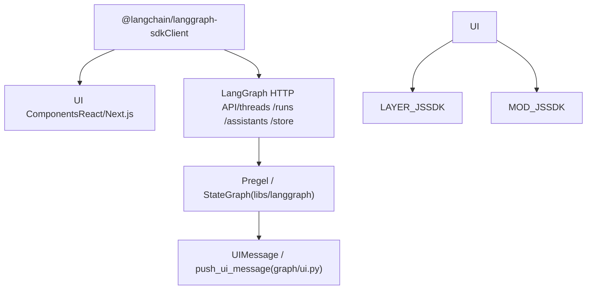
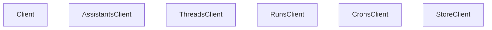

# JavaScript/TypeScript SDK

相关源文件

-   [libs/langgraph/langgraph/graph/message.py](https://github.com/langchain-ai/langgraph/blob/1fd51e8f/libs/langgraph/langgraph/graph/message.py)
-   [libs/langgraph/langgraph/graph/ui.py](https://github.com/langchain-ai/langgraph/blob/1fd51e8f/libs/langgraph/langgraph/graph/ui.py)
-   [libs/langgraph/tests/test_messages_state.py](https://github.com/langchain-ai/langgraph/blob/1fd51e8f/libs/langgraph/tests/test_messages_state.py)
-   [libs/sdk-js/README.md](https://github.com/langchain-ai/langgraph/blob/1fd51e8f/libs/sdk-js/README.md?plain=1)
-   [libs/sdk-py/README.md](https://github.com/langchain-ai/langgraph/blob/1fd51e8f/libs/sdk-py/README.md?plain=1)

本页记录用于与已部署 LangGraph API 服务器交互的 JavaScript/TypeScript SDK。内容涵盖客户端类结构、可用的资源子客户端、基于 SSE 的流式传输，以及 SDK 支持的 UI 集成模式。

关于该 SDK 的 Python 对应实现，请参见页面 [5.1](https://github.com/langchain-ai/langgraph/blob/1fd51e8f/5.1) 关于两种 SDK 共享的 HTTP 传输与流式内部机制，请参见页面 [5.3](https://github.com/langchain-ai/langgraph/blob/1fd51e8f/5.3) 关于两种 SDK 共同操作的服务端数据模型，请参见页面 [5.5](https://github.com/langchain-ai/langgraph/blob/1fd51e8f/5.5)

---

## 概览

JS/TS SDK（原位于 `libs/sdk-js`，现迁移至 `langchain-ai/langgraphjs`）提供 `Client` 类，通过 HTTP 与 SSE 与 LangGraph API 服务器通信 [libs/sdk-js/README.md1](https://github.com/langchain-ai/langgraph/blob/1fd51e8f/libs/sdk-js/README.md?plain=1#L1-L1) 该 SDK 镜像了 Python SDK 的资源子客户端模型，为管理 Assistants、Threads、Runs 和 Store 提供一致接口。

**图：JS/TS SDK 在生态中的包角色**


来源: [libs/sdk-js/README.md1](https://github.com/langchain-ai/langgraph/blob/1fd51e8f/libs/sdk-js/README.md?plain=1#L1-L1) [libs/langgraph/langgraph/graph/ui.py1-19](https://github.com/langchain-ai/langgraph/blob/1fd51e8f/libs/langgraph/langgraph/graph/ui.py#L1-L19)

---

## 客户端结构

JS/TS SDK 暴露一个顶层 `Client` 类。构造完成后，客户端会通过属性提供每个 API 资源的类型化子客户端。该架构与 Python SDK 的 `LangGraphClient` 一致 [libs/sdk-py/langgraph_sdk/client.py12-55](https://github.com/langchain-ai/langgraph/blob/1fd51e8f/libs/sdk-py/langgraph_sdk/client.py#L12-L55)

**图：JS 客户端类层级**


来源: [libs/sdk-py/langgraph_sdk/client.py12-55](https://github.com/langchain-ai/langgraph/blob/1fd51e8f/libs/sdk-py/langgraph_sdk/client.py#L12-L55) [libs/sdk-py/README.md16-35](https://github.com/langchain-ai/langgraph/blob/1fd51e8f/libs/sdk-py/README.md?plain=1#L16-L35)

---

## UI 集成与消息处理

该 SDK 通过处理面向前端渲染的特定消息类型，支持“生成式 UI”模式。

### UI 消息类型

SDK 支持 `UIMessage` 与 `RemoveUIMessage` 结构，用于让图执行过程发出 UI 变更信号 [libs/langgraph/langgraph/graph/ui.py22-58](https://github.com/langchain-ai/langgraph/blob/1fd51e8f/libs/langgraph/langgraph/graph/ui.py#L22-L58)

| 类型 | 属性 | 用途 |
| --- | --- | --- |
| `UIMessage` | `id`, `name`, `props`, `metadata` | 指示 UI 按名称渲染特定组件，并附带提供的 props [libs/langgraph/langgraph/graph/ui.py22-41](https://github.com/langchain-ai/langgraph/blob/1fd51e8f/libs/langgraph/langgraph/graph/ui.py#L22-L41) |
| `RemoveUIMessage` | `id` | 指示 UI 移除此前渲染的组件 [libs/langgraph/langgraph/graph/ui.py43-56](https://github.com/langchain-ai/langgraph/blob/1fd51e8f/libs/langgraph/langgraph/graph/ui.py#L43-L56) |

### 面向 UI 的状态归约

为管理活跃 UI 组件列表，SDK 逻辑（在 `ui_message_reducer` 中镜像）会处理新消息合并和移除应用 [libs/langgraph/langgraph/graph/ui.py165-227](https://github.com/langchain-ai/langgraph/blob/1fd51e8f/libs/langgraph/langgraph/graph/ui.py#L165-L227)

-   **合并**：若收到的 `UIMessage` 使用了已存在 ID 且 metadata 中 `merge: true`，SDK 会将新的 `props` 与现有值合并 [libs/langgraph/langgraph/graph/ui.py211-216](https://github.com/langchain-ai/langgraph/blob/1fd51e8f/libs/langgraph/langgraph/graph/ui.py#L211-L216)
-   **移除**：若收到 `RemoveUIMessage`，会从状态中筛除对应 ID 的消息 [libs/langgraph/langgraph/graph/ui.py206-226](https://github.com/langchain-ai/langgraph/blob/1fd51e8f/libs/langgraph/langgraph/graph/ui.py#L206-L226)

### 辅助函数

-   `push_ui_message`：服务端用于发出 UI 事件并更新图状态 [libs/langgraph/langgraph/graph/ui.py61-130](https://github.com/langchain-ai/langgraph/blob/1fd51e8f/libs/langgraph/langgraph/graph/ui.py#L61-L130)
-   `delete_ui_message`：服务端用于发出移除事件 [libs/langgraph/langgraph/graph/ui.py133-162](https://github.com/langchain-ai/langgraph/blob/1fd51e8f/libs/langgraph/langgraph/graph/ui.py#L133-L162)

来源: [libs/langgraph/langgraph/graph/ui.py22-227](https://github.com/langchain-ai/langgraph/blob/1fd51e8f/libs/langgraph/langgraph/graph/ui.py#L22-L227)

---

## 消息状态管理

SDK 使用 `add_messages` 处理复杂消息状态更新。这对聊天类 UI 很关键，因为消息可能被追加或更新（例如流式 LLM 响应） [libs/langgraph/langgraph/graph/message.py61-90](https://github.com/langchain-ai/langgraph/blob/1fd51e8f/libs/langgraph/langgraph/graph/message.py#L61-L90)

### `add_messages` 逻辑

`add_messages` 函数通过以下方式保证消息列表一致性：

1.  **追加**：新消息被添加到列表末尾 [libs/langgraph/langgraph/graph/message.py69-70](https://github.com/langchain-ai/langgraph/blob/1fd51e8f/libs/langgraph/langgraph/graph/message.py#L69-L70)
2.  **更新**：若更新列表中的消息 ID 与现有消息匹配，旧消息会被替换 [libs/langgraph/langgraph/graph/message.py88-89](https://github.com/langchain-ai/langgraph/blob/1fd51e8f/libs/langgraph/langgraph/graph/message.py#L88-L89)
3.  **移除**：支持 `RemoveMessage` 从状态中删除指定条目 [libs/langgraph/tests/test_messages_state.py96-105](https://github.com/langchain-ai/langgraph/blob/1fd51e8f/libs/langgraph/tests/test_messages_state.py#L96-L105)

**示例：状态演进**

```
// Initial stateconst left = [{ id: "1", content: "Hello" }];// Updateconst right = { id: "1", content: "Hello world" };// Resultconst result = add_messages(left, right); // [{ id: "1", content: "Hello world" }]
```
来源: [libs/langgraph/langgraph/graph/message.py61-107](https://github.com/langchain-ai/langgraph/blob/1fd51e8f/libs/langgraph/langgraph/graph/message.py#L61-L107) [libs/langgraph/tests/test_messages_state.py29-61](https://github.com/langchain-ai/langgraph/blob/1fd51e8f/libs/langgraph/tests/test_messages_state.py#L29-L61)

---

## 流式传输与事件

JS/TS SDK 使用 `RunsClient.stream()` 方法消费 Server-Sent Events (SSE)。

**图：流式数据流**

> **[Mermaid sequence]**
> *(图表结构无法解析)*

### 流模式

SDK 支持多种流模式，用于决定向客户端推送的数据内容：

-   `values`：每一步后的完整状态快照。
-   `messages`：增量消息更新（适用于聊天）。
-   `custom`：用于 UI 专用事件，例如由 `push_ui_message` 生成的事件 [libs/langgraph/langgraph/graph/ui.py126-128](https://github.com/langchain-ai/langgraph/blob/1fd51e8f/libs/langgraph/langgraph/graph/ui.py#L126-L128)

来源: [libs/sdk-py/README.md31-35](https://github.com/langchain-ai/langgraph/blob/1fd51e8f/libs/sdk-py/README.md?plain=1#L31-L35) [libs/langgraph/langgraph/graph/ui.py126-130](https://github.com/langchain-ai/langgraph/blob/1fd51e8f/libs/langgraph/langgraph/graph/ui.py#L126-L130)
