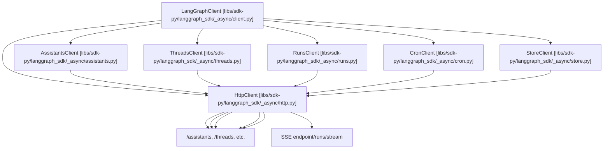
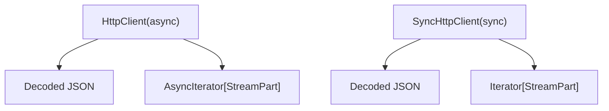
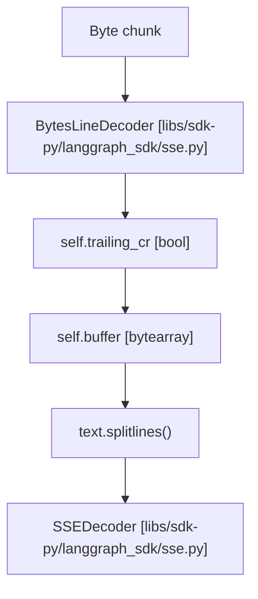

# HTTP 客户端与流式传输

相关源文件

-   [libs/sdk-py/langgraph_sdk/__init__.py](https://github.com/langchain-ai/langgraph/blob/1fd51e8f/libs/sdk-py/langgraph_sdk/__init__.py)
-   [libs/sdk-py/langgraph_sdk/cache.py](https://github.com/langchain-ai/langgraph/blob/1fd51e8f/libs/sdk-py/langgraph_sdk/cache.py)
-   [libs/sdk-py/langgraph_sdk/client.py](https://github.com/langchain-ai/langgraph/blob/1fd51e8f/libs/sdk-py/langgraph_sdk/client.py)
-   [libs/sdk-py/langgraph_sdk/errors.py](https://github.com/langchain-ai/langgraph/blob/1fd51e8f/libs/sdk-py/langgraph_sdk/errors.py)
-   [libs/sdk-py/langgraph_sdk/schema.py](https://github.com/langchain-ai/langgraph/blob/1fd51e8f/libs/sdk-py/langgraph_sdk/schema.py)
-   [libs/sdk-py/langgraph_sdk/sse.py](https://github.com/langchain-ai/langgraph/blob/1fd51e8f/libs/sdk-py/langgraph_sdk/sse.py)
-   [libs/sdk-py/pyproject.toml](https://github.com/langchain-ai/langgraph/blob/1fd51e8f/libs/sdk-py/pyproject.toml)
-   [libs/sdk-py/tests/test_api_parity.py](https://github.com/langchain-ai/langgraph/blob/1fd51e8f/libs/sdk-py/tests/test_api_parity.py)
-   [libs/sdk-py/tests/test_cache.py](https://github.com/langchain-ai/langgraph/blob/1fd51e8f/libs/sdk-py/tests/test_cache.py)
-   [libs/sdk-py/tests/test_client_stream.py](https://github.com/langchain-ai/langgraph/blob/1fd51e8f/libs/sdk-py/tests/test_client_stream.py)
-   [libs/sdk-py/tests/test_crons_client.py](https://github.com/langchain-ai/langgraph/blob/1fd51e8f/libs/sdk-py/tests/test_crons_client.py)
-   [libs/sdk-py/tests/test_errors.py](https://github.com/langchain-ai/langgraph/blob/1fd51e8f/libs/sdk-py/tests/test_errors.py)

本文档描述 LangGraph Python SDK 中的 HTTP 客户端层，该层负责与 LangGraph API 服务器通信。内容涵盖使用 `orjson` 进行 JSON 序列化、用于实时图执行更新的 Server-Sent Events (SSE) 流式传输，以及用于增强流式可靠性的自动重连逻辑。

关于使用该 HTTP 层的顶层 SDK 客户端信息，请参见 [Python SDK](/langchain-ai/langgraph/5.1-python-sdk)。关于认证与授权，请参见 [Authentication and Authorization](/langchain-ai/langgraph/5.4-authentication-and-authorization)。

## HTTP 客户端架构

SDK 提供两种 HTTP 客户端实现：用于异步操作的 `HttpClient`，以及用于同步操作的 `SyncHttpClient`。这两个类分别封装 `httpx.AsyncClient` 与 `httpx.Client`，并增加了 LangGraph 特有的错误处理与内容处理能力。

### HttpClient 类

`HttpClient` 类处理发往 LangGraph API 的全部异步 HTTP 操作。它由 `LangGraphClient` 实例化，并在所有子客户端（assistants、threads、runs、crons、store）之间共享。

**代码实体映射：异步客户端架构**

来源: [libs/sdk-py/langgraph_sdk/client.py12-21](https://github.com/langchain-ai/langgraph/blob/1fd51e8f/libs/sdk-py/langgraph_sdk/client.py#L12-L21) [libs/sdk-py/langgraph_sdk/client.py33-55](https://github.com/langchain-ai/langgraph/blob/1fd51e8f/libs/sdk-py/langgraph_sdk/client.py#L33-L55)

### 请求方法

`HttpClient` 提供标准 HTTP 方法，并带有一致的错误处理：

| 方法 | 用途 | 返回类型 |
| --- | --- | --- |
| `get(path, params, headers)` | GET 请求 | 解码后的 JSON |
| `post(path, json, params, headers)` | POST 请求 | 解码后的 JSON |
| `put(path, json, params, headers)` | PUT 请求 | 解码后的 JSON |
| `patch(path, json, params, headers)` | PATCH 请求 | 解码后的 JSON |
| `delete(path, json, params, headers)` | DELETE 请求 | None |
| `stream(path, method, json, params, headers)` | SSE 流式 | `AsyncIterator[StreamPart]` |

所有方法都会调用 `_araise_for_status_typed()` 在 HTTP 错误时抛出类型化异常，并使用 `_aencode_json()` / `_adecode_json()` 进行 JSON 序列化。

来源: [libs/sdk-py/langgraph_sdk/errors.py213-221](https://github.com/langchain-ai/langgraph/blob/1fd51e8f/libs/sdk-py/langgraph_sdk/errors.py#L213-L221) [libs/sdk-py/langgraph_sdk/client.py18](https://github.com/langchain-ai/langgraph/blob/1fd51e8f/libs/sdk-py/langgraph_sdk/client.py#L18-L18)

### SyncHttpClient 类

`SyncHttpClient` 提供与 `HttpClient` 完全一致的接口，但使用同步方法。它封装 `httpx.Client`，并由 `SyncLanggraphClient` 使用。

这两个实现保持 API 对等，唯一差别在于异步与同步执行方式。测试通过比较函数签名和返回注解以程序化方式验证该对等性。

来源: [libs/sdk-py/langgraph_sdk/client.py26-31](https://github.com/langchain-ai/langgraph/blob/1fd51e8f/libs/sdk-py/langgraph_sdk/client.py#L26-L31) [libs/sdk-py/tests/test_api_parity.py51-61](https://github.com/langchain-ai/langgraph/blob/1fd51e8f/libs/sdk-py/tests/test_api_parity.py#L51-L61)

## JSON 序列化

SDK 使用 `orjson` 进行快速、功能丰富的 JSON 序列化。根据包配置，`orjson` 是必需依赖。

来源: [libs/sdk-py/pyproject.toml14](https://github.com/langchain-ai/langgraph/blob/1fd51e8f/libs/sdk-py/pyproject.toml#L14-L14)

### 编码与解码

异步与同步上下文均提供了编码与解码函数：

-   **Async:** `_aencode_json` 和 `_adecode_json` [libs/sdk-py/langgraph_sdk/client.py48-49](https://github.com/langchain-ai/langgraph/blob/1fd51e8f/libs/sdk-py/langgraph_sdk/client.py#L48-L49)
-   **Sync:** `_encode_json` 和 `_decode_json` [libs/sdk-py/langgraph_sdk/client.py50-51](https://github.com/langchain-ai/langgraph/blob/1fd51e8f/libs/sdk-py/langgraph_sdk/client.py#L50-L51)

SDK 会将复杂类型转换为可 JSON 序列化格式。如果 `orjson` 不能原生序列化对象，SDK 会为 Pydantic 模型（v1 和 v2）以及集合类型提供回退逻辑。

来源: [libs/sdk-py/langgraph_sdk/client.py48-51](https://github.com/langchain-ai/langgraph/blob/1fd51e8f/libs/sdk-py/langgraph_sdk/client.py#L48-L51)

## Server-Sent Events (SSE) 流式传输

SDK 实现了完整的 Server-Sent Events (SSE) 支持，用于流式传输图执行更新。SSE 是一种基于文本的协议，服务器将事件按换行分隔文本发送。

### StreamPart 结构

事件会被解析为 `StreamPart` 结构。SDK 针对不同流模式定义了多种专用 stream part 类型，例如 `ValuesStreamPart`、`UpdatesStreamPart` 和 `DebugStreamPart`。

来源: [libs/sdk-py/langgraph_sdk/schema.py51-72](https://github.com/langchain-ai/langgraph/blob/1fd51e8f/libs/sdk-py/langgraph_sdk/schema.py#L51-L72) [libs/sdk-py/tests/test_client_stream.py13-28](https://github.com/langchain-ai/langgraph/blob/1fd51e8f/libs/sdk-py/tests/test_client_stream.py#L13-L28)

### BytesLineDecoder

`BytesLineDecoder` 负责从分块字节流中增量拆分行。它依据 SSE 规范正确处理通用换行符（`\n`、`\r` 和 `\r\n`）。

**代码实体映射：SSE 解码流**

该解码器为不完整行维护缓冲区，并通过将尾部 `\r` 推迟到下一轮迭代来处理边界情况。

来源: [libs/sdk-py/langgraph_sdk/sse.py17-66](https://github.com/langchain-ai/langgraph/blob/1fd51e8f/libs/sdk-py/langgraph_sdk/sse.py#L17-L66)

### SSEDecoder

`SSEDecoder` 实现了从按行分隔流中解析字段-值对的逻辑。

1.  **字段解析：**按 `:` 字符拆分行，以提取 `event`、`data`、`id` 和 `retry` 字段。[libs/sdk-py/langgraph_sdk/sse.py119-137](https://github.com/langchain-ai/langgraph/blob/1fd51e8f/libs/sdk-py/langgraph_sdk/sse.py#L119-L137)
2.  **数据累积：**单个事件中的多条 `data:` 行会拼接到缓冲区。[libs/sdk-py/langgraph_sdk/sse.py127-128](https://github.com/langchain-ai/langgraph/blob/1fd51e8f/libs/sdk-py/langgraph_sdk/sse.py#L127-L128)
3.  **事件冲刷：**空行表示事件结束，此时会将累积数据解析为 JSON，并以 `StreamPart` 产出。[libs/sdk-py/langgraph_sdk/sse.py103-114](https://github.com/langchain-ai/langgraph/blob/1fd51e8f/libs/sdk-py/langgraph_sdk/sse.py#L103-L114)

来源: [libs/sdk-py/langgraph_sdk/sse.py78-139](https://github.com/langchain-ai/langgraph/blob/1fd51e8f/libs/sdk-py/langgraph_sdk/sse.py#L78-L139)

## 错误处理

SDK 将 HTTP 状态码映射到特定异常类，以实现精确错误处理。

### APIStatusError 层级

所有 HTTP 错误响应（状态码 >= 400）都会转换为类型化异常：

| 状态码 | 异常类 |
| --- | --- |
| 400 | `BadRequestError` |
| 401 | `AuthenticationError` |
| 403 | `PermissionDeniedError` |
| 404 | `NotFoundError` |
| 409 | `ConflictError` |
| 422 | `UnprocessableEntityError` |
| 429 | `RateLimitError` |
| 5xx | `InternalServerError` |

来源: [libs/sdk-py/langgraph_sdk/errors.py108-137](https://github.com/langchain-ai/langgraph/blob/1fd51e8f/libs/sdk-py/langgraph_sdk/errors.py#L108-L137) [libs/sdk-py/langgraph_sdk/errors.py190-210](https://github.com/langchain-ai/langgraph/blob/1fd51e8f/libs/sdk-py/langgraph_sdk/errors.py#L190-L210)

### 错误解码

发生错误时，SDK 会尝试解码错误响应体以提取描述性消息。它会在 JSON 响应中查找 `message`、`detail` 或 `error` 键。

来源: [libs/sdk-py/langgraph_sdk/errors.py140-155](https://github.com/langchain-ai/langgraph/blob/1fd51e8f/libs/sdk-py/langgraph_sdk/errors.py#L140-L155) [libs/sdk-py/langgraph_sdk/errors.py174-188](https://github.com/langchain-ai/langgraph/blob/1fd51e8f/libs/sdk-py/langgraph_sdk/errors.py#L174-L188)

## 测试基础设施

SDK 包含了针对流式传输与错误映射的全面测试：

-   **流式测试：**`test_client_stream.py` 验证 SSE 解析、尾部事件冲刷与重连逻辑。[libs/sdk-py/tests/test_client_stream.py92-156](https://github.com/langchain-ai/langgraph/blob/1fd51e8f/libs/sdk-py/tests/test_client_stream.py#L92-L156)
-   **错误映射测试：**`test_errors.py` 确保 HTTP 状态码能正确映射到对应 `APIStatusError` 子类，并正确提取错误消息。[libs/sdk-py/tests/test_errors.py43-56](https://github.com/langchain-ai/langgraph/blob/1fd51e8f/libs/sdk-py/tests/test_errors.py#L43-L56)
-   **API 对等性：**通过程序化检查确保同步客户端与异步客户端的 API 表面完全一致。[libs/sdk-py/tests/test_api_parity.py51-61](https://github.com/langchain-ai/langgraph/blob/1fd51e8f/libs/sdk-py/tests/test_api_parity.py#L51-L61)

来源: [libs/sdk-py/tests/test_client_stream.py1-249](https://github.com/langchain-ai/langgraph/blob/1fd51e8f/libs/sdk-py/tests/test_client_stream.py#L1-L249) [libs/sdk-py/tests/test_errors.py1-145](https://github.com/langchain-ai/langgraph/blob/1fd51e8f/libs/sdk-py/tests/test_errors.py#L1-L145)
