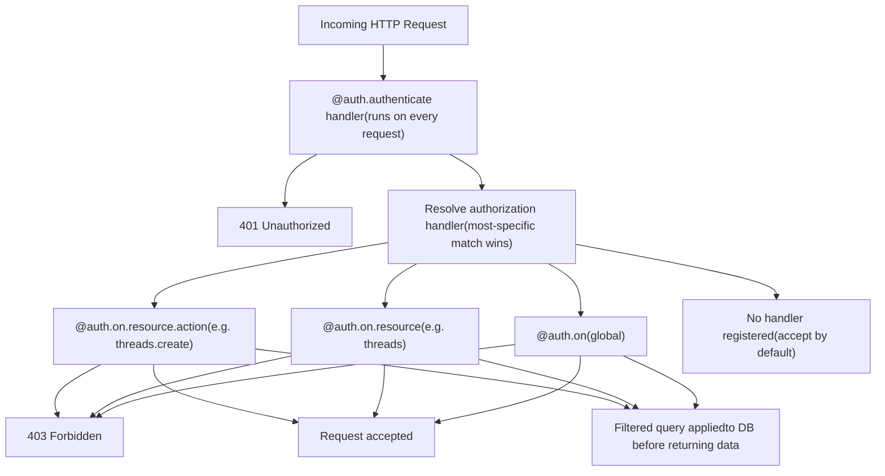
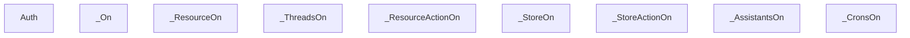
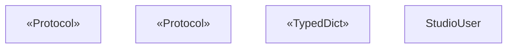
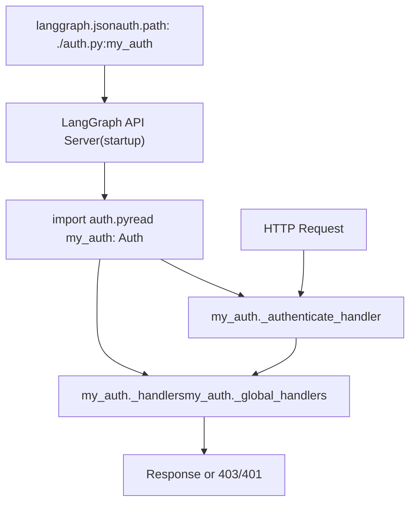

# 认证与授权

相关源文件

-   [libs/sdk-py/langgraph_sdk/auth/__init__.py](https://github.com/langchain-ai/langgraph/blob/1fd51e8f/libs/sdk-py/langgraph_sdk/auth/__init__.py)
-   [libs/sdk-py/langgraph_sdk/auth/exceptions.py](https://github.com/langchain-ai/langgraph/blob/1fd51e8f/libs/sdk-py/langgraph_sdk/auth/exceptions.py)
-   [libs/sdk-py/langgraph_sdk/auth/types.py](https://github.com/langchain-ai/langgraph/blob/1fd51e8f/libs/sdk-py/langgraph_sdk/auth/types.py)

本页记录 `langgraph-sdk` Python 包中可用的认证与授权系统。它涵盖 `Auth` 类、如何注册认证与授权处理器、用于服务端查询过滤的 `FilterType`、全部相关用户与上下文类型，以及如何通过 `langgraph.json` 把这些内容接入。

关于 HTTP 客户端层与错误类型（包括在客户端侧认证失败时抛出的 `AuthenticationError`、`PermissionDeniedError`），请参见 [HTTP Client and Streaming](/langchain-ai/langgraph/5.3-http-client-and-streaming)。关于 `langgraph.json` 的 `auth` 配置块，请参见 [Configuration System (langgraph.json)](/langchain-ai/langgraph/6.2-configuration-system-(langgraph.json)).

---

## 概览

认证系统包含两个彼此独立的阶段，它们会在 LangGraph API 服务器端对每个传入请求执行：

1.  **Authentication** —— 验证调用方身份并产出用户对象。
2.  **Authorization** —— 决定已认证用户是否可对目标资源执行目标操作，并可选择注入过滤器来限制返回数据。

这两个阶段都通过以下方式配置：在 Python 模块中创建一个 `Auth` 实例，使用装饰器在其上注册处理器，并在 `langgraph.json` 中指向该模块。

**请求处理流程：**


来源: [libs/sdk-py/langgraph_sdk/auth/__init__.py96-107](https://github.com/langchain-ai/langgraph/blob/1fd51e8f/libs/sdk-py/langgraph_sdk/auth/__init__.py#L96-L107)

---

## `Auth` 类

`Auth` 定义于 [libs/sdk-py/langgraph_sdk/auth/__init__.py13-301](https://github.com/langchain-ai/langgraph/blob/1fd51e8f/libs/sdk-py/langgraph_sdk/auth/__init__.py#L13-L301)，并直接由 `langgraph_sdk` 导出。

```
from langgraph_sdk import Auth
```
每个模块只需实例化一次；然后使用它的装饰器注册处理器。

| 属性 / 方法 | 类型 | 用途 |
| --- | --- | --- |
| `authenticate` | decorator | 注册唯一的认证处理器 |
| `on` | `_On` instance | 所有授权处理器注册的入口 |
| `types` | module reference | 指向 `langgraph_sdk.auth.types` 的快捷方式 |
| `exceptions` | module reference | 指向 `langgraph_sdk.auth.exceptions` 的快捷方式 |

**内部状态**（由 API 服务器在运行时访问）：

| Slot | 类型 | 用途 |
| --- | --- | --- |
| `_authenticate_handler` | `Authenticator | None` | 唯一注册的认证函数 |
| `_handlers` | `dict[tuple[str,str], list[Handler]]` | 按 `(resource, action)` 存储的处理器列表 |
| `_global_handlers` | `list[Handler]` | 在不带 resource/action 的 `@auth.on` 上注册的处理器 |
| `_handler_cache` | `dict[tuple[str,str], Handler]` | 已解析处理器缓存 |

来源: [libs/sdk-py/langgraph_sdk/auth/__init__.py109-224](https://github.com/langchain-ai/langgraph/blob/1fd51e8f/libs/sdk-py/langgraph_sdk/auth/__init__.py#L109-L224)

---

## 认证 —— `@auth.authenticate`

注册一个异步函数作为凭证校验器。每个 `Auth` 实例最多只能注册一个认证器 [libs/sdk-py/langgraph_sdk/auth/__init__.py225-231](https://github.com/langchain-ai/langgraph/blob/1fd51e8f/libs/sdk-py/langgraph_sdk/auth/__init__.py#L225-L231)

服务器会按名称向处理器注入以下参数（可声明任意子集）：

| 参数 | 类型 | 描述 |
| --- | --- | --- |
| `request` | `Request` | 原始 ASGI 请求对象 |
| `body` | `dict` | 已解析请求体 |
| `path` | `str` | URL 路径，例如 `/threads/…/runs/…/stream` |
| `method` | `str` | HTTP 方法，例如 `GET` |
| `path_params` | `dict[str, str] | None` | URL 路径参数 |
| `query_params` | `dict[str, str] | None` | URL 查询参数 |
| `headers` | `dict[bytes, bytes] | None` | 请求头 |
| `authorization` | `str | None` | `Authorization` 请求头的值 |

处理器必须返回以下之一：

-   一个 `str`（视为 `identity`）
-   一个 `MinimalUserDict`（带必填 `identity` 的 TypedDict）
-   任意实现 `MinimalUser` 或 `BaseUser` 的对象
-   任意 `Mapping[str, Any]`，且至少包含一个 `"identity"` 键

若认证失败，抛出 `Auth.exceptions.HTTPException(status_code=401, ...)` [libs/sdk-py/langgraph_sdk/auth/exceptions.py9-44](https://github.com/langchain-ai/langgraph/blob/1fd51e8f/libs/sdk-py/langgraph_sdk/auth/exceptions.py#L9-L44)

**用法示例：**

```
@auth.authenticateasync def authenticate(authorization: str) -> Auth.types.MinimalUserDict:    user = await verify_token(authorization)    if not user:        raise Auth.exceptions.HTTPException(status_code=401, detail="Unauthorized")    return {"identity": user["id"], "permissions": user.get("permissions", [])}
```
来源: [libs/sdk-py/langgraph_sdk/auth/__init__.py225-301](https://github.com/langchain-ai/langgraph/blob/1fd51e8f/libs/sdk-py/langgraph_sdk/auth/__init__.py#L225-L301) [libs/sdk-py/langgraph_sdk/auth/types.py277-370](https://github.com/langchain-ai/langgraph/blob/1fd51e8f/libs/sdk-py/langgraph_sdk/auth/types.py#L277-L370)

---

## 授权 —— `auth.on`

`auth.on` 是 `_On` 的一个实例 [libs/sdk-py/langgraph_sdk/auth/__init__.py130](https://github.com/langchain-ai/langgraph/blob/1fd51e8f/libs/sdk-py/langgraph_sdk/auth/__init__.py#L130-L130) 它是注册授权处理器的根入口，支持三个不同粒度层级。

**授权处理器类结构：**


来源: [libs/sdk-py/langgraph_sdk/auth/__init__.py318-744](https://github.com/langchain-ai/langgraph/blob/1fd51e8f/libs/sdk-py/langgraph_sdk/auth/__init__.py#L318-L744)

### 处理器层级

**全局处理器** —— 适用于所有未被更具体处理器匹配到的资源与操作：

```
@auth.onasync def deny_all(ctx: Auth.types.AuthContext, value: Any) -> bool:    return False
```
**资源级处理器** —— 适用于指定资源上的所有操作：

```
@auth.on.threadsasync def allow_threads(ctx: Auth.types.AuthContext, value: Any) -> Auth.types.FilterType:    return {"owner": ctx.user.identity}
```
**资源 + 操作处理器** —— 最具体；覆盖上面两类：

```
@auth.on.threads.createasync def on_thread_create(ctx: Auth.types.AuthContext, value: Auth.types.ThreadsCreate):    value.setdefault("metadata", {})["owner"] = ctx.user.identity
```
**多资源 / 多操作** —— 参数化形式：

```
@auth.on(resources=["threads", "assistants"], actions=["read", "search"])async def allow_reads(ctx: Auth.types.AuthContext, value: Any) -> Auth.types.FilterType:    return {"owner": ctx.user.identity}
```
### 处理器优先级

当请求到达时，服务器会选择最具体的已注册处理器：

```
(resource, action)  →  (resource, "*")  →  global  →  accept (no handler)
```
每个请求仅调用一个处理器。第一个匹配层级获胜 [libs/sdk-py/langgraph_sdk/auth/__init__.py96-107](https://github.com/langchain-ai/langgraph/blob/1fd51e8f/libs/sdk-py/langgraph_sdk/auth/__init__.py#L96-L107)

### 处理器签名

每个授权处理器都必须是 `async`，且按名称恰好接受两个参数 [libs/sdk-py/langgraph_sdk/auth/__init__.py140-142](https://github.com/langchain-ai/langgraph/blob/1fd51e8f/libs/sdk-py/langgraph_sdk/auth/__init__.py#L140-L142)：

| 参数 | 类型 | 描述 |
| --- | --- | --- |
| `ctx` | `AuthContext` | 已认证用户、权限、资源、操作 |
| `value` | resource-specific TypedDict | 操作负载（见下方各资源 value 类型） |

---

## 处理器返回值

| 返回值 | 含义 |
| --- | --- |
| `None` 或 `True` | 接受请求 |
| `False` | 以 HTTP 403 拒绝 |
| `FilterType` | 在返回数据前将过滤器应用到数据库查询 |

`HandlerResult` 在 [libs/sdk-py/langgraph_sdk/auth/types.py138-143](https://github.com/langchain-ai/langgraph/blob/1fd51e8f/libs/sdk-py/langgraph_sdk/auth/types.py#L138-L143) 中定义为 `None | bool | FilterType`

---

## `FilterType`

`FilterType` [libs/sdk-py/langgraph_sdk/auth/types.py58-109](https://github.com/langchain-ai/langgraph/blob/1fd51e8f/libs/sdk-py/langgraph_sdk/auth/types.py#L58-L109) 是授权处理器返回的一个 `dict`，用于限制服务器返回哪些记录。服务器会将其作为等价 WHERE 条件应用。

**支持的操作符：**

| 语法 | 含义 |
| --- | --- |
| `{"field": "value"}` | 精确匹配（简写） |
| `{"field": {"$eq": "value"}}` | 精确匹配（显式） |
| `{"field": {"$contains": "value"}}` | 字段 list/set 包含 `value` |
| `{"field": {"$contains": ["v1", "v2"]}}` | 字段 list/set 同时包含 `v1`、`v2` |
| 多个键 | 所有条件逻辑与（AND） |

**示例：**

```
# Exact match{"owner": ctx.user.identity} # Membership check{"participants": {"$contains": ctx.user.identity}} # AND combination{"owner": ctx.user.identity, "participants": {"$contains": "user-efgh456"}}
```
> 子集包含（使用 list 的 `$contains`）要求 `langgraph-runtime-inmem >= 0.14.1` [libs/sdk-py/langgraph_sdk/auth/types.py75-76](https://github.com/langchain-ai/langgraph/blob/1fd51e8f/libs/sdk-py/langgraph_sdk/auth/types.py#L75-L76)

来源: [libs/sdk-py/langgraph_sdk/auth/types.py58-109](https://github.com/langchain-ai/langgraph/blob/1fd51e8f/libs/sdk-py/langgraph_sdk/auth/types.py#L58-L109)

---

## 用户类型

**用户对象的类 / 类型层级：**


| 类型 | 位置 | 用途 |
| --- | --- | --- |
| `MinimalUser` | [libs/sdk-py/langgraph_sdk/auth/types.py150-161](https://github.com/langchain-ai/langgraph/blob/1fd51e8f/libs/sdk-py/langgraph_sdk/auth/types.py#L150-L161) | Protocol：仅要求 `identity` 属性 |
| `MinimalUserDict` | [libs/sdk-py/langgraph_sdk/auth/types.py164-178](https://github.com/langchain-ai/langgraph/blob/1fd51e8f/libs/sdk-py/langgraph_sdk/auth/types.py#L164-L178) | 大多数认证器返回的 TypedDict |
| `BaseUser` | [libs/sdk-py/langgraph_sdk/auth/types.py181-215](https://github.com/langchain-ai/langgraph/blob/1fd51e8f/libs/sdk-py/langgraph_sdk/auth/types.py#L181-L215) | 完整 ASGI 用户协议 |
| `StudioUser` | [libs/sdk-py/langgraph_sdk/auth/types.py218-275](https://github.com/langchain-ai/langgraph/blob/1fd51e8f/libs/sdk-py/langgraph_sdk/auth/types.py#L218-L275) | 来自 LangGraph Studio UI 的请求会填充该类型 |
| `Authenticator` | [libs/sdk-py/langgraph_sdk/auth/types.py277-370](https://github.com/langchain-ai/langgraph/blob/1fd51e8f/libs/sdk-py/langgraph_sdk/auth/types.py#L277-L370) | 认证函数的 `Callable` 类型别名 |

### `StudioUser`

当请求来源于 LangGraph Studio 前端时，`StudioUser` 会被设置为 `ctx.user`。可在 `langgraph.json` 中禁用 Studio auth [libs/sdk-py/langgraph_sdk/auth/types.py223-229](https://github.com/langchain-ai/langgraph/blob/1fd51e8f/libs/sdk-py/langgraph_sdk/auth/types.py#L223-L229)：

```
{  "auth": {    "disable_studio_auth": true  }}
```
使用 `isinstance(ctx.user, Auth.types.StudioUser)`（在 `@auth.on` 处理器内部）进行判断，可在对终端用户应用正常规则的同时，为开发者提供直通访问 [libs/sdk-py/langgraph_sdk/auth/types.py231-245](https://github.com/langchain-ai/langgraph/blob/1fd51e8f/libs/sdk-py/langgraph_sdk/auth/types.py#L231-L245)

来源: [libs/sdk-py/langgraph_sdk/auth/types.py150-275](https://github.com/langchain-ai/langgraph/blob/1fd51e8f/libs/sdk-py/langgraph_sdk/auth/types.py#L150-L275)

---

## `AuthContext`

`AuthContext` [libs/sdk-py/langgraph_sdk/auth/types.py388-426](https://github.com/langchain-ai/langgraph/blob/1fd51e8f/libs/sdk-py/langgraph_sdk/auth/types.py#L388-L426) 是注入到每个授权处理器中的 `ctx` 对象。

| 字段 | 类型 | 描述 |
| --- | --- | --- |
| `user` | `BaseUser` | 已认证用户对象 |
| `permissions` | `Sequence[str]` | 用户权限列表 |
| `resource` | `Literal["runs","threads","crons","assistants","store"]` | 正在访问的资源 |
| `action` | `Literal[...]` | 正在执行的操作 |

**按资源划分的操作：**

| 资源 | 操作 |
| --- | --- |
| `threads` | `create`, `read`, `update`, `delete`, `search`, `create_run` |
| `assistants` | `create`, `read`, `update`, `delete`, `search` |
| `crons` | `create`, `read`, `update`, `delete`, `search` |
| `store` | `put`, `get`, `search`, `delete`, `list_namespaces` |

来源: [libs/sdk-py/langgraph_sdk/auth/types.py373-426](https://github.com/langchain-ai/langgraph/blob/1fd51e8f/libs/sdk-py/langgraph_sdk/auth/types.py#L373-L426)

---

## 资源 value TypedDicts

授权处理器中的 `value` 参数是一个与资源和操作对应的 TypedDict。全部定义于 [libs/sdk-py/langgraph_sdk/auth/types.py](https://github.com/langchain-ai/langgraph/blob/1fd51e8f/libs/sdk-py/langgraph_sdk/auth/types.py)

**Threads：**

| Action | TypedDict | 关键字段 |
| --- | --- | --- |
| `create` | `ThreadsCreate` | `thread_id`, `metadata`, `if_exists`, `ttl` |
| `read` | `ThreadsRead` | `thread_id`, `run_id` |
| `update` | `ThreadsUpdate` | `thread_id`, `metadata`, `action` |
| `delete` | `ThreadsDelete` | `thread_id`, `run_id` |
| `search` | `ThreadsSearch` | `metadata`, `values`, `status`, `limit`, `offset` |
| `create_run` | `RunsCreate` | `thread_id`, `assistant_id`, `run_id`, `metadata`, `kwargs` |

**Store** [libs/sdk-py/langgraph_sdk/auth/types.py844-934](https://github.com/langchain-ai/langgraph/blob/1fd51e8f/libs/sdk-py/langgraph_sdk/auth/types.py#L844-L934):

| Action | TypedDict | 关键字段 |
| --- | --- | --- |
| `put` | `StorePut` | `namespace`, `key`, `value`, `ttl` |
| `get` | `StoreGet` | `namespace`, `key` |
| `search` | `StoreSearch` | `namespace`, `query`, `filter`, `limit`, `offset` |
| `delete` | `StoreDelete` | `namespace`, `key` |
| `list_namespaces` | `StoreListNamespaces` | `prefix`, `suffix`, `max_depth`, `limit`, `offset` |

> 对 store 资源而言，`value` 是可变对象。修改 `value["namespace"]` 会重写实际操作使用的命名空间——这是按用户作用域约束 store 访问的标准模式 [libs/sdk-py/langgraph_sdk/auth/__init__.py88-94](https://github.com/langchain-ai/langgraph/blob/1fd51e8f/libs/sdk-py/langgraph_sdk/auth/__init__.py#L88-L94)

来源: [libs/sdk-py/langgraph_sdk/auth/types.py443](https://github.com/langchain-ai/langgraph/blob/1fd51e8f/libs/sdk-py/langgraph_sdk/auth/types.py#L443-LNaN)

---

## 接入 `langgraph.json`

`Auth` 实例会在 LangGraph API 服务器启动时加载。通过 `auth.path` 键在 `langgraph.json` 中指向它 [libs/sdk-py/langgraph_sdk/auth/__init__.py26-38](https://github.com/langchain-ai/langgraph/blob/1fd51e8f/libs/sdk-py/langgraph_sdk/auth/__init__.py#L26-L38)：

```
{  "dependencies": ["."],  "graphs": {    "agent": "./my_agent/agent.py:graph"  },  "env": ".env",  "auth": {    "path": "./auth.py:my_auth"  }}
```
`path` 的值格式为 `<module_path>:<variable_name>`。

**从配置到请求处理的认证流程：**


来源: [libs/sdk-py/langgraph_sdk/auth/__init__.py26-40](https://github.com/langchain-ai/langgraph/blob/1fd51e8f/libs/sdk-py/langgraph_sdk/auth/__init__.py#L26-L40)

---

## 异常

`Auth.exceptions` 是对 `langgraph_sdk.auth.exceptions` 模块的引用。在认证处理器中使用 `Auth.exceptions.HTTPException` 返回结构化错误响应 [libs/sdk-py/langgraph_sdk/auth/exceptions.py9-57](https://github.com/langchain-ai/langgraph/blob/1fd51e8f/libs/sdk-py/langgraph_sdk/auth/exceptions.py#L9-L57)：

```
raise Auth.exceptions.HTTPException(status_code=401, detail="Invalid token")
```
来源: [libs/sdk-py/langgraph_sdk/auth/exceptions.py1-60](https://github.com/langchain-ai/langgraph/blob/1fd51e8f/libs/sdk-py/langgraph_sdk/auth/exceptions.py#L1-L60) [libs/sdk-py/langgraph_sdk/auth/__init__.py121-127](https://github.com/langchain-ai/langgraph/blob/1fd51e8f/libs/sdk-py/langgraph_sdk/auth/__init__.py#L121-L127)

---

## 完整处理器模式参考

下图汇总了每种资源与操作组合应使用的装饰器。

```mermaid
flowchart TD
    ON["auth.on"]
    GLOBAL["_global_handlerskey: ('','')"]
    TH["auth.on.threads_ThreadsOn"]
    AS["auth.on.assistants_AssistantsOn"]
    CR["auth.on.crons_CronsOn"]
    ST["auth.on.store_StoreOn"]
    TH_ALL["('threads','*')"]
    TH_C["auth.on.threads.create('threads','create')"]
    TH_R["auth.on.threads.read('threads','read')"]
    TH_U["auth.on.threads.update('threads','update')"]
    TH_D["auth.on.threads.delete('threads','delete')"]
    TH_S["auth.on.threads.search('threads','search')"]
    TH_CR["auth.on.threads.create_run('threads','create_run')"]
    AS_ALL["('assistants','*')"]
    AS_C["auth.on.assistants.create"]
    AS_R["auth.on.assistants.read"]
    AS_D["auth.on.assistants.delete"]
    AS_S["auth.on.assistants.search"]
    ST_ALL["('store','*')"]
    ST_P["auth.on.store.put('store','put')"]
    ST_G["auth.on.store.get('store','get')"]
    ST_S["auth.on.store.search('store','search')"]
    ST_D["auth.on.store.delete('store','delete')"]
    ST_L["auth.on.store.list_namespaces('store','list_namespaces')"]

    ON --> GLOBAL
    ON --> TH
    ON --> AS
    ON --> CR
    ON --> ST
    TH --> TH_ALL
    TH --> TH_C
    TH --> TH_R
    TH --> TH_U
    TH --> TH_D
    TH --> TH_S
    TH --> TH_CR
    AS --> AS_ALL
    AS --> AS_C
    AS --> AS_R
    AS --> AS_D
    AS --> AS_S
    ST --> ST_ALL
    ST --> ST_P
    ST --> ST_G
    ST --> ST_S
    ST --> ST_D
    ST --> ST_L
```


来源: [libs/sdk-py/langgraph_sdk/auth/__init__.py440-744](https://github.com/langchain-ai/langgraph/blob/1fd51e8f/libs/sdk-py/langgraph_sdk/auth/__init__.py#L440-L744)
